# Enterprise Architecture
## National Furniture & Interiors — Platform Architecture

**Prepared by:** Principal Software Architect (AI-assisted)
**Date:** 2026-08-07
**Depends on:** `docs/01_business_research.md` (business priority order: Interior Design Services → Lead Generation → Furniture eCommerce)
**Scope:** No implementation code — architecture, diagrams (Mermaid), and design decisions only.

---

## Revision History

| Version | Date | Change | Reason |
|---|---|---|---|
| v1.0 | 2026-08-07 | Initial version | — |
| v1.1 | 2026-08-07 | Added mandatory MFA + non-optional admin network hardening (§8.1, §9.1); added `DESIGNER` role and reconciled RBAC enforcement to permission-key granularity (§14); added CAPTCHA step to Lead Generation Flow (§10); added Transactional Outbox durability pattern to Lead Generation Flow and §16 (§10, §16); added atomic conditional-update requirement and multi-document transaction usage to Order Flow (§11); added installation-appointment step to Order Flow (§11); added Edge WAF/rate-limiting layer to High-Level Architecture (§4); added Next.js ISR revalidation step to Product Flow (§12); added corresponding items to the Production Readiness Checklist (§17) and ADR Summary (§18); appended new Return Flow (§20) | Resolves findings S1, B1/S2, A2, A3, D1, D2, B3, A1, P1 from `docs/00_architecture_review.md` |

---

## 0. Alignment With Business Priorities

The architecture is built as a **modular monolith with feature-based module boundaries**, not a premature microservices split. This is a deliberate decision, not a limitation:

| Business priority | Architectural consequence |
|---|---|
| Interior Design Services (#1) | `design-projects` and `leads` modules are first-class domains with their own entities, state machines, and services — not sub-features of `orders` |
| Lead Generation (#2) | `leads` module has dedicated scoring, routing, and notification concerns, decoupled from the generic `notifications` module via events |
| Furniture eCommerce (#3) | `catalog`, `cart`, `orders`, `payments` are fully featured but do not architecturally dominate the codebase — module boundaries keep them peers of, not parents of, the design/lead modules |

Module boundaries are drawn so that any module (e.g., `leads`, `design-projects`) can be **extracted into an independent service later** without a rewrite, per the Phase 2 roadmap in `01_business_research.md`. This is achieved through the Clean Architecture layering in Section 5 and the Repository Pattern in Section 7.

---

## 1. Architecture Principles & Non-Functional Requirements

| Principle | Applied as |
|---|---|
| Clean Architecture | Dependency rule: outer layers depend on inner layers, never the reverse. Domain layer has zero dependency on Express, Mongoose, or any framework. |
| SOLID | See Section 3 |
| Feature-Based Architecture | Code organized by business capability (`leads/`, `design-projects/`, `catalog/`), not by technical type (`controllers/`, `services/`) |
| Repository Pattern | All persistence access goes through an interface (`IXRepository`); Mongoose is one implementation, swappable in tests/future migrations |
| Service Layer | All business logic lives in application services, never in controllers or Mongoose models |
| Dependency Injection | Composition-root DI (constructor injection via a lightweight container) — see Section 7.3 for library choice and trade-offs |
| Scalability | Stateless API containers, horizontal scaling behind a load balancer, Redis for shared state, queue-based async processing |
| Modularity | Each feature module is independently testable and independently deployable in the target-state (Phase 2) architecture |
| Production Readiness | Centralized error handling, structured logging, observability, rate limiting, secrets management, health checks (Section 16–17) |

---

## 2. Technology Stack Mapping

| Layer | Technology | Responsibility |
|---|---|---|
| Web client (customer) | Next.js 15 (App Router), React, TypeScript, Tailwind CSS, Shadcn UI | SSR/ISR storefront, design-services marketing pages, lead capture forms, cart/checkout UI |
| Web client (admin) | Next.js 15, React, TypeScript, Tailwind CSS, Shadcn UI | Admin dashboard — leads, design projects, catalog, orders, reports (separate route group / separate app, shared component library) |
| API | Node.js, Express.js, TypeScript | REST API, business logic orchestration, auth, webhooks |
| Primary datastore | MongoDB + Mongoose | Documents for products, leads, design projects, orders, users |
| Cache / ephemeral state | Redis | Session/refresh-token store, catalog cache, rate limiting, distributed locks, BullMQ queue backend |
| Media storage & CDN | Cloudinary | Product images, portfolio/before-after images, design attachments; on-the-fly transformation and CDN delivery |
| Payments | Razorpay | Order payments, design-project milestone payments, webhook-driven reconciliation |
| Auth | JWT (access + refresh) | Stateless API auth, RBAC claims |
| Containerization | Docker (+ Docker Compose for local/staging; orchestrator for prod) | Environment parity, deployment unit |

---

## 3. SOLID Principles Applied

| Principle | Application in this architecture |
|---|---|
| **S**ingle Responsibility | Each service class owns one use-case family (e.g., `LeadScoringService` only scores leads; it does not persist or notify) |
| **O**pen/Closed | New payment methods or notification channels are added via new adapter implementations of existing interfaces (`IPaymentGateway`, `INotificationChannel`), without modifying consuming services |
| **L**iskov Substitution | Any `IRepository<T>` implementation (Mongoose today, a future Postgres/Prisma implementation) is interchangeable behind the interface without breaking services |
| **I**nterface Segregation | Narrow, purpose-specific interfaces (`ILeadRepository`, `IOrderRepository`) rather than one generic `IDatabase` god-interface |
| **D**ependency Inversion | Application/domain layers depend on abstractions (`IProductRepository`); Infrastructure provides concrete Mongoose implementations, injected at the composition root |

---

## 4. High-Level Architecture

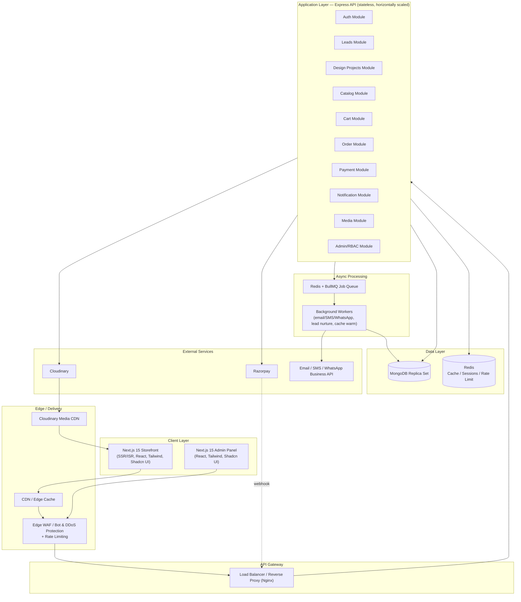

**Key decisions:**
- Admin Panel and Storefront are **two Next.js applications sharing a common component/design-system package**, not one app with route-level auth branching — reduces blast radius and bundle size for customer-facing pages.
- All synchronous business logic sits behind the load balancer in a stateless Express cluster; anything that can be deferred (notifications, lead nurture scheduling, cache warming) goes through BullMQ so API response times aren't coupled to third-party provider latency (email/WhatsApp/SMS).
- Razorpay communicates back via **webhook**, not just client-side callback — client-side payment confirmation is never trusted as the source of truth for order state (see Section 10).
- **An edge WAF/rate-limiting layer sits in front of Nginx**, ahead of the application-level Redis rate limiter (§16). Application-level limiting alone only acts after a request has already consumed Nginx/Node compute — for public, unauthenticated endpoints (lead capture, catalog search) that's too late against a volumetric attack or bot flood *(resolves review finding A1)*.

---

## 5. Low-Level Architecture (Clean Architecture Layers)

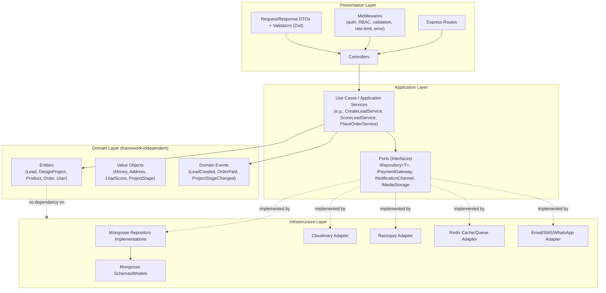

**Dependency rule:** arrows into `Domain` only; `Infrastructure` depends on `Application`'s port interfaces (dependency inversion), never the reverse. The dotted "implemented by" edges represent interface implementation, not a compile-time dependency from Domain/Application outward.

| Layer | Contains | Must NOT contain |
|---|---|---|
| Presentation | Express routes, controllers, middleware, request/response DTOs | Business logic, direct DB access |
| Application | Use-case classes (Services), port interfaces, orchestration | Mongoose imports, HTTP concerns |
| Domain | Entities, value objects, domain events, business rules/invariants | Any framework or library import |
| Infrastructure | Mongoose repositories/schemas, Cloudinary/Razorpay/Redis/messaging adapters | Business rules |

---

## 6. Module Diagram (Feature-Based Architecture)

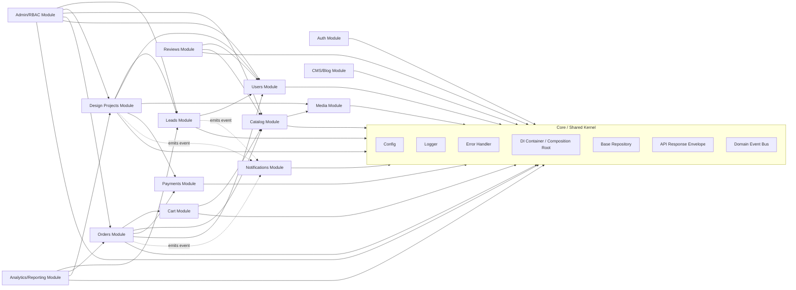

**Rule enforced:** feature modules never import another feature module's Infrastructure or Domain internals directly — cross-module interaction happens either through (a) an explicitly exported Application-layer service interface, or (b) domain events on the shared `EventBus`. This is what allows `Leads` or `DesignProjects` to be extracted into a separate service later (Phase 2) without touching other modules.

### 6.1 Backend Folder Structure (Feature-Based)

- `src/`
  - `core/` — config, logger, error handler, DI container, base repository, response envelope, event bus
  - `modules/`
    - `auth/` — domain, application (services), infrastructure (repository, adapters), presentation (routes, controllers, validators)
    - `users/` — same 4-layer sub-structure
    - `leads/` — same 4-layer sub-structure (includes lead-scoring domain logic)
    - `design-projects/` — same 4-layer sub-structure (includes project state machine)
    - `catalog/` — same 4-layer sub-structure (products, categories, collections)
    - `cart/` — same 4-layer sub-structure
    - `orders/` — same 4-layer sub-structure
    - `payments/` — same 4-layer sub-structure (Razorpay adapter lives here)
    - `reviews/` — same 4-layer sub-structure
    - `media/` — same 4-layer sub-structure (Cloudinary adapter lives here)
    - `notifications/` — same 4-layer sub-structure (email/SMS/WhatsApp adapters live here)
    - `cms/` — same 4-layer sub-structure (blog, banners, static pages)
    - `admin/` — RBAC, audit log
    - `analytics/` — reporting/read-models
  - `shared/` — cross-cutting types, DTOs shared across modules (kept minimal by design)
  - `app.ts` — Express app assembly
  - `server.ts` — process entry point
  - `composition-root.ts` — DI wiring for the whole application

### 6.2 Frontend Folder Structure (Next.js 15, Feature-Based)

- `apps/storefront/` (customer-facing Next.js app)
  - `app/` — App Router routes grouped by feature: `(marketing)`, `(interior-design)`, `(catalog)`, `(cart-checkout)`, `(account)`
  - `features/` — `leads/`, `design-projects/`, `catalog/`, `cart/`, `orders/` — each with components, hooks, API client, types
  - `components/ui/` — Shadcn UI primitives
  - `lib/` — API client, auth utilities, formatters
- `apps/admin/` (admin-facing Next.js app)
  - `app/` — route groups per module: `(leads)`, `(design-projects)`, `(catalog)`, `(orders)`, `(reports)`
  - `features/` — mirrors backend module names for 1:1 traceability
  - `components/ui/` — shared Shadcn UI primitives (via shared package)
- `packages/ui/` — shared Shadcn UI/Tailwind design system consumed by both apps
- `packages/api-client/` — typed API client (shared request/response types) consumed by both apps

---

## 7. Component Diagram

Deep dive into a single module (**Design Projects** — chosen because it is business priority #1) to show the internal component wiring pattern used consistently across all modules.

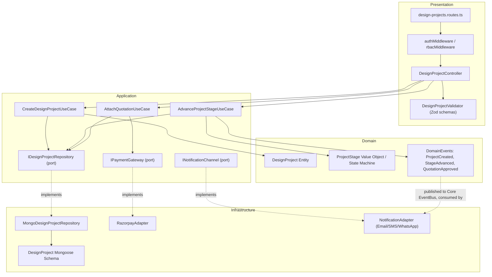

**DI wiring (composition root, conceptual — not code):** at application bootstrap, the composition root constructs `MongoDesignProjectRepository`, `RazorpayAdapter`, and `NotificationAdapter`, then injects them into `CreateDesignProjectUseCase`, `AdvanceProjectStageUseCase`, and `AttachQuotationUseCase` via their constructors. Controllers receive fully-wired use-case instances — they never construct dependencies themselves.

### 7.1 Repository Pattern — Contract

Every module defines its own narrow repository interface (Interface Segregation), for example: `IDesignProjectRepository` exposes only `create`, `findById`, `findByLeadId`, `updateStage`, `list` — not a generic CRUD-everything interface. The Mongoose implementation lives in Infrastructure and is the only place `mongoose.Schema`/`mongoose.model` appear for that aggregate.

### 7.2 Service Layer — Contract

Application services (use cases) are the **only** place business rules are evaluated (e.g., "a design project cannot move from `quotation_sent` to `execution` without an `advance_payment` event"). Controllers only translate HTTP ⇄ use-case calls; they contain no `if` business-rule branching.

### 7.3 Dependency Injection — Approach and Trade-off

| Option | Trade-off |
|---|---|
| **Manual composition root** (plain TypeScript, constructor injection, no DI framework) — **recommended** | Zero extra dependency, fully explicit, easy to trace; slightly more boilerplate at bootstrap as module count grows |
| `tsyringe` / `InversifyJS` (decorator-based DI container) | Less bootstrap boilerplate, familiar to teams from Angular/NestJS backgrounds; adds a framework dependency and decorator/reflect-metadata coupling that slightly leaks into otherwise framework-free Domain code if not disciplined |

**Recommendation:** start with a manual composition root for MVP/Phase 0–1 (simpler, fully explicit, no framework lock-in). Revisit `tsyringe` only if module count and team size grow enough that manual wiring becomes unwieldy (typically past ~15–20 modules or multiple squads).

---

## 8. Deployment Diagram

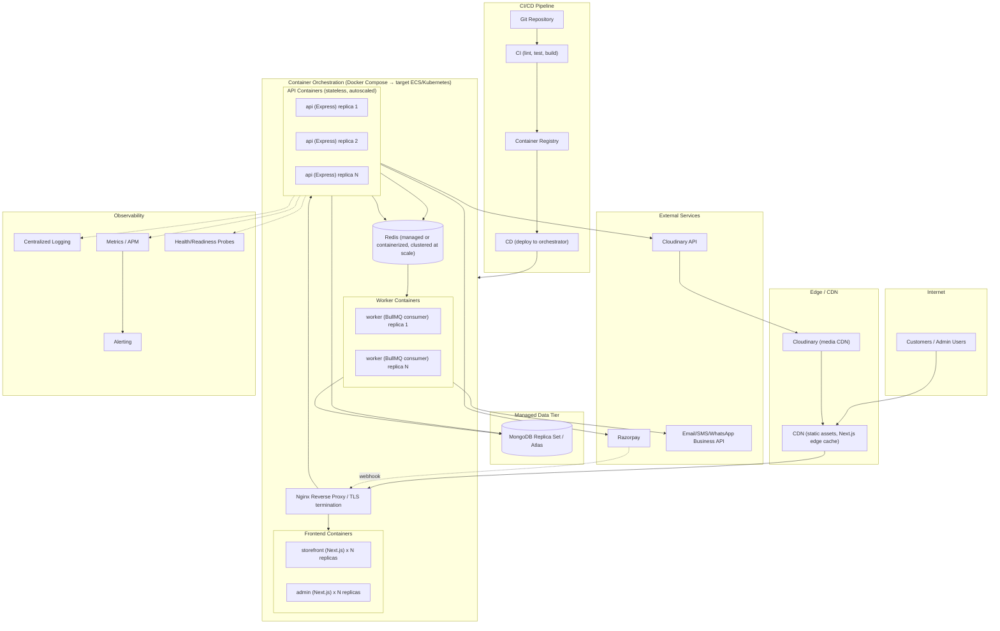

### 8.1 Container/Service Inventory

| Service | Image basis | Scaling | Notes |
|---|---|---|---|
| `storefront` | Next.js (Node runtime or standalone output) | Horizontal, stateless | SSR/ISR pages, connects only to `api` (never directly to MongoDB) |
| `admin` | Next.js | Horizontal, stateless | Separate deployable from `storefront`; VPN/IP-allowlist network policy **required** in production, not optional *(resolves review finding S1)* |
| `api` | Node.js/Express | Horizontal, stateless, autoscale on CPU/RPS | All business logic; no local state, no local file storage |
| `worker` | Node.js (BullMQ consumer) | Horizontal, scale by queue depth | Notifications, lead-nurture scheduling, cache warming, report pre-computation |
| `redis` | Redis (managed service recommended in prod) | Vertical + clustering at scale | Sessions/refresh tokens, cache-aside for catalog, rate limiting, BullMQ backend |
| `mongodb` | MongoDB Atlas or self-managed replica set | Vertical + read replicas | Replica set minimum 3 nodes for production; never single-node in prod |
| `nginx` | Nginx | Horizontal (or managed LB) | TLS termination, request routing, static asset caching headers |

### 8.2 Environment Strategy

| Environment | Purpose |
|---|---|
| Local | Docker Compose, all services containerized, seeded MongoDB |
| Staging | Mirrors production topology at lower scale, used for QA and Razorpay/Cloudinary sandbox testing |
| Production | Multi-replica API/worker, managed MongoDB (Atlas) and Redis, autoscaling, blue-green or rolling deploys |

---

## 9. Authentication Flow

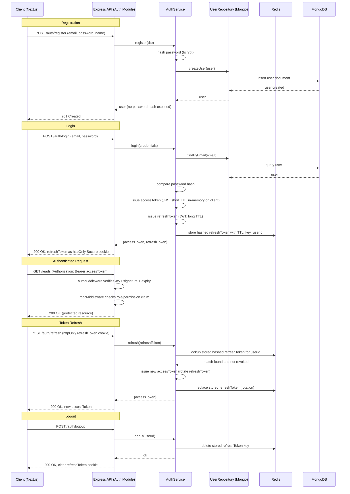

### 9.1 JWT Strategy Details

| Aspect | Decision |
|---|---|
| Access token | Short TTL (10–15 min), returned in response body, held client-side in memory (not localStorage) to reduce XSS token-theft blast radius |
| Refresh token | Long TTL (7–30 days), stored as `httpOnly`, `Secure`, `SameSite=Strict` cookie; never accessible to JS |
| Refresh token persistence | Hashed and stored in Redis keyed by user (or device/session), enabling **server-side revocation** (logout, password change, admin-forced logout) — a pure stateless JWT cannot support this |
| Rotation | Refresh token rotated on every use; reuse of an already-rotated token is treated as a compromise signal (revoke all sessions for that user) |
| RBAC | Access-token claims carry the user's resolved **permission keys** (e.g., `leads.read`, `orders.refund`), not just a role name — `rbacMiddleware` checks per-route against permission keys, with the `roles` → `permissions` mapping in `03_database_design.md` §9.1.2–9.1.3 as the single enforcement source of truth. The role table in §14 is a human-readable summary of which keys each role holds, not a separate enforcement mechanism *(reconciles review finding S2 — previously ambiguous between permission-key and module-level enforcement)* |
| MFA | **Required** (TOTP) for all `STAFF`/`ADMIN` user types before first admin-panel access; not required for `CUSTOMER` accounts *(resolves review finding S1)* |
| Password storage | bcrypt with per-user salt, configurable cost factor |
| Rate limiting | Login/OTP endpoints rate-limited via Redis (per-IP and per-account) to blunt credential-stuffing/brute-force; backstopped by the edge WAF/rate-limit layer in §4 for pre-application-layer volumetric abuse |

---

## 10. Lead Generation Flow

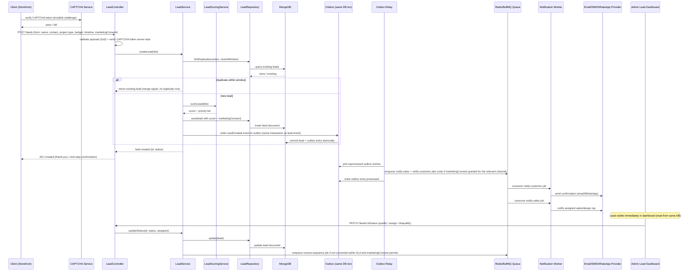

**Design notes:**
- **Deduplication** happens before scoring/insert to avoid inflating lead counts from repeat form submissions (common with sticky WhatsApp/contact buttons).
- **Scoring is synchronous** (cheap, rule-based at MVP: budget range + project type + timeline urgency) so the lead is already prioritized the instant it lands in the Admin dashboard — no waiting on a worker round-trip for something this cheap.
- **Notification is asynchronous** via queue — third-party WhatsApp/Email/SMS provider latency or outages must never slow down or fail the lead-capture API response.
- **Nurture-sequence scheduling** is queue-driven with delayed jobs (BullMQ supports delayed/repeatable jobs) rather than a cron polling the whole leads collection.
- **CAPTCHA verification** (invisible challenge, e.g., reCAPTCHA v3/Turnstile) runs before the lead is scored or inserted — protects the lead-scoring pipeline and sales dashboard from spam/bot submissions, which would otherwise directly corrupt the platform's #2 business priority *(resolves review finding A2)*. A failed CAPTCHA does not silently drop the submission — it's flagged for manual review rather than discarded, to avoid losing genuine leads on false positives.
- **Marketing consent is captured at submission** (`marketingConsent` on the `leads` document, see `03_database_design.md` §9.5.1) and every downstream notification/nurture step checks it per channel before sending — required for DPDP Act / TRAI compliance on WhatsApp/SMS marketing communications *(resolves review finding B4)*.
- **Domain event durability via Transactional Outbox:** the `LeadCreated` event is written to an `outbox` collection in the same database operation as the lead insert (not published-then-separately-enqueued), and a separate Outbox Relay process polls and enqueues it. This guarantees at-least-once delivery of the notification job even if the process crashes between the DB write and the original in-process publish — previously, a crash in that window would silently lose the "notify sales" job with the lead still created *(resolves review finding A3; see `03_database_design.md` §9.8.4 for the `outbox` collection and §16 of this document for the pattern applied platform-wide)*.

---

## 11. Order Flow

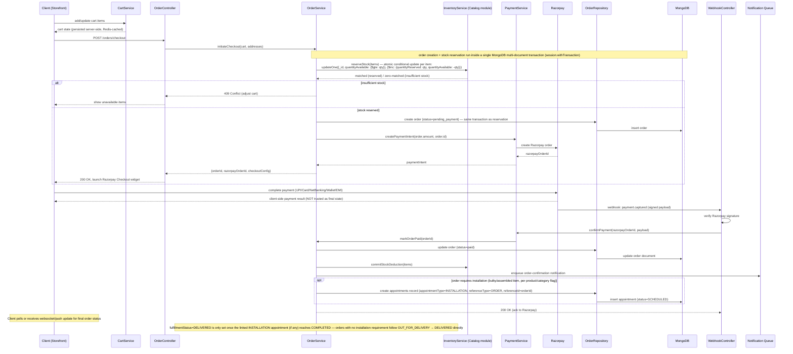

**Design notes:**
- **Stock is reserved at checkout initiation, committed only on confirmed payment** — prevents overselling during the payment window without permanently locking inventory on abandoned checkouts (reservation carries a short TTL and auto-releases).
- **Stock reservation is a single atomic conditional update** (`updateOne` with a `quantityAvailable: {$gte: qty}` filter and an `$inc` on the same operation), not a read-then-write — under concurrent checkouts for the last unit of a variant, only one request's update matches and succeeds; the other correctly sees zero-matched and reports insufficient stock. A read-then-write implementation would let both requests pass the check and oversell *(resolves review finding D1 — the highest-severity database finding in the review, since overselling physical furniture is a direct customer-trust and cost problem, not a theoretical edge case)*.
- **Order creation and stock reservation run inside a single MongoDB multi-document transaction** (`session.withTransaction()`), available because the mandated deployment is a replica set (`03_database_design.md` §14.1). A crash between "reserve stock" and "create order" can no longer leave stock reserved with no corresponding order *(resolves review finding D2)*. This is a deliberately narrow use of transactions — most cross-module effects elsewhere in the platform remain event-driven and eventually consistent, per the Hybrid-readiness design in `04_architecture_decision.md`; transactions are reserved for the small set of operations (this one, and lead-to-design-project conversion) that genuinely need same-operation atomicity.
- **Source of truth for "paid" is the Razorpay webhook, never the client-side redirect callback** — client callbacks can be spoofed or dropped (browser closed mid-flow); the webhook is signature-verified server-to-server.
- **Idempotency:** webhook handler is idempotent on `razorpayOrderId`/`paymentId` so Razorpay's at-least-once webhook delivery cannot double-fulfill an order.
- This same pattern (reserve → external payment → webhook-confirmed commit) is reused for **Interior Design milestone payments** (Section 12), keeping payment handling consistent across both business lines.
- **Installation scheduling is now wired into the flow itself**, not just modeled in the schema — an order flagged as requiring installation creates an `appointments` record (`appointmentType: INSTALLATION`, already defined in `03_database_design.md` §9.4.5) once stock is committed, and `DELIVERED` status is gated on that appointment's completion where applicable *(resolves review finding B3 — previously the `INSTALLATION` appointment type existed in the schema with no flow that ever created one)*.

---

## 12. Product Flow

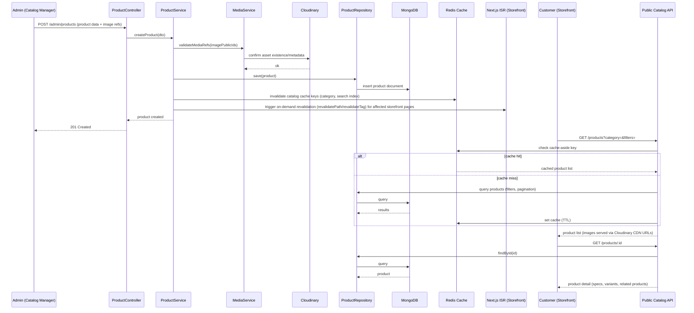

**Design notes:**
- **Cache-aside on Redis** for catalog listing/filter queries — furniture catalogs are read-heavy relative to writes, and filter combinations repeat often enough to benefit materially.
- **Cache invalidation is targeted** (by category/collection key), not a full cache flush, so a single product update doesn't stampede the database on the next request.
- **Two independent caching layers exist and both must be invalidated on product/price update:** the Redis API cache (above) and the Next.js storefront's own ISR/edge cache. Invalidating only the former left a real gap — a customer could see a stale, ISR-cached price even after the API-layer cache was correctly cleared, then be charged a different (correct, live-validated) price at checkout, which is a trust and consumer-protection problem, not just a caching nicety. The Product Flow now triggers on-demand ISR revalidation in the same write path as the Redis invalidation *(resolves review finding P1)*.
- Product image binaries never transit the Express server on read (served directly from Cloudinary CDN); on write, only metadata/public IDs are persisted in MongoDB — see Section 15 (Image Upload Flow) for how the binary gets to Cloudinary in the first place.

---

## 13. Interior Design Workflow

Represented as a project state machine — this is the core differentiator identified in `01_business_research.md` and is modeled explicitly rather than as a flat status field.

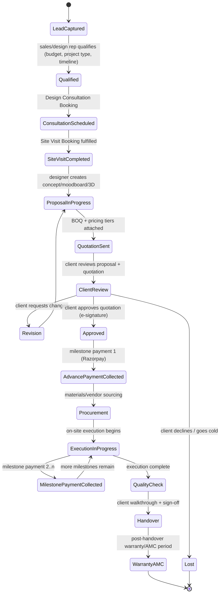

| Stage | Owning module | Key event emitted |
|---|---|---|
| LeadCaptured → Qualified | `leads` | `LeadQualified` |
| ConsultationScheduled → SiteVisitCompleted | `design-projects` | `SiteVisitCompleted` |
| ProposalInProgress → QuotationSent | `design-projects` + `media` (attach visuals/BOQ) | `QuotationSent` |
| Approved | `design-projects` (e-signature capture) | `QuotationApproved` |
| AdvancePaymentCollected / MilestonePaymentCollected | `payments` (reuses Order-flow payment pattern) | `MilestonePaymentReceived` |
| Handover / WarrantyAMC | `design-projects` | `ProjectHandedOver` |

**Design note:** every state transition is a discrete, auditable event (not just an overwritten status field) — required for the funnel analytics called out as a gap in `01_business_research.md` §3.2, and for dispute resolution on high-ticket projects.

---

## 14. Admin Workflow

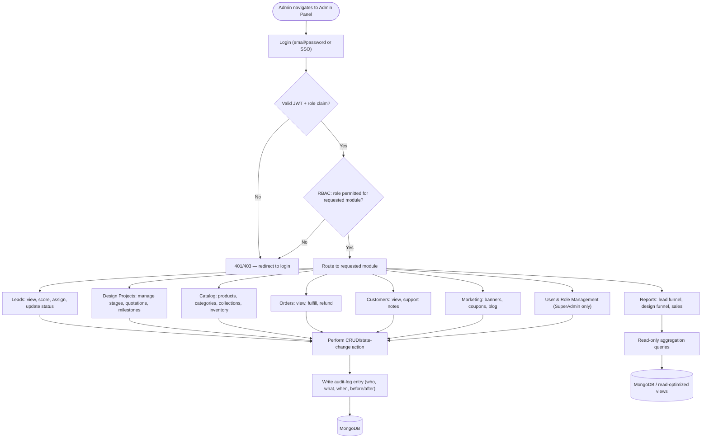

**RBAC roles (baseline):**

Enforcement is by **permission key** (`03_database_design.md` §9.1.2–9.1.3), not by this table directly — the table below is a human-readable summary of which permission keys each role is granted, kept here for admin-UI design reference.

| Role | Access |
|---|---|
| SuperAdmin | Full access, including User & Role Management |
| Sales/Lead Manager | Leads module, read-only Design Projects and Orders |
| Design Manager | Design Projects module (full, all designers' projects), Leads (read/assign), Media |
| **Designer** | Own assigned `design_projects` only (read/write via `assignedDesignerId == self`); read on assigned `leads`/`consultations`/`site_visits`; write on `design_project_assets` (site photos/renders) and `stageHistory` notes; **no** access to other designers' projects, no quotation-approval or financial-report access *(added — resolves review finding B1: interior design, the platform's #1 priority, had no individual-contributor role, only a manager role)* |
| Catalog Manager | Catalog, Inventory, Marketing modules |
| Support Agent | Orders (read + limited actions: refund request, status notes), Customers (read) |

**Audit logging is mandatory on every write action from the Admin Panel** — required for dispute resolution on design-project changes and for basic SOC-style compliance posture as the platform scales. Audit-log `before`/`after` snapshots redact sensitive fields (`passwordHash`, token hashes) to `[REDACTED]` rather than capturing them in full — see `03_database_design.md` §9.8.2.

---

## 15. Image Upload Flow

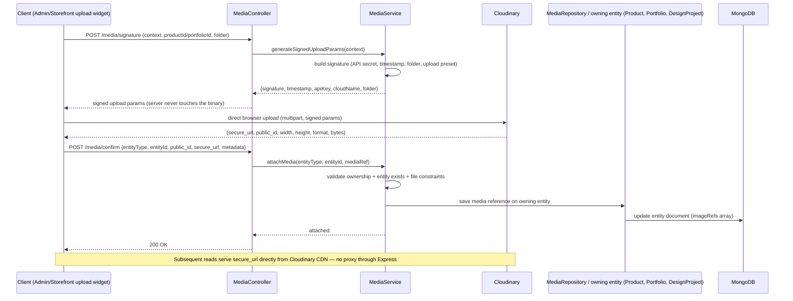

### 15.1 Design Decision: Direct-to-Cloudinary Signed Upload vs. Server-Proxied Upload

| Approach | Trade-off |
|---|---|
| **Direct-to-Cloudinary signed upload** (chosen) | Large binaries never transit the Express API — better latency, lower API server load/bandwidth cost, scales independently of API capacity. Requires the `/media/confirm` step to prevent orphaned/unverified uploads being silently trusted. |
| Server-proxied upload (client → Express → Cloudinary) | Enables server-side validation/virus-scanning/transformation before the asset ever reaches Cloudinary; simpler mental model; but doubles bandwidth cost and couples upload throughput to API server capacity |

**Recommendation:** direct-to-Cloudinary for product/portfolio/design-project images (high volume, low risk). If the platform later accepts **user-generated uploads from untrusted customers** (e.g., a "share your room photo" feature), route those specific flows through server-proxied upload with virus/content scanning before forwarding to Cloudinary — do not apply the same trust model to both cases.

---

## 16. Cross-Cutting Concerns

| Concern | Approach |
|---|---|
| Validation | Zod (or equivalent) schemas at the Presentation layer boundary; domain invariants re-checked in Domain entities regardless of API-layer validation (defense in depth) |
| Error handling | Centralized Express error middleware; custom error classes (`NotFoundError`, `ValidationError`, `ConflictError`, `UnauthorizedError`) mapped to consistent HTTP status + response envelope |
| API response envelope | Consistent `{ success, data, error, meta }` shape across all endpoints |
| Rate limiting | Redis-backed, per-IP and per-account, applied to auth endpoints, lead submission, and public catalog search to blunt abuse/scraping |
| Edge protection | WAF/CDN-level rate limiting and bot-fingerprinting ahead of Nginx (§4), plus CAPTCHA on public lead-capture forms (§10) — defense-in-depth ahead of the application-level limiter, not a replacement for it *(resolves review finding A1, A2)* |
| Caching | Redis cache-aside for catalog reads and computed report aggregates; explicit, targeted invalidation on writes (never a blanket flush); product/price updates also trigger Next.js ISR revalidation, not just the Redis cache (§12) |
| Queueing | BullMQ on Redis for notifications, lead nurture scheduling, cache warming, and report pre-computation |
| Event durability | Domain events tied to a database write (e.g., `LeadCreated`, `OrderPaid`) are written to an `outbox` collection in the same operation as the triggering write (Transactional Outbox pattern), then relayed to BullMQ by a separate polling process — guarantees at-least-once delivery instead of best-effort in-process publish, which could silently lose a job on a mid-sequence crash *(resolves review finding A3; see §10 for the Lead Generation Flow example and `03_database_design.md` §9.8.4 for the `outbox` collection)* |
| Logging | Structured JSON logging (e.g., Pino) with correlation/request IDs propagated from Nginx through API to worker jobs |
| Observability | APM tracing across API → DB/Redis/external-call spans; health/readiness endpoints per container for orchestrator probes |
| Security headers | Helmet.js defaults, strict CORS allow-list, CSP tuned for Cloudinary/Razorpay script/frame sources |
| Secrets management | Environment-injected secrets via orchestrator secret store — never committed, never baked into images |
| Testing | Domain and Application layers unit-tested with repository/adapter interfaces mocked; Infrastructure layer covered by integration tests against a real (containerized) MongoDB/Redis instance |
| API versioning | URI-based versioning (`/api/v1/...`) from day one to allow non-breaking evolution once mobile apps (Phase 2, per `01_business_research.md`) consume the same API |

---

## 17. Production Readiness Checklist

- [ ] Centralized structured logging with correlation IDs across API and workers
- [ ] Health/readiness/liveness probes on every container
- [ ] Horizontal autoscaling policy defined for `api` and `worker` (CPU/RPS/queue-depth based)
- [ ] MongoDB replica set (minimum 3 nodes) with automated backups and tested restore procedure
- [ ] Redis persistence/backup strategy appropriate to its role (cache vs. queue vs. session store may warrant different persistence settings)
- [ ] Razorpay webhook signature verification and idempotent handling (Section 11)
- [ ] Refresh-token revocation path exercised (logout, password change, admin-forced session kill)
- [ ] Rate limiting active on auth, lead-capture, and search endpoints before public launch
- [ ] Edge WAF/rate-limiting active ahead of Nginx; CAPTCHA active on all public lead-capture forms *(resolves review findings A1, A2)*
- [ ] MFA enforced for all STAFF/ADMIN accounts; admin app network policy (VPN/IP-allowlist) confirmed non-optional in production *(resolves review finding S1)*
- [ ] Outbox relay process deployed and monitored (lag/backlog alerting); domain-event delivery verified at-least-once under a simulated mid-sequence crash *(resolves review finding A3)*
- [ ] Inventory reservation load-tested under concurrent checkout for the same low-stock variant to confirm no overselling *(resolves review finding D1)*
- [ ] Secrets managed via orchestrator/secret-store, not `.env` files in production images
- [ ] CI pipeline gates: lint, type-check, unit tests, integration tests, dependency vulnerability scan
- [ ] Rollback strategy defined for CD (blue-green or rolling with health-check gating)
- [ ] Disaster recovery runbook (DB restore, Redis rebuild, Cloudinary asset re-sync verification)
- [ ] Load test performed against realistic catalog size + concurrent checkout scenario before a flash-sale-style marketing push

---

## 18. Architecture Decision Records (Summary)

| Decision | Chosen | Alternatives considered | Rationale |
|---|---|---|---|
| Service topology | Modular monolith, feature-based modules | Microservices from day one | Avoids premature distributed-systems complexity; module boundaries already support future extraction (Section 0, 6) |
| DI approach | Manual composition root | tsyringe/InversifyJS | Simpler, zero framework coupling at current team/module scale (Section 7.3) |
| Payment confirmation source of truth | Razorpay webhook | Client-side redirect callback only | Webhook is signature-verified server-to-server; client callback is spoofable/droppable (Section 11) |
| Image upload path | Direct-to-Cloudinary signed upload | Server-proxied upload | Avoids binary transit through API tier; server-proxy reserved for untrusted user-generated uploads only (Section 15.1) |
| Auth token storage | Access token in memory, refresh token in httpOnly cookie + Redis | Both tokens in localStorage | Reduces XSS blast radius; enables server-side revocation (Section 9.1) |
| Design-project modeling | Explicit state machine with auditable events | Flat status enum field | Required for funnel analytics and dispute resolution on high-ticket projects (Section 13) |
| Frontend app split | Separate `storefront` and `admin` Next.js apps, shared UI package | Single app with role-gated routes | Smaller customer-facing bundle, cleaner network/security boundary for admin (Section 4, 6.2) |
| Domain event delivery | Transactional Outbox (DB-committed, relay-polled) | Direct in-process publish-then-enqueue | Guarantees at-least-once delivery; a crash between DB write and enqueue can no longer silently lose a notification job (Section 10, 16 — resolves review finding A3) |
| Inventory reservation | Single atomic conditional update (`updateOne` with `$gte` filter + `$inc`) | Read-then-write with a separate check | Prevents overselling under concurrent checkout on the same low-stock variant (Section 11 — resolves review finding D1) |
| Cross-collection atomicity | MongoDB multi-document transactions, narrowly applied (order+reservation; lead conversion) | No transactions; rely on eventual consistency everywhere | The handful of operations that genuinely need same-operation atomicity get it; everything else stays event-driven per the Hybrid-readiness design in `04_architecture_decision.md` (Section 11 — resolves review finding D2) |
| RBAC enforcement granularity | Permission-key based (`leads.read`, `orders.refund`, etc.), matching `03_database_design.md`'s `permissions` collection | Coarse module-level role table as the enforcement mechanism | The module-level table was ambiguous with the DB schema's finer-grained design; permission-key enforcement is the more precise and more secure of the two, so it's now the documented source of truth (Section 14 — resolves review finding S2) |

---

## 19. Open Items (Carried Forward from `01_business_research.md`)

The following business-model questions still materially affect this architecture and should be confirmed before Phase 1 begins:

- In-house design team vs. external Designer Partner Network — affects whether a `partner-portal` module is pulled into Phase 1 or stays Phase 2.
- Owned inventory vs. marketplace/dropship model — affects whether `catalog`/`orders` need multi-vendor support earlier than currently scoped.
- Physical studios/showrooms on the roadmap — affects whether a `franchise-ops` module and POS integration point are needed.
- Target initial geography (single city vs. multi-city) — affects whether multi-warehouse/hub-and-spoke inventory logic is MVP or Phase 2.

---

## 20. Return Flow *(added — resolves review finding B2)*

`01_business_research.md` §3.3 identified that furniture returns are operationally different from apparel returns (pickup scheduling, damage inspection, restocking-fee logic) — a gap that was correctly flagged but never carried through into a technical flow. This section closes it, reusing the same `appointments` collection already used for consultations and site visits (§13) and installation (§11) rather than inventing a parallel scheduling mechanism.

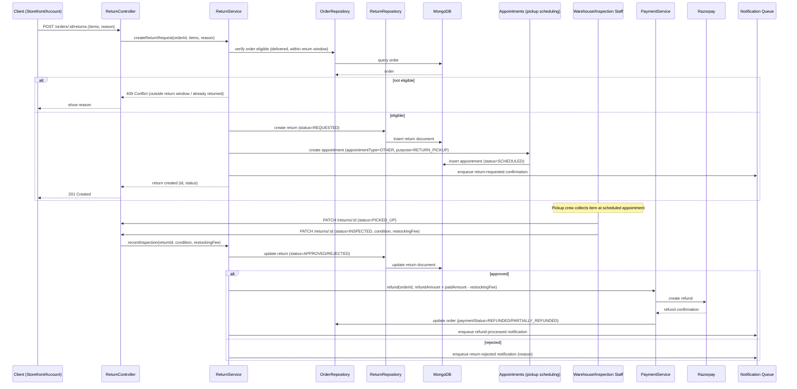

**Design notes:**
- A `returns` collection tracks the request separately from the `orders` document itself (see `03_database_design.md` §9.3.8) — an order can have zero, one, or multiple partial returns over its lifetime, so this is modeled as its own referenced collection, not an embedded array on `orders`.
- **Pickup scheduling reuses `appointments`**, not a new scheduling mechanism — consistent with how the platform already handles consultations, site visits (§13), and installation (§11).
- **Refunds are only issued after inspection**, never automatically on request — the `restockingFee` (if any) is applied against the original payment amount, and the actual refund is executed through the same Razorpay-webhook-confirmed pattern used everywhere else payments are reversed, not a separate ad hoc refund path.
