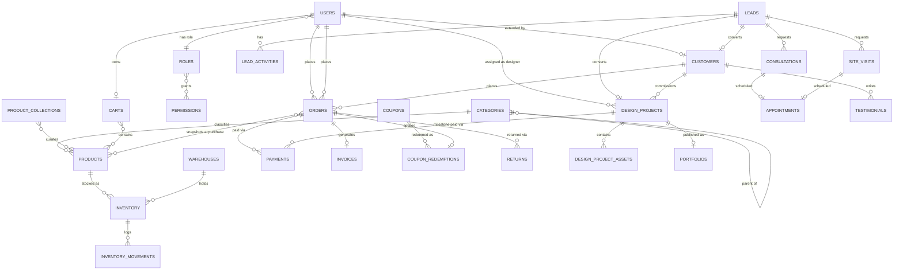
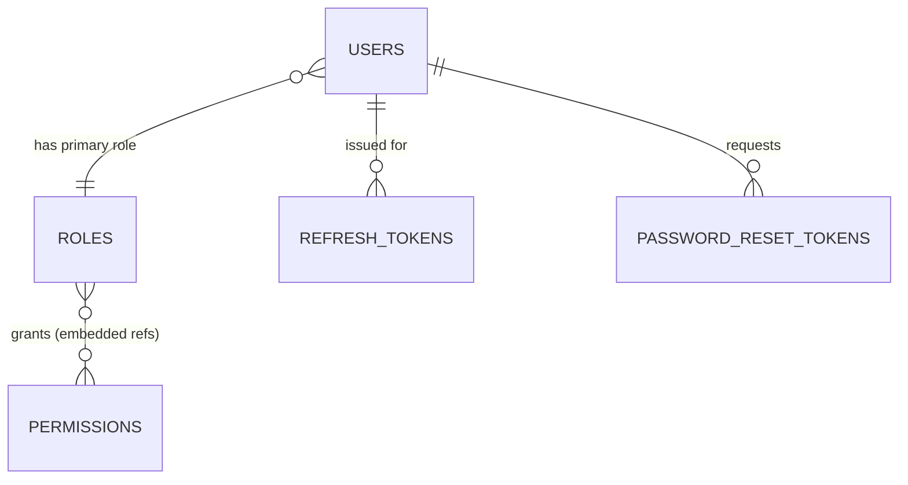
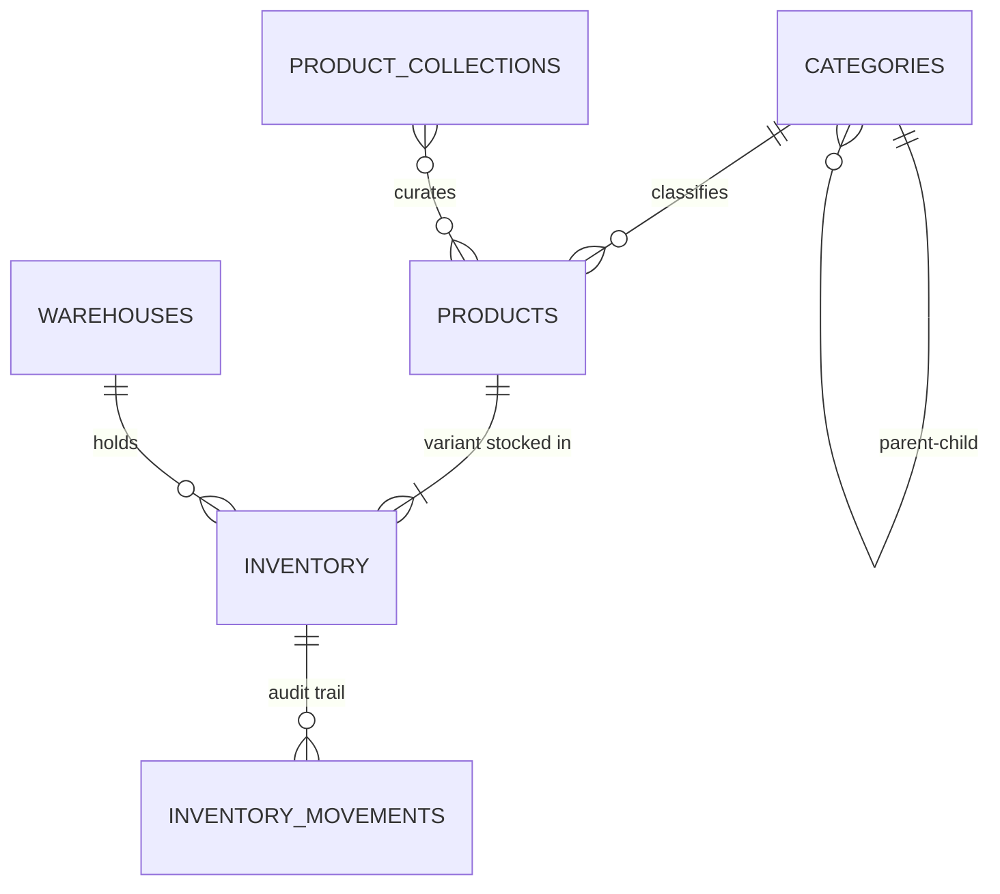
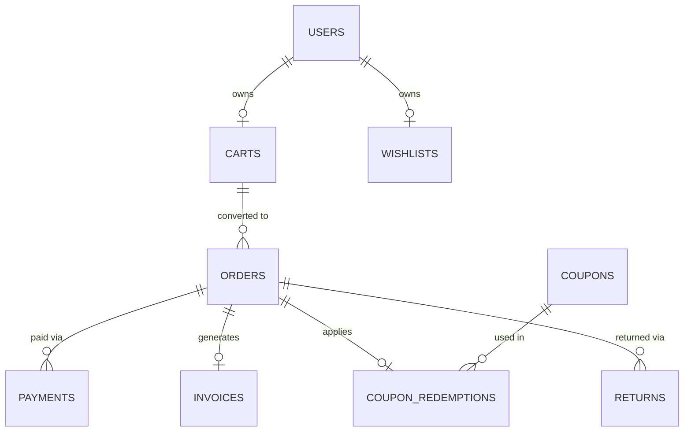
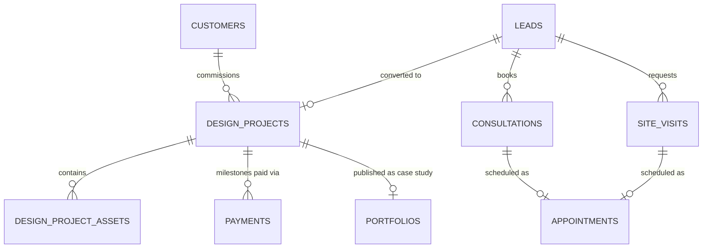
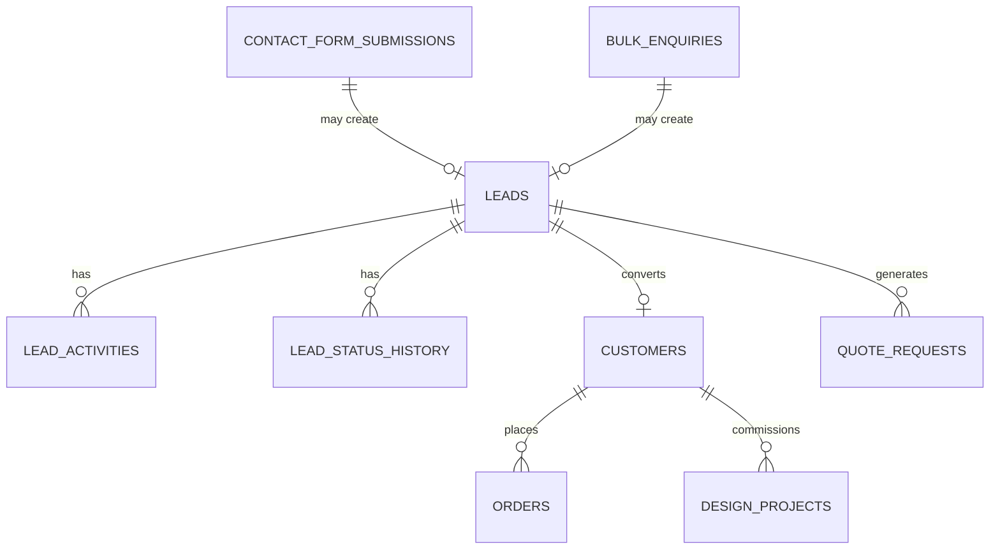
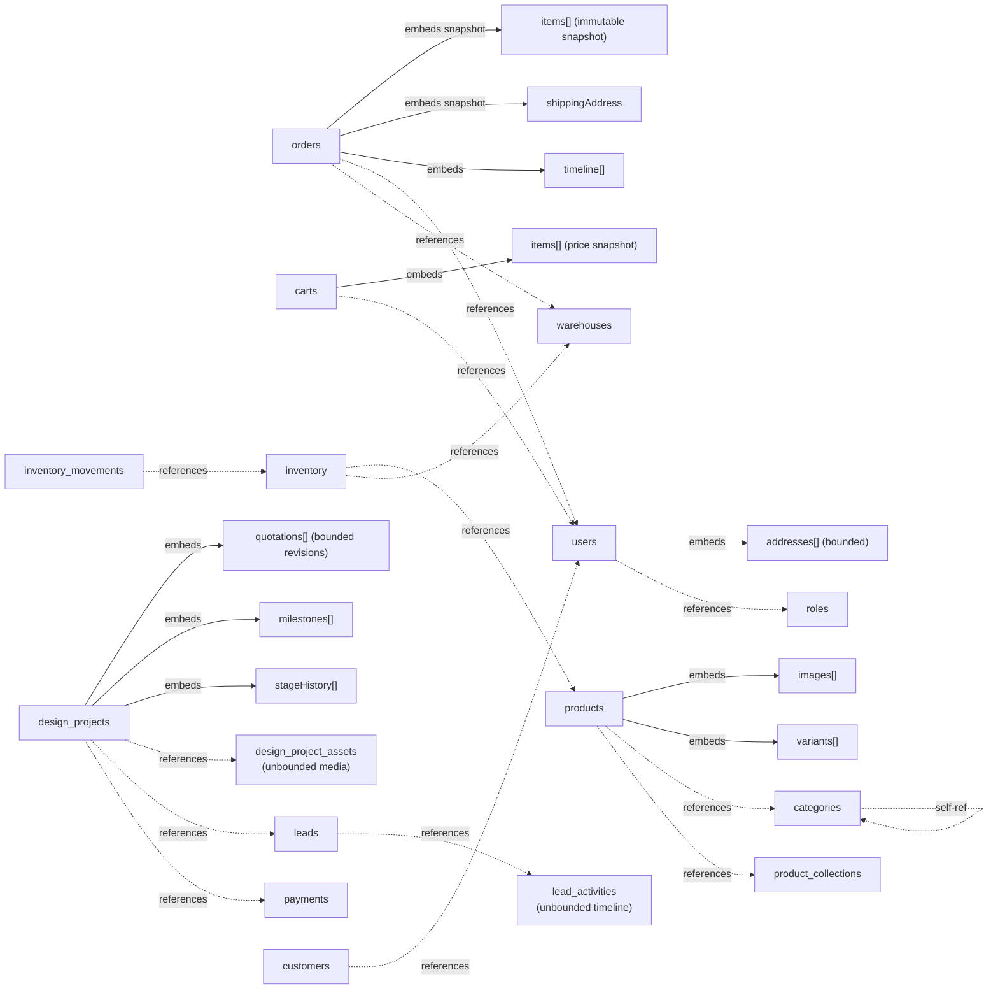

# Production MongoDB Database Design
## National Furniture & Interiors — Data Architecture

**Prepared by:** Senior MongoDB Database Architect (AI-assisted)
**Date:** 2026-08-07
**Depends on:** `docs/01_business_research.md`, `docs/02_enterprise_architecture.md`
**Target engine:** MongoDB 8.0+, deployed as a replica set minimum (Section 14)
**Scope:** No implementation code — schema design presented as field tables, diagrams (Mermaid), and design rationale only.

---

## Revision History

| Version | Date | Change | Reason |
|---|---|---|---|
| v1.0 | 2026-08-07 | Initial version | — |
| v1.1 | 2026-08-07 | Added `DESIGNER` to the `roles` example list (§9.1.2); added atomic-reservation note to `inventory` (§9.2.6); added `marketingConsent` field to `leads` and `newsletter_subscribers` (§9.5.1, §9.6.4); added PII redaction rule to `audit_logs` (§9.8.2); added new `returns` collection (§9.3.8) and new `outbox` collection (§9.8.4); updated Collection Inventory (§4), Collection Diagram (§5), ER Diagrams (§6, §7.3), and Critical Indexes (§10.6) to include both new collections; added multi-document transaction usage note (§13.1) | Resolves findings B1, D1, B4, D3, B2, A3, D2 from `docs/00_architecture_review.md` |

---

## 1. Alignment With Prior Documents

Collections are grouped into the same module boundaries defined in `02_enterprise_architecture.md` (`auth`, `catalog`/`inventory`, `commerce`, `design-projects`, `leads`, `marketing`, `crm`, `admin`) so that each backend feature module owns a clear, non-overlapping set of collections — no module reaches into another module's collection internals directly, only through referenced IDs, matching the Repository Pattern and module-boundary rule already established.

Per business priority order (Interior Design → Lead Generation → Furniture eCommerce), the **Interior Design and Lead Generation schemas are modeled with full lifecycle depth** (project stage history, quotation revisions, activity timelines) rather than as thin lookup tables — this mirrors the state-machine modeling decision from `02_enterprise_architecture.md` §13.

---

## 2. Naming Conventions

| Element | Convention | Example |
|---|---|---|
| Database name | `snake_case`, environment-suffixed | `national_interiors_prod`, `national_interiors_staging` |
| Collection names | plural, `snake_case` | `design_projects`, `quote_requests`, `inventory_movements` |
| Field names | `camelCase` | `firstName`, `createdAt`, `unitPrice` |
| Reference fields | `<entity>Id` (single) / `<entity>Ids` (array) | `userId`, `categoryIds` |
| Boolean fields | prefixed `is` / `has` | `isActive`, `isDeleted`, `hasVariants` |
| Date/time fields | suffixed `At` | `createdAt`, `deletedAt`, `scheduledAt` |
| Enum values | `UPPER_SNAKE_CASE` string constants | `PENDING`, `IN_PROGRESS`, `QUALITY_CHECK` |
| Money fields | integer **minor units** (paise) + explicit `currency` field | `{ amount: 4999900, currency: "INR" }` never a float |
| Index names | `idx_<collection>_<field(s)>_<purpose>` | `idx_products_category_status`, `idx_users_email_unique` |
| Embedded sub-document arrays | plural noun matching the concept | `images`, `variants`, `timeline`, `stageHistory` |

**Money-as-integer rationale:** floating point cannot represent currency exactly (classic `0.1 + 0.2` problem); storing paise as an integer avoids rounding drift across order totals, refunds, and Razorpay reconciliation, and matches Razorpay's own amount-in-paise API convention noted in `02_enterprise_architecture.md` §11.

---

## 3. Standard Audit Fields & Soft Delete Strategy

Every collection below (except the explicitly-marked **immutable/append-only** and **ephemeral/TTL** collections) includes this standard field block:

| Field | Type | Purpose |
|---|---|---|
| `createdAt` | Date | Document creation timestamp |
| `updatedAt` | Date | Last modification timestamp |
| `createdBy` | ObjectId \| null | User who created the record (`null` for system/customer self-service actions) |
| `updatedBy` | ObjectId \| null | User who last modified the record |
| `isDeleted` | Boolean | Soft-delete flag, default `false` |
| `deletedAt` | Date \| null | Soft-delete timestamp |
| `deletedBy` | ObjectId \| null | User who performed the soft delete |
| `version` | Number | Optimistic-concurrency counter, incremented on every update (distinct from Mongoose's internal `__v`, used to detect concurrent-edit conflicts on business-critical documents such as `orders` and `design_projects`) |

### 3.1 Soft Delete Rules

- **Default query filter:** every repository-layer read (per the Repository Pattern in `02_enterprise_architecture.md` §7.1) applies `isDeleted: false` unless explicitly querying an admin "trash" view — enforced at the Infrastructure layer, not left to each caller.
- **Unique constraints must be partial indexes** filtered on `isDeleted: false` (Section 10.2), so a soft-deleted document's unique value (email, SKU, coupon code) can be legitimately reused by a new document.
- **Exceptions to soft delete:**
  - `audit_logs`, `inventory_movements`, `lead_activities`, `payments` — **immutable, append-only**. Nothing is ever soft- or hard-deleted; corrections are new compensating records, never edits to history.
  - `refresh_tokens`, `otp_verifications`, `password_reset_tokens`, `notifications` (in-app, expired) — **ephemeral**, hard-deleted automatically via TTL indexes (Section 10.3), since they carry no long-term business value once expired.
- **Cascade behavior is explicit, not automatic:** soft-deleting a `products` document does not cascade to `inventory` or `orders` — historical orders must keep referencing the product as it existed at order time (see embedding-for-immutability decisions in Section 6). A deleted product is simply excluded from catalog queries via `isDeleted: false` and `status: PUBLISHED` filters.

---

## 4. Collection Inventory by Module

| Module | Collections |
|---|---|
| **Authentication & Access** | `users`, `roles`, `permissions`, `refresh_tokens`, `otp_verifications`, `password_reset_tokens` |
| **Furniture (Catalog & Inventory)** | `categories`, `product_collections`, `products` *(variants embedded)*, `warehouses`, `inventory`, `inventory_movements` |
| **Commerce** | `carts`, `wishlists`, `coupons`, `coupon_redemptions`, `orders`, `payments`, `invoices`, `returns` *(added — resolves review finding B2)* |
| **Interior Design** | `design_projects`, `design_project_assets`, `portfolios`, `consultations`, `appointments` |
| **Lead Generation** | `leads`, `quote_requests`, `site_visits`, `contact_form_submissions`, `bulk_enquiries` |
| **Marketing** | `blogs`, `testimonials`, `banners`, `newsletter_subscribers` |
| **CRM** | `customers`, `lead_status_history`, `lead_activities` |
| **Administration** | `notifications`, `audit_logs`, `settings`, `outbox` *(added — resolves review finding A3)* |

**Total: 35 collections across 8 modules** *(was 33 — `returns` and `outbox` added in v1.1)*.

---

## 5. Collection Diagram (Module Grouping)

```mermaid
flowchart TB
    subgraph AuthMod["Authentication & Access"]
        Users["users"]
        Roles["roles"]
        Perms["permissions"]
        RTokens["refresh_tokens"]
        OTP["otp_verifications"]
        PwdReset["password_reset_tokens"]
    end

    subgraph CatalogMod["Furniture — Catalog & Inventory"]
        Categories["categories"]
        ProdColl["product_collections"]
        Products["products (variants embedded)"]
        Warehouses["warehouses"]
        Inventory["inventory"]
        InvMove["inventory_movements"]
    end

    subgraph CommerceMod["Commerce"]
        Carts["carts"]
        Wishlists["wishlists"]
        Coupons["coupons"]
        CouponRedeem["coupon_redemptions"]
        Orders["orders"]
        Payments["payments"]
        Invoices["invoices"]
        Returns["returns"]
    end

    subgraph DesignMod["Interior Design"]
        DesignProjects["design_projects"]
        DesignAssets["design_project_assets"]
        Portfolios["portfolios"]
        Consultations["consultations"]
        Appointments["appointments"]
    end

    subgraph LeadMod["Lead Generation"]
        Leads["leads"]
        QuoteReq["quote_requests"]
        SiteVisits["site_visits"]
        ContactForms["contact_form_submissions"]
        BulkEnq["bulk_enquiries"]
    end

    subgraph MarketingMod["Marketing"]
        Blogs["blogs"]
        Testimonials["testimonials"]
        Banners["banners"]
        Newsletter["newsletter_subscribers"]
    end

    subgraph CRMMod["CRM"]
        Customers["customers"]
        LeadStatusHist["lead_status_history"]
        LeadActivities["lead_activities"]
    end

    subgraph AdminMod["Administration"]
        Notifications["notifications"]
        AuditLogs["audit_logs"]
        Settings["settings"]
        Outbox["outbox"]
    end

    Customers -. references .-> Users
    Orders -. references .-> Users
    Orders -. references .-> Products
    Orders -. references .-> Payments
    Carts -. references .-> Products
    Leads -. converts to .-> Customers
    Leads -. converts to .-> DesignProjects
    Leads -. converts to .-> Orders
    DesignProjects -. references .-> Leads
    DesignProjects -. references .-> Payments
    Consultations -. references .-> Leads
    SiteVisits -. references .-> Leads
    LeadActivities -. references .-> Leads
    Payments -. polymorphic ref .-> Orders
    Payments -. polymorphic ref .-> DesignProjects
    Testimonials -. references .-> Customers
    AuditLogs -. references .-> Users
    Returns -. references .-> Orders
    Returns -. schedules pickup via .-> Appointments
    Outbox -. relays events from .-> Leads
    Outbox -. relays events from .-> Orders
```

---

## 6. ER Diagram — System Overview

Simplified to the entities and relationships that drive core business flows; ephemeral/lookup collections (`otp_verifications`, `password_reset_tokens`, `refresh_tokens`, `settings`) are omitted here for readability and covered in the per-module diagrams and Section 7 tables.

---

## 7. Per-Module ER Diagrams

### 7.1 Authentication & Access Control

### 7.2 Furniture — Catalog & Inventory

*Note: `variants` is embedded inside `PRODUCTS`, not a separate entity — see Section 8.4.*

### 7.3 Commerce

### 7.4 Interior Design

### 7.5 Lead Generation & CRM

---

## 8. Relationship Diagram — Embedded vs. Referenced

This view is distinct from the ER diagrams above: it visualizes **document-boundary decisions**, not just cardinality. Solid arrows = embedded sub-document (lives inside the parent document). Dashed arrows = referenced by ObjectId (separate document/collection).

**Legend:** solid arrow = embedded sub-document; dashed arrow = referenced ObjectId across collections.

**Governing rule applied throughout:** embed when data is (a) bounded in size, (b) always read together with the parent, and (c) shares the parent's write/lifecycle cadence. Reference when data is (a) unbounded/high-volume, (b) independently queried, or (c) needs point-in-time immutability separate from a frequently-changing parent (e.g., `products` changes often; an `orders.items` snapshot must not change retroactively when `products` does).

---

## 9. Collection Design — Document Structure & Explanation

Each subsection lists: purpose, field structure, embed/reference rationale (where applicable), relationships, and key indexes. Consolidated index reference is in Section 10.

### 9.1 Authentication & Access Control

#### 9.1.1 `users`

**Purpose:** single identity/credential record for every person who can authenticate — customers, staff, and admins alike (differentiated by `userType` and `roleId`). Deliberately excludes CRM-specific fields (kept in `customers`, Section 9.7.1) to keep the Auth module framework-agnostic per the module-boundary rule.

| Field | Type | Notes |
|---|---|---|
| `_id` | ObjectId | |
| `fullName` | String | |
| `email` | String | unique (partial index, Section 10.2) |
| `phone` | String | unique (partial index), E.164 format |
| `passwordHash` | String \| null | null for OTP/OAuth-only accounts |
| `authProviders` | Array\<String\> | `LOCAL`, `GOOGLE`, `OTP` — user may have more than one |
| `googleId` | String \| null | |
| `isEmailVerified` | Boolean | |
| `isPhoneVerified` | Boolean | |
| `userType` | Enum | `CUSTOMER`, `STAFF`, `ADMIN` |
| `roleId` | ObjectId (ref `roles`) | primary role |
| `additionalRoleIds` | Array\<ObjectId\> | rarely used; supports multi-role staff |
| `status` | Enum | `ACTIVE`, `SUSPENDED`, `BANNED` |
| `avatarUrl` / `avatarPublicId` | String | Cloudinary reference |
| `addresses` | Array\<AddressSubdoc\> | **embedded** — bounded (typically <10), always fetched with checkout/profile |
| `addresses[].label`, `.line1`, `.line2`, `.city`, `.state`, `.pincode`, `.country`, `.geo` (GeoJSON Point), `.isDefault` | | |
| `lastLoginAt` | Date | |
| `failedLoginAttempts` | Number | reset on success |
| `lockedUntil` | Date \| null | brute-force lockout |
| *(standard audit fields, Section 3)* | | |

**Relationships:** `roleId` → `roles`; referenced by `customers.userId`, `orders.userId`, `carts.userId`, `design_projects.assignedDesignerId`, `audit_logs.actorId`.

#### 9.1.2 `roles`

| Field | Type | Notes |
|---|---|---|
| `_id` | ObjectId | |
| `name` | String | unique — `SUPER_ADMIN`, `SALES_MANAGER`, `DESIGN_MANAGER`, `DESIGNER`, `CATALOG_MANAGER`, `SUPPORT_AGENT`, `CUSTOMER`. `DESIGNER` added in v1.1 — individual-contributor role scoped to `assignedDesignerId == self` on `design_projects`, distinct from `DESIGN_MANAGER`'s full-module access *(resolves review finding B1; see `02_enterprise_architecture.md` §14 for the full permission scope)* |
| `description` | String | |
| `permissionIds` | Array\<ObjectId\> (ref `permissions`) | **embedded array of references** — bounded (dozens, not thousands), so no join collection needed |
| `isSystemRole` | Boolean | prevents deletion of built-in roles |
| *(audit fields)* | | |

#### 9.1.3 `permissions`

| Field | Type | Notes |
|---|---|---|
| `_id` | ObjectId | |
| `key` | String | unique, e.g. `leads.read`, `orders.refund` |
| `module` | String | for grouping in the admin UI |
| `description` | String | |
| *(audit fields, minimal — rarely changes)* | | |

#### 9.1.4 `refresh_tokens` *(ephemeral — TTL, no soft delete)*

| Field | Type | Notes |
|---|---|---|
| `_id` | ObjectId | |
| `userId` | ObjectId (ref `users`) | |
| `tokenHash` | String | hashed, never plaintext |
| `deviceInfo` | Object `{userAgent, ip}` | |
| `issuedAt` | Date | |
| `expiresAt` | Date | **TTL index** |
| `revokedAt` | Date \| null | |
| `replacedByTokenId` | ObjectId \| null | rotation chain, supports reuse-detection (`02_enterprise_architecture.md` §9.1) |

#### 9.1.5 `otp_verifications` *(ephemeral — TTL)*

| Field | Type | Notes |
|---|---|---|
| `identifier` | String | email or phone |
| `otpHash` | String | |
| `purpose` | Enum | `LOGIN`, `REGISTER`, `RESET_PASSWORD` |
| `attempts` | Number | rate-limit guard |
| `expiresAt` | Date | **TTL index** |
| `verifiedAt` | Date \| null | |

#### 9.1.6 `password_reset_tokens` *(ephemeral — TTL)*

| Field | Type | Notes |
|---|---|---|
| `userId` | ObjectId (ref `users`) | |
| `tokenHash` | String | |
| `expiresAt` | Date | **TTL index** |
| `usedAt` | Date \| null | |

---

### 9.2 Furniture — Catalog

#### 9.2.1 `categories`

| Field | Type | Notes |
|---|---|---|
| `name`, `slug` (unique), `description` | String | |
| `parentId` | ObjectId \| null (self-ref) | immediate parent |
| `ancestors` | Array\<ObjectId\> | **materialized path** — full ancestor chain, enables single-query subtree fetch (`ancestors: categoryId`) instead of recursive `$graphLookup` |
| `level` | Number | depth in tree, 0 = root |
| `imageUrl` | String | |
| `isActive`, `sortOrder` | | |
| `seo` | Object `{title, description, keywords}` | |
| *(audit fields)* | | |

**Design decision — materialized path over pure `parentId`:** category trees for furniture are shallow (2–4 levels: e.g., Living Room → Sofas → Sectional Sofas) but subtree queries ("show all products under Sofas, including Sectional Sofas") are frequent on category landing pages. Storing the full `ancestors` array trades a few extra bytes per document for O(1) indexed subtree lookups instead of recursive graph traversal on every page load.

#### 9.2.2 `product_collections`

| Field | Type | Notes |
|---|---|---|
| `name`, `slug` (unique), `description`, `bannerImageUrl` | | |
| `productIds` | Array\<ObjectId\> (ref `products`) | **referenced, not embedded** — collections can hold hundreds of products, and products belong to multiple collections; embedding would duplicate product data and require multi-document updates on every collection change |
| `rules` | Object \| null | optional dynamic-membership rule (e.g., `{categoryId, tags}`) as an alternative to static `productIds` |
| `startDate`, `endDate`, `isActive` | | |
| *(audit fields)* | | |

#### 9.2.3 `products`

| Field | Type | Notes |
|---|---|---|
| `name`, `slug` (unique), `sku` (base, unique), `brand` | String | |
| `categoryId` | ObjectId (ref `categories`) | primary category |
| `categoryIds` | Array\<ObjectId\> | secondary/cross-listed categories, **referenced** |
| `description`, `shortDescription`, `material`, `careInstructions` | String | |
| `warranty` | Object `{durationMonths, terms}` | |
| `dimensions` | Object `{length, width, height, unit}` | base/default dimensions |
| `weight` | Number | |
| `images` | Array\<ImageSubdoc\> | **embedded** — `{url, publicId, altText, sortOrder, isPrimary}`, bounded (~5–15 per product), always read with product detail |
| `videos` | Array\<VideoSubdoc\> | embedded, small |
| `variants` | Array\<VariantSubdoc\> | **embedded** — see Section 9.2.4 for full rationale |
| `basePrice` | Object `{amount (paise), currency}` | |
| `ratingsAvg`, `ratingsCount` | Number | **denormalized** from a reviews source for fast catalog-listing reads without a join |
| `tags` | Array\<String\> | |
| `isFeatured`, `isBestSeller` | Boolean | |
| `status` | Enum | `DRAFT`, `PUBLISHED`, `ARCHIVED` |
| `seo` | Object | |
| *(audit fields)* | | |

#### 9.2.4 Variants — Embedded Sub-Document within `products`

*(Addressing the "Variants" module item explicitly: modeled as an embedded array, not a standalone collection — rationale below.)*

| Field (within `variants[]`) | Type | Notes |
|---|---|---|
| `variantId` | ObjectId | generated per variant, referenced externally by `inventory.variantId` |
| `sku` | String | **unique across the whole catalog** — enforced via a unique index on `variants.sku` (MongoDB supports unique indexes on array fields) |
| `attributes` | Array\<`{name, value}`\> | e.g., `{name: "color", value: "Walnut Brown"}`, `{name: "size", value: "3-Seater"}` |
| `priceOverride` | Object `{amount, currency}` \| null | falls back to `basePrice` if null |
| `images` | Array\<ImageSubdoc\> | small variant-specific image subset |
| `dimensionsOverride`, `weightOverride` | Object \| null | |
| `isActive` | Boolean | |

**Why embedded, not a separate `variants` collection:**
1. Variants are **always read together** with the product — a product detail page never fetches variants independently of the parent.
2. Variant count per product is small and bounded (typically 2–50), well within MongoDB's 16 MB document ceiling even with per-variant images.
3. Variant attributes change on the same lifecycle cadence as the product itself (a catalog-manager edit), unlike inventory counts.

**What is deliberately NOT embedded in the variant:** stock quantity. Inventory changes on every order and every restock — far more frequently than product/variant metadata — and needs a per-warehouse breakdown. Embedding a fast-changing counter inside a large, infrequently-changing product document would cause write amplification and lock contention on a document customers are concurrently reading. Stock lives in the separate `inventory` collection (9.2.6), referenced by `productId` + `variantId` + `warehouseId`.

#### 9.2.5 `warehouses`

| Field | Type | Notes |
|---|---|---|
| `code` (unique), `name` | | |
| `address` | Object (embedded) | |
| `geo` | GeoJSON Point | **2dsphere index** for nearest-warehouse / delivery-radius queries |
| `contactPerson`, `contactPhone`, `capacity`, `isActive` | | |
| *(audit fields)* | | |

#### 9.2.6 `inventory`

| Field | Type | Notes |
|---|---|---|
| `productId` | ObjectId (ref `products`) | |
| `variantId` | ObjectId | matches an entry in `products.variants[].variantId` |
| `warehouseId` | ObjectId (ref `warehouses`) | |
| `sku` | String | denormalized for fast lookup without a join |
| `quantityOnHand`, `quantityReserved` | Number | |
| `quantityAvailable` | Number | **denormalized** = `onHand - reserved`, recomputed on every write to avoid computing it on every read |
| `reorderThreshold` | Number | |
| `lastRestockedAt` | Date | |
| *(audit fields)* | | |

**Unique compound index** on `{productId, variantId, warehouseId}` prevents duplicate ledger rows. Implements the reserve → commit pattern from `02_enterprise_architecture.md` §11 (Order Flow): checkout increments `quantityReserved`; webhook-confirmed payment moves the delta from reserved to a permanent decrement of `quantityOnHand`.

**Concurrency requirement — reservation must be a single atomic conditional update, not read-then-write:** `updateOne({_id, quantityAvailable: {$gte: requestedQty}}, {$inc: {quantityReserved: requestedQty, quantityAvailable: -requestedQty}})`, treating a zero-matched result as "insufficient stock." A read-check-then-write implementation lets two concurrent checkouts for the last unit of a variant both pass the check and both reserve, oversubscribing real physical inventory *(resolves review finding D1 — the review board's highest-severity database finding, since this was previously unspecified and the natural-to-write implementation is the unsafe one)*. This operation runs inside the same MongoDB transaction as order-document creation — see `02_enterprise_architecture.md` §11 and §13.1 below.

#### 9.2.7 `inventory_movements` *(immutable, append-only)*

| Field | Type | Notes |
|---|---|---|
| `inventoryId` | ObjectId (ref `inventory`) | |
| `productId`, `variantId`, `warehouseId` | ObjectId | denormalized for direct querying without a join |
| `type` | Enum | `ORDER_RESERVED`, `ORDER_COMMITTED`, `ORDER_CANCELLED`, `RESTOCK`, `ADJUSTMENT`, `RETURN` |
| `quantityDelta` | Number | signed |
| `referenceType`, `referenceId` | String, ObjectId | e.g., `ORDER` + orderId |
| `note`, `performedBy` | | |
| `createdAt` | Date | no `updatedAt` — immutable |

**Rationale:** a mutable running total alone is insufficient for audit/dispute resolution ("why did stock drop by 3 last Tuesday?"). This ledger is the source of truth history; `inventory.quantityOnHand` is a materialized, denormalized current value derived from it.

---

### 9.3 Commerce

#### 9.3.1 `carts`

| Field | Type | Notes |
|---|---|---|
| `userId` | ObjectId \| null | null for guest cart |
| `sessionId` | String \| null | guest-cart key |
| `items` | Array\<CartItemSubdoc\> | **embedded** — `{productId, variantId, sku, name, image, unitPrice, quantity, addedAt}`; name/image/unitPrice are **display snapshots**, re-validated against live `products`/`inventory` at checkout, never trusted as the payment amount |
| `couponCode` | String \| null | |
| `subtotal`, `discount`, `total` | Number (paise) | cached/computed |
| `status` | Enum | `ACTIVE`, `CONVERTED`, `ABANDONED` |
| `expiresAt` | Date | **TTL index** for abandoned guest carts (e.g., 30 days) |
| *(audit fields)* | | |

#### 9.3.2 `wishlists`

| Field | Type | Notes |
|---|---|---|
| `userId` | ObjectId (ref `users`) | unique — one wishlist per user |
| `items` | Array\<`{productId, variantId, addedAt}`\> | **embedded**, bounded, always read as a whole |

#### 9.3.3 `coupons`

| Field | Type | Notes |
|---|---|---|
| `code` | String | unique |
| `type` | Enum | `PERCENTAGE`, `FIXED`, `FREE_SHIPPING` |
| `value`, `minOrderValue`, `maxDiscountAmount` | Number | |
| `applicableCategoryIds`, `applicableProductIds` | Array\<ObjectId\> | **referenced** |
| `usageLimitTotal`, `usageLimitPerUser`, `usedCount` | Number | `usedCount` denormalized counter for quick display; authoritative enforcement via `coupon_redemptions` |
| `startDate`, `endDate`, `isActive` | | |
| *(audit fields)* | | |

#### 9.3.4 `coupon_redemptions` *(append-mostly)*

| Field | Type | Notes |
|---|---|---|
| `couponId`, `userId`, `orderId` | ObjectId | |
| `discountAmount` | Number | |
| `redeemedAt` | Date | |

**Rationale for a separate collection instead of only a counter on `coupons`:** accurately enforcing `usageLimitPerUser` and running per-coupon reporting requires per-redemption records, not just a total; a compound index on `{couponId, userId}` makes the per-user limit check a single indexed lookup.

#### 9.3.5 `orders`

| Field | Type | Notes |
|---|---|---|
| `orderNumber` | String | unique, human-readable |
| `userId` | ObjectId (ref `users`) | |
| `items` | Array\<OrderItemSubdoc\> | **embedded, immutable snapshot** — `{productId, variantId, sku, name, image, unitPrice, quantity, lineTotal}` captured at order time. Orders must **never** re-read live product data for historical display — if `products.basePrice` changes next month, past invoices must not change. |
| `shippingAddress`, `billingAddress` | Object | **embedded snapshot**, not a reference, for the same immutability reason |
| `pricing` | Object `{subtotal, discount, shippingFee, tax, total, currency}` | |
| `couponCode` | String \| null | |
| `paymentStatus` | Enum | `PENDING`, `PAID`, `FAILED`, `REFUNDED`, `PARTIALLY_REFUNDED` |
| `fulfillmentStatus` | Enum | `PENDING`, `CONFIRMED`, `PACKED`, `SHIPPED`, `OUT_FOR_DELIVERY`, `DELIVERED`, `CANCELLED`, `RETURNED` |
| `warehouseId` | ObjectId (ref `warehouses`) | fulfilling warehouse |
| `timeline` | Array\<StatusEventSubdoc\> | **embedded** — `{status, note, changedBy, changedAt}`, small bounded audit trail specific to this order, always read with it |
| *(audit fields, incl. `version` for optimistic concurrency on concurrent fulfillment updates)* | | |

#### 9.3.6 `payments`

| Field | Type | Notes |
|---|---|---|
| `payableType` | Enum | `ORDER`, `DESIGN_PROJECT` — **polymorphic reference** |
| `payableId` | ObjectId | points to `orders._id` or `design_projects._id` depending on `payableType` |
| `gateway` | Enum | `RAZORPAY` |
| `gatewayOrderId`, `gatewayPaymentId`, `gatewaySignature` | String | |
| `amount` | Number (paise) | |
| `method` | Enum | `UPI`, `CARD`, `NETBANKING`, `WALLET`, `EMI`, `COD` |
| `status` | Enum | `CREATED`, `AUTHORIZED`, `CAPTURED`, `FAILED`, `REFUNDED` |
| `rawWebhookPayload` | Object | stored as-is for dispute/debug reference |
| `attemptedAt`, `capturedAt` | Date | |
| *(audit fields — immutable after `CAPTURED`/`REFUNDED`; corrections are new records, not edits)* | | |

**Rationale for polymorphic `payments`:** both furniture-order payments and interior-design milestone payments reuse the identical Razorpay reserve → webhook-confirm pattern (`02_enterprise_architecture.md` §11), so one collection with a discriminator avoids duplicating payment-capture logic and schema across two modules.

#### 9.3.7 `invoices`

| Field | Type | Notes |
|---|---|---|
| `invoiceNumber` | String | unique |
| `orderId`, `designProjectId` | ObjectId \| null | one or the other populated |
| `userId` | ObjectId | |
| `lineItems` | Array (embedded snapshot) | |
| `taxDetails` | Object `{gstNumber, cgst, sgst, igst}` | |
| `totalAmount` | Number | |
| `pdfUrl` | String | generated PDF reference |
| `issuedAt` | Date | |
| *(audit fields — immutable once issued; a correction is a credit note, not an edit)* | | |

#### 9.3.8 `returns` *(added — resolves review finding B2)*

**Purpose:** tracks furniture return requests from initiation through pickup, inspection, and refund — the reverse-logistics workflow `01_business_research.md` §3.3 identified as materially different from apparel returns (bulky-item pickup scheduling, condition inspection, restocking-fee logic), which had been flagged there but never carried into a collection.

| Field | Type | Notes |
|---|---|---|
| `orderId` | ObjectId (ref `orders`) | **referenced, not embedded** — an order can have zero, one, or multiple partial returns over its lifetime; embedding would force the immutable `orders` document to change after the fact |
| `userId` | ObjectId (ref `users`) | |
| `items` | Array\<`{productId, variantId, sku, quantity, reason}`\> | embedded — bounded, always read with the return |
| `status` | Enum | `REQUESTED`, `PICKUP_SCHEDULED`, `PICKED_UP`, `INSPECTED`, `APPROVED`, `REJECTED`, `REFUNDED` |
| `appointmentId` | ObjectId \| null (ref `appointments`) | pickup scheduling reuses the existing `appointments` collection (§9.4.5) rather than a parallel scheduling mechanism |
| `inspectionNotes` | String | condition assessment recorded at pickup/inspection |
| `restockingFee` | Number (paise) \| null | deducted from `refundAmount` when applicable |
| `refundAmount` | Number (paise) \| null | |
| `refundPaymentId` | ObjectId \| null (ref `payments`) | the refund is executed and tracked through the same `payments` collection/pattern as every other payment reversal, not a separate ad hoc path |
| *(audit fields)* | | |

**Relationships:** `orderId` → `orders`; `appointmentId` → `appointments`; `refundPaymentId` → `payments`. See `02_enterprise_architecture.md` §20 for the full Return Flow.

---

### 9.4 Interior Design

#### 9.4.1 `design_projects`

| Field | Type | Notes |
|---|---|---|
| `projectCode` | String | unique |
| `leadId` | ObjectId \| null (ref `leads`) | |
| `customerId` | ObjectId (ref `customers`) | |
| `projectType` | Enum | `RESIDENTIAL`, `COMMERCIAL`, `MODULAR_KITCHEN`, `BEDROOM`, `LIVING_ROOM`, `HOTEL`, `RESTAURANT`, `INSTITUTION` |
| `stage` | Enum | mirrors the state machine in `02_enterprise_architecture.md` §13: `LEAD_CAPTURED` → … → `WARRANTY_AMC` / `LOST` |
| `assignedDesignerId` | ObjectId (ref `users`) | |
| `budgetRange` | Object `{min, max}` | |
| `propertyAddress` | Object (embedded) | |
| `propertyDetails` | Object `{areaSqft, rooms, bhk}` | |
| `quotations` | Array\<QuotationSubdoc\> | **embedded** — bounded revisions (typically <10), always reviewed together: `{version, boqItems:[{description,quantity,unitPrice,total}], totalAmount, sentAt, approvedAt, eSignatureRef}` |
| `milestones` | Array\<MilestoneSubdoc\> | **embedded** — `{name, amount, dueDate, status, paymentId (ref payments)}` |
| `stageHistory` | Array\<`{stage, changedAt, changedBy, note}`\> | **embedded** — always read with the project for timeline display |
| *(audit fields, incl. `version` for optimistic concurrency)* | | |

#### 9.4.2 `design_project_assets`

| Field | Type | Notes |
|---|---|---|
| `designProjectId` | ObjectId (ref `design_projects`) | |
| `type` | Enum | `MOODBOARD`, `RENDER`, `SITE_PHOTO`, `CONTRACT`, `OTHER` |
| `url`, `publicId` | String | Cloudinary reference |
| `uploadedBy`, `uploadedAt` | | |
| *(audit fields)* | | |

**Rationale for referencing, not embedding, into `design_projects`:** project media accumulates to dozens or hundreds of high-resolution assets over a multi-month project lifecycle. Embedding would risk approaching the 16 MB document ceiling on long-running projects and would force every project-detail read to load metadata for assets not currently being viewed. Indexed on `designProjectId` for on-demand, paginated loading.

#### 9.4.3 `portfolios`

| Field | Type | Notes |
|---|---|---|
| `title`, `slug` (unique), `description`, `category`, `tags` | | |
| `designProjectId` | ObjectId \| null | may be published independent of an internal project record |
| `beforeImages`, `afterImages` | Array\<`{url, publicId}`\> | **embedded** — small curated set per published case study (unlike raw project assets in 9.4.2) |
| `isFeatured`, `isPublished`, `publishedAt` | | |
| *(audit fields)* | | |

#### 9.4.4 `consultations`

| Field | Type | Notes |
|---|---|---|
| `leadId`, `customerId`, `designProjectId` | ObjectId \| null | one or more populated depending on stage |
| `type` | Enum | `VIRTUAL`, `IN_PERSON`, `PAID_HOME_CONSULT` |
| `scheduledAt`, `durationMinutes` | | |
| `assignedDesignerId` | ObjectId (ref `users`) | |
| `status` | Enum | `REQUESTED`, `CONFIRMED`, `COMPLETED`, `CANCELLED`, `NO_SHOW` |
| `feeAmount` | Number \| null | for paid consult tiers |
| `notes` | String | |
| *(audit fields)* | | |

#### 9.4.5 `appointments`

**Purpose:** shared scheduling/calendar layer used by `consultations`, `site_visits`, and (future) installation scheduling — avoids duplicating calendar-slot logic in three places.

| Field | Type | Notes |
|---|---|---|
| `appointmentType` | Enum | `CONSULTATION`, `SITE_VISIT`, `INSTALLATION`, `OTHER` |
| `referenceType`, `referenceId` | String, ObjectId | polymorphic link back to `consultations`/`site_visits`/etc. |
| `assignedStaffId` | ObjectId (ref `users`) | |
| `scheduledAt`, `durationMinutes` | | |
| `location` | Object (embedded address) \| `"VIRTUAL"` | |
| `status` | Enum | `SCHEDULED`, `CONFIRMED`, `COMPLETED`, `CANCELLED`, `RESCHEDULED`, `NO_SHOW` |
| `remindersSent` | Array\<Date\> | |
| *(audit fields)* | | |

---

### 9.5 Lead Generation

#### 9.5.1 `leads`

| Field | Type | Notes |
|---|---|---|
| `source` | Enum | `WEBSITE_FORM`, `WHATSAPP`, `CALL`, `WALK_IN`, `REFERRAL`, `CAMPAIGN` |
| `sourceDetail` | Object `{utmSource, utmMedium, utmCampaign}` | |
| `name`, `email`, `phone` | String | `phone` indexed for fast dedupe lookup on submission (`02_enterprise_architecture.md` §10) |
| `interestType` | Enum | `INTERIOR_DESIGN`, `FURNITURE_PURCHASE`, `BOTH` |
| `projectType`, `budgetRange`, `timeline` | | `timeline`: `IMMEDIATE`, `1_3_MONTHS`, `3_6_MONTHS`, `EXPLORING` |
| `marketingConsent` | Object `{granted: Boolean, grantedAt: Date, source: String, channels: [SMS, WHATSAPP, EMAIL]}` | **added in v1.1** — explicit, timestamped opt-in per channel, required for DPDP Act / TRAI commercial-communication compliance before any nurture-sequence or marketing WhatsApp/SMS send (`02_enterprise_architecture.md` §10 gates on this field) *(resolves review finding B4)* |
| `score` | Number | computed by the Lead Scoring Service |
| `priority` | Enum | `HOT`, `WARM`, `COLD` — derived from `score` |
| `status` | Enum | **current** status only (`NEW`, `QUALIFIED`, `CONTACTED`, `CONSULTATION_SCHEDULED`, `CONVERTED`, `DISQUALIFIED`, `LOST`) — full transition history lives in `lead_status_history` (9.7.2), not embedded here, since it is cross-referenced with other activity types |
| `assignedToId` | ObjectId (ref `users`) | |
| `convertedCustomerId`, `convertedDesignProjectId`, `convertedOrderId` | ObjectId \| null | |
| `notes` | String | |
| *(audit fields)* | | |

#### 9.5.2 `quote_requests`

| Field | Type | Notes |
|---|---|---|
| `leadId`, `customerId` | ObjectId \| null | |
| `productIds` | Array\<ObjectId\> | **referenced** |
| `requirementNotes`, `quantity`, `targetPrice` | | |
| `status` | Enum | `PENDING`, `QUOTED`, `ACCEPTED`, `EXPIRED` |
| `quotedAmount`, `quotedAt` | | |
| *(audit fields)* | | |

#### 9.5.3 `site_visits`

| Field | Type | Notes |
|---|---|---|
| `leadId` | ObjectId (ref `leads`) | |
| `appointmentId` | ObjectId \| null (ref `appointments`) | |
| `address` | Object (embedded) | |
| `preferredDate`, `assignedStaffId` | | |
| `status` | Enum | `REQUESTED`, `SCHEDULED`, `COMPLETED`, `CANCELLED` |
| `measurementNotes` | String | |
| `photos` | Array\<`{url, publicId, caption}`\> | **embedded** — modest count (typically <20) per visit |
| *(audit fields)* | | |

#### 9.5.4 `contact_form_submissions`

| Field | Type | Notes |
|---|---|---|
| `name`, `email`, `phone`, `subject`, `message`, `pageSource`, `ipAddress` | | |
| `status` | Enum | `NEW`, `RESPONDED`, `SPAM` |
| `respondedBy`, `respondedAt` | | |
| *(audit fields)* | | |

#### 9.5.5 `bulk_enquiries`

| Field | Type | Notes |
|---|---|---|
| `companyName` | String \| null | for B2B enquiries |
| `contactName`, `email`, `phone`, `productCategory`, `estimatedQuantity`, `requirementNotes` | | |
| `status` | Enum | `NEW`, `IN_DISCUSSION`, `QUOTED`, `WON`, `LOST` |
| `assignedToId` | ObjectId (ref `users`) | |
| *(audit fields)* | | |

---

### 9.6 Marketing

#### 9.6.1 `blogs`

| Field | Type | Notes |
|---|---|---|
| `title`, `slug` (unique), `content`, `excerpt`, `coverImage` | | `content` stored as HTML/rich-text string; acceptable embedded size for typical blog posts |
| `authorId` | ObjectId (ref `users`) | |
| `categoryTags` | Array\<String\> | |
| `seo` | Object | |
| `status` | Enum | `DRAFT`, `PUBLISHED`, `ARCHIVED` |
| `publishedAt`, `viewCount` | | |
| *(audit fields)* | | |

#### 9.6.2 `testimonials`

| Field | Type | Notes |
|---|---|---|
| `customerId` | ObjectId \| null (ref `customers`) | |
| `customerName` | String | denormalized fallback when no linked account |
| `rating`, `content`, `projectType` | | |
| `mediaUrls` | Array\<`{url, type}`\> | embedded |
| `isApproved`, `isFeatured` | Boolean | |
| `source` | Enum | `WEBSITE`, `GOOGLE`, `MANUAL_ENTRY` |
| *(audit fields)* | | |

#### 9.6.3 `banners`

| Field | Type | Notes |
|---|---|---|
| `title`, `imageUrl`, `linkUrl` | | |
| `placement` | Enum | `HOMEPAGE_HERO`, `CATEGORY_TOP`, … |
| `sortOrder`, `startDate`, `endDate`, `isActive` | | |
| *(audit fields)* | | |

#### 9.6.4 `newsletter_subscribers`

| Field | Type | Notes |
|---|---|---|
| `email` | String | unique (partial index) |
| `subscribedAt`, `isActive`, `unsubscribedAt`, `source` | | |
| `consentChannel` | Enum | `EMAIL` (default for this collection) — kept explicit rather than assumed, consistent with the consent model added to `leads` in v1.1, since this collection could later extend to SMS/WhatsApp newsletter opt-ins *(resolves review finding B4)* |
| *(audit fields)* | | |

---

### 9.7 CRM

#### 9.7.1 `customers`

| Field | Type | Notes |
|---|---|---|
| `userId` | ObjectId (ref `users`) | unique — 1:1 CRM extension of the auth identity |
| `customerCode` | String | unique |
| `tags` | Array\<String\> | |
| `lifetimeValue` | Number | **denormalized**, recomputed periodically via aggregation (Section 11.6) |
| `totalOrders`, `totalDesignProjects` | Number | denormalized counters |
| `preferredContactChannel`, `assignedAccountManagerId`, `acquisitionSource`, `notes` | | |
| *(audit fields)* | | |

**Rationale for a separate `customers` collection instead of extending `users` directly:** keeps `users` lean and framework-agnostic (login/identity concerns only), while CRM-specific, frequently-recomputed fields (LTV, tags, account manager) live in a collection owned by the CRM module — the CRM module never reaches into Auth internals, only references `userId`, per the module-boundary rule from `02_enterprise_architecture.md` §6.

#### 9.7.2 `lead_status_history` *(append-only)*

| Field | Type | Notes |
|---|---|---|
| `leadId` | ObjectId (ref `leads`) | |
| `fromStatus`, `toStatus` | Enum | |
| `changedBy` | ObjectId (ref `users`) | |
| `reason` | String | |
| `changedAt` | Date | |

**Trade-off noted:** `leads.status` is modeled as a hard-coded enum with this history collection recording every transition. An alternative is a `lead_status` **master/lookup collection** making statuses admin-configurable rather than code-defined — recommended only if the business anticipates frequently redefining its sales pipeline stages; otherwise the enum-plus-history approach is simpler and sufficiently flexible.

#### 9.7.3 `lead_activities` *(append-only, high-volume)*

| Field | Type | Notes |
|---|---|---|
| `leadId` | ObjectId (ref `leads`) | |
| `type` | Enum | `CALL`, `EMAIL`, `WHATSAPP`, `NOTE`, `STATUS_CHANGE`, `MEETING` |
| `direction` | Enum \| null | `INBOUND`, `OUTBOUND` |
| `summary` | String | |
| `performedBy` | ObjectId (ref `users`) | |
| `occurredAt` | Date | |
| `metadata` | Object | flexible — e.g., call duration, email subject |

**This is the CRM activity timeline** referenced by `leadId`; deliberately not embedded in `leads` because it is high-volume, unbounded over a long sales cycle, and queried independently for CRM reporting.

---

### 9.8 Administration

#### 9.8.1 `notifications` *(mostly ephemeral)*

| Field | Type | Notes |
|---|---|---|
| `recipientId` | ObjectId \| null (ref `users`) | null for broadcast |
| `channel` | Enum | `EMAIL`, `SMS`, `WHATSAPP`, `IN_APP`, `PUSH` |
| `type` | Enum | `LEAD_ASSIGNED`, `ORDER_CONFIRMED`, `PAYMENT_RECEIVED`, … |
| `title`, `message`, `payload` | | |
| `isRead`, `readAt` | | |
| `status` | Enum | `PENDING`, `SENT`, `FAILED` |
| `sentAt` | Date | |
| `expiresAt` | Date | **TTL index** for in-app notification cleanup |
| `createdAt` | Date | |

#### 9.8.2 `audit_logs` *(immutable, append-only)*

| Field | Type | Notes |
|---|---|---|
| `actorId` | ObjectId \| null (ref `users`) | null for system actions |
| `actorRole`, `action` | | `action`: `CREATE`, `UPDATE`, `DELETE`, `LOGIN`, `EXPORT`, … |
| `entityType`, `entityId` | | |
| `before`, `after` | Object \| null | snapshots, **redacted** — see redaction rule below |
| `ipAddress`, `userAgent` | | |
| `occurredAt` | Date | |

**Redaction rule (added v1.1):** `before`/`after` snapshots never capture `passwordHash`, refresh/OTP/reset token hashes, or other secret-equivalent fields in full — those fields are replaced with the literal string `[REDACTED]` in the snapshot, not silently omitted (so the audit record still shows *that* the field changed, without persisting its value). This applies per entity type via an explicit field-redaction allowlist maintained alongside each module's audit-logging call site. Necessary because `audit_logs` is immutable and never deleted (§3.1) — without redaction, a password hash that predates a reset would otherwise persist in audit history indefinitely *(resolves review finding D3)*.

Candidate for a **time-series collection** (MongoDB 5.0+) given high write volume and strictly time-ordered access pattern — see Section 13.3.

#### 9.8.3 `settings`

| Field | Type | Notes |
|---|---|---|
| `key` | String | unique |
| `value` | flexible | |
| `category` | Enum | `GENERAL`, `PAYMENT`, `SHIPPING`, `SEO`, `NOTIFICATION` |
| `description`, `updatedBy`, `updatedAt` | | |

#### 9.8.4 `outbox` *(added — resolves review finding A3)*

**Purpose:** implements the Transactional Outbox pattern — domain events tied to a database write (e.g., `LeadCreated`, `OrderPaid`, `ProjectStageChanged`) are written here in the **same transaction/operation** as the triggering document write, then relayed to BullMQ by a separate polling process. This guarantees at-least-once delivery of the downstream job (notification, nurture scheduling) even if the process crashes between the domain write and what would otherwise have been a separate, best-effort queue-enqueue call — see `02_enterprise_architecture.md` §10 and §16 for the pattern applied to the Lead Generation Flow.

| Field | Type | Notes |
|---|---|---|
| `eventType` | String | e.g., `LeadCreated`, `OrderPaid`, `ProjectStageChanged` |
| `payload` | Object | event data needed by the consumer (job enqueue parameters) |
| `aggregateType`, `aggregateId` | String, ObjectId | the entity that triggered the event, e.g., `Lead` / `leadId` |
| `status` | Enum | `PENDING`, `PROCESSED`, `FAILED` |
| `attempts` | Number | relay retry count |
| `processedAt` | Date \| null | |
| `createdAt` | Date | written in the same operation as the triggering domain write |

**Indexes:** `{status: 1, createdAt: 1}` (relay polling query), TTL on `processedAt` (e.g., 7 days after processing) to keep the collection from growing unbounded once entries are successfully relayed — this collection is not part of the immutable-audit-trail set (that's `audit_logs`); once an event is confirmed relayed, it has no further business value.

---

## 10. Index Strategy

### 10.1 Governing Principle — ESR Rule

Compound indexes are built in **Equality → Sort → Range** field order, matching MongoDB's own index-selection guidance: equality-filter fields first (most selective, narrows the index scan fastest), then fields used for `$sort`, then range-filter fields last. Example: a lead-dashboard query filtering `status = "NEW"`, sorting by `score` descending, is backed by `{status: 1, score: -1}`, not the reverse.

### 10.2 Unique & Partial Indexes

Every "must be unique" field in this design (`users.email`, `users.phone`, `products.sku`, `products.variants.sku`, `coupons.code`, `newsletter_subscribers.email`, `orders.orderNumber`, `invoices.invoiceNumber`) is indexed as a **partial unique index** filtered on `isDeleted: false`. This is a deliberate correction to the naive "just make it unique" approach: without the partial filter, a soft-deleted user could never be replaced by a new registration using the same email, silently breaking the soft-delete strategy in Section 3.

### 10.3 TTL Indexes (Automatic Expiry)

| Collection | TTL field | Purpose |
|---|---|---|
| `refresh_tokens` | `expiresAt` | session cleanup |
| `otp_verifications` | `expiresAt` | OTP cleanup |
| `password_reset_tokens` | `expiresAt` | reset-link cleanup |
| `carts` (guest, `status: ACTIVE`) | `expiresAt` | abandoned guest-cart cleanup |
| `notifications` (in-app) | `expiresAt` | notification-center cleanup |

### 10.4 Text Indexes

| Collection | Fields | Purpose |
|---|---|---|
| `products` | `name`, `description`, `tags`, `material` | free-text catalog search fallback (a dedicated search service is recommended at scale per `02_enterprise_architecture.md` §8, but a text index is the correct MVP-stage baseline) |
| `blogs` | `title`, `content` | blog search |

### 10.5 Geospatial Indexes

| Collection | Field | Purpose |
|---|---|---|
| `warehouses` | `geo` (2dsphere) | nearest-warehouse / delivery-radius queries |
| `users.addresses[].geo`, `design_projects.propertyAddress.geo` | (2dsphere) | future service-area/logistics queries |

### 10.6 Critical Indexes (Day-One Priority List)

| Collection | Index | Type | Serves |
|---|---|---|---|
| `users` | `{email: 1}` | unique, partial | login lookup |
| `users` | `{phone: 1}` | unique, partial | OTP login, dedupe |
| `products` | `{slug: 1}` | unique, partial | product detail page |
| `products` | `{categoryId: 1, status: 1, isFeatured: -1}` | compound | category listing |
| `products` | `{"variants.sku": 1}` | unique, partial | variant lookup |
| `inventory` | `{productId: 1, variantId: 1, warehouseId: 1}` | unique compound | stock ledger integrity |
| `inventory` | `{warehouseId: 1, quantityAvailable: 1}` | compound | low-stock alert queries |
| `orders` | `{userId: 1, createdAt: -1}` | compound | order history |
| `orders` | `{orderNumber: 1}` | unique | order lookup, webhook reconciliation |
| `orders` | `{fulfillmentStatus: 1, createdAt: -1}` | compound | admin fulfillment queue |
| `payments` | `{payableType: 1, payableId: 1}` | compound | polymorphic lookup |
| `payments` | `{gatewayOrderId: 1}` | unique | webhook idempotency check |
| `leads` | `{phone: 1, createdAt: -1}` | compound | duplicate-lead detection window |
| `leads` | `{status: 1, priority: -1, assignedToId: 1}` | compound (ESR) | sales dashboard triage |
| `design_projects` | `{stage: 1, assignedDesignerId: 1}` | compound | designer workload view |
| `lead_activities` | `{leadId: 1, occurredAt: -1}` | compound | lead timeline render |
| `carts` | `{userId: 1}` | unique (sparse) | active-cart lookup |
| `audit_logs` | `{entityType: 1, entityId: 1, occurredAt: -1}` | compound | entity audit trail |
| `returns` | `{orderId: 1, status: 1}` | compound | return-status lookup per order *(added v1.1)* |
| `outbox` | `{status: 1, createdAt: 1}` | compound | relay polling query *(added v1.1)* |

### 10.7 Covered Queries

High-frequency, low-latency reads (catalog listing cards, lead dashboard rows) are designed so the query's projection can be satisfied entirely from the index (a **covered query**) where practical — e.g., a catalog-listing card only needs `{name, slug, basePrice, images.0, ratingsAvg}`, which argues for a lightweight compound index including those fields rather than fetching the full product document on every listing render at high traffic.

---

## 11. Aggregation Strategy

Described as pipeline-stage sequences (no implementation code, per scope), each named by the report/read-model it produces.

### 11.1 Lead Funnel Conversion Report
`$match` (date range, source) → `$group` by `status` with `$sum: 1` counts and `$avg` time-in-stage (computed from `lead_status_history` joined via `$lookup`) → `$sort` by funnel-stage order → feeds the CRM funnel dashboard called out as a gap in `01_business_research.md` §3.2.

### 11.2 Sales Revenue by Category
`$match` (`paymentStatus: PAID`, date range) on `orders` → `$unwind: "$items"` → `$lookup` to `products` for `categoryId` → `$group` by category with `$sum` on `items.lineTotal` → `$sort` descending → powers the admin revenue-by-category report.

### 11.3 Design Project Pipeline Value
`$match` (`stage` not in `[HANDOVER, LOST]`) on `design_projects` → `$group` by `stage` with `$sum` on the latest `quotations.totalAmount` and count of projects → gives sales leadership a weighted pipeline-value view, directly supporting the "design project as a B2B-style pipeline" recommendation in `01_business_research.md` §10.

### 11.4 Low-Stock Alert
`$match` (`quantityAvailable <= reorderThreshold`) on `inventory` → `$lookup` to `products`/`warehouses` for display names → `$sort` by `quantityAvailable` ascending → feeds a scheduled worker job (per `02_enterprise_architecture.md`'s BullMQ worker pattern) that raises restock notifications.

### 11.5 Catalog Faceted Filter Counts
`$match` (category/search context) on `products` → `$facet` with parallel sub-pipelines: one `$group` per filter dimension (`material`, `variants.attributes` where `name: "color"`, price buckets via `$bucket`) → returns all facet counts (material, color, price range, size) in a single round-trip for the filter sidebar, avoiding N separate count queries.

### 11.6 Customer Lifetime Value Recompute
Scheduled job (not a per-request query): `$match` on `orders` (`paymentStatus: PAID`) grouped by `userId` with `$sum` on `pricing.total`, unioned (`$unionWith`) with paid `design_projects` milestone totals grouped by `customerId` → written back to `customers.lifetimeValue` and `customers.totalOrders`/`totalDesignProjects` via a batch update. Kept as a periodic recompute rather than a real-time aggregation on every page view, since LTV is a reporting metric, not a request-path dependency.

### 11.7 Design Pipeline reporting note

All reporting aggregations above are run against **replica set secondaries with a `secondaryPreferred` read preference** (Section 14.2) so heavy analytical `$group`/`$facet` pipelines never compete with primary-node write throughput for orders/leads.

---

## 12. Validation Rules Strategy

MongoDB `$jsonSchema` collection validators are applied at the collection level (described conceptually below; no schema code per scope) to catch malformed writes at the database layer as a second line of defense behind application-layer (Zod) validation from `02_enterprise_architecture.md` §16 — defense in depth, not a substitute for it.

| Collection | Validation focus |
|---|---|
| `users` | `email` matches email pattern; `userType` restricted to enum; `passwordHash` required only when no `authProviders` other than `LOCAL` |
| `products` | `basePrice.amount` must be a non-negative integer; `status` restricted to enum; `variants.sku` required and non-empty when `variants` present |
| `inventory` | `quantityOnHand`, `quantityReserved` must be non-negative integers; `quantityAvailable` must equal `quantityOnHand - quantityReserved` (enforced at the Application/Service layer on every write, since cross-field arithmetic invariants are better expressed there than in `$jsonSchema`) |
| `orders` | `items` must be a non-empty array; `pricing.total` must equal the sum of `items[].lineTotal` plus `shippingFee` and `tax` minus `discount` (again, Application-layer invariant — `$jsonSchema` enforces types/enums, not cross-field arithmetic) |
| `payments` | `payableType` restricted to enum; `amount` positive integer; `status` transitions validated in the Application layer's state machine, not just schema-level enum membership |
| `design_projects` | `stage` restricted to the defined state-machine enum; illegal transitions (e.g., `LEAD_CAPTURED` → `HANDOVER` directly) rejected at the Application layer, matching the state-machine design in `02_enterprise_architecture.md` §13 |
| `leads` | `email` or `phone` required (at least one); `status` restricted to enum |
| All collections with soft delete | `isDeleted` required boolean, default `false` |

**Validation level:** set to `moderate` (validate on insert and on update of already-valid documents, but do not block updates to documents that predate a stricter schema version) during active schema evolution; tightened to `strict` once the schema stabilizes post-MVP.

---

## 13. Performance Optimization

| Technique | Application |
|---|---|
| **Cursor-based pagination** | catalog listings, lead lists, order history — `_id`-based (or compound `{sortField, _id}`) cursor pagination instead of `skip()`/`limit()`, which degrades linearly with offset depth on large collections |
| **Projection discipline** | list/card views request only display-relevant fields (Section 10.7); full documents fetched only on detail views |
| **Denormalization for read-heavy fields** | `products.ratingsAvg/ratingsCount`, `inventory.quantityAvailable`, `customers.lifetimeValue`, `coupons.usedCount` — computed once on write or on a schedule, read many times without aggregation cost on the request path |
| **Snapshot-for-immutability** | `orders.items`/`shippingAddress`, `carts.items` display fields — avoids a `$lookup` join to `products` on every order-history render, and guarantees historical accuracy independent of catalog changes |
| **Read/write separation** | analytical aggregations (Section 11) routed to secondary replica set members via `secondaryPreferred` read preference, isolating reporting load from transactional write throughput |
| **Connection pooling** | Mongoose connection pool sized to API container concurrency; monitored, not left at driver defaults, once load-tested (`02_enterprise_architecture.md` §17) |
| **Schema versioning** | `version` field (Section 3) supports optimistic concurrency on `orders`/`design_projects` to prevent lost updates when two staff members edit the same record concurrently — the Application layer rejects a write if the submitted `version` doesn't match the current stored `version` |
| **Bulk writes** | inventory restocks, notification dispatch marking, and lead-scoring batch recompute use `bulkWrite`/`updateMany` rather than per-document round trips |

### 13.1 Multi-Document Transactions *(added — resolves review finding D2)*

MongoDB's native multi-document ACID transactions (available given the mandated replica-set deployment, §14.1) are used **narrowly**, for the specific operations that genuinely need cross-collection atomicity — not applied platform-wide, since most cross-module effects are intentionally event-driven and eventually consistent (per the Hybrid-readiness module-boundary design in `04_architecture_decision.md`).

| Operation | Collections involved | Why it needs a transaction |
|---|---|---|
| Order checkout | `orders` create + `inventory` reservation (§9.2.6) | Without atomicity, a crash mid-sequence can leave stock reserved with no corresponding order, or an order with no reservation behind it — see `02_enterprise_architecture.md` §11 |
| Lead conversion | `leads.status` update + `design_projects` create + `customers` create/update | Without atomicity, a lead can be marked `CONVERTED` with no `design_projects` document actually created |

Everything else — notifications, lead scoring, report recomputation, cross-module domain events — deliberately stays outside transactions and is handled via the Transactional Outbox pattern (§9.8.4) instead, which is the appropriate tool for eventually-consistent side effects, as opposed to transactions, which are the appropriate tool for same-operation atomicity.

---

## 14. Scalability Strategy

### 14.1 Replica Set (Baseline — Required From Day One)

Minimum 3-node replica set (1 primary + 2 secondaries) in production, consistent with `02_enterprise_architecture.md` §8.1/§17 — never single-node in production. Provides automatic failover and the read-scaling basis for Section 11.7's reporting-query offload.

### 14.2 Read Scaling

Reporting/aggregation traffic (Section 11) and non-critical read-heavy catalog browsing use `secondaryPreferred` read preference; transactional reads that must reflect the latest write (checkout, payment confirmation, inventory reservation) stay on `primary`.

### 14.3 Sharding Candidates (Beyond Single Replica-Set Capacity)

Sharding is **not required at MVP scale** (a well-indexed replica set comfortably serves a mid-size furniture/design catalog and lead volume). Documented here as the pre-planned path so a shard key doesn't have to be retrofitted under load later:

| Collection | Candidate shard key | Rationale |
|---|---|---|
| `orders` | `{userId: 1, _id: 1}` (hashed on `userId` if write hot-spotting appears) | high write volume at scale, queries are predominantly user-scoped |
| `inventory_movements` | `{warehouseId: 1, createdAt: 1}` | naturally partitions by warehouse, time-ordered access pattern |
| `lead_activities` | `{leadId: hashed}` | high write volume, queries are lead-scoped, hashed avoids hot-spotting on sequential `_id`-adjacent leads |
| `audit_logs` | `{entityType: 1, occurredAt: 1}` or time-series (14.4) | time-ordered, high volume |
| `notifications` | `{recipientId: hashed}` | high write volume, queries are recipient-scoped |

**Deliberately not sharded even at scale:** `products`, `categories`, `users`, `design_projects` — these stay well within single-replica-set capacity for the foreseeable business scale (tens of thousands of products/customers, not tens of millions), and sharding them would add operational complexity (cross-shard queries, `$lookup` limitations) without a corresponding benefit.

### 14.4 Time-Series Collections

`audit_logs` and `inventory_movements` are strong candidates for MongoDB's native **time-series collection** type (bucketed storage, automatic compression, time-range-optimized queries) once write volume justifies it — both are immutable, strictly time-ordered, and queried predominantly by time range plus a secondary filter (`entityId`, `warehouseId`). Recommended as a Phase 2 migration once volume data justifies the move, not a Day-1 requirement.

### 14.5 Archival Strategy

| Collection | Archival approach |
|---|---|
| `orders`, `design_projects` (completed/lost, >24 months old) | Move to a cold-storage `_archive` collection or separate archive database on a scheduled job; keep hot collection lean for query performance while retaining data for compliance/reporting |
| `audit_logs` | Roll off to cold storage (e.g., object storage export) beyond the compliance-mandated retention window rather than deleting outright |
| `lead_activities`, `notifications` (sent, read, >12 months old) | Periodic archival or, for `notifications`, TTL-based hard delete (Section 10.3) since they carry no long-term compliance value |

### 14.6 Capacity Planning Note

Given the media-heavy nature of this catalog (product images/videos, design-project renders), **binary media itself never lives in MongoDB** — only Cloudinary URLs/public IDs are stored (consistent with `02_enterprise_architecture.md` §15), which keeps document sizes and working-set memory far below what an image-embedded design would require, and is the single biggest scalability lever in this schema.

---

## 15. Data Retention Summary

| Data category | Retention posture |
|---|---|
| Financial records (`orders`, `payments`, `invoices`) | Retain indefinitely / per applicable tax-record retention requirements (confirm exact statutory period with legal counsel — jurisdiction-dependent, not an architecture decision) |
| Audit logs | Retain per compliance policy, then archive (Section 14.5), never silently delete |
| Leads that never convert | Retain with a defined maximum retention window for marketing/PII minimization purposes; confirm exact window with legal/compliance given PII-handling obligations flagged in `01_business_research.md` §9 |
| Ephemeral auth artifacts (OTP, reset tokens, refresh tokens) | TTL-expired automatically (Section 10.3) — no manual retention needed |
| Soft-deleted user accounts | Retain per applicable data-protection/right-to-erasure obligations; a true hard-delete/anonymization path should exist for verified erasure requests, distinct from the routine `isDeleted` soft-delete flag used for undo/audit purposes |

---

## 16. Open Items (Carried Forward)

The following, still unanswered from `01_business_research.md`/`02_enterprise_architecture.md`, materially affect this schema:

- **Multi-vendor/marketplace model:** if adopted later, `products` needs a `vendorId` and `orders` needs per-vendor sub-order splitting — not modeled here since the current scope assumes single-inventory ownership.
- **Designer Partner Network:** if external designers are onboarded (Phase 2), `design_projects.assignedDesignerId` will need to reference a `partners` collection distinct from internal `users`/`STAFF`, plus commission-tracking fields on `payments` or a new `partner_payouts` collection.
- **Statutory data-retention periods** for financial and PII records need legal confirmation before Section 15's posture is finalized into concrete TTL/archival job schedules.
- **Exact PCI-DSS scope:** this design stores only Razorpay references (`gatewayPaymentId`, etc.), never raw card data, which should keep MongoDB itself out of PCI scope — confirm with a compliance review before go-live.
