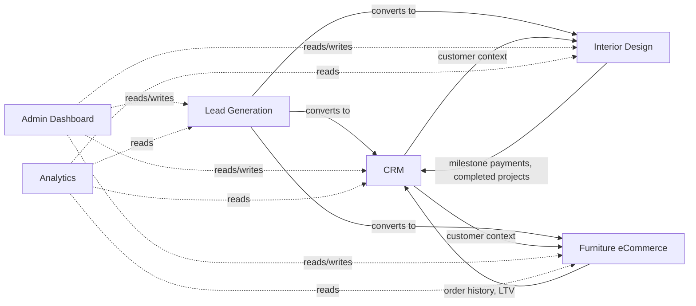
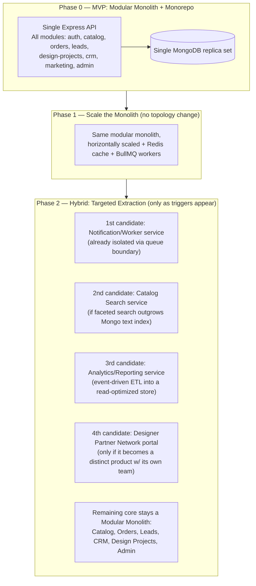

# Architecture Decision Record
## National Furniture & Interiors — Repository & Service Topology

**Prepared by:** Principal Software Architect (AI-assisted)
**Date:** 2026-08-07
**Depends on:** `docs/01_business_research.md`, `docs/02_enterprise_architecture.md`, `docs/03_database_design.md`
**Scope:** No implementation code — evaluation, decision, and repository layout only.

---

## Revision History

| Version | Date | Change | Reason |
|---|---|---|---|
| v1.0 | 2026-08-07 | Initial version | — |
| v1.1 | 2026-08-07 | Updated Folder-to-Module Traceability (§11) to include the `returns` and `outbox` collections added to `03_database_design.md` v1.1; added outbox-relay note to the `backend/` folder description (§10.3) | Maintains consistency with `03_database_design.md` v1.1 and `02_enterprise_architecture.md` v1.1, per `docs/00_architecture_review.md` findings A3 and B2 |

---

## 1. Framing Correction Before Evaluating

The five options as listed (Monolith, Modular Monolith, Monorepo, Microservices, Hybrid) mix **two different architectural axes**, and treating them as five mutually exclusive choices would produce a flawed comparison:

| Axis | What it governs | Options on this axis |
|---|---|---|
| **Runtime / service topology** | How the system is deployed and scaled — one process or many, one datastore boundary or many | Monolith, Modular Monolith, Microservices, Hybrid |
| **Source-control strategy** | How code is organized in version control — independent of how it's deployed | Monorepo, Polyrepo (multiple repositories) |

A **Monorepo can host a Monolith, a Modular Monolith, or a Microservices system equally well** — it is not a competing runtime architecture. Evaluating it on the same axis as "Microservices" would be comparing a filing system to a building design. This document evaluates the four runtime options against each other first (Section 3–5), then evaluates Monorepo vs. Polyrepo as a separate, orthogonal decision (Section 6), and combines both into a single recommendation (Section 7).

---

## 2. Business Domains Under Evaluation

| Domain | Nature | Data relationship to other domains |
|---|---|---|
| Furniture eCommerce | Transactional, catalog + checkout | Consumes Catalog/Inventory; feeds CRM (order history), Analytics |
| Interior Design | Long-cycle, project/workflow-based | Originates from Leads; consumes Payments (milestones); feeds Portfolio, CRM, Analytics |
| CRM | Aggregation/relationship layer | Reads from Leads, Orders, Design Projects, Users — **inherently a consumer of every other domain** |
| Lead Generation | Capture + qualification | Feeds CRM, Design Projects, and (via Bulk Enquiry/Quote Request) eCommerce |
| Admin Dashboard | Cross-cutting operational UI | Reads/writes across **every** domain — Catalog, Orders, Leads, Design Projects, CRM, Marketing |
| Analytics | Read-only aggregation/reporting | Reads from **every** domain — the most cross-cutting consumer in the system |

**Key observation driving this whole decision:** two of the six domains (Admin Dashboard, Analytics) are not independent business capabilities at all — they are **aggregate views over the other four**. And three of the remaining four (Lead Generation → CRM → Interior Design, with eCommerce as a parallel/converging path) form a **single connected business process**, not four independent products. This is the central fact that shapes the recommendation in Section 7.

---

## 3. The Four Runtime Architecture Options

### 3.1 Monolith (Unstructured)

A single deployable application with **no enforced internal module boundaries** — any part of the codebase can import any other part directly.

### 3.2 Modular Monolith

A single deployable application (as established in `02_enterprise_architecture.md`) with **enforced feature-based module boundaries**, Clean Architecture layering, and cross-module communication restricted to explicit service interfaces or domain events — internally structured as if it could be split apart, without actually being split apart at the network level.

### 3.3 Microservices

Each domain (or sub-domain) is an **independently deployable service** with its own datastore (or database-per-service pattern), communicating over the network via REST/gRPC/message broker, each independently scalable and independently owned.

### 3.4 Hybrid

A **Modular Monolith core** for tightly-coupled, transactionally-related domains, with **select bounded contexts extracted as independent services** only where a concrete trigger justifies the operational cost (independent scaling need, independent team ownership, independent deployment cadence, or a fundamentally different read/write profile such as analytics).

---

## 4. Evaluation Criteria

| Criterion | Why it matters here |
|---|---|
| Cross-domain data consistency | Leads → CRM → Design Projects → Payments is a single business transaction chain (per `03_database_design.md` §9.4–9.5); consistency here is not optional |
| Admin/Analytics aggregation cost | Both domains read across all others — the architecture must make this cheap, not expensive |
| Development velocity for a small/unified team | Per `01_business_research.md`, the platform is being built by one team against a phased MVP → roadmap, not multiple autonomous squads |
| Operational complexity / DevOps overhead | Team size and current maturity (per `02_enterprise_architecture.md` §17 production-readiness checklist) — every added moving part is a maintenance cost paid daily |
| Fault isolation / blast radius | Does a bug or outage in one domain take down unrelated domains? |
| Independent scalability | Do any of these six domains have a traffic/compute profile different enough to need separate scaling *today*? |
| Long-term maintainability | Does the option degrade gracefully as the codebase and team grow, or does it require a rewrite at some threshold? |
| Migration cost if wrong | How expensive is it to change course later if this choice turns out to be wrong? |

---

## 5. Evaluation Matrix

Scored qualitatively (Low / Medium / High) — this is a directional aid for the written analysis in Section 5.1–5.4, not a mechanical score to sum.

| Criterion | Monolith | Modular Monolith | Microservices | Hybrid |
|---|---|---|---|---|
| Cross-domain data consistency | High (single DB, but accidental — no enforced boundary to protect it) | High (single DB, boundary-enforced in code) | Low (distributed transactions/sagas required for Lead→Design→Payment chain) | High for the core; Medium for extracted services |
| Admin/Analytics aggregation cost | Low (direct queries) | Low (direct queries, or read-models within the same DB) | High (fan-out calls or a dedicated data-replication/ETL layer required from day one) | Low for core; Medium once Analytics is extracted (by design, with an ETL/event pipeline) |
| Development velocity (current team) | High initially, decays fast | High, sustained | Low initially (infra tax before feature 1 ships) | High (matches Modular Monolith at MVP) |
| Operational complexity | Low | Low | High (service mesh/discovery, distributed tracing, multiple CI/CD pipelines, multiple datastores) | Low initially, rises only as/when extraction happens |
| Fault isolation | None | Partial (in-process, but a crash still takes down the whole app) | High | High for extracted services; Partial for core |
| Independent scalability | None | None (whole app scales together) | High | Medium — core scales together; extracted services scale independently |
| Long-term maintainability | Degrades to "big ball of mud" without discipline | Sustained, if boundaries are enforced (Clean Architecture + module rule from `02_enterprise_architecture.md` §6) | High, but at a permanently higher operational floor | High — grows into the right shape over time |
| Migration cost if wrong | High (no boundaries to extract along) | Low (boundaries already exist — extraction is mechanical, per `02_enterprise_architecture.md` §0) | High to *consolidate back* if over-split | N/A — this is the designed landing zone |

---

### 5.1 Why plain Monolith is rejected

A monolith with no enforced boundaries is attractive for exactly one reason — nothing to set up. Everything else is a liability specific to this platform: with six domains this interconnected and a team that will grow, an unstructured codebase reliably degrades into implicit coupling (an Order-module function quietly importing a Lead-module repository directly) that is expensive to untangle later and makes the migration path in Section 8 far more costly than it needs to be. The Modular Monolith gets the same day-one simplicity with none of that downside.

### 5.2 Why Microservices is rejected *for now*

Microservices would be the right call if any of the following were true today: multiple autonomous teams each owning a domain, a domain with a wildly different scaling profile than the rest (e.g., Analytics needing to independently scale to handle 100x the query load of the transactional core), or a hard requirement for independent deployment cadence per domain. **None of these are true yet**, per `01_business_research.md`'s MVP framing. Worse, the two domains explicitly in scope — **Admin Dashboard and Analytics** — are the domains microservices punishes hardest: both need to read across every other domain, which in a microservices topology means either synchronous fan-out calls to five other services on every dashboard load (slow, fragile) or building a data-replication/event-sourcing/ETL pipeline (real engineering effort) **before you can ship the admin dashboard at all**. Paying that cost before validating the business (per the MVP phasing in `01_business_research.md` §6) is the wrong sequencing.

### 5.3 Why Modular Monolith is the strongest fit today

It directly matches the coupling reality in Section 2's diagram: Leads, CRM, Design Projects, and Orders are one business process sharing one consistent data layer (as already designed in `03_database_design.md`'s single-MongoDB, polymorphic-reference model), so keeping them in one deployable with enforced code-level boundaries gets consistency for free instead of re-engineering it with sagas. Admin Dashboard and Analytics get to query directly against a single, consistent data layer instead of orchestrating cross-service calls. And because the module boundaries are enforced in code exactly as designed in `02_enterprise_architecture.md` §0/§6/§7 (Clean Architecture layering, Repository Pattern, event bus for cross-module communication), **this is not a dead end** — it's a deliberately-prepared staging ground for the extraction described in Section 8.

### 5.4 Why Hybrid is the correct target state, not the starting state

Hybrid is where this system should end up — but only once a concrete trigger exists (Section 8.1). Starting there means guessing which domain to extract before there's traffic or team data to justify the guess, which risks extracting the wrong thing (or extracting prematurely and paying the operational tax without the corresponding benefit). The Modular Monolith *is* the on-ramp to Hybrid, not an alternative to it.

---

## 6. Monorepo vs. Polyrepo (Orthogonal Decision)

| Factor | Monorepo | Polyrepo |
|---|---|---|
| Shared TypeScript types/DTOs between `frontend` and `backend` | Single source of truth, refactored atomically across both sides in one PR | Requires a published/versioned shared-types package, published and bumped on every contract change — real coordination overhead for a small team |
| Two Next.js apps (`storefront`, `admin`) sharing a UI/design-system package (per `02_enterprise_architecture.md` §6.2) | Trivial — shared package lives in the same repo, consumed via workspace linking | Requires the shared UI package to be published and versioned independently |
| Atomic cross-cutting changes (e.g., a schema field rename touching backend model, API contract, and frontend form) | Single PR, single CI run, reviewable as one change | Multiple PRs across multiple repos, coordinated manually, prone to drift |
| CI/CD build scope | Requires build-graph tooling (Turborepo/Nx) to avoid rebuilding everything on every change | Naturally scoped per repo, but loses cross-repo dependency awareness |
| Team-ownership boundaries (relevant once/if Hybrid extraction happens) | Still expressible via CODEOWNERS and folder-level permissions | Natural fit once a service has a fully independent team and release cadence |
| Onboarding a new engineer | One clone, one setup, sees the whole system | Must know which of N repos to clone for a given task |

**Verdict:** Monorepo is the clear fit at this stage, for the same reason Modular Monolith is: the domains are tightly coupled, the team is small and unified, and the shared-TypeScript-contract benefit is concretely valuable given the MERN + TypeScript-everywhere stack already chosen in `02_enterprise_architecture.md`. Polyrepo becomes attractive again only in lockstep with a future Hybrid extraction that also gets its own team — at which point that *specific* extracted service can graduate to its own repository without disturbing the rest.

---

## 7. Recommendation

> **Modular Monolith (runtime) + Monorepo (source control), with an explicitly designed extraction path to Hybrid.**

This is not a new decision — it formalizes and justifies (with the domain-coupling evidence in Section 2 and the criteria-by-criteria analysis in Section 5) the architecture already assumed in `02_enterprise_architecture.md`'s ADR summary (§18: "Modular monolith, feature-based modules" chosen over "Microservices from day one"). This document is the record of *why*, evaluated specifically against all six business domains rather than backend structure alone.

**In one sentence:** the six domains are one connected business process wearing six different UI labels, plus two domains (Admin, Analytics) that are pure aggregations of the other four — so the architecture that fits is the one that keeps that process consistent and queryable in one place, while remaining structured enough to split apart later without a rewrite.

---

## 8. Trade-offs of the Recommendation (Honest Accounting)

| Trade-off accepted | Mitigation already designed in |
|---|---|
| **Deploy-together risk** — a bad deploy to one module can, in theory, affect the whole running application | Strong CI/CD gates (lint, type-check, unit + integration tests, per `02_enterprise_architecture.md` §16), health-check-gated rolling/blue-green deploys (§8.2, §17) |
| **No independent scaling per domain** — Catalog traffic spikes scale the same API containers as CRM/Design | Stateless, horizontally-scaled API tier (§4, §8) means scaling *the whole app* is still cheap; true per-domain scaling isn't needed until traffic profiles diverge significantly (Section 8.1 trigger) |
| **Boundary discipline is a process risk, not just a technical one** — nothing stops a developer from importing across module internals except code review and convention | Clean Architecture dependency rule + Repository Pattern + event bus are structurally enforced (not just documented) per `02_enterprise_architecture.md` §5–§7; recommend adding automated import-boundary linting (e.g., ESLint module-boundary rules) as a CI gate |
| **Single MongoDB instance is a shared blast radius** for availability | Replica set (minimum 3 nodes) from day one per `03_database_design.md` §14.1 — not a single point of failure, but still one logical cluster all domains depend on |
| **Monorepo build times can grow** as the codebase grows | Build-graph/caching tooling (Turborepo recommended, Section 10.1) keeps CI scoped to what actually changed |
| **Eventual ceiling exists** — at genuinely large scale (multiple engineering teams, domain-specific compliance/data-residency needs, wildly divergent traffic profiles) this architecture will need to evolve | This is by design, not a flaw — Section 9 is the pre-planned path, not a hypothetical |

---

## 9. Future Migration Path

### 9.1 Extraction Readiness Checklist

A domain is a **good extraction candidate** only when it meets most of these — extracting without them turns Hybrid into premature microservices with all of Section 5.2's costs and none of the benefit:

- [ ] The domain already communicates with the rest of the system only through the event bus / defined service interfaces (per `02_enterprise_architecture.md` §6), not direct internal imports
- [ ] It has a genuinely different scaling profile (e.g., read-heavy analytics vs. write-heavy transactional core)
- [ ] It has (or will imminently have) a dedicated team that benefits from independent deploy cadence
- [ ] Cross-domain operations involving it can tolerate eventual consistency (no domain requiring a same-transaction guarantee with the core should be extracted first)
- [ ] There's a concrete, measured trigger (traffic data, team size, a compliance boundary) — not a speculative "might need it later"

### 9.2 Ranked Extraction Candidates (When Triggers Appear)

| Candidate | Trigger that would justify extraction | Why it's ranked here |
|---|---|---|
| Notification/Worker service | Already architecturally isolated (BullMQ worker container, per `02_enterprise_architecture.md` §8) — extraction is closer to "promote an existing container to its own repo" than a redesign | Lowest-risk, lowest-cost first extraction if/when notification volume or provider complexity grows |
| Catalog Search | Redis cache-aside + Mongo text index (per `03_database_design.md` §10.4) stops being sufficient for filter/facet performance at scale | Well-understood extraction pattern (dedicated search index service), doesn't touch the core transactional chain |
| Analytics/Reporting | Reporting aggregations (per `03_database_design.md` §11) start competing with OLTP load even on secondary replicas | Naturally read-only and eventually-consistent by nature — the *easiest* domain to extract correctly, once volume justifies the ETL investment |
| Designer Partner Network | Only relevant if `01_business_research.md`'s Phase 2 partner-network model is adopted **and** it grows a dedicated team/product identity | Deferred and conditional — do not build ahead of the business decision |

**Explicitly not on this list, and not recommended for extraction even at scale:** Leads, CRM, Design Projects, Orders, Admin core. These remain in the Modular Monolith because they participate in the same business transaction chain (Section 2) — splitting them would trade the consistency they get for free today for distributed-transaction complexity with no corresponding benefit.

---

## 10. Repository Design

The repository is a **single Monorepo** implementing the **Modular Monolith** backend and the **two-app frontend** (storefront + admin) design from `02_enterprise_architecture.md` §4/§6.2, organized under the top-level layout requested, with each folder's role and boundaries explained.

### 10.1 Root-Level Overview

- `frontend/` — both Next.js applications (storefront, admin) and shared frontend-only packages
- `backend/` — the modular-monolith Express API (single deployable), organized feature-based per `02_enterprise_architecture.md` §6.1
- `database/` — MongoDB operational tooling: migrations, seeds, index management, backup/restore scripts (distinct from `backend/`'s runtime Mongoose schemas)
- `docker/` — all Dockerfiles and Compose files for every environment
- `scripts/` — cross-cutting automation (setup, codegen, CI helpers, deployment)
- `docs/` — this document and its predecessors (`01`–`03`), plus future ADRs, runbooks, API references
- `public/` — truly global static assets not owned by a single app
- `shared/` — cross-stack TypeScript contracts consumed by **both** `frontend/` and `backend/`
- `testing/` — cross-cutting test infrastructure (e2e, load testing, shared fixtures) that doesn't belong to a single module
- `assets/` — raw/source design and brand assets, pre-processing (not directly served)
- Root config: `package.json` (workspace root), `turbo.json`, `.env.example`, `.gitignore`, `README.md`, `CODEOWNERS`, `.github/workflows/`

**Build orchestration recommendation:** **Turborepo** — lightweight, integrates cleanly with the Next.js/Vercel-adjacent ecosystem already in the stack, and its remote-caching + task-graph model directly addresses the "monorepo build times grow" trade-off in Section 8, without the steeper learning curve of Nx's plugin/generator system. Revisit Nx only if the repository later needs its more advanced code-generation or a polyglot toolchain beyond Node/TypeScript.

### 10.2 `frontend/`

Houses both customer-facing and admin Next.js 15 applications, matching `02_enterprise_architecture.md` §4's decision to keep them as separate deployables sharing a design system, plus the packages that make sharing possible.

- `frontend/apps/storefront/` — customer-facing Next.js app
  - `app/` — App Router routes grouped by feature: `(marketing)`, `(interior-design)`, `(catalog)`, `(cart-checkout)`, `(account)`
  - `features/` — `leads/`, `design-projects/`, `catalog/`, `cart/`, `orders/` — each with its own components, hooks, API-client calls, and types, mirroring backend module names for 1:1 traceability
  - `public/` — this app's own served static assets (favicon, OG images) — distinct from the top-level `public/` (Section 10.7)
  - app-level config (`next.config`, `tailwind.config`, etc.)
- `frontend/apps/admin/` — admin-facing Next.js app
  - `app/` — route groups per module: `(leads)`, `(design-projects)`, `(catalog)`, `(orders)`, `(reports)`, `(users-roles)`
  - `features/` — mirrors backend module names, same pattern as storefront
  - `public/` — admin app's own static assets
- `frontend/packages/ui/` — shared Shadcn UI/Tailwind design-system components consumed by both apps
- `frontend/packages/api-client/` — typed API client wrapping calls to `backend/`, built on the contract types from top-level `shared/` (Section 10.8)
- `frontend/packages/config/` — shared ESLint/TypeScript/Tailwind base configs consumed by both apps and both packages

**Boundary rule:** `storefront` and `admin` never import from each other directly — only through `frontend/packages/*`. This mirrors the backend module-boundary rule and keeps the customer-facing bundle free of admin-only code.

### 10.3 `backend/`

The modular-monolith Express API — single deployable, exactly as designed in `02_enterprise_architecture.md` §5–§7.

- `backend/src/core/` — config, logger, error handler, DI composition root, base repository, response envelope, domain event bus (the Shared Kernel from `02_enterprise_architecture.md` §6), and the **outbox relay process** (polls the `outbox` collection and enqueues jobs to BullMQ — implements the Transactional Outbox pattern in `02_enterprise_architecture.md` §16 and `03_database_design.md` §9.8.4, added v1.1 to resolve review finding A3). The relay lives in `core/` rather than any single feature module because every module that writes domain events depends on it.
- `backend/src/modules/` — one folder per feature module (`auth`, `users`, `leads`, `design-projects`, `catalog`, `cart`, `orders`, `payments`, `reviews`, `media`, `notifications`, `cms`, `admin`, `analytics`), each internally split into `domain/`, `application/`, `infrastructure/`, `presentation/` per the Clean Architecture layering
- `backend/src/shared/` — cross-module types/DTOs used only *within the backend* (not exposed to frontend — that's what top-level `shared/` is for)
- `backend/src/app.ts` — Express app assembly
- `backend/src/server.ts` — process entry point
- `backend/src/composition-root.ts` — DI wiring for the whole application
- `backend/src/workers/` — BullMQ worker entry points (notification dispatch, lead-nurture scheduling, cache warming) — same module code, separate process entry point per `02_enterprise_architecture.md` §8's `worker` container

**Boundary rule:** a module's `infrastructure/` and `domain/` are never imported by another module directly — cross-module calls go through an explicitly exported `application/` service interface or a domain event, exactly as specified in `02_enterprise_architecture.md` §6. This is the rule an ESLint module-boundary plugin (Section 8) should enforce mechanically, not just by convention.

### 10.4 `database/`

Operational MongoDB tooling — distinct from `backend/`'s runtime Mongoose schemas, which define *how the app reads/writes*; this folder governs *how the database evolves and is provisioned*.

- `database/migrations/` — versioned migration scripts (schema changes, backfills, index changes) run via a migration runner, ordered and tracked
- `database/seeds/` — environment-specific seed data (local dev, staging demo data) — never run against production
- `database/indexes/` — index-definition manifests reflecting the strategy in `03_database_design.md` §10, applied via a script rather than ad hoc `createIndex` calls scattered through application code
- `database/backups/` — backup/restore runbook scripts (not the backups themselves, which belong in managed cloud storage, not the repo)
- `database/validators/` — `$jsonSchema` validator definitions matching `03_database_design.md` §12, applied per collection via migration

### 10.5 `docker/`

- `docker/frontend/Dockerfile.storefront`, `docker/frontend/Dockerfile.admin` — per-app frontend builds
- `docker/backend/Dockerfile.api`, `docker/backend/Dockerfile.worker` — API and worker builds from the same backend codebase, different entry points
- `docker/nginx/` — reverse proxy config, TLS termination settings
- `docker-compose.local.yml`, `docker-compose.staging.yml` — environment-specific compose files (kept at repo root or here, per team convention — documented explicitly to avoid the "which compose file is real" confusion)
- `docker/.dockerignore` — shared ignore rules

### 10.6 `scripts/`

Cross-cutting automation that isn't specific to one app or the database:

- `scripts/setup/` — one-command local environment bootstrap (env file generation, dependency install, DB seed trigger)
- `scripts/codegen/` — feature-module scaffolding generator (creates a new backend module's `domain/application/infrastructure/presentation` skeleton, and a matching frontend `features/` folder) — keeps the module-boundary convention from Section 10.3 consistent as new modules are added
- `scripts/ci/` — CI helper scripts (test-result aggregation, changed-package detection for Turborepo-scoped CI runs)
- `scripts/deploy/` — deployment trigger/rollback helper scripts invoked by CI/CD

### 10.7 `docs/`

Already in use (`01_business_research.md`, `02_enterprise_architecture.md`, `03_database_design.md`, this document). Recommended future additions as the project matures:

- `docs/adr/` — future architecture decision records beyond this one, numbered sequentially
- `docs/api/` — generated/maintained API reference (OpenAPI spec once the API stabilizes)
- `docs/runbooks/` — operational runbooks (incident response, backup/restore, deployment rollback) referenced in `02_enterprise_architecture.md` §17

### 10.8 `public/`

Reserved for static assets that are **global to the whole platform**, not owned by either Next.js app individually — for example, a root-domain marketing redirect page's assets, or a shared `robots.txt`/`sitemap.xml` strategy spanning both `storefront` and `admin` subdomains. In practice, **most static assets belong inside each app's own `frontend/apps/*/public/`** (Section 10.2) so they're versioned and deployed alongside the app that uses them. Use this top-level folder sparingly and only for assets that are genuinely shared build inputs (e.g., a shared favicon source copied into both apps' `public/` via a `scripts/` step) — treat it as a source-of-truth for things that get *distributed into* the apps, not as a third public folder competing with the other two.

### 10.9 `shared/`

The cross-stack contract layer — the primary payoff of choosing Monorepo (Section 6). Consumed by **both** `frontend/packages/api-client` and `backend/src/modules/*`.

- `shared/types/` — TypeScript interfaces for API request/response DTOs, mirrored to the `03_database_design.md` entity shapes where relevant (e.g., `Lead`, `DesignProject`, `Order` shapes as seen over the API boundary, not the internal Mongoose document shape)
- `shared/enums/` — status/type enums (`LeadStatus`, `OrderFulfillmentStatus`, `DesignProjectStage`, matching `03_database_design.md`'s enum fields exactly) — defined once, imported everywhere, eliminating the class of bug where frontend and backend enums silently drift apart
- `shared/validation/` — Zod schemas used for both backend request validation (`02_enterprise_architecture.md` §16) and frontend form validation, so validation rules are defined once
- `shared/constants/` — cross-cutting constants (pagination defaults, file-upload size limits, currency codes)

**Boundary rule:** `shared/` depends on nothing else in the repo (no imports from `frontend/` or `backend/`) — it is the one folder every other top-level folder is allowed to depend on, never the reverse. This keeps it genuinely shared rather than becoming a dumping ground with hidden circular dependencies.

### 10.10 `testing/`

Cross-cutting test infrastructure that doesn't belong inside a single module or app (module-level unit tests stay colocated inside `backend/src/modules/*/​__tests__` and `frontend/apps/*/features/*/__tests__` per standard practice, and are *not* duplicated here).

- `testing/e2e/` — end-to-end tests spanning frontend + backend (e.g., Playwright: full checkout flow, full lead-to-design-project flow), run against a `docker-compose` test environment
- `testing/load/` — load-testing scripts (e.g., k6/Artillery) validating the production-readiness checklist item in `02_enterprise_architecture.md` §17 ("load test performed against realistic catalog size + concurrent checkout scenario")
- `testing/fixtures/` — shared test data factories/fixtures consumed by both backend integration tests and frontend e2e tests, so test data shapes don't drift from `shared/types/`
- `testing/integration/` — backend integration tests that exercise a real containerized MongoDB/Redis (per `02_enterprise_architecture.md` §16's testing strategy) where colocating inside a single module's folder would be misleading, because they cross module boundaries by nature (e.g., "placing an order correctly decrements inventory")

### 10.11 `assets/`

Raw/source creative assets — **not** directly served to end users (that's `public/` and each app's own `public/`). This is the pre-processing source-of-truth.

- `assets/brand/` — logo source files (SVG/AI/Figma exports), brand guideline documents referenced in `01_business_research.md` §3.4's "Existing Assets Required"
- `assets/design-system/` — Figma/design-tool exports backing `frontend/packages/ui`
- `assets/email-templates/` — source templates for transactional/marketing email (rendered by the `notifications` module)
- `assets/marketing/` — raw marketing collateral before it's uploaded to Cloudinary and referenced via `media`/`design_project_assets` (per `03_database_design.md` §9.4.2)

**Boundary rule:** nothing in `assets/` is imported by running application code — it's a source repository for humans and build-time tooling (e.g., an image-optimization script that reads from `assets/` and uploads processed output to Cloudinary), not a runtime dependency.

---

## 11. Folder-to-Module Traceability

Confirms every backend module from `02_enterprise_architecture.md` §6 and every collection group from `03_database_design.md` §4 has an unambiguous home.

| Backend module (`02_enterprise_architecture.md` §6) | Backend folder | Primary collections owned (`03_database_design.md`) | Frontend feature folder(s) |
|---|---|---|---|
| `auth` | `backend/src/modules/auth/` | `users`, `roles`, `permissions`, `refresh_tokens`, `otp_verifications`, `password_reset_tokens` | `frontend/apps/*/features/auth/` |
| `leads` | `backend/src/modules/leads/` | `leads`, `quote_requests`, `site_visits`, `contact_form_submissions`, `bulk_enquiries` | `frontend/apps/storefront/features/leads/`, `frontend/apps/admin/features/leads/` |
| `design-projects` | `backend/src/modules/design-projects/` | `design_projects`, `design_project_assets`, `portfolios`, `consultations`, `appointments` | `frontend/apps/storefront/features/design-projects/`, `frontend/apps/admin/features/design-projects/` |
| `catalog` | `backend/src/modules/catalog/` | `categories`, `product_collections`, `products`, `warehouses`, `inventory`, `inventory_movements` | `frontend/apps/storefront/features/catalog/`, `frontend/apps/admin/features/catalog/` |
| `cart` / `orders` / `payments` | `backend/src/modules/cart/`, `orders/`, `payments/` | `carts`, `wishlists`, `coupons`, `coupon_redemptions`, `orders`, `payments`, `invoices`, `returns` *(added v1.1 — owned by `orders/`, resolves review finding B2)* | `frontend/apps/storefront/features/{cart,orders}/`, `frontend/apps/admin/features/orders/` |
| `crm` | `backend/src/modules/crm/` (introduced alongside `leads`) | `customers`, `lead_status_history`, `lead_activities` | `frontend/apps/admin/features/crm/` |
| `cms` | `backend/src/modules/cms/` | `blogs`, `testimonials`, `banners`, `newsletter_subscribers` | `frontend/apps/storefront/features/cms/`, `frontend/apps/admin/features/marketing/` |
| `admin` | `backend/src/modules/admin/` | (RBAC/audit cross-cutting; reads across all above) | `frontend/apps/admin/` (entire app) |
| `analytics` | `backend/src/modules/analytics/` | (read-models/aggregations across all above, per `03_database_design.md` §11) | `frontend/apps/admin/features/reports/` |
| `notifications` | `backend/src/modules/notifications/` + `backend/src/workers/` | `notifications` | (consumed indirectly; no dedicated UI feature) |

**Note (added v1.1):** the `outbox` collection (`03_database_design.md` §9.8.4) is not owned by any single feature module — it's written to by whichever module publishes a domain event (leads, orders, design-projects, etc.) and relayed by the outbox-relay process in `backend/src/core/` (§10.3). It's infrastructure shared across modules, not a module-owned collection, which is why it doesn't appear as a row in this table.

---

## 12. Open Items

- **ESLint module-boundary enforcement** (Section 8) is recommended but not yet configured — should be added as a CI gate before the module count grows past the point where convention alone is reliable.
- **Turborepo vs. Nx** final tooling choice (Section 10.1) should be confirmed with whoever sets up CI, in case team familiarity outweighs the stated trade-off.
- **`shared/` package publishing strategy**: within the Monorepo it's consumed via workspace linking; if any extracted service (Section 9.2) ever leaves the Monorepo, `shared/` contracts relevant to it will need to be published as a versioned package at that time — not a Day-1 concern, flagged for Phase 2 planning.
- This document assumes the team composition and MVP phasing from `01_business_research.md` remain accurate; if team size or funding materially changes the "small unified team" premise in Section 5.3, this recommendation should be revisited rather than assumed to still hold.
