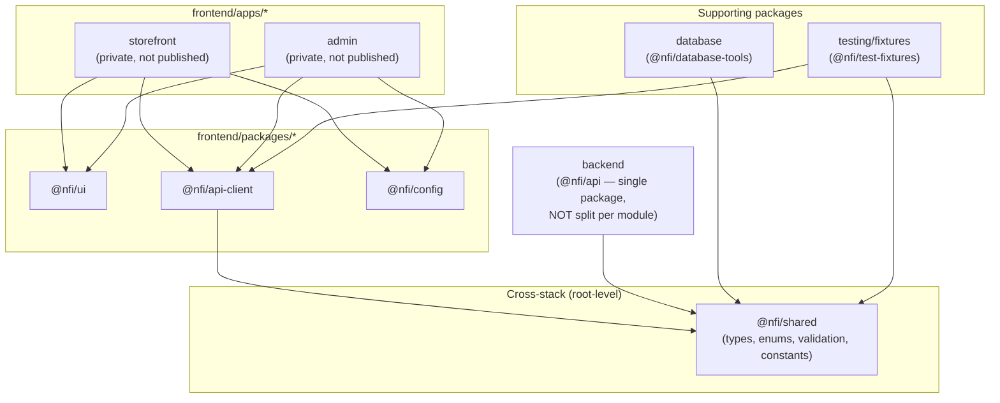
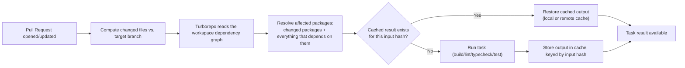
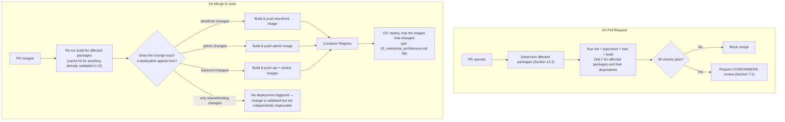
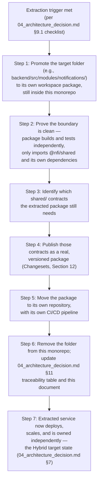

# Phase 5: Repository Strategy
## National Furniture & Interiors Platform

**Prepared by:** Enterprise Architecture Review Board
**Date:** 2026-08-07
**Status of `01`–`04`:** LOCKED and approved. This document does not redesign business requirements, runtime architecture, database decisions, or the Monorepo/Modular-Monolith topology already decided in `04_architecture_decision.md`. It treats all four as source of truth and builds the next layer of detail on top of them.
**Scope:** No implementation code — evaluation, decision, and repository organization only, per the same convention as `01`–`04`.

---

## 0. What Is and Isn't Being Decided Here

`04_architecture_decision.md` §6–§7 already made and justified the foundational call: **Monorepo (source control) + Modular Monolith (runtime)**, with Turborepo named as a lightweight build-orchestration recommendation in §10.1. That decision is not reopened. What Phase 5 adds is what `04_architecture_decision.md` didn't attempt: a full evaluation of the *tooling* that implements the monorepo (pnpm Workspaces vs. Turborepo vs. Nx — three genuinely different, comparable tools that `04` never put side by side), and the complete operational detail a repository this shape needs before real development starts — workspace layout, package boundaries, dependency and versioning rules, build pipeline, CI/CD, and the concrete mechanics of the extraction path `04_architecture_decision.md` §9 already approved in principle.

Everything in this document is additive to `01`–`04`, not a substitute for any of them. Section 15 is an explicit consistency check confirming that.

---

## 1. Evaluation Criteria

Per the brief, every option below is judged against the same nine criteria:

| Criterion | What it measures here |
|---|---|
| Team collaboration | How easily a small, unified team (per `01_business_research.md`'s MVP framing and `04_architecture_decision.md` §5.3's team-size premise) works across the codebase without stepping on each other |
| Feature isolation | Whether a change to one feature module (`leads`, `catalog`, `design-projects`, etc.) can be made, reviewed, and tested without touching unrelated code |
| Shared code | How cleanly TypeScript types, UI components, and validation logic are shared between the two Next.js apps and the backend, per the cross-stack contract design in `04_architecture_decision.md` §10.9 |
| CI/CD | Whether CI can scope itself to what actually changed, and whether deployments can target individual apps/services independently |
| Scalability | How the option holds up as module count, package count, and contributor count grow |
| Deployment | Fit with the container-per-service deployment model already locked in `02_enterprise_architecture.md` §8 |
| Versioning | How internal package versions are tracked and resolved across apps that consume them |
| Developer experience | Onboarding friction, local dev loop speed, tooling learning curve |
| Future expansion | Fit with the Hybrid extraction roadmap already approved in `04_architecture_decision.md` §9 |

---

## 2. Two Axes, Not Six Peers

The six named options split across two independent axes, exactly as `04_architecture_decision.md` §1 already established for the Monorepo-vs.-Polyrepo question — this section extends that same discipline to the three tooling options, which weren't evaluated there at all:

| Axis | Question it answers | Options |
|---|---|---|
| **Repository count** | How many physical Git repositories hold the code? | Single Repository, Monorepo, Polyrepo |
| **Workspace tooling** | Given a Monorepo, what manages package linking, dependency resolution, and build/task orchestration inside it? | pnpm Workspaces, Turborepo, Nx Workspace |

A "Turborepo" is not a rival to "Monorepo" — it's a tool that operates *inside* one. Treating all six as directly comparable would repeat the exact category error `04_architecture_decision.md` §1 already corrected for Monorepo vs. Polyrepo. Section 3 evaluates the repo-count axis (reconfirming, not reopening, the locked decision). Section 4 evaluates the tooling axis, which is the genuinely new decision this phase makes.

---

## 3. Repository Count — Reconfirming the Locked Decision

| Criterion | Single Repository (undifferentiated) | Monorepo (structured, LOCKED CHOICE) | Polyrepo |
|---|---|---|---|
| Team collaboration | Simple but doesn't scale past a handful of contributors without stepping on each other | Good — clear package boundaries, single PR for cross-cutting changes | Fragmented — a single feature change can require coordinated PRs across repos |
| Feature isolation | None — no enforced boundaries between `storefront`, `admin`, and `backend` code | Strong — enforced via workspace packages + the Clean Architecture/module rules already in `02_enterprise_architecture.md` §5–§7 | Strong by construction, but at the cost of shared-code friction |
| Shared code | Painful — copy-paste or manual sync between apps | Native — `workspace:*` linking, single source of truth (`04_architecture_decision.md` §10.9) | Requires publishing and versioning every shared package independently |
| CI/CD | Runs everything on every change | Can scope to affected packages (tooling-dependent, Section 4) | Naturally scoped per repo, but loses cross-repo dependency awareness |
| Scalability | Degrades quickly as the two Next.js apps and 14 backend modules (`02_enterprise_architecture.md` §6.1) grow | Scales well with the right tooling | Scales per-repo but the coordination overhead grows with repo count |
| Deployment | No natural boundary matching the container-per-service model in `02_enterprise_architecture.md` §8 | Each workspace package maps cleanly to a container build target | Natural 1:1 repo-to-service fit, but only valuable once services are actually independent, which they aren't yet (`04_architecture_decision.md` §9) |
| Versioning | N/A — no package boundaries | Internal `workspace:*` linking, no premature semver (Section 10) | Requires real semantic versioning and publishing from day one |
| Developer experience | Simple until it isn't | One clone, one setup, whole system visible | Must know which of N repos to touch for a given task |
| Future expansion | Would require a full restructure to support extraction | Extraction-ready by design (`04_architecture_decision.md` §9) | Already there, but arrived too early relative to the extraction triggers `04` defines |

**Reconfirmed, not re-decided: Monorepo.** This matches `04_architecture_decision.md` §7's conclusion exactly, for the same reason: the six business domains are tightly coupled (leads → CRM → design projects → orders as one connected process, per `04_architecture_decision.md` §2), and Single Repository can't support the two-Next.js-app-plus-shared-packages structure already locked in `04_architecture_decision.md` §10 without becoming exactly what "Monorepo" already means. Polyrepo remains rejected for the same reasons `04_architecture_decision.md` §6 gave: it trades away the shared-TypeScript-contract benefit that's concretely valuable given the MERN + TypeScript-everywhere stack, before there's any team-ownership boundary that would justify the cost.

---

## 4. Workspace Tooling — The New Decision

This is the comparison `04_architecture_decision.md` didn't do — it recommended Turborepo in one paragraph (§10.1) without weighing it against Nx or plain pnpm Workspaces. Phase 5 does that properly.

### 4.1 pnpm Workspaces (foundation — used regardless of the outcome below)

**What it is:** the package manager's native workspace/linking feature — a `pnpm-workspace.yaml` glob defines which folders are workspace packages; pnpm links them locally via `workspace:*` and installs dependencies into a content-addressable store with strict, non-hoisted `node_modules` per package.

| Criterion | Assessment |
|---|---|
| Team collaboration | Neutral — this is plumbing, not a collaboration feature |
| Feature isolation | **Strong, and underappreciated:** pnpm's strict `node_modules` isolation means a package can only import what it explicitly declares as a dependency — nothing hoisted from a sibling package is accidentally importable. This *technically enforces* the Clean Architecture/module-boundary rules `02_enterprise_architecture.md` §5–§7 already specify, not just via lint convention |
| Shared code | Excellent — `workspace:*` protocol is the mechanism every other layer depends on |
| CI/CD | **Gap:** no built-in task orchestration, caching, or affected-package detection. `pnpm -r build` runs every package's build script every time |
| Scalability | Install performance scales very well (this is pnpm's core strength); *task* execution does not, without something on top |
| Deployment | No opinion — doesn't touch build/deploy concerns |
| Versioning | Handles internal linking correctly; no external-publishing story built in |
| Developer experience | Fast installs, low disk usage, simple mental model, minimal config |
| Future expansion | Neutral — orthogonal to extraction |

**Conclusion:** necessary, not sufficient. Every option below runs on top of pnpm Workspaces, not instead of it.

### 4.2 Turborepo (task orchestration on top of pnpm Workspaces)

**What it is:** a build-graph/task-runner that reads the workspace's package dependency graph, runs tasks (build/lint/test/typecheck) only for packages affected by a given change plus their dependents, and caches task outputs locally and via remote cache.

| Criterion | Assessment |
|---|---|
| Team collaboration | Good — fast, predictable CI feedback keeps PR review loops tight |
| Feature isolation | Reinforces it operationally: a change inside `frontend/features/leads/` triggers rebuilds/tests only for the packages that actually depend on it |
| Shared code | No change to the sharing model itself — orchestrates around it |
| CI/CD | **Directly resolves** the "monorepo build times can grow" trade-off `04_architecture_decision.md` §8 flagged and accepted with a mitigation pointer to exactly this tool |
| Scalability | Scales well for a JS/TS-only, small-to-mid-size monorepo — which is what this is (MERN stack, no polyglot requirement) |
| Deployment | Clean mapping: each app/package with a `build` task produces the artifact its Dockerfile (`04_architecture_decision.md` §10.5) consumes |
| Versioning | No built-in opinion — pairs with Changesets if/when external publishing is needed (Section 10) |
| Developer experience | **Minimal config, near-zero-friction Next.js integration** — both frontend apps are Next.js 15 (`02_enterprise_architecture.md` §2), and Turborepo is built by the same team, with first-class support as a result. This is a concrete, stack-specific synergy, not a generic endorsement |
| Future expansion | Package-level task boundaries map cleanly onto the extraction candidates already ranked in `04_architecture_decision.md` §9.2 |

**Gap:** Turborepo has no formal module-boundary *enforcement* mechanism of its own (no equivalent to Nx's tag-based constraints) — it orchestrates builds, it doesn't police imports. That gap is real and is closed separately (Section 4.4).

### 4.3 Nx Workspace (full toolkit alternative)

**What it is:** a more complete monorepo platform — computation caching (local + Nx Cloud), a formal, visualizable project graph, code generators/scaffolding, and **enforced module-boundary rules via project tags** (`@nx/enforce-module-boundaries`), with support for multiple package managers and polyglot repos.

| Criterion | Assessment |
|---|---|
| Team collaboration | Strong for larger, multi-squad orgs; more ceremony than a small unified team (`04_architecture_decision.md` §5.3's stated premise) needs today |
| Feature isolation | **Strongest of the three on paper** — tag-based constraints can directly encode "domain layer must not import infrastructure" as an enforced rule, not just a documented convention |
| Shared code | Equivalent to Turborepo's — both sit on top of the same workspace-linking foundation |
| CI/CD | Equivalent affected-graph capability to Turborepo, plus a visual dependency graph (`nx graph`) that doubles as always-accurate architecture documentation — a genuine answer to the docs-drift risk flagged as finding DX2 in `00_architecture_review.md` |
| Scalability | Built for larger scale and polyglot repos — capability this platform doesn't currently need (MERN/TypeScript only, per `02_enterprise_architecture.md` §2) |
| Deployment | Equivalent to Turborepo's |
| Versioning | Built-in release/versioning tooling, more relevant once external publishing is needed |
| Developer experience | **Steeper learning curve** — plugin system, executors, and generators are real conceptual overhead for a small team building an MVP under the phasing in `01_business_research.md` §6 |
| Future expansion | Slightly ahead of Turborepo here (its tooling anticipates larger, multi-team futures) but this platform's approved future is the *narrow, triggered* Hybrid extraction in `04_architecture_decision.md` §9 — not a general-purpose large-org monorepo, which is what Nx is optimized for |

**Gap:** Nx would also require reconciling **two parallel module-boundary systems** — the Clean Architecture layering + custom ESLint rule already specified in `02_enterprise_architecture.md` §5–§7 and `04_architecture_decision.md` §8, and Nx's own tag/constraint system. Without careful 1:1 mapping, that's duplication risk, not reinforcement.

### 4.4 Evaluation Matrix Summary

| Criterion | pnpm alone | + Turborepo | + Nx |
|---|---|---|---|
| Team collaboration | Neutral | Good | Good, more ceremony |
| Feature isolation | Strong (install-level) | Strong (install + orchestration) | Strongest (install + orchestration + enforced constraints) |
| Shared code | Excellent | Excellent | Excellent |
| CI/CD | Weak (no affected-graph) | Strong | Strong + visual graph |
| Scalability | Install: excellent; tasks: weak | Strong for this stack's size | Strong, built for larger |
| Deployment | Neutral | Clean fit | Clean fit |
| Versioning | Linking only | Linking only, pairs with Changesets | Linking + built-in release tooling |
| Developer experience | Simple, minimal | Simple, minimal, near-zero Next.js friction | More powerful, steeper curve |
| Future expansion | Neutral | Fits the approved narrow-extraction roadmap | Slightly overbuilt for the approved roadmap |

---

## 5. Decision

> **pnpm Workspaces (dependency linking) + Turborepo (build/task orchestration), with the module-boundary enforcement gap closed by the ESLint module-boundary rule already recommended in `04_architecture_decision.md` §8 — not by adopting Nx.**

### Justification

Every one of the nine criteria favors this pairing for the platform as it's actually scoped in `01`–`04`, not as it might hypothetically be someday: a small, unified team (`04_architecture_decision.md` §5.3) building a TypeScript-only, MERN-stack, two-Next.js-app monorepo (`02_enterprise_architecture.md` §2, §4) against a phased MVP (`01_business_research.md` §6) with a *narrow, triggered* future extraction path (`04_architecture_decision.md` §9) — not a general-purpose, multi-team, polyglot future. Nx's extra power (tag-based constraints, generators, polyglot support, Nx Cloud) is real, but it's power this platform doesn't need yet, at a real cost (steeper learning curve, a second module-boundary system to reconcile with the one already locked in `02_enterprise_architecture.md`). Turborepo closes the one genuine gap in pnpm-alone (task orchestration and CI caching) with the least additional surface area, and its Next.js-specific synergy is a concrete fit for this exact stack, not a generic preference.

This decision **fully justifies, and does not contradict**, `04_architecture_decision.md` §10.1's lightweight Turborepo recommendation — it replaces "recommended, revisit if team familiarity outweighs it" (§10.1, flagged as an explicit open item in §12) with a reasoned decision against the two real alternatives.

### Revisit trigger (same pattern as `02_enterprise_architecture.md` §7.3's DI-library revisit condition, for consistency)

Revisit Nx only if **one or more** becomes true: module count grows past roughly 20 backend modules or the team splits into multiple squads with genuinely independent release cadences (mirroring the DI-framework revisit threshold already set in `02_enterprise_architecture.md` §7.3); the platform needs a non-JS/TS toolchain in the same repo; or the hand-maintained ESLint module-boundary rule proves insufficient in practice (repeated boundary violations slipping through code review) and a formally enforced constraint system becomes worth the migration cost.

---

## 6. Trade-offs Accepted

| Trade-off | Why it's accepted |
|---|---|
| No formally *enforced* module-boundary constraint system (only a lint rule) | The lint rule was already the plan in `04_architecture_decision.md` §8; Turborepo doesn't remove that plan, it just doesn't replace it with something stronger. Acceptable at current team size; the revisit trigger above exists precisely for when it stops being acceptable |
| Turborepo's remote cache (if hosted on Vercel Remote Cache) introduces a soft dependency on Vercel's infrastructure for cache performance (not correctness — a cache miss just means a slower, not broken, build) | A self-hostable remote cache is also available (Turborepo's remote caching protocol is open, not Vercel-exclusive) — Section 12 records this as a deployment-independent decision to be made when CI infrastructure is finalized |
| No built-in codegen/scaffolding tool | Already addressed independently — `04_architecture_decision.md` §10.6 already designs a custom `scripts/codegen/` generator for new-module scaffolding, so Nx's generator system isn't filling a gap that's otherwise open |

---

## 7. Repository Layout

The top-level layout is **exactly** the one locked in `04_architecture_decision.md` §10 — `frontend/`, `backend/`, `database/`, `docker/`, `scripts/`, `docs/`, `public/`, `shared/`, `testing/`, `assets/` — unchanged. This section adds the root-level tooling configuration layer that `04_architecture_decision.md` §10.1 named but didn't detail.

### 7.1 Root-Level Files (elaborating `04_architecture_decision.md` §10.1)

- `package.json` — workspace root manifest; declares the pnpm workspace glob and root-level dev dependencies (Turborepo, shared linting/formatting tooling) only — no runtime dependencies live at the root
- `pnpm-workspace.yaml` — the workspace member glob (Section 8)
- `pnpm-lock.yaml` — single lockfile for the entire repository (Section 11)
- `turbo.json` — the task pipeline definition (Section 12)
- `.npmrc` — pnpm behavior settings (strict peer dependency handling, hoisting exceptions if any are ever needed)
- `tsconfig.base.json` — shared TypeScript compiler options extended by every package's own `tsconfig.json`
- `.env.example` — documents every environment variable used anywhere in the repo, without values (Section 9)
- `.gitignore`, `.dockerignore` (root-level shared rules; `docker/.dockerignore` per `04_architecture_decision.md` §10.5 remains for Docker-build-context-specific exclusions)
- `README.md` — repository-level onboarding entry point
- `CODEOWNERS` — ownership mapping per top-level folder/workspace package, closing the DX1 gap flagged in `00_architecture_review.md` (branching/PR policy is a process decision made alongside this, not a repository-structure one, and is out of this document's scope)
- `.github/workflows/` (or equivalent CI provider config) — Section 13

---

## 8. Workspace Organization

### 8.1 Workspace Member Glob

The `pnpm-workspace.yaml` glob (described, not shown as code) covers: `frontend/apps/*`, `frontend/packages/*`, `backend`, `shared`, `database`, `testing/fixtures`, and `scripts` where those have their own `package.json`. Each glob match is a **workspace package** — a folder with its own `package.json`, independently declaring its dependencies (including on other workspace packages via `workspace:*`).

### 8.2 A Deliberate Non-Split: `backend` Is One Workspace Package, Not One Per Module

This is worth stating explicitly because it's the kind of decision that's easy to get subtly wrong under monorepo tooling's pull toward "everything is a package." `backend/src/modules/*` (14 feature modules per `02_enterprise_architecture.md` §6.1) are **not** individually-packaged workspace members — `backend` as a whole is a single workspace package (conceptually `@nfi/api`), consistent with the Modular Monolith decision in `04_architecture_decision.md` §3.2/§5.3. Module boundaries inside it are enforced by folder structure and the lint rule (Section 6), not by `package.json` boundaries. Splitting `backend/src/modules/*` into separate packages now would be a partial, accidental move toward the extracted-service topology `04_architecture_decision.md` §9 says should only happen when a concrete trigger exists — it would pay the migration/coordination cost of separation without the actual deployment or scaling benefit, since it would still ship as one container (`02_enterprise_architecture.md` §8.1's single `api` service).

### 8.3 Workspace Package Inventory

**Reading the graph:** `@nfi/shared` is the one package every other package is allowed to depend on, and it depends on nothing else — the same "depends on nothing, everyone can depend on it" rule `04_architecture_decision.md` §10.9 already set. `backend` depends on `@nfi/shared` directly (for contract types/enums/validation) but never on any `frontend/*` package, and no `frontend/*` package ever depends on `backend` directly — all frontend-to-backend communication goes through HTTP calls made via `@nfi/api-client`, not a compile-time package dependency, which is the correct boundary for two things that deploy as separate containers (`02_enterprise_architecture.md` §8.1).

---

## 9. Package Strategy

| Rule | Detail |
|---|---|
| Naming convention | `@nfi/<name>` — `nfi` as the internal scope prefix (National Furniture & Interiors). All internal packages are **private** (`"private": true` in `package.json`), never published to a public registry while they live inside this monorepo |
| Package boundary criterion | A folder becomes its own workspace package only when it's consumed by more than one other package/app, or when it maps to an independent build/deploy target (an app, or `backend` as the one deployable service package). Code used by exactly one consumer stays inside that consumer — this avoids the common monorepo anti-pattern of fragmenting into dozens of single-consumer "packages" that add indirection without adding sharing |
| Two-tier sharing model | **Tier 1 — cross-stack** (`@nfi/shared`): consumed by both `backend` and `frontend/*` (via `@nfi/api-client`). **Tier 2 — frontend-only** (`@nfi/ui`, `@nfi/config`): consumed only by `storefront`/`admin`. Nothing in Tier 2 is ever imported by `backend` — UI components have no business being in a Node API process |
| Internal API surface | Each package exports through a single `index.ts` barrel (or a small number of clearly-named entry points), not deep imports into another package's internal file structure — keeps the package boundary meaningful rather than nominal |

---

## 10. Shared Libraries

Deepens `04_architecture_decision.md` §10.9, which named the four `shared/` sub-folders but not how they're consumed end-to-end.

| Package/folder | Consumed by | What it prevents |
|---|---|---|
| `shared/types` (`@nfi/shared`) | `backend` Presentation-layer DTOs, `@nfi/api-client` | Backend request/response DTOs should **extend or reference** these types, not redeclare them — this is the concrete fix for the contract-drift risk flagged as finding A6 in `00_architecture_review.md` ("no OpenAPI/contract-testing strategy... hand-maintained shared types drift from real API behavior"). It doesn't eliminate the need for the contract-test CI gate `00_architecture_review.md` recommended, but it removes the most common source of drift (a type hand-copied on both sides instead of imported once) |
| `shared/enums` | `backend`, `@nfi/api-client`, directly by both Next.js apps for display logic | `LeadStatus`, `DesignProjectStage`, `OrderFulfillmentStatus` etc. defined once, matching `03_database_design.md`'s enum fields exactly — eliminates frontend/backend enum drift |
| `shared/validation` | `backend` request validation, both Next.js apps' form validation | One Zod schema per shape, used for both server-side rejection and client-side form feedback — not two independently-maintained validation rule sets that can disagree |
| `shared/constants` | Both stacks | Pagination defaults, upload size limits, currency codes — anything that would otherwise be a magic number duplicated in two places |
| `frontend/packages/ui` (`@nfi/ui`) | `storefront`, `admin` | Duplicate Shadcn/Tailwind component implementations drifting visually between the two apps |
| `frontend/packages/api-client` (`@nfi/api-client`) | `storefront`, `admin` | Duplicate hand-written `fetch` call sites with inconsistent error handling; centralizes the one place that knows the API's base URL, auth-header injection, and response envelope shape (`02_enterprise_architecture.md` §16) |

---

## 11. Environment Management

| Scope | File(s) | Notes |
|---|---|---|
| Repository-wide documentation | `.env.example` (root) | Every variable used anywhere, undocumented values, kept current as part of PR review (same discipline recommended for docs in `00_architecture_review.md` finding DX2) |
| `backend` | `backend/.env` (local only, gitignored) | Razorpay secret key, Cloudinary API secret, MongoDB URI, Redis URI, JWT signing secret — **never** exposed to either frontend app's bundle. This is a hard boundary, not a convention: secrets belonging to `backend` must never be referenced with a Next.js public (`NEXT_PUBLIC_`-prefixed) env var, which is the single most common way a secret leaks into a client bundle |
| `frontend/apps/storefront`, `frontend/apps/admin` | `.env.local` per app (local only, gitignored) | Public, client-safe values only: API base URL, Cloudinary cloud name (public, not the secret), analytics IDs |
| Staging/Production | Not files in the repo at all | Injected via the orchestrator's secret store at deploy time, per `02_enterprise_architecture.md` §16/§17 — the repository never contains staging or production secret values in any form |

### Environment Matrix

| Environment | Purpose | Config source |
|---|---|---|
| Local | Developer machines, Docker Compose | `.env.local`/`.env` files (gitignored), seeded via `scripts/setup/` (`04_architecture_decision.md` §10.6) |
| Staging | QA, Razorpay/Cloudinary sandbox testing (`02_enterprise_architecture.md` §8.2) | Orchestrator secret store, staging-scoped values |
| Production | Live traffic | Orchestrator secret store, production-scoped values, rotated per the cadence noted in `02_enterprise_architecture.md`'s security hardening |

---

## 12. Versioning Strategy

**Internal packages use `workspace:*` resolution, not semantic versioning, for as long as they live inside this monorepo.** There is no meaningful version number for a package that's always consumed from source in the same repo — pnpm resolves `workspace:*` to "whatever's currently in this repo," and that's the correct behavior here. Introducing semver for internal-only packages (bumping `@nfi/shared` from 1.2.0 to 1.3.0 on every change) would add ceremony with no corresponding benefit, since nothing outside the monorepo ever resolves that version number.

**Deployable versioning** (the two Next.js apps and `backend`) is by **immutable container image tag = git commit SHA**, not semver — consistent with the CI/CD pipeline already in `02_enterprise_architecture.md` §8 (Git → CI → Registry → CD). This gives exact traceability from a running container back to the exact commit, which a semver tag alone would not.

**When this changes:** the moment a package is extracted from the monorepo per the Hybrid roadmap (`04_architecture_decision.md` §9), any `shared/*` contract it still needs becomes a real, externally-published, semver-versioned package for the first time. At that point, adopt **Changesets** (a changelog-and-version-bump tool designed exactly for "some packages in this monorepo need real semver, most don't") rather than retrofitting semver repo-wide pre-emptively. Section 14 details this as part of the extraction playbook.

---

## 13. Dependency Management

| Rule | Detail |
|---|---|
| Single lockfile | One `pnpm-lock.yaml` at the repository root governs every workspace package — prevents the "which lockfile is authoritative" confusion polyrepo setups avoid by construction but a badly-configured monorepo can reintroduce |
| Strict isolation | pnpm's non-hoisted `node_modules` means a package's `package.json` is the only source of truth for what it can import — no phantom access to a dependency that happens to be installed for a sibling package. This is a **technical enforcement** of the same boundary discipline `02_enterprise_architecture.md` §5–§7 specifies architecturally, not a separate concern |
| Peer dependency alignment | React and Next.js versions must stay in lockstep across `storefront`, `admin`, and `@nfi/ui` (all three either directly depend on or are consumed by React-rendering code) — a version skew here produces runtime errors, not just type errors, so this is checked explicitly in CI (Section 13), not left to chance |
| Duplicate-dependency hygiene | A lightweight version-consistency check (e.g., a `syncpack`-style tool) run in CI flags cases where two packages depend on materially different versions of the same library without a documented reason — keeps the single-lockfile benefit from eroding silently as packages are added over time |
| Adding a new dependency | Goes into the specific workspace package that needs it, not the root `package.json` (root stays limited to workspace-wide tooling per Section 7.1) — keeps each package's true dependency footprint visible and auditable |

---

## 14. Build Strategy

### 14.1 Task Pipeline (conceptual — described, not shown as `turbo.json` code)

Turborepo's pipeline defines, per task name (`build`, `lint`, `typecheck`, `test`), which other tasks must complete first (`dependsOn`) and which output paths are cacheable (`outputs`):

| Task | Depends on | Cacheable outputs | Notes |
|---|---|---|---|
| `build` | `^build` (the same task in all workspace dependencies, run first) | Each package's build artifact directory (e.g., Next.js `.next/`, backend's compiled output) | A package's build is never re-run if its inputs (source files, and its dependencies' cached build outputs) haven't changed |
| `lint` | Nothing (can run independent of build order) | Lint result cache | Fast-fails PRs without waiting on a full build |
| `typecheck` | `^build` for packages whose types are consumed across a package boundary | Typecheck result cache | Ensures `@nfi/shared` type changes are validated against every consumer before merge |
| `test` | `build` (same package) | Test result cache | Unit/integration tests per package, per the testing strategy in `02_enterprise_architecture.md` §16 |

### 14.2 Affected-Only Execution and Caching

**Remote cache** means a build already run by one developer (or a previous CI run) is reused by everyone else hitting the same input hash — this is the concrete mechanism that resolves the "monorepo build times can grow" trade-off `04_architecture_decision.md` §8 flagged and pointed at this exact tool.

---

## 15. CI/CD Integration

Extends `02_enterprise_architecture.md` §8's CI/CD pipeline (Git → CI → Registry → CD), which was correct but generic — this section adds the monorepo-specific scoping layer it didn't cover.

**Key point:** a change to `@nfi/shared` alone doesn't deploy anything by itself — it triggers validation (typecheck/test) for every package that consumes it, but only produces a new deployable image for the apps/services whose *own* code or dependency graph actually changed as a result. This keeps deploys scoped to what actually needs to ship, consistent with the container-per-service model already locked in `02_enterprise_architecture.md` §8.1.

---

## 16. Future Migration Path — Extraction Playbook

`04_architecture_decision.md` §9 already approved a ranked, trigger-based extraction roadmap (Notification/Worker service → Catalog Search → Analytics/Reporting → Designer Partner Network) and an extraction-readiness checklist. This section operationalizes it at the repository level — the concrete mechanics `04_architecture_decision.md` didn't need to specify because it was making the "whether and in what order" decision, not the "how" decision.

**Step 1 is deliberately the largest step and the one that matters most.** Promoting a folder to a workspace package *inside* the monorepo, before ever leaving it, is a cheap, reversible way to test whether the module boundary is actually as clean as the folder structure implies — if Step 2 reveals hidden imports into another module's internals, that's a boundary violation to fix *before* paying the much higher cost of a real repository split, not after. This is the direct payoff of Section 8.2's decision not to pre-split `backend` into per-module packages today: extraction becomes a deliberate, triggered promotion of one specific module, not an undoing of a premature split done everywhere at once.

---

## 17. Consistency Check Against Locked Documents

| Locked decision | Where | How this document complies |
|---|---|---|
| Monorepo + Modular Monolith | `04_architecture_decision.md` §7 | Reconfirmed in Section 3, not reopened; `backend` remains one workspace package (Section 8.2), matching the single-deployable decision |
| Top-level folder layout (`frontend/`, `backend/`, `database/`, `docker/`, `scripts/`, `docs/`, `public/`, `shared/`, `testing/`, `assets/`) | `04_architecture_decision.md` §10 | Unchanged (Section 7) — only root-level tooling config added on top |
| Two separate Next.js apps sharing a UI package | `02_enterprise_architecture.md` §4, §6.2 | Preserved exactly in the workspace package graph (Section 8.3) |
| `shared/` depends on nothing, everyone depends on it | `04_architecture_decision.md` §10.9 | Preserved and extended with the two-tier sharing model (Section 9) |
| Container-per-service deployment (`storefront`, `admin`, `api`, `worker`) | `02_enterprise_architecture.md` §8.1 | CI/CD scoping (Section 15) deploys exactly these targets, no others |
| Extraction is trigger-based, not speculative | `04_architecture_decision.md` §9.1 | The extraction playbook (Section 16) only activates on the same triggers, adding mechanics, not new triggers |
| Turborepo recommendation | `04_architecture_decision.md` §10.1, flagged open in §12 | Section 5 closes that open item with a full justification against Nx and pnpm-alone |

No finding in this document required reopening any decision in `01`–`04`.

---

## 18. Open Items

- **Remote cache hosting** (Vercel Remote Cache vs. a self-hosted alternative) is a deployment-infrastructure decision, not a repository-structure one — should be resolved when CI/CD infrastructure is finalized, not blocking Phase 5 sign-off.
- **CODEOWNERS mapping and branching/PR review policy** (flagged as finding DX1 in `00_architecture_review.md`) is a team-process decision, referenced here (Section 7.1) but not authored here — needs owner sign-off before the first PR lands.
- **Exact `syncpack`-style dependency-consistency tooling choice** (Section 13) is a minor implementation detail appropriate to decide during initial repository setup, not in this architecture document.
