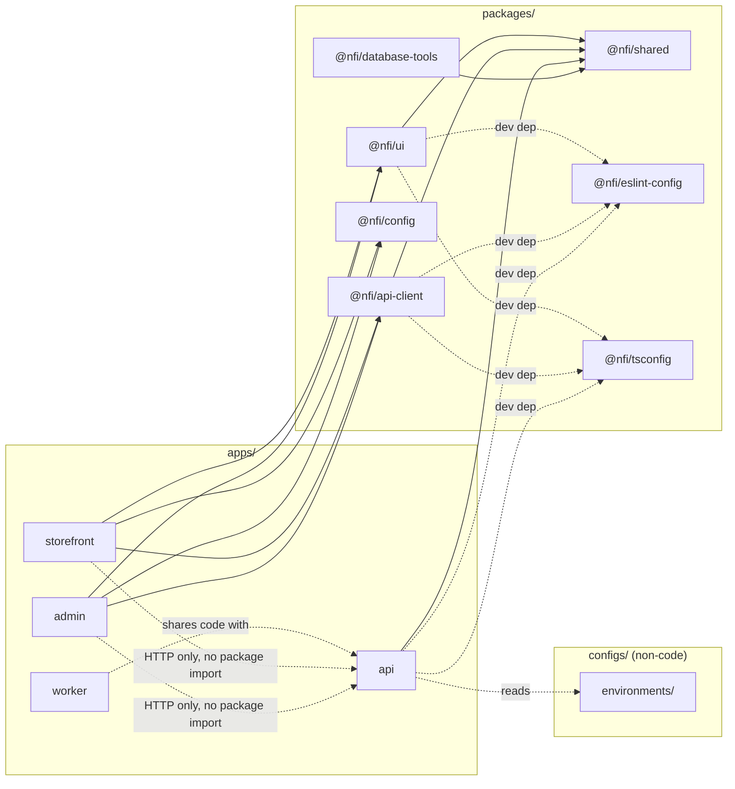
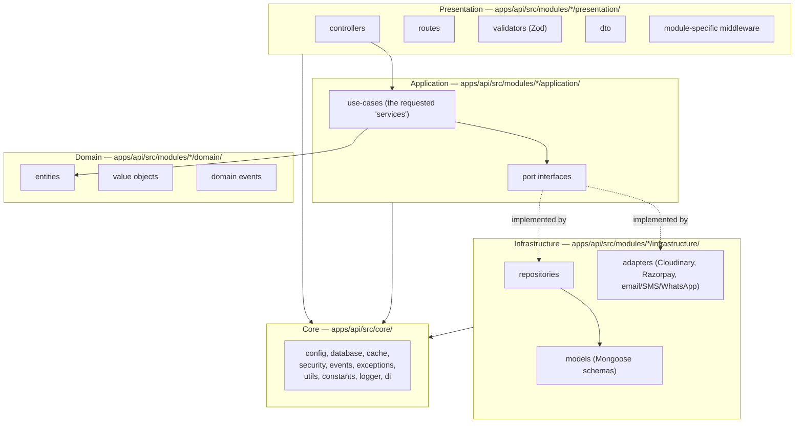
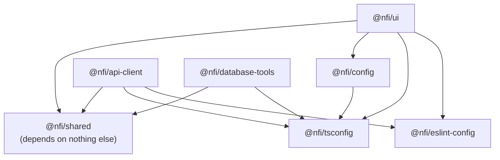

# Phase 6: Complete Project Structure
## National Furniture & Interiors Platform

**Prepared by:** Enterprise Architecture Review Board
**Date:** 2026-08-07
**Status of `01`–`05`:** LOCKED and approved (all reflect the v1.1 remediation applied to `01`–`04` and the repository strategy locked in `05`). This document implements them at file-and-folder resolution. It does not redesign business requirements, runtime architecture, database decisions, or repository strategy.
**Scope:** No implementation code — folder structure, per-folder specification, and diagrams only.

---

## 0. Two Reconciliations, Stated Up Front

This phase's brief asks for folder names that don't literally match `01`–`05`'s vocabulary in two places. Both are resolved below rather than either silently overridden or silently ignored — consistent with how `05_repository_strategy.md` §1 handled the same kind of naming tension for Monorepo vs. Polyrepo.

### 0.1 Root layout: `apps/`, `packages/`, `configs/` vs. `05_repository_strategy.md`'s `frontend/`, `backend/`, `shared/`

`05_repository_strategy.md` §7 locked a root layout inherited from `04_architecture_decision.md` §10 (`frontend/`, `backend/`, `database/`, `shared/`, …). This phase's brief asks for the root to use `apps/` and `packages/` instead — which is the more conventional Turborepo/pnpm-workspace grouping (the tool chosen in `05_repository_strategy.md` §5 is, in fact, built by the team that popularized exactly this convention).

**These are not in conflict at the level that matters.** `05_repository_strategy.md`'s actual decisions — the workspace package inventory, the dependency graph between them, the boundary rules, the build/CI strategy, the extraction playbook — are entirely about *which packages exist and how they relate*, not about which literal folder contains them. Every package `05_repository_strategy.md` §8.3 named (`storefront`, `admin`, `backend`/`@nfi/api`, `@nfi/ui`, `@nfi/api-client`, `@nfi/config`, `@nfi/shared`, `@nfi/database-tools`, `@nfi/test-fixtures`) is preserved exactly, with exactly the same dependency graph. What changes is the grouping convention: deployable apps move under root `apps/`, reusable packages move under root `packages/`, and `configs/` is added as a new, narrower category for non-code shared configuration that `05_repository_strategy.md` didn't need to separate out at that level of detail. Section 17 is the line-by-line proof this is a regrouping, not a redesign.

### 0.2 Backend `controllers/`, `routes/`, `services/`, `repositories/`, `models/`, `validators/`, `dto/` vs. `02_enterprise_architecture.md`'s Feature-Based Architecture

`02_enterprise_architecture.md` §1 is explicit and names this exact trap: *"Feature-Based Architecture — Code organized by business capability (`leads/`, `design-projects/`, `catalog/`), not by technical type (`controllers/`, `services/`)."* If this phase's requested folder names were implemented as **global, flat, top-level `src/` folders** (one `controllers/` holding every module's controllers, one `services/` holding every module's services), that would directly reverse the locked decision.

**Resolution:** every one of those names is real and does exist in the structure below — but as the *internal sub-layers inside each feature module* (`backend/src/modules/leads/presentation/controllers`, not `backend/src/controllers/leads.controller.ts`), which is exactly what `02_enterprise_architecture.md` §6.1 already specified as each module's "4-layer sub-structure." Section 6.3 shows this mapping explicitly, name by name, so nothing requested is dropped — it's placed correctly instead of flattened.

---

## 1. Analysis of Approved Documents

Per the brief's explicit instruction to analyze before designing.

### 1.1 Business Modules

15 backend feature modules, per `02_enterprise_architecture.md` §6.1's 14 plus `crm` (introduced in `04_architecture_decision.md` §11's traceability table alongside `leads`, extending — not contradicting — §6.1's original list):

`auth`, `users`, `leads`, `crm`, `design-projects`, `catalog`, `cart`, `orders`, `payments`, `reviews`, `media`, `notifications`, `cms`, `admin`, `analytics`.

### 1.2 Feature Boundaries

Cross-module interaction happens only through an exported Application-layer service interface or a domain event on the shared event bus (`02_enterprise_architecture.md` §6). No module imports another module's `domain/` or `infrastructure/` directly. `backend` remains one workspace package — module boundaries are enforced by folder structure and lint rules, not `package.json` boundaries (`05_repository_strategy.md` §8.2).

### 1.3 Shared Libraries

Two-tier model from `05_repository_strategy.md` §9–10: cross-stack (`@nfi/shared` — types, enums, validation, constants) consumed by both frontend and backend; frontend-only (`@nfi/ui`, `@nfi/api-client`, `@nfi/config`) consumed only by the two Next.js apps. `@nfi/shared` depends on nothing; everything else may depend on it.

### 1.4 Cross-Cutting Concerns

From `02_enterprise_architecture.md` §16: validation, error handling, response envelope, rate limiting, edge protection, caching, queueing, event durability (outbox), logging, observability, security headers, secrets management, testing, API versioning. None of these are owned by a single feature module — they live in `backend/src/core/` (Section 6.2).

### 1.5 Infrastructure Responsibilities

Container inventory from `02_enterprise_architecture.md` §8.1: `storefront`, `admin`, `api`, `worker`, `redis`, `mongodb`, `nginx` — each with its own Dockerfile and independent scaling. CI/CD pipeline shape from `05_repository_strategy.md` §15 (affected-package detection → scoped checks → per-service image builds → scoped deploys).

### 1.6 Ownership Boundaries

`04_architecture_decision.md` §10.1 named `CODEOWNERS` as a root file without content; `05_repository_strategy.md` §7.1 confirmed it maps to top-level folders/workspace packages. Section 3 below assigns a concrete owner per top-level folder — the first time this has been made explicit rather than deferred.

### 1.7 Runtime Boundaries

Exactly the module → collection → container mapping already locked: `storefront`/`admin` never talk to MongoDB directly (`02_enterprise_architecture.md` §8.1); `backend` is the only process with database credentials; `worker` shares the same module code as `api` but runs a different entry point (`backend/src/workers/`).

### 1.8 Build Boundaries

Per `05_repository_strategy.md` §14: a package's build task only re-runs when its own inputs or its dependencies' cached outputs change. Deploy triggers are scoped per app/service (§15) — a `@nfi/shared`-only change validates every consumer but deploys nothing by itself unless a consumer's own artifact actually changed.

---

## 2. Repository Root Structure

### 2.1 Root Folder Tree

- `apps/` — deployable applications (Section 3)
- `packages/` — reusable, importable workspace packages (Section 5)
- `configs/` — shared, non-package configuration (Section 2.3)
- `docs/` — documentation hierarchy (Section 8)
- `scripts/` — cross-cutting automation (unchanged from `04_architecture_decision.md` §10.6)
- `docker/` — container and orchestration definitions (Section 7)
- `.github/` — CI/CD workflow definitions (Section 7.3)
- `assets/` — raw/source creative assets, not served directly (unchanged from `04_architecture_decision.md` §10.11)
- `public/` — truly global static assets, used sparingly (unchanged from `04_architecture_decision.md` §10.8)
- `testing/` — cross-cutting test infrastructure (unchanged from `04_architecture_decision.md` §10.10)
- Root files: `package.json`, `pnpm-workspace.yaml`, `pnpm-lock.yaml`, `turbo.json`, `.npmrc`, `tsconfig.base.json`, `.env.example`, `.gitignore`, `README.md`, `CODEOWNERS` (all per `05_repository_strategy.md` §7.1, unchanged)

### 2.2 Root-Level Specification

| Folder | Purpose | Owner | Dependencies (may import from) | Import rules | Belongs | Never |
|---|---|---|---|---|---|---|
| `apps/` | Container for every independently deployable application | Respective app team (Sections 3–4) | `packages/*`, `configs/*` | Apps never import each other directly | `storefront/`, `admin/`, `api/`, `worker/` | Shared/reusable code that isn't a full deployable |
| `packages/` | Container for every reusable, importable workspace package | Platform/shared-infra owner | `@nfi/shared` only, at most (Section 5) | Packages never import from `apps/` | `ui`, `api-client`, `shared`, `config`, `eslint-config`, `tsconfig`, `database` | App-specific business logic, route handlers, deployment config |
| `configs/` | Non-code, non-package shared configuration | DevOps Architect | Nothing (data/config only) | Read, not imported as a module | Environment variable schemas, deployment environment matrices, feature-flag default profiles | Executable code, anything that needs `import`/`require` |
| `docs/` | All documentation (Section 8) | Documentation owner per sub-folder (CODEOWNERS) | N/A | N/A | Markdown, diagrams | Code, configuration files that are actually read at runtime |
| `scripts/` | Cross-cutting automation | DevOps Architect | `packages/database`, `packages/shared` | May be invoked by CI or humans; never imported by app runtime code | Setup, codegen, CI helpers, deploy triggers (unchanged, `04_architecture_decision.md` §10.6) | Business logic |
| `docker/` | Container/orchestration definitions | DevOps Architect | N/A (references `apps/*`, `packages/*` as build context) | N/A | Dockerfiles, Compose files, Nginx config (Section 7.1–7.2) | Application source code |
| `.github/` | CI/CD workflow definitions | DevOps Architect | N/A | N/A | Workflow YAML, PR/issue templates (Section 7.3) | Application source code, secrets in plaintext |
| `assets/` | Raw/source creative assets | Design/Marketing owner | N/A | Never imported by running code | Logo sources, design-system exports, email template sources (unchanged, `04_architecture_decision.md` §10.11) | Anything served directly to end users |
| `public/` | Global static assets shared across apps | Platform owner | N/A | Distributed *into* app-level `public/` folders at build time, not served from here directly | Shared favicon source, cross-app `robots.txt` strategy (unchanged, `04_architecture_decision.md` §10.8) | Most static assets — those belong in each app's own `apps/*/public/` |
| `testing/` | Cross-cutting test infrastructure | QA/Staff Engineer | `packages/*` | Never imported by production app code | e2e, load, fixtures, cross-module integration tests (unchanged, `04_architecture_decision.md` §10.10) | Module-level unit tests (those stay colocated with the module) |

### 2.3 `configs/` — Detail

Distinct from `packages/eslint-config` and `packages/tsconfig` (Section 5), which are **importable code** (installed as dev dependencies, consumed via `extends`). `configs/` holds things that are consumed as **data**, not imported as a module:

- `configs/environments/` — per-environment variable schemas and non-secret default profiles (local/staging/production shapes referenced by `05_repository_strategy.md` §11's environment matrix)
- `configs/feature-flags/` — default feature-flag values per environment (the mechanism named but not designed in `01_business_research.md` §5's "feature flagging" recommendation)
- `configs/deployment/` — deployment target definitions (which environment maps to which orchestrator target), consumed by CI/CD (Section 7.3), not by application code

---

## 3. Frontend Structure — Complete Next.js Application

One canonical template, applied to both `apps/storefront/` and `apps/admin/` (per `02_enterprise_architecture.md` §4/§6.2's decision to keep them separate deployables sharing a design system). Differences between the two are called out where they occur; everything else is identical by convention, which is itself the point — a developer who's worked in one app already knows the shape of the other.

### 3.1 Frontend Folder Tree (per app)

- `apps/storefront/` *(and identically shaped `apps/admin/`)*
  - `app/` — Next.js App Router route tree
  - `features/` — feature modules mirroring backend module names
  - `components/` — app-wide, cross-feature composite components
  - `layouts/` — Next.js layout components (shell chrome)
  - `providers/` — React context providers
  - `hooks/` — app-wide custom hooks (non-feature-specific)
  - `services/` — app-level orchestration over `@nfi/api-client`
  - `store/` — client-side UI state (not server state)
  - `types/` — app-only types (not part of the cross-stack contract)
  - `styles/` — global CSS, app-specific theme overrides
  - `config/` — app-level runtime configuration (nav menus, flag reads)
  - `middleware.ts` (+ `middleware/` for composable pieces) — route guards, redirects
  - `constants/` — app-specific constants
  - `utils/` — app-specific pure helper functions
  - `lib/` — third-party SDK setup/wrappers
  - `tests/` — cross-feature integration tests within this app
  - `public/` — this app's own served static assets
  - App-level config: `next.config.ts`, `tailwind.config.ts` (extends `@nfi/config`), `package.json`

### 3.2 Frontend Folder Specification

| Folder | Purpose | Owner | Dependencies (may import from) | Import rules | Belongs | Never |
|---|---|---|---|---|---|---|
| `app/` | Route definitions, route groups by feature (`(marketing)`, `(interior-design)`, `(catalog)`, `(cart-checkout)`, `(account)` for storefront; `(leads)`, `(design-projects)`, `(catalog)`, `(orders)`, `(reports)`, `(users-roles)` for admin — per `02_enterprise_architecture.md` §6.2) | Feature team owning that route group | `features/*`, `layouts/`, `providers/` | Route files stay thin — compose `features/*` components, no business logic inline | `page.tsx`, `layout.tsx`, `loading.tsx`, `error.tsx` per route | Data-fetching logic, form validation logic (those live in `features/*`) |
| `features/` | Feature-specific components, hooks, services, types, store slices — one sub-folder per backend module name (`leads/`, `design-projects/`, `catalog/`, `cart/`, `orders/`, …), 1:1 traceability per `02_enterprise_architecture.md` §6.2 | Feature team | `@nfi/ui`, `@nfi/api-client`, `@nfi/shared`, app-level `hooks/`/`utils/`/`lib/` | A feature never imports another feature's internals directly — shared cross-feature logic gets promoted to app-level `hooks/`/`services/`/`utils/` or, if truly cross-app, to `packages/` | Feature-scoped components, hooks, API calls, local types | Global app shell (header/footer), anything used by 2+ unrelated features |
| `components/` | App-wide composite components not generic enough for `@nfi/ui` but used across more than one feature (e.g., app-specific Header/Footer/PageWrapper) | Platform/UI owner for this app | `@nfi/ui` | Composes `@nfi/ui` primitives; never redefines a primitive `@nfi/ui` already provides | Header, Footer, Sidebar (admin), breadcrumbs | Generic primitives (Button, Card, Input — those belong in `@nfi/ui`); feature-specific components |
| `layouts/` | Next.js layout components implementing the App Router layout convention (root shell, per-route-group shells) | Platform/UI owner | `components/`, `providers/` | One layout per route group max; layouts compose, never contain business logic | `RootLayout`, `AdminShellLayout`, `AuthLayout` | Data fetching beyond what's needed for the shell itself |
| `providers/` | React context providers wired at the root (theme, auth session, data-fetching client, toast/notification UI) | Platform owner | `@nfi/shared` (for auth/session types), third-party SDKs via `lib/` | Providers wrap `children`; they hold no business logic beyond context wiring | `ThemeProvider`, `SessionProvider`, `QueryClientProvider`, `ToastProvider` | API call logic (that's `services/`) |
| `hooks/` | App-wide custom hooks not tied to one feature | Platform owner | `@nfi/shared`, `lib/` | Generic (e.g., `useMediaQuery`, `useDebounce`); a hook used only by one feature moves into that feature's own `hooks/` | Cross-feature, reusable-within-this-app hooks | Feature-specific data-fetching hooks (those belong in `features/*`) |
| `services/` | App-level orchestration over `@nfi/api-client` — combining or sequencing multiple API calls for a specific screen | Feature team (per service) | `@nfi/api-client`, `@nfi/shared` | Never calls `fetch`/`axios` directly — always through `@nfi/api-client`, per `05_repository_strategy.md` §10's boundary rule | Dashboard-aggregation calls, multi-step form submission orchestration | Raw HTTP client setup (that's `@nfi/api-client` itself), UI rendering |
| `store/` | Client-only UI state (cart drawer open/closed, admin filter selections, wizard step) | Feature team (per slice) | `@nfi/shared` (types only) | Server state (anything that could instead be fetched/cached via `services/`) never duplicates into `store/` — this is a deliberate rule to prevent state-sync bugs between a store slice and the actual server record | UI-only, ephemeral, client-side state | Anything that is also persisted server-side and could drift out of sync |
| `types/` | App-only TypeScript types — view-models, form state shapes | Feature team | `@nfi/shared` | Extends `@nfi/shared` types for API-shaped data; only defines new types for pure UI concerns | Form state, view-model types | Anything that mirrors an API contract shape (that belongs in `@nfi/shared`, imported not redefined) |
| `styles/` | Global CSS, this app's theme-token overrides | Platform/UI owner | `@nfi/config` (base Tailwind config) | Extends, does not duplicate, the base config | `globals.css`, theme token overrides specific to this app | Component-scoped styles (Tailwind utility classes belong inline / in `@nfi/ui`) |
| `config/` | App-level runtime configuration read at startup | Platform owner | `configs/` (root), `@nfi/shared` | Read-only config objects, no side effects at import time beyond simple reads | Nav menu structure, this app's feature-flag reads | Secrets (never — see `05_repository_strategy.md` §11) |
| `middleware.ts` / `middleware/` | Route-level guards, redirects, locale detection | Auth/Platform owner | `@nfi/shared` (auth types) | Runs at the edge — must stay lightweight, no heavy business logic | Auth-required route gating, redirect rules | Data fetching, anything requiring a database connection |
| `constants/` | App-specific constant values not part of the cross-stack contract | Feature team | Nothing | Constants only, no logic | Route-path enums, UI copy not yet localized | Values also needed by the backend (those belong in `@nfi/shared/constants`) |
| `utils/` | App-specific pure helper functions | Feature team | Nothing external | Pure functions only, no side effects, no API calls | Formatters, small transforms | Anything that calls an API or touches global state (misplaced complexity) |
| `lib/` | Third-party library setup/wrappers | Platform owner | Third-party SDKs | One file per integrated SDK; nothing else imports the raw SDK directly — always through this wrapper | Analytics SDK init, Sentry init, Cloudinary URL-builder helper (client-safe config only — the Cloudinary API secret never appears here, per `05_repository_strategy.md` §11) | Business logic, API orchestration (that's `services/`) |
| `tests/` | Cross-feature integration tests within this one app | QA/feature team | Everything above | Colocated `__tests__` next to a component/feature is preferred for unit tests; `tests/` is for tests that span multiple features within this app | Multi-feature interaction tests | Tests spanning frontend + backend (those belong in root `testing/e2e/`) |
| `public/` | This app's own served static assets | Platform owner | N/A | N/A | Favicon, OG images, this app's manifest | Assets shared with the other app (those live in root `public/` and get distributed here, per Section 2.3) |

---

## 4. Backend Structure — Complete Express.js Application

### 4.1 Backend Folder Tree

- `apps/api/` *(the single Modular Monolith deployable — `05_repository_strategy.md` §8.2's "one workspace package, not one per module")*
  - `src/`
    - `core/` — cross-cutting infrastructure (Section 4.2)
      - `config/`
      - `database/` *(runtime connection setup — distinct from `packages/database`, see Section 4.4)*
      - `cache/`
      - `security/`
      - `events/` *(event bus + outbox relay)*
      - `exceptions/`
      - `utils/`
      - `constants/`
      - `logger/`
      - `di/` *(composition root)*
    - `modules/` — 15 feature modules (Section 4.3), each internally:
      - `domain/` — entities, value objects, domain events
      - `application/` — use-cases/services, port interfaces
      - `infrastructure/` — Mongoose repositories/schemas, external adapters
      - `presentation/` — controllers, routes, validators, DTOs, module-specific middleware
    - `workers/` — background worker process entry point (BullMQ consumers)
    - `queues/` — generic queue/job-registration infrastructure (Section 4.5)
    - `cron/` — scheduled-job registration (Section 4.5)
    - `app.ts` — Express app assembly
    - `server.ts` — process entry point (API)
    - `worker.ts` — process entry point (Worker)
  - `tests/` — module-crossing integration tests (module-level unit tests stay colocated inside each module)
  - `package.json`

### 4.2 `src/core/` Specification

| Folder | Purpose | Owner | Dependencies | Import rules | Belongs | Never |
|---|---|---|---|---|---|---|
| `config/` | Environment-driven runtime configuration reader | DevOps Architect | `@nfi/shared`, `configs/environments/` | Read once at boot, fail-fast on missing required values (production-readiness item from `02_enterprise_architecture.md` §17 remediation) | Typed config object, boot-time validation | Secret *values* (those are injected via the orchestrator secret store, per `05_repository_strategy.md` §11 — this folder only defines the *shape*) |
| `database/` | MongoDB/Mongoose **connection** setup (pooling, replica-set read preference per `03_database_design.md` §14.2) | Database Architect | `core/config` | One connection module, imported by every module's Infrastructure layer | Connection factory, session/transaction helper (for the narrow transaction use documented in `03_database_design.md` §13.1) | Migrations/seeds (those live in `packages/database`, Section 5 — a different concern: runtime connection vs. offline schema evolution) |
| `cache/` | Redis client setup, cache-aside helper | Staff Engineer | `core/config` | Modules decide *what* to cache; this provides *how* | Redis client factory, generic get-or-set helper | Business-specific cache keys/TTLs (those belong in the owning module's Infrastructure layer) |
| `security/` | Cross-cutting security infrastructure: rate limiter instance, Helmet config, CORS policy, CSRF helper, input-sanitization helpers | Security Architect | `core/config`, `core/cache` (rate-limit counters) | Every module's Presentation layer wires these; none of them contain module-specific authorization logic (that's each module's `presentation/middlewares`) | Generic middleware factories | Business authorization rules (a rule like "only the assigned Designer can edit this project" belongs in that module's Application layer, not here) |
| `events/` | Domain event bus + the **outbox relay** process (`03_database_design.md` §9.8.4, added in the v1.1 remediation) | Principal Architect | `core/database` | Modules publish events through this bus; nothing here knows about any specific module's event payload shape beyond the generic envelope | Event bus interface, outbox relay poller | Module-specific event handlers (a module subscribes to the bus from within its own `infrastructure/`, it doesn't get defined here) |
| `exceptions/` | Base error classes (`NotFoundError`, `ValidationError`, `ConflictError`, `UnauthorizedError` — `02_enterprise_architecture.md` §16) | Staff Engineer | Nothing | Every module throws these, never a raw `Error` | Base/shared error classes, the centralized error-mapping middleware | Module-specific error subclasses with business meaning only that module understands (those can extend these base classes from within the module) |
| `utils/` | Generic, framework-agnostic utility functions shared across modules | Staff Engineer | Nothing | Pure functions only | Date formatting, ID generation helpers | Anything module-specific or with a database/network dependency |
| `constants/` | Cross-module backend constants not part of the cross-stack `@nfi/shared` contract | Staff Engineer | Nothing | Backend-only values | Internal timeouts, retry counts | Anything the frontend also needs (that belongs in `@nfi/shared`) |
| `logger/` | Structured logging setup (correlation/request-ID propagation, per `02_enterprise_architecture.md` §16) | DevOps Architect | `core/config` | Every layer logs through this, never `console.log` | Logger factory, request-ID middleware | Business event logging with PII in plaintext (redaction rule from `03_database_design.md` §9.8.2 applies here too) |
| `di/` | The composition root (`02_enterprise_architecture.md` §7.3's manual composition root, not a DI framework) | Principal Architect | Every module's exported constructor | The **only** place concrete Infrastructure implementations are wired into Application-layer use-cases | `composition-root.ts` | Any actual business logic — this file only wires, it never decides |

### 4.3 `src/modules/` — Per-Module Template and Module List

Every module shares the identical internal 4-layer template (`02_enterprise_architecture.md` §5–§7), so it's specified once here rather than repeated 15 times.

| Layer | Contains | Owner | Import rules | Never |
|---|---|---|---|---|
| `domain/` | Entities, value objects, domain events — framework-free | Module owner | Zero imports from `application/`, `infrastructure/`, `presentation/`, or any other module | Any Express, Mongoose, or library import |
| `application/` | Use-case classes (this is where the requested "services" live), port interfaces | Module owner | May import `domain/` of the *same* module and `@nfi/shared`; may import another module's `application/` **exported interface only**, never its `infrastructure/`/`domain/` | Mongoose imports, HTTP request/response objects |
| `infrastructure/` | Mongoose repositories (the requested "repositories") and schemas (the requested "models"), external adapters (Cloudinary, Razorpay, email/SMS/WhatsApp providers) | Module owner | Implements `application/`'s port interfaces; imports `core/database`, `core/cache` | Business rules |
| `presentation/` | Controllers, routes, validators (Zod schemas — the requested "validators"), DTOs, module-specific middleware | Module owner | Calls `application/` use-cases only; never imports `infrastructure/` or `domain/` directly | Business logic, direct database access |

**The 15 module folders** (owner = the RBAC role most responsible per `02_enterprise_architecture.md` §14, for CODEOWNERS purposes):

| Module | Primary collections (`03_database_design.md`) | One-line distinguishing note |
|---|---|---|
| `auth` | `users`, `roles`, `permissions`, `refresh_tokens`, `otp_verifications`, `password_reset_tokens` | Owns MFA enforcement for STAFF/ADMIN (v1.1 remediation, `02_enterprise_architecture.md` §9.1) |
| `users` | (shared with `auth` on `users`) | Profile/address management, distinct from credential management |
| `leads` | `leads`, `quote_requests`, `site_visits`, `contact_form_submissions`, `bulk_enquiries` | Owns lead scoring, CAPTCHA verification, and consent gating (v1.1 remediation) |
| `crm` | `customers`, `lead_status_history`, `lead_activities` | References `auth`'s `users` by ID only, never duplicates identity data (`03_database_design.md` §9.7.1) |
| `design-projects` | `design_projects`, `design_project_assets`, `portfolios`, `consultations`, `appointments` | Owns the state machine (`02_enterprise_architecture.md` §13); business priority #1 |
| `catalog` | `categories`, `product_collections`, `products`, `warehouses`, `inventory`, `inventory_movements` | Owns the atomic stock-reservation update (v1.1 remediation, `03_database_design.md` §9.2.6) |
| `cart` | `carts`, `wishlists` | |
| `orders` | `orders`, `coupons`, `coupon_redemptions`, `returns` | `returns` added here in the v1.1 remediation (`04_architecture_decision.md` §11) |
| `payments` | `payments`, `invoices` | Owns the Razorpay adapter; polymorphic across `orders` and `design-projects` milestones |
| `reviews` | (product reviews, denormalized into `products.ratingsAvg`) | |
| `media` | (Cloudinary references embedded in owning entities) | Owns the Cloudinary adapter — this is where the brief's requested "storage/" concern actually lives |
| `notifications` | `notifications` | Owns email/SMS/WhatsApp adapters — this is where the brief's requested "emails/" concern actually lives, as one adapter among several, not a separate top-level folder |
| `cms` | `blogs`, `testimonials`, `banners`, `newsletter_subscribers` | |
| `admin` | (RBAC/audit cross-cutting) | Owns `audit_logs` writes and the PII-redaction rule (v1.1 remediation, `03_database_design.md` §9.8.2) |
| `analytics` | (read-models/aggregations) | Read-only consumer of every other module via exported interfaces, per `02_enterprise_architecture.md` §16 clarification |

### 4.4 Naming Collision, Disambiguated: Two Things Named "database"

- `apps/api/src/core/database/` — **runtime** connection code, part of the running API/worker process, imported by every module's `infrastructure/`.
- `packages/database/` — **offline** migration/seed/index/backup tooling (`@nfi/database-tools`, per `05_repository_strategy.md` §8.3), never imported by the running application — invoked by `scripts/` or CI, not by `apps/api`.

Same word, two different concerns, kept in two different places on purpose, per the exact distinction `04_architecture_decision.md` §10.4 already drew.

### 4.5 `src/queues/`, `src/cron/`, `src/workers/` — Where Background Processing Actually Lives

- `src/workers/` (already locked in `04_architecture_decision.md` §10.3) is the **process entry point** — `worker.ts` boots the same module code as `api.ts` but starts BullMQ consumers instead of an HTTP server.
- `src/queues/` holds **generic** BullMQ connection/queue-definition infrastructure — the queue instances themselves, not what runs on them.
- `src/cron/` holds **scheduling** registration (which job runs on which schedule) — again, wiring, not business logic.
- The actual **job handler logic** — "what happens when a `notify-sales` job runs" — is not a global folder at all. It lives in the owning module's `infrastructure/` (e.g., `modules/notifications/infrastructure/jobs/notify-sales.job.ts`), consistent with Section 0.2's resolution: technical-sounding names are real, but they're realized per-module wherever the *business logic* they contain is module-specific, and only globally where the concern is *genuinely generic* (the queue connection itself, the cron scheduler itself).

### 4.6 `tests/`

Module-level unit tests are colocated inside each module (`modules/leads/application/__tests__/`, etc.) per `02_enterprise_architecture.md` §16's testing strategy — not duplicated into a global `tests/` folder. `apps/api/tests/` holds only tests that genuinely cross module boundaries within the backend (e.g., "placing an order correctly decrements inventory," which `00_architecture_review.md` finding D2's remediation specifically calls out as needing this kind of test), distinct from root `testing/integration/` which exercises a real containerized MongoDB/Redis and root `testing/e2e/` which spans frontend and backend together.

---

## 5. Shared Packages — What Should Exist and Why

Evaluated against the package-boundary criterion already set in `05_repository_strategy.md` §9: *a folder becomes its own package only when it's consumed by more than one other package/app, or maps to an independent build/deploy target.* Applying that criterion honestly means not every name in the brief's example list should become a separate package — some are more valuable folded into an already-decided package than fragmented out.

| Suggested package | Should it exist as its own package? | Reasoning |
|---|---|---|
| `ui` | **Yes** — `@nfi/ui` | Consumed by both `storefront` and `admin`; exactly the "more than one consumer" criterion |
| `types` | **No, not separately** — lives inside `@nfi/shared` | `05_repository_strategy.md` §10 already places cross-stack types inside `@nfi/shared`. A standalone `types` package with no logic of its own would just be an arbitrary subdivision of a package that already exists — pure fragmentation, the exact anti-pattern `05_repository_strategy.md` §9 warns against |
| `config` | **Yes** — `@nfi/config` | Distinct concern from `configs/` (Section 2.3): this is *runtime-consumable* shared frontend configuration (base Tailwind theme, shared Next.js config fragments) — genuinely different from `eslint-config`/`tsconfig` below |
| `utils` | **No, not as a cross-stack package** | Generic utilities that are genuinely needed on both frontend and backend are rare and small enough to live in `@nfi/shared/utils` as a sub-export; a standalone `@nfi/utils` package invites dumping ground behavior (anything goes in "utils") that erodes the meaningful-boundary principle |
| `eslint-config` | **Yes** — `@nfi/eslint-config` | Standard Turborepo convention: a shared lint config consumed via `extends` by every app and package; this directly enables the ESLint module-boundary rule `00_architecture_review.md` finding recommended and `05_repository_strategy.md` §4.4 relies on instead of adopting Nx |
| `tsconfig` | **Yes** — `@nfi/tsconfig` | Same reasoning as `eslint-config` — one base compiler config, extended everywhere, preventing config drift between apps |
| `shared-components` | **No — this is `@nfi/ui` under a different name** | Adding a second component package alongside `@nfi/ui` would just split one boundary into two with no criterion distinguishing which components go where |
| `shared-validation` | **No, not separately** — lives inside `@nfi/shared` | Same reasoning as `types`: `05_repository_strategy.md` §10 already scoped `shared/validation` as a sub-folder of `@nfi/shared`, consumed by both backend request validation and frontend form validation. Splitting it out doesn't add a new consumer, just a new import path for the same consumers |
| `shared-api` | **Yes, but it's `@nfi/api-client`, already named** | This is exactly the package `05_repository_strategy.md` §8.3 already specified — same thing, brief uses a different name for it |
| `shared-constants` | **No, not separately** — lives inside `@nfi/shared` | Same reasoning as `types`/`shared-validation` |
| `shared-hooks` | **No, not as a new package** — folds into `@nfi/ui`'s hooks export | Hooks are React-specific, so only ever consumed by the two frontend apps — same consumer set as `@nfi/ui`. A hook genuinely worth sharing (e.g., `useMediaQuery`) is exported from `@nfi/ui/hooks`; this is revisited as its own package only if hook count and independent-release need grow large enough to justify it (same conditional-revisit pattern as `02_enterprise_architecture.md` §7.3 and `05_repository_strategy.md` §5's Nx trigger) |
| `database` | **Yes** — `@nfi/database-tools` | Already established in `05_repository_strategy.md` §8.3; migrations/seeds/index-management/backup runbooks |

**Net result:** `packages/` contains `ui`, `api-client`, `config`, `shared`, `eslint-config`, `tsconfig`, `database` — seven packages, not the eleven suggested, because four of the suggested names (`types`, `shared-validation`, `shared-constants`, `shared-components`, `shared-hooks`) either duplicate an existing package under a new name or would fragment `@nfi/shared`/`@nfi/ui` without adding a real second consumer. This is a direct application of `05_repository_strategy.md`'s own stated principle, not a new one invented here.

---

## 6. Package Dependency Graph (within `packages/`)

See Section 10 for the full repository-wide dependency diagram; this is the zoomed-in view of just `packages/*`.

| Package | Depends on | Consumed by |
|---|---|---|
| `@nfi/eslint-config` | Nothing | Every app and package (dev dependency) |
| `@nfi/tsconfig` | Nothing | Every app and package (dev dependency) |
| `@nfi/shared` | Nothing | `@nfi/api-client`, `@nfi/database-tools`, `apps/api`, both frontend apps (for enums/constants used in display logic) |
| `@nfi/config` | `@nfi/tsconfig` | `apps/storefront`, `apps/admin` |
| `@nfi/ui` | `@nfi/shared` (types only), `@nfi/config`, `@nfi/tsconfig`, `@nfi/eslint-config` | `apps/storefront`, `apps/admin` |
| `@nfi/api-client` | `@nfi/shared`, `@nfi/tsconfig`, `@nfi/eslint-config` | `apps/storefront`, `apps/admin` |
| `@nfi/database-tools` | `@nfi/shared`, `@nfi/tsconfig` | `scripts/`, CI only — never `apps/*` at runtime |

---

## 7. Infrastructure

### 7.1 `docker/`

| Folder/File | Purpose | Owner | Belongs | Never |
|---|---|---|---|---|
| `docker/apps/Dockerfile.storefront`, `Dockerfile.admin` | Frontend image builds | DevOps Architect | Multi-stage build definitions | Secrets baked into the image layer |
| `docker/apps/Dockerfile.api`, `Dockerfile.worker` | Backend image builds — same codebase, different entry point (Section 4.1) | DevOps Architect | Multi-stage build definitions | — |
| `docker/nginx/` | Reverse proxy / TLS termination config | DevOps Architect | Nginx config, routing rules | Application logic |
| `docker/observability/` | Self-hosted monitoring/logging config, if not fully managed (Section 7.4) | DevOps Architect | Prometheus scrape config, log-shipper config | Actual metrics/log data (that's runtime state, not repo content) |
| `docker-compose.local.yml`, `docker-compose.staging.yml` | Environment-scoped Compose definitions | DevOps Architect | Full local/staging topology | Production topology (production is orchestrator-managed, not Compose, per `02_enterprise_architecture.md` §8.2) |
| `docker/.dockerignore` | Shared ignore rules | DevOps Architect | — | — |

### 7.2 Cloudinary and Razorpay — Not New Folders

Per Section 0.2's resolution pattern: these are already-designed **module-owned adapters**, not new global integration folders.

- **Cloudinary** → `apps/api/src/modules/media/infrastructure/adapters/cloudinary/` (the signed-upload pattern from `02_enterprise_architecture.md` §15, unchanged)
- **Razorpay** → `apps/api/src/modules/payments/infrastructure/adapters/razorpay/` (the webhook-verified pattern from `02_enterprise_architecture.md` §11, unchanged)

Inventing top-level `docker/cloudinary/` or `docker/razorpay/` folders would contradict the module-ownership rule these two integrations already have — they're application-layer adapters, not infrastructure the repository provisions.

### 7.3 `.github/`

| Folder | Purpose | Owner |
|---|---|---|
| `.github/workflows/pr-checks.yml` | Affected-package lint/typecheck/test/build on every PR (`05_repository_strategy.md` §15) | DevOps Architect |
| `.github/workflows/deploy-staging.yml`, `deploy-production.yml` | Scoped image build + deploy on merge, per app/service (`05_repository_strategy.md` §15) | DevOps Architect |
| `.github/CODEOWNERS` | *(may live here or at repo root — GitHub recognizes both; kept at root per `05_repository_strategy.md` §7.1 to be the single obvious location)* | — |
| `.github/PULL_REQUEST_TEMPLATE.md` | Includes the "does this change require a docs/ update?" checkbox recommended in `00_architecture_review.md` finding DX2's remediation | Engineering Manager |
| `.github/ISSUE_TEMPLATE/` | Bug/feature templates | Engineering Manager |

### 7.4 Deployment, Monitoring, Logging, Backups, Environment, Secrets — Where Each Actually Lives

| Concern | Repository location | What's actually in the repo vs. external |
|---|---|---|
| Deployment | `docker/` (build definitions) + `.github/workflows/` (triggers) + `configs/deployment/` (target definitions) | The orchestrator itself (ECS/Kubernetes/etc., per `02_enterprise_architecture.md` §8) is external infrastructure, not repo content |
| Monitoring | `docker/observability/` (scrape/agent config, only if self-hosted) | The actual APM/metrics backend is an external managed service in the common case (`02_enterprise_architecture.md` §17) — the repo holds configuration, not the monitoring system itself |
| Logging | `apps/api/src/core/logger/` (structured logging setup) | Log aggregation/storage is external (`02_enterprise_architecture.md` §16) |
| Backups | `packages/database/backups/` (runbook **scripts**, per `05_repository_strategy.md` §8.3) | The actual backup **data** is never in the repository — it lives in managed cloud storage, per `03_database_design.md` §14.5 |
| Environment | `configs/environments/` (schemas/non-secret defaults) + each app's `.env.example` | Actual environment variable **values** for staging/production are never committed, per `05_repository_strategy.md` §11 |
| Secrets | **Nowhere in the repository, deliberately** | Injected via the orchestrator's secret store at deploy time (`02_enterprise_architecture.md` §16, `05_repository_strategy.md` §11) — this is a repeated, load-bearing "never," not an oversight |

---

## 8. Documentation Hierarchy

| `docs/` sub-folder | Contents | Maps to |
|---|---|---|
| `docs/` (root files) | `00_architecture_review.md`, `00b_remediation_summary.md`, `01_business_research.md`, `02_enterprise_architecture.md`, `03_database_design.md`, `04_architecture_decision.md`, `05_repository_strategy.md`, this document (`06_project_structure.md`) | Architecture — the core, numbered document series |
| `docs/database/` | Schema reference generated/maintained alongside `03_database_design.md`, index-change logs | Database |
| `docs/api/` | OpenAPI spec (once the API stabilizes, per the contract-testing remediation in `02_enterprise_architecture.md` §16/`00_architecture_review.md` finding A6) | API |
| `docs/development/` | Local setup guide, coding conventions, this document's Section 0 reconciliation notes as a living reference | Development / Developer Guide |
| `docs/deployment/` | Environment matrix (elaborating `02_enterprise_architecture.md` §8.2), rollback procedure, release process | Deployment |
| `docs/security/` | MFA setup, RBAC permission-key reference (elaborating `02_enterprise_architecture.md` §14), secrets-rotation runbook | Security |
| `docs/testing/` | Test strategy per layer, coverage policy, e2e suite index | Testing |
| `docs/adr/` | Future architecture decision records beyond `04_architecture_decision.md` (already named as a future folder in `04_architecture_decision.md` §10.7) | ADR |
| `docs/release-notes/` | Per-release changelog, distinct from each core document's own Revision History table | Release Notes |
| `docs/user-guide/` | End-customer-facing help content (design consultation booking, order tracking) | User Guide |
| `docs/developer-guide/` | Onboarding path through `01`–`06` in order, "how to add a new feature module" walkthrough referencing `scripts/codegen/` (`04_architecture_decision.md` §10.6) | Developer Guide |

---

## 9. Complete Folder Tree

- `/` *(repository root)*
  - `apps/`
    - `storefront/` — `app/`, `features/`, `components/`, `layouts/`, `providers/`, `hooks/`, `services/`, `store/`, `types/`, `styles/`, `config/`, `middleware.ts`, `constants/`, `utils/`, `lib/`, `tests/`, `public/`
    - `admin/` — *(identical shape to `storefront/`)*
    - `api/`
      - `src/`
        - `core/` — `config/`, `database/`, `cache/`, `security/`, `events/`, `exceptions/`, `utils/`, `constants/`, `logger/`, `di/`
        - `modules/` — `auth/`, `users/`, `leads/`, `crm/`, `design-projects/`, `catalog/`, `cart/`, `orders/`, `payments/`, `reviews/`, `media/`, `notifications/`, `cms/`, `admin/`, `analytics/` *(each: `domain/`, `application/`, `infrastructure/`, `presentation/`)*
        - `workers/`, `queues/`, `cron/`
        - `app.ts`, `server.ts`, `worker.ts`
      - `tests/`
    - `worker/` *(process entry point only — shares `apps/api/src` module code; not a separate copy of the code, listed here for deployability clarity)*
  - `packages/`
    - `ui/`, `api-client/`, `config/`, `shared/` (`types/`, `enums/`, `validation/`, `constants/`), `eslint-config/`, `tsconfig/`, `database/` (`migrations/`, `seeds/`, `indexes/`, `backups/`, `validators/`)
  - `configs/`
    - `environments/`, `feature-flags/`, `deployment/`
  - `docs/` — *(Section 8's full list)*
  - `scripts/` — `setup/`, `codegen/`, `ci/`, `deploy/`
  - `docker/` — `apps/`, `nginx/`, `observability/`, root Compose files
  - `.github/` — `workflows/`, `CODEOWNERS`, `PULL_REQUEST_TEMPLATE.md`, `ISSUE_TEMPLATE/`
  - `assets/` — `brand/`, `design-system/`, `email-templates/`, `marketing/`
  - `public/` — global shared static assets (used sparingly, per Section 2.2)
  - `testing/` — `e2e/`, `load/`, `fixtures/`, `integration/`
  - Root files — `package.json`, `pnpm-workspace.yaml`, `pnpm-lock.yaml`, `turbo.json`, `.npmrc`, `tsconfig.base.json`, `.env.example`, `.gitignore`, `README.md`, `CODEOWNERS`

---

## 10. Mermaid Folder Diagram

```mermaid
flowchart TB
    Root(["Repository Root"])

    Root --> Apps["apps/"]
    Root --> Packages["packages/"]
    Root --> Configs["configs/"]
    Root --> Docs["docs/"]
    Root --> Scripts["scripts/"]
    Root --> Docker["docker/"]
    Root --> GitHub[".github/"]
    Root --> Assets["assets/"]
    Root --> Public["public/"]
    Root --> Testing["testing/"]

    Apps --> Storefront["storefront/<br/>app, features, components,<br/>layouts, providers, hooks,<br/>services, store, types, styles,<br/>config, middleware, constants,<br/>utils, lib, tests, public"]
    Apps --> Admin["admin/<br/>(same shape as storefront)"]
    Apps --> API["api/<br/>src/core, src/modules (x15),<br/>src/workers, src/queues, src/cron"]
    Apps --> Worker["worker/<br/>(entry point only,<br/>shares api/src)"]

    Packages --> UI["ui/"]
    Packages --> APIClient["api-client/"]
    Packages --> PkgConfig["config/"]
    Packages --> Shared["shared/<br/>types, enums, validation, constants"]
    Packages --> ESLintConfig["eslint-config/"]
    Packages --> TSConfig["tsconfig/"]
    Packages --> Database["database/<br/>migrations, seeds, indexes, backups"]

    Configs --> Environments["environments/"]
    Configs --> FeatureFlags["feature-flags/"]
    Configs --> Deployment["deployment/"]
```

---

## 11. Dependency Diagram (Repository-Wide)

**Reading this diagram:** the dashed `storefront`/`admin` → `api` edges are explicitly labeled "HTTP only, no package import" — this is the boundary that keeps the two Next.js apps and the Express API as genuinely separate deployables (`02_enterprise_architecture.md` §8.1), even though they all live in one repository. A compile-time import across that line would be the one dependency-graph violation this whole structure is designed to prevent.

---

## 12. Layer Diagram (Clean Architecture, in Structural Context)

Reconfirms `02_enterprise_architecture.md` §5 by showing exactly which folders realize each layer — not a redesign, a structural cross-reference.

---

## 13. Package Dependency Diagram (`packages/` only)

`@nfi/shared` and the two tooling packages (`eslint-config`, `tsconfig`) are the only packages with zero dependencies on other workspace packages — everything else depends on at least one of them, never the reverse. This is the same "depends on nothing, everyone depends on it" rule from `05_repository_strategy.md` §9, now shown as an actual graph rather than a stated rule.

---

## 14. Review Against Principles

| Principle | How this structure satisfies it |
|---|---|
| **Clean Architecture** | Section 12's layer diagram shows the dependency rule holding structurally: `presentation/` → `application/` → `domain/`, with `infrastructure/` implementing `application/`'s ports, never the reverse — exactly `02_enterprise_architecture.md` §5, now mapped to real folders |
| **SOLID** | Single Responsibility: each module owns exactly one business capability's four layers. Open/Closed: new adapters (a new payment method, a new notification channel) are new files implementing an existing port in `infrastructure/`, not edits to `application/`. Liskov: any `infrastructure/` repository implementation is swappable behind its `application/`-layer port. Interface Segregation: each module's ports are narrow and module-specific, not one shared god-interface. Dependency Inversion: `application/` depends on its own `domain/` and port interfaces, never on a concrete `infrastructure/` implementation — enforced by the import rule in Section 4.3's template table |
| **Feature-Based Architecture** | Section 0.2 is the whole answer: every technically-named folder requested in the brief is realized *inside* a feature module, never as a global flat folder holding every module's files together |
| **Repository Strategy (`05`)** | Section 0.1 shows the regrouping preserves every package, every dependency edge, and every boundary rule `05_repository_strategy.md` decided — `apps/`+`packages/` is a finer-grained realization of the same strategy, not a different one |
| **Scalability** | New feature modules are additive (`apps/api/src/modules/<new>/`), never require touching existing modules' folders. The extraction playbook (`05_repository_strategy.md` §16) operates unchanged — a module folder promotes to its own workspace package, then its own repository, with the same internal 4-layer shape surviving the move |
| **Maintainability** | One canonical per-module template (Section 4.3) and one canonical per-app template (Section 3.1) mean a developer who understands one module or one app understands the shape of all of them — the opposite of a codebase where every feature invents its own organization |
| **Developer Experience** | `scripts/codegen/` (unchanged from `04_architecture_decision.md` §10.6) scaffolds a new module or feature folder matching these exact templates automatically — the structure isn't just documented, it's the thing new code is generated into by default |
| **Future Microservice Migration** | Every module's `infrastructure/` and `domain/` are already isolated from every other module's (Section 1.2) — extracting `notifications` (the first-ranked candidate in `04_architecture_decision.md` §9.2) means moving `apps/api/src/modules/notifications/` plus its slice of `src/workers/`/`src/queues/`, with no code elsewhere needing to change beyond the composition root's wiring (Section 4.2's `di/`) |

---

## 15. Why This Structure Is Production-Ready

Three things, specifically, not a general assertion. First, every folder in this document has a named owner, a stated set of things that belong in it, and — just as importantly — a stated set of things that must never be placed there; ambiguity about where new code goes is one of the most common sources of architectural decay in a codebase that outlives its first six months, and this document closes that ambiguity folder by folder rather than leaving it to individual judgment calls made under deadline pressure. Second, nothing here is aspirational or generic — every decision traces to a specific, already-approved line in `01`–`05` (the cross-references throughout this document aren't decoration; they're the actual justification), which means this structure was derived from decisions that already survived a formal architecture review (`00_architecture_review.md`), not invented fresh and hoped to be consistent. Third, the two reconciliations in Section 0 were handled by explanation and mapping, not by silently picking one instruction to follow and ignoring the other — which is itself a production-readiness signal: a structure this size only stays coherent if tensions between requirements get resolved explicitly, in writing, where the next engineer can find the reasoning instead of rediscovering the conflict the hard way.

---

## 16. Consistency Check Against Locked Documents

| Locked decision | Where | How this document complies |
|---|---|---|
| Modular Monolith, single `backend`/`api` deployable | `04_architecture_decision.md` §7, `05_repository_strategy.md` §8.2 | `apps/api` remains one workspace package; 15 module folders inside it, never split into separate packages (Section 4.1) |
| Feature-Based Architecture, not technical-type folders | `02_enterprise_architecture.md` §1 | Section 0.2 — every technical-layer name requested lives inside its owning module |
| Clean Architecture 4-layer rule | `02_enterprise_architecture.md` §5 | Section 4.3 template, Section 12 diagram |
| Two separate Next.js apps sharing a design system | `02_enterprise_architecture.md` §4, §6.2 | Section 3 — identical template applied to both, `@nfi/ui` shared, no cross-app imports |
| `shared` depends on nothing, everyone depends on it | `04_architecture_decision.md` §10.9, `05_repository_strategy.md` §9 | Section 6, Section 13 diagram |
| pnpm Workspaces + Turborepo, no Nx | `05_repository_strategy.md` §5 | `@nfi/eslint-config` closes the module-boundary-enforcement gap exactly as `05_repository_strategy.md` §6 specified, without introducing Nx |
| Extraction is trigger-based and mechanical | `04_architecture_decision.md` §9, `05_repository_strategy.md` §16 | Section 14's Future Microservice Migration row — the folder shape is already what the extraction playbook needs, nothing added here changes that playbook |
| `returns`, `outbox`, `DESIGNER` role, MFA, CAPTCHA (v1.1 remediation) | `02`/`03`/`04_architecture_decision.md` v1.1 | `returns` placed in `orders` module (Section 4.3), `outbox` placed in `core/events` (Section 4.2), MFA/CAPTCHA noted against `auth`/`leads` modules respectively (Section 4.3) |
| Secrets never in the repository | `02_enterprise_architecture.md` §16, `05_repository_strategy.md` §11 | Section 7.4 — repeated explicitly rather than assumed |

No finding in this document required reopening any decision in `01`–`05`.

---

## 17. Open Items

- **`configs/environments/` schema format** (JSON Schema vs. TypeScript-typed config objects vs. YAML) is an implementation detail appropriate to decide during initial setup, not in this structural document.
- **Whether `worker` needs its own `apps/worker/` folder or remains purely an entry-point file inside `apps/api/src/`** (Section 9 lists it both ways for clarity) should be settled based on whether the team wants worker and API to have independently versioned `package.json` scripts — either is compatible with everything decided in `01`–`05`; this document doesn't need to force the choice.
- **`docs/api/` OpenAPI generation approach** (hand-authored vs. generated from Zod validators in each module's `presentation/validators/`) depends on tooling chosen during Phase 5's follow-up items (`05_repository_strategy.md` §18) — not blocking here.
