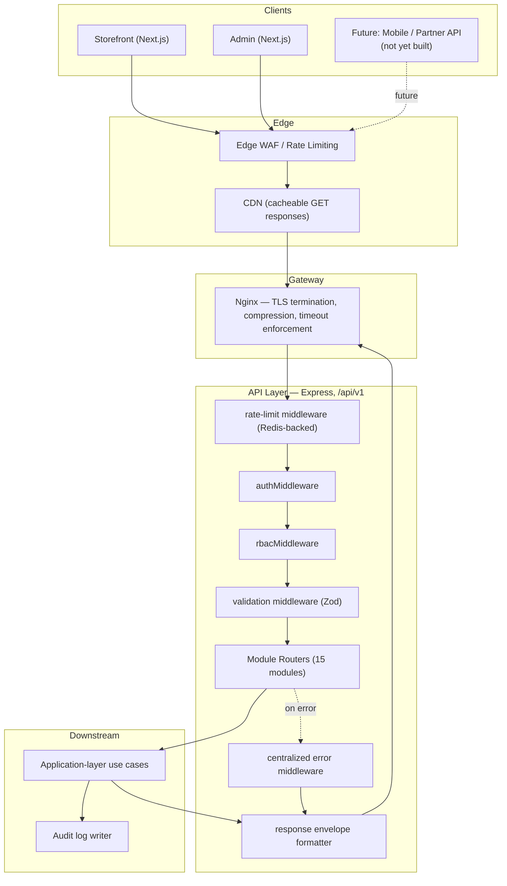
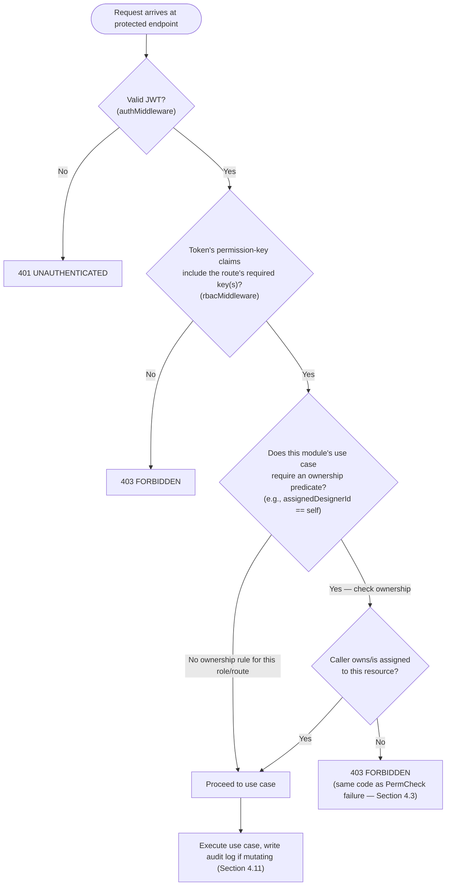
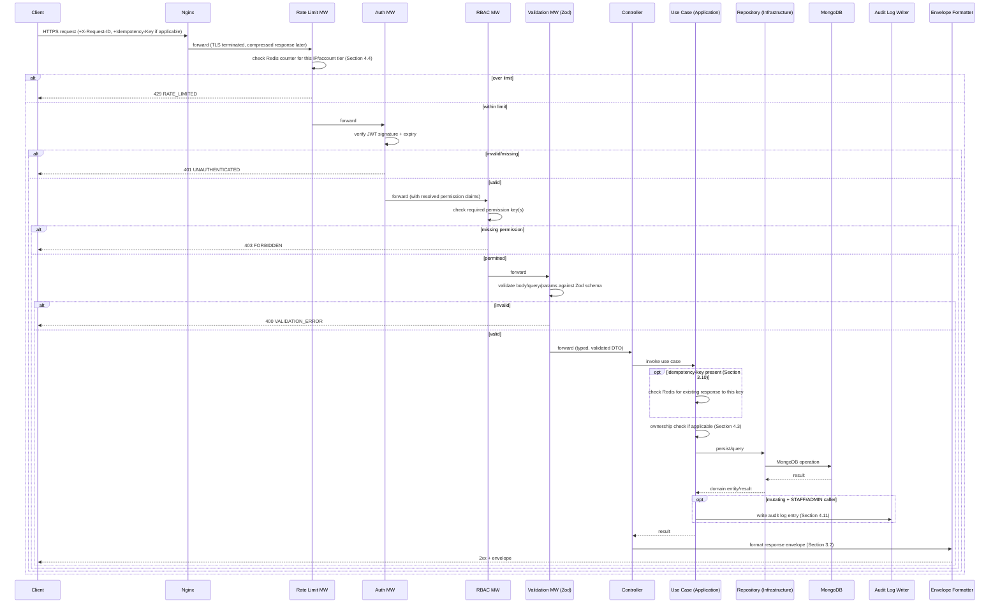
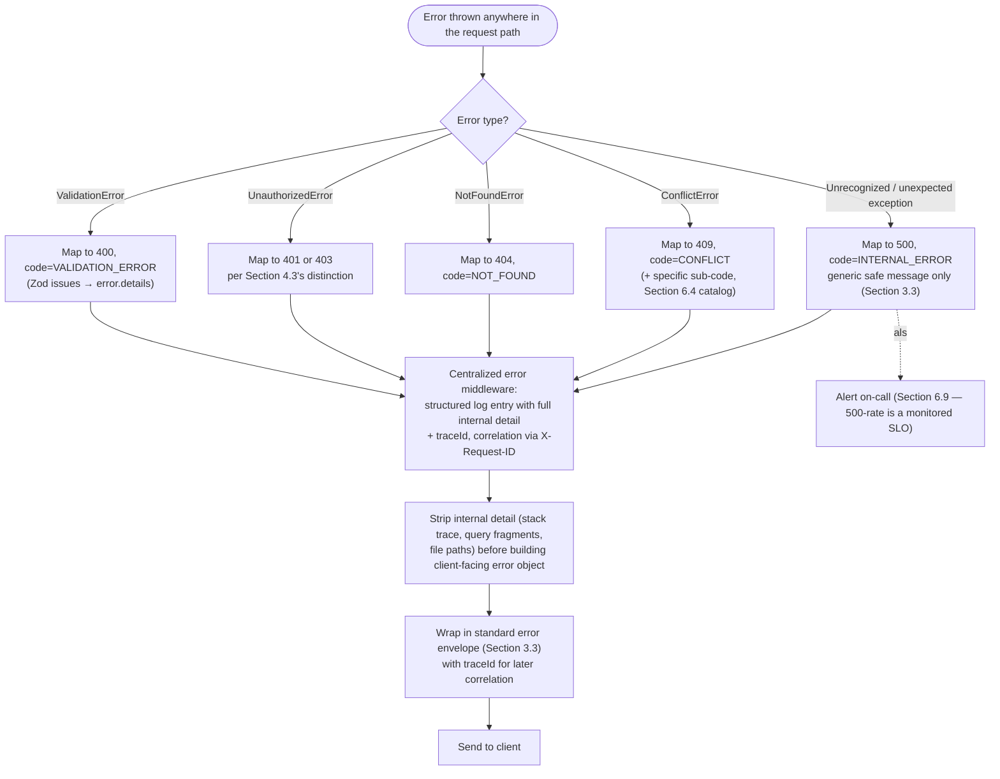
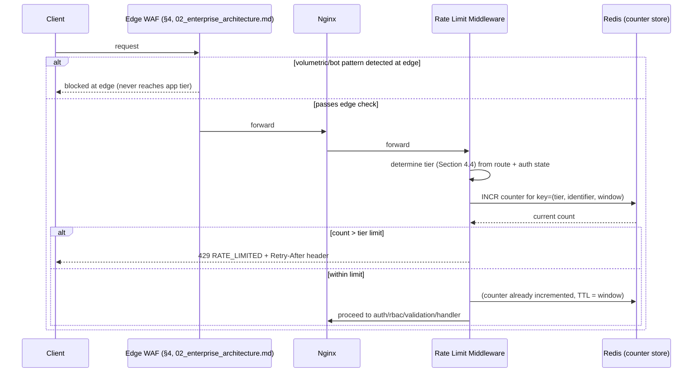

# API Architecture & Engineering Standards

## National Furniture & Interiors Platform

**Prepared by:** Enterprise API Architecture Review Board (Principal Backend Architect, API Platform Engineer, Security Architect, Senior Frontend Architect, Engineering Manager)
**Date:** 2026-08-07
**Status of `01`–`07`:** APPROVED and LOCKED. This document does not redesign business requirements, runtime architecture, database schema, repository strategy, project structure, or technology choices. It defines **how the already-locked API surface behaves** — request/response contracts, error semantics, security enforcement, performance discipline, and governance — at a level of precision none of `01`–`07` needed to reach.
**Scope:** No implementation code — no controllers, no Express routes, no middleware source. Contracts, standards, diagrams, and policy only.

---

## Revision History

| Version | Date | Change | Reason |
|---|---|---|---|
| v1.0 | 2026-08-07 | Initial version | — |
| v1.1 | 2026-08-11 | Section 8's `auth` contract row gains a clarifying note: `POST /auth/register` creates `CUSTOMER` accounts only and accepts neither `userType` nor `roleId`. No other content changed. | Authorized by **ADR-0002** (`docs/adr/0002-privileged-account-provisioning.md`, APPROVED 2026-08-11), applied per `docs/18_CLAUDE_CONSTITUTION.md` §5.1. v1.0's `auth` row stated the endpoint has no authentication but was silent on which `userType` an anonymous caller could request; read together with `docs/15_master_project_plan.md` §3.1 that silence permitted a privilege-escalation reading. The note closes the ambiguity fail-closed (`docs/09` §2.2). |
| v1.2 | 2026-08-11 | Section 8's `users` contract row: `users.read_self` is clarified as an explicit grant rather than "(implicit for own profile)"; `users.read`/`users.write` noted as `SUPER_ADMIN`-only in Phase 1. No other content changed. | Authorized by **ADR-0004** (`docs/adr/0004-phase1-role-permission-matrix.md`, APPROVED 2026-08-11), applied per `docs/18` §5.1. v1.0's "(implicit)" wording could be read as permitting own-profile access *without* holding the key, which would require a second authorization path outside `docs/02` §14's `roles.permissionIds[] → permissions.key` model and would fail open. The adopted mechanism is an explicit grant seeded to all seven roles. |

---

## 0. Relationship to Locked Documents

Three things this document is **not** doing, stated up front because the brief could otherwise be read as reopening decisions already made:

1. **It is not re-choosing REST.** `02_enterprise_architecture.md` §2 already names "REST API" as the API's technology, and §16 already locks URI-based versioning (`/api/v1/...`) and a response envelope shape. Section 2 below performs the full REST/GraphQL/Hybrid evaluation the brief asks for — but the honest outcome of that evaluation is confirmation, not a new decision, and Section 2 says so rather than manufacturing false suspense.
2. **It is not re-defining the module list, RBAC model, or auth flow.** Those are `02_enterprise_architecture.md` §9, §14 and `03_database_design.md` §9.1. This document takes them as given inputs and specifies what wasn't yet specified: exact request/response shapes, exact error codes, exact pagination/filtering contract, exact per-endpoint rate-limit tiers, exact OWASP-mapping.
3. **It is not re-drawing the folder structure.** `06_project_structure.md` §4.3 already says validators/DTOs live in each module's `presentation/` layer. This document is the content those files will eventually encode — the standard every module's `presentation/` layer must conform to, not a new place for that logic to live.

---

## 1. Analysis of Approved Documents

### 1.1 Business Capabilities → API Surface

Per `01_business_research.md`'s priority order (Interior Design Services → Lead Generation → Furniture eCommerce) and `02_enterprise_architecture.md` §0, the API surface splits into five capability groups, not flattened into one generic CRUD surface:

| Capability group | Backing modules (`06_project_structure.md` §4.3) | API character |
|---|---|---|
| Identity & Access | `auth`, `users`, `admin` | Low-volume, security-critical, session-shaped (login/refresh/logout), not resource-CRUD-shaped |
| Lead Generation | `leads`, `crm` | High write-volume from public/unauthenticated clients, low read-volume, heavily rate-limited and bot-defended |
| Interior Design | `design-projects`, `media` (portfolio side) | Low-volume, high-value, long-lived resources (a project spans months) with state-machine-gated writes |
| Commerce | `catalog`, `cart`, `orders`, `payments`, `reviews` | High read-volume (catalog), moderate write-volume (cart/orders), strict consistency on checkout/payment |
| Platform/Support | `notifications`, `cms`, `analytics` | Mostly internal/admin-consumed, read-heavy for `cms`/`analytics`, write-only-by-system for `notifications` |

### 1.2 Domain Modules

The 15 backend modules from `06_project_structure.md` §4.3 are the unit of API ownership: `auth`, `users`, `leads`, `crm`, `design-projects`, `catalog`, `cart`, `orders`, `payments`, `reviews`, `media`, `notifications`, `cms`, `admin`, `analytics`. Section 9 defines the API contract for every one of them.

### 1.3 Permissions

`03_database_design.md` §9.1.3's `permissions` collection is the enforcement source of truth (`02_enterprise_architecture.md` §9.1, reconciled from review finding S2): permission keys are `<module>.<action>` strings (e.g., `leads.read`, `orders.refund`, `design_projects.approve_quotation`). Every API endpoint below is annotated with the exact permission key(s) it requires — this document is where that mapping becomes complete and explicit for the first time (`02_enterprise_architecture.md` §14 gave a role-level summary; Section 9 here gives the per-endpoint key).

### 1.4 Authentication

JWT access + refresh, exactly as locked in `02_enterprise_architecture.md` §9 and confirmed in `07_technology_decision_record.md` §6.1. This document adds nothing new to the token *scheme* — Section 5.1 documents how it's carried on the wire (headers, cookies) at the HTTP-contract level.

### 1.5 Authorization

Permission-key RBAC, enforced by `rbacMiddleware` (`02_enterprise_architecture.md` §9.1, §14). This document adds the **resource-ownership layer** RBAC alone doesn't cover: a `DESIGNER` holds `design_projects.read`/`design_projects.write` generally, but must additionally be scoped to `assignedDesignerId == self` (`02_enterprise_architecture.md` §14's role table) — Section 5.3 formalizes this as a second authorization check (permission key, then ownership predicate), distinct from and layered on top of the permission-key check.

### 1.6 Bounded Contexts

Matches the module boundary exactly (`02_enterprise_architecture.md` §6): no endpoint in one module's router directly queries another module's collections. Cross-module reads happen through an internal Application-layer service call (same process, same request) or, for read-heavy denormalized views, through `analytics`'s dedicated read-models — never through an API-layer HTTP call from one module's controller to another's.

### 1.7 Frontend Requirements

Two consuming Next.js apps (`02_enterprise_architecture.md` §4, §6.2), both via `@nfi/api-client` (`05_repository_strategy.md` §8.3, `06_project_structure.md` §3.2's rule that a frontend app "never calls `fetch`/`axios` directly"). This has one direct consequence for API design: **the response envelope and error shape must be uniform across every endpoint**, because one typed client wraps all of them (Section 3.2).

### 1.8 Admin Requirements

The Admin Panel (`02_enterprise_architecture.md` §14) needs bulk operations (bulk lead assignment, bulk product status change), audit-logged writes on every mutation, and read endpoints that support the filter/sort/search combinations an operations team actually uses (Section 3.4–3.6). These requirements are why Batch Operations (Section 3.9) and mandatory Audit Logging (Section 5.11) are first-class standards, not admin-only exceptions bolted on later.

### 1.9 Lead Management, Commerce, Interior Design — API-Shape Implications

| Domain | What's different about its API contract |
|---|---|
| Lead Management | Public write endpoints (`POST /leads`) must be **unauthenticated but CAPTCHA-gated and rate-limited** (`02_enterprise_architecture.md` §10) — the one place in the API surface where a mutating endpoint has no auth requirement at all. Idempotency (Section 3.10) matters here specifically because sticky "Contact Us" buttons cause accidental duplicate submissions. |
| Commerce | Checkout (`POST /orders/checkout`) is the one endpoint family requiring strict server-side idempotency keys (Section 3.10) and the tightest response-time budget (Section 6.9), since it sits in the critical path of a payment. Catalog reads (`GET /products`) are the API's highest-traffic, most-cacheable surface (Section 6.1). |
| Interior Design | State-transition endpoints (e.g., `PATCH /design-projects/:id/stage`) are **not generic field updates** — they're modeled as explicit action endpoints (Section 3.1's RPC-style exception), because the state machine in `02_enterprise_architecture.md` §13 has transition-specific validation (a project can't skip from `QuotationSent` to `Handover`) that a generic `PATCH` with an arbitrary `stage` value would bypass. |

---

## 2. API Style Evaluation — REST vs. GraphQL vs. Hybrid

### 2.1 Comparison

| Dimension | REST | GraphQL | Hybrid (REST core + GraphQL gateway) |
|---|---|---|---|
| **Advantages** | Maps directly onto the resource-per-module structure already locked (`06_project_structure.md` §4.3); simple mental model per module; native HTTP caching (ETags, `Cache-Control`) works unmodified; every tool in the already-chosen stack (Zod validation, `07_technology_decision_record.md`'s OpenAPI-from-Zod plan) assumes REST | Client-specified field selection eliminates over-fetching on complex screens (e.g., admin dashboard combining lead + design-project + order data); single round-trip for nested data; strong typed-schema-as-contract story | Gets GraphQL's aggregation benefit for the specific screens that need it, without abandoning REST's simplicity everywhere else |
| **Disadvantages** | Over-fetching/under-fetching on screens needing data from multiple resources (mitigated below); N+1-shaped client code without a BFF (Backend-for-Frontend) layer for complex aggregations | A second query/execution paradigm alongside the already-locked Express/Zod stack; resolver-level authorization is easy to get subtly wrong (a field-level permission check is a different shape of enforcement than the endpoint-level `rbacMiddleware` already locked); caching is materially harder (no native HTTP caching per query) | Two paradigms to build, secure, document, and onboard developers into instead of one; the "when does a new feature get a GraphQL resolver vs. a REST endpoint" decision becomes an ongoing governance burden |
| **Developer Experience** | Familiar to the widest hiring pool; matches the module-per-resource structure 1:1, so a developer working in `modules/leads/presentation/` already knows the endpoint shape without learning a second system | Excellent for frontend developers once schema is stable (self-documenting via introspection); steeper backend learning curve for resolver-level N+1 batching (DataLoader-equivalent patterns) | Inherits REST's DX for most of the surface, GraphQL's DX for the aggregation layer — but only if both are kept in disciplined, non-overlapping scope |
| **Caching** | Native, mature: `Cache-Control`/ETag at the HTTP layer, plus the Redis cache-aside pattern already locked (`02_enterprise_architecture.md` §12) sits naturally underneath resource-shaped endpoints | Query-shape-dependent caching is a known hard problem — persisted queries or field-level caching require extra infrastructure the stack doesn't currently have | REST portion caches natively; GraphQL portion would need the same extra caching infrastructure GraphQL alone would need |
| **Performance** | Predictable per-endpoint performance profile, straightforward to load-test and set SLOs per route (Section 6.9) | A single flexible query can accidentally request an expensive, deeply-nested resolution path — requires query-cost analysis/depth-limiting to prevent, which is additional security/ops surface (ties to OWASP API4:2023 Unrestricted Resource Consumption, Section 10.3) | Same performance predictability as REST for the REST portion; the GraphQL portion carries GraphQL's query-cost-analysis burden |
| **Scalability** | Stateless, horizontally scaled exactly as already locked (`02_enterprise_architecture.md` §8.1) — no different scaling story than what's already designed | Scales the same way at the transport level, but hot-path query-complexity variance makes autoscaling triggers (CPU/RPS) less predictable than uniform REST endpoints | Inherits REST's scaling predictability for most traffic; the GraphQL gateway would need separate capacity planning |
| **Versioning** | URI-based (`/api/v1/`), already locked (`02_enterprise_architecture.md` §16) — coarse-grained but simple and unambiguous | Schema evolves additively (deprecate fields, don't remove) — elegant in theory, but requires schema governance discipline the team would be building for the first time | Two versioning models running concurrently — real governance overhead |
| **Maintenance** | One contract style, one validation library (Zod) generating one client (`@nfi/api-client`), matching the single-typed-client requirement from Section 1.7 | A second schema language (GraphQL SDL) alongside Zod/TypeScript types — either duplicated or requires a schema-generation bridge that doesn't exist yet in `01`–`07` | Maintains two schema systems long-term — directly at odds with `05_repository_strategy.md` §9's stated preference against unnecessary duplication of shared contract logic |
| **Future Mobile Support** | `02_enterprise_architecture.md` §16 explicitly designed URI versioning "to allow non-breaking evolution once mobile apps... consume the same API" — REST already anticipates this | Would serve mobile well precisely because of field-selection efficiency over constrained mobile networks — GraphQL's strongest real argument for this platform | Mobile could consume either layer; but introducing GraphQL specifically to solve a Phase-2, not-yet-committed mobile requirement is optimizing for a future that `01_business_research.md`'s roadmap has not yet confirmed |
| **Future Public/Partner API Support** | Resource-oriented REST with API-key-based auth (Section 5 extension) is the conventional, widely-understood shape for third-party integrators (e.g., a future Designer Partner Network API, `04_architecture_decision.md` §9.2) | GraphQL's flexible querying is a liability for a public API — third parties can construct expensive queries against your infrastructure; most public-API providers that use GraphQL layer significant cost-limiting on top | REST is the safer, more conventional choice for the public-facing case specifically |

### 2.2 Decision: REST

**Chosen: REST, uniformly, for the entire API surface.** No GraphQL layer, now or as a near-term addition.

**Justification:**

1. **It's already the locked decision, not a new one.** `02_enterprise_architecture.md` §2 names "REST API" as the technology; §16 locks URI-based versioning specifically as REST's versioning mechanism; `07_technology_decision_record.md` plans OpenAPI generation from Zod validators, which is a REST-native workflow with no GraphQL equivalent in the current stack. Choosing GraphQL or Hybrid here would silently reopen an architecture decision this document is explicitly barred from reopening (see Section 0).
2. **The module structure is already REST-shaped.** Fifteen feature modules, each owning a narrow set of collections (`06_project_structure.md` §4.3) map directly onto fifteen resource families. This is not a coincidence — Feature-Based Architecture and REST's resource orientation are the same organizing idea applied at two different layers.
3. **GraphQL's actual advantage (avoiding over-fetching on aggregate screens) is real but narrow**, and is addressed without adopting a second paradigm: Section 3.7 (Field Selection) gives REST endpoints a `?fields=` sparse-fieldset mechanism, and Section 9's per-module contracts include purpose-built aggregate endpoints (e.g., `GET /admin/dashboard/summary`) for the specific screens that would otherwise justify GraphQL. This is the same reasoning pattern already used repeatedly across `01`–`07` (`07_technology_decision_record.md` §3.5, §5.2, §15.1: solve the narrow problem with a scoped mechanism rather than adopting a heavier general-purpose tool).
4. **The team-size and stage argument.** Consistent with every prior "pick the tool sized to the team" decision in `07_technology_decision_record.md` (Sections 16.1, 19.2), a small team building an MVP-to-Phase-1 platform gains more from one well-disciplined contract style than from the ongoing governance cost of running two.
5. **Mobile and public-API futures don't require it today.** Section 2.1's own analysis shows REST already anticipates mobile (URI versioning was designed for exactly this) and is the safer choice for a future public/partner API. If a specific, measured future need emerges (e.g., a genuinely aggregation-heavy mobile dashboard screen with a measured over-fetching cost), the trigger-based revisit discipline used throughout this document series (Section 12) applies: revisit then, with real data, not speculatively now.

**What REST does NOT mean here:** a small number of endpoints are deliberately RPC-shaped action endpoints (`POST /design-projects/:id/advance-stage`, not a generic `PATCH`) rather than pure resource CRUD, wherever the underlying operation is a state-machine transition with its own validation (Section 1.9's Interior Design note, Section 3.1). This is a standard, disciplined REST pattern, not a departure from REST.

---

## 3. API Standards

### 3.1 Request Format

- **Base path:** `https://api.nationalinteriors.example/api/v{n}/` (Section 3.17 for versioning).
- **Resource endpoints:** plural nouns, kebab-case for multi-word resources — `/design-projects`, `/quote-requests`, `/bulk-enquiries` — matching `03_database_design.md` §2's collection-naming convention (plural, snake_case in the DB) translated to REST's own convention (plural, kebab-case in URLs); the DB's `snake_case` does not leak into the URL.
- **Action endpoints (RPC-style exception, Section 2.2):** verb-suffixed on a specific resource — `POST /design-projects/:id/advance-stage`, `POST /orders/:id/cancel`, `POST /leads/:id/assign`. Reserved for state-machine transitions and operations that are not a plain field update.
- **Request body:** JSON only (`Content-Type: application/json`), except direct-to-Cloudinary signed uploads (Section 5.6, unchanged from `02_enterprise_architecture.md` §15, which are `multipart/form-data` **to Cloudinary**, never to this API).
- **Request headers (standard set):**

| Header | Purpose | Required |
|---|---|---|
| `Authorization: Bearer <accessToken>` | Auth (Section 5.1) | On every authenticated endpoint |
| `Content-Type: application/json` | Body encoding | On every request with a body |
| `X-Request-ID` | Client-supplied or server-generated UUIDv4 correlation ID, propagated through logs (`02_enterprise_architecture.md` §16) | Recommended; server generates one if absent |
| `Idempotency-Key` | UUIDv4, client-generated | Required on the endpoints listed in Section 3.10 |
| `Accept-Language` | Locale hint for future i18n (not yet implemented, noted as an open item, Section 15) | Optional |

- **Query parameters:** `camelCase`, matching field-naming convention (Section 3.15) — `?sortBy=createdAt&categoryId=...`, never `snake_case` or `kebab-case` in query keys.

### 3.2 Response Format

Confirms and formalizes the envelope already named in `02_enterprise_architecture.md` §16 ("Consistent `{ success, data, error, meta }` shape across all endpoints"), specified here to field-level precision for the first time:

```
{
  "success": true,
  "data": { ... } | [ ... ] | null,
  "error": null,
  "meta": {
    "requestId": "uuid",
    "timestamp": "ISO-8601",
    "pagination": { ... } | undefined
  }
}
```

- `success` — boolean, always present, always matches whether `error` is `null`.
- `data` — the resource, array of resources, or `null` for actions with no return payload (e.g., `204`-equivalent actions still return this envelope with `data: null`, never a bare empty body, so `@nfi/api-client` — Section 1.7 — never has to special-case "did this endpoint return an envelope or not").
- `error` — `null` on success; see Section 3.3 for shape on failure.
- `meta.requestId` — echoes or generates `X-Request-ID` (Section 3.1), also present in structured logs for the same request (`02_enterprise_architecture.md` §16), closing the loop between "a client reports a broken response" and "find the exact server-side log line."
- `meta.pagination` — present only on list endpoints (Section 3.4).

**Why one envelope for every response, including errors:** the single typed API client (Section 1.7) can unwrap every response identically without a per-endpoint special case — this is the concrete mechanism that makes "one client for every module" (`05_repository_strategy.md` §8.3's `@nfi/api-client`) actually work in practice, not just in principle.

### 3.3 Error Format

```
{
  "success": false,
  "data": null,
  "error": {
    "code": "VALIDATION_ERROR",
    "message": "Human-readable, safe-to-display summary",
    "details": [
      { "field": "email", "issue": "must be a valid email address" }
    ],
    "traceId": "uuid"
  },
  "meta": { "requestId": "uuid", "timestamp": "ISO-8601" }
}
```

| Field | Rule |
|---|---|
| `error.code` | Machine-readable, `UPPER_SNAKE_CASE`, drawn from the Error Catalog (Section 8.4) — never a raw stack trace or driver-level error string |
| `error.message` | Safe to render directly to an end user; never includes internal identifiers, stack traces, SQL/Mongo query fragments, or file paths — closing the "verbose error messages leak internals" gap explicitly named in OWASP API Security Top 10 (API8:2023, Section 10.3) |
| `error.details` | Optional array, populated for `VALIDATION_ERROR` with one entry per failing field, mirroring Zod's own per-field issue shape (Section 3.13) so the mapping from Zod output to wire format is closer to a pass-through than a rewrite |
| `error.traceId` | Correlates to the centralized error-handling middleware's internal log entry (`02_enterprise_architecture.md` §16) — support/engineering can look up the full internal error (including stack trace) server-side by this ID, without ever exposing that detail to the client |

Every custom error class already named in `02_enterprise_architecture.md` §16 (`NotFoundError`, `ValidationError`, `ConflictError`, `UnauthorizedError`) and `06_project_structure.md` §4.2's `core/exceptions/` maps to exactly one `error.code` and one HTTP status (Section 3.11) — a fixed, versioned table, not ad hoc per endpoint.

### 3.4 Pagination

**Cursor-based for high-volume/high-churn collections, offset-based for small/stable ones** — not one universal strategy, because the two have genuinely different correctness properties:

| Collection class | Strategy | Example endpoints | Why |
|---|---|---|---|
| High-volume, frequently-written (`products`, `leads`, `orders`, `audit_logs`) | **Cursor-based** (opaque, encoding `_id` + sort field) | `GET /products`, `GET /admin/leads` | Offset pagination on a frequently-written collection skips or duplicates rows as records are inserted/deleted between page requests (the classic "page 2 shows items already seen on page 1" bug) — a cursor anchored to a stable field doesn't have this failure mode |
| Small, stable, or admin-config collections (`categories`, `roles`, `warehouses`, `coupons`) | **Offset-based** (`page`/`limit`) | `GET /categories`, `GET /admin/roles` | Simpler client mental model (jump to page N) with acceptable correctness trade-offs given low write-churn and small total size |

**Cursor response shape:**
```
"meta": { "pagination": { "nextCursor": "opaque-string" | null, "hasMore": true, "limit": 20 } }
```

**Offset response shape:**
```
"meta": { "pagination": { "page": 2, "limit": 20, "totalItems": 143, "totalPages": 8 } }
```

**Limits (Section 6.3 for the performance rationale):** default `limit=20`, maximum `limit=100` server-enforced regardless of what the client requests — a client requesting `limit=10000` receives `100` items, not an error, to keep the contract forgiving while still protecting the database (ties to OWASP API4:2023, Section 10.3).

### 3.5 Filtering

Query-parameter based, one parameter per filterable field, `camelCase`: `GET /products?categoryId=...&status=PUBLISHED&priceMin=100000&priceMax=500000`. Range filters use `<field>Min`/`<field>Max` suffixes (not a generic operator syntax like `field[gte]=`) — chosen for readability and direct mapping to a Zod query-schema per endpoint (Section 3.13), at the cost of not supporting arbitrary boolean filter combinations, which no current requirement in `01`–`07` calls for. Every module's presentation-layer validator (`06_project_structure.md` §4.3) declares its own allow-listed filterable fields explicitly — an unrecognized filter query parameter is a `400 VALIDATION_ERROR`, not silently ignored, so a typo'd filter never silently returns unfiltered results.

### 3.6 Sorting

`?sortBy=<field>&sortOrder=asc|desc`, single-field sort by default. Multi-field sort (`?sortBy=priority,-createdAt`, comma-separated, `-` prefix for descending) is supported only on the specific admin list endpoints named in Section 9 that need it (e.g., `GET /admin/leads` sorting by priority then recency) — not offered universally, since an unindexed arbitrary multi-field sort on a large collection is a direct performance/DoS surface (Section 6.3, OWASP API4:2023). Every sortable field must have a supporting index (cross-referenced against `03_database_design.md` §10's index list); a `sortBy` value with no backing index is rejected at the validator level, not silently executed as an unindexed sort.

### 3.7 Searching

- **Free-text search** (`GET /products?q=...`, `GET /admin/leads?q=...`) is backed by MongoDB's `$text` index per `03_database_design.md` §10.4 and `07_technology_decision_record.md` §12.1 — confirmed here as the MVP search mechanism, with the same explicitly-accepted UX trade-off (no typo tolerance) already documented there. This is not a new decision.
- **Structured search** is just Filtering (Section 3.5) — this document does not introduce a separate structured-query syntax alongside free-text `q`.
- Search endpoints carry a **tighter rate-limit tier** than ordinary reads (Section 5.4), consistent with `02_enterprise_architecture.md` §16 naming "public catalog search" as a rate-limited endpoint category alongside auth and lead-capture.

### 3.8 Field Selection

`?fields=id,name,price,images` — a sparse fieldset mechanism, REST's answer to GraphQL's over-fetching advantage (Section 2.2, point 3). Supported only on list endpoints for the highest-traffic resources (`products`, `leads` in admin views) where response-size reduction has a measurable payload/bandwidth benefit (Section 6.7); not universally required. An unrecognized field name in `?fields=` is silently dropped (not an error) — precedent: filtering (Section 3.5) is strict-validated because an unrecognized *filter* silently returning wrong data is a correctness bug, while an unrecognized *field* silently being omitted from an already-correct result set is not.

### 3.9 Batch Operations

Admin bulk actions (Section 1.8) use a dedicated batch endpoint per action family, never an array passed to a single-resource endpoint's URL:

`POST /admin/leads/bulk-assign { "leadIds": [...], "assignedToId": "..." }`
`POST /admin/products/bulk-status { "productIds": [...], "status": "ARCHIVED" }`

**Response is per-item, not all-or-nothing by default:**
```
{ "data": { "succeeded": ["id1","id3"], "failed": [{ "id": "id2", "error": { "code": "...", "message": "..." } }] } }
```
A batch of 100 items where 3 fail does not roll back the other 97 — each item's mutation is independent unless the specific batch endpoint explicitly documents atomic all-or-nothing semantics (only where the underlying domain operation genuinely requires it, e.g., anything touching the atomic inventory reservation pattern in `02_enterprise_architecture.md` §11, which is never exposed as a bulk endpoint in the first place). Batch size is capped per endpoint (default max 100 items) — an oversized batch request is a `400 VALIDATION_ERROR`, not a truncated silent partial batch.

### 3.10 Idempotency

**Required** (via `Idempotency-Key` header, Section 3.1) on:

| Endpoint family | Why |
|---|---|
| `POST /orders/checkout` | Prevents duplicate order creation on client retry/double-click during the payment-initiation window (`02_enterprise_architecture.md` §11) |
| `POST /leads` | Prevents duplicate lead rows from repeat form submissions/sticky buttons (Section 1.9) — **in addition to**, not instead of, the server-side dedupe-by-contact-window logic already in `02_enterprise_architecture.md` §10; idempotency keys catch same-client retries, dedupe logic catches genuinely repeated submissions from the same person via different sessions |
| `POST /design-projects/:id/milestones/:mid/payment` | Same duplicate-payment-intent risk as checkout |
| `POST /returns` | Prevents duplicate return requests for the same order/items on client retry |

**Mechanism:** server stores `(idempotencyKey, endpoint, requestHash) → response` for 24 hours (Redis, per `07_technology_decision_record.md` §7.1's existing role as the shared-state store); a repeated request with the same key and same request body within that window returns the **original** response without re-executing the operation; the same key with a **different** body is a `409 IDEMPOTENCY_KEY_CONFLICT`, not a silent overwrite — this catches client bugs that reuse a key incorrectly rather than masking them.

**This is distinct from, and layered on top of, the database-level atomicity already locked** (`02_enterprise_architecture.md` §11's atomic conditional update and narrow transaction use) — idempotency prevents a duplicate *request* from being processed twice; the atomic update prevents a *single* request from racing another concurrent request incorrectly. Both are needed; neither substitutes for the other.

### 3.11 HTTP Status Codes

| Code | Meaning here | Example |
|---|---|---|
| `200 OK` | Successful read or non-creating write | `GET /products`, `PATCH /leads/:id` |
| `201 Created` | Resource created | `POST /leads`, `POST /orders/checkout` |
| `202 Accepted` | Request accepted for async processing, not yet complete | (reserved; not currently used — no endpoint in `01`–`07` has async-only semantics at the API boundary, since queueing happens *after* a synchronous DB write per `02_enterprise_architecture.md` §10/§16) |
| `204 No Content` | *(Not used — see Section 3.2's rule that every response carries the envelope, even for actions with no payload; those return `200` with `data: null`, not a bodyless `204`)* | — |
| `400 Bad Request` | `error.code = VALIDATION_ERROR` | Malformed body, failed Zod schema, unrecognized filter param |
| `401 Unauthorized` | Missing/invalid/expired access token | `error.code = UNAUTHENTICATED` |
| `403 Forbidden` | Valid token, insufficient permission key or failed ownership check (Section 1.5) | `error.code = FORBIDDEN` |
| `404 Not Found` | Resource doesn't exist or is soft-deleted (`03_database_design.md` §3.1's default `isDeleted: false` filter makes a soft-deleted resource indistinguishable from nonexistent to a non-admin caller) | `error.code = NOT_FOUND` |
| `409 Conflict` | State conflict — insufficient stock (`02_enterprise_architecture.md` §11), return outside window, idempotency key reused with a different body, optimistic-concurrency `version` mismatch (`03_database_design.md` §3) | `error.code = CONFLICT` (with a more specific sub-code in `details`, Section 8.4) |
| `422 Unprocessable Entity` | *(Not used — deliberately folded into `400`; the REST community's `400` vs `422` distinction is not load-bearing for any client behavior in this API, and one fewer code to disambiguate is simpler for `@nfi/api-client` to handle)* | — |
| `429 Too Many Requests` | Rate limit exceeded (Section 5.4) | `error.code = RATE_LIMITED`, `Retry-After` header set |
| `500 Internal Server Error` | Unhandled server fault | `error.code = INTERNAL_ERROR`, message is a generic safe string, never the underlying exception detail (Section 3.3) |
| `503 Service Unavailable` | Health-check-failing dependency (e.g., MongoDB unreachable) — returned by the readiness probe path, not a generic catch-all | `error.code = SERVICE_UNAVAILABLE` |

### 3.12 Validation Standards

Zod (`07_technology_decision_record.md` §10.1) at the Presentation layer of every module (`06_project_structure.md` §4.3's `presentation/validators/`), confirmed here with the specific discipline this document adds:

- **Every** request body, query-parameter set, and route-param set has an explicit Zod schema — no endpoint accepts an untyped/unvalidated payload, including admin/internal endpoints.
- Validation failure always produces exactly the `VALIDATION_ERROR` shape in Section 3.3, with `error.details` populated from Zod's own issue array (field path + message), not a generic "invalid input" string.
- Strict-mode schemas (`z.object({...}).strict()`) reject unknown fields rather than silently stripping them — an unexpected field in a request body is itself a signal worth surfacing to the client (a version-mismatch or integration bug), not silently dropped.
- Domain-layer invariants (`02_enterprise_architecture.md` §16's defense-in-depth principle) are re-checked independently in the Domain layer regardless of Presentation-layer validation passing — this document does not relax that; API-layer validation and domain invariants remain two separate checks with two separate purposes (shape/type correctness vs. business-rule correctness).

### 3.13 Serialization

- JSON, UTF-8, on every request and response body.
- MongoDB `ObjectId` fields are serialized as plain strings on the wire (`"64f1a2b3c4d5e6f7a8b9c0d1"`), never as a Mongo-specific `{"$oid": "..."}` extended-JSON shape — the client never needs to know the backing store is MongoDB.
- `Number` fields representing money remain in **minor units (paise)** on the wire, matching `03_database_design.md` §2's storage convention exactly — the API does not convert to decimal rupees at the boundary; `@nfi/shared` (Section 3.15) provides the one shared formatting utility both frontend apps use to display paise as currency, so the conversion happens in exactly one place, not independently in every client screen.
- Arrays are always arrays, even when empty (`[]`, never `null`) — a list endpoint with zero results returns `"data": []`, not `"data": null`, so client code never needs a null-check before an array operation.

### 3.14 Date Format

**ISO-8601, UTC, with explicit `Z` suffix**, on every date/time field in every request and response — `"2026-08-07T14:30:00.000Z"`. No endpoint accepts or returns a locale-formatted date string, a Unix timestamp integer, or a date-only string without a time component (even for date-only concepts like `dueDate`, which is still `T00:00:00.000Z` UTC, to avoid the timezone-shift-by-one-day bug class entirely). Matches `03_database_design.md`'s native `Date` BSON type, which Mongoose already serializes to ISO-8601 by default — this is a confirmation of the natural default, made explicit and mandatory rather than left to happen implicitly per module.

### 3.15 UUID Strategy

**Two distinct identifier systems, deliberately not unified, because they serve different purposes:**

| Identifier | Format | Used for | Why not the other format |
|---|---|---|---|
| Resource IDs (`_id` on every document) | MongoDB `ObjectId`, serialized as a 24-char hex string (Section 3.13) | Every persisted resource's primary identifier, exactly as `03_database_design.md` designed it | Converting every stored `ObjectId` to a UUID at the API boundary would mean maintaining a bidirectional mapping table for no functional benefit — `ObjectId` is already globally unique, sortable-by-creation-time (a property some admin list views implicitly rely on), and is what every relationship/reference in `03_database_design.md` already uses |
| Request-scoped identifiers (`X-Request-ID`, `Idempotency-Key`, `error.traceId`) | UUIDv4 | Correlation and idempotency (Sections 3.1, 3.10, 3.3) | These are not persisted resources — they're ephemeral, client-or-server-generated tokens that need to be generatable **before** any database write happens (a client must be able to generate an idempotency key before the server has created anything), which rules out `ObjectId` (which requires server-side generation tied to insertion) |

This is a considered choice, not an oversight: the brief's "UUID Strategy" heading is answered by explaining precisely where UUIDs are and are not the right tool, rather than forcing UUIDs onto resource IDs where `ObjectId` already serves better.

### 3.16 Naming Convention

| Element | Convention | Example |
|---|---|---|
| URL path segments | plural nouns, kebab-case | `/design-projects`, `/quote-requests` |
| Path parameters | `camelCase`, `:id` for the primary resource, `:<entity>Id` for nested | `/design-projects/:id/assets/:assetId` |
| Query parameters | `camelCase` | `?categoryId=...&sortBy=createdAt` |
| JSON body/response fields | `camelCase`, matching `03_database_design.md` §2's field convention exactly — no translation layer between DB field names and API field names | `firstName`, `createdAt`, `unitPrice` |
| Enum values on the wire | `UPPER_SNAKE_CASE`, matching `03_database_design.md` §2's stored enum convention exactly | `PENDING`, `QUALITY_CHECK` |
| Permission keys | `<module>.<action>`, lowercase, dot-separated, matching `03_database_design.md` §9.1.3's `permissions.key` format exactly | `leads.read`, `orders.refund` |
| Error codes | `UPPER_SNAKE_CASE` | `VALIDATION_ERROR`, `RATE_LIMITED` |

**Governing principle:** wherever a naming convention already exists in `03_database_design.md`, the API uses the identical convention rather than inventing a translation layer — the only place this document introduces a *new* convention is at the URL-path level (kebab-case), because REST path segments are the one place `03_database_design.md` has no opinion (it names collections, not URLs).

### 3.17 API Versioning Strategy

**URI-based, confirmed from `02_enterprise_architecture.md` §16:** `/api/v1/...`. A new major version (`/api/v2/`) is created only for breaking changes (Section 3.18 defines "breaking" precisely); the entire API versions together as one unit — there is no per-module independent versioning (`/api/v1/leads` and `/api/v2/orders` do not coexist as a stable long-term state; a v2 cutover is planned and executed platform-wide, even if migrated module-by-module behind the scenes during the transition, per Section 13's governance rules).

### 3.18 Backward Compatibility

A change is **non-breaking** (ships within the current version, no version bump) if it:
- adds a new optional request field,
- adds a new response field,
- adds a new endpoint,
- adds a new enum value **to a field the client is contractually required to treat as an open set** (documented per-field in the OpenAPI spec, Section 8.1 — most status/state enums are closed sets and adding a value to those IS breaking, per below),
- relaxes a validation constraint (e.g., widening a string length limit).

A change is **breaking** (requires a new major version) if it:
- removes or renames a field, endpoint, or query parameter,
- changes a field's type or semantic meaning,
- adds a new **required** request field,
- removes an enum value, or adds a value to a closed-set enum the client switches on exhaustively (e.g., `orders.fulfillmentStatus` — client code reasonably assumes it has handled every current value),
- changes an endpoint's authentication/authorization requirement to be stricter,
- changes default behavior (e.g., default pagination `limit`, default sort order) in a way that alters existing client results.

### 3.19 Deprecation Policy

1. A deprecated endpoint/field is marked `deprecated: true` in the OpenAPI spec (Section 8.1) and returns a `Deprecation` header (per the emerging `Deprecation`/`Sunset` HTTP header convention) with a `Sunset` date.
2. Minimum deprecation window: **90 days** from announcement to removal, published in `docs/release-notes/` (`06_project_structure.md` §8) and communicated to any known integrator before the sunset date, not just documented silently.
3. A deprecated field/endpoint continues to function identically (not degraded, not rate-limited differently) throughout the deprecation window — deprecation is a notice period, not a soft-removal.
4. Removal only happens at a major-version boundary (Section 3.17) — a deprecated field is never silently removed within `v1`; it's removed when `v2` ships, and `v1` continues serving the deprecated-but-functional field for as long as `v1` itself is supported (Section 13's governance rules set that support window).

---

## 4. Security Standards

### 4.1 JWT

Confirms `02_enterprise_architecture.md` §9.1 exactly: access token short-TTL (10–15 min), in-memory client-side; carries resolved permission-key claims (Section 1.3). Specified here at the transport level: `Authorization: Bearer <token>` header only — **never** a query parameter or cookie for the access token (query-string tokens leak into server logs and browser history; this is the concrete OWASP-aligned reason for the header-only rule, tying to API2:2023 Broken Authentication, Section 10.3).

### 4.2 Refresh Token

Confirms `02_enterprise_architecture.md` §9.1: `httpOnly`, `Secure`, `SameSite=Strict` cookie, hashed in Redis, rotated on use. Transport-level addition: the refresh cookie is scoped to the single `POST /auth/refresh` path (`Path=/api/v1/auth/refresh`), not the whole domain — limiting which endpoints the browser even attaches the cookie to, a narrower attack surface than a domain-wide cookie.

### 4.3 RBAC

Confirms the permission-key model (Section 1.3, `02_enterprise_architecture.md` §9.1/§14). Enforcement order, specified here precisely for the first time:

1. `authMiddleware` — validates JWT signature/expiry → `401` if invalid.
2. `rbacMiddleware` — checks the resolved permission key(s) required for this route against the token's claims → `403` if missing.
3. **Ownership check** (Section 1.5), inside the Application-layer use case, not general middleware — because "is this the caller's own resource" is module-specific business logic (e.g., `DESIGNER` + `assignedDesignerId == self`), not a generic cross-cutting concern; it stays in `application/`, consistent with `02_enterprise_architecture.md` §7.2's rule that use cases are the only place business rules are evaluated.

A request failing step 2 gets `403 FORBIDDEN`; a request failing step 3 also gets `403 FORBIDDEN` with the same error code — the response deliberately does not distinguish "you lack the permission" from "you have the permission but don't own this resource," since revealing that distinction would leak information about resource existence/assignment to an unauthorized caller (ties to OWASP API1:2023 Broken Object Level Authorization, Section 10.3).

### 4.4 Rate Limiting

Redis-backed (`02_enterprise_architecture.md` §16), specified here as concrete tiers:

| Tier | Limit | Applies to |
|---|---|---|
| Strict | 5 req/min per IP, 10 req/min per account | `POST /auth/login`, `POST /auth/register`, OTP endpoints |
| Public-write | 10 req/min per IP | `POST /leads`, `POST /contact-form-submissions`, `POST /bulk-enquiries` |
| Search | 30 req/min per IP | `GET /products?q=`, `GET /admin/*?q=` |
| Standard authenticated | 120 req/min per account | All other authenticated endpoints |
| Public read | 60 req/min per IP | Unauthenticated catalog reads |

Every tier is backstopped by the edge WAF/rate-limiting layer already locked (`02_enterprise_architecture.md` §4) — this table is the **application-level** tier sitting behind that edge layer, not a replacement for it. Exceeding a limit returns `429` (Section 3.11) with a `Retry-After` header; the limit counters are per-account where authenticated (preventing one compromised account from being the sole throttle unit) and per-IP where not (the only option pre-authentication).

### 4.5 Input Validation

Confirms Section 3.12 (Zod at every boundary) as the primary control, plus the specific NoSQL-injection mitigation already locked in `07_technology_decision_record.md` §10.1 (v1.1 remediation, finding S3): strict primitive-typed schemas reject any request field that isn't the exact expected primitive type, which is what prevents a MongoDB query operator (`{"$gt": ""}`) from being smuggled in through a field expected to be a plain string.

### 4.6 File Upload Security

Confirms `02_enterprise_architecture.md` §15's direct-to-Cloudinary signed-upload pattern. API-contract-level additions:

- `POST /media/signature` (the signing endpoint) is itself authenticated and permission-checked (`media.upload` key) — an unauthenticated caller cannot obtain a valid signature.
- Signed upload presets constrain file type/size **at Cloudinary**, not just documented as a convention (v1.1 remediation, finding S5, confirmed here as a hard API-contract requirement, not optional per-caller configuration).
- `POST /media/confirm` re-validates ownership (does this `entityId` belong to the calling user/have they permission to attach media to it) and re-validates the asset actually exists at the given `public_id` before persisting the reference — an attacker cannot attach an arbitrary, unrelated Cloudinary asset to someone else's entity by guessing/reusing a `public_id`.
- Any future untrusted-user-upload flow (Section 1.9 doesn't currently require one) must use server-proxied upload with content scanning, per `02_enterprise_architecture.md` §15.1's explicit trust-model split — never extended to the signed-upload path without a new, explicit decision.

### 4.7 CAPTCHA

Confirms `02_enterprise_architecture.md` §10 (v1.1, finding A2): invisible-challenge CAPTCHA (reCAPTCHA v3/Turnstile) verified server-side before `POST /leads` is processed. API-contract addition: the CAPTCHA token is a required field in the request body (`captchaToken`), validated by the Zod schema as present and non-empty (Section 3.12) before the handler even attempts server-side verification — a missing token is a `400 VALIDATION_ERROR`, a present-but-failed token is a `403 FORBIDDEN` with `error.code = CAPTCHA_FAILED`, flagged for manual review rather than silently dropped (per the existing false-positive-avoidance design in `02_enterprise_architecture.md` §10).

### 4.8 CORS

Strict allow-list (`02_enterprise_architecture.md` §16), specified here concretely: only the `storefront` and `admin` origins (per environment, `configs/environments/`) are allowed; credentials mode (`Access-Control-Allow-Credentials: true`) is enabled only for those exact origins, never a wildcard — required because the refresh-token cookie (Section 4.2) depends on credentialed cross-origin requests working correctly between the API's own origin and the two frontend origins.

### 4.9 CSRF

The refresh-token cookie's `SameSite=Strict` attribute (Section 4.2, confirmed from `02_enterprise_architecture.md` §9.1) is the primary CSRF defense for the one endpoint that relies on a cookie at all (`POST /auth/refresh`) — every other endpoint authenticates via the `Authorization` header (Section 4.1), which is not automatically attached by the browser cross-origin and therefore isn't CSRF-exposed the way cookie-based auth would be. No separate CSRF token is issued, because `SameSite=Strict` plus header-based auth for everything else already closes the relevant attack surface without adding a second mechanism.

### 4.10 Request Signing (Future)

**Not implemented for the current API surface** — both consuming apps (`storefront`, `admin`) are first-party, same-organization clients authenticated via the JWT scheme above, and there is no current third-party integrator requirement in `01`–`07`. Reserved for the future public/partner API scenario named in Section 2.1 (a Designer Partner Network integration, per `04_architecture_decision.md` §9.2's ranked extraction candidates): HMAC request signing (timestamp + body hash, signed with a per-partner secret) would be introduced at that point, scoped only to the new public-API endpoints, not retrofitted onto the first-party JWT-authenticated surface. This is a named, deferred decision (consistent with the trigger-based deferral pattern in Section 12.2), not an oversight.

### 4.11 Audit Logging

Confirms `02_enterprise_architecture.md` §14 ("Audit logging is mandatory on every write action from the Admin Panel") and `03_database_design.md` §9.8.2's PII-redaction rule. API-contract-level precision added here: every mutating endpoint (`POST`/`PATCH`/`DELETE`) reachable by a `STAFF`/`ADMIN`-authenticated caller writes an `audit_logs` entry as part of the same request lifecycle (Section 7), containing `actorId`, `action`, `resourceType`, `resourceId`, `before`/`after` snapshots (redacted per the existing rule), and the `X-Request-ID` (Section 3.1) for cross-referencing against structured logs. Customer-initiated mutations (e.g., a customer updating their own profile) are **not** written to `audit_logs` — that collection is specifically for staff/admin action accountability, per its existing purpose; ordinary customer activity logging (if ever needed for analytics) would be a separate concern (`analytics` module), not conflated with this compliance-oriented log.

---

## 5. Performance Standards

### 5.1 Caching Strategy

Confirms the two-layer cache already locked: Redis cache-aside for catalog/report reads (`02_enterprise_architecture.md` §12) plus Next.js ISR at the frontend (§12, v1.1). API-contract addition: cacheable `GET` endpoints (catalog listing/detail, `cms` content, `portfolios`) set `Cache-Control: public, max-age=<n>, stale-while-revalidate=<m>` and an `ETag` header, so intermediate caches (CDN, browser) can serve without hitting the API at all for unchanged content — this is the HTTP-native caching REST provides for free (Section 2.2, point 3) that a GraphQL surface would not get automatically. Personalized/authenticated `GET` endpoints (cart, own orders) set `Cache-Control: private, no-store` — never cached by a shared/CDN cache.

### 5.2 Compression

`gzip`/`brotli` response compression enabled at the Nginx layer (`02_enterprise_architecture.md` §8.1) for all JSON responses above a minimum size threshold (~1KB) — below that threshold, compression overhead exceeds the benefit, so it's not applied unconditionally.

### 5.3 Pagination Limits

Confirms Section 3.4's server-enforced maximum (`limit=100`) — the concrete mechanism preventing a single list request from becoming an unbounded, resource-exhausting query (OWASP API4:2023, Section 10.3).

### 5.4 Query Optimization

Every filter/sort field exposed by an endpoint (Sections 3.5–3.6) must have a corresponding index, cross-checked against `03_database_design.md` §10's index list at design time for each new endpoint — an endpoint is not shipped with a filter/sort combination the database can't serve with an index. Aggregate/report endpoints (`analytics` module, Section 9) use the pre-computed/cached aggregation pattern already locked (`02_enterprise_architecture.md` §16's "report pre-computation" via BullMQ) rather than computing expensive `$facet`/`$lookup` pipelines synchronously on every request.

### 5.5 Image Delivery

Confirms `02_enterprise_architecture.md` §15/§12: product/portfolio images are never proxied through this API — responses contain Cloudinary CDN URLs (with on-the-fly transformation parameters for responsive sizing, per `07_technology_decision_record.md` §8.1), and the client fetches the binary directly from Cloudinary's CDN, never from this API's own origin.

### 5.6 Lazy Loading

An API-contract implication, not a frontend concern this document owns: list endpoints return only the fields needed for a list view by default (e.g., `GET /products` omits the full `description` and full `variants[]` detail, returning a summary shape), with the full detail available via `GET /products/:id`. This is the API-level enabler of frontend lazy-loading patterns — the contract is deliberately shaped so a client *can* defer loading detail, not just that it *may choose to*.

### 5.7 CDN

Confirms `02_enterprise_architecture.md` §4: static frontend assets and Cloudinary media are CDN-delivered; this API's own JSON responses are not CDN-cached by default (the personalization/freshness requirements of most authenticated endpoints make that inappropriate) except for the specific public, cacheable `GET` endpoints named in Section 5.1, which may sit behind the edge CDN layer already in the High-Level Architecture diagram.

### 5.8 Response Size

List endpoints default to the summary field shape (Section 5.6); Section 3.8's field-selection mechanism lets a client narrow further. No single response is permitted to exceed a soft 1MB budget under normal pagination limits (Section 5.3) — an endpoint whose natural response would exceed this at `limit=100` is a signal that its default field shape needs trimming, not that the limit should be lowered further.

### 5.9 Timeout Strategy

| Layer | Timeout | Behavior on exceed |
|---|---|---|
| Client → API (Nginx) | 30s | `504 Gateway Timeout` (mapped to the standard envelope with `error.code = SERVICE_UNAVAILABLE`) |
| API → MongoDB (per query) | 10s (Mongoose `maxTimeMS`) | Query aborted, `500 INTERNAL_ERROR` logged with the offending query shape for investigation |
| API → external services (Razorpay, Cloudinary, notification providers) | 8s | Request fails fast into the existing async/queue-retry path (`02_enterprise_architecture.md` §16) rather than holding the client connection open |
| Checkout specifically (`POST /orders/checkout`) | 15s end-to-end budget | Tighter than the general 30s, given it's the platform's most time-sensitive synchronous path (Section 1.9); a checkout request approaching this budget is itself a monitored SLO (Section 6, ties to `02_enterprise_architecture.md` §17's production-readiness checklist) |

No endpoint is permitted to wait synchronously on a third-party notification provider (email/SMS/WhatsApp) — that dependency is already fully async via the queue (`02_enterprise_architecture.md` §10/§16), so this timeout table has no row for it inside the request path at all, which is itself the point.

---

## 6. Documentation Standards

### 6.1 OpenAPI

The canonical machine-readable contract, generated from the same Zod validators used for runtime validation (Section 3.12) — confirming and making concrete the direction `07_technology_decision_record.md` left open and `00_architecture_review.md` finding A6 recommended (contract-testing against drift). One spec per major API version, stored at `docs/api/` (`06_project_structure.md` §8), regenerated as part of the CI pipeline (`05_repository_strategy.md` §15) so the spec can never silently drift from the actual validators — a PR changing a validator without regenerating the spec fails a CI check, not a documentation reviewer's memory.

### 6.2 Swagger

Swagger UI served from `docs/api/` (or a dedicated `/api-docs` route in non-production environments only — never exposed on the production API surface, since an interactive "try it out" console against production is an unnecessary attack-surface expansion) renders the OpenAPI spec from Section 6.1 for interactive human browsing during development.

### 6.3 Postman Collection

Generated from the same OpenAPI spec (Section 6.1) rather than hand-maintained separately — a hand-maintained Postman collection alongside a generated OpenAPI spec is exactly the kind of duplicated-source-of-truth drift risk `00_architecture_review.md` finding DX2 already flagged for docs/code generally; generating one artifact from the other closes that gap for this specific pair.

### 6.4 Error Catalog

A single, versioned table (living in `docs/api/error-catalog.md`) listing every `error.code` (Section 3.3) that exists anywhere in the API, its HTTP status, its meaning, and which endpoints can return it — the authoritative source Section 3.11's status-code table and every module's per-endpoint documentation (Section 9) draw from, so a new module can't invent a new ad hoc error code without it being added here first (Section 13's governance rules make this a review-gated addition, not a free-for-all).

### 6.5 Response Examples

Every endpoint in the OpenAPI spec (Section 6.1) includes at least one success example and one representative error example (drawn from the Error Catalog, Section 6.4) — generated where possible from actual integration-test fixtures (`testing/integration/`, `06_project_structure.md` §9) so examples stay realistic and don't drift from actual response shapes over time.

### 6.6 Developer Guide

`docs/developer-guide/` (`06_project_structure.md` §8) gets a new "Working with the API" section covering: how to add a new endpoint following this document's standards (request/response shape, validation, error handling, rate-limit tier assignment, permission-key registration in the Error Catalog and RBAC table), and a walkthrough of `@nfi/api-client`'s conventions for frontend consumption — the practical, day-to-day companion to this document's standards, not a restatement of them.

---

## 7. Diagrams

### 7.1 API Layer Diagram



### 7.2 Authentication Flow

Confirms `02_enterprise_architecture.md` §9's sequence diagram exactly (register/login/authenticated-request/refresh/logout) — not reproduced again here to avoid duplicating a diagram this document doesn't change; see `02_enterprise_architecture.md` §9 for the full sequence. This document's contribution is the transport-level precision in Sections 4.1–4.2 layered on top of that unchanged flow.

### 7.3 Authorization Flow



### 7.4 Request Lifecycle



### 7.5 Error Handling Flow



### 7.6 Rate Limiting Flow



### 7.7 File Upload Flow

Confirms `02_enterprise_architecture.md` §15's sequence diagram (signature request → direct browser-to-Cloudinary upload → confirm) exactly — not reproduced again to avoid duplicating an unchanged diagram; see `02_enterprise_architecture.md` §15 for the full sequence. This document's contribution is the API-contract-level security precision in Section 4.6 layered on top.

---

## 8. Per-Module API Contracts

Every module follows the identical contract template (Authentication, Authorization, Permissions, Resources, Operations, Validation, Caching, Dependencies) — specified once here, then applied to each of the 15 modules from `06_project_structure.md` §4.3.

| Module | Authentication | Authorization (permission keys) | Resources (base paths) | Key operations | Validation notes | Caching | Dependencies (other modules, read-only via exported interface) |
|---|---|---|---|---|---|---|---|
| `auth` | None on `/auth/register`, `/auth/login`, `/auth/refresh` (session-bootstrapping by definition); Bearer on `/auth/logout`, `/auth/mfa/*`. **v1.1 (ADR-0002):** "no authentication" governs *access* to `/auth/register`, never *privilege* — the endpoint creates `CUSTOMER` accounts only and accepts neither `userType` nor `roleId`. `STAFF`/`ADMIN` accounts are created solely via the authenticated `POST /admin/users` surface (`users` row below); the first `SUPER_ADMIN` is bootstrapped by migration. | No permission keys on public auth endpoints; `auth.manage_mfa` for admin-forced MFA reset | `/auth/register`, `/auth/login`, `/auth/refresh`, `/auth/logout`, `/auth/mfa/verify`, `/auth/mfa/setup` | Register, login, refresh (rotate), logout (revoke), MFA enrollment/verification (Section 4, `02_enterprise_architecture.md` §9.1 MFA requirement) | Strict email/password/OTP shape; password strength rule enforced here, not just at the frontend | None — session-bootstrapping endpoints are never cached | `users` (shares the `users` collection, Section 8's `crm` note in `06_project_structure.md` §4.3) |
| `users` | Bearer, required | `users.read_self` (**v1.2, ADR-0004:** an explicit grant held in `roles.permissionIds[]`, seeded to all seven roles — *not* an implicit bypass of the permission check; own-profile access resolves through the same enforcement path as every other key), `users.read`/`users.write` (admin, any user — `SUPER_ADMIN` only in Phase 1) | `/users/me`, `/admin/users` | Get/update own profile, admin list/update any user | Address sub-document validated as a bounded array (max 10, per `03_database_design.md` §9.1.1) | `private, no-store` (personalized) | `auth` |
| `leads` | None on `POST /leads` (Section 1.9); Bearer elsewhere | `leads.read`, `leads.write`, `leads.assign` | `/leads`, `/admin/leads`, `/admin/leads/bulk-assign` | Public submit (CAPTCHA-gated, Section 4.7), admin list/filter/sort (Section 3.4–3.6), status update, bulk assign (Section 3.9) | `marketingConsent` object required per `03_database_design.md` §9.5.1; CAPTCHA token required (Section 4.7) | `private, no-store` for admin views (real-time-sensitive); public submit endpoint not cacheable (it's a `POST`) | `crm` (for conversion), `notifications` (via event, not direct call) |
| `crm` | Bearer, required | `crm.read`, `crm.write` | `/admin/customers`, `/admin/lead-activities` | Customer profile view (aggregates `users` + order/design history via internal service calls, not direct cross-module DB access — Section 1.6), activity timeline read | Read-heavy module; write endpoints mostly system-triggered (lead conversion) rather than direct admin CRUD | Short-TTL cache-aside on customer aggregate view | `users`, `leads`, `orders`, `design-projects` (all read-only, via exported interfaces) |
| `design-projects` | Bearer, required | `design_projects.read`, `design_projects.write`, `design_projects.approve_quotation` — plus the ownership predicate for `DESIGNER` (Section 4.3) | `/design-projects`, `/design-projects/:id/advance-stage`, `/design-projects/:id/quotations`, `/design-projects/:id/milestones/:mid/payment` | State-transition action endpoints (Section 3.1's RPC exception), quotation attach/approve, milestone payment initiation (reuses the Section 1.9-noted Order-flow payment pattern) | Stage-transition endpoints validate the *current* stage permits the requested transition (mirrors the state machine in `02_enterprise_architecture.md` §13) — a request to advance from an invalid current stage is `409 CONFLICT`, not `400` | `private, no-store` (low-volume, high-value, always-fresh reads) | `leads` (conversion source), `media` (assets), `payments` |
| `catalog` | None on public `GET`; Bearer + `catalog.write` on admin mutations | `catalog.write` (admin only; public reads unauthenticated) | `/products`, `/categories`, `/product-collections`, `/admin/inventory` | Public list/detail/search (Section 3.7), admin CRUD, inventory adjustment (never exposes the raw atomic-reservation operation itself — that's internal to `orders`' checkout flow, `02_enterprise_architecture.md` §11) | Variant `sku` uniqueness enforced at the DB layer (`03_database_design.md` §9.2.4); price/stock fields never accept negative values | `public, max-age` + ETag on reads (Section 5.1); targeted invalidation + ISR revalidation trigger on writes (`02_enterprise_architecture.md` §12) | `media` (image refs) |
| `cart` | Bearer or guest-session (`sessionId`, `03_database_design.md` §9.3.1) | `cart.read_self`, `cart.write_self` (always self-scoped, no admin cart-editing endpoint exists) | `/cart`, `/cart/items` | Add/update/remove item, merge guest cart into account cart on login | Cart item prices are **display snapshots** (Section 1.9) — never trusted as final; re-validated at checkout | `private, no-store` | `catalog` (product/price/stock lookups) |
| `orders` | Bearer, required | `orders.read_self`, `orders.read` (admin, any order), `orders.write` (admin), `orders.refund` | `/orders/checkout`, `/orders`, `/orders/:id`, `/admin/orders`, `/returns` | Checkout (idempotent, Section 3.10), own-order list/detail, admin fulfillment update, refund, return request (Section 1.9) | Checkout payload cross-validated against live `catalog`/`cart` state, never trusts client-submitted prices/totals | `private, no-store` | `cart`, `catalog`, `payments`, `users` |
| `payments` | Internal (webhook) + Bearer (initiate) | `payments.read` (admin); webhook endpoint authenticated by Razorpay signature verification (Section 4, `02_enterprise_architecture.md` §11), not JWT | `/payments/webhook`, `/admin/payments` | Payment-intent creation (internal, called by `orders`/`design-projects`), Razorpay webhook receiver (idempotent on `gatewayOrderId`/`paymentId`, Section 3.10) | Webhook signature verification is mandatory and non-bypassable — a request to the webhook endpoint without a valid signature is `401`, regardless of payload content | Not cached (financial data, always-fresh) | `orders`, `design-projects` (polymorphic `payableType`, `03_database_design.md` §9.3.6) |
| `reviews` | Bearer (write); none (public read) | `reviews.write_self`, `reviews.moderate` (admin) | `/products/:id/reviews`, `/admin/reviews` | Submit review (verified-purchase check via internal `orders` lookup), admin moderation (approve/reject) | Rating bounded 1–5; one review per user per product enforced at the DB layer | `public, max-age` on the read-aggregate (`products.ratingsAvg`, already denormalized per `03_database_design.md` §9.2.3) | `orders` (purchase verification), `catalog` (denormalized rating update) |
| `media` | Bearer, required | `media.upload`, `media.manage` | `/media/signature`, `/media/confirm` | Signed-upload param generation, upload confirmation/attachment (Section 4.6, `02_enterprise_architecture.md` §15) | Ownership + entity-existence + file-constraint validation on confirm (Section 4.6) | Not applicable — no `GET` surface (reads happen directly against Cloudinary CDN URLs, Section 5.5) | `catalog`, `design-projects` (owning entities) |
| `notifications` | Internal only (no public HTTP surface — triggered by domain events via the outbox relay, `02_enterprise_architecture.md` §16) | `notifications.read` (admin, for delivery-status visibility only) | `/admin/notifications` | Admin read-only visibility into delivery status/history | N/A — this module has no client-facing write endpoint; all sends are system-triggered | `private, no-store` | `leads`, `orders`, `design-projects` (event sources) |
| `cms` | None (public read); Bearer + `cms.write` (admin) | `cms.write` | `/blogs`, `/testimonials`, `/banners`, `/admin/cms/*` | Public blog/testimonial/banner read, admin CRUD | Testimonial submission (if ever opened to customers directly rather than admin-entered) would require `reviews`-style verified-source validation — not currently in scope per `03_database_design.md` §9.6.2's `source` enum | `public, max-age` (marketing content, infrequently updated) | None |
| `admin` | Bearer, required, `STAFF`/`ADMIN` `userType` only | `admin.manage_roles`, `admin.view_audit_log` — the only module whose own endpoints are entirely permission-key-gated with no public or self-scoped surface at all | `/admin/roles`, `/admin/permissions`, `/admin/audit-logs` | Role/permission management (`SuperAdmin`-only per `02_enterprise_architecture.md` §14's role table), audit log read (Section 4.11) | Role deletion blocked on `isSystemRole: true` (`03_database_design.md` §9.1.2) | `private, no-store` | Every module (as the audit-log consumer, read-only) |
| `analytics` | Bearer, required | `analytics.read` | `/admin/analytics/leads-funnel`, `/admin/analytics/design-funnel`, `/admin/analytics/sales`, `/admin/dashboard/summary` | Pre-computed/cached aggregate reads only (Section 5.4) — this module never accepts writes from a client, only from internal report-pre-computation jobs (`02_enterprise_architecture.md` §16) | N/A for writes; read endpoints validate date-range query params (`startDate`/`endDate`, Section 3.14's format) | Aggressive cache-aside (Section 5.4) — reports are pre-computed on a schedule, not computed live per request | `leads`, `orders`, `design-projects` (all read-only, via exported interfaces, per Section 1.6) |

---

## 9. Review Against Principles

### 9.1 Clean Architecture

The Request Lifecycle diagram (Section 7.4) shows Presentation-layer middleware (auth/rbac/validation) strictly preceding the Controller, which strictly delegates to the Application-layer use case, which is the only layer touching the Repository — the same dependency direction `02_enterprise_architecture.md` §5 already locked, now traced through the API request path specifically rather than just described structurally. No API standard in this document (envelope shape, error mapping, pagination) leaks into the Domain layer — Domain entities remain framework- and HTTP-agnostic exactly as before; the envelope/error formatting happens only at the Presentation layer's boundary (Section 7.4's `Envelope Formatter` step, which sits outside the use case).

### 9.2 REST Best Practices

Resource-oriented URLs (Section 3.1), correct and consistent HTTP status usage (Section 3.11), HATEOAS is **deliberately not implemented** (no `_links` in responses) — a considered omission: HATEOAS's discoverability benefit is largely aimed at loosely-coupled, unknown third-party clients, while this API's actual consumers (Section 1.7) are two first-party, tightly-coupled apps sharing a single generated typed client (`@nfi/api-client`) that already knows every route at compile time — HATEOAS would add response payload weight (Section 5.8) for a benefit this consumer set doesn't need. Idempotent methods (`GET`, `PUT`... though this API uses `PATCH` for partial updates, not `PUT`, since every update endpoint in `01`–`07` is a partial-field update, never a full-resource replace) are correctly idempotent at the HTTP-semantic level, with the additional application-level idempotency-key mechanism (Section 3.10) layered on top specifically for `POST` endpoints where HTTP itself provides no idempotency guarantee.

### 9.3 OWASP API Security Top 10 (2023) — Mapping

| # | Risk | How this document addresses it |
|---|---|---|
| API1 | Broken Object Level Authorization | Section 4.3's ownership-check layer (`assignedDesignerId == self`, etc.), enforced in the Application layer per resource, not assumed from the permission key alone |
| API2 | Broken Authentication | Section 4.1–4.2 (header-only access token, `httpOnly`/`Secure`/`SameSite=Strict` refresh cookie, MFA confirmed from `02_enterprise_architecture.md` §9.1); Section 4.4's strict rate-limit tier on auth endpoints |
| API3 | Broken Object Property Level Authorization | Section 3.12's strict-mode Zod schemas (unknown/unexpected fields rejected, not silently accepted) prevent mass-assignment of fields a caller shouldn't be able to set (e.g., a customer request body cannot smuggle in a `role` or `isDeleted` field) |
| API4 | Unrestricted Resource Consumption | Section 3.4's hard pagination ceiling, Section 3.6's index-backed-sort-only rule, Section 4.4's rate-limit tiers, Section 5.9's timeout table |
| API5 | Broken Function Level Authorization | Section 4.3's two-stage check (permission key, then ownership) applied uniformly via middleware + use-case pattern, not per-developer discretion per endpoint |
| API6 | Unrestricted Access to Sensitive Business Flows | Section 4.7's CAPTCHA on lead capture; Section 3.10's idempotency on checkout/payment flows specifically (preventing automated abuse of the most business-sensitive endpoints) |
| API7 | Server Side Request Forgery | Not directly applicable to the current endpoint set (no endpoint accepts a client-supplied URL that the server then fetches) — noted here as a standing design constraint: any future endpoint accepting a URL (e.g., a hypothetical "import product from URL" admin feature) must validate against an allow-list before this API server ever makes a request to it |
| API8 | Security Misconfiguration | Section 4.8 (strict CORS allow-list, no wildcard), Section 6.2 (Swagger UI never exposed on production), Section 3.3 (no verbose/internal error detail ever returned to the client) |
| API9 | Improper Inventory Management | Section 6.1's CI-generated-from-Zod OpenAPI spec, regenerated on every change, prevents the "undocumented shadow endpoint" class of risk; Section 3.17's single coherent versioning scheme prevents version sprawl |
| API10 | Unsafe Consumption of APIs | Section 5.9's 8s timeout on every outbound call to Razorpay/Cloudinary/notification providers, combined with the async-queue pattern (`02_enterprise_architecture.md` §16) that never lets a third-party API's slowness or failure propagate into this API's own response time or availability |

### 9.4 Production Readiness

Every standard in Sections 3–5 is either already-enforced-by-existing-infrastructure (Redis rate limiting, Zod validation, structured logging — all previously locked) or is a concrete, checkable rule (pagination ceiling, timeout budget, cache-control headers) rather than an aspirational guideline — Section 11's Review Checklist turns every one of these into a gate a PR must pass, not a suggestion a developer may or may not follow.

### 9.5 Developer Experience

One envelope shape (Section 3.2), one error shape (Section 3.3), one client (`@nfi/api-client`) generated from one spec (Section 6.1) — a developer working in any of the 15 modules encounters the identical contract shape regardless of which module they're in, the same "one template, understand one thing, understand all of them" principle `06_project_structure.md` §14 already established for folder structure, now applied to the API contract itself.

### 9.6 Future Scalability

URI versioning (Section 3.17) and the explicit backward-compatibility/deprecation rules (Sections 3.18–3.19) mean the API can evolve for a future mobile client (Section 2.1's Future Mobile Support row) without breaking the two current web clients. The module-per-resource contract shape (Section 1.2) means a module extracted into its own service later (`04_architecture_decision.md` §9's Hybrid roadmap) keeps its exact same external API contract — extraction is an internal deployment-topology change, invisible to `@nfi/api-client` and therefore invisible to both frontend apps, because this document's contracts were never coupled to "everything runs in one process" in the first place.

---

## 10. API Design Principles

1. **One envelope, always.** Every response, success or failure, uses the shape in Section 3.2/3.3 — no endpoint returns a bare array, a bare object, or a bodyless status.
2. **Validate at the boundary, re-check in the domain.** Zod at Presentation, invariants in Domain — never rely on API-layer validation alone (Section 3.12).
3. **The database's naming convention is the API's naming convention.** No translation layer between `03_database_design.md`'s field names and the wire format, except where REST's own conventions (URL kebab-case) have no DB equivalent to match (Section 3.16).
4. **Permission key first, ownership second.** Every authorization decision is a two-stage check, in that order, and both stages return an identical `403` to the caller (Section 4.3).
5. **Idempotency where retries are likely and consequences are real.** Not applied universally — applied precisely where a client retry could double-charge, double-order, or double-submit (Section 3.10).
6. **Never trust the client for price, stock, or state-transition legality.** Cart/checkout prices are snapshots re-validated server-side (Section 1.9); state transitions are explicit action endpoints with server-enforced legality (Section 3.1), never a generic field `PATCH`.
7. **Errors are safe to display, logs are safe to debug with.** The client-facing `error.message` and the server-side log entry are two different artifacts with two different audiences and two different levels of detail, joined only by `traceId` (Section 3.3, 7.5).
8. **Cache aggressively where data is public and slow-changing; never cache where data is personal or transactional.** Section 5.1's explicit `public`/`private` split, applied per endpoint, not as a global default either way.
9. **A new endpoint is a contract, not a convenience.** Every new endpoint gets a permission key registered in the Error Catalog/RBAC table (Section 6.4), an OpenAPI entry (Section 6.1), and a rate-limit tier assignment (Section 4.4) before it ships — none of these are optional add-later steps.
10. **Breaking changes are a version bump, not a negotiation.** Section 3.18's definition of "breaking" is exhaustive and mechanical specifically so it never becomes a judgment call made under deadline pressure.

---

## 11. API Review Checklist

Applied to every new endpoint or endpoint change before merge:

- [ ] Follows the resource/action URL convention (Section 3.1)
- [ ] Response wrapped in the standard envelope (Section 3.2); errors use the standard error shape (Section 3.3) with a code drawn from the Error Catalog (Section 6.4), adding a new code there first if needed
- [ ] Request body/query/params validated by a strict-mode Zod schema (Section 3.12); no field accepted without an explicit schema entry
- [ ] Correct HTTP status code per Section 3.11's table — no ad hoc status choice
- [ ] Pagination (if a list endpoint) follows the cursor-vs-offset rule (Section 3.4) with the enforced `limit` ceiling
- [ ] Every exposed filter/sort field has a backing MongoDB index, verified against `03_database_design.md` §10
- [ ] Idempotency key required and handled if this endpoint matches Section 3.10's criteria
- [ ] Correct permission key(s) assigned and registered (Section 4.3); ownership check added in the Application layer if the role table implies resource-scoping (Section 1.5)
- [ ] Rate-limit tier assigned (Section 4.4) — no endpoint ships without an explicit tier decision, including "standard authenticated" as a deliberate default, not a default-by-omission
- [ ] `Cache-Control` header set deliberately — `public`/`private`/`no-store`, never left to the framework default (Section 5.1)
- [ ] Timeout budget considered if the endpoint calls MongoDB, Razorpay, Cloudinary, or a notification provider (Section 5.9)
- [ ] Audit log write added if this is a mutating endpoint reachable by `STAFF`/`ADMIN` (Section 4.11)
- [ ] OpenAPI entry generated/updated (Section 6.1), including at least one success and one error example (Section 6.5)
- [ ] If this change is breaking per Section 3.18's definition, it targets a new major version and follows the deprecation policy (Section 3.19) for the outgoing version — never a silent breaking change within the current version

---

## 12. API Governance Rules

1. **This document is the enforcement reference for API review, the same role `00_architecture_review.md` played for the architecture documents.** A PR introducing an endpoint that doesn't satisfy Section 11's checklist is not merged, the same non-negotiable standard already applied to the Critical/High findings resolved in the `01`–`04` v1.1 remediation.
2. **New error codes, permission keys, and rate-limit tiers are additions to a shared, reviewed catalog (Section 6.4, `03_database_design.md` §9.1.3, Section 4.4) — never invented ad hoc inside a single module's code.** A module owner proposing a new permission key or error code adds it to the shared table in the same PR, visible to every other module owner in review, preventing silent proliferation of near-duplicate codes/keys across modules.
3. **Module ownership (per `06_project_structure.md` §4.3/CODEOWNERS) extends to that module's API contract.** The module owner is accountable for that module's endpoints satisfying this document, the same way `06_project_structure.md` §2.2 assigned folder-level ownership.
4. **Cross-module API changes require cross-module review.** An endpoint change in one module that alters a shape consumed by another module's internal service call (Section 1.6) requires sign-off from both module owners, not just the owner making the change.
5. **This document evolves through the same explicit-revision-history discipline as `01`–`07`.** A change to any standard in Sections 3–6 is a new entry in this document's own Revision History table, with a stated reason — this document does not get informally reinterpreted over time without a recorded decision.
6. **API-versioning decisions (Section 3.17–3.19) require Principal Backend Architect + Security Architect sign-off**, given a version bump or a breaking-change classification affects every consuming client at once — a higher bar than an ordinary per-endpoint PR review.
7. **No endpoint bypasses this document's standards for expedience.** "Just this once, skip validation/rate-limiting/audit-logging to ship faster" is not a valid exception path — if a genuine, recurring need for an exception exists, it becomes a documented amendment to this document (Rule 5), not a silent one-off.

---

## 13. API Breaking Change Policy

1. **Definition:** exactly Section 3.18's exhaustive list — no other criteria, no case-by-case judgment calls about whether something "feels" breaking.
2. **Process:** a proposed breaking change is documented as a proposal (what changes, why, who's affected) before implementation begins, reviewed under Governance Rule 6 (Principal Backend Architect + Security Architect), and — because it affects both `storefront` and `admin` simultaneously (Section 1.7's single-client-contract consequence) — coordinated with the Senior Frontend Architect for migration timing on both apps.
3. **Version lifecycle:** when `v2` ships, `v1` enters **maintenance-only mode** — security fixes and critical bug fixes only, no new features — for a minimum support window of **6 months** from `v2`'s general availability, published in `docs/release-notes/`. This window exists specifically to protect the future public/partner API scenario (Section 4.10) where a third-party integrator, unlike the two first-party apps, cannot be coordinated on a fixed migration timeline.
4. **Within that window**, `v1` and `v2` run concurrently (`/api/v1/` and `/api/v2/` both live), consistent with Section 3.17's URI-versioning mechanism — this is the one place two versions coexist deliberately and temporarily, not a standing multi-version architecture.
5. **After the support window**, `v1` is retired following the same 90-day final-notice pattern as Section 3.19's field-level deprecation policy, scaled up to the whole-API level.
6. **Emergency exception:** a security vulnerability that can only be fixed by a breaking change (e.g., closing an authorization bypass that happens to require a field-shape change) is patched immediately in the current version without waiting for the normal process — security takes precedence over the deprecation window, with the change documented after the fact rather than delayed by the proposal process beforehand. This mirrors the same emergency-patch exception already established for dependency CVEs in `07_technology_decision_record.md` §1.1.

---

## 14. Consistency Check Against Locked Documents

| Locked decision | Where | How this document complies |
|---|---|---|
| REST API, URI versioning | `02_enterprise_architecture.md` §2, §16 | Confirmed, not re-decided (Section 2.2); versioning specified to full policy detail (Sections 3.17–3.19, 13) |
| Response envelope `{success, data, error, meta}` | `02_enterprise_architecture.md` §16 | Specified to field-level precision (Section 3.2–3.3) |
| JWT access + refresh, MFA, permission-key RBAC | `02_enterprise_architecture.md` §9, §14 (v1.1) | Confirmed unchanged; transport-level and enforcement-order precision added (Section 4.1–4.3) |
| Rate limiting (Redis-backed, auth/lead/search endpoints) | `02_enterprise_architecture.md` §16 | Confirmed, expanded into concrete tiers covering every endpoint class (Section 4.4) |
| CAPTCHA on lead capture | `02_enterprise_architecture.md` §10 (v1.1) | Confirmed as a required request field with specific error semantics (Section 4.7) |
| Direct-to-Cloudinary signed upload | `02_enterprise_architecture.md` §15 | Confirmed unchanged; ownership/existence re-validation on confirm made explicit (Section 4.6) |
| Mandatory admin audit logging, PII redaction | `02_enterprise_architecture.md` §14, `03_database_design.md` §9.8.2 | Confirmed, scoped precisely to mutating STAFF/ADMIN endpoints (Section 4.11) |
| Atomic inventory reservation, narrow transactions | `02_enterprise_architecture.md` §11 | Not modified; idempotency (Section 3.10) explicitly documented as a complementary, not overlapping, control |
| Zod validation at Presentation layer | `02_enterprise_architecture.md` §16, `07_technology_decision_record.md` §10.1 | Confirmed as the sole validation mechanism, strict-mode specified (Section 3.12) |
| `camelCase` fields, `UPPER_SNAKE_CASE` enums, `<module>.<action>` permission keys | `03_database_design.md` §2, §9.1.3 | Adopted identically at the API layer, no translation (Section 3.16) |
| 15-module boundary, module-owned adapters | `06_project_structure.md` §4.3 | Section 8's per-module contract table maps 1:1; no endpoint crosses a module boundary at the DB level (Section 1.6) |
| OpenAPI generation from Zod (planned) | `07_technology_decision_record.md` (TDR remarks on contract testing) | Confirmed and given a concrete CI-enforced mechanism (Section 6.1) |
| Trigger-based deferral discipline (search service, Nx, etc.) | `04_architecture_decision.md` §9.1, `07_technology_decision_record.md` §12.2 | Applied identically to Request Signing (Section 4.10) — deferred with a named trigger, not avoided |

No finding in this document required reopening any decision in `01`–`07`.

---

## 15. Open Items

- **Internationalization (`Accept-Language`, Section 3.1)** is noted but not designed — no requirement for it appears anywhere in `01`–`07`; revisit only if a specific market-expansion trigger (consistent with the Phase 3 multi-region trigger already named in `07_technology_decision_record.md` §9.1, §14.2) makes it concrete.
- **Request Signing for a future public/partner API (Section 4.10)** is named and deferred, not designed in detail — the concrete HMAC scheme should be specified when the Designer Partner Network extraction (`04_architecture_decision.md` §9.2) becomes an actual roadmap item, not speculatively now.
- **GraphQL for a specific future aggregation-heavy mobile screen (Section 2.2, point 5)** remains a possible, narrow, trigger-based revisit — not a standing open design question, but worth naming explicitly so a future team doesn't need to re-run this entire evaluation from zero if the trigger is ever actually met.
- **Async/webhook-delivery contract for third-party integrators (a `202 Accepted` + webhook callback pattern, Section 3.11's reserved-but-unused row)** would need to be designed at the same time as Request Signing, once a real external integrator exists — both are deferred together since they solve the same not-yet-current problem.
