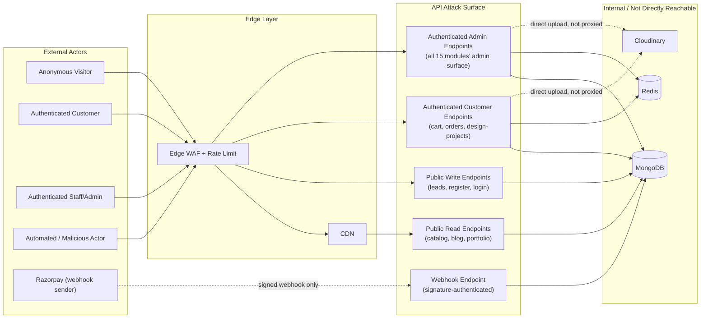
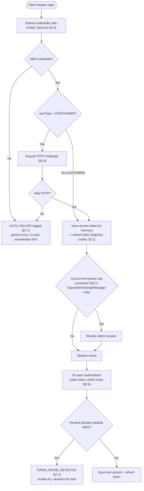
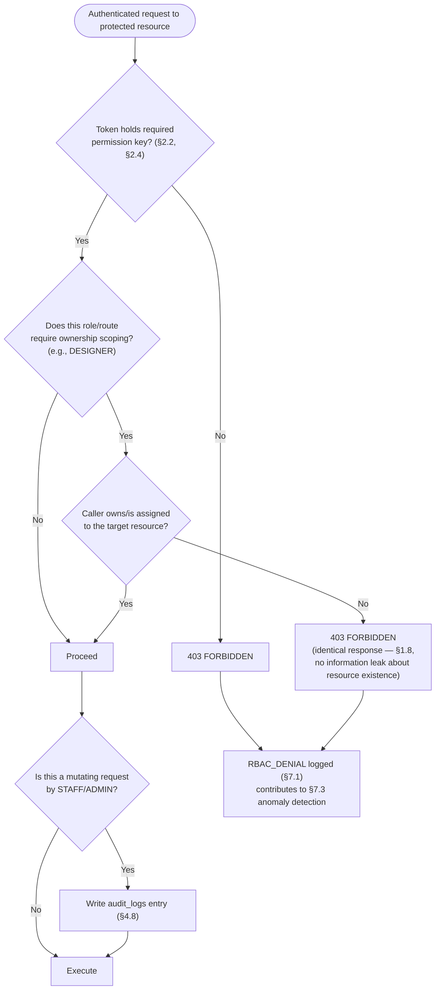
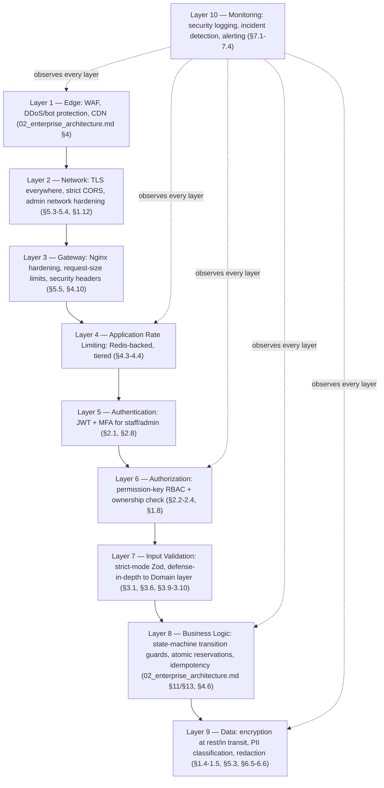
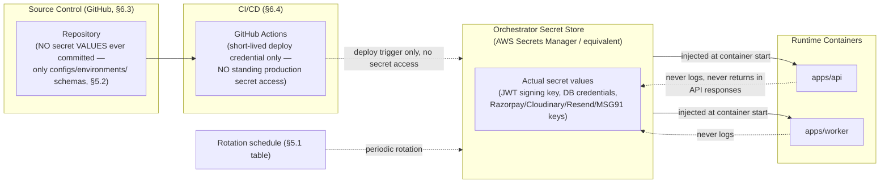
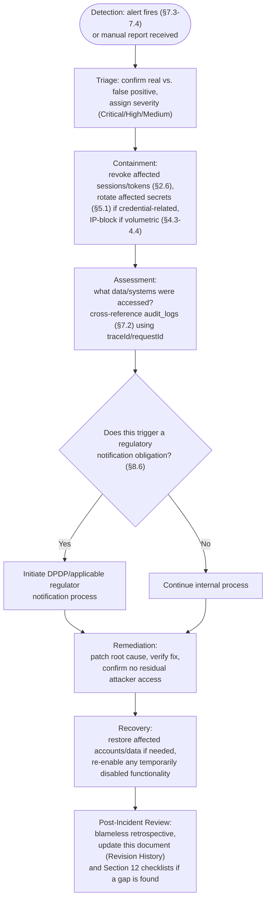

# Enterprise Security Architecture

## National Furniture & Interiors Platform

**Prepared by:** Enterprise Security Review Board (Principal Security Architect, Cloud Security Engineer, OWASP Specialist, Identity & Access Management Architect, DevSecOps Engineer, Principal Backend Architect)
**Date:** 2026-08-07
**Status of `01`–`08`:** APPROVED and LOCKED. Never modified. This document does not redesign business logic, APIs, or repository structure — it designs the security architecture that protects the system those documents already define.
**Scope:** No implementation code — threat models, control designs, diagrams (Mermaid), policy, and checklists only.

---

## Revision History

| Version | Date | Change | Reason |
|---|---|---|---|
| v1.0 | 2026-08-07 | Initial version | — |

---

## 0. Relationship to Locked Documents

This document's job is narrower than it might look: `02_enterprise_architecture.md` §9/§14/§16, `03_database_design.md` §3/§9.8.2, and `08_api_architecture.md` §4 already contain real security decisions — MFA, permission-key RBAC, JWT scheme, audit-log redaction, rate-limit tiers, CAPTCHA, CSRF/CORS posture, OWASP API Top 10 mapping. Restating those as if inventing them here would misrepresent how much security work is already done and locked. This document instead:

1. **Confirms and cross-references** every security decision already made in `01`–`08`, rather than re-deriving it.
2. **Fills the gaps `08_api_architecture.md` §15 named as open** (Sections 3.7 SSRF, 3.9 Prototype Pollution, and the full infrastructure/cloud/compliance layers `08` never covered because it scoped itself to the API contract only).
3. **Adds the layers no prior document owned**: infrastructure hardening (Section 5), cloud-provider-specific security (Section 6), security monitoring/incident response (Section 7), and formal compliance posture (Section 8) — none of `01`–`08` had "infrastructure security" or "compliance" as an explicit section.
4. **Synthesizes a threat model and defense-in-depth view** (Section 9) across the whole system — something no single prior document could do, since each was scoped to one architectural concern.

Where this document and a prior one describe the same control (e.g., MFA), the prior document is the source of truth for *what* the control is; this document adds *why it matters from a threat-model perspective*, *what residual risk remains after it*, and *how its failure would be detected*.

---

## 1. Analysis

### 1.1 Business Risks

Drawn from `01_business_research.md`'s risk register and re-read through a security lens:

| Business risk (`01_business_research.md` §9) | Security-architecture consequence |
|---|---|
| Platform handles PII across three converging business lines (eCommerce customers, design-project clients, leads) | Data classification (Section 1.4) must span all three, not just the eCommerce data most furniture-platform security models default to |
| High-value interior-design transactions (large deposits, multi-month engagements) make design-project clients an attractive fraud/social-engineering target | Section 1.14's dedicated threat model for the Interior Design module, distinct from generic eCommerce fraud controls |
| WhatsApp Business API / SMS provider policy or pricing changes (named risk, `01_business_research.md` §9) | Not a security risk per se, but the consent-tracking control built to address it (`02_enterprise_architecture.md` §10 v1.1) is itself a privacy control this document inherits (Section 8.6) |
| DPDP Act (India) / TRAI compliance on marketing communications (named risk) | Section 8.4/8.6 treat this as the operative privacy regime for this platform — GDPR readiness (Section 8.4) is evaluated as a **posture for future international expansion**, not the currently-binding regime |
| Physical goods + payment + installation/return logistics (unlike a pure digital-goods platform) | Widens the attack surface to include appointment-scheduling and return/refund flows (Section 1.11), not just checkout |

### 1.2 Threat Model (STRIDE, per major flow)

Applied to the flows already diagrammed in `02_enterprise_architecture.md` §9–§13, §20 and `08_api_architecture.md` §7 — this is a new analytical pass over existing, unmodified flows, not a redesign of them.

| Flow | Spoofing | Tampering | Repudiation | Information Disclosure | Denial of Service | Elevation of Privilege |
|---|---|---|---|---|---|---|
| Authentication (`02_enterprise_architecture.md` §9) | Credential stuffing, session-token theft (XSS) | Refresh-token replay after logout | User denies performing an action from a shared/family device | Token leaked via referrer header, browser history (query-string token) | Login-endpoint brute force / credential-stuffing flood | Privilege escalation via role-claim tampering if JWT signature isn't verified correctly |
| Lead Generation (`02_enterprise_architecture.md` §10) | Bot-submitted fake leads impersonating real prospects | Submitted lead data manipulated in transit (mitigated by TLS) | A submitted lead is later disputed as never having consented to marketing contact | Lead PII (phone/email/budget) exposed via an unauthenticated admin endpoint misconfiguration | Volumetric bot flood exhausting lead-scoring/notification pipeline capacity | A `CUSTOMER`-role token used to call a `leads.write` admin endpoint |
| Commerce/Checkout (`02_enterprise_architecture.md` §11) | Payment-callback spoofing (client claims payment succeeded) | Client-submitted price/discount tampering | Customer disputes a charge, claims they never completed checkout | Order/payment data (address, amount) exposed cross-account via a missing ownership check | Checkout-endpoint flood exhausting inventory-reservation capacity or Razorpay API quota | A customer accessing another customer's order via ID enumeration |
| Admin (`02_enterprise_architecture.md` §14) | Compromised admin credentials (highest-privilege target on the platform) | Audit-log tampering (mitigated by immutability, `03_database_design.md` §3.1) | An admin denies having performed a destructive action | Bulk data export by a compromised low-privilege staff account | Admin panel targeted for account lockout DoS against legitimate staff | `DESIGNER` role attempting to access another designer's `design_projects` (ownership-check bypass) |
| File Upload (`02_enterprise_architecture.md` §15) | Signed-upload signature reuse/forgery | Malicious file content disguised with a valid image MIME type | An uploaded asset's origin (which user/session uploaded it) is disputed | Signed upload parameters leaked, allowing unauthorized direct Cloudinary writes | Upload-signature endpoint flooded to exhaust Cloudinary API quota | Uploading media and attaching it to an entity the caller doesn't own (mitigated per `08_api_architecture.md` §4.6) |
| Interior Design workflow (`02_enterprise_architecture.md` §13) | Impersonating a client to approve a quotation (e-signature) or a designer to advance a stage | Quotation amount or BOQ tampered with between proposal and approval | A client disputes having approved a quotation they now consider too expensive | Design-project details (property address, budget, photos) exposed to an unauthorized designer | N/A beyond generic API DoS (Section 4.4) | A `DESIGNER` advancing a stage requiring `DESIGN_MANAGER`-level authority (e.g., quotation approval override) |

### 1.3 Attack Surface

Enumerated from every externally-reachable entry point across `02`–`08`, grouped by exposure class:

| Exposure class | Entry points | Primary defenses (cross-referenced) |
|---|---|---|
| **Unauthenticated, public-write** | `POST /leads`, `POST /contact-form-submissions`, `POST /bulk-enquiries`, `POST /auth/register`, `POST /auth/login` | CAPTCHA (§4.7), rate limiting (§4.3), input validation (§3.1), edge WAF (`02_enterprise_architecture.md` §4) |
| **Unauthenticated, public-read** | `GET /products`, `GET /categories`, `GET /blogs`, `GET /portfolios`, `GET /testimonials` | Rate limiting (§4.3), output encoding (§3.2), no PII in these responses by construction |
| **Webhook (server-to-server, signature-authenticated)** | `POST /payments/webhook` (Razorpay) | Signature verification mandatory and non-bypassable (`08_api_architecture.md` §9's per-module table), idempotency (§4.6), Section 6.2 |
| **Authenticated, customer-scoped** | `/cart`, `/orders`, `/design-projects` (own), `/reviews`, `/returns` | JWT + RBAC + ownership check (Section 2.2–2.3), rate limiting (§4.3) |
| **Authenticated, staff/admin-scoped** | `/admin/*` (all 15 modules' admin surface) | JWT + MFA + permission-key RBAC + audit logging (§4.8), admin network hardening (Section 1.12) |
| **Direct-to-third-party (not this API's surface, but still platform attack surface)** | Direct browser → Cloudinary upload, browser → Razorpay Checkout widget | Signed upload constraints (Section 6.1), Razorpay's own PCI-compliant hosted checkout (Section 6.2) |
| **CI/CD and supply chain** | GitHub repository, package registry, container registry, deployment pipeline | Section 5.9–5.10, Section 6.3–6.4 |
| **Infrastructure management plane** | Cloud provider console/API (AWS for `api`/`worker`, Vercel for frontend, per `07_technology_decision_record.md` §19) | Section 6, out of this API's own surface but in the platform's overall attack surface |

### 1.4 Data Classification

Every collection in `03_database_design.md` §4 classified by sensitivity, since no prior document assigned a formal classification tier:

| Tier | Definition | Example collections | Handling requirement |
|---|---|---|---|
| **Tier 1 — Critical/Regulated PII & Secrets** | Data whose exposure creates direct legal, financial, or identity-theft harm | `users` (`passwordHash`, `phone`, `email`), `refresh_tokens`, `otp_verifications`, `password_reset_tokens`, `payments` (`rawWebhookPayload`), `invoices` (`taxDetails.gstNumber`) | Encrypted at rest and in transit (Section 5.3), never logged in plaintext (Section 4.8, `03_database_design.md` §9.8.2's redaction rule), access restricted by permission key, retention governed by Section 8.6 |
| **Tier 2 — Sensitive Business/Personal Data** | Data that is personal or commercially sensitive but not independently identity-compromising | `leads` (contact + budget), `design_projects` (`propertyAddress`, `budgetRange`), `customers` (`lifetimeValue`), `orders` (`shippingAddress`) | Access restricted by permission key + ownership check, transmitted over TLS, audit-logged on admin access |
| **Tier 3 — Internal Operational Data** | Business data with no direct personal-privacy dimension | `inventory`, `inventory_movements`, `warehouses`, `settings`, `outbox` | Standard RBAC, no special handling beyond normal access control |
| **Tier 4 — Public Data** | Data intended for public consumption by design | `products`, `categories`, `blogs`, `portfolios`, `testimonials` (approved), `banners` | No confidentiality control needed; integrity (Section 3.1) is the relevant concern, not disclosure |

### 1.5 PII Inventory

The specific fields across `03_database_design.md` that constitute PII, consolidated here because no single prior document listed them together:

| PII field | Collection | Category |
|---|---|---|
| `fullName`, `email`, `phone` | `users` | Direct identifier |
| `addresses[]` (incl. `geo`) | `users` | Location data |
| `passwordHash` | `users` | Credential (Tier 1, never displayed, redacted in audit logs) |
| `name`, `email`, `phone`, `budgetRange` | `leads` | Direct identifier + inferred financial data |
| `propertyAddress`, `propertyDetails` | `design_projects` | Location + household data |
| `shippingAddress`, `billingAddress` | `orders` | Location data |
| `ipAddress`, `userAgent` | `audit_logs`, `contact_form_submissions` | Device/network identifier |
| `taxDetails.gstNumber` | `invoices` | Business identifier (customer's own GST, where applicable) |
| `marketingConsent` | `leads`, `newsletter_subscribers` | Consent record — itself PII-adjacent (proves what a person agreed to and when) |

This inventory is the concrete basis for Section 8.6's privacy requirements and Section 8.4's GDPR-readiness gap analysis — both would otherwise be abstract without a field-level list to check against.

### 1.6 Payment Flow

Threat-modeled from `02_enterprise_architecture.md` §11's Order Flow and §13's milestone-payment reuse:

- **The platform never touches raw card/UPI/bank credentials at any point** — Razorpay's hosted Checkout widget collects payment details directly; this API only ever sees `gatewayOrderId`/`gatewayPaymentId`/`gatewaySignature` (`03_database_design.md` §9.3.6). This is the single most important payment-security property of the design, and Section 8.5's PCI-DSS scope conclusion depends entirely on it holding.
- **Source of truth is the signature-verified webhook, never the client redirect** (`02_enterprise_architecture.md` §11) — closes the spoofed-client-callback threat from Section 1.2's STRIDE table.
- **Idempotency on the webhook handler** (keyed on `gatewayOrderId`/`gatewayPaymentId`, confirmed in `08_api_architecture.md` §9) prevents Razorpay's at-least-once webhook delivery from double-fulfilling an order — a replay-attack-adjacent concern (Section 4.5) specific to this flow.
- **Refunds** (`02_enterprise_architecture.md` §20 Return Flow) follow the identical signature-verified, webhook-confirmed pattern — no separate, less-scrutinized refund code path exists that could be a weaker target.

### 1.7 Authentication

Threat-modeled from `02_enterprise_architecture.md` §9.1 and `08_api_architecture.md` §4.1–4.2: the access-token-in-memory / refresh-token-in-httpOnly-cookie split (Section 2.1) is specifically designed against the two most common token-theft vectors — XSS (mitigated by keeping the long-lived refresh token out of JS-accessible storage) and CSRF (mitigated by `SameSite=Strict`, Section 3.4). The residual risk this doesn't close — a successful XSS attack can still steal the short-lived in-memory access token — is why Section 2.1's short TTL (10–15 min) is a deliberate risk-window limiter, not an arbitrary number.

### 1.8 Authorization

Threat-modeled from `08_api_architecture.md` §4.3's two-stage check: permission key first, ownership predicate second. The specific threat this two-stage design defends against is **Broken Object Level Authorization** (OWASP API1:2023, Section 8.2) — a `DESIGNER` role legitimately holding `design_projects.write` (stage-one pass) must still fail stage two if the target project isn't their own assignment. Section 1.2's STRIDE table names this exact scenario under "Admin" flow Elevation of Privilege.

### 1.9 File Uploads

Threat-modeled beyond `02_enterprise_architecture.md` §15's trust-model split: the direct-to-Cloudinary signed-upload path is safe specifically because (a) the signature is time-boxed and preset-constrained (file type/size) at Cloudinary itself, not just client-side, and (b) `POST /media/confirm` independently re-verifies asset existence and ownership (`08_api_architecture.md` §4.6) before persisting a reference — meaning a forged or guessed `public_id` cannot be attached to an entity the caller doesn't own even if the attacker somehow uploaded content directly to the Cloudinary account. Malware scanning (Section 3.12) is the one control this document adds that no prior document specified.

### 1.10 Lead Generation

The platform's only genuinely **unauthenticated, mutating, public** endpoint family (Section 1.3) — the threat model here is dominated by volumetric/bot abuse rather than targeted exploitation, which is why CAPTCHA (Section 4.7) and the tightest rate-limit tier (Section 4.4) apply specifically here, ahead of both the edge WAF (`02_enterprise_architecture.md` §4) and the application-level limiter.

### 1.11 Commerce

Threat surface spans cart manipulation (mitigated by server-side price re-validation at checkout, `08_api_architecture.md` §1.9), inventory-race exploitation (mitigated by the atomic conditional-update pattern, `02_enterprise_architecture.md` §11), coupon abuse (mitigated by the `coupon_redemptions` per-user-limit enforcement, `03_database_design.md` §9.3.4), and return/refund fraud (mitigated by the inspection-gated refund flow, `02_enterprise_architecture.md` §20 — a refund is never issued purely on request).

### 1.12 Admin

The highest-value target on the platform by privilege level, not by data volume. Controls layered specifically for this surface: mandatory MFA (Section 2.8), non-optional network hardening — VPN/IP-allowlist (`02_enterprise_architecture.md` §8.1 v1.1) — mandatory audit logging on every mutation (Section 4.8), and the permission-key granularity (Section 2.3) that prevents a compromised low-privilege staff account (e.g., `SUPPORT_AGENT`) from reaching high-privilege actions (e.g., `admin.manage_roles`) even if session-hijacked.

### 1.13 Customer Portal

Lower privilege ceiling than Admin, but the larger population of accounts (every customer) makes it the more likely target for **credential-stuffing at scale**, not targeted attack — Section 2.7's password policy and Section 4.3's login-endpoint rate-limit tier are sized for this specific threat shape (high-volume, low-sophistication automated attempts) rather than the low-volume, high-sophistication threat shape Admin defends against.

### 1.14 Interior Design Module

The platform's highest-transaction-value flow (multi-month engagements, milestone payments potentially in the lakhs) and its most socially-engineerable one — a client trusts a named individual designer over an extended relationship, which is a different trust model than an anonymous eCommerce checkout. Controls specific to this: quotation e-signature capture (`02_enterprise_architecture.md` §13, tamper-evidence for the "client disputes approval" threat in Section 1.2), the `DESIGNER`-scoped ownership check (Section 1.8), and optimistic-concurrency `version` checks on `design_projects` (`03_database_design.md` §3) preventing a lost-update race when a designer and a manager edit the same project concurrently.

---

## 2. Identity Architecture

### 2.1 Authentication

Confirms `02_enterprise_architecture.md` §9/§9.1 and `08_api_architecture.md` §4.1 exactly — no change. Restated here as the anchor for this document's threat-model cross-references (Section 1.7): JWT access token (10–15 min TTL, in-memory), refresh token (7–30 day TTL, `httpOnly`/`Secure`/`SameSite=Strict` cookie, hashed in Redis).

### 2.2 Authorization

Confirms `08_api_architecture.md` §4.3's two-stage model (permission key → ownership predicate) exactly. This document's addition: the **fail-closed principle** — any ambiguity in either check (a missing permission-key mapping for a new endpoint, an ownership predicate that can't be evaluated due to a data error) must resolve to `403`, never to allowing access by default. This is stated explicitly here because it's a security *posture*, not a functional API contract detail, and belongs in this document's governance rather than `08`'s.

### 2.3 RBAC

Confirms the role table in `02_enterprise_architecture.md` §14 (`SUPER_ADMIN`, `SALES_MANAGER`, `DESIGN_MANAGER`, `DESIGNER`, `CATALOG_MANAGER`, `SUPPORT_AGENT`, `CUSTOMER`) and the permission-key enforcement mechanism (`03_database_design.md` §9.1.2–9.1.3). No new role is introduced. This document's addition: a **least-privilege review cadence** — every role's granted permission-key set should be reviewed quarterly against actual usage (a role holding an unused permission key is a standing risk with no offsetting benefit), tracked as an operational practice in Section 13's Security Review Checklist rather than a one-time design decision.

### 2.4 Permission Model

Confirms `<module>.<action>` permission keys (`08_api_architecture.md` §3.16). This document's addition: a **permission-key taxonomy rule** — every key must be one of `read`, `read_self`, `write`, `write_self`, a named domain action (`refund`, `assign`, `approve_quotation`, `manage_roles`), or `moderate`; no permission key is ever granted as a bare module name (`orders` instead of `orders.read`) — coarse, module-wide grants are exactly the ambiguity `02_enterprise_architecture.md` §14's v1.1 remediation (finding S2) eliminated, and this rule prevents it from being silently reintroduced as new modules/endpoints are added.

### 2.5 Session Strategy

Confirms the stateless-access-token / server-tracked-refresh-token hybrid (Section 2.1). This document's addition — the **concurrent session policy**: a user may hold multiple valid refresh tokens simultaneously (one per device, per `03_database_design.md` §9.1.4's `deviceInfo` field), but `SUPER_ADMIN` and `DESIGN_MANAGER` roles are **capped at 3 concurrent sessions**, with the oldest session force-revoked on a 4th login — a targeted control for the highest-privilege roles (Section 1.12) that ordinary `CUSTOMER` sessions don't need.

### 2.6 Refresh Token Rotation

Confirms `02_enterprise_architecture.md` §9.1 exactly: rotated on every use, reuse of an already-rotated token treated as a compromise signal triggering revocation of all sessions for that user. This document's addition — the **detection-to-response mapping**: a detected reuse event is not just silently handled (revoke + reissue) but is also written to `audit_logs` (`actorId` = the affected user, `action` = `TOKEN_REUSE_DETECTED`) and surfaces as a Section 7.3 incident-detection signal, since refresh-token reuse is one of the highest-confidence account-compromise indicators available anywhere in the system.

### 2.7 Password Policy

Not previously specified in `01`–`08` at the policy-parameter level (`02_enterprise_architecture.md` §9.1 named bcrypt hashing but not the password's own strength rule) — specified here for the first time:

| Rule | Requirement |
|---|---|
| Minimum length | 10 characters (not the outdated 8 — length is the dominant factor in password strength) |
| Composition | No mandatory special-character/digit-mix rule (composition rules push users toward predictable substitutions, e.g., `Password1!`, without materially increasing entropy) — instead, checked against... |
| Breach-list check | Every new/changed password checked against a known-breached-password corpus (e.g., via a k-anonymity API pattern) at registration and password-change time; a breached password is rejected with a specific, actionable error, not a generic "weak password" message |
| Maximum length | 128 characters (prevents a DoS vector via extremely long bcrypt input, while comfortably accommodating passphrases) |
| Reuse | Last 5 password hashes retained (hashed, not plaintext) to prevent immediate reuse on a forced reset |
| Staff/Admin accounts | Same base policy, plus mandatory rotation is **not** imposed (time-based rotation is a deprecated practice that encourages predictable incrementing) — compromised-credential detection (Section 2.6, Section 7.3) is the control that matters, not calendar-based rotation |

### 2.8 MFA Strategy

Confirms `02_enterprise_architecture.md` §9.1 (v1.1, TOTP, mandatory for `STAFF`/`ADMIN`, not required for `CUSTOMER`) and `07_technology_decision_record.md` §6.3's rationale (SMS-OTP-only rejected due to delivery-reliability/interception concerns). This document's addition — the **account-recovery procedure for a lost MFA device**, explicitly named as an open item in `07_technology_decision_record.md` §23 and closed here: a staff member who loses their TOTP device must go through **identity re-verification by a `SUPER_ADMIN`** (out-of-band confirmation — not a self-service reset, since self-service MFA reset is a well-known bypass vector), which re-issues a new TOTP enrollment and immediately invalidates the old one; the re-verification event itself is audit-logged (Section 4.8).

### 2.9 Account Recovery

For `CUSTOMER` accounts: standard `password_reset_tokens` flow (`03_database_design.md` §9.1.6) — a time-boxed (e.g., 30-minute TTL, enforced via the collection's existing TTL index), single-use, emailed reset link. The reset endpoint is in the Strict rate-limit tier (`08_api_architecture.md` §4.4) to prevent enumeration/abuse. A successful password reset **revokes every existing refresh token** for that user (forces re-login on all devices) — a deliberate, security-motivated side effect of recovery, since a password reset is frequently itself a response to suspected compromise, and leaving old sessions alive would undermine the reset's purpose.

For `STAFF`/`ADMIN` accounts: identical password-reset flow, **plus** the MFA re-verification procedure (Section 2.8) if MFA enrollment is also being reset — the two recovery paths (password vs. MFA) are independent and a compromise of one does not automatically grant the other.

### 2.10 Device Management

Not previously specified — new in this document, closing a gap the Section 2.5 concurrent-session policy implies but doesn't fully specify. `refresh_tokens.deviceInfo` (`03_database_design.md` §9.1.4) is surfaced to the user as a "manage devices/sessions" view (an admin-panel and future customer-account-page feature, not yet built per Section 15's open items) listing active sessions by device/IP/last-active-time, with a per-session revoke action calling the same refresh-token deletion path as logout (`02_enterprise_architecture.md` §9's sequence). This is the concrete, user-facing mechanism that makes Section 2.6's reuse-detection *response* ("all sessions revoked") something a legitimate user can recover from gracefully rather than being silently locked out with no visibility into why.

---

## 3. Application Security

### 3.1 Input Validation

Confirms `08_api_architecture.md` §3.12/§4.5: Zod, strict-mode, at every Presentation-layer boundary, defense-in-depth re-checked in the Domain layer. No change; this document's addition is scoping input validation as the **first line of defense** against every threat in Sections 3.6–3.9 below (NoSQL injection, SSRF, command injection, prototype pollution) — those sections describe *why* strict-mode, primitive-typed validation is the specific mechanism that closes each of those threat classes, not a restatement of the validation mechanism itself.

### 3.2 Output Encoding

Not previously specified in `01`–`08` — new here. Every field returned in an API response that could plausibly contain user-supplied content (`leads.notes`, `reviews.content`, `testimonials.content`, `design_projects.stageHistory[].note`) is returned as **raw, unescaped text in the JSON payload** — encoding/escaping for display is the **frontend's** responsibility at render time (React's default JSX text-node escaping, which auto-escapes by construction unless a developer explicitly opts out via `dangerouslySetInnerHTML`), not this API's. This document's contribution is the explicit rule: **no `dangerouslySetInnerHTML`-equivalent rendering of API-sourced content anywhere in `storefront`/`admin`** except the one deliberate, sanitized exception below (`blogs.content`), which is a secure-coding rule (Section 11) enforced at code-review time, not an API-layer control.

### 3.3 XSS Protection

Layered, not single-point:

1. **React's default escaping** (Section 3.2) is the primary control for every field except rich-text content.
2. **`blogs.content`** (`03_database_design.md` §9.6.1, stored as HTML/rich-text) is the one field platform-wide that legitimately needs to render as HTML — it is sanitized server-side (allow-listed tag/attribute set, e.g., via a DOMPurify-equivalent) **on write**, not trusted as pre-sanitized on read, and re-sanitized on read as defense-in-depth in case the write-time sanitizer is ever bypassed or its rule set changes.
3. **`Content-Security-Policy` header** (`02_enterprise_architecture.md` §16's Helmet defaults, tuned for Cloudinary/Razorpay script/frame sources) is the browser-enforced backstop — even if a stored-XSS payload somehow reached the DOM, a correctly scoped CSP blocks inline script execution and unauthorized script-source loading.
4. **`httpOnly` refresh-token cookie** (Section 2.1) means a successful XSS cannot exfiltrate the long-lived credential even in the worst case — only the short-lived access token is exposed, bounding the damage window (Section 1.7).

### 3.4 CSRF Protection

Confirms `08_api_architecture.md` §4.9 exactly: `SameSite=Strict` on the refresh cookie plus header-based Bearer auth for every other endpoint is the complete control — no separate CSRF token is issued. This document's addition: the one place this reasoning must be re-verified rather than assumed is **any future endpoint that accepts a cookie-based credential outside the single `/auth/refresh` path** (Section 4.2's scoped-cookie rule) — the moment a second cookie-authenticated endpoint is added, the "header-auth-everywhere-else" argument for skipping a CSRF token no longer covers it, and that addition would require a fresh CSRF-specific control, not an assumption that the existing posture still applies.

### 3.5 CORS

Confirms `08_api_architecture.md` §4.8 exactly: strict origin allow-list (`storefront`, `admin` per environment), credentialed only for those exact origins, no wildcard. No change.

### 3.6 NoSQL Injection Protection

Confirms `07_technology_decision_record.md` §10.1 and `08_api_architecture.md` §4.5 (v1.1 remediation, finding S3): strict primitive-typed Zod schemas are the primary control, preventing a MongoDB query operator (`{"$gt": ""}`) from being smuggled into a field expected to be a plain string. This document's addition — the **defense-in-depth second layer**: every module's `infrastructure/` repository (`06_project_structure.md` §4.3) constructs Mongoose queries using parameterized query-builder methods (`.find({ field: value })`) exclusively — **string-concatenated or dynamically-constructed query objects built from raw request input are a prohibited pattern**, enforced as a secure-coding rule (Section 11), not just an assumption that Zod validation alone is sufficient. Two independent layers, consistent with the same defense-in-depth principle already applied to Zod-plus-domain-invariant validation (`02_enterprise_architecture.md` §16).

### 3.7 SSRF

Not covered by any prior document — new here, closing the gap `08_api_architecture.md` §9.3 explicitly flagged as "not directly applicable to the current endpoint set" but worth a standing constraint. **No current endpoint accepts a client-supplied URL that the server then fetches** — this remains true and is the primary control (nothing to exploit). The standing rule for any future endpoint that would (e.g., a hypothetical "import product image from URL" admin feature): any server-side fetch of a client-supplied URL must validate the resolved IP against a deny-list covering private/internal address ranges (RFC 1918, link-local, cloud-metadata endpoints like `169.254.169.254`) **after DNS resolution**, not just check the URL string's hostname — a naive hostname check is bypassable via DNS rebinding, so this is specified precisely rather than left implicit.

### 3.8 Command Injection

No endpoint in `01`–`08`'s locked design shells out to the OS or invokes an external process based on user input (the platform's only "external tool invocation" pattern is HTTP calls to Cloudinary/Razorpay/notification providers, which are SDK-mediated, not shell-mediated). Standing rule: **no module's `infrastructure/` layer invokes `child_process.exec`/`spawn` (or equivalent) with any argument derived from request input**, full stop — if a future requirement genuinely needs OS-level process invocation (e.g., a PDF-generation tool with a CLI interface), the argument list must be a fixed, code-defined array (never a user-supplied string interpolated into a shell command).

### 3.9 Prototype Pollution

Not covered by any prior document — new here. Relevant specifically because the stack is Node.js/TypeScript (`07_technology_decision_record.md` §4.1) with JSON request bodies (`08_api_architecture.md` §3.1). Controls: (1) Zod's strict-mode schemas (Section 3.1) already reject unrecognized keys including `__proto__`/`constructor`/`prototype` at the validation boundary, before any object-merging logic runs; (2) any object-merging utility used anywhere in `apps/api` (e.g., merging a partial-update payload into an existing document) must use a prototype-pollution-safe merge implementation (or `Object.create(null)`-based construction for any object built from raw request keys) — a standing secure-coding rule (Section 11), since this is a class of bug that's easy to reintroduce via a seemingly-unrelated utility-library choice later.

### 3.10 Mass Assignment

Confirms `08_api_architecture.md` §9.3's OWASP API3:2023 mapping: strict-mode Zod schemas are the primary control — a request body cannot smuggle in a `role`, `isDeleted`, `passwordHash`, or `permissionIds` field through an endpoint whose schema doesn't explicitly declare that field as settable. This document's addition — the **explicit-allow-list-per-role rule**: where the *same* endpoint is reachable by multiple roles with different levels of write access to the same resource (e.g., a `CUSTOMER` updating their own `users` profile vs. an `ADMIN` updating any `users` record), the Zod schema itself is **role-parameterized** — the customer-facing schema for `PATCH /users/me` structurally cannot include `status`/`roleId`, while the admin schema for `PATCH /admin/users/:id` can — rather than relying on a single permissive schema plus a runtime check to strip privileged fields, which is a strictly weaker pattern (a missed strip-check is a silent vulnerability; a field absent from the schema entirely cannot be smuggled in regardless of any other code path).

### 3.11 File Upload Security

Confirms `02_enterprise_architecture.md` §15 and `08_api_architecture.md` §4.6 exactly (signed-upload constraints, ownership/existence re-validation on confirm). No change — see Section 3.12 for this document's one addition.

### 3.12 Malware Scanning Strategy

**New — not specified in any prior document.** Applies specifically to the one upload path that accepts content from outside the organization's trusted staff/admin population: `02_enterprise_architecture.md` §15.1 already names "if the platform later accepts user-generated uploads from untrusted customers... route those specific flows through server-proxied upload with virus/content scanning" as the trigger condition. This document specifies the scanning design **for when that trigger is met** (not yet, since no such feature exists in the current locked scope):

- Server-proxied uploads (the untrusted path) are scanned synchronously against a malware-signature engine (e.g., ClamAV or an equivalent managed scanning API) **before** the file is forwarded to Cloudinary — a file failing the scan is rejected with a generic error (never revealing the specific signature matched, which would help an attacker iterate) and logged as a security event (Section 7.3).
- The trusted, direct-to-Cloudinary path (product/portfolio/design-project images, uploaded only by authenticated `STAFF`/`ADMIN`/`DESIGNER` roles) is **not** scanned synchronously — consistent with `02_enterprise_architecture.md` §15.1's explicit trust-model split, scanning every admin-uploaded product photo would add latency with no proportionate risk reduction, since the uploader population is already authenticated and permission-checked, not anonymous.
- This is a deferred-but-designed control (Section 12.2's pattern), not an open question — the design is complete; the implementation trigger is the same "untrusted user-generated upload feature ships" trigger `02_enterprise_architecture.md` §15.1 already named.

---

## 4. API Security

### 4.1 JWT

Confirms Section 2.1/`08_api_architecture.md` §4.1. No change.

### 4.2 Refresh Tokens

Confirms Section 2.6/`08_api_architecture.md` §4.2, including the path-scoped cookie (`Path=/api/v1/auth/refresh`). No change.

### 4.3 Rate Limiting

Confirms `08_api_architecture.md` §4.4's five-tier table exactly (Strict/Public-write/Search/Standard authenticated/Public read). This document's addition — the **layered-limiter interaction rule**: the edge WAF limiter (`02_enterprise_architecture.md` §4) and the application-level Redis limiter (`08_api_architecture.md` §4.4) use **independent, non-shared counters** deliberately — a request that exhausts the edge tier is blocked before ever reaching the app tier's counter, meaning the app-tier limiter's own counters reflect only traffic that already passed the coarser edge check, which is the intended defense-in-depth layering, not a redundancy to be "optimized away."

### 4.4 API Abuse Protection

Beyond rate limiting specifically: **behavioral abuse patterns** not caught by a simple per-IP/per-account request-count limit — e.g., an authenticated account making requests at exactly the rate-limit ceiling continuously (scraping the entire catalog just under the threshold) or systematically enumerating sequential/near-sequential resource IDs (an ID-enumeration attack against `03_database_design.md`'s `ObjectId`s, which are not fully random and encode a creation timestamp). Mitigation: `ObjectId` predictability is a known, accepted property (Section 8.1's ASVS gap analysis notes it) — the actual defense against ID enumeration is not obscuring the ID format but the ownership check (Section 1.8) on every resource read, which makes guessing a valid ID insufficient to access it. Sustained near-threshold scraping is a Section 7.3 monitoring/detection concern (anomalous request-pattern alerting) rather than a hard-block rule, since a legitimate high-usage integration could look similar without being abusive.

### 4.5 Replay Attack Prevention

Two distinct replay scenarios, two distinct controls:

1. **Webhook replay** (Razorpay resending a previously-delivered webhook, whether due to their own retry logic or a malicious actor capturing and resending a valid signed payload): closed by the idempotency check on `gatewayOrderId`/`gatewayPaymentId` (`08_api_architecture.md` §9, Section 1.6) — a repeated valid webhook for an already-processed payment is a no-op, not a re-fulfillment.
2. **General request replay** (a captured, validly-signed request replayed later): mitigated at the transport level by TLS (Section 5.3, preventing capture in the first place) and at the application level by the `Idempotency-Key` mechanism (`08_api_architecture.md` §3.10) for the specific mutating endpoints where replay would cause real harm (checkout, milestone payment, return request) — a replayed request with the same idempotency key returns the original cached response rather than re-executing.

### 4.6 Idempotency Security

Confirms `08_api_architecture.md` §3.10's mechanism (Redis-stored `(key, endpoint, requestHash) → response`, 24-hour window, `409 IDEMPOTENCY_KEY_CONFLICT` on key-reuse-with-different-body). This document's addition — the **idempotency-key entropy requirement**: keys must be client-generated UUIDv4 (already specified in `08_api_architecture.md` §3.15), and the server **never accepts a client-supplied idempotency key shorter than the full UUIDv4 length or matching a predictable pattern** — rejecting low-entropy keys prevents an attacker from deliberately colliding with another user's idempotency key to either suppress their own request (unlikely to be exploitable given keys are scoped per-request, but rejected as a matter of not trusting client-controlled cache-key material without a minimum-entropy floor).

### 4.7 CAPTCHA

Confirms `02_enterprise_architecture.md` §10 (v1.1) and `08_api_architecture.md` §4.7 exactly: invisible-challenge CAPTCHA on `POST /leads`, server-side verification mandatory, failed-CAPTCHA submissions flagged for manual review rather than dropped. No change.

### 4.8 Audit Logging

Confirms `02_enterprise_architecture.md` §14, `03_database_design.md` §9.8.2's redaction rule, and `08_api_architecture.md` §4.11 exactly: every mutating `STAFF`/`ADMIN` endpoint writes to `audit_logs`, immutable, `passwordHash`/token-hash fields redacted to `[REDACTED]`. This document's addition — the **security-event-specific audit entries** that supplement ordinary CRUD auditing: `TOKEN_REUSE_DETECTED` (Section 2.6), `MFA_RECOVERY_INITIATED` (Section 2.8), `CAPTCHA_FAILED_MANUAL_REVIEW` (Section 4.7), and `RATE_LIMIT_EXCEEDED` (repeated, per-account) are all written as distinct `action` values in the same `audit_logs` collection — not a separate security-log store, since `03_database_design.md`'s existing immutable, indexed, append-only design already satisfies what a dedicated security-event log would need, and a second store would just fragment the audit trail Section 7.2 needs to be complete.

### 4.9 Request Validation

Confirms Section 3.1/`08_api_architecture.md` §3.12. No change.

### 4.10 Response Hardening

Confirms `08_api_architecture.md` §3.3's safe-error-message rule and Section 3.2's output-encoding split. This document's addition — the **security response headers** applied to every API response, not just error responses: `X-Content-Type-Options: nosniff` (prevents MIME-sniffing-based XSS), `X-Frame-Options: DENY` (the API itself is never meant to be framed — the frontend apps handle their own framing policy separately), `Strict-Transport-Security` (Section 5.3), and explicit omission of any `Server`/`X-Powered-By` header revealing the Express/Node version (a standard information-disclosure-reduction practice, closing the reconnaissance value of a default header most frameworks emit unless explicitly suppressed).

---

## 5. Infrastructure Security

### 5.1 Secrets Management

Confirms `02_enterprise_architecture.md` §16, `05_repository_strategy.md` §11, and `06_project_structure.md` §7.4's repeated "never in the repository" rule exactly: secrets are injected via the orchestrator's secret store (AWS Secrets Manager or equivalent, given the ECS Fargate deployment target per `07_technology_decision_record.md` §19.2) at deploy time, never committed, never baked into container images. This document's addition — the **secrets-rotation cadence**, named as an open item in `07_technology_decision_record.md` §23 and closed here:

| Secret class | Rotation cadence | Trigger for out-of-cycle rotation |
|---|---|---|
| JWT signing secret | Every 90 days | Suspected compromise, staff member with access offboarded |
| Database credentials | Every 90 days | Suspected compromise |
| Razorpay/Cloudinary API keys | Per vendor's own rotation support (typically manual, coordinated) | Vendor-reported incident, key exposure |
| Notification provider (Resend/MSG91) API keys | Every 180 days | Suspected compromise |
| CI/CD deploy credentials | Every 90 days | Any CI/CD platform security advisory affecting this platform's account |

A JWT-signing-secret rotation specifically requires a **grace-period dual-key verification window** (old key still accepted for verification, new key used for issuance, for the maximum access-token TTL after rotation) so in-flight access tokens signed with the old key aren't instantly invalidated mid-rotation — a rotation mechanic, not just a schedule.

### 5.2 Environment Variables

Confirms `06_project_structure.md` §2.3/§7.4: `configs/environments/` holds schemas and non-secret defaults only; actual staging/production values are never committed. This document's addition: every environment-variable **schema** (not value) explicitly marks each variable as `secret` or `non-secret` at definition time — this is what lets `core/config`'s boot-time validation (`06_project_structure.md` §4.2, fail-fast on missing required values) also fail-fast if a variable marked `secret` is ever detected being sourced from a non-secret-store location (e.g., a plain `.env` file in a production build) — a structural check, not just a policy statement.

### 5.3 TLS

TLS 1.2 minimum, TLS 1.3 preferred, terminated at Nginx (`02_enterprise_architecture.md` §8.1/§8.2) for the `api`/`storefront`/`admin` containers, and at Vercel's own edge for the two Next.js apps' Vercel-hosted deployment (`07_technology_decision_record.md` §19.1) — two different termination points for the two different deployment targets already locked, not a new decision, just made explicit here. Certificate management via the orchestrator's/CDN's managed-certificate mechanism (auto-renewal), never a manually-tracked expiry date. Internal service-to-service traffic (API containers → MongoDB Atlas, API containers → Redis) also uses TLS, since `03_database_design.md` §14's managed-Atlas/managed-Redis deployment targets both support and default to encrypted connections.

### 5.4 HTTPS

HTTP → HTTPS redirect enforced at Nginx/CDN; `Strict-Transport-Security` header (Section 4.10) with a long `max-age` and `includeSubDomains` sent on every response, so a browser that has ever successfully connected over HTTPS refuses to downgrade to HTTP even if a future request is somehow directed there (protects against SSL-stripping on subsequent visits).

### 5.5 Nginx Hardening

Beyond TLS termination (already locked, `02_enterprise_architecture.md` §8.1): server-tokens disabled (no Nginx version disclosure in headers/error pages), request-body size limits enforced at Nginx (backstopping Section 3.11's file-upload constraints and Section 4.4's DoS mitigation before a request even reaches the Express app), and the specific security response headers from Section 4.10 set at the Nginx layer as a baseline (so they apply even to responses Express doesn't explicitly construct, like static error pages) with the application layer able to add more specific headers on top.

### 5.6 Docker Security

Every image in `docker/apps/` (`06_project_structure.md` §7.1) built from a **minimal base image** (e.g., `node:XX-alpine` or distroless-equivalent, per `07_technology_decision_record.md` §4.1's Node.js LTS policy) — smaller base images mean a smaller package surface for known-CVE exposure (Section 5.9). Containers run as a **non-root user** by default (a `USER` directive in every Dockerfile, not the image's default root user) — limits the blast radius of a container-escape vulnerability. Multi-stage builds (already the stated pattern in `06_project_structure.md` §7.1) ensure build-time dependencies and source (including any `.env.example` or dev-only tooling) never ship in the final runtime image.

### 5.7 Container Isolation

Each of the four deployable containers (`storefront`, `admin`, `api`, `worker`, per `02_enterprise_architecture.md` §8.1) runs with the minimum IAM/network permissions its role requires — `worker` has queue-consumer and database-write access but no reason to hold any Razorpay-webhook-verification-relevant secret it doesn't call; `storefront`/`admin` (both Vercel-hosted) have **no database credentials at all** (already locked, `06_project_structure.md` §1.7 — "never talk to MongoDB directly"), which this document confirms as a security property, not just an architectural one: even a fully compromised frontend container/deployment cannot reach the database directly, only through the same authenticated, rate-limited, RBAC-checked API surface any other client would use.

### 5.8 Image Scanning

Every container image is scanned for known-CVE vulnerabilities in its OS packages and application dependencies **as a CI gate** (`.github/workflows/`, `06_project_structure.md` §7.3), before the image is pushed to the container registry — a build with a Critical or High severity finding in a fixable (patched-version-available) dependency fails the pipeline, consistent with `07_technology_decision_record.md` §1.1's stated exception ("a critical CVE affecting a direct dependency is patched out-of-cycle, immediately") now enforced as an automated gate rather than a manual-discipline expectation.

### 5.9 Dependency Scanning

Confirms and operationalizes `02_enterprise_architecture.md` §17's "dependency vulnerability scan" checklist item and `07_technology_decision_record.md` §1.1's version policy: automated dependency scanning (e.g., `npm audit`-equivalent or Dependabot/Renovate's own security-advisory integration, per `07_technology_decision_record.md` §1.1's named tooling options) runs on every PR and on a daily schedule against the default branch — a PR introducing a new dependency with a known Critical vulnerability fails CI; a vulnerability discovered in an already-merged dependency raises an automated PR for the patched version, triaged per the out-of-cycle exception in Section 5.1's rotation table's spirit (security patches don't wait for the normal batch cadence).

### 5.10 Supply Chain Security

Beyond scanning already-known dependencies (Section 5.9): `pnpm`'s strict, non-hoisted `node_modules` (`07_technology_decision_record.md` §20.4, `05_repository_strategy.md` §13) is itself a supply-chain-security property, not just a monorepo-hygiene one — it prevents a package from accessing a dependency it didn't explicitly declare (phantom-dependency access), which is a known vector for supply-chain attacks exploiting hoisting. `pnpm-lock.yaml` is committed and CI-verified as unmodified between install and build (`--frozen-lockfile`-equivalent enforcement) — a build never silently resolves to a different dependency version than what was reviewed and locked. New dependencies added to any `package.json` require the standard PR review (`05_repository_strategy.md` §15's CODEOWNERS gating) — no dependency is added without at least one reviewer seeing the diff.

---

## 6. Cloud Security

### 6.1 Cloudinary Security

Confirms `02_enterprise_architecture.md` §15 and `07_technology_decision_record.md` §8.1 exactly (signed uploads, preset constraints, API secret never client-exposed). This document's addition: the Cloudinary account's own access-control settings (API key restricted to the specific upload-preset operations this platform actually uses, not full account-management scope) follow the same least-privilege principle already applied to internal RBAC (Section 2.3) — a compromised signed-upload flow should not, as a side effect, grant broader Cloudinary account access than "upload to this preset" requires.

### 6.2 Razorpay Security

Confirms `02_enterprise_architecture.md` §11's webhook-signature-verification requirement exactly. This document's addition, closing the item flagged but not implemented in `07_technology_decision_record.md` §9.1: **IP-allowlisting the webhook endpoint** to Razorpay's published source IP ranges, at the Nginx/edge layer, as defense-in-depth ahead of signature verification — a request from outside Razorpay's known ranges is rejected before signature verification even runs, reducing the attack surface available to brute-force a valid signature (still cryptographically infeasible, but layered defense is the governing principle throughout this document). Razorpay API keys held only in `apps/api`'s secret store (Section 5.1), scoped to the minimum Razorpay API permission set the `payments` module actually calls.

### 6.3 GitHub Security

The source-of-truth repository (`05_repository_strategy.md`, `06_project_structure.md` §7.3's `.github/`) — not previously covered by any prior document's security section. Controls: branch protection on the default branch (no direct push, PR required, at least one CODEOWNERS-matched approval, all CI checks including Sections 5.8–5.9's scans passing before merge); mandatory 2FA for every organization member with write access; repository secrets (used only for CI/CD purposes, distinct from runtime application secrets in Section 5.1) scoped per-environment and never printed to CI logs; dependency-review and secret-scanning platform features enabled on the repository itself (catching a credential accidentally committed before it reaches history permanently, complementing but not replacing the "never commit secrets" discipline already established throughout `01`–`08`).

### 6.4 CI/CD Security

Confirms the GitHub Actions pipeline shape from `05_repository_strategy.md` §15 and `07_technology_decision_record.md` §18.1. This document's addition: CI runners never have standing access to production secrets — deploy-time secret injection (Section 5.1) happens at the orchestrator level, not by the CI pipeline holding and forwarding production credentials; the pipeline's deploy step authenticates to the deployment target (AWS ECS, Vercel) via a short-lived, narrowly-scoped deploy credential (Section 5.1's rotation table), not a long-lived static key with broad account access. Every deploy is traceable to a specific commit SHA (already the established image-tagging convention, `07_technology_decision_record.md` §1.2), which is itself a security property: a rollback or an incident investigation (Section 9.7) can always identify exactly which code was running at a given time.

### 6.5 Backup Security

Confirms `06_project_structure.md` §7.4 ("actual backup data is never in the repository — lives in managed cloud storage") and `03_database_design.md` §14's replica-set/backup posture. This document's addition: MongoDB backups (whether Atlas-managed or self-managed per `02_enterprise_architecture.md` §8.2) are encrypted at rest using the same or stronger standard as the primary datastore, access-restricted to the same least-privilege principle as production database credentials (a backup is a full copy of Tier 1 PII, Section 1.4 — it is not a lower-security-bar artifact just because it's not the "live" database), and restore procedures are periodically tested (already a `02_enterprise_architecture.md` §17 checklist item — "tested restore procedure") specifically **including a test that a restored backup doesn't silently restore into a network-reachable state before access controls are reapplied**.

### 6.6 Storage Security

Covers the two storage classes the platform uses: MongoDB (Section 5.3's encryption-in-transit, Section 6.5's backup encryption, and encryption-at-rest via the managed Atlas/cloud-provider default) and Cloudinary media (Section 6.1's upload-path security; stored media itself is not independently encrypted beyond Cloudinary's own platform-level storage security, since none of the media types in `03_database_design.md` — product photos, portfolio images, design-project renders — are Tier 1 classified (Section 1.4); this is a deliberate, risk-proportionate distinction, not an oversight).

---

## 7. Monitoring

### 7.1 Security Logging

Confirms `02_enterprise_architecture.md` §16's structured (Pino) logging with correlation IDs. This document's addition: a defined **security-relevant log-event taxonomy**, distinct from ordinary application logs, so security monitoring (Section 7.3) can be built against a known, stable set of event types rather than free-text log parsing: `AUTH_FAILURE`, `AUTH_SUCCESS` (for staff/admin only — customer login success is not independently security-log-worthy at this volume), `TOKEN_REUSE_DETECTED` (Section 2.6), `RBAC_DENIAL` (a `403` from either check in Section 2.2), `RATE_LIMIT_EXCEEDED`, `CAPTCHA_FAILED`, `WEBHOOK_SIGNATURE_INVALID`, `MFA_RECOVERY_INITIATED`. All of these already exist as either audit-log entries (Section 4.8) or would naturally occur as structured log lines from the middleware already locked in `08_api_architecture.md` §7.4's Request Lifecycle diagram — this section is the taxonomy that turns already-emitted signals into a monitorable set, not a new logging mechanism.

### 7.2 Audit Trail

Confirms `03_database_design.md` §9.8.2/`08_api_architecture.md` §4.11 exactly. This document's addition: the audit trail's **completeness property** — every one of Section 7.1's security-event types that involves a specific actor and resource is written to `audit_logs` (not just generic mutating CRUD actions), so the audit trail and the security-event taxonomy are the same underlying data viewed two ways, not two separate, potentially-inconsistent records of "what happened."

### 7.3 Incident Detection

New — no prior document specified detection logic. Baseline detection rules, each mapped to a Section 7.1 event type and each producing a Section 7.4 alert:

| Detection rule | Signal | Severity |
|---|---|---|
| Credential-stuffing pattern | >20 `AUTH_FAILURE` events across distinct accounts from the same IP within 5 minutes | High |
| Account-targeted brute force | >10 `AUTH_FAILURE` events for the same account within 15 minutes | High |
| Refresh-token compromise | Any `TOKEN_REUSE_DETECTED` event | Critical |
| Privilege-boundary probing | >5 `RBAC_DENIAL` events for the same account within 10 minutes | Medium |
| Webhook forgery attempt | Any `WEBHOOK_SIGNATURE_INVALID` event | High |
| Sustained near-threshold scraping | Account/IP consistently within 90–100% of its rate-limit ceiling for >30 minutes (Section 4.4) | Medium |
| Anomalous admin data access | An `ADMIN`/`STAFF` account's `EXPORT`-type `audit_logs` action outside that account's normal usage pattern (volume or time-of-day anomaly) | Medium |

### 7.4 Alerting

Confirms `07_technology_decision_record.md` §16's Grafana-stack/Sentry monitoring choice as the delivery mechanism — Section 7.3's detection rules are implemented as alert rules within that already-chosen stack (Grafana alerting on log-derived metrics, or Sentry for application-error-adjacent security exceptions), not a new, separate alerting tool. `Critical`-severity detections (Section 7.3) page on-call immediately; `High` alerts the security/platform channel within minutes; `Medium` aggregates into a daily digest reviewed by the DevSecOps function — a severity-tiered response model consistent with the same tiered-response discipline `02_enterprise_architecture.md` §17's production-readiness checklist already applies to general operational alerting.

### 7.5 SIEM Integration (Future)

**Not implemented now** — named and scoped as a deferred, trigger-based decision (consistent with the deferral pattern used throughout `04`/`07`/`08`): the structured Section 7.1 event taxonomy and the `audit_logs` collection are both already SIEM-ingestible by design (structured JSON logs, a queryable append-only Mongo collection) without requiring any redesign when the trigger is met. **Trigger:** the team adopts a dedicated SIEM (e.g., when compliance requirements in Section 8 mature past the current DPDP-Act-focused posture, or when security-event volume outgrows Section 7.4's Grafana-alerting-based approach) — at that point, Section 7.1's log stream and `audit_logs` change data are forwarded to the SIEM as an additional consumer, not a replacement for the existing logging/audit mechanisms.

---

## 8. Compliance

### 8.1 OWASP ASVS

Self-assessed against ASVS (Application Security Verification Standard) Level 2 (appropriate for a platform handling financial transactions and PII, per Section 1.4's Tier 1/2 classification — Level 1 would be insufficient given payment handling; Level 3 is generally reserved for the highest-assurance contexts like critical infrastructure, which this platform is not):

| ASVS category | Status | Where addressed |
|---|---|---|
| V2 — Authentication | Met | Section 2.1, 2.6–2.9 |
| V3 — Session Management | Met | Section 2.5–2.6 |
| V4 — Access Control | Met | Section 2.2–2.4, 1.8 |
| V5 — Validation, Sanitization, Encoding | Met | Section 3.1–3.2, 3.6, 3.9–3.10 |
| V7 — Error Handling and Logging | Met | `08_api_architecture.md` §3.3, Section 4.8, 7.1–7.2 |
| V8 — Data Protection | Met | Section 1.4–1.5, 5.3, 6.5–6.6 |
| V9 — Communications | Met | Section 5.3–5.4 |
| V10 — Malicious Code | Partially met | Section 5.8–5.10 (dependency/image scanning) cover known-vulnerability supply-chain risk; no dedicated static-analysis-for-intentionally-malicious-code control beyond standard code review — acceptable residual risk given the small, known internal engineering team (Section 1.4's threat model doesn't include a malicious-insider-developer scenario as a priority risk at current team scale) |
| V12 — File and Resources | Met | Section 3.11–3.12, `02_enterprise_architecture.md` §15 |
| V13 — API and Web Service | Met | Section 4, `08_api_architecture.md` §4 and §9.3 |
| V14 — Configuration | Met | Section 5.1–5.2, 5.5–5.7 |

### 8.2 OWASP API Top 10

Confirms `08_api_architecture.md` §9.3's mapping table in full (API1 through API10) — not restated here to avoid duplication; see `08_api_architecture.md` §9.3. This document's contribution beyond that table: API7 (SSRF) and API3 (Mass Assignment) receive additional depth in Section 3.7 and Section 3.10 respectively, since `08_api_architecture.md` scoped those two rows more briefly than this document's application-security-focused lens allows.

### 8.3 OWASP Web Top 10

Applies specifically to the two Next.js frontend applications (`storefront`, `admin`), a surface `08_api_architecture.md` didn't cover since it scoped itself to the API contract:

| Risk | Status | Where addressed |
|---|---|---|
| A01 Broken Access Control | Met | Frontend route guards (`middleware.ts`, `06_project_structure.md` §3.2) are a UX convenience, never the actual authorization boundary — every protected action still requires the API-layer check (Section 2.2); this is stated explicitly because it's a common frontend-security misconception worth foreclosing |
| A02 Cryptographic Failures | Met | No cryptographic operation happens client-side beyond what the browser/TLS stack and Razorpay's own hosted Checkout widget handle — this platform's frontends hold no keys, perform no client-side encryption of sensitive data |
| A03 Injection | Met | React's default escaping (Section 3.3); no server-side template rendering in the frontend beyond React itself |
| A05 Security Misconfiguration | Met | Section 4.10's headers (applied at Nginx/Vercel edge, covering frontend responses too), CSP tuned per `02_enterprise_architecture.md` §16 |
| A07 Identification and Authentication Failures | Met | Section 2.1's in-memory access token, `httpOnly` refresh cookie — the frontend never persists a long-lived credential in `localStorage`/`sessionStorage` (explicitly prohibited, consistent with the artifact-development restriction noted platform-wide) |

### 8.4 GDPR Readiness

**Not the currently-binding regime** (Section 1.1 — DPDP Act/TRAI is), but assessed as a **readiness posture** given `01_business_research.md`'s Phase 3 multi-region-expansion roadmap could bring EU-resident data subjects into scope later:

| GDPR principle | Current posture | Gap |
|---|---|---|
| Lawful basis / consent | `marketingConsent` object (`03_database_design.md` §9.5.1, v1.1) captures explicit, timestamped, per-channel consent | Sufficient for DPDP; GDPR would additionally require consent to be as easy to withdraw as to give — the withdrawal path exists conceptually (unsubscribe/consent-toggle) but isn't yet a dedicated, self-service API endpoint in `08_api_architecture.md`'s locked surface (Section 15 open item) |
| Right to erasure | Soft-delete (`03_database_design.md` §3.1) plus a noted-but-not-yet-built "true hard-delete/anonymization path... for verified erasure requests" (`03_database_design.md` §15) | Gap — this is an explicit open item inherited from `03_database_design.md`, not newly discovered here; flagged again in Section 15 |
| Right to data portability | No dedicated export-my-data endpoint exists yet | Gap — not required under DPDP as strictly as under GDPR; deferred consistent with the not-yet-binding-regime framing |
| Data Protection Impact Assessment | Not formally conducted (this document's Section 1 threat model is a substantial input to one, but is not itself a formal DPIA) | Gap — recommended before any EU-market launch, not before India-market launch |
| Data Processing Agreements with sub-processors | Not confirmed in any prior document for Cloudinary/Razorpay/Resend/MSG91 | Gap — a legal/procurement task, not an architecture one, but flagged here since it's a genuine GDPR-readiness blocker |

**Conclusion:** the platform's *architecture* (consent tracking, redaction, soft-delete) is meaningfully GDPR-readiness-compatible already, because the DPDP-Act-driven controls built for the current market substantially overlap with GDPR's requirements — but full GDPR compliance is not claimed or required today, and the gaps above are named explicitly rather than glossed over.

### 8.5 PCI DSS Scope

Confirms `03_database_design.md` §16's conclusion, now formally assessed: the platform stores **only** Razorpay references (`gatewayOrderId`, `gatewayPaymentId`, `gatewaySignature`, `rawWebhookPayload` — which itself contains no raw PAN/card data, only Razorpay's own tokenized/reference payload per Section 1.6) — no primary account number, CVV, or full magnetic-stripe/chip data ever transits or is stored by this platform's own infrastructure at any point, since Razorpay's hosted Checkout widget collects payment details directly on Razorpay's own PCI-DSS-compliant infrastructure. **This keeps the platform's own systems out of PCI-DSS scope under the SAQ A (or SAQ A-EP, depending on the exact Checkout integration mode) self-assessment category** — the lightest-weight PCI compliance tier, applicable specifically because card data never touches this platform's servers. This conclusion is **architecturally sound but not a substitute for a formal PCI-DSS compliance review with a Qualified Security Assessor before go-live** — the same caveat `03_database_design.md` §16 already carried ("confirm with a compliance review before go-live"), repeated here because this document is where that review would actually be scoped and planned.

### 8.6 Privacy Requirements

Operationalizes Section 1.5's PII inventory against the DPDP Act's core requirements (the currently-binding regime, Section 1.1):

- **Purpose limitation:** each PII field's `marketingConsent.channels` (Section 1.5) scopes exactly which communication channels that consent covers — a lead who consented to email nurture but not WhatsApp is not contacted via WhatsApp, already enforced at the notification-dispatch layer (`02_enterprise_architecture.md` §10 v1.1).
- **Data minimization:** confirmed by `03_database_design.md`'s own design discipline (Section 1.4's Tier classification maps directly onto the collections' actual field sets — no collection in the locked schema captures PII beyond what its stated business purpose requires).
- **Storage limitation:** Section 8.4's right-to-erasure gap (no hard-delete/anonymization path yet) is the same gap under DPDP as under GDPR — flagged once, applies to both regimes, tracked as Section 15's highest-priority open item given it's the one gap affecting the currently-binding regime, not just a future-readiness one.
- **Breach notification:** no formal breach-notification runbook exists yet — Section 12's Incident Response Checklist includes a specific step for "assess regulatory notification obligation" precisely so this isn't an afterthought discovered mid-incident.

---

## 9. Diagrams

### 9.1 Threat Model (Attack Trees, Highest-Value Targets)

```mermaid
flowchart TB
    Goal1["Attacker Goal:<br/>Steal customer PII / payment data"]
    Goal2["Attacker Goal:<br/>Commit payment/order fraud"]
    Goal3["Attacker Goal:<br/>Compromise admin account"]
    Goal4["Attacker Goal:<br/>Disrupt platform availability"]

    Goal1 --> T1a["Exploit missing ownership check<br/>(§1.8, mitigated)"]
    Goal1 --> T1b["Exfiltrate DB backup<br/>(§6.5, mitigated)"]
    Goal1 --> T1c["XSS to steal in-memory access token<br/>(§3.3, mitigated, bounded window)"]

    Goal2 --> T2a["Spoof client-side payment callback<br/>(§1.6, mitigated — webhook is source of truth)"]
    Goal2 --> T2b["Race condition on inventory reservation<br/>(§1.11, mitigated — atomic update)"]
    Goal2 --> T2c["Replay a valid webhook<br/>(§4.5, mitigated — idempotency)"]

    Goal3 --> T3a["Credential stuffing<br/>(§2.7, §7.3, mitigated)"]
    Goal3 --> T3b["Steal refresh token via XSS<br/>(§3.3 + §2.1 httpOnly, mitigated)"]
    Goal3 --> T3c["Bypass MFA via self-service reset<br/>(§2.8, mitigated — SuperAdmin-verified recovery only)"]

    Goal4 --> T4a["Volumetric flood on public endpoints<br/>(§1.3, §4.3, §4.4, mitigated — edge WAF + app rate limit)"]
    Goal4 --> T4b["Expensive unindexed query via crafted filter/sort<br/>(§4.4, mitigated — index-backed-only rule)"]
    Goal4 --> T4c["Account-lockout DoS against staff<br/>(§1.12, residual risk — see §9.4)"]
```

### 9.2 Attack Surface Diagram

### 9.3 Authentication Diagram

### 9.4 Authorization Diagram

### 9.5 Security Layers / Defense in Depth

### 9.6 Secrets Flow

### 9.7 Incident Response Flow

---

## 10. Per-Module Security Profile

Threats, Controls, Residual Risks, Monitoring, and Recovery for each of the 15 modules (`06_project_structure.md` §4.3) — the module boundary is the same unit of ownership `08_api_architecture.md` §8 used for API contracts, applied here to security posture.

| Module | Threats | Controls | Residual Risks | Monitoring | Recovery |
|---|---|---|---|---|---|
| `auth` | Credential stuffing, refresh-token theft/replay, MFA bypass attempts | Password policy (§2.7), bcrypt hashing, MFA for staff (§2.8), token rotation + reuse detection (§2.6), Strict rate-limit tier | XSS-window token theft during the short access-token TTL (bounded, not eliminated) | `AUTH_FAILURE`/`TOKEN_REUSE_DETECTED` events (§7.1, §7.3) | Session revocation (all devices), forced password reset, MFA re-enrollment (§2.9) |
| `users` | Profile-data tampering, unauthorized cross-account profile access | Ownership check (`users.read_self`/`write_self`), strict-mode role-parameterized schemas (§3.10) | Legitimate account-holder social-engineered into revealing their own credentials (outside this module's technical control) | `RBAC_DENIAL` on cross-account attempts | Profile-field audit history via `audit_logs` (§4.8) for dispute resolution |
| `leads` | Bot/spam submission flood, PII exposure of prospect data, consent-bypass marketing contact | CAPTCHA (§4.7), Public-write rate tier, `marketingConsent` gating (§8.6), permission-key-gated admin read | A determined, low-and-slow bot campaign staying under rate-limit thresholds (mitigated but not eliminated by §7.3's sustained-pattern detection) | `CAPTCHA_FAILED` events, sustained-Public-write-tier-usage anomaly | Manual review queue for CAPTCHA-failed submissions; consent-audit trail for any disputed marketing contact |
| `crm` | Unauthorized aggregate customer-profile access (higher-value target than any single module's data, since it aggregates across modules) | `crm.read`/`write` permission keys, read-only cross-module access enforced structurally (§1.6) | An over-privileged `SALES_MANAGER` account (broad `leads`/`crm` access) is a high-value single point of compromise | `RBAC_DENIAL`, unusual-volume `EXPORT` actions (§7.3) | Audit-log-driven scope-of-access review after any `crm`-adjacent account compromise |
| `design-projects` | Quotation/BOQ tampering, unauthorized cross-designer project access, e-signature repudiation | Ownership predicate for `DESIGNER` (§1.8), optimistic-concurrency `version` check (§1.14), e-signature capture in `quotations[]` | A compromised `DESIGN_MANAGER` account has full-module access by design (necessary for the role) — highest-trust internal role after `SUPER_ADMIN` | `RBAC_DENIAL` on cross-designer attempts, `version`-conflict rate as a lost-update indicator | Stage-history (`stageHistory[]`) provides a full auditable timeline for dispute resolution (§1.14) |
| `catalog` | Unauthorized price/inventory tampering, SKU/variant data-integrity attacks | `catalog.write` permission key (admin-only mutation), `$jsonSchema` price non-negativity validation (`03_database_design.md` §12) | Legitimate catalog-manager account compromise could still push incorrect pricing (bounded by audit logging, not prevented) | Audit log on every `catalog.write` action | Price/inventory correction via new audit-logged writes (never silent edits, per `03_database_design.md` §3.1) |
| `cart` | Price/stock tampering via manipulated cart state | Server-side re-validation at checkout (never trusts cart snapshot as final, `08_api_architecture.md` §1.9) | None beyond standard session risk — cart itself holds no PII/payment data | Standard request logging | Cart state is disposable/reconstructible; no recovery-specific concern |
| `orders` | Checkout price manipulation, order-ID enumeration/cross-account access, duplicate-order via retry | Server-side price re-validation, ownership check, idempotency key (§4.6), atomic inventory reservation (`02_enterprise_architecture.md` §11) | Payment-gateway-side outage during checkout (business-continuity risk, not a security control gap — `00_architecture_review.md` finding PR1's degraded-mode/COD-fallback recommendation) | `RBAC_DENIAL` on cross-account order access, idempotency-conflict rate | Order/payment reconciliation against `payments`/`audit_logs` for any disputed transaction |
| `payments` | Webhook forgery/replay, payment-callback spoofing | Signature verification (mandatory, non-bypassable), IP-allowlist (§6.2), idempotency on `gatewayOrderId`/`paymentId` | Razorpay-side compromise (out of this platform's control — trust boundary explicitly at the Razorpay integration point) | `WEBHOOK_SIGNATURE_INVALID` events (Critical severity, §7.3-7.4) | `rawWebhookPayload` retained (`03_database_design.md` §9.3.6) for dispute/reconciliation with Razorpay support |
| `reviews` | Fake/unverified reviews, review-content XSS | Verified-purchase check (via `orders` lookup), output-encoding (§3.2-3.3) | Sophisticated review-manipulation (multiple real accounts colluding) — a business-integrity risk more than a technical security one | Rating-distribution anomaly review (business/analytics function, not a security-monitoring rule) | Admin moderation (approve/reject) with audit trail |
| `media` | Signed-upload forgery, malicious file content, cross-entity media attachment | Signed-preset constraints, ownership/existence re-validation on confirm (§1.9, `08_api_architecture.md` §4.6), malware scanning for any future untrusted path (§3.12) | Cloudinary-account-level compromise (out of this platform's direct control, mitigated by least-privilege API key scope, §6.1) | Upload-signature-endpoint request-volume anomaly | Orphaned/unconfirmed Cloudinary assets are never trusted as attached (confirm step is mandatory) |
| `notifications` | Notification-content injection, unauthorized bulk-send abuse | No public write surface at all (`08_api_architecture.md` §9 — internal/event-triggered only) | Outbox-relay compromise could theoretically trigger unauthorized sends — mitigated by the relay process holding no broader privilege than "enqueue already-validated jobs" | Delivery-status anomaly (`03_database_design.md` §9.8.1's `status: FAILED` spike) | Failed-delivery retry via the existing BullMQ retry mechanism (`02_enterprise_architecture.md` §16) |
| `cms` | Content tampering, XSS via rich-text blog content | `cms.write` permission key, server-side HTML sanitization on `blogs.content` write and read (§3.3) | A compromised `CATALOG_MANAGER`-adjacent content-editor account could publish misleading (not technically exploitable) content | Audit log on every `cms.write` action | Content rollback via prior version if versioning is added (currently relies on audit-log `before` snapshot for manual restoration) |
| `admin` | Highest-privilege-target compromise, audit-log tampering attempts | MFA mandatory, network hardening (§1.12), immutable append-only `audit_logs` (`03_database_design.md` §3.1) preventing tampering by design | A fully compromised `SUPER_ADMIN` session is the platform's ceiling risk — MFA + short access-token TTL + session-cap (§2.5) bound but cannot fully eliminate this | Any `admin.manage_roles` action is high-priority-alerted regardless of apparent legitimacy | Full audit-log-driven forensic reconstruction of any `SUPER_ADMIN` session's actions |
| `analytics` | Aggregate-data exposure revealing business-sensitive patterns (revenue, funnel conversion) to an unauthorized viewer | `analytics.read` permission key, read-only module (no write surface) | Low — read-only, no mutation risk; exposure risk is confidentiality-only | `RBAC_DENIAL` on unauthorized access attempts | N/A — no data-integrity recovery concern given read-only nature |

---

## 11. Secure Coding Rules

1. **No dependency on client-supplied data for price, stock, or state-transition legality** — re-derive/re-validate server-side always (`08_api_architecture.md` §1.9, confirmed here as a security rule, not just a correctness one).
2. **Every Mongoose query uses parameterized builder methods; never a dynamically string-built or raw-input-derived query object** (Section 3.6).
3. **Every request-body-derived object merge uses a prototype-pollution-safe pattern** — no `Object.assign`/spread of raw request input directly into a mutable shared object without going through a strict-mode Zod schema first (Section 3.9).
4. **No `dangerouslySetInnerHTML`-equivalent rendering of API-sourced content**, except `blogs.content` through the one sanctioned, write-time-and-read-time-sanitized path (Section 3.2–3.3).
5. **No `child_process` invocation with any request-derived argument, ever** (Section 3.8).
6. **Every new permission key follows the `<module>.<action>` taxonomy** (Section 2.4) — no bare module-name grants.
7. **Every new endpoint's Zod schema is role-parameterized wherever the same resource has differing writable-field sets per role** (Section 3.10) — never a single permissive schema plus a runtime strip-check.
8. **Secrets never appear in a log statement, error message, or audit-log snapshot** — the redaction allowlist (`03_database_design.md` §9.8.2) is checked and extended whenever a new Tier 1 field (Section 1.4) is added to any collection.
9. **No new cookie-based authentication is added without a corresponding CSRF-control review** (Section 3.4) — the existing `SameSite=Strict`-only posture is not assumed to extend automatically to a new cookie use case.
10. **Every outbound server-side HTTP call to a client-influenced URL is validated post-DNS-resolution against a private/internal-address deny-list** (Section 3.7) — applies the moment any such endpoint is proposed, not retroactively.
11. **A `403` response never reveals whether the failure was a missing permission key or a failed ownership check** (Section 1.8, 9.4) — both paths return an identical error shape.
12. **New dependencies require a PR reviewer to look at the diff**, and are checked against Section 5.9's scanning gate before merge, not after.

---

## 12. Checklists

### 12.1 Security Checklist (Pre-Launch)

- [ ] MFA enforced for all `STAFF`/`ADMIN` accounts, verified in a live environment, not just configured (`02_enterprise_architecture.md` §17, confirmed here)
- [ ] Admin network hardening (VPN/IP-allowlist) active and non-bypassable in production
- [ ] Password breach-list check active on registration and password-change (Section 2.7)
- [ ] Refresh-token reuse detection tested against a simulated replay (Section 2.6)
- [ ] All five rate-limit tiers (Section 4.3) load-tested against their actual limits, not just configured
- [ ] CAPTCHA active and verified server-side on `POST /leads`
- [ ] Razorpay webhook signature verification tested against both valid and forged payloads
- [ ] Webhook endpoint IP-allowlisted to Razorpay's published ranges (Section 6.2)
- [ ] Every Tier 1 PII field (Section 1.4) confirmed encrypted at rest and excluded from plaintext logs
- [ ] Dependency and image scanning (Sections 5.8–5.9) passing with zero unresolved Critical/High findings
- [ ] Secrets-rotation schedule (Section 5.1) documented and owned by a named role
- [ ] Security response headers (Section 4.10) verified present on live responses, not just configured in code
- [ ] Incident detection rules (Section 7.3) verified to actually fire against simulated trigger conditions
- [ ] PCI-DSS SAQ category confirmed with a compliance review (Section 8.5), not assumed from this document alone

### 12.2 Secure Coding Rules

See Section 11 in full.

### 12.3 Security Review Checklist (Per PR touching auth/data/external-integration code)

- [ ] Does this change introduce a new permission key? If so, does it follow the taxonomy (Section 2.4) and get added to the shared catalog (`08_api_architecture.md` §12's Governance Rule 2)?
- [ ] Does this change touch a Tier 1/Tier 2 field (Section 1.4)? If so, is it excluded from logs/audit snapshots per the redaction rule?
- [ ] Does this change add a new outbound HTTP call? If client-URL-influenced, does it satisfy the SSRF rule (Section 3.7, Rule 10)?
- [ ] Does this change add a new Mongoose query path? Is it parameterized (Rule 2)?
- [ ] Does this change add a new cookie or modify existing cookie flags? Has CSRF posture been re-verified (Rule 9)?
- [ ] Does this change add a dependency? Has it passed Section 5.9's scan?
- [ ] Does this change add or modify a rate-limited/CAPTCHA-gated endpoint? Is the tier assignment still correct?
- [ ] Does this change add a mutating `STAFF`/`ADMIN` endpoint? Is the audit-log write present (Section 4.8)?

### 12.4 Incident Response Checklist

Maps directly to Section 9.7's diagram, as an executable checklist:

- [ ] **Detect & Triage:** confirm the alert is a true positive; assign severity (Critical/High/Medium, Section 7.3–7.4)
- [ ] **Contain:** revoke affected sessions/tokens; rotate any implicated secret (Section 5.1); IP-block if volumetric
- [ ] **Assess:** pull the full `audit_logs`/structured-log trail via `traceId`/`X-Request-ID` (Section 4.8, `08_api_architecture.md` §3.1); determine exact scope of data/systems touched
- [ ] **Regulatory check:** determine whether this incident triggers a DPDP-Act (or, per Section 8.4's readiness posture, GDPR) notification obligation (Section 8.6) — do not skip this step even under time pressure
- [ ] **Notify** (if triggered): initiate the applicable regulatory notification process
- [ ] **Remediate:** patch the root cause; verify the fix closes the exact exploited path, not just the symptom
- [ ] **Recover:** restore affected accounts/data; re-enable any temporarily disabled functionality
- [ ] **Post-Mortem:** blameless retrospective; update this document's Revision History and, if a systemic gap is found, Section 11's Secure Coding Rules or Section 12's checklists themselves

### 12.5 Architecture Review Checklist (For Future Documents/Major Changes)

- [ ] Does the change preserve every control in Section 2 (Identity Architecture) without weakening any of them?
- [ ] Does the change introduce a new data flow that needs a Section 1.4 classification and Section 1.5 PII-inventory entry?
- [ ] Does the change introduce a new external integration requiring a Section 6-equivalent cloud-security review?
- [ ] Does the change affect the threat model (Section 1.2/9.1) in a way that needs a new attack-tree branch?
- [ ] Does the change require an update to the OWASP ASVS/API/Web Top 10 mappings (Section 8.1–8.3)?
- [ ] Has the change been run through Section 12.3's per-PR Security Review Checklist?

---

## 13. Review

| Dimension | Assessment |
|---|---|
| **Security** | Comprehensive layered defense (Section 9.5) across every locked architectural layer, with no control introduced that contradicts or duplicates a prior document's decision — every new control here either closes a gap `01`–`08` explicitly left open (SSRF, malware scanning, secrets rotation, MFA recovery) or adds depth to an existing one (defense-in-depth on NoSQL injection, output encoding). The one honestly-named residual risk with no further mitigation offered is a fully-compromised `SUPER_ADMIN` session (Section 10's `admin` row) — bounded by MFA/session-cap/short-TTL but not eliminable by any control short of removing the role's necessary broad access, which would break the platform's own operational requirements. |
| **Performance** | Every new control is either a one-time boot-time check (config validation, Section 5.2), an already-existing-infrastructure reuse (Redis for idempotency/rate-limiting, `audit_logs` for security events rather than a new store), or a CI-time gate (scanning) rather than a request-path cost — the one genuine request-path addition (malware scanning, Section 3.12) is explicitly scoped to only the untrusted-upload path that doesn't exist yet, not applied to the high-volume trusted-upload path. |
| **Developer Experience** | Section 11's Secure Coding Rules and Section 12.3's PR checklist translate this document into checkable, specific actions rather than abstract principles a developer has to interpret — consistent with `08_api_architecture.md` §11's own review-checklist pattern, extended here to security specifically. |
| **Maintainability** | The per-module security-profile table (Section 10) mirrors `08_api_architecture.md` §8's per-module contract table structurally — a developer already familiar with that document's format needs no new mental model to read this one. Every control traces to a specific locked-document section (Section 0's stated relationship), so this document doesn't become a second, drifting source of truth for anything `01`–`08` already owns. |
| **Operational Complexity** | Deliberately minimal new operational surface: no new monitoring tool (reuses `07_technology_decision_record.md`'s Grafana/Sentry stack, Section 7.4), no new datastore (reuses `audit_logs`/Redis, Section 4.8/7.2), no new secrets-management platform (reuses the orchestrator secret store already locked, Section 5.1) — the operational cost this document adds is process discipline (rotation cadence, incident-response runbook, review checklists) rather than new infrastructure to run. |
| **Production Readiness** | Section 12.1's pre-launch checklist is the concrete gate — every item is independently verifiable (tested, not just configured), consistent with the "checkable rule, not aspirational guideline" principle `08_api_architecture.md` §9.4 already established for API standards, applied here to security specifically. |

---

## 14. Consistency Check Against Locked Documents

| Locked decision | Where | How this document complies |
|---|---|---|
| MFA mandatory for STAFF/ADMIN, permission-key RBAC | `02_enterprise_architecture.md` §9.1, §14 (v1.1) | Confirmed unchanged (Section 2.3, 2.8); MFA-recovery procedure added, closing a named `07_technology_decision_record.md` §23 open item (Section 2.8) |
| JWT access/refresh scheme, token rotation, reuse detection | `02_enterprise_architecture.md` §9.1 | Confirmed unchanged (Section 2.1, 2.6); detection-to-response mapping and audit-event added |
| CAPTCHA, edge WAF, application rate limiting | `02_enterprise_architecture.md` §4, §10, §16 (v1.1) | Confirmed unchanged (Section 4.3–4.4, 4.7); layered-limiter interaction rule and behavioral-abuse detection added |
| Audit logging + PII redaction | `02_enterprise_architecture.md` §14, `03_database_design.md` §9.8.2 (v1.1) | Confirmed unchanged (Section 4.8); security-event taxonomy added as a reuse of the same store |
| Webhook signature verification, idempotent payment handling | `02_enterprise_architecture.md` §11 | Confirmed unchanged (Section 1.6, 4.5–4.6); IP-allowlisting added as new defense-in-depth |
| Direct-to-Cloudinary signed upload, server-proxy for untrusted uploads | `02_enterprise_architecture.md` §15 | Confirmed unchanged (Section 3.11); malware-scanning design added for the (not-yet-built) untrusted path |
| Zod strict validation, NoSQL-injection mitigation | `07_technology_decision_record.md` §10.1, `08_api_architecture.md` §4.5 | Confirmed unchanged (Section 3.1, 3.6); parameterized-query second layer added |
| OWASP API Top 10 mapping | `08_api_architecture.md` §9.3 | Confirmed and referenced, not duplicated (Section 8.2); SSRF/Mass-Assignment depth added |
| No secrets in repository, orchestrator secret store | `02_enterprise_architecture.md` §16, `05_repository_strategy.md` §11, `06_project_structure.md` §7.4 | Confirmed unchanged (Section 5.1); rotation cadence added, closing a named `07_technology_decision_record.md` §23 open item |
| Grafana/Sentry monitoring stack | `07_technology_decision_record.md` §16.1–16.2 | Reused as the alerting delivery mechanism (Section 7.4), not replaced |
| GitHub Actions CI/CD, dependency-update bot | `07_technology_decision_record.md` §18.1, §1.1 | Confirmed unchanged; scanning gates and secret-access-scoping added (Section 5.8–5.10, 6.3–6.4) |
| PCI scope conclusion (Razorpay-reference-only storage) | `03_database_design.md` §16 | Confirmed and formally assessed against SAQ category (Section 8.5), same "confirm before go-live" caveat preserved |

No finding in this document required reopening any decision in `01`–`08`.

---

## 15. Open Items

- **Right-to-erasure hard-delete/anonymization path** — named in `03_database_design.md` §15 as not yet built, confirmed here as the single highest-priority open item since it affects the currently-binding DPDP Act regime (Section 8.6), not just GDPR-readiness (Section 8.4). Should be designed and built before any formal erasure-request obligation is tested in practice.
- **Consent-withdrawal self-service endpoint** — `marketingConsent` capture is fully designed; a dedicated, self-service withdrawal API endpoint is not yet in `08_api_architecture.md`'s locked surface (Section 8.4). A near-term addition, not a redesign, of the already-locked API surface.
- **Formal DPIA and sub-processor Data Processing Agreements** — legal/procurement tasks, not architecture ones, but named here as GDPR-readiness blockers (Section 8.4) that should be tracked alongside this document rather than forgotten because they fall outside engineering's direct ownership.
- **SIEM adoption trigger** (Section 7.5) — deliberately deferred; the logging/audit foundation is already SIEM-ready by design, so this is a low-cost future integration once the trigger condition is met, not a standing technical debt item.
- **Malware-scanning implementation** (Section 3.12) — fully designed, but has no implementation trigger yet since no untrusted-user-upload feature currently exists in the locked scope; implement at the same time such a feature is built, not before.
- **Formal PCI-DSS SAQ engagement with a Qualified Security Assessor** (Section 8.5) — the architectural conclusion is sound; the formal compliance sign-off is an external, pre-go-live task this document cannot itself complete.
