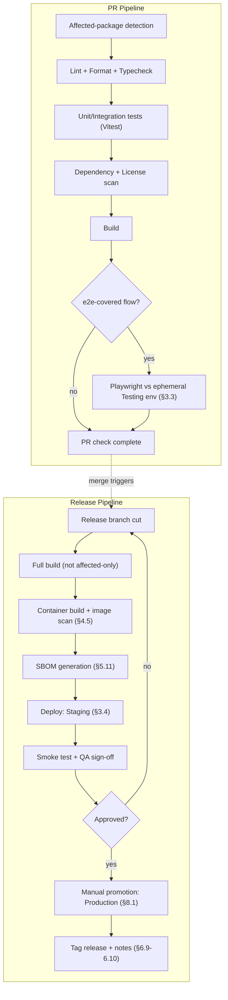
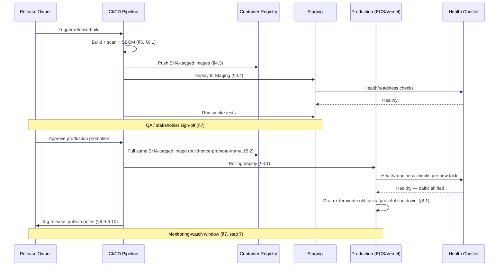
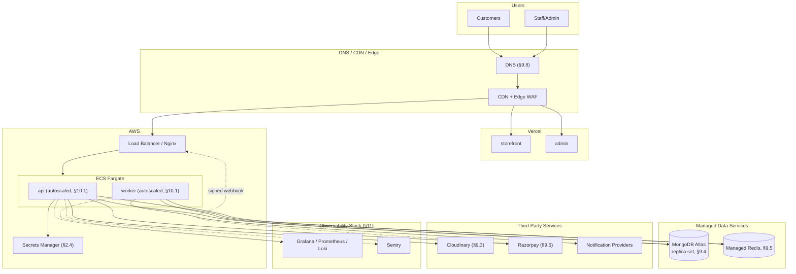
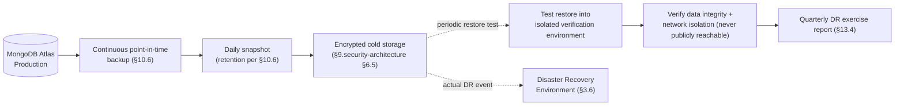
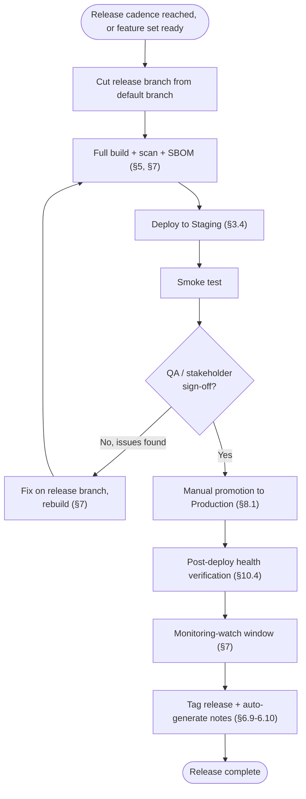
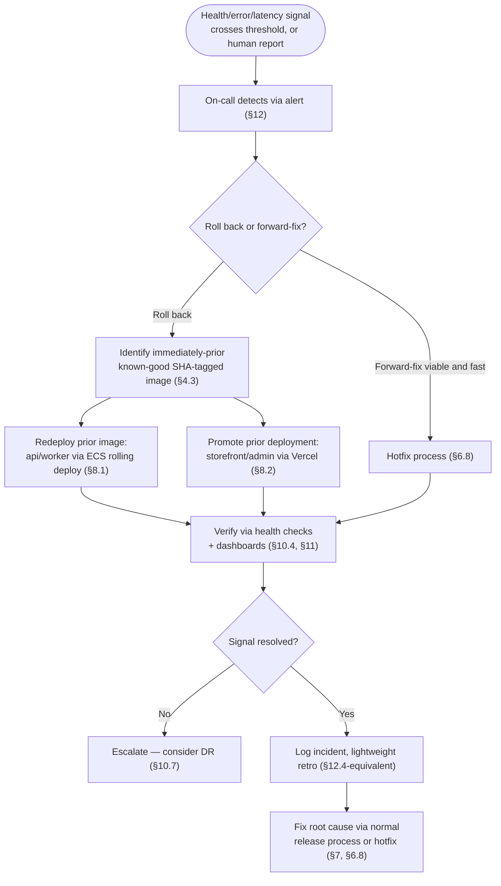

# DevOps Architecture

## National Furniture & Interiors Platform

**Prepared by:** Enterprise DevOps Architecture Review Board (Principal DevOps Architect, Cloud Infrastructure Architect, Site Reliability Engineer, Platform Engineer, DevSecOps Engineer, Principal Software Architect)
**Date:** 2026-08-07
**Status of `01`–`09`:** APPROVED and LOCKED, source of truth. Not redesigned.
**Scope:** Not deployment documentation — defines how the platform is **built, operated, monitored, and maintained** over its lifetime. No implementation code, no Dockerfile/YAML content, no scripts.

---

## Revision History

| Version | Date | Change | Reason |
|---|---|---|---|
| v1.0 | 2026-08-07 | Initial version | — |

---

## 0. Relationship to Locked Documents

This is the sixth document in the series to explicitly declare it isn't reopening prior decisions, and the reason is the same each time: `02_enterprise_architecture.md` §8 already named the deployment topology (four containers, Docker, an orchestrator), `05_repository_strategy.md` §14–§15 already designed the CI/CD pipeline shape (affected-package detection, scoped builds, scoped deploys), `07_technology_decision_record.md` §18–§19 already chose the specific tools (GitHub Actions, Vercel, AWS ECS Fargate), and `09_security_architecture.md` §5–§6 already designed secrets management, image/dependency scanning, and CI/CD security. What none of those documents did — because none of them owned it — is specify **environment-by-environment operational detail**: what "staging" actually contains, what a rollback actually does step by step, what a disaster-recovery environment even is for this platform, what the release-tagging scheme is, what the on-call alerting thresholds are. That operational layer is this document's job.

Three things this document explicitly does not do:
1. It does not re-choose the deployment targets (Vercel, ECS Fargate) — confirmed from `07_technology_decision_record.md` §19.
2. It does not re-design the CI/CD pipeline's *shape* (affected-only builds, scoped deploys) — confirmed from `05_repository_strategy.md` §14–§15.
3. It does not re-specify security controls — confirmed from `09_security_architecture.md`, referenced by section number throughout rather than restated.

---

## 1. Analysis

### 1.1 Architecture

Modular monolith, feature-based, four deployables (`storefront`, `admin`, `api`, `worker`, `02_enterprise_architecture.md` §8.1). This shape has one direct DevOps consequence worth stating up front: **there are exactly four independent deploy units**, not fifteen (one per backend module) and not two (one per frontend/backend split) — every pipeline, environment, and rollback design in this document is built around that number, because a "deploy the API" action really means "deploy `apps/api`," which contains all 15 modules together, per the Modular Monolith decision (`04_architecture_decision.md` §7) this document does not revisit.

### 1.2 Repository

Single monorepo, pnpm + Turborepo (`05_repository_strategy.md` §4–§5). Consequence: one CI pipeline definition serves all four deployables, differentiated by Turborepo's affected-package detection (`05_repository_strategy.md` §14.1) rather than four separate pipeline definitions — the build/test/deploy design in Sections 5–6 is built on this affected-only mechanic throughout, not a per-app pipeline duplicated four times.

### 1.3 Project Structure

`apps/`, `packages/`, `configs/`, `docker/`, `.github/`, `testing/` (`06_project_structure.md` §2, §7, §9). Consequence: `docker/apps/Dockerfile.*` (one per deployable) and `.github/workflows/*` are already-named locations this document's pipeline design populates with operational specifics, not new locations it invents.

### 1.4 Technology Stack

Confirmed from `07_technology_decision_record.md`: Node.js/TypeScript, MongoDB Atlas, Redis, Cloudinary, Razorpay, Next.js 15 (Vercel), Express (ECS Fargate), pnpm/Turborepo, GitHub Actions, Vitest/Playwright, Grafana stack + Sentry, ESLint/Prettier. Every infrastructure and tooling decision in Sections 6–9 below is drawn from this list — this document does not introduce a single new technology choice.

### 1.5 Security

Confirmed from `09_security_architecture.md`: secrets management (§5.1), image/dependency scanning as CI gates (§5.8–5.9), GitHub/CI-CD security (§6.3–6.4), backup security (§6.5). Sections 5–6 and 9 below implement the *operational mechanics* of these already-designed controls (when a scan runs, what blocks a merge, how a secret actually gets rotated in practice) without re-deciding what the controls are.

### 1.6 API

Confirmed from `08_api_architecture.md`: URI versioning (`/api/v1/`), the health/readiness-probe implication of Section 5.9's timeout table, and the OpenAPI-from-Zod CI-generation step (`08_api_architecture.md` §6.1) — the latter is directly a build-pipeline concern (Section 6.5 below).

### 1.7 Dependencies

The `packages/` dependency graph (`06_project_structure.md` §6, §13) determines Turborepo's affected-package computation (Section 6.3) — a change to `@nfi/shared` affects every consumer's build cache, while a change to one app's own code affects only that app. External dependencies (Cloudinary, Razorpay, MongoDB Atlas, Redis, notification providers) are each a distinct **operational dependency** with its own availability/latency profile that this document's reliability design (Section 10) must account for independently — they are not interchangeable "third-party API" line items.

### 1.8 Business Criticality

Per `01_business_research.md`'s priority order (Interior Design → Lead Generation → Furniture eCommerce) and `08_api_architecture.md` §1.9's endpoint-criticality notes: checkout (`POST /orders/checkout`) and the Razorpay webhook are the platform's most business-critical synchronous paths (a checkout outage stops revenue directly); lead capture (`POST /leads`) is the second-most-critical (an outage here silently loses the platform's #2 priority's entire top-of-funnel); the admin panel's availability matters operationally but a brief admin-panel outage doesn't stop customer-facing revenue the way a checkout outage does. This ranking directly informs Section 10.1's SLO tiers and Section 12's alerting severity.

### 1.9 Production Risks

Carried forward from `02_enterprise_architecture.md` §17 and `09_security_architecture.md` §12.1's pre-launch checklists, reframed as ongoing operational risks this document must design against: MongoDB Atlas/Redis becoming unavailable, a bad deploy reaching production undetected, a traffic spike (flash-sale-style marketing push, per `02_enterprise_architecture.md` §17) exceeding autoscaling capacity, a third-party provider (Razorpay, Cloudinary, notification providers) outage propagating into the platform's own availability, and — the risk this document adds that no prior document owned — **an operational mistake during deploy or rollback itself** being a bigger risk than the code defect it was meant to fix.

---

## 2. Environment Strategy

### 2.1 Environment Variables

Confirms `06_project_structure.md` §2.3/§7.4 and `09_security_architecture.md` §5.2 exactly: `configs/environments/` holds schemas and non-secret defaults; actual values are never committed; each variable's schema entry is marked `secret`/`non-secret` at definition time. This document's operational addition: every environment (Section 3) has its **own** variable set, not a shared `.env` with per-environment overrides layered on top — a `staging`-only variable (e.g., a sandbox Razorpay key) simply doesn't exist in the `production` variable set at all, rather than existing with a "don't use this in prod" comment, which removes an entire class of "someone forgot to override the sandbox key" incident.

### 2.2 Configuration Management

Non-secret, environment-shaped configuration (feature flags, deployment target definitions — `06_project_structure.md` §2.3) is **data**, versioned in the repository, reviewed via the standard PR process — configuration changes go through the same review rigor as code changes, because a misconfigured rate-limit tier or cache TTL is operationally indistinguishable from a code bug in its blast radius. `core/config`'s boot-time validation (`06_project_structure.md` §4.2) is the enforcement mechanism: a container that can't resolve its full required configuration set fails to start, rather than starting in a partially-configured, unpredictable state — this is a DevOps requirement stated here for the first time, though the mechanism itself was already named in `06_project_structure.md`.

### 2.3 Feature Flags

`configs/feature-flags/` (`06_project_structure.md` §2.3) holds per-environment default flag values, named but not designed in `01_business_research.md` §5. This document's design: flags are **read at request time from `core/config`'s cached read of the flag source** (not re-fetched per request — a cache-aside pattern consistent with `02_enterprise_architecture.md` §12's existing Redis cache-aside discipline, applied to flags rather than catalog data), with a short TTL (e.g., 60 seconds) so a flag flip propagates to running containers without requiring a redeploy. Flags are used for exactly two purposes at this platform's current stage: **staged feature rollout** (a new module capability visible to `STAFF` before `CUSTOMER`-facing release) and **kill switches** (the ability to disable a specific integration path — e.g., a malfunctioning notification channel — without a full redeploy, directly supporting Section 10.5's circuit-breaker design). Flags are explicitly **not** used for permanent branching logic (a flag that's been "temporarily" on for six months is a code-cleanup debt item, tracked in the same PR-template checkbox already established for docs updates, `06_project_structure.md` §7.3).

### 2.4 Secrets Management

Confirms `09_security_architecture.md` §5.1 exactly (AWS Secrets Manager or equivalent, injected at deploy time, rotation cadence table). This document's addition: the **operational rotation procedure**, since Section 5.1 there specified the *cadence* but not the *mechanics*. For a routine (non-emergency) rotation: (1) generate the new secret value in the secret store under a new version, (2) update the secret store's "current" pointer, (3) roll the affected container(s) via a standard rolling deploy (Section 8.1) — not a config-only in-place reload, since a container's environment is read once at boot (Section 2.2), so rotation is inherently a redeploy-shaped operation, not a live-reload one. For the JWT-signing-secret dual-key grace-period rotation specifically (`09_security_architecture.md` §5.1), both keys are present in the secret store simultaneously for the grace window, with the "issuance" key switched on day one and the "old, verify-only" key removed only after the grace window elapses — a two-step rotation, not a single atomic swap.

### 2.5 Environment Isolation

No environment shares a database, Redis instance, Cloudinary folder/preset, or Razorpay account/key-pair with another — `staging` uses Razorpay's sandbox mode and a separate Cloudinary folder namespace (`configs/environments/`), never production-adjacent credentials for anything, even read-only. Network isolation follows the same principle already established for the admin app specifically (`02_enterprise_architecture.md` §8.1's non-optional VPN/IP-allowlist) extended here to environment boundaries generally: `staging`'s API is not reachable from the public internet without the same edge-WAF/network-hardening posture `09_security_architecture.md` §1.12 requires for admin — a staging environment holding realistic (if synthetic) data is not a lower-security-bar environment just because it isn't production.

---

## 3. Environments

Seven environments, per the brief's explicit list — more granular than `02_enterprise_architecture.md` §8.2's three-environment summary (Local / Staging / Production), which this document expands rather than contradicts: "Shared Development" and "Testing" are two distinct facets of what `02_enterprise_architecture.md` §8.2 called "Local," and "Disaster Recovery" is a new environment concept `02_enterprise_architecture.md` named only as a backup/restore *procedure* (§17), not a standing environment.

### 3.1 Local Development

| Attribute | Design |
|---|---|
| Purpose | Individual developer's own machine; fast iteration, full stack runnable without any shared infrastructure dependency |
| Infrastructure | Docker Compose (`docker-compose.local.yml`, `06_project_structure.md` §7.1) — all four deployables plus MongoDB and Redis containerized locally; seeded database (`02_enterprise_architecture.md` §8.2) |
| Security | No real secrets ever — `.env.example`-derived local-only values (`06_project_structure.md` §7.4), Razorpay/Cloudinary in sandbox/test mode, no MFA requirement (not a `STAFF`/`ADMIN`-network-hardened context, per `09_security_architecture.md` §2.5's scope) |
| Monitoring | Local console/pretty-printed logs only (Pino's dev-mode formatter, `07_technology_decision_record.md` §15.1) — no Grafana/Sentry integration |
| Deployment | `docker compose up` via `scripts/setup/` (`06_project_structure.md` §2.2); no CI/CD involvement whatsoever |
| Rollback | `git checkout`/`git stash` — a local-environment "rollback" is just normal version control, not a deploy-pipeline concept |
| Recovery | Re-run the seed script (`scripts/setup/`); a broken local environment is never a production-impacting event, so recovery has no urgency SLO |

### 3.2 Shared Development

| Attribute | Design |
|---|---|
| Purpose | A persistent, shared, always-on environment reflecting the current state of the default branch — lets a developer verify integration with a teammate's just-merged change without needing it running locally, and lets `storefront`/`admin` developers work against a real, shared `api` without every developer running their own copy |
| Infrastructure | Same four-deployable topology as production but at minimal scale (single replica per service, smallest ECS Fargate task size, `M0`/free-tier-equivalent MongoDB Atlas cluster) — intentionally the cheapest environment that's still "real infrastructure," not Compose |
| Security | Same environment-isolation principle as Section 2.5 (separate credentials, sandbox Razorpay/Cloudinary); access restricted to the engineering team's own network/VPN, not public |
| Monitoring | Structured logging + basic Grafana dashboard reuse (Section 11), but **not** paged on-call — a Shared Development incident is a Slack-visible nuisance, not an alert (Section 12's severity tiers explicitly exclude this environment) |
| Deployment | Automatic on every merge to the default branch (`05_repository_strategy.md` §15's PR-check-then-merge flow triggers a Shared Dev deploy as the first, lowest-stakes deploy target) |
| Rollback | Automatic — the next merge simply redeploys; no formal rollback procedure needed given the environment's disposable, always-moving-forward nature |
| Recovery | Rebuildable from scratch at any time (`scripts/setup/`, same seed data as Local) — no backup requirement, since it holds no data of lasting value |

### 3.3 Testing Environment

| Attribute | Design |
|---|---|
| Purpose | The environment `testing/integration/` and `testing/e2e/` (`06_project_structure.md` §2.2, §9) actually run against — ephemeral, spun up fresh per CI run, not a persistent shared environment |
| Infrastructure | Containerized, CI-runner-local MongoDB/Redis (per `02_enterprise_architecture.md` §16's "integration tests against a real, containerized MongoDB/Redis instance") and the actual built application containers — created and destroyed within a single CI job's lifetime |
| Security | No real secrets of any kind, including sandbox third-party credentials where avoidable — Razorpay/Cloudinary calls in the test suite are mocked/stubbed at the adapter boundary (`02_enterprise_architecture.md` §7's port/adapter pattern makes this straightforward — a test-double adapter implements the same port interface) rather than hitting even a sandbox third-party API on every CI run, for speed and determinism |
| Monitoring | CI job logs only, retained per GitHub Actions' own log-retention policy; test results/coverage reports are the "observability" of this environment |
| Deployment | N/A — this environment is not deployed to, it's provisioned and torn down entirely within the CI pipeline (Section 6) |
| Rollback | N/A — no persistent state to roll back |
| Recovery | A failed/hung test-environment provisioning step simply fails the CI job; the next CI run provisions fresh — no manual recovery procedure needed |

### 3.4 Staging

| Attribute | Design |
|---|---|
| Purpose | Production-topology mirror at lower scale, used for QA and Razorpay/Cloudinary sandbox testing (`02_enterprise_architecture.md` §8.2, confirmed) — the last environment before production, and the one environment that must behave identically to production in every way that matters for a release decision |
| Infrastructure | Same four-deployable topology, same container images (the **exact same image artifact** that will be promoted to production, per Section 6.2's build-once-promote-many principle) at reduced replica count; a dedicated, non-shared MongoDB Atlas cluster and Redis instance (never production's) |
| Security | Full production-equivalent security posture (`09_security_architecture.md`'s full control set — MFA, network hardening, rate limiting, audit logging) — Staging is the environment that **validates** production security posture actually works, so relaxing it here would defeat that purpose |
| Monitoring | Full Grafana/Sentry integration (Section 11), same dashboards as production, filtered by environment tag — an SRE reviewing a dashboard can see Staging and Production side by side, not a Staging-specific tool |
| Deployment | Automatic on every merge to the release branch (Section 7.2), or manually triggered for a specific release candidate — the environment where Section 7's release process is rehearsed before Section 8's production promotion |
| Rollback | Same mechanism as production (Section 3.5, Section 8.4) — rolling back Staging is itself a rehearsal of the production rollback procedure, not a different, lighter-weight process |
| Recovery | Standard backup/restore (Section 10.6) at reduced frequency (daily, not continuous) given Staging data has no business-continuity value — it exists to catch problems before production, not to be itself protected against loss |

### 3.5 Production

| Attribute | Design |
|---|---|
| Purpose | Serves real customers, real payments, real PII — the environment every other environment exists to protect |
| Infrastructure | Vercel (`storefront`, `admin`) + AWS ECS Fargate (`api`, `worker`), multi-replica, autoscaled (Section 10.1), MongoDB Atlas replica set (minimum 3 nodes, `02_enterprise_architecture.md` §17/`03_database_design.md` §14.1), managed Redis — the full topology from `02_enterprise_architecture.md` §8, confirmed unchanged |
| Security | Full `09_security_architecture.md` control set, actively enforced and monitored (not just configured) — this is the environment Section 12.1 of that document's pre-launch checklist gates |
| Monitoring | Full observability stack (Section 11), on-call paging active (Section 12), all SLOs (Section 10.1) tracked |
| Deployment | Manually triggered promotion from a validated Staging deploy (Section 7.2), never a direct-to-production deploy that skipped Staging — the one deploy path this document treats as non-negotiable |
| Rollback | Section 8.4's formal rollback procedure — practiced, not theoretical (Section 13's checklists require it to have been exercised, not just documented) |
| Recovery | Section 10.7's disaster-recovery procedure, tested against the dedicated DR environment below |

### 3.6 Disaster Recovery Environment

| Attribute | Design |
|---|---|
| Purpose | **Not a standing, always-on environment** — a documented, periodically-*exercised* capability to reconstruct production from backups into a cold or warm-standby state, used to validate `02_enterprise_architecture.md` §17's "tested restore procedure" checklist item actually works, and to serve as the real target if production infrastructure itself (not just application state) is lost |
| Infrastructure | On-demand: a fresh ECS Fargate/Vercel deployment of the same container images (Section 6.2), restored MongoDB Atlas cluster from the latest verified backup (Section 10.6), a fresh Redis instance (rebuilt, not restored — Redis holds no data requiring durability, per `09_security_architecture.md` §5.1's classification of it as cache/session/queue state) |
| Security | Identical posture to production — a DR environment with weaker security than the production it's meant to replace is not a real disaster-recovery capability, it's a new attack surface |
| Monitoring | Instrumented identically to production the moment it's stood up — an incident severe enough to require DR is exactly the moment observability matters most, not the moment to be flying blind in a freshly-built environment |
| Deployment | Triggered manually as part of Section 10.7's DR procedure, never automatic (an automatic DR failover for a modular monolith at this platform's current scale is a level of automation this document does not recommend building yet — see Section 15's open items) |
| Rollback | N/A — DR activation is itself the "rollback" of a catastrophic infrastructure failure; there's no further fallback beyond it |
| Recovery | The DR exercise **is** the recovery procedure, tested on a quarterly cadence (Section 13.4's Runbook Checklist) against a synthetic "assume MongoDB Atlas region is unreachable" or "assume the ECS cluster is unrecoverable" scenario, timed against the RTO/RPO targets in Section 10.7 |

---

## 4. Container Strategy

### 4.1 Docker

Confirms `06_project_structure.md` §7.1 and `09_security_architecture.md` §5.6 exactly: minimal base images (`node:XX-alpine`/distroless-equivalent), multi-stage builds, non-root `USER` directive. This document's addition: the multi-stage build's **stage boundary** is standardized across all four Dockerfiles (`Dockerfile.storefront`, `.admin`, `.api`, `.worker`) as `deps` (install dependencies, cached separately) → `build` (compile/bundle) → `runtime` (minimal final image, copies only build output + production dependencies) — a shared, consistent shape across all four, not four independently-designed multi-stage builds, so a developer who understands one understands all of them (the same "one template, understand all of them" principle `06_project_structure.md` §14 already established for folder structure).

### 4.2 Docker Compose

`docker-compose.local.yml` and `docker-compose.staging.yml` (`06_project_structure.md` §7.1) — Local uses Compose for the full stack (Section 3.1); Staging's own Compose file exists only as a **local-parity verification tool** for developers to sanity-check a Staging-shaped topology before pushing, not as Staging's actual deploy mechanism (Staging deploys via the same ECS Fargate/Vercel path as production, Section 8). Compose is never used for production — confirmed from `06_project_structure.md` §7.1's own explicit statement that "production is orchestrator-managed, not Compose."

### 4.3 Image Versioning

Confirms `07_technology_decision_record.md` §1.2: container image tags are the **git commit SHA**, never `latest` or a manually-incremented tag. This document's addition — the tagging scheme in full: `<service>:<git-sha>` for every build (e.g., `api:a1b2c3d`), with a **secondary, moving tag** (`<service>:staging-current`, `<service>:production-current`) updated to point at the currently-deployed SHA-tagged image per environment, purely for human convenience when inspecting the registry — the moving tag is never what a deploy pipeline references (Section 8.1 always deploys an explicit SHA), only what a person looks at.

### 4.4 Image Optimization

Multi-stage builds (Section 4.1) already remove build-time dependencies and dev tooling from the final image. This document's addition: `.dockerignore` (`06_project_structure.md` §7.1) is audited as part of every Dockerfile change to ensure `node_modules`, `.git`, `.env*`, and test fixtures never enter the build context in the first place, not just get excluded from the final layer — a build-context-level control, not just a final-image-level one, since a bloated build context slows every CI build even if the final image is clean. Layer ordering follows dependency-install-before-source-copy (already implicit in the `deps`/`build`/`runtime` stage split, Section 4.1) so Turborepo's own caching (Section 6.3) and Docker's layer cache reinforce each other rather than working against each other.

### 4.5 Container Security

Confirms `09_security_architecture.md` §5.6–5.8 in full (non-root user, minimal base image, mandatory image scanning as a CI gate). No new control — this document's contribution is only the operational placement: the scan (Section 6.9) runs **after** the image is built but **before** it's pushed to the registry, so a scan failure blocks the image from ever becoming a deployable artifact, not just from being deployed after the fact.

### 4.6 Container Lifecycle

| Stage | What happens |
|---|---|
| Build | CI builds the image (Section 6), tags with git SHA (Section 4.3), scans (Section 4.5) |
| Push | Scanned, passing image pushed to the container registry |
| Deploy | ECS Fargate pulls the specific SHA-tagged image for a rolling deploy (Section 8.1); Vercel builds and deploys its own image internally from the same source commit |
| Run | Health-checked (Section 10.4), autoscaled (Section 10.1), logs/metrics shipped (Section 11) |
| Retire | Old task/container instances drained (Section 8.1's graceful shutdown, Section 10.6) and terminated once the new deploy's health checks pass |
| Registry cleanup | Images older than a defined retention window (e.g., 90 days, or the last N deploys per environment, whichever is longer) are pruned from the registry on a scheduled job — keeps registry storage cost bounded without deleting an image that a Section 8.4 rollback might still need |

---

## 5. Build Strategy

### 5.1 Build Pipeline

One CI pipeline definition (`.github/workflows/pr-checks.yml`, `06_project_structure.md` §7.3), triggered on every PR and on merge to the default/release branches, built entirely around Turborepo's affected-package detection (`05_repository_strategy.md` §14.1, confirmed unchanged): a PR touching only `apps/storefront` runs only `storefront`'s lint/typecheck/test/build tasks (plus anything depending on a package `storefront` also depends on, per the dependency graph, `06_project_structure.md` §6/§13) — never a full-monorepo rebuild for a scoped change.

### 5.2 Artifact Generation

The build stage's output is exactly the four Docker images (Section 4.6) plus the two Vercel-native build outputs (`storefront`, `admin`, which Vercel builds via its own pipeline rather than a Dockerfile, per `07_technology_decision_record.md` §19.1) — **one build, many deploy targets**: the same `api`/`worker` images built once during CI are the exact artifacts promoted from Staging to Production (Section 3.4's "exact same image artifact" note), never rebuilt per environment. This is a deliberate, named principle (**build once, promote many**) because rebuilding per environment would mean Staging and Production could theoretically run different compiled code from the identical source commit — a class of bug this design eliminates structurally.

### 5.3 Dependency Caching

Turborepo's remote cache (`05_repository_strategy.md` §14.2, and its Vercel synergy noted in `07_technology_decision_record.md` §19.1) caches task outputs (lint/typecheck/test/build results) keyed on input hashes — a CI run for a PR that doesn't change a given package's inputs restores that package's cached results instead of recomputing them. `pnpm`'s own content-addressable store (`07_technology_decision_record.md` §20.4) is cached separately at the CI-runner level (persisted between runs via GitHub Actions' cache action) so `pnpm install` itself is fast even on a cold Turborepo cache.

### 5.4 Build Optimization

Beyond caching (Section 5.3): Vitest (`07_technology_decision_record.md` §17.1) and Turborepo's affected-only execution (Section 5.1) are the two mechanisms already chosen specifically for CI-speed reasons (`07_technology_decision_record.md` §17.1's own stated rationale) — this document adds no new optimization technology, only the operational discipline of monitoring build-time trend as a tracked metric (Section 11.3) so a gradual regression (a growing monorepo slowly eroding the "fast affected-only build" benefit) is caught before it becomes a developer-experience complaint.

### 5.5 Static Analysis

ESLint (`07_technology_decision_record.md` §20.2), including the module-boundary rule that's the actual enforcement mechanism behind the "no Nx needed" decision (`05_repository_strategy.md` §5) — run as a CI gate on every PR, scoped to affected packages (Section 5.1).

### 5.6 Linting

Same as Section 5.5 — ESLint covers both correctness-static-analysis and lint-style concerns in this stack's tooling choice; no separate linting-only tool.

### 5.7 Formatting

Prettier (`07_technology_decision_record.md` §20.3) — run as a CI **check** (fails if code isn't already formatted), not a CI **fixer** (CI never auto-commits a formatting fix back to a PR branch, since silent CI-authored commits are themselves an operational-trust concern) — a developer runs formatting locally (via a pre-commit hook or editor integration, Section 14.2) before pushing.

### 5.8 Type Checking

TypeScript's own compiler (`tsc --noEmit`-equivalent, `07_technology_decision_record.md` §20.1), run as a CI gate scoped to affected packages, using the shared `@nfi/tsconfig` base (`06_project_structure.md` §5) — a type error in one package doesn't require re-checking every other package, only that package and its dependents.

### 5.9 Security Scanning

Confirms `09_security_architecture.md` §5.8–5.9 exactly: dependency scanning (npm-audit-equivalent or Dependabot/Renovate's security-advisory integration) on every PR and daily against the default branch; container image scanning after build, before registry push (Section 4.5). A Critical/High finding in a fixable dependency or image layer fails the pipeline — confirmed unchanged, referenced here as the CI-gate placement within this document's own pipeline architecture (Section 6.1).

### 5.10 License Scanning

**Not previously specified in `01`–`09`** — new here. Every new dependency added to any `package.json` is checked against an allow-listed set of open-source license types (permissive licenses — MIT, Apache-2.0, BSD, ISC — allowed by default; copyleft licenses — GPL, AGPL — flagged for explicit legal review before merge, since a copyleft dependency in a proprietary commercial codebase has real legal implications a dependency-vulnerability scanner doesn't catch). Runs as a CI check on `package.json`/lockfile changes, alongside Section 5.9's security scan — a different concern (legal risk vs. security risk) using the same "gate the PR before merge" mechanism.

### 5.11 SBOM Generation

**Not previously specified in `01`–`09`** — new here, and increasingly a baseline expectation for any production software supply chain (directly extending `09_security_architecture.md` §5.10's supply-chain-security section, which stopped short of naming SBOM generation specifically). A Software Bill of Materials (in CycloneDX or SPDX format) is generated as a build artifact for every production release (Section 7's release process) — not for every PR, since an SBOM's value is tied to *what's actually deployed*, not every candidate change — and stored alongside the release's other artifacts (Section 5.2), giving the platform an auditable answer to "exactly which dependency versions, at exactly which license and vulnerability status, were running in production as of release X" without needing to reconstruct it after the fact from git history.

---

## 6. CI/CD

### 6.1 GitHub Actions — Pipeline Architecture

Confirms `07_technology_decision_record.md` §18.1 and `05_repository_strategy.md` §15 exactly. Full pipeline shape, stated end to end for the first time (prior documents each specified one piece of it):

```
PR opened/updated → [pr-checks.yml]
  1. Turborepo affected-package detection (§5.1)
  2. Lint (§5.5) + Format check (§5.7) + Type check (§5.8) — parallel, per affected package
  3. Unit/integration tests (Vitest, §5.1) — parallel, per affected package
  4. Security scan (dependency, §5.9) + License scan (§5.10)
  5. Build (§5.2) — affected packages only
  6. [If PR touches e2e-covered flows] Playwright e2e against an ephemeral Testing environment (§3.3)
  → All green required for merge (branch protection, §6.2)

Merge to default branch → [deploy-shared-dev.yml, implicit]
  → Automatic deploy to Shared Development (§3.2)

Merge/promotion to release branch → [deploy-staging.yml]
  1. Full build (not affected-only — a release candidate builds everything, §7.1)
  2. Container image build + scan (§4.5) + SBOM generation (§5.11)
  3. Deploy to Staging (§3.4)
  4. Smoke tests against Staging

Manual promotion → [deploy-production.yml]
  1. Re-use the exact Staging-validated image (§5.2's build-once-promote-many)
  2. Deploy to Production (§8.1)
  3. Post-deploy health verification (§10.4)
```

### 6.2 Branch Protection

Default branch (`main`) and the release branch (Section 7.1) both require: no direct push, PR required, all Section 6.1 pipeline checks passing, at least one CODEOWNERS-matched approval (`05_repository_strategy.md` §15, `06_project_structure.md` §7.3, confirmed unchanged) — this document adds the operational rule that **branch protection settings themselves are audit-logged** (a GitHub organization-level setting, not this platform's own `audit_logs` collection) and reviewed as part of Section 13.5's quarterly Architecture Review Checklist, since a silently-weakened branch protection rule is a realistic, easy-to-overlook drift risk.

### 6.3 Merge Strategy

**Squash merge only** to the default and release branches — every PR becomes exactly one commit in the branch history, keeping the git-SHA-based image tagging (Section 4.3) meaningful (one commit = one buildable, deployable state, not a tangle of intermediate WIP commits that individually may not even build). PR titles follow a Conventional-Commits-style format (`feat(leads): ...`, `fix(orders): ...`) enforced as a CI check, since Section 6.6's release-notes generation and Section 7.4's versioning both derive meaning from commit-message structure.

### 6.4 Release Strategy

A **release** is a specific, tagged, immutable set of the four container images/build artifacts (Section 5.2) promoted together from a specific commit on the release branch — releases are cut on a regular cadence appropriate to this platform's stage (e.g., weekly, or on-demand when a meaningful feature set is ready), not continuously on every merge (continuous deployment to Production is explicitly not this platform's chosen model, given the manual-promotion gate in Section 3.5 — a deliberate choice favoring the Staging-validation step over deploy velocity, appropriate for a platform handling payments and PII per `09_security_architecture.md`'s risk profile). See Section 7 for full versioning/tagging detail.

### 6.5 Rollback Strategy

See Section 8.4 for the full mechanics — stated here as a pipeline-architecture concept: rollback is **not** a new build ("revert the commit and redeploy") for anything beyond a genuinely code-level fix; for an urgent production issue, rollback is **redeploying the immediately-prior known-good SHA-tagged image** (Section 4.3), which is why build-once-promote-many (Section 5.2) matters operationally — the prior image already exists, scanned and validated, ready to redeploy in minutes, not rebuilt from source under incident pressure.

### 6.6 Blue-Green Deployment

**Recommended for `api`/`worker` on ECS Fargate**: two parallel task-set environments ("blue" = currently live, "green" = newly deployed), with traffic cut over via the load balancer's target-group switch only after Section 10.4's health checks pass against the green environment — an instant, atomic cutover with an equally instant rollback (switch the target group back to blue) if a problem surfaces immediately post-cutover. This is a **recommendation with an explicit cost trade-off named**, not a mandate: blue-green requires running double capacity briefly during every deploy, which is a real, ongoing infrastructure cost (Section 16's cost review) — appropriate for `api` (business-critical, per Section 1.8) but not necessarily justified for `worker` (less user-facing-latency-sensitive; a rolling deploy with a brief queue-processing pause is an acceptable trade-off there). `storefront`/`admin` on Vercel get blue-green-equivalent behavior natively as part of Vercel's own deployment model (atomic deployment + instant rollback to a prior deployment), requiring no additional design from this document.

### 6.7 Canary Deployment

**Not adopted for the current platform stage** — named and explicitly deferred, following the same trigger-based deferral discipline established throughout `04`/`07`/`08`/`09`: canary deployment (routing a small percentage of production traffic to a new version before full cutover) adds real operational complexity (traffic-splitting infrastructure, canary-specific metrics comparison) that isn't justified at this platform's current traffic volume and team size — Section 6.6's blue-green model already provides a fast, safe rollback path without canary's incremental-traffic complexity. **Trigger to revisit:** sustained production traffic volume high enough that even a brief, fully-cutover bad deploy would affect a business-significant number of users before Section 10.4's health checks and Section 12's alerting could catch it — not a speculative future need.

### 6.8 Hotfix Process

A distinct, expedited path for a production-breaking bug or the security emergency-patch exception already established (`07_technology_decision_record.md` §1.1, `08_api_architecture.md` §13's Rule 6): branched directly from the currently-deployed production SHA (not from the tip of the release branch, which may contain unreleased, unvalidated changes), goes through the **same** Section 6.1 CI gates (no skipped checks, even under time pressure — consistent with `09_security_architecture.md` §11's Rule against expedience-driven exceptions), but skips the normal release-cadence wait (Section 6.4) and Staging soak time, going Staging → Production in immediate succession once Staging smoke tests pass. A hotfix is merged back into the release branch and default branch immediately after production deployment, so the emergency fix isn't silently lost on the next regular release cut.

### 6.9 Versioning

Confirms `08_api_architecture.md` §3.17's API-level `/api/v1/` versioning (a different, API-contract-level concept, referenced not repeated) and `07_technology_decision_record.md` §1.2's git-SHA image tagging (Section 4.3). This document adds **platform release versioning**, distinct from both: `vYYYY.MM.<sequence>` (e.g., `v2026.08.1`) applied as a git tag on the release branch at every Section 6.4 release cut — calendar-based rather than semver, because this platform is not a published library with a public API-compatibility contract at the *release* level (API-level compatibility is already governed separately and more precisely by `08_api_architecture.md` §3.17–3.19's own versioning policy); a calendar-based release tag instead answers the operational question "what was actually deployed, and when" clearly, which is what a release tag is for at this platform's stage.

### 6.10 Release Tags

Every release tag (Section 6.9) is annotated with release notes auto-generated from the Conventional-Commits-formatted PR titles merged since the prior tag (Section 6.3) — populating `docs/release-notes/` (`06_project_structure.md` §8, confirmed as the existing designated location) as a build step, not a manually-written document, so release notes can never drift from what was actually merged.

---

## 7. Release Process, Stated End to End

Not one of the brief's named headings directly, but the connective tissue Sections 6.4/6.6/6.9–6.10 need stated together once, since a release "process" spans several of those sections' individual mechanics:

1. Release branch cut from the default branch at a planned cadence (Section 6.4).
2. Full build + scan + SBOM (Section 5.2, 5.9–5.11) produces the release's immutable artifact set.
3. Deploy to Staging (Section 3.4), smoke-tested.
4. QA/stakeholder sign-off on Staging (a human gate, not automated — appropriate given this platform's payment/PII risk profile, Section 1.9).
5. Manual promotion to Production using the **exact same artifacts** (Section 5.2, 6.5).
6. Git tag + auto-generated release notes (Section 6.9–6.10).
7. Post-deploy health verification (Section 10.4) and a defined monitoring-watch window (e.g., 30–60 minutes of elevated attention to dashboards, Section 11) before considering the release fully settled.

---

## 8. Environments — Deployment & Rollback Mechanics

### 8.1 Deployment Mechanics (Production, ECS Fargate)

Rolling deployment: new task definition (referencing the new SHA-tagged image, Section 4.3) registered; ECS gradually replaces old tasks with new ones, respecting a minimum-healthy-percent threshold (e.g., 100%, meaning capacity never drops below current levels during deploy — a deliberate choice given checkout's business-criticality, Section 1.8) and a maximum-percent threshold controlling how many new tasks can start before old ones are drained. Each new task must pass Section 10.4's health check before receiving traffic. **Graceful shutdown** (Section 10.5): a task being drained stops accepting new connections but finishes in-flight requests (bounded by Section 5.9's existing 30-second Nginx timeout ceiling from `08_api_architecture.md`) before termination — no in-flight checkout or webhook-processing request is abruptly killed mid-operation by a routine deploy.

### 8.2 Deployment Mechanics (Vercel — `storefront`/`admin`)

Vercel's native deployment model: each push to the deploy-triggering branch produces an immutable deployment, promoted to the production alias only after the equivalent of Section 8.1's health verification (Vercel's own build-success + basic reachability check) — this document does not need to design Vercel's deployment mechanics from scratch, only confirm they satisfy the same "immutable artifact, health-verified before traffic cutover" principle Section 8.1 applies to `api`/`worker`.

### 8.3 Deployment Mechanics (`worker`)

Same rolling-deployment mechanic as Section 8.1, with one difference: graceful shutdown means finishing the **current** BullMQ job(s) in flight (not accepting new HTTP connections, since `worker` has no HTTP surface, `08_api_architecture.md` §9's per-module table) before termination — BullMQ's own job-visibility-timeout mechanism (`02_enterprise_architecture.md` §16) ensures a job that somehow doesn't finish before a hard termination deadline is picked up again by a replacement worker, not silently lost.

### 8.4 Rollback Mechanics

The formal procedure Section 6.5 named conceptually, specified in full:

1. **Detect:** a post-deploy health/error-rate/latency signal (Section 10.4, 11.3, 12) crosses a rollback-triggering threshold, or a human identifies a critical regression.
2. **Decide:** the on-call engineer (or release owner, for a non-paged issue caught during the Section 7 monitoring-watch window) decides to roll back rather than forward-fix — a deliberate decision point, not automatic, since an automatic rollback on a false-positive signal is itself an availability risk.
3. **Execute (`api`/`worker`):** redeploy the immediately-prior SHA-tagged image (Section 4.3) via the same rolling-deployment mechanic (Section 8.1) — not a `git revert`-and-rebuild, since the prior image is already built, scanned, and was itself Staging-validated (Section 5.2's build-once-promote-many is what makes this fast).
4. **Execute (`storefront`/`admin`):** Vercel's native "promote a prior deployment" action — equally immediate, no rebuild.
5. **Verify:** Section 10.4's health checks and Section 11's dashboards confirm the rollback resolved the signal from step 1.
6. **Communicate:** the incident (even a successful, quick rollback) is logged per Section 12.4/`09_security_architecture.md` §12.4's incident-response pattern, since a rollback is itself an operational event worth a lightweight retrospective, not necessarily a full blameless post-mortem unless it meets that process's severity bar.
7. **Follow up:** the root cause is fixed on the release branch and goes through the **normal** release process (Section 7) or, if urgent, the hotfix process (Section 6.8) — a rollback resolves the immediate incident, it doesn't itself fix the underlying defect.

---

## 9. Infrastructure

Per-provider operational specification — confirms every provider choice from `07_technology_decision_record.md` unchanged, adds the operational detail those TDR profiles didn't need to reach.

### 9.1 Vercel

Hosts `storefront`/`admin` (`07_technology_decision_record.md` §19.1). Operational specifics: preview deployments (Vercel's native per-PR deployment) are used as the **actual QA environment for frontend-only changes** — a reviewer can click through a real, live preview rather than trusting a description, which is a meaningfully different (and better) review experience than the backend's PR-check-only verification, and is named here as a deliberate DX benefit of the Vercel choice (Section 14). Environment variables configured per Vercel environment (Preview/Production) matching Section 2.5's isolation principle.

### 9.2 AWS ECS Fargate

Hosts `api`/`worker` (`07_technology_decision_record.md` §19.2). Operational specifics: task definitions versioned (each deploy registers a new task-definition revision, never mutates an existing one in place — giving ECS itself a built-in rollback-target history that complements Section 8.4's image-level rollback); service auto-scaling policies (Section 10.1) attached per service, not a shared policy across `api` and `worker` (their scaling triggers differ — `api` scales on CPU/RPS, `worker` scales on queue depth, both already named in `02_enterprise_architecture.md` §8.1).

### 9.3 Cloudinary

Confirms `09_security_architecture.md` §6.1 and `02_enterprise_architecture.md` §15 unchanged. Operational addition: Cloudinary account status/quota is itself a monitored metric (Section 11.3) — approaching a plan's transformation/bandwidth quota is an operational signal worth alerting on (Section 12) before it becomes a customer-facing image-delivery failure, distinct from Cloudinary being fully *down* (Section 10.3's circuit-breaker concern).

### 9.4 MongoDB Atlas

Confirms `03_database_design.md` §14 unchanged (replica set, minimum 3 nodes, `secondaryPreferred` read preference for reporting). Operational addition: Atlas's own built-in monitoring (slow-query logs, connection-pool saturation, replication lag) is integrated into Section 11's dashboard strategy as a data source alongside application-level metrics, not left in a separate, un-cross-referenced Atlas-only console.

### 9.5 Redis

Confirms `07_technology_decision_record.md` §7.1 unchanged (managed Redis recommended in production, per `02_enterprise_architecture.md` §8.1's inventory table). Operational addition: persistence configuration differs by the three roles Redis plays (cache vs. queue vs. session/refresh-token store, `02_enterprise_architecture.md` §17's checklist item, confirmed here as an operational requirement rather than left as a noted-but-undesigned distinction) — the queue-backing and session-store use cases warrant AOF-or-equivalent persistence (data loss there has real correctness/security consequences, `09_security_architecture.md` §5.1), while pure cache-aside keys can tolerate a full flush with only a performance (not correctness) cost.

### 9.6 Razorpay

Confirms `09_security_architecture.md` §6.2 unchanged (IP-allowlisted webhook, signature verification). Operational addition: Razorpay's own status/incident page is a monitored external dependency (Section 10.3's circuit-breaker/degraded-mode design references this directly) — the platform's own status communication to customers during a Razorpay-side outage is a defined operational response (Section 10.3), not an ad hoc scramble.

### 9.7 GitHub

Confirms `09_security_architecture.md` §6.3 unchanged (branch protection, 2FA, secret scanning). Operational addition: GitHub Actions' own runner availability is itself a dependency this platform's deploy capability relies on — Section 10.3's degraded-mode thinking applies at the meta level too: a GitHub Actions outage blocks new deploys but does not affect already-running production (a useful, worth-stating property of this pipeline design, since production isn't continuously re-deploying itself, per Section 6.4's deliberate non-continuous-deployment choice).

### 9.8 DNS

**Not previously specified in `01`–`09`** — new here. DNS is managed through the same registrar/DNS-provider account as the domain itself, with a short TTL (e.g., 300 seconds) on records that might need to change during an incident (e.g., a DR cutover, Section 3.6/10.7) and a longer TTL on stable records — a deliberate trade-off between DNS-propagation speed during an incident and ordinary DNS query load/cost. DNS changes are treated with the same change-control rigor as a production deploy (a mistaken DNS change is a full-outage-class risk), logged and reviewed, never made ad hoc by an individual without a second reviewer.

### 9.9 CDN

Confirms `02_enterprise_architecture.md` §4/§12 and `08_api_architecture.md` §5.7 unchanged: edge CDN for cacheable content, Cloudinary's own CDN for media. Operational addition: cache-purge/invalidation for the edge CDN layer (distinct from the already-designed Redis + Next.js ISR dual-invalidation, `02_enterprise_architecture.md` §12 v1.1) is triggered by the same product/content-update write path, added as a third invalidation target alongside the two already locked — confirmed as an extension of an existing mechanism, not a new one.

---

## 10. Reliability

### 10.1 Auto Scaling

`api` scales on CPU utilization and request rate (RPS); `worker` scales on BullMQ queue depth — both already named as the scaling triggers in `02_enterprise_architecture.md` §8.1, operationalized here with concrete tiers:

| Service | Scale-out trigger | Scale-in trigger | Min/Max replicas (production) |
|---|---|---|---|
| `api` | CPU > 70% for 3 min, or p95 latency > Section 10.2's SLO threshold | CPU < 30% for 10 min | 2 min (never single-replica in production) / autoscale ceiling sized to Section 16's cost review |
| `worker` | Queue depth > a defined per-queue threshold sustained for 2 min | Queue depth near zero for 10 min | 1 min / autoscale ceiling per queue-type load testing |
| `storefront`/`admin` | Vercel-native, serverless — no min/max replica concept applies (Section 8.2) | — | N/A |

**SLO tiers** (Section 1.8's business-criticality ranking, made concrete): checkout and the Razorpay webhook path target the tightest availability/latency SLOs (matching `08_api_architecture.md` §5.9's 15-second checkout budget); lead capture next; general catalog/admin traffic held to a standard, still-production-grade but less aggressively-tiered SLO.

### 10.2 Load Balancing

Confirms `02_enterprise_architecture.md` §4/§8's Nginx/load-balancer layer unchanged — this document's addition is the health-check configuration backing it (Section 10.4) and the explicit statement that load-balancer-level health checks and ECS-level task health checks are **the same check**, not two independently-configured, potentially-inconsistent health definitions.

### 10.3 Failover

**MongoDB Atlas:** automatic primary election within the replica set (`03_database_design.md` §14.1) on primary-node failure — no application-level intervention required; the Mongoose connection layer (`06_project_structure.md` §4.2) reconnects to the newly-elected primary automatically. **Redis:** managed Redis's own failover mechanism (relevant specifically for the session/refresh-token and queue-backing roles, Section 9.5) — a brief Redis unavailability window degrades (Section 10.5's circuit-breaker) rather than fully failing authentication/checkout. **Third-party providers (Razorpay, Cloudinary, notification providers):** no failover in the traditional sense (this platform doesn't run a second payment gateway on standby, consistent with `01_business_research.md`'s single-gateway decision, `07_technology_decision_record.md` §9.1) — instead, **degraded-mode operation**: a Razorpay outage triggers the COD-fallback recommendation already named in `00_architecture_review.md` finding PR1 (referenced, not redesigned, since it predates this document and this document doesn't own payment-flow design); a notification-provider outage degrades to "notification queued, will send once the provider recovers" (already the natural behavior of the existing BullMQ retry mechanism, `02_enterprise_architecture.md` §16, not a new design).

### 10.4 Health Checks

Every container exposes a `/health` (liveness — "is the process alive") and a `/ready` (readiness — "can this instance currently serve traffic," checking its own MongoDB/Redis connectivity) endpoint, per the already-named-but-undesigned requirement in `02_enterprise_architecture.md` §8/§17's checklist ("health/readiness probes on every container") — this document is where those probes get their concrete semantic split. A liveness-check failure triggers a container restart (ECS's own remediation); a readiness-check failure removes the instance from the load balancer's rotation without restarting it (the instance might recover connectivity on its own, e.g., a transient MongoDB blip, without needing a full restart).

### 10.5 Retry Policy & Circuit Breaker

**Retry policy:** outbound calls to Cloudinary/Razorpay/notification providers use bounded exponential backoff with jitter (e.g., 3 attempts, base delay 200ms, capped) for transient failures (timeouts, 5xx responses) — never an unbounded retry loop, and never retried at all for a definitively-failed operation (e.g., a Razorpay 4xx validation error is not retried, since retrying a request the provider has already rejected as invalid wastes time and provider-quota for a call that cannot succeed). **Circuit breaker:** for the notification-provider integration specifically (the one dependency whose failure should never block a synchronous user-facing request, since it's already fully decoupled via the queue, `02_enterprise_architecture.md` §16) — a circuit breaker trips after a defined consecutive-failure threshold, stopping further attempts for a cooldown window and routing jobs to a dead-letter state instead (visible in `03_database_design.md` §9.8.1's `notifications.status: FAILED`), preventing a struggling third-party provider from being hammered with retries that compound its own outage. Cloudinary and Razorpay, being in the synchronous request path (Section 1.8), are not circuit-broken the same way — a synchronous checkout request that can't reach Razorpay simply fails that request with a clear error (Section 10.3's COD-fallback is the actual mitigation there, not a circuit breaker masking the dependency).

### 10.6 Backup Strategy

Confirms `09_security_architecture.md` §6.5 exactly (encrypted, least-privilege-access, periodically-tested restores). Operational specifics added here: MongoDB Atlas continuous backups (point-in-time recovery, per Atlas's own managed-backup capability) with a defined retention window (e.g., 7 days of point-in-time granularity, 30 days of daily snapshots, per the statutory-retention-pending confirmation already flagged in `03_database_design.md` §15/§16 — this document's backup *retention* schedule is provisional pending that legal confirmation, same caveat carried forward, not resolved here). Cloudinary media is not separately backed up by this platform (Cloudinary's own durability guarantees are the operative protection, consistent with `09_security_architecture.md` §6.6's risk-proportionate distinction that media is not Tier 1 data).

### 10.7 Recovery Strategy (Disaster Recovery)

The procedure Section 3.6's DR environment exists to exercise: **RTO (Recovery Time Objective) target of 4 hours, RPO (Recovery Point Objective) target of 15 minutes** (bounded by Atlas's point-in-time recovery granularity, Section 10.6) for a full-region/full-infrastructure-loss scenario — these are targets this document sets and Section 13.4's quarterly DR exercise validates, not yet-proven guarantees. Procedure: (1) confirm production is genuinely unrecoverable in place, not just degraded (a degraded-but-recoverable incident uses Section 8.4's rollback, not full DR); (2) stand up the DR environment (Section 3.6) from the latest verified backup; (3) update DNS (Section 9.8) to point at the DR environment; (4) verify via Section 10.4's health checks and a manual smoke test; (5) communicate status; (6) once original production infrastructure is restored, plan a controlled cutback (not an emergency one) once DR-environment data has been reconciled back.

---

## 11. Observability

### 11.1 Logging

Confirms `07_technology_decision_record.md` §15.1 and `09_security_architecture.md` §7.1 exactly: structured JSON (Pino), correlation/request-ID propagation, the security-event taxonomy. This document's operational addition: log retention is tiered — 30 days hot/searchable (for active debugging), archived to cold storage for 1 year (for compliance/incident-investigation purposes, mirroring `03_database_design.md` §14.5's archival pattern applied to logs rather than database collections), consistent with `09_security_architecture.md` §8.6's not-yet-fully-resolved data-retention posture.

### 11.2 Tracing

Confirms `02_enterprise_architecture.md` §16's "APM tracing across API → DB/Redis/external-call spans" and `07_technology_decision_record.md` §16.1's OpenTelemetry-instrumentation approach, feeding the Grafana stack. Every trace is correlated to the same `X-Request-ID`/`traceId` used throughout logging (`08_api_architecture.md` §3.1, `09_security_architecture.md` §4.8) and audit logging — one correlation identifier threading through logs, traces, and audit entries for a single request, not three separately-keyed observability systems.

### 11.3 Metrics

Confirms `07_technology_decision_record.md` §16.1 (Grafana/Prometheus/Loki stack). Tracked metric categories: **golden signals** per service (latency, traffic, errors, saturation — the standard SRE framework) for `api`/`worker`; **business metrics** (checkout completion rate, lead-submission rate, notification-delivery success rate) surfaced alongside infrastructure metrics on the same dashboards (Section 11.4), since a business-metric anomaly (e.g., checkout completion rate dropping while infrastructure metrics look healthy) can be the earliest signal of a subtle bug that pure infrastructure monitoring would miss entirely; **dependency-health metrics** (Cloudinary quota, Razorpay/notification-provider error rates, MongoDB Atlas connection-pool saturation, Section 9's per-provider additions).

### 11.4 Heartbeat Monitoring

**Not previously specified in `01`–`09`** — new here. Beyond Section 10.4's load-balancer-integrated health checks (which detect an unhealthy *instance*), an independent, external heartbeat/uptime check (hitting the public `storefront`/`admin`/`api` endpoints from outside the infrastructure, on a short interval, e.g., every 60 seconds) provides an outside-in view that can detect a failure mode internal health checks miss entirely — a DNS misconfiguration, a CDN/edge-layer failure, or a networking issue between the load balancer and the outside world, none of which an internal `/health` endpoint would ever see, since it never leaves the cluster.

### 11.5 Alerting

See Section 12 for the full severity/response mapping — this section states the mechanism: Grafana alerting (or Sentry, for application-error-specific triggers) is the delivery mechanism, confirmed unchanged from `09_security_architecture.md` §7.4, extended here to cover reliability signals (Section 10's failover/health-check/SLO breaches) alongside `09_security_architecture.md`'s security-specific detection rules — one alerting system, two categories of trigger condition feeding it, not two parallel alerting tools.

### 11.6 Dashboard Strategy

Three dashboard tiers, each with a distinct audience: **Executive/business dashboard** (checkout completion, lead volume, revenue trend — for Section 1.8's business-criticality stakeholders, not an on-call engineer's tool); **Service health dashboard** (golden signals per service, Section 11.3 — the primary on-call tool); **Dependency dashboard** (Cloudinary/Razorpay/Atlas/Redis/notification-provider health, Section 9 — used both for routine monitoring and as the first place an SRE checks when triaging "is this our problem or a third party's," directly supporting Section 10.3's failover/degraded-mode decision-making).

---

## 12. Alerting Severity & Response

Extends `09_security_architecture.md` §7.4's severity-tiered model (Critical/High/Medium) to reliability signals, unified with that document's security-event tiering rather than a second, parallel severity scheme:

| Severity | Example trigger | Response |
|---|---|---|
| **Critical** | Checkout/webhook error rate exceeds threshold; production `api`/`worker` health checks failing across all replicas; MongoDB Atlas primary unreachable beyond automatic-failover window; `09_security_architecture.md` §7.3's Critical security detections | Immediate page to on-call; Section 8.4 rollback or Section 10.7 DR consideration begins within minutes |
| **High** | Elevated error rate below full-outage threshold; single-AZ/replica degradation with automatic failover already engaged; Cloudinary/Razorpay/notification-provider outage triggering degraded mode (Section 10.3, 10.5); `09_security_architecture.md` §7.3's High security detections | Paged, response expected within the SLO tier's defined window (tighter for checkout-adjacent signals per Section 1.8/10.1) |
| **Medium** | Autoscaling approaching ceiling; build-time trend regression (Section 5.4); Cloudinary quota approaching limit (Section 9.3); `09_security_architecture.md` §7.3's Medium detections | Daily-digest review, addressed within the sprint, not paged |
| **Low/Informational** | Routine deploy notifications, scheduled DR-exercise results (Section 10.7), release-note publication (Section 6.10) | Visible on dashboards/Slack, no action required by default |

---

## 13. Performance

### 13.1 Caching

Confirms `08_api_architecture.md` §5.1 and `02_enterprise_architecture.md` §12 unchanged (Redis cache-aside, Next.js ISR, edge CDN — the three-layer cache already locked). This document's operational addition: cache-hit-ratio is a tracked Section 11.3 metric per cache layer, since a silently-degrading hit ratio (e.g., from a cache-key convention regression) is a performance issue that would otherwise only surface as a vague "the API feels slower" report with no clear diagnostic starting point.

### 13.2 Compression

Confirms `08_api_architecture.md` §5.2 unchanged (gzip/brotli at Nginx, above a size threshold).

### 13.3 CDN

Confirms Section 9.9/`08_api_architecture.md` §5.7 unchanged.

### 13.4 Connection Pooling

Confirms `03_database_design.md` §13's Mongoose connection-pool sizing (sized to API container concurrency, monitored not left at driver defaults) — this document's addition: pool size is a per-environment configuration value (Section 2.1), scaled with each environment's actual replica count/expected concurrency (Staging's pool is sized smaller than Production's, not copy-pasted), and pool-saturation is a tracked Section 11.3 dependency-health metric.

### 13.5 Image Optimization

Confirms `07_technology_decision_record.md` §8.1/`02_enterprise_architecture.md` §15 unchanged (Cloudinary on-the-fly transformation, responsive delivery). No new design.

### 13.6 Build Optimization

Confirms Section 5.3–5.4 (this section exists to satisfy the brief's explicit heading; the substance is fully covered there, not duplicated).

---

## 14. Developer Experience

### 14.1 Local Setup

`scripts/setup/` (`06_project_structure.md` §2.2) provides a single-command local-environment bootstrap: install dependencies (pnpm), start Docker Compose (Section 3.1), seed the database, and print the local URLs for `storefront`/`admin`/`api` — a new developer's first-hour experience is one documented command, not a multi-step manual assembly process.

### 14.2 Developer Scripts

`scripts/codegen/` (`06_project_structure.md` §4.5's already-noted scaffolding role, `06_project_structure.md` §14's Developer Experience review point) scaffolds a new feature module matching the canonical per-module template (`06_project_structure.md` §4.3) — this document's addition: a pre-commit hook (via a standard Node.js git-hooks tool) runs Section 5.7's formatting check and a fast subset of Section 5.5's linting locally, before a commit is even created, so a developer gets same-second feedback rather than waiting for CI to report a trivially-fixable formatting issue.

### 14.3 Automation

Beyond codegen (Section 14.2): `scripts/ci/` and `scripts/deploy/` (`06_project_structure.md` §9's folder list) wrap the CI/CD pipeline's individual steps (Section 6.1) as locally-runnable commands where feasible (e.g., a developer can run the exact affected-package-detection logic locally to preview what CI will check, before pushing) — reducing the "push and wait to find out" cycle time.

### 14.4 Documentation

`docs/developer-guide/` (`06_project_structure.md` §8, extended in `08_api_architecture.md` §6.6 for API-specific onboarding) gets this document's operational counterpart: a "Working with Environments and Deploys" section covering how to trigger a Staging deploy, how to read the dashboards (Section 11.6), and how to execute Section 8.4's rollback procedure — practical, day-to-day companion content, not a restatement of this document's design reasoning.

### 14.5 Environment Bootstrap

Confirms Section 14.1 for Local; for Shared Development (Section 3.2), bootstrap is fully automatic (deploy-on-merge) and requires no developer action at all — the fastest possible "see your change running somewhere real" loop this platform's environment strategy provides.

---

## 15. Diagrams

### 15.1 Development Pipeline Diagram

```mermaid
flowchart LR
    Dev["Developer"] --> LocalEnv["Local Development<br/>(Docker Compose, §3.1)"]
    LocalEnv --> PreCommit["Pre-commit hook:<br/>format + fast lint (§14.2)"]
    PreCommit --> Push["git push"]
    Push --> PR["Open PR"]
    PR --> CI["CI: affected-only<br/>lint/typecheck/test/build/scan (§5-6.1)"]
    CI -- fail --> Dev
    CI -- pass --> Review["CODEOWNERS review (§6.2)"]
    Review --> Merge["Squash merge (§6.3)"]
    Merge --> SharedDev["Auto-deploy: Shared Development (§3.2)"]
    SharedDev --> Verify["Developer verifies integration"]
```



### 15.2 CI/CD Diagram



### 15.3 Deployment Flow



### 15.4 Infrastructure Diagram



### 15.5 Backup Flow



### 15.6 Release Flow



### 15.7 Rollback Flow



---

## 16. Checklists

### 16.1 DevOps Checklist (Ongoing Operational Hygiene)

- [ ] Every environment (Section 3) has its own isolated credentials/data — spot-checked quarterly
- [ ] Branch protection settings match Section 6.2, verified not silently weakened
- [ ] Image/dependency/license scans (Section 5.9–5.10) are actually blocking merges, not just running informationally
- [ ] SBOM generated for every release (Section 5.11), retrievable for the last N releases
- [ ] Secrets-rotation schedule (Section 2.4/`09_security_architecture.md` §5.1) is on track, not silently overdue
- [ ] Autoscaling ceilings (Section 10.1) still match current traffic reality, reviewed alongside Section 16 (cost review)
- [ ] Dashboards (Section 11.6) reviewed for staleness — a dashboard nobody looks at is a false sense of observability

### 16.2 Release Checklist

- [ ] Release branch cut from a known-good default-branch commit
- [ ] Full CI pipeline (Section 6.1) green, including security/license scans
- [ ] SBOM generated and archived
- [ ] Staging deploy successful, smoke-tested
- [ ] QA/stakeholder sign-off obtained and recorded
- [ ] Release notes auto-generated and reviewed for accuracy (Section 6.10)
- [ ] Production promotion uses the exact Staging-validated artifact (Section 5.2) — verified by SHA comparison, not assumed
- [ ] Post-deploy health checks pass (Section 10.4)
- [ ] Monitoring-watch window completed with no unresolved anomalies
- [ ] Release tag pushed (Section 6.9)

### 16.3 Production Readiness Checklist

Extends (does not replace) `02_enterprise_architecture.md` §17's original checklist and `09_security_architecture.md` §12.1's security-specific checklist — this document's operational additions:

- [ ] All seven environments (Section 3) provisioned and functioning as specified, not just Production
- [ ] Rollback procedure (Section 8.4) has been **exercised**, not just documented — a real rollback drill, not a tabletop read-through
- [ ] Disaster Recovery procedure (Section 10.7) has been exercised at least once against the dedicated DR environment (Section 3.6), with actual RTO/RPO measured against the stated targets
- [ ] All Section 12 alerting severity tiers have been validated to actually page/notify correctly (a broken alerting pipeline is worse than no alerting, since it creates false confidence)
- [ ] Blue-green deployment (Section 6.6) verified working for `api`, including a verified rollback-via-target-group-switch
- [ ] Every health check (Section 10.4) has been verified to correctly detect an induced failure, not just verified to pass under normal conditions
- [ ] Backup restore (Section 10.6) has been tested end to end, including the network-isolation verification named in Section 15.5's diagram

### 16.4 Operational Checklist (Steady-State, Recurring)

- [ ] Daily: review Medium-severity alert digest (Section 12)
- [ ] Weekly: review build-time trend (Section 5.4), cache-hit-ratio trend (Section 13.1)
- [ ] Monthly: review autoscaling behavior against actual traffic (Section 10.1), Cloudinary/third-party quota trend (Section 9.3)
- [ ] Quarterly: DR exercise (Section 10.7, Section 16.3), least-privilege/permission-key review (`09_security_architecture.md` §2.3), branch-protection/architecture-review audit (Section 6.2, Section 16.5)

### 16.5 Runbook Checklist

For each named incident class, confirm a runbook exists, is current, and has been exercised:

- [ ] Production rollback (Section 8.4)
- [ ] Full disaster recovery (Section 10.7)
- [ ] Razorpay outage / degraded-mode activation (Section 10.3)
- [ ] MongoDB Atlas failover verification (Section 10.3)
- [ ] Secrets rotation, including the JWT dual-key grace-period procedure (Section 2.4)
- [ ] Hotfix deployment (Section 6.8)
- [ ] Security incident response (`09_security_architecture.md` §12.4, cross-referenced not duplicated)

---

## 17. Review

| Dimension | Assessment |
|---|---|
| **Reliability** | Section 10's failover/health-check/backup design covers every locked infrastructure dependency (MongoDB Atlas, Redis, Cloudinary, Razorpay) with an explicit degraded-mode or automatic-recovery behavior for each — no dependency is left with an undefined "what happens if this goes down" answer. The one dimension this document names honestly as unproven rather than guaranteed is the DR RTO/RPO targets (Section 10.7) — set as targets to validate via Section 16.3's exercise requirement, not asserted as already-achieved facts. |
| **Scalability** | Autoscaling (Section 10.1) is tied to real signals (CPU/RPS/queue-depth) already named in `02_enterprise_architecture.md` §8.1, given concrete thresholds here for the first time. Canary deployment (Section 6.7) is deliberately deferred rather than built prematurely — consistent with the trigger-based-deferral discipline this whole document series uses, avoiding scaling the *deployment sophistication* faster than the traffic that would justify it. |
| **Operational Simplicity** | The strongest design constraint applied throughout: no new datastore, no new monitoring tool, no new secrets platform, no canary infrastructure — every mechanism in Sections 4–13 reuses infrastructure and tooling `07_technology_decision_record.md` already chose. The one genuinely new operational surface this document adds is process (rotation cadence, DR exercises, runbooks), not infrastructure — a deliberate choice given this platform's team size (the same "match the tool to the team" reasoning applied throughout `07`/`08`/`09`). |
| **Cost** | Blue-green for `api` (Section 6.6) is the one design decision in this document with an explicit, named cost trade-off (double capacity briefly during deploy) — flagged rather than silently accepted, and scoped only to the business-critical service, not applied blanket-wide to `worker` where the cost isn't justified by the risk. Autoscaling floors (minimum 2 replicas for `api`, Section 10.1) are a deliberate floor above the absolute cheapest possible configuration, justified by the non-negotiable "never single-replica in production" principle already established in `02_enterprise_architecture.md` §8.1/§17 — a cost this document inherits as already-decided, not reopens. |
| **Developer Experience** | Section 14's local-setup, pre-commit, and Shared-Development-auto-deploy design collectively minimize the "push and wait" cycle — a developer gets same-second local feedback (formatting/fast-lint), fast CI feedback (affected-only checks, Section 5.1), and a live, real integration environment within minutes of merge (Section 3.2), without needing to understand ECS/Vercel mechanics to get any of those three feedback loops. |
| **Production Readiness** | Section 16.3 is written as a set of independently-verifiable, exercised (not just documented) gates — following the same "checkable rule, not aspirational guideline" principle `08_api_architecture.md` §9.4 and `09_security_architecture.md` §13 both already established, applied here to operational readiness specifically. |

---

## 18. Consistency Check Against Locked Documents

| Locked decision | Where | How this document complies |
|---|---|---|
| Four deployables, ECS Fargate + Vercel split | `02_enterprise_architecture.md` §8, `07_technology_decision_record.md` §19 | Confirmed unchanged throughout Sections 4, 8–9; no new deployment target introduced |
| Modular monolith (one `api` package, not per-module) | `04_architecture_decision.md` §7 | Confirmed as the basis for "four deploy units, not fifteen" (Section 1.1) |
| pnpm + Turborepo, affected-only builds | `05_repository_strategy.md` §4–§5, §14 | Confirmed unchanged, operationalized into the full pipeline (Section 5.1, 6.1) |
| GitHub Actions, CODEOWNERS branch protection | `05_repository_strategy.md` §15, `07_technology_decision_record.md` §18.1 | Confirmed unchanged (Section 6.1–6.2) |
| Git-SHA image tagging | `07_technology_decision_record.md` §1.2 | Confirmed unchanged, given full tagging-scheme detail (Section 4.3) |
| `docker/`, `.github/`, `configs/` folder locations | `06_project_structure.md` §2, §7 | Confirmed as the locations this document's pipeline/container design populates (Section 1.3, 4.1–4.2) |
| Secrets management, rotation cadence, image/dependency scanning | `09_security_architecture.md` §5 | Confirmed unchanged; operational mechanics (rotation procedure, scan placement in pipeline) added (Section 2.4, 4.5, 5.9) |
| Grafana/Prometheus/Loki + Sentry monitoring stack | `07_technology_decision_record.md` §16.1–16.2, `09_security_architecture.md` §7.4 | Confirmed unchanged, extended to reliability signals alongside security signals (Section 11, 12) |
| API versioning (`/api/v1/`) | `08_api_architecture.md` §3.17 | Confirmed as a distinct, unchanged concept from this document's own platform release versioning (Section 6.9) |
| Cache-aside + ISR + CDN three-layer caching | `02_enterprise_architecture.md` §12, `08_api_architecture.md` §5.1 | Confirmed unchanged (Section 13.1) |
| Business-priority order (Design → Leads → eCommerce) | `01_business_research.md` | Confirmed as the basis for Section 1.8's criticality ranking and Section 10.1's SLO tiering |
| Emergency security-patch exception | `07_technology_decision_record.md` §1.1, `08_api_architecture.md` §13 Rule 6, `09_security_architecture.md` §5.1 | Confirmed unchanged, operationalized as the Hotfix Process (Section 6.8) |

No finding in this document required reopening any decision in `01`–`09`.

---

## 19. Open Items

- **DR RTO/RPO targets (Section 10.7)** are set but not yet validated against a real exercise — the first quarterly DR exercise (Section 16.3/16.5) is the item that converts these from targets into proven capabilities.
- **Automatic DR failover** was explicitly not designed (Section 3.6) — a deliberate, current-scale-appropriate choice; revisit only if manual DR activation's actual measured time-to-execute meaningfully threatens the RTO target once real exercise data exists.
- **Canary deployment (Section 6.7)** — named, deferred, with an explicit traffic-volume trigger; not a gap, a scheduled-for-later decision.
- **Statutory backup/log-retention periods (Section 10.6, 11.1)** remain provisional pending the same legal confirmation already flagged as unresolved in `03_database_design.md` §15–§16 and `09_security_architecture.md` §8.6 — this document inherits that open item rather than resolving it, since it's a legal question, not a DevOps design one.
- **Cost review cadence and autoscaling-ceiling sizing** (Section 10.1, referenced in Section 17's cost review) should be tied to actual production traffic data once available — the ceilings named in Section 10.1 are placeholders appropriate for launch, not load-tested final values.
