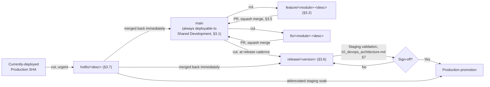
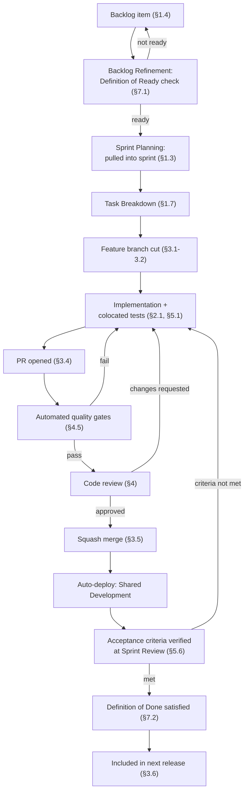
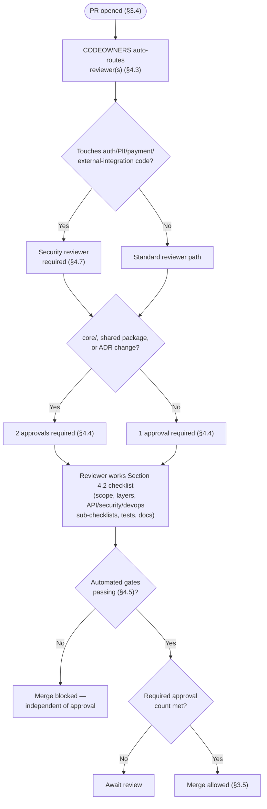
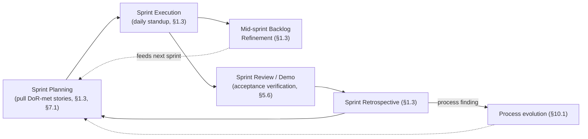
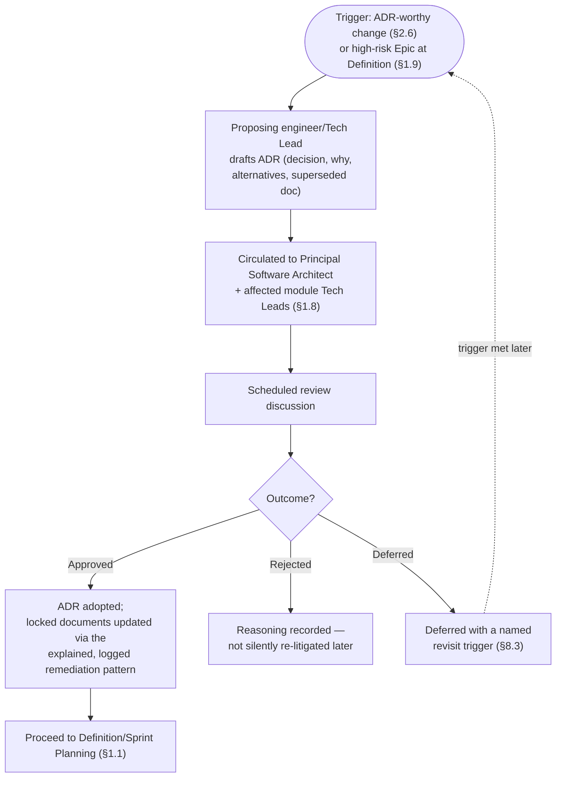

# Engineering Workflow

## National Furniture & Interiors Platform — Engineering Operating Manual

**Prepared by:** Enterprise Engineering Excellence Board (VP of Engineering, Principal Software Architect, Engineering Manager, Staff Engineer, Tech Lead, QA Lead, DevOps Lead, Product Manager)
**Date:** 2026-08-07
**Status of `01`–`10`:** APPROVED and LOCKED, source of truth. Never modified.
**Scope:** Not a coding guide — this document defines **how engineers develop software** on this platform: process, workflow, review, governance. No implementation code.

---

## Revision History

| Version | Date | Change | Reason |
|---|---|---|---|
| v1.0 | 2026-08-07 | Initial version | — |

---

## 0. Relationship to Locked Documents

`01`–`10` collectively already contain a surprising amount of *process*, not just architecture: `05_repository_strategy.md` §15 and `10_devops_architecture.md` §6 already designed the CI/CD pipeline and branch protection; `06_project_structure.md` §7.3 already named CODEOWNERS and a PR-template docs-checkbox; `08_api_architecture.md` §11–§13 already produced an API-specific review checklist and governance rules; `09_security_architecture.md` §11–§12 already produced secure-coding rules and a security review checklist; `10_devops_architecture.md` §6.3–6.8 already defined merge strategy, release strategy, and the hotfix process. This document does not re-decide any of that — it does three things none of `01`–`10` did:

1. **Names the human workflow** those mechanical processes sit inside — sprints, backlog, epics/stories, Definition of Ready/Done, escalation — none of which any prior document touched, since all ten were architecture/infrastructure documents, not process documents.
2. **Unifies the review/checklist patterns already established per-domain** (API review in `08`, security review in `09`, DevOps release review in `10`) into one coherent code-review process that references all three rather than inventing a fourth, conflicting one.
3. **Formalizes engineering standards and governance** (SOLID/Clean Architecture ownership, ADR process, escalation) that `02_enterprise_architecture.md` §1/§3 stated as *principles* but never turned into a *process* for applying and enforcing them day to day.

Every Git/CI/CD mechanic named in Sections 3–5 below is a **citation**, not a new design — `05_repository_strategy.md` and `10_devops_architecture.md` remain the source of truth for those mechanics; this document adds the human process around them.

---

## 1. Software Development Lifecycle

### 1.1 Project Lifecycle

The platform follows the phased delivery model already established by `01_business_research.md`'s MVP/roadmap framing (Interior Design → Lead Generation → Furniture eCommerce priority order) and `04_architecture_decision.md`'s extraction-trigger discipline — restated here as the engineering-process lifecycle those business phases move through:

| Phase | Engineering activity | Gate to next phase |
|---|---|---|
| Discovery | Product Manager + Tech Lead scope a capability against `01_business_research.md`'s priorities; Staff Engineer sanity-checks technical feasibility against `02`–`10`'s locked architecture | A shared, written understanding of scope — not a formal document, but never skipped |
| Definition | Epic broken into stories (Section 1.5); Definition of Ready (Section 7.1) applied per story | Every story in the epic meets Definition of Ready |
| Build | Sprint execution (Section 1.3); feature-branch development (Section 3) | Definition of Done (Section 7.2) met per story |
| Verification | Testing workflow (Section 5); code review (Section 4) | Quality gates (Section 7) pass |
| Release | Release process, confirmed unchanged from `10_devops_architecture.md` §7 | Release checklist (Section 9.5) passes |
| Operate | Monitoring/on-call per `10_devops_architecture.md` §11–§12 | N/A — continuous |

### 1.2 SDLC Diagram

```mermaid
flowchart LR
    Discovery["Discovery<br/>(scope vs. 01_business_research.md priorities)"] --> Definition["Definition<br/>(epics -> stories, DoR)"]
    Definition --> Build["Build<br/>(sprint execution, feature branches)"]
    Build --> Verify["Verification<br/>(code review, testing, DoD)"]
    Verify --> Release["Release<br/>(10_devops_architecture.md §7)"]
    Release --> Operate["Operate<br/>(monitoring, on-call, 10_devops_architecture.md §11-12)"]
    Operate -. feeds back as new backlog items .-> Discovery

    Verify -. fails quality gate .-> Build
    Release -. rollback, 10_devops_architecture.md §8.4 .-> Operate
```

### 1.3 Sprint Workflow

Two-week sprints (the default cadence — a Tech Lead may propose a different length for a specific team with Engineering Manager sign-off, but two weeks is the platform-wide default absent a stated reason to deviate):

| Ceremony | Cadence | Purpose |
|---|---|---|
| Sprint Planning | Start of sprint | Product Manager presents prioritized backlog (Section 1.4); team pulls stories meeting Definition of Ready (Section 7.1) up to committed capacity |
| Daily Standup | Daily | Blockers, dependency risk (Section 1.7) surfaced early — not a status-reporting ritual |
| Backlog Refinement | Mid-sprint | Upcoming stories reviewed for Definition-of-Ready gaps before they reach Planning, so Planning itself is fast |
| Sprint Review/Demo | End of sprint | Working software demonstrated against the original story acceptance criteria (Section 1.6) |
| Sprint Retrospective | End of sprint | Process improvement — the mechanism by which this document itself evolves (Section 10.1) |

### 1.4 Backlog Management

The backlog is a single, prioritized list per squad/module-group (aligned to `06_project_structure.md` §4.3's module ownership, Section 6.3 below), ordered by Product Manager in collaboration with Tech Lead, weighted by `01_business_research.md`'s business-priority order (Interior Design → Lead Generation → Furniture eCommerce) as the default tie-breaker when two items have otherwise-comparable value. Every backlog item is one of: Epic, Story, Bug, Tech Debt item, or Spike (a time-boxed investigation with no shippable output, used when Definition of Ready can't be met without research first, Section 7.1).

### 1.5 Epic Management

An Epic maps to a capability-sized unit of work — typically a full feature-module capability (e.g., "Return flow end-to-end," already fully designed in `02_enterprise_architecture.md` §20/`03_database_design.md` §9.3.8/`08_api_architecture.md`'s `orders` module contract) — owned by one Tech Lead for its duration, broken into Stories (Section 1.6) before Sprint Planning ever pulls work from it. An Epic is never itself "done" in a single sprint; it closes when every constituent Story is Done (Section 7.2) and the Epic's own acceptance criteria (stated at Epic creation, reviewed at Discovery, Section 1.1) are demonstrably met.

### 1.6 Story Management

A Story is the unit of sprint-committed work — small enough to complete within one sprint, with explicit acceptance criteria written before Sprint Planning (part of Definition of Ready, Section 7.1). Stories are written against the already-locked module/API contracts (`06_project_structure.md` §4.3, `08_api_architecture.md` §8) wherever applicable — a Story implementing a `design-projects` endpoint cites the exact endpoint contract from `08_api_architecture.md` §8's per-module table rather than restating or reinterpreting it, keeping the Story's scope unambiguous and traceable to the locked source of truth.

### 1.7 Task Breakdown

A Story is broken into Tasks (implementation-level units, typically owned by one engineer, completable within 1–2 days) only at Sprint Planning or during the sprint itself — never pre-broken-down at backlog-refinement time, since premature task breakdown tends to lock in an implementation approach before the engineer doing the work has actually looked at the code. Task breakdown follows the module's own layer structure (`06_project_structure.md` §4.3's `domain/application/infrastructure/presentation`) where useful as a natural task boundary, but is not mechanically forced into exactly four tasks per story.

### 1.8 Dependency Management

Two distinct kinds of dependency, tracked differently:

- **Cross-story/cross-team dependency** (Story B can't start until Story A's interface is stable): surfaced at Sprint Planning, visualized on the sprint board, and — critically — resolved by having Story A's owner **publish the interface contract early** (an API endpoint shape, a shared-package type) even before the full implementation lands, consistent with `06_project_structure.md` §6's package-dependency-graph discipline (a consumer depends on a stable interface, not on the producer's implementation timeline).
- **Cross-module architectural dependency** (a Story requires a change to a shared package like `@nfi/shared`, `05_repository_strategy.md` §9): flagged explicitly at Backlog Refinement, since a shared-package change has a wider blast radius (`06_project_structure.md` §6's dependency graph) and needs the affected consumers' Tech Leads looped in before the Story is pulled into a sprint, not discovered mid-sprint.

### 1.9 Risk Management

Every Epic (Section 1.5) carries an explicit risk assessment at Definition: technical risk (does this touch a module with known fragility or an area under active refactoring, Section 2.4), delivery risk (dependency chains, Section 1.8), and — specifically for this platform — the risk categories already named in `01_business_research.md` §9 and `09_security_architecture.md` §1.1 (compliance/PII risk, payment-flow risk) cross-checked at Epic Definition so a Story touching Tier 1 data (`09_security_architecture.md` §1.4) is flagged for Security Review (Section 4.7) before it's ever pulled into a sprint, not discovered during code review. High-risk Epics get an explicit Architecture Review (Section 8.3) before Definition is considered complete.

---

## 2. Development Workflow

### 2.1 Feature Development

Standard path: Story meets Definition of Ready (Section 7.1) → feature branch cut (Section 3.1) → implementation following the module's existing four-layer structure (`06_project_structure.md` §4.3) and the locked API/DB contracts (`08_api_architecture.md`, `03_database_design.md`) → tests written alongside code, not after (Section 5.1's colocation rule) → PR opened (Section 3.4) → code review (Section 4) → merge (Section 3.5, confirmed from `10_devops_architecture.md` §6.3's squash-merge rule) → deploys automatically to Shared Development (`10_devops_architecture.md` §3.2).

### 2.2 Bug Fix Workflow

A bug is triaged first (severity per the same tiering already established in `10_devops_architecture.md` §12's alerting severity table, reused here rather than inventing a separate bug-severity scale): a Critical/High-severity **production** bug follows the Hotfix Workflow (Section 2.3) instead; every other bug follows the standard Feature Development path (Section 2.1) with one addition — **a bug-fix PR must include a regression test that fails without the fix and passes with it** (Section 5.4), non-negotiable, since a bug fix without a regression test is a fix that can silently regress again.

### 2.3 Hotfix Workflow

Confirms `10_devops_architecture.md` §6.8 exactly — branched from the currently-deployed production SHA, same CI gates (no skipped checks even under time pressure, per `09_security_architecture.md` §11's anti-expedience rule), Staging soak abbreviated but not skipped, merged back to release and default branches immediately after production deployment. This document's addition: a Hotfix requires **Tech Lead or Engineering Manager approval to declare hotfix status** before branching — not every "urgent-feeling" bug qualifies, and mis-declaring a hotfix bypasses the normal sprint-planning visibility this document's Section 1 process otherwise provides, so the declaration itself is a checked decision point, not a self-service label an individual engineer applies unilaterally.

### 2.4 Refactoring Workflow

A refactor (behavior-preserving structural change) is scoped and time-boxed **before** it starts, not opened as an unbounded "clean this up while I'm here" side effect of an unrelated Story — mixing a refactor into a feature PR is explicitly discouraged (Section 4.1's review rules) because it makes the PR's actual behavioral change harder to review and its blast radius harder to reason about. A refactor large enough to touch a module boundary or a shared package (`06_project_structure.md` §6's dependency graph) requires the same Architecture Review trigger as a genuine architecture change (Section 2.6) — the distinguishing question is *scope of blast radius*, not the word "refactor" versus "architecture change."

### 2.5 Technical Debt Workflow

Tech debt items are backlog items (Section 1.4), not a parallel, informally-tracked list — every deliberately-accepted shortcut (an explicitly named example: the feature-flag "temporarily on for six months" cleanup case already flagged in `10_devops_architecture.md` §2.3) is logged as a Tech Debt backlog item **at the moment the shortcut is taken**, with the PR that introduces it linking to the tracking item, so debt is visible to Product Manager/Tech Lead prioritization rather than existing only in an engineer's memory or a `// TODO` comment nobody re-visits. Tech Debt items are prioritized against feature work using the same `01_business_research.md`-priority-order tie-breaker as Section 1.4, plus one additional weighting factor: debt in a module already flagged as an extraction candidate (`04_architecture_decision.md` §9.2's ranked list) is deprioritized relative to debt in a module with no extraction plan, since debt in a soon-to-be-extracted module is partially self-resolving at extraction time.

### 2.6 Architecture Change Workflow (ADR)

Any change that would alter a decision already recorded in `02_enterprise_architecture.md` §18's ADR Summary, `04_architecture_decision.md`, or any of the locked `01`–`10` documents' own decision tables goes through a **new, numbered ADR**, following the exact discipline already modeled by this document series itself (every one of `02`–`10` carries its own Revision History table with reasons) — a new ADR is a short, standalone document in `docs/adr/` (`06_project_structure.md` §8, already the named future location) stating: the decision being changed, why, the alternatives considered, and which locked document(s) it supersedes or amends. **An ADR requires Architecture Review (Section 8.3) before it's considered adopted** — no architecture decision is changed by a single engineer's PR alone, regardless of how well-reasoned, because the whole point of the `01`–`10` series being "locked" is that changing one requires the same rigor that produced it in the first place, not less.

---

## 3. Git Workflow

Every mechanic in this section confirms `05_repository_strategy.md` §7/§15 and `10_devops_architecture.md` §6 exactly — restated here as a unified, engineer-facing reference (previously split across two infrastructure-focused documents) rather than a new design.

### 3.1 Branch Strategy

Trunk-based with short-lived feature branches: `main` (the default branch, confirmed from `10_devops_architecture.md` §6.2) is always deployable to Shared Development; a release branch is cut from `main` at each release cadence (`10_devops_architecture.md` §6.4/§7); feature branches are cut from `main`, merged back to `main` via PR, and live no longer than the sprint that contains them (a feature branch outliving its sprint is itself a Section 9's sprint-checklist flag, since a long-lived branch accumulates merge-conflict risk against a monorepo whose `packages/` dependency graph, `06_project_structure.md` §6, many other engineers are simultaneously changing).

### 3.2 Naming Conventions

| Branch type | Pattern | Example |
|---|---|---|
| Feature | `feature/<module>-<short-description>` | `feature/design-projects-milestone-payment` |
| Bug fix | `fix/<module>-<short-description>` | `fix/orders-stock-reservation-race` |
| Hotfix | `hotfix/<short-description>` | `hotfix/webhook-signature-bypass` |
| Refactor | `refactor/<module>-<short-description>` | `refactor/leads-scoring-service` |
| Tech debt | `chore/<short-description>` | `chore/upgrade-vitest-major` |
| Release | `release/<version>` | `release/v2026.08.1` (matching `10_devops_architecture.md` §6.9's tag format) |

Branch names include the module name specifically so CODEOWNERS-adjacent reviewer routing (Section 4.3) and Turborepo's own affected-package detection (`10_devops_architecture.md` §5.1) are both legible from the branch name alone, before even opening the diff.

### 3.3 Commit Standards

Confirms `10_devops_architecture.md` §6.3 exactly: Conventional-Commits-style format (`feat(leads): ...`, `fix(orders): ...`, `chore(deps): ...`), enforced as a CI check, since Section 6.6/6.10 there (release-notes generation) and this document's own change-tracking both depend on structured commit messages. Commit scope (`leads`, `orders`, etc.) matches the module name (`06_project_structure.md` §4.3's 15-module list) — the same vocabulary used in branch naming (Section 3.2), permission keys (`08_api_architecture.md` §3.16), and CODEOWNERS (Section 4.3), so one consistent naming vocabulary threads through the entire engineering surface rather than four independently-invented ones.

### 3.4 Pull Request Process

A PR is opened as soon as a feature branch has meaningful, reviewable progress — draft PRs are encouraged for early feedback on approach, not discouraged as premature. A PR must: reference its backlog Story/Bug ID (Section 1.6/2.2), pass the full CI pipeline (`10_devops_architecture.md` §6.1, unchanged), and satisfy Section 4's code review before merge. The PR template (`06_project_structure.md` §7.3, confirmed unchanged) already includes the "does this change require a docs/ update?" checkbox from the `00_architecture_review.md` finding DX2 remediation — this document adds no new template field, only the process discipline that the checkbox is actually answered honestly, not reflexively checked "no."

### 3.5 Merge Strategy

Confirms `10_devops_architecture.md` §6.3 exactly: squash merge only, to `main` and to release branches — one PR becomes one commit, keeping the git-SHA-based image tagging (`10_devops_architecture.md` §4.3) and this document's own Section 3.3 commit-message discipline meaningful.

### 3.6 Release Branches

Confirms `10_devops_architecture.md` §6.4/§7 exactly — a release branch is cut at each release cadence, goes through the full release process (Staging validation, sign-off, production promotion) documented there in full; this document does not restate the mechanics, only positions release branches within the broader Git workflow (Section 3.1's trunk-based model, where `main` is the trunk and a release branch is a short-lived, promotable snapshot of it).

### 3.7 Hotfix Branches

Confirms `10_devops_architecture.md` §6.8 exactly — branched from the currently-deployed production SHA (not from `main`'s tip), same CI gates, abbreviated Staging soak, merged back to both the active release branch and `main` immediately after production deployment (Section 2.3 restates the process-governance addition — hotfix-status declaration requiring Tech Lead/EM sign-off).

---

## 4. Code Review

### 4.1 Review Rules

- Every PR requires **at least one approval** from a CODEOWNERS-matched reviewer (Section 4.3) before merge — confirmed unchanged from `05_repository_strategy.md` §15/`10_devops_architecture.md` §6.2.
- A reviewer approves only what they've actually read — an approval on an unread diff is a process violation, not a time-saving shortcut, since it defeats the entire purpose of the gate.
- **Refactoring and behavioral changes are not mixed in one PR** (Section 2.4) — a reviewer is entitled to request a PR be split if it conflates the two, before continuing review.
- Review turnaround target: first response within one business day — a PR sitting unreviewed is a sprint-flow blocker (Section 1.3's daily standup is where a stale PR should surface, not silently age).
- The author, not the reviewer, is responsible for keeping a PR small and reviewable — a PR whose diff is too large to review carefully in one sitting should be split by the author before requesting review, not reviewed superficially because it's already open.

### 4.2 Review Checklist

The single practical checklist a reviewer works through, **assembling** (not duplicating) the domain-specific checklists already locked elsewhere rather than inventing a fifth, overlapping one:

- [ ] Does the change do what the linked Story/Bug says, and only that (Section 4.1's scope discipline)?
- [ ] Does it follow the module's existing four-layer structure and not cross a module boundary improperly (`06_project_structure.md` §4.3, Section 6.1 below)?
- [ ] If it touches an API endpoint: does it satisfy `08_api_architecture.md` §11's Review Checklist (envelope shape, validation, permission key, rate-limit tier, audit logging, OpenAPI update)?
- [ ] If it touches auth, PII, an external integration, or file upload: does it satisfy `09_security_architecture.md` §12.3's per-PR Security Review Checklist?
- [ ] If it touches deploy/infra/CI configuration: does it satisfy the relevant `10_devops_architecture.md` §16 checklist item?
- [ ] Are tests present and meaningful, not just present (Section 5)?
- [ ] Does it need a documentation update, and if so, is that update included (Section 6, `06_project_structure.md` §7.3's PR-template checkbox)?
- [ ] Is the commit message/PR title correctly scoped per Section 3.3's convention?

### 4.3 Review Ownership

CODEOWNERS (`06_project_structure.md` §2.2, `04_architecture_decision.md` §10.1) maps each top-level folder and each of the 15 backend modules to an owning role — this document's addition is making that ownership **reviewer-routing**, not just a documentation artifact: a PR touching `apps/api/src/modules/design-projects/` is auto-requested for review from that module's owning Tech Lead (per the RBAC-role-to-module mapping already established in `06_project_structure.md` §4.3's module table); a PR touching a shared package (`packages/shared`, `packages/ui`) requires review from that package's owner **plus** a lightweight notification to every consuming module's owner (not a required approval from each — that would make shared-package changes unreasonably slow — but visibility, consistent with Section 1.8's dependency-management principle).

### 4.4 Approval Process

One approval is sufficient for a standard Feature/Bug PR (Section 4.1). **Two approvals are required** for: any PR modifying `apps/api/src/core/` (`06_project_structure.md` §4.2 — cross-cutting infrastructure every module depends on), any PR touching a shared package (Section 4.3), and any PR implementing or amending an ADR (Section 2.6). A hotfix (Section 2.3) requires one approval but from a Tech Lead or Engineering Manager specifically, not any CODEOWNERS-matched reviewer, given the abbreviated process around it.

### 4.5 Code Quality Gates

Confirms `10_devops_architecture.md` §5.5–5.10 exactly as the automated gate set (lint, format, type-check, dependency scan, license scan, image scan) — a PR cannot merge with any of these failing, full stop, regardless of reviewer approval; a human approval never overrides a failing automated gate (the two are independent, both-required conditions for merge, not a human veto over the machine or vice versa).

### 4.6 Architecture Review

Triggered per Section 2.6 (any ADR-worthy change) and Section 1.9 (high-risk Epics at Definition) — full process in Section 8.3. Distinguished here from ordinary code review: Architecture Review evaluates whether a change *should* happen and *how it fits* the locked `01`–`10` decision set; code review (this section) evaluates whether an already-approved-in-principle change is *implemented* correctly. A PR should never be the first place an architecture decision is actually made — by the time a PR exists, Architecture Review (if triggered) has already happened.

### 4.7 Security Review

Triggered per `09_security_architecture.md` §12.3's own stated trigger ("Per PR touching auth/data/external-integration code") — this document confirms that trigger unchanged and adds the routing mechanic: such a PR is auto-requested for review from the DevSecOps/Security-Architect-designated reviewer pool (an extension of Section 4.3's CODEOWNERS routing, scoped to security-sensitive paths specifically — `apps/api/src/modules/auth/`, `apps/api/src/modules/payments/`, `apps/api/src/core/security/`, per `06_project_structure.md` §4.2–4.3) — a security reviewer is a required approver on these paths, not an optional second opinion.

### 4.8 Performance Review

**Not previously specified in `01`–`10`** — new here. Triggered for any PR that: adds or modifies a database query pattern (cross-checked against `03_database_design.md` §10's index list — a new query without a backing index, per `08_api_architecture.md` §11's own checklist item, is flagged here too, not just at the API-review layer), adds a new external synchronous call in a request path (`10_devops_architecture.md` §5.9's timeout-budget table is the reference a reviewer checks the change against), or measurably changes a Section 5.9-relevant response-size/latency characteristic. Performance Review is a checklist item within standard code review (Section 4.2), not a separate gate/approval requirement — proportionate to how narrow this concern is relative to Security/Architecture Review's broader stakes.

---

## 5. Testing Workflow

### 5.1 Unit Tests

Vitest (`07_technology_decision_record.md` §17.1), colocated with the code under test (`06_project_structure.md` §4.6's `__tests__/` convention inside each module's own layer) — written **alongside** implementation, not as a separate follow-up task (Section 2.1). Unit tests target the Domain and Application layers specifically (`02_enterprise_architecture.md` §16's testing strategy, confirmed unchanged), with repository/adapter port interfaces mocked — a unit test never touches a real database or a real external service call.

### 5.2 Integration Tests

`apps/api/tests/` (module-crossing, `06_project_structure.md` §4.6) and root `testing/integration/` (`06_project_structure.md` §9) — run against a real, containerized MongoDB/Redis instance (`02_enterprise_architecture.md` §16, `10_devops_architecture.md` §3.3's Testing environment), exercising the Infrastructure layer specifically, and any operation `03_database_design.md` §13.1 flagged as needing genuine cross-collection atomicity verification (the order-checkout-plus-inventory-reservation transaction, the lead-conversion transaction) — these are exactly the operations `00_architecture_review.md` finding D2's remediation specifically called out as needing this kind of test, cited here as the concrete example of what belongs in this tier.

### 5.3 End-to-End Tests

Playwright (`07_technology_decision_record.md` §17.2), root `testing/e2e/` (`06_project_structure.md` §9), scoped deliberately narrow (`08_api_architecture.md` §9.3's Rule 9's cost-awareness applied to E2E specifically) — covering the highest-value cross-boundary flows named in `04_architecture_decision.md` §10.10: full checkout, full lead-to-design-project conversion, and (added since that document, per the v1.1 remediation) the Return Flow (`02_enterprise_architecture.md` §20). E2E coverage is expanded deliberately, flow by flow, prioritized by Section 1.9's risk assessment — never broadly, given the acknowledged cost of this test tier.

### 5.4 Regression Tests

Confirms Section 2.2's bug-fix rule: every bug-fix PR includes a regression test reproducing the original defect. Regression tests live at whichever tier (unit/integration/e2e) actually reproduces the bug — a regression test for a Domain-layer logic bug is a unit test; a regression test for the inventory-race bug `02_enterprise_architecture.md` §11/`03_database_design.md` §9.2.6 already resolved is an integration test exercising concurrent requests, since a unit test with mocked dependencies cannot reproduce a genuine concurrency race.

### 5.5 Smoke Tests

Confirms `10_devops_architecture.md` §7's release-process step 3/step 6 exactly (Staging smoke tests after deploy) — a narrow, fast subset of E2E-tier checks confirming the platform's core paths are minimally functional post-deploy, distinct from full E2E coverage in both scope (narrower) and purpose (deploy-verification, not feature-correctness-verification).

### 5.6 Acceptance Tests

Distinct from automated E2E: **acceptance criteria are written into every Story at Definition of Ready (Section 7.1)** and verified at Sprint Review (Section 1.3) against the running Shared Development/Staging environment by Product Manager and QA Lead — a human verification against business intent, complementing rather than duplicating Section 5.3's automated E2E coverage of technical-flow correctness. A Story is not Done (Section 7.2) until its acceptance criteria are verified this way, in addition to its automated tests passing.

### 5.7 Coverage Requirements

Confirms the coverage-threshold configuration item already flagged as needing to be set once Vitest was adopted (`00_architecture_review.md` finding DX3, `07_technology_decision_record.md` §17.1) — set here: **80% line coverage minimum** on the Domain and Application layers specifically (where business logic actually lives and where a regression is most costly), enforced as a CI gate (Section 4.5) on affected packages; the Presentation and Infrastructure layers have no hard-enforced minimum (a thin controller or a thin repository wrapper often has little independently-meaningful logic to cover), though a reviewer (Section 4.2) can still flag a genuinely undertested Infrastructure-layer piece of logic (e.g., the outbox relay, `02_enterprise_architecture.md` §16) on its merits. Coverage is a **floor, not a target** — a PR meeting 80% is not thereby considered "well-tested" without further review judgment; it's the minimum below which a PR cannot merge at all.

---

## 6. Documentation Workflow

### 6.1 When Documentation Must Be Updated

Confirms and operationalizes `06_project_structure.md` §7.3's PR-template checkbox (from the `00_architecture_review.md` finding DX2 remediation): documentation update is required, not optional, when a PR: changes an API contract (`08_api_architecture.md` §6.1's OpenAPI-from-Zod generation handles this largely automatically — but any narrative documentation in `docs/api/` still needs a human check), changes a module's ownership or boundary (`06_project_structure.md` §2.2), implements or amends an ADR (Section 2.6), or changes any process this very document (`11_engineering_workflow.md`) describes (Section 10.1). A PR whose diff clearly falls into one of these categories but leaves the checkbox unchecked is a valid reviewer objection under Section 4.2's checklist — not a formality, an enforced review criterion.

### 6.2 ADR Process

Confirms Section 2.6 in full — restated here only to place it within the Documentation Workflow section the brief explicitly asks for, not duplicated with new content.

### 6.3 API Documentation

Confirms `08_api_architecture.md` §6.1 exactly: OpenAPI spec generated from Zod validators as a CI step, never hand-maintained separately — this document's addition is the process discipline that a PR changing a validator without the spec regenerating correctly (a CI-detectable condition) fails the build, per `08_api_architecture.md` §6.1's own stated mechanism, confirmed here as an enforced Section 4.5 quality gate, not a best-effort convention.

### 6.4 Release Notes

Confirms `10_devops_architecture.md` §6.10 exactly: auto-generated from Conventional-Commits-formatted PR titles (Section 3.3) at every release tag — this document's addition is the discipline that makes the auto-generation actually useful: a PR title following Section 3.3's convention but written vaguely (`fix(orders): fix bug`) produces a useless release note even though it satisfies the mechanical format check — reviewers (Section 4.1) are expected to request a clearer title, since release-note quality is a downstream consequence of PR-title quality that automation alone can't fix.

### 6.5 Developer Documentation

`docs/developer-guide/` (`06_project_structure.md` §8, extended per-domain in `08_api_architecture.md` §6.6 and `10_devops_architecture.md` §14.4) gets this document's own contribution: an "Engineering Workflow" onboarding section walking a new engineer through Sections 1–5 of this document in the order they'll actually encounter them (backlog → branch → PR → review → merge), cross-linking to the deeper per-domain documents (`05`, `08`, `09`, `10`) rather than re-explaining their content — the same "onboarding path through the numbered series in order" pattern `06_project_structure.md` §8 already established for the document series as a whole, now given a workflow-specific entry point.

---

## 7. Quality Gates

### 7.1 Definition of Ready

A Story may be pulled into Sprint Planning (Section 1.3) only when:

- [ ] Acceptance criteria are written and unambiguous (Section 5.6)
- [ ] The Story cites the specific locked-document contract it implements against, where one exists (e.g., a specific row in `08_api_architecture.md` §8's per-module table, a specific collection in `03_database_design.md` §9) — a Story with no such citation for a piece of work that clearly has one is a signal the Story wasn't scoped carefully
- [ ] Cross-story/cross-team dependencies (Section 1.8) are identified, not discovered mid-sprint
- [ ] Sizing/estimation has happened (however the team does this — this document does not mandate a specific estimation technique, e.g. points vs. hours, leaving that as a team-level choice)
- [ ] If the Story touches Tier 1/Tier 2 data (`09_security_architecture.md` §1.4) or a payment/auth flow, Security Review involvement (Section 4.7) is flagged in advance, not discovered at PR time

### 7.2 Definition of Done

A Story is Done only when:

- [ ] Code merged to `main` (Section 3.5)
- [ ] All Section 4.5 automated quality gates passing
- [ ] Code review (Section 4) approved per the correct approval-count rule (Section 4.4)
- [ ] Tests present and passing at the appropriate tier(s) (Section 5), meeting Section 5.7's coverage floor
- [ ] Documentation updated where Section 6.1 requires it
- [ ] Acceptance criteria verified against a running environment (Section 5.6) — not just "the code looks right," but demonstrated
- [ ] Deployed to Shared Development (`10_devops_architecture.md` §3.2) and confirmed functioning there

### 7.3 Merge Requirements

Confirms Section 4.5 (automated gates) + Section 4.1/4.4 (review approval) as the complete, non-negotiable merge condition — restated as a single checklist for clarity, not new content: CI green, correct approval count obtained, PR scope discipline honored (Section 4.1), documentation checkbox correctly answered (Section 6.1).

### 7.4 Release Requirements

Confirms `10_devops_architecture.md` §16.2's Release Checklist exactly — every Story in the release meets Definition of Done (Section 7.2), Staging validation and sign-off obtained, release notes reviewed for quality (Section 6.4). Not restated in full here to avoid duplicating that document's checklist; this document's contribution is only tying "every Story in the release meets DoD" explicitly into the release gate, which `10_devops_architecture.md` didn't need to state since it wasn't scoped to Story-level process.

### 7.5 Production Requirements

Confirms `02_enterprise_architecture.md` §17, `09_security_architecture.md` §12.1, and `10_devops_architecture.md` §16.3's three production-readiness checklists — this document adds no new production gate, only the process note that these three checklists are **reviewed together, not independently**, at any milestone claiming "production-ready" status (e.g., a Phase/MVP launch gate) — a launch decision references all three by name, not just whichever one a particular reviewer happened to remember.

---

## 8. Project Governance

### 8.1 Decision Process

Three decision tiers, matched to the same escalation ladder Section 8.2 formalizes:

| Decision scope | Made by | Example |
|---|---|---|
| Implementation detail within an already-scoped Story | Individual engineer | Variable naming, internal function structure within a module's existing layer |
| Module-level design choice within locked architecture | Tech Lead (module owner, Section 4.3) | How a specific use case is internally organized within `application/` |
| Cross-module or architecture-affecting change | Architecture Review (Section 8.3), requires an ADR (Section 2.6) | Adding a new shared package, changing a locked API contract, altering the RBAC model |

### 8.2 Escalation Process

An engineer blocked by ambiguity escalates **up one tier at a time**, not straight to VP of Engineering: engineer → Tech Lead (module-level ambiguity) → Engineering Manager (cross-team/prioritization ambiguity) → Principal Software Architect (architecture-scope ambiguity, triggers Section 8.3 if it's genuinely decision-worthy) → VP of Engineering (only for organizational/resourcing conflicts the prior tiers can't resolve, e.g., two Tech Leads disagreeing on module ownership boundary in a way that affects roadmap commitments). Escalation is expected and encouraged when genuinely blocked — the Section 1.3 daily standup is the primary surface where a blocker becomes visible before it needs formal escalation at all.

### 8.3 Architecture Review Process

Distinguished from ordinary code review (Section 4.6): triggered by Section 2.6 (ADR-worthy change) or Section 1.9 (high-risk Epic at Definition). Process: the proposing engineer/Tech Lead writes the ADR draft (Section 2.6's content requirements) → circulated to the Principal Software Architect and any Tech Leads whose modules are affected (per Section 1.8's dependency-visibility principle) → a scheduled review discussion (not an asynchronous-only approval, given the stakes) → outcome is Approved (ADR adopted, locked documents updated per the same disciplined, explained-and-logged remediation pattern already modeled by the `01`–`04` v1.1 remediation), Rejected (with reasoning recorded, so the same proposal isn't silently re-litigated later without new information), or Deferred (a legitimate outcome for a proposal that's directionally reasonable but not yet triggered — consistent with the trigger-based-deferral pattern this whole document series uses repeatedly, e.g. `07_technology_decision_record.md` §12.2, `10_devops_architecture.md` §6.7).

### 8.4 Risk Review Process

Confirms Section 1.9's per-Epic risk assessment as the point-of-entry; this section adds the **ongoing** risk review: a standing, lightweight review (folded into the existing quarterly cadence already established in `10_devops_architecture.md` §16.4 rather than inventing a new recurring meeting) covering open Tech Debt items whose risk profile has changed (Section 2.5), any Epic-level risk flagged at Definition that hasn't yet been resolved, and cross-reference against `09_security_architecture.md` §15's and `10_devops_architecture.md` §19's own open-items lists — this document's Risk Review is the forum where those two documents' open items get revisited for whether their deferral triggers have been met, not a separate risk registry duplicating theirs.

### 8.5 Change Management

Confirms Section 2.6's ADR process as the mechanism for changing anything in the locked `01`–`10` series. For changing **this document** specifically: Section 10.1 (Retrospective-driven evolution) is the primary path for process-level changes; a change to this document that also touches a locked architecture/security/devops decision goes through both this document's own update process and Section 2.6's ADR process for the underlying decision, in that order — this document's process rules can evolve more fluidly than the architecture itself, but a process change is never used as a backdoor to silently alter what a locked document actually requires.

---

## 9. Engineering Standards

### 9.1 SOLID

Confirms `02_enterprise_architecture.md` §3 exactly (unchanged) — this document's addition is making SOLID adherence a **reviewable** criterion, not just a stated principle: Section 4.2's review checklist item "does it follow the module's existing four-layer structure" is, in practice, largely a SOLID-adherence check (a controller containing business logic is a Single-Responsibility violation; a use case directly `new`-ing a Mongoose repository instead of depending on its port interface is a Dependency-Inversion violation) — reviewers cite the specific SOLID principle by name when requesting a change on these grounds, so the principle stays a living review vocabulary, not an abstract architecture-document statement nobody re-reads day to day.

### 9.2 DRY

Applied with the same discipline `05_repository_strategy.md` §9 and `06_project_structure.md` §5 already used to **reject** premature abstraction (the decision not to fragment `@nfi/shared` into `types`/`shared-validation`/`shared-constants` packages, `06_project_structure.md` §5's table) — DRY is a reviewable concern when genuine duplication crosses a module or package boundary with a real second consumer (Section 1.8's dependency-management trigger), not a license to abstract a single-use piece of logic into a "just in case" shared utility before a second consumer actually exists. A reviewer citing DRY should be able to name the second consumer, not just the principle.

### 9.3 KISS

The recurring, explicitly-named reasoning pattern already used throughout `07_technology_decision_record.md` (choosing Zustand over Redux Toolkit, a manual composition root over a DI framework, Vitest over Jest) and `10_devops_architecture.md` (deferring canary deployment) — confirmed here as a standing review criterion: a PR introducing meaningfully more complexity (a new abstraction layer, a new dependency, a new pattern) than the problem it solves requires is a valid Section 4.2 review objection, with the burden of justification on the complexity, not on the objection.

### 9.4 Clean Architecture

Confirms `02_enterprise_architecture.md` §5 and `06_project_structure.md` §4.3/§12 exactly (unchanged) — the dependency rule (Presentation → Application → Domain ← Infrastructure) is enforced both structurally (the ESLint module-boundary rule, `07_technology_decision_record.md` §20.2) and as a Section 4.2 review checklist item — two independent enforcement layers, consistent with the defense-in-depth principle this document series applies everywhere else (`09_security_architecture.md`'s repeated two-layer-control pattern), applied here to architectural discipline rather than security.

### 9.5 Feature Ownership

An Epic (Section 1.5) has one owning Tech Lead for its full lifecycle, from Definition through Release — feature ownership doesn't rotate mid-Epic even if individual engineers implementing Stories within it change, so there's always one person who can answer "why does this feature work this way" without archaeology.

### 9.6 Code Ownership

Confirms Section 4.3/CODEOWNERS exactly — restated here as an Engineering Standard, not just a review-routing mechanic: code ownership means the owning Tech Lead is accountable for that module's ongoing health (test coverage trend, Tech Debt backlog, Section 5.7/2.5), not just for approving PRs that touch it reactively.

### 9.7 Module Ownership

Confirms `06_project_structure.md` §4.3's 15-module-to-role mapping exactly — this document's addition: module ownership is reviewed at the same quarterly cadence as Section 8.4's risk review, since team growth (Section 11.2) or a module's extraction (`04_architecture_decision.md` §9.2) can legitimately change who should own a module, and an ownership mapping that's silently gone stale is a knowledge-sharing risk (Section 11.4) as much as a process one.

---

## 10. Process Evolution

Not one of the brief's explicit top-level headings, but the connective piece Sections 1.3/8.5 both reference and need stated once: this document is itself subject to the same "locked but not frozen" discipline as `01`–`10` — a process gap discovered during a Sprint Retrospective (Section 1.3) that reveals a real, recurring problem is a valid trigger for a Section 8.5 change-management-governed update to this document, following the same Revision-History-tracked, reasoned-change discipline modeled by every one of `02`–`10`'s own v1.1 remediation entries.

### 10.1 Retrospective-Driven Evolution

A Sprint Retrospective (Section 1.3) finding that surfaces a genuine, recurring process problem (not a one-off complaint) is escalated to Engineering Manager, who determines whether it warrants a Section 8.5 update to this document — the same fail-closed-toward-rigor discipline applied elsewhere in this series (`08_api_architecture.md` §12's governance rules) applies here too: this document does not get informally reinterpreted team by team over time without a recorded, reasoned change.

---

## 11. Diagrams

### 11.1 Software Development Lifecycle Diagram

See Section 1.2 — not repeated here to avoid duplication.

### 11.2 Git Workflow Diagram



### 11.3 Feature Lifecycle Diagram



### 11.4 Code Review Flow



### 11.5 Release Flow

Confirms `10_devops_architecture.md` §15.6 exactly — not reproduced again here to avoid duplicating an unchanged diagram; this document's Section 7.4 states the Story-level Definition-of-Done precondition that diagram's "Release branch cut" step assumes is already satisfied for every included Story.

### 11.6 Sprint Lifecycle



### 11.7 Architecture Review Process



---

## 12. Checklists

### 12.1 Developer Checklist

- [ ] Story meets Definition of Ready before I pull it into a sprint commitment (Section 7.1)
- [ ] Branch named per Section 3.2's convention, cut from the correct base (Section 3.1/3.7)
- [ ] Tests written alongside implementation, not deferred (Section 5.1)
- [ ] Commit messages follow Conventional-Commits scoping (Section 3.3)
- [ ] PR scope is one coherent change — refactor and behavior change not mixed (Section 2.4, 4.1)
- [ ] I've self-reviewed my own diff before requesting review (catches the obvious before a reviewer has to)
- [ ] Documentation checkbox (Section 6.1) answered honestly, not reflexively

### 12.2 Pull Request Checklist

Confirms Section 4.2 in full — not restated here to avoid duplication; that section **is** the Pull Request Checklist.

### 12.3 Architecture Review Checklist

- [ ] Is this genuinely ADR-worthy (changes a locked `01`–`10` decision) or is it within existing module-owner discretion (Section 8.1)?
- [ ] Does the ADR draft state the alternatives considered, not just the chosen option (Section 2.6)?
- [ ] Have all affected module Tech Leads (per the dependency graph, Section 1.8) been looped in, not just the proposer's own module?
- [ ] Does the outcome get recorded regardless of Approved/Rejected/Deferred (Section 8.3) — a silent non-decision is not an acceptable outcome?
- [ ] If Deferred, is there a named, checkable revisit trigger (Section 8.3), not a vague "someday"?

### 12.4 Sprint Checklist

- [ ] Every story pulled into Planning meets Definition of Ready (Section 7.1)
- [ ] Cross-story/cross-team dependencies surfaced at Planning, not discovered mid-sprint (Section 1.8)
- [ ] Daily standup actually surfaces blockers, not just status (Section 1.3)
- [ ] Acceptance criteria verified at Sprint Review against a real environment, not just described (Section 5.6)
- [ ] Retrospective findings that recur across sprints are escalated for process evolution (Section 10.1), not silently repeated sprint after sprint

### 12.5 Release Checklist

Confirms `10_devops_architecture.md` §16.2 in full, plus this document's Section 7.4 addition (every included Story meets Definition of Done) — not restated in full to avoid duplicating that document's checklist.

---

## 13. Evaluation

| Dimension | Assessment |
|---|---|
| **Developer Experience** | The single largest DX contribution of this document is reducing "which checklist do I use" ambiguity: Section 4.2 explicitly assembles, rather than duplicates, the API/Security/DevOps checklists already locked in `08`/`09`/`10` — a reviewer works one list that correctly routes to the domain-specific ones only when triggered, instead of needing to independently remember three separate documents exist. Combined with `10_devops_architecture.md` §14's local-setup/pre-commit tooling, an engineer's day-to-day loop (branch → code → PR → review → merge → auto-deploy to Shared Dev) is fully specified end to end with no ambiguous handoff. |
| **Team Scalability** | Section 4.3's CODEOWNERS-based reviewer routing and Section 9.5–9.7's ownership model are both built around the same 15-module vocabulary already established in `06_project_structure.md` — meaning this process scales the same way that document's structure was designed to scale (Section 14's "Future Microservice Migration" row): adding a new engineer means adding them to one module's ownership, not re-explaining a bespoke process; adding a new module means the process already has a template (Section 4.2–4.4) ready to apply to it. |
| **Maintainability** | Every process rule in this document traces to a specific already-locked mechanism (Git conventions from `05`/`10`, review checklists from `08`/`09`, ownership from `06`) rather than inventing parallel process infrastructure — this is the same "don't duplicate what's already decided" discipline the whole `01`–`11` series has applied throughout, which is what keeps eleven documents from drifting into mutual contradiction as the platform evolves. |
| **Knowledge Sharing** | Section 9.5's Epic-level feature ownership, Section 6.5's onboarding path, and Section 8.3's requirement that Architecture Review outcomes are *recorded* (Approved/Rejected/Deferred, never a silent non-decision) collectively mean institutional knowledge accumulates in written, findable form (ADRs, the document series itself) rather than living only in individual engineers' memory — directly mitigating the "why does this work this way" archaeology problem a fast-growing engineering team is otherwise prone to. |
| **Operational Excellence** | Section 7's three quality gates (DoR, DoD, Release/Production Requirements) and Section 8.4's risk-review cadence tie this document's process directly into `10_devops_architecture.md`'s own operational checklists rather than running as a parallel, disconnected "engineering process" track — a Story is never Done in a way that's disconnected from whether it's actually operating correctly in a real environment (Section 7.2's explicit "confirmed functioning in Shared Development" requirement). |
| **Long-Term Sustainability** | Section 10's process-evolution mechanism and Section 2.5's Tech Debt workflow are this document's two strongest sustainability levers: process problems have an explicit, non-ad-hoc path to being fixed (Retrospective → Engineering Manager → Section 8.5 change management), and technical debt is tracked as a first-class, prioritized backlog citizen rather than an invisible, ever-growing liability — both are deliberately designed to prevent this document (and the codebase it governs) from becoming brittle or stale the way an unmaintained process or an untracked-debt codebase typically does. |

---

## 14. Consistency Check Against Locked Documents

| Locked decision | Where | How this document complies |
|---|---|---|
| Squash merge, Conventional Commits, branch protection | `10_devops_architecture.md` §6.2–6.3 | Confirmed unchanged (Section 3.3, 3.5); given engineer-facing naming conventions (Section 3.2) |
| Hotfix process (branch from prod SHA, same CI gates, merge back immediately) | `10_devops_architecture.md` §6.8 | Confirmed unchanged (Section 3.7); hotfix-declaration governance added (Section 2.3) |
| Release process (Staging validation, sign-off, promotion) | `10_devops_architecture.md` §7, §16.2 | Confirmed unchanged (Section 3.6, 7.4); tied to Story-level Definition of Done |
| CODEOWNERS, module ownership | `06_project_structure.md` §2.2, §4.3, `04_architecture_decision.md` §10.1 | Confirmed unchanged; made into reviewer-routing mechanic (Section 4.3) |
| API review checklist, API governance rules | `08_api_architecture.md` §11–§13 | Confirmed unchanged, referenced not duplicated (Section 4.2, 4.7) |
| Secure coding rules, security review checklist | `09_security_architecture.md` §11–§12 | Confirmed unchanged, referenced not duplicated (Section 4.2, 4.7) |
| Vitest/Playwright testing stack, coverage gap (finding DX3) | `07_technology_decision_record.md` §17, `00_architecture_review.md` finding DX3 | Confirmed unchanged; coverage threshold set for the first time (Section 5.7), closing the named open item |
| Clean Architecture, SOLID, module four-layer structure | `02_enterprise_architecture.md` §1, §3, §5, `06_project_structure.md` §4.3 | Confirmed unchanged; made reviewable (Section 9.1, 9.4) |
| PR-template docs-update checkbox (finding DX2) | `06_project_structure.md` §7.3 | Confirmed unchanged; operationalized as an enforced review criterion (Section 6.1) |
| `docs/adr/` future folder | `04_architecture_decision.md` §10.7, `06_project_structure.md` §8 | Confirmed as the location the ADR process (Section 2.6, 8.3) populates |
| Business-priority order (Design → Leads → eCommerce) | `01_business_research.md` | Confirmed as the backlog/tech-debt prioritization tie-breaker (Section 1.4, 2.5) |
| Extraction-trigger, deferral-with-named-trigger discipline | `04_architecture_decision.md` §9.1, used throughout `07`–`10` | Confirmed and extended to Architecture Review outcomes generally (Section 8.3) |

No finding in this document required reopening any decision in `01`–`10`.

---

## 15. Open Items

- **Estimation technique** (points vs. hours vs. no formal estimation) is deliberately left as a team-level choice (Section 7.1) rather than mandated platform-wide — revisit only if cross-team capacity comparison becomes a real, recurring planning problem.
- **Sprint length** (Section 1.3's two-week default) may prove wrong for a specific team's actual delivery rhythm once real velocity data exists — a Tech Lead + Engineering Manager decision to deviate, not a gap in this document.
- **Formal Story-point-to-risk-weighting formula** for Section 8.4's ongoing risk review is intentionally left as a qualitative process for now, consistent with this platform's current team size — a quantitative model is worth building only once risk-review findings are frequent/complex enough that a qualitative pass stops scaling.
- **This document's own review cadence** — Section 10.1 describes how it evolves reactively (Retrospective-driven); a proactive, scheduled review of this document itself (e.g., annually) is worth adding once the team has enough history with it to know whether reactive evolution alone is sufficient or whether a periodic full read-through catches things reactive triggers miss.
