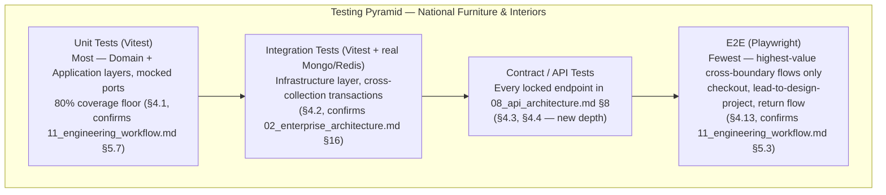
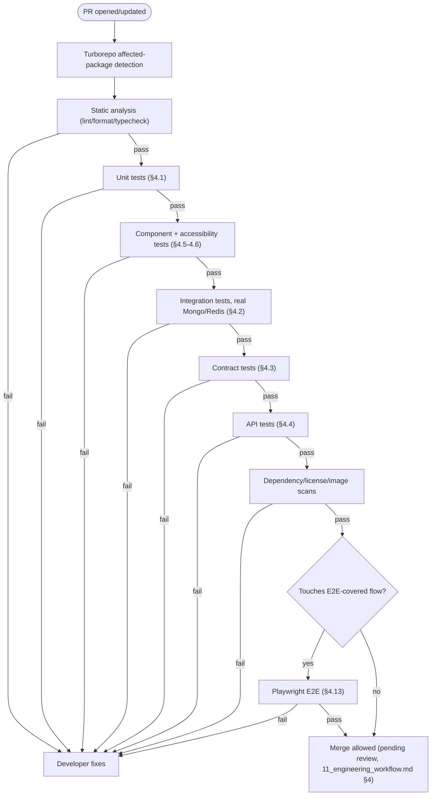
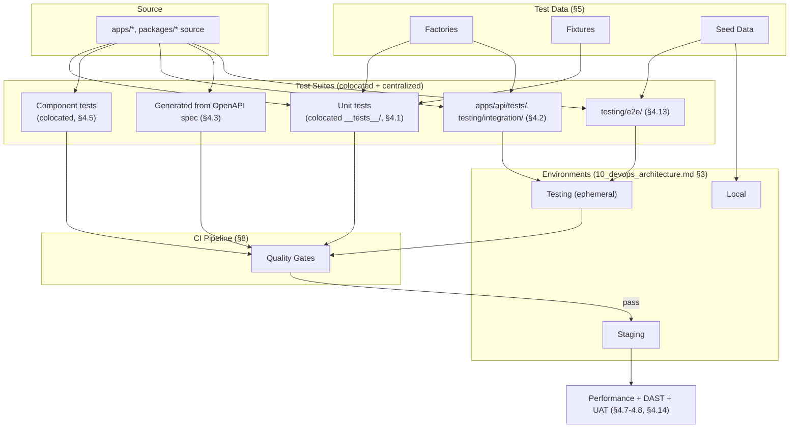
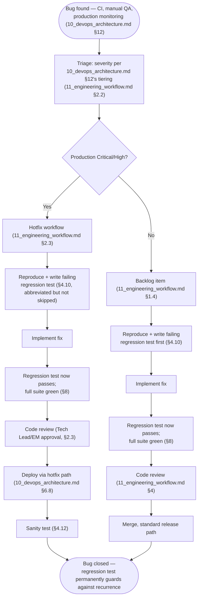
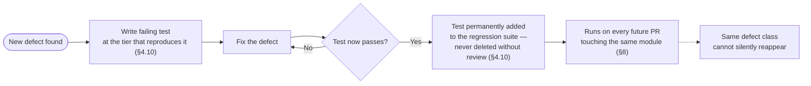

# Enterprise Testing Strategy

## National Furniture & Interiors Platform

**Prepared by:** Enterprise Quality Engineering Review Board (Principal QA Architect, Test Automation Architect, Principal Software Architect, Engineering Manager, Staff Backend Engineer, Staff Frontend Engineer, DevOps Engineer, Security Architect)
**Date:** 2026-08-07
**Status of `01`–`11`:** APPROVED and LOCKED, source of truth. Never modified.
**Scope:** Only how quality is assured — not architecture, not APIs, not DevOps. No implementation code.

---

## Revision History

| Version | Date | Change | Reason |
|---|---|---|---|
| v1.0 | 2026-08-07 | Initial version | — |

---

## 0. Relationship to Locked Documents

Testing has already appeared, piecemeal, in five prior documents: `02_enterprise_architecture.md` §16 named the testing strategy ("Domain/Application unit-tested with mocked interfaces; Infrastructure covered by integration tests"); `06_project_structure.md` §9/§4.6 named the folder locations (`testing/e2e/`, `testing/integration/`, `apps/api/tests/`, colocated `__tests__/`); `07_technology_decision_record.md` §17 chose the tools (Vitest, Playwright); `08_api_architecture.md` §6.1 named OpenAPI-contract-generation as a still-open item (`00_architecture_review.md` finding A6); `09_security_architecture.md` never designed dedicated security *testing* (it designed security *controls*); `10_devops_architecture.md` §3.3 designed the ephemeral Testing environment those tests run against and §5.9 designed dependency/image scanning as CI gates; `11_engineering_workflow.md` §5 designed the *process* around testing (when tests are written, DoR/DoD gates, an 80% coverage floor on Domain/Application layers, a bug-fix regression-test requirement) without designing the *strategy* (what kinds of tests exist, how they compose into a pyramid, how they cover risk).

This document is where those five partial threads become one coherent strategy. Three things it explicitly does not do:

1. **It does not re-choose tools.** Vitest and Playwright (`07_technology_decision_record.md` §17.1–17.2) remain the only test runners; this document specifies how they're used, not whether they're used.
2. **It does not re-design CI.** `10_devops_architecture.md` §6.1's pipeline shape (affected-package detection, gated merge) is confirmed unchanged; Section 8 below places testing stages within that already-designed pipeline.
3. **It closes exactly one previously-open item** (`00_architecture_review.md` finding A6's contract-testing recommendation, `08_api_architecture.md` §6.1) by fully designing Contract Testing (Section 4.3) for the first time — everything else genuinely new here (Accessibility, Chaos, Mock Strategy, Flaky Test Policy) fills a gap none of `01`–`11` claimed to own, rather than reopening one that was already decided.

---

## 1. Analysis

### 1.1 Business Risks

Re-reads `01_business_research.md`'s priority order (Interior Design → Lead Generation → Furniture eCommerce) through a testing lens: the highest-value, highest-consequence flows get the deepest, most redundant test coverage across pyramid tiers (Section 2), not uniform coverage depth applied blindly across all 15 modules. A defect in `design-projects` (multi-month, high-value engagements, `09_security_architecture.md` §1.14) or `orders`/`payments` (direct revenue, `10_devops_architecture.md` §1.8's criticality ranking) is categorically more expensive than a defect in `cms` — Section 3's per-module table and Section 1.6's risk-based prioritization make this explicit rather than leaving test-effort allocation to individual engineer discretion.

### 1.2 Architecture

Clean Architecture's four layers (`02_enterprise_architecture.md` §5, confirmed unchanged) map directly onto the testing pyramid's tiers (Section 2.1): Domain/Application layers are unit-test territory (framework-free, fast, no I/O); Infrastructure is integration-test territory (real MongoDB/Redis, per `10_devops_architecture.md` §3.3's Testing environment); Presentation is where API/contract testing (Section 4.2–4.3) lives; cross-module, cross-app flows are E2E territory (Section 4.13). This alignment is not a new decision — `02_enterprise_architecture.md` §16 already stated it in one sentence; this document is the full elaboration of that one sentence.

### 1.3 API

`08_api_architecture.md`'s 15-module contract table (§8) is the direct input to Section 3's per-module test-scope table below — every endpoint, permission key, and validation rule already specified there is a concrete, checkable thing a test can assert against, not a fresh design surface. The OpenAPI spec generated from Zod validators (`08_api_architecture.md` §6.1) is also the mechanical foundation Contract Testing (Section 4.3) is built on.

### 1.4 Database

`03_database_design.md`'s validation rules (§12), index strategy (§10), and the two operations flagged as needing genuine transaction-level testing (§13.1 — order checkout/inventory reservation, lead conversion) are the direct input to Section 3's boundary-case and negative-scenario columns, and to Section 4.2's integration-testing design specifically.

### 1.5 Security

`09_security_architecture.md`'s threat model (§1.2), per-module security profile (§10), and OWASP mappings (§8.1–8.3) are the direct input to Section 4.9's Security Testing design and Section 3's per-module security-risk column — this document does not re-derive threats, it turns already-identified threats into test cases.

### 1.6 Infrastructure

`10_devops_architecture.md`'s environment strategy (§3) supplies the environments tests actually run in (Section 5.2 below), and its CI pipeline (§6.1) is where every testing stage in Section 8 slots in — no new environment or pipeline is introduced.

### 1.7 Engineering Workflow

`11_engineering_workflow.md` §5's testing-workflow section (when tests are written, DoD's testing requirement, the 80% coverage floor, the bug-fix regression-test rule) is confirmed unchanged and is the process layer this document's strategy operates inside — Section 6 below extends coverage targets to tiers `11_engineering_workflow.md` §5.7 didn't set a number for, it doesn't change the number already set.

---

## 2. Testing Pyramid, Philosophy, and Approach

### 2.1 Testing Pyramid



**Ratio, stated as a principle rather than a rigid percentage:** the number of tests shrinks and the cost/slowness/flakiness-risk grows moving up the pyramid — this is not a new idea, but it is the organizing principle behind every "how much of X should be tested at tier Y" decision in Sections 3–4 below, and it directly justifies `08_api_architecture.md` §9.3/`11_engineering_workflow.md` §5.3's already-stated E2E cost-consciousness.

### 2.2 Testing Philosophy

Three stated principles, each a direct consequence of decisions already locked elsewhere:

1. **Test the contract, not the implementation.** Because module boundaries are enforced structurally (`06_project_structure.md` §4.3's port/adapter pattern, `07_technology_decision_record.md` §20.2's ESLint boundary rule), tests target the port interface a use case depends on, not the concrete Mongoose repository behind it — a test that breaks when an unrelated internal refactor happens (Section 2.4 of `11_engineering_workflow.md`'s refactor workflow) is testing the wrong thing.
2. **A defense-in-depth control deserves a defense-in-depth test.** `09_security_architecture.md`'s repeated two-layer pattern (Zod validation + Domain invariant, NoSQL-injection primary-plus-secondary control) means the corresponding test suite also has two independent tests per control, not one test asserting the outermost layer and trusting the inner one is "probably fine."
3. **A flaky test is a defect, not a nuisance.** Section 7's Flaky Test Policy exists because a team that tolerates flakiness gradually stops trusting its own test suite — the single most corrosive outcome a testing strategy can produce, since it erodes the exact release confidence (Section 12) this document exists to build.

### 2.3 Shift-Left Testing

Confirms and extends `11_engineering_workflow.md` §2.1/§5.1's "tests written alongside code, not after" rule with three concrete shift-left mechanisms:

- **Contract-first for new endpoints:** an OpenAPI schema entry (`08_api_architecture.md` §6.1) is written or updated *before* the handler implementation, so Contract Testing (Section 4.3) has something to test against from day one of the Story, not retrofitted after the endpoint already exists.
- **Test-writing as part of Definition of Ready, not just Definition of Done:** a Story's acceptance criteria (`11_engineering_workflow.md` §7.1) are written in a form that translates directly into test assertions — if a Story's acceptance criteria can't be turned into a concrete test case, that's a signal the Story isn't actually ready, surfaced at Backlog Refinement rather than discovered mid-implementation.
- **Static analysis and type checking as the earliest test tier** (`11_engineering_workflow.md` §4.5's automated gates, confirmed unchanged) — a type error or lint violation caught before a single test even runs is the cheapest possible defect to catch, and this document treats that gate as tier zero of the pyramid (Section 2.1), not a separate, unrelated concern.

### 2.4 Risk-Based Testing

Test depth and redundancy are allocated by risk, not by module size or engineer preference — the concrete mechanism behind Section 1.1's business-risk-weighting principle. Risk score per module/flow is a function of three inputs, each already available from a locked document rather than newly invented: **business criticality** (`10_devops_architecture.md` §1.8's ranking), **data sensitivity** (`09_security_architecture.md` §1.4's Tier classification), and **change frequency/complexity** (a module under active development or one with a history of regressions warrants more redundant coverage than a stable, rarely-touched one — tracked via the same Section 8.4 risk-review cadence `11_engineering_workflow.md` established). Section 3's per-module table is this scoring applied concretely to all 15 modules.

### 2.5 Test Data Strategy

Confirms `06_project_structure.md` §2.2's `scripts/setup/` seed-data mechanism as the foundation, layered with the specific mechanisms Section 6 designs in full (Fixtures, Factories, Seed Data as three distinct, not interchangeable, concepts). Governing principle: **test data is generated, not copied from production** — no test environment at any tier (Section 5.2) ever contains real customer PII (`09_security_architecture.md` §1.4/§1.5's classification applies with full force to test data too; a "just use an anonymized production snapshot" shortcut is explicitly rejected here as a standing rule, not merely discouraged, since anonymization is easy to get subtly wrong and the downside — a PII leak into a lower-security test environment — is exactly the kind of risk `09_security_architecture.md` §2.5 already refused to accept for Staging).

### 2.6 Test Environment Strategy

Confirms `10_devops_architecture.md` §3's seven-environment model exactly — no new environment is introduced. This document's mapping of test type to environment:

| Test type | Environment (`10_devops_architecture.md` §3) |
|---|---|
| Unit | None — runs in the CI runner process itself, no environment needed at all |
| Integration | Testing (§3.3) — ephemeral, CI-runner-local containerized MongoDB/Redis |
| Contract/API | Testing (§3.3) |
| Component/UI | Testing (§3.3), or Local (§3.1) during development |
| Accessibility | Testing (§3.3), spot-checked manually against Staging pre-release |
| Performance/Load | Staging (§3.4) — the one test type that **cannot** run against the ephemeral Testing environment, since load testing requires production-shaped scale and topology (Section 4.7) |
| Security (SAST/dependency/DAST) | Testing (SAST/dependency, integrated into CI per `10_devops_architecture.md` §5.9) and Staging (DAST, Section 4.9) |
| E2E | Testing (§3.3) for CI-triggered runs; Staging (§3.4) for pre-release smoke-adjacent full-flow verification |
| Smoke | Staging, Production (post-deploy, confirms `10_devops_architecture.md` §7) |
| Sanity | Staging, Production (post-hotfix, Section 4.12) |
| UAT | Staging (§3.4) — the environment `11_engineering_workflow.md` §5.6 already designated for acceptance verification |
| Chaos (future) | Staging only, never Production, until the platform's operational maturity justifies otherwise (Section 4.15) |

---

## 3. Per-Module Test Scope

Test Scope, Critical Scenarios, Negative Scenarios, Boundary Cases, Performance Risks, and Security Risks for each of the 15 modules (`06_project_structure.md` §4.3) — the same module unit of ownership `08_api_architecture.md` §8 and `09_security_architecture.md` §10 already used, applied here to test design specifically, so the three tables read as three views of the same 15 rows rather than three independently-invented structures.

| Module | Test Scope | Critical Scenarios | Negative Scenarios | Boundary Cases | Performance Risks | Security Risks |
|---|---|---|---|---|---|---|
| `auth` | Registration, login, MFA, token refresh/rotation, logout, password reset | Successful login issues correctly-scoped access token (`08_api_architecture.md` §4.1); MFA challenge required for `STAFF`/`ADMIN` (`09_security_architecture.md` §2.8); refresh-token rotation on use | Invalid credentials rejected without user-enumeration hint (`09_security_architecture.md` §2.9); expired/reused refresh token triggers session revocation (`09_security_architecture.md` §2.6) | Password at exactly the 10/128-char policy boundary (`09_security_architecture.md` §2.7); OTP `attempts` field at rate-limit threshold | Bcrypt cost factor under login-storm load (Strict rate tier, `08_api_architecture.md` §4.4) | Credential-stuffing simulation (Section 4.9); token-reuse-detection verification (`09_security_architecture.md` §2.6) |
| `users` | Own-profile read/update, admin any-user read/update | Ownership check prevents cross-account profile access (`08_api_architecture.md` §4.3) | Role-parameterized schema rejects a customer smuggling `roleId`/`status` (`09_security_architecture.md` §3.10) | Address array at the 10-item bound (`03_database_design.md` §9.1.1) | N/A — low volume | Mass-assignment probe against `PATCH /users/me` |
| `leads` | Public submission, admin triage/assign/status update, bulk-assign | CAPTCHA-gated submission succeeds with valid consent (`02_enterprise_architecture.md` §10 v1.1); duplicate-window dedupe merges correctly | Missing `marketingConsent` rejected; failed CAPTCHA flagged for manual review, not dropped (`08_api_architecture.md` §4.7) | Dedupe window boundary (a submission exactly at the window edge); bulk-assign at the 100-item cap (`08_api_architecture.md` §3.9) | Public-write rate-limit tier under bot-flood simulation (Section 4.9) | Bot/spam submission flood; PII exposure via admin-read permission-key bypass attempt |
| `crm` | Aggregate customer-profile view, activity timeline | Aggregate view correctly composes `users`+`orders`+`design_projects` via internal service calls, never direct cross-module DB read (`06_project_structure.md` §1.6) | Unauthorized `EXPORT` action blocked and logged (`09_security_architecture.md` §7.1) | Customer with zero orders/projects (empty-aggregate rendering) | Aggregate-view query cost under a customer with a long order/project history | Over-privileged `SALES_MANAGER` account scope probe |
| `design-projects` | Stage transitions, quotation attach/approve, milestone payment, designer ownership scoping | Valid stage transition per the state machine (`02_enterprise_architecture.md` §13) succeeds; `DESIGNER` can only access own `assignedDesignerId` projects | Illegal stage transition (e.g., `LEAD_CAPTURED` → `HANDOVER` directly) rejected with `409 CONFLICT`; `DESIGNER` accessing another designer's project returns `403` indistinguishable from a missing-permission `403` (`09_security_architecture.md` §1.8) | `version` optimistic-concurrency conflict when two staff edit concurrently (`03_database_design.md` §3); quotation revision array at its practical bound | Milestone-payment reserve→webhook-confirm latency under Section 4.7's load profile | Quotation/BOQ tampering attempt between proposal and approval; e-signature repudiation scenario |
| `catalog` | Product/category/variant CRUD, public listing/search/filter, inventory adjustment | Public catalog read returns only `PUBLISHED`, non-deleted products; variant SKU uniqueness enforced across the whole catalog (`03_database_design.md` §9.2.4) | Negative price/stock rejected at both Zod and `$jsonSchema` layers (defense-in-depth, Section 2.2 point 2) | Category tree at max depth/ancestors-array size; faceted-filter `$facet` pipeline under maximum filter-dimension combination | Catalog listing under high read concurrency; faceted search under `00_architecture_review.md` finding P2's flagged cost | Catalog-write permission-key bypass attempt |
| `cart` | Add/update/remove item, guest-to-account merge on login | Cart merge on login correctly reconciles guest + existing account cart items | Stale cart-item price/stock never trusted at checkout — re-validated (`08_api_architecture.md` §1.9) | Cart at a large item-count edge case | N/A — cart itself is low-cost to query | Low — no PII/payment data in cart itself (`09_security_architecture.md` §10) |
| `orders` | Checkout, own-order history, admin fulfillment, refund, returns | Atomic stock reservation under concurrent checkout for the last unit (`02_enterprise_architecture.md` §11, `03_database_design.md` §9.2.6 — the platform's single highest-priority integration test, Section 4.2); idempotent checkout retry | Insufficient-stock checkout returns `409`, not a partial/corrupted order; duplicate idempotency-key-with-different-body returns `409 IDEMPOTENCY_KEY_CONFLICT` (`08_api_architecture.md` §3.10) | Checkout at exactly zero remaining stock; order total at floating-point-adjacent paise boundary values (`03_database_design.md` §2's integer-paise rule, verified by test to guard against a future accidental float regression) | Checkout latency budget (15s end-to-end, `08_api_architecture.md` §5.9) under Section 4.7's load profile | Order-ID enumeration/cross-account access attempt; price-tampering-via-manipulated-cart attempt |
| `payments` | Razorpay webhook receipt, signature verification, idempotent fulfillment, refund | Valid signed webhook fulfills exactly once even under duplicate delivery (`08_api_architecture.md` §4.5) | Invalid/forged signature rejected with `401`, logged as `WEBHOOK_SIGNATURE_INVALID` Critical-severity event (`09_security_architecture.md` §7.3); IP-allowlist rejection (`09_security_architecture.md` §6.2) | Webhook payload at Razorpay's documented max-size/field-variation range | Webhook-processing latency under Section 4.7's replay-volume test | Webhook replay/forgery simulation (Section 4.9's highest-priority security test) |
| `reviews` | Verified-purchase review submission, moderation | Review submission blocked without a matching completed order (`08_api_architecture.md` §8) | XSS payload in review content neutralized by output encoding (`09_security_architecture.md` §3.2–3.3) | Rating outside 1–5 rejected at validation | N/A — low volume, denormalized read (`ratingsAvg`) is the perf-sensitive path, covered under `catalog` | Fake-review/collusion pattern (business-integrity, not a technical security test) |
| `media` | Signed-upload param generation, confirm/attach, ownership/existence re-validation | Confirm step rejects a `public_id` not owned by the calling context (`08_api_architecture.md` §4.6) | Oversized/wrong-type file rejected at the Cloudinary preset level; unconfirmed upload never silently trusted | Upload at the preset's exact max file-size boundary | Signature-endpoint request volume under Section 4.9's abuse simulation | Signed-upload forgery/replay attempt; (future) malware-scan bypass attempt once the untrusted-upload path exists (`09_security_architecture.md` §3.12) |
| `notifications` | Event-triggered dispatch via outbox relay, delivery-status tracking | Outbox-relay guarantees at-least-once delivery even under a simulated mid-sequence crash (`02_enterprise_architecture.md` §10, the exact scenario `00_architecture_review.md` finding A3 required be tested) | Failed-delivery job correctly retried then dead-lettered, not silently dropped (`10_devops_architecture.md` §10.5) | Outbox relay under a large backlog (queue-depth boundary) | Relay-polling query cost as `outbox` grows (`03_database_design.md` §9.8.4's TTL-bounded design, verified) | No public write surface — verify this remains true (a regression here would be a new, unintended attack surface) |
| `cms` | Public blog/testimonial/banner read, admin CRUD | Sanitized `blogs.content` renders safely; unsanitized-input rejection | Malicious HTML in blog content stripped, not merely escaped-and-stored-as-is (`09_security_architecture.md` §3.3) | Content length at practical rendering limits | Public read caching effectiveness (`08_api_architecture.md` §5.1) | Stored-XSS-via-blog-content probe (highest-priority test in this module) |
| `admin` | Role/permission management, audit-log read | Role deletion blocked when `isSystemRole: true` (`03_database_design.md` §9.1.2) | Non-`SUPER_ADMIN` blocked from `admin.manage_roles` | Permission-key set at a large-but-realistic count (RBAC-claim JWT size, `09_security_architecture.md` §2.1's known-limitation note) | Audit-log query performance at high entry volume (`03_database_design.md` §10.6's compound index) | Full audit-trail forensic-reconstruction test for a simulated `SUPER_ADMIN` compromise (`09_security_architecture.md` §10) |
| `analytics` | Pre-computed aggregate reads (funnel, revenue, pipeline) | Report figures match a hand-computed expected value against known seed data (Section 6.3's factories) | Malformed date-range query rejected, not silently returning an empty/wrong-range result | Date range spanning a report-recomputation-job boundary | Aggregation-pipeline cost isolated to `secondaryPreferred` reads (`03_database_design.md` §11.7, verified never contending with primary write throughput) | Read-only — confidentiality-only exposure risk, no mutation risk (`09_security_architecture.md` §10) |

---

## 4. Testing Types

### 4.1 Unit Testing

Confirms `02_enterprise_architecture.md` §16 and `11_engineering_workflow.md` §5.1 exactly: Vitest, colocated (`06_project_structure.md` §4.6), targeting Domain and Application layers with port interfaces mocked, 80% coverage floor on those two layers (`11_engineering_workflow.md` §5.7). This document's addition — the **mocking discipline** that makes "80% coverage" meaningful rather than gameable: a unit test mocks only the port interface boundary (`IRepository<T>`, `IPaymentGateway`, etc., `02_enterprise_architecture.md` §7.1) — it never mocks a Domain entity's own internal method or a same-layer collaborator, since doing so would let a test pass while asserting nothing about the actual business logic it's meant to verify (a concrete, checkable rule preventing the well-known anti-pattern of over-mocking that produces high coverage numbers with low actual defect-catching power).

### 4.2 Integration Testing

Confirms `02_enterprise_architecture.md` §16, `06_project_structure.md` §4.6, and `11_engineering_workflow.md` §5.2 exactly: real, containerized MongoDB/Redis (`10_devops_architecture.md` §3.3's Testing environment), targeting the Infrastructure layer and the two genuinely-transactional operations `03_database_design.md` §13.1 named (order checkout + inventory reservation, lead conversion). This document's addition — the **concurrency-simulation requirement** specifically for the inventory-reservation test (Section 3's `orders` row): the test must issue genuinely concurrent requests (not sequential requests asserted to behave as if concurrent) against a single low-stock variant and assert exactly one succeeds and the other(s) receive `409 CONFLICT` with zero overselling — a sequential-only test would not actually exercise the atomic-conditional-update guarantee `02_enterprise_architecture.md` §11/`03_database_design.md` §9.2.6 was specifically designed to provide, and would give false confidence.

### 4.3 Contract Testing

**New — closes `00_architecture_review.md` finding A6 / `08_api_architecture.md` §6.1's open recommendation.** Every endpoint in `08_api_architecture.md` §8's per-module table has its request/response shape verified against the generated OpenAPI spec (`08_api_architecture.md` §6.1) as an automated CI step: a **provider-side** check (does `apps/api`'s actual response match its own declared OpenAPI schema — catches the API silently drifting from its own documented contract) and a **consumer-side** check (does `@nfi/api-client`'s generated TypeScript client compile cleanly against the current spec — catches a breaking change reaching a frontend app undetected until runtime). This is the concrete mechanism that makes `08_api_architecture.md` §3.18's backward-compatibility rules enforceable rather than aspirational: a PR that would silently break compatibility (removes a field, changes a type) fails Contract Testing before it can merge, independent of whether any functional test happens to catch the same regression.

### 4.4 API Testing

Distinct from Contract Testing (Section 4.3, which checks *shape*) — API Testing checks *behavior*: for every endpoint in `08_api_architecture.md` §8, a suite of requests exercising the full status-code table (`08_api_architecture.md` §3.11), the permission-key/ownership two-stage authorization check (`08_api_architecture.md` §4.3), the correct rate-limit tier (`08_api_architecture.md` §4.4), and the idempotency behavior where applicable (`08_api_architecture.md` §3.10) — run at the Contract/API tier of the pyramid (Section 2.1), sitting between Integration and E2E, since it exercises the full Presentation-layer middleware chain (`08_api_architecture.md` §7.4's Request Lifecycle diagram) without requiring a real browser or full cross-app flow.

### 4.5 Component Testing

**New.** Applies to `@nfi/ui` (`06_project_structure.md` §5) and each frontend app's `features/*` components (`06_project_structure.md` §3.2) in isolation — a component is rendered with mocked props/data (never a real API call, which belongs to Integration/E2E tiers), verifying rendering correctness, interaction behavior, and accessibility attributes (Section 4.6) in isolation from the rest of the application. Run via Vitest with a browser-environment simulation layer (consistent with `07_technology_decision_record.md` §17.1's Vitest choice extending naturally to component testing, not a second, separate frontend-test tool) — the same test runner used for backend unit tests, kept consistent across both stacks per the "one tool, understand it everywhere" principle already applied throughout `07_technology_decision_record.md`.

### 4.6 Accessibility Testing

**New — not previously specified anywhere in `01`–`11`.** Automated accessibility checks (WCAG 2.1 AA as the target conformance level, a reasonable baseline for a commercial eCommerce platform) run as part of Component Testing (Section 4.5) via an axe-core-equivalent automated ruleset, catching the mechanically-detectable subset of accessibility issues (missing alt text, insufficient color contrast, missing form labels, improper heading hierarchy) on every `@nfi/ui` component and every `features/*` page-level component. **Explicitly scoped: automated accessibility testing catches roughly 30–40% of real-world accessibility issues** (a well-known limitation of automated tooling, stated honestly rather than implying full coverage) — the remainder requires periodic manual testing (keyboard-only navigation, screen-reader walkthroughs) against Staging, scheduled quarterly (aligned with `11_engineering_workflow.md` §8.4's existing quarterly review cadence rather than inventing a new one) rather than continuously automated, since manual accessibility testing doesn't fit a per-PR CI gate.

### 4.7 Performance Testing

**New — closes the "load test before flash-sale-style marketing push" item named but not designed in `02_enterprise_architecture.md` §17's checklist.** Load testing runs against Staging (never the ephemeral Testing environment, Section 2.6, since Staging is the one pre-production environment at production-representative topology, `10_devops_architecture.md` §3.4), targeting the specific SLO thresholds already set in `08_api_architecture.md` §5.9 and `10_devops_architecture.md` §10.1: checkout's 15-second end-to-end budget, catalog-listing latency under Section 6's coverage-adjacent read-heavy load, and the autoscaling trigger thresholds (`10_devops_architecture.md` §10.1's table) themselves — a load test that never actually pushes CPU past 70% never validates that the scale-out trigger fires correctly, so test load profiles are deliberately sized to cross those thresholds, not just to generate arbitrary traffic volume. Two load-test types: **sustained load** (steady-state traffic at an expected-peak multiple, verifying no gradual degradation — a memory leak or connection-pool exhaustion that only manifests over time) and **spike load** (a sudden surge simulating the named flash-sale scenario, verifying autoscaling and rate-limiting — `08_api_architecture.md` §4.4 — respond correctly rather than the system falling over before ECS Fargate's scale-out completes).

### 4.8 Security Testing

Extends `09_security_architecture.md`'s already-designed controls into actual test execution — this document does not re-derive threats (Section 1.5), it specifies how they're verified:

- **SAST (Static Application Security Testing):** ESLint security-focused rules plus the dependency/license/image scanning already locked as CI gates (`10_devops_architecture.md` §5.9–5.10) — confirmed unchanged, referenced here as this tier's automated layer.
- **DAST (Dynamic Application Security Testing):** a scheduled (not per-PR, given cost/time) automated scan against Staging exercising the OWASP API/Web Top 10 categories `09_security_architecture.md` §8.2–8.3 already mapped — this is genuinely new: no prior document specified *running* a DAST tool, only the control set a DAST scan would verify.
- **Targeted penetration-style test scenarios**, hand-written (not tool-generated) against the specific attack-tree branches `09_security_architecture.md` §9.1's diagram already named: credential stuffing (Section 3's `auth` row), webhook forgery/replay (`payments` row), stored XSS via blog content (`cms` row), ownership-check bypass (`design-projects`/`orders` rows) — each directly traceable to a named node in that existing threat model, not invented fresh here.
- Confirms `09_security_architecture.md` §3.12's malware-scanning design is exercised (once its untrusted-upload trigger is met, per that section's own deferral) with a test asserting a known-signature test file is correctly rejected.

### 4.9 (Continued) Security Testing — Abuse-Simulation Detail

The specific load-and-abuse scenarios referenced throughout Section 3's per-module table (bot-flood on `leads`, credential-stuffing on `auth`, webhook-replay on `payments`) are run as a distinct sub-category of Security Testing, combining Performance Testing's (Section 4.7) load-generation tooling with security-specific assertions (rate-limit tier correctly triggers `429` at the right threshold, `09_security_architecture.md` §7.3's detection rules correctly fire and produce the expected alert) — verifying not just that an attack is blocked, but that it's *detected and alerted on* per `09_security_architecture.md` §7.3–7.4's design, since an unalerted block is only half the control working.

### 4.10 Regression Testing

Confirms `11_engineering_workflow.md` §5.4 exactly: every bug-fix PR includes a regression test at whichever tier actually reproduces the defect. This document's addition — the **regression suite's own governance**: a regression test, once added, is never deleted without an explicit, reviewed justification (a regression test being "annoying" or "slow" is not sufficient justification — see Section 7's Flaky Test Policy for the correct response to a *flaky* regression test, which is fixing it, not removing it) — the regression suite is this platform's institutional memory of every defect ever shipped, and its size growing over time is expected and healthy, not a maintenance burden to be pruned casually.

### 4.11 Smoke Testing

Confirms `10_devops_architecture.md` §7's release-process step exactly (Staging post-deploy, Production post-deploy) — a narrow, fast subset of E2E-tier checks confirming core paths are minimally functional, distinct in purpose from full E2E (deploy-verification, not feature-correctness-verification, per `10_devops_architecture.md` §5.5's own stated distinction).

### 4.12 Sanity Testing

**New — not previously named in `01`–`11`, though closely related to Smoke Testing (Section 4.11).** Distinguished specifically: Sanity Testing is a narrow, manual (not automated) check performed by the engineer who executed a Hotfix (`11_engineering_workflow.md` §2.3/§3.7) immediately after production deployment, focused *specifically* on the exact area the hotfix touched — "did fixing the webhook-signature bug actually fix webhook processing, and did it break nothing adjacent" — distinct from Smoke Testing's broader, automated, every-deploy sweep across core platform paths. A Hotfix requires both: the automated Smoke Test (Section 4.11, unchanged from the normal release path) **and** this manual, fix-specific Sanity check, precisely because a hotfix's abbreviated process (`10_devops_architecture.md` §6.8) has less automated verification time built in than a normal release, and this manual step is the compensating control.

### 4.13 End-to-End Testing

Confirms `06_project_structure.md` §9, `07_technology_decision_record.md` §17.2, and `11_engineering_workflow.md` §5.3 exactly: Playwright, root `testing/e2e/`, deliberately narrow scope covering exactly the flows already named there — full checkout, full lead-to-design-project conversion, the Return Flow (`02_enterprise_architecture.md` §20). No expansion of E2E scope beyond what's already locked; this document's only addition is the explicit cross-reference making clear that Section 3's per-module "Critical Scenarios" column is *not* an instruction to add an E2E test per module — most critical scenarios are covered at the Unit/Integration/Contract tiers (Section 2.1's pyramid shape), and only the specific cross-module, cross-app flows already named warrant E2E's cost.

### 4.14 User Acceptance Testing

Confirms `11_engineering_workflow.md` §5.6 exactly (Product Manager + QA Lead verification against Staging, at Sprint Review, against Story acceptance criteria) — this document's addition is the **UAT scenario derivation rule**: every UAT scenario traces directly to a Story's stated acceptance criteria (`11_engineering_workflow.md` §7.1) — UAT is not a free-form exploratory pass (that's a legitimate but separate activity, informally encouraged but not gated), it's a structured verification that what was *specified* is what got *built*, keeping UAT's outcome objective and repeatable rather than dependent on whoever happens to be doing the verification that sprint.

### 4.15 Chaos Testing (Future)

**Deferred, per the same trigger-based-deferral discipline used throughout `04`/`07`/`08`/`09`/`10`.** Not implemented now — chaos testing (deliberately injecting failures — killing a container mid-request, introducing artificial MongoDB/Redis latency, simulating a third-party-provider outage — to verify the system degrades gracefully rather than catastrophically) would directly validate `10_devops_architecture.md` §10.3's failover design and §10.5's retry/circuit-breaker design, but requires an operational maturity level (confident, well-rehearsed rollback per `10_devops_architecture.md` §16.3, a team comfortable debugging production-adjacent chaos-injected incidents) this platform's current stage hasn't yet reached. **Trigger to adopt:** after `10_devops_architecture.md` §16.3's DR exercise has been run successfully at least twice and Section 4.7's load testing is a mature, routine practice — chaos testing is the natural next step once both of those foundations are solid, not before. When adopted, it runs exclusively against Staging (never Production, Section 2.6), consistent with `10_devops_architecture.md` §10.3's already-designed failover behaviors being the thing under test, not production traffic itself being put at risk to validate them.

---

## 5. Test Data, Fixtures, Factories, Seed Data, Database Reset

### 5.1 Fixtures

Static, hand-authored data files (JSON/TypeScript objects) representing a small number of canonical, known-good entity instances — used for tests that need a *specific, stable, human-readable* known state (e.g., "a `DESIGN_MANAGER` user with exactly these permission keys," used across many test files that all need the identical reference user). Fixtures live colocated with the tests that use them most, or in a shared `testing/fixtures/` location (`06_project_structure.md` §9) when genuinely reused across many test files — following the same "promote to shared only when there's a real second consumer" principle `06_project_structure.md` §5/`11_engineering_workflow.md` §9.2 already established for shared packages generally, applied here to test data.

### 5.2 Factories

Programmatic generators producing entity instances with sensible defaults and overridable fields (e.g., `buildLead({ status: 'QUALIFIED' })` returns a fully-valid `Lead` object with every other field populated by a reasonable default) — used wherever a test needs *many, varied* instances (bulk-operation tests, Section 3's boundary-case tests at array-size limits) or needs to assert behavior across a field being varied while everything else stays constant. Factories are built per-collection, matching `03_database_design.md` §9's field structures exactly (a factory's default output must always be a schema-valid document, verified by the factory itself passing the same Zod/`$jsonSchema` validation the real write path uses — a factory that silently drifts from the real schema is worse than no factory, since it would let tests pass against data shapes production could never actually produce). Factories are the primary test-data mechanism for Unit and Integration tests (Sections 4.1–4.2); Fixtures (Section 5.1) are used where a factory's randomization/variation would actually hurt test readability.

### 5.3 Seed Data

Distinct from both: seed data populates an entire environment (Local, Section 3.1 of `10_devops_architecture.md`; the ephemeral Testing environment before an E2E suite run) with a realistic, interconnected dataset — not individual test-scoped objects, but a coherent "small version of the whole platform" (a handful of products across categories, a few leads at different pipeline stages, a completed order, an in-progress design project) that lets a developer or an E2E test exercise cross-entity flows realistically. Generated via `scripts/setup/` (`06_project_structure.md` §2.2, `10_devops_architecture.md` §14.1, confirmed unchanged) using the same Factories (Section 5.2) under the hood, so seed data and test-factory data never silently drift into two different shapes of "what a valid entity looks like."

### 5.4 Database Reset

**New — not previously specified.** Integration and E2E tests require a known-clean database state before each run, not just before each full suite: the Testing environment (`10_devops_architecture.md` §3.3) is provisioned fresh per CI job (already the case, confirmed unchanged), but *within* a single job running many integration tests, each test resets relevant collections to a known state before it runs — via a fast `deleteMany`-and-reseed pattern scoped to only the collections that specific test touches (not a full-database wipe between every test, which would be needlessly slow given the pyramid's expectation of many fast tests at this tier) — ensuring test order-independence, a concrete, checkable property (Section 7's Flaky Test Policy names order-dependence as one of its named flaky-test root causes).

---

## 6. Coverage Strategy and Targets

### 6.1 Coverage Strategy

Coverage is measured and enforced **per pyramid tier's appropriate scope**, not as one undifferentiated repository-wide number — a single global coverage percentage is a well-known vanity metric that can be satisfied by heavily over-testing a trivial module while a business-critical one goes undertested; Section 3's risk-based per-module view is the actual quality signal, with coverage percentage as one supporting data point, not the whole picture.

### 6.2 Coverage Targets

| Layer/Tier | Target | Status |
|---|---|---|
| Domain + Application layers (unit) | 80% line coverage minimum, CI-enforced | Confirms `11_engineering_workflow.md` §5.7 exactly — not a new number |
| Infrastructure layer | No hard-enforced minimum; reviewer judgment on genuinely-undertested logic (e.g., outbox relay) | Confirms `11_engineering_workflow.md` §5.7 exactly |
| Presentation layer (API contract/behavior) | **100% of locked endpoints** in `08_api_architecture.md` §8 have at least one Contract Test (Section 4.3) and one happy-path + one representative-failure API Test (Section 4.4) | New — no endpoint ships without this baseline, tied to `11_engineering_workflow.md` §4.2's PR review checklist |
| `@nfi/ui` components | 70% line coverage on components with non-trivial logic (conditional rendering, interaction handlers); purely presentational components exempted (a component with zero branches has nothing meaningful for a coverage percentage to measure) | New |
| E2E | Not coverage-percentage-measured at all — measured by **named-flow completeness** against the fixed list in Section 4.13, since E2E coverage-by-percentage would perversely incentivize exactly the E2E-tier bloat this pyramid deliberately avoids | New |

### 6.3 Coverage as a Floor, Not a Target

Restated from `11_engineering_workflow.md` §5.7 because it's this document's own governing philosophy too (Section 2.2): every number in Section 6.2 is the minimum below which a PR cannot merge, never the bar a reviewer considers "good enough" reached — Section 3's risk-based scenario tables are what actually determine whether a module's tests are *good*, coverage percentage only confirms they're not *absent*.

---

## 7. Mock Strategy

Confirms and extends Section 4.1's mocking-discipline principle into a platform-wide policy:

- **Mock at architectural seams only** (port interfaces, `02_enterprise_architecture.md` §7.1) — never mock a concrete class's internal method, a same-layer collaborator, or (critically) a Domain entity's own business-rule method, since any of those would let a test assert nothing meaningful about the code path it claims to cover.
- **External third-party integrations (Cloudinary, Razorpay, notification providers) are always mocked below Contract/API tier** (Sections 4.1–4.4) via a test-double adapter implementing the same port interface the real adapter implements (`06_project_structure.md` §7.2's module-owned-adapter pattern makes this a natural seam) — real sandbox third-party calls are reserved for a small, deliberately-scoped set of Staging-only tests (Section 4.7/4.8's DAST, and a periodic Staging-only "does our Razorpay sandbox integration still actually work" smoke check), never run per-PR, for both speed and determinism (a flaky third-party sandbox shouldn't be able to flake this platform's own CI).
- **Time is mocked, never real, for any test asserting TTL/expiry/scheduling behavior** (OTP expiry, refresh-token TTL, coupon date ranges) — a test that sleeps in real time to verify a TTL is both slow and itself a source of the exact flakiness Section 8 exists to eliminate.

---

## 8. CI Test Pipeline

Extends `10_devops_architecture.md` §6.1's pipeline exactly — the testing-specific stages within that already-locked shape, stated in full for the first time:

```
PR opened/updated → [pr-checks.yml, 10_devops_architecture.md §6.1]
  1. Turborepo affected-package detection
  2. Static analysis (lint, format, typecheck) — tier zero (§2.3)
  3. Unit tests (Vitest) — affected packages only, §4.1
  4. Component tests (Vitest, incl. accessibility automated checks) — affected frontend packages, §4.5-4.6
  5. Integration tests (Vitest + ephemeral Mongo/Redis, §10_devops_architecture.md §3.3) — affected packages touching Infrastructure layer
  6. Contract tests (OpenAPI schema verification, §4.3) — on any change to a validator or the spec itself
  7. API tests (§4.4) — affected modules' endpoints
  8. Security scans (dependency, license, image — 10_devops_architecture.md §5.9-5.10)
  9. [If PR touches an E2E-covered flow] Playwright E2E against ephemeral Testing environment, §4.13
  → All green + required approvals (11_engineering_workflow.md §4) required for merge

Merge to release branch → [deploy-staging.yml, 10_devops_architecture.md §6.1]
  1. Full test suite (not affected-only) — a release candidate runs everything
  2. Deploy to Staging
  3. Smoke tests (§4.11)
  4. [Scheduled/pre-release] Performance/load tests (§4.7), DAST scan (§4.8), manual accessibility spot-check (§4.6), UAT (§4.14)

Manual promotion → [deploy-production.yml, 10_devops_architecture.md §6.1]
  1. Post-deploy smoke tests (§4.11)
  2. [Hotfix only] Manual sanity test (§4.12)
```

### 8.1 CI Test Flow Diagram



---

## 9. Flaky Test Policy

**New — not previously specified anywhere in `01`–`11`.**

1. **Definition:** a test is flaky if it produces different results (pass/fail) across runs with no corresponding code change — detected automatically via CI's own re-run-on-failure signal (a test that fails, then passes on an automatic retry with no code change between attempts, is flagged, not silently accepted as "fixed by retrying").
2. **Zero-tolerance for merging new flakiness:** a newly-introduced test that shows flaky behavior during its own PR's CI runs is not merged until fixed — Section 2.2's philosophy ("a flaky test is a defect") applied at the point of introduction, where it's cheapest to fix.
3. **Existing flaky test triage:** a test flagged flaky in CI (point 1) is automatically quarantined (moved to a non-blocking "known flaky" suite that runs but doesn't gate merges) **with a mandatory, tracked backlog item** (`11_engineering_workflow.md` §2.5's Tech Debt workflow, applied here specifically) created in the same action — quarantine is never silent and never permanent; a quarantined test has an owner and a fix deadline, not an indefinite exile.
4. **Root-cause categories** (used to guide the fix, not just log the symptom): time-dependency (Section 7's mock-time rule violated), order-dependency (Section 5.4's database-reset discipline violated), unmocked-external-call (Section 7's mocking discipline violated), or genuine race-condition-in-the-code-under-test (the rare, most valuable case — a "flaky" test sometimes correctly reveals a real concurrency bug, which is exactly why quarantine-and-track, never delete-and-forget, Section 4.10's regression-suite-governance principle applied here too).
5. **Escalation:** a test quarantined for more than one sprint without resolution escalates to the owning module's Tech Lead (`11_engineering_workflow.md` §4.3's ownership routing) as a sprint-planning-visible item, not left indefinitely in the quarantine suite.

---

## 10. Additional Diagrams

### 10.1 Testing Architecture Diagram



### 10.2 Bug Lifecycle



### 10.3 Regression Workflow



---

## 11. Checklists

### 11.1 QA Checklist

- [ ] Every Story's acceptance criteria (`11_engineering_workflow.md` §7.1) translate into at least one concrete test assertion before Sprint Planning pulls the Story in (Section 2.3)
- [ ] Section 3's per-module risk table reviewed and updated when a module's business-criticality or data-sensitivity classification changes (`10_devops_architecture.md` §1.8, `09_security_architecture.md` §1.4)
- [ ] Every locked endpoint in `08_api_architecture.md` §8 has Contract + API test coverage (Section 6.2)
- [ ] UAT scenarios trace directly to Story acceptance criteria, not ad hoc (Section 4.14)
- [ ] Accessibility manual spot-check performed on the quarterly cadence (Section 4.6)

### 11.2 Developer Testing Checklist

- [ ] Tests written alongside implementation, not deferred (`11_engineering_workflow.md` §2.1, §5.1)
- [ ] Mocking follows the architectural-seam-only discipline (Section 7) — no over-mocking that hollows out the test's meaning
- [ ] A bug fix includes a regression test that fails without the fix (Section 4.10)
- [ ] Database-reset discipline followed for any new integration test (Section 5.4) — no order-dependence introduced
- [ ] Factories used, not hand-copied ad hoc objects, for any new test needing multiple entity instances (Section 5.2)
- [ ] Coverage floor met on Domain/Application layers for new code (Section 6.2)
- [ ] No newly-introduced test is flaky before requesting review (Section 9, point 2)

### 11.3 Release Testing Checklist

- [ ] Full (not affected-only) test suite green on the release branch (Section 8)
- [ ] Staging smoke tests passing (Section 4.11)
- [ ] Performance/load test results within SLO thresholds for this release if the release touches a performance-sensitive path (Section 4.7)
- [ ] DAST scan completed with no unresolved Critical/High findings (Section 4.8)
- [ ] UAT sign-off obtained (Section 4.14, confirms `11_engineering_workflow.md` §7.4)
- [ ] No quarantined-flaky tests newly introduced by this release without a tracked fix owner (Section 9, point 3)

### 11.4 Regression Checklist

- [ ] Every bug fixed in this release has a corresponding regression test merged (Section 4.10)
- [ ] Full regression suite (accumulated across all prior releases, Section 4.10's non-deletion rule) green
- [ ] Any regression test that was quarantined and has since been fixed is confirmed un-quarantined and back in the blocking suite (Section 9, point 3)

### 11.5 Acceptance Checklist

Confirms `11_engineering_workflow.md` §5.6/§7.2's Definition-of-Done acceptance-verification requirement — restated as a standalone checklist per the brief's explicit request, not new content:

- [ ] Acceptance criteria demonstrated against a running Staging/Shared-Dev environment, not just described (Section 4.14)
- [ ] Product Manager and QA Lead both sign off (`11_engineering_workflow.md` §5.6)
- [ ] Any acceptance-criteria gap found is routed back to Implementation (Section 11.3's Feature Lifecycle diagram in `11_engineering_workflow.md`), not silently waived

---

## 12. Review

| Dimension | Assessment |
|---|---|
| **Reliability** | The pyramid shape (Section 2.1) combined with Section 9's Flaky Test Policy is specifically designed so the test suite itself is a reliable signal — a green CI run means something concrete, not "probably fine, occasionally re-run it." The concurrency-simulation requirement (Section 4.2) closes the one gap that would otherwise let the platform's single most consequential correctness guarantee (no overselling under concurrent checkout) go unverified by an easy-to-write-wrong sequential test. |
| **Maintainability** | Every testing type in Section 4 traces to a specific already-locked mechanism (tools from `07`, folder locations from `06`, process from `11`) rather than inventing parallel test infrastructure — consistent with the whole `01`–`12` series' discipline of citing rather than duplicating. Section 4.10's non-deletion regression-suite governance and Section 9's tracked-quarantine (never silent) policy both exist specifically to prevent the test suite's own maintainability from decaying over time, the same failure mode this document exists to guard the *codebase* against, applied reflexively to the tests themselves. |
| **Coverage** | Section 6's tier-appropriate targets (not one global number) directly address the vanity-metric failure mode named in Section 6.1 — combined with Section 3's risk-based per-module table, coverage percentage and coverage *quality* are both explicitly tracked, not conflated into one number that could hide a business-critical gap behind an impressively-high aggregate figure. |
| **Automation** | The overwhelming majority of this strategy is CI-automated (Section 8) — the two deliberate exceptions (manual accessibility spot-checks, Section 4.6; manual Sanity Testing after a hotfix, Section 4.12) are each explicitly justified by what automation genuinely can't yet catch well, not a default fallback to "we'll just check manually" wherever automation would be inconvenient to build. |
| **Developer Experience** | Section 7's mocking discipline and Section 5's Factory-first test-data approach both directly reduce the most common sources of developer friction with a test suite (slow tests from real external calls, brittle tests from ad hoc data setup) — and Section 9's Flaky Test Policy specifically protects developer trust in CI, which is the single highest-leverage DX property a test suite can have, since a distrusted test suite gets ignored regardless of how comprehensive it is on paper. |
| **Release Confidence** | The direct, cumulative product of every section above: a release that has passed Section 8's full pipeline, Section 4.7's load test against real SLO thresholds, Section 4.8's DAST scan, and Section 4.14's UAT sign-off has been verified across correctness, performance, security, and business-intent — four independent dimensions, not one aggregate "tests passed" signal standing in for all of them. |

---

## 13. Consistency Check Against Locked Documents

| Locked decision | Where | How this document complies |
|---|---|---|
| Vitest for unit/integration, Playwright for E2E | `07_technology_decision_record.md` §17.1–17.2 | Confirmed unchanged throughout Section 4; extended to Component Testing (Section 4.5) using the same runner, not a new tool |
| Domain/Application unit-tested with mocked ports, Infrastructure integration-tested | `02_enterprise_architecture.md` §16 | Confirmed unchanged (Section 4.1–4.2); mocking discipline and concurrency-simulation requirement added |
| `testing/e2e/`, `testing/integration/`, colocated `__tests__/` | `06_project_structure.md` §4.6, §9 | Confirmed unchanged as the locations every test type in Section 4 lives in |
| 80% coverage floor on Domain/Application layers | `11_engineering_workflow.md` §5.7 | Confirmed unchanged (Section 6.2); extended with new targets for Presentation and `@nfi/ui` tiers `11_engineering_workflow.md` didn't set |
| Bug-fix regression-test requirement | `11_engineering_workflow.md` §5.4 | Confirmed unchanged (Section 4.10); governance (non-deletion) added |
| Acceptance verification at Sprint Review against Staging | `11_engineering_workflow.md` §5.6, §7.2 | Confirmed unchanged (Section 4.14); scenario-derivation rule added |
| OpenAPI-from-Zod contract-testing recommendation | `00_architecture_review.md` finding A6, `08_api_architecture.md` §6.1 | Fully designed and closed (Section 4.3) — the one explicitly-open item this document resolves |
| CI pipeline shape (affected-package detection, gated merge) | `10_devops_architecture.md` §6.1 | Confirmed unchanged; testing-specific stages placed within it (Section 8), not a competing pipeline |
| Ephemeral Testing environment, Staging as production-topology mirror | `10_devops_architecture.md` §3.3–3.4 | Confirmed unchanged (Section 2.6's environment-mapping table) |
| Load-test-before-flash-sale checklist item | `02_enterprise_architecture.md` §17 | Fully designed for the first time (Section 4.7) — closes a named-but-undesigned checklist item |
| Threat model, OWASP mappings, per-module security profile | `09_security_architecture.md` §1.2, §8.2–8.3, §10 | Confirmed unchanged; turned into executable Security Testing scenarios (Section 4.8–4.9) rather than re-derived |
| Hotfix process | `11_engineering_workflow.md` §2.3, `10_devops_architecture.md` §6.8 | Confirmed unchanged; Sanity Testing added as the compensating manual-verification step for its abbreviated process (Section 4.12) |

No finding in this document required reopening any decision in `01`–`11`.

---

## 14. Open Items

- **DAST tool selection** (Section 4.8) is named as a testing-type requirement but no specific vendor/tool is chosen here — consistent with this document series' repeated pattern of deferring a concrete tool pick until it's needed (`07_technology_decision_record.md` §12.2's search-service deferral is the closest precedent), this should be resolved as part of implementation setup, not architecturally now.
- **Chaos Testing adoption** (Section 4.15) has a named trigger (two successful DR exercises + mature load-testing practice) but no calendar date — intentionally, since the trigger is capability-based, not time-based.
- **Manual accessibility testing tooling/vendor** (screen-reader testing service, if not done fully in-house) is a Section 4.6 open procurement question, not an architecture one.
- **Statutory test-data/PII-handling confirmation** — Section 2.5's "test data is generated, not copied from production" rule is an architecture-level answer; whether any residual synthetic-data practice needs additional legal review is the same open item already carried forward unresolved through `03_database_design.md` §15–§16, `09_security_architecture.md` §8.6, and `10_devops_architecture.md` §19 — this document inherits it rather than resolving it, since it remains a legal question, not a testing-strategy one.
