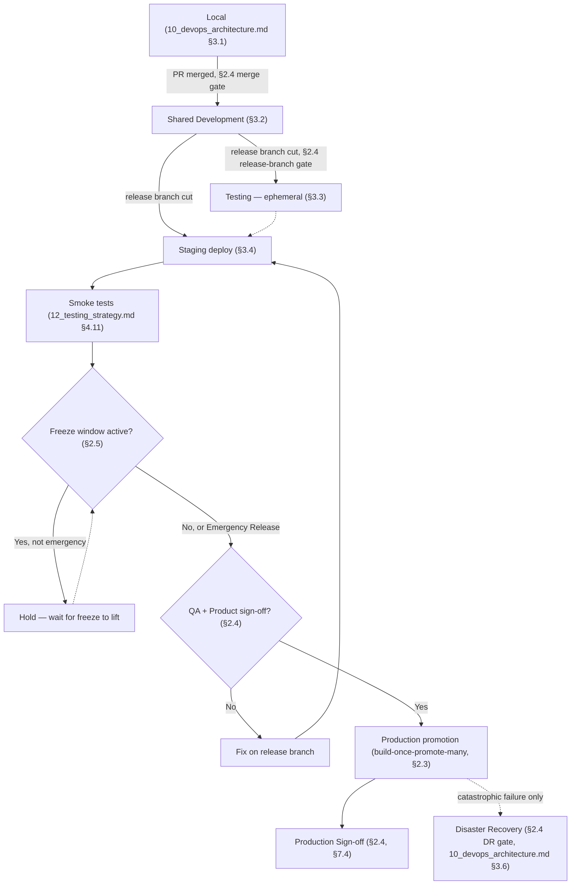
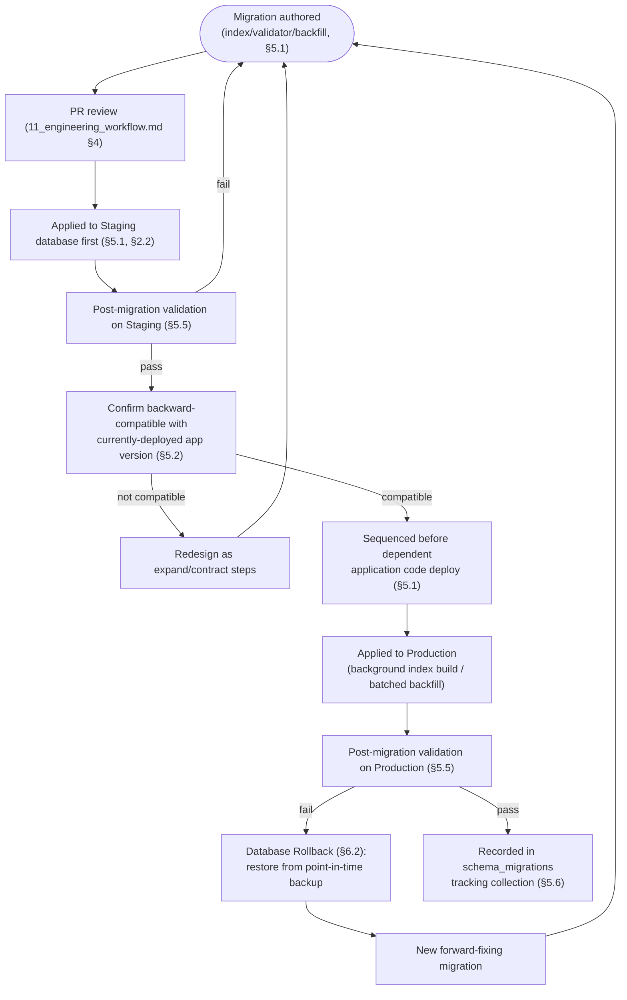
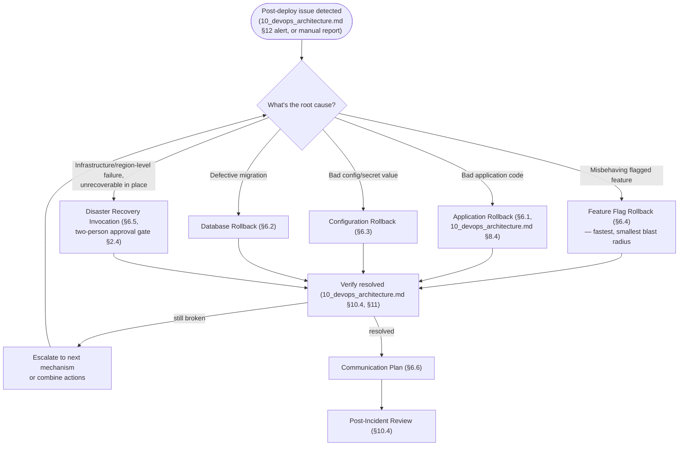
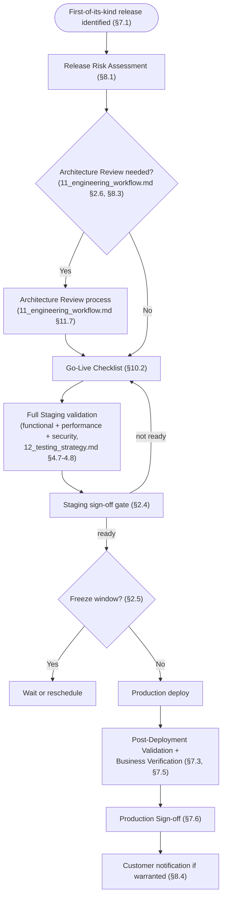

# Enterprise Deployment Strategy

## National Furniture & Interiors Platform

**Prepared by:** Enterprise Release & Deployment Review Board (Principal DevOps Architect, Site Reliability Engineer, Platform Engineer, Cloud Infrastructure Architect, Principal Software Architect, Security Architect, Engineering Manager)
**Date:** 2026-08-07
**Status of `01`–`12`:** APPROVED and LOCKED, source of truth. Never modified.
**Scope:** How software moves safely from development to production — release execution, operational readiness, rollback, business continuity. Complements `10_devops_architecture.md`; does not redesign architecture, infrastructure, or DevOps. No implementation code.

---

## Revision History

| Version | Date | Change | Reason |
|---|---|---|---|
| v1.0 | 2026-08-07 | Initial version | — |

---

## 0. Relationship to Locked Documents — What This Document Confirms vs. Adds

The overlap risk with `10_devops_architecture.md` and `11_engineering_workflow.md` is real and named up front rather than papered over: both already designed substantial release/deployment content — `10_devops_architecture.md` §3 (seven environments), §6 (branch/merge/release/rollback/blue-green/canary/hotfix strategy), §7 (release process end to end), §8 (deployment/rollback mechanics per environment), §10.6–10.7 (backup/DR); `11_engineering_workflow.md` §2.3 (hotfix workflow governance), §7.4–7.5 (release/production requirements). This document does not redesign any of that. Every mechanic already locked there is **cited by section number**, not re-explained, throughout Sections 2–6 below.

What this document adds — genuinely new content none of `01`–`12` owns:

1. **Database Migration Deployment** (Section 5) — `03_database_design.md` designed the *schema*; `06_project_structure.md` §4.4/§5 named `packages/database` as the location for migrations/seeds; no document designed the *workflow* by which a schema, index, or validator change actually gets deployed safely against a live, replicated production database.
2. **Cron/background-job deployment safety** (Section 4.5) — `10_devops_architecture.md` §8.3 covered `worker`'s graceful shutdown; nothing covers the specific risk of a horizontally-scaled `worker` fleet double-firing a scheduled job.
3. **Release Calendar, Promotion Rules, Approval Gates, and Release Freeze Policy** (Section 3) — `10_devops_architecture.md` §3 named the environments; this document adds the formal rules governing movement *between* them, including freeze windows tied to this platform's specific business calendar (`01_business_research.md`'s named flash-sale/marketing-push risk).
4. **Versioning reconciliation** (Section 2.3) — three versioning schemes already exist independently across `05`, `08`, `10`; none of `01`–`12` stated how they relate to each other or where classic Semantic Versioning actually applies.
5. **Database/Configuration/Feature-Flag rollback** (Section 6) — `10_devops_architecture.md` §8.4 designed **application** rollback in full; database, configuration, and feature-flag rollback are each a different mechanic with different risk properties, none previously specified.
6. **Go-Live governance, Business Verification, Production Sign-off, Communication Plan, Business Continuity** (Sections 7, 8) — process and governance layers `10_devops_architecture.md` (infrastructure-focused) and `11_engineering_workflow.md` (engineering-process-focused) each stopped short of, since neither was scoped to formal release governance.

---

## 1. Release Strategy

### 1.1 Release Cadence

Confirms `10_devops_architecture.md` §6.4 exactly: releases cut on a regular cadence (not continuous deployment to Production), with Staging validation as a mandatory, non-skippable gate. This document sets the concrete cadence for the first time: **weekly release trains** as the default rhythm, with the explicit allowance that a train can ship empty (no release that week) if nothing meeting Definition of Done (`11_engineering_workflow.md` §7.2) is ready — cadence is a *scheduling discipline*, not a pressure to ship something regardless of readiness.

### 1.2 Release Calendar

**New.** The release calendar is planned one quarter ahead at a coarse level (which weeks are release weeks, which are held for Section 3.5's freeze windows) and one sprint ahead at a fine level (which Epics/Stories are targeted for which train, per `11_engineering_workflow.md` §1.3's sprint cadence). The calendar is a shared, visible artifact (not a private Engineering Manager document) since Section 8.4's customer-notification and Section 3.5's freeze-window planning both depend on Product/Support/Marketing being able to see it, not just Engineering.

### 1.3 Versioning Strategy

**Reconciles three already-locked, independently-scoped versioning schemes** rather than introducing a fourth:

| Scheme | Governs | Format | Source |
|---|---|---|---|
| Platform release version | "What was actually deployed, and when" — an operational/audit answer, not a compatibility contract | Calendar-based: `vYYYY.MM.<sequence>` | `10_devops_architecture.md` §6.9, confirmed unchanged |
| API contract version | Backward-compatibility guarantees to `storefront`/`admin`/future consumers | URI-based major version only: `/api/v1/` | `08_api_architecture.md` §3.17, confirmed unchanged |
| Workspace package version | Internal monorepo dependency resolution | `workspace:*` — no independent version numbers while packages remain internal-only | `05_repository_strategy.md` §9 (referenced, not restated), confirmed unchanged |

### 1.4 Semantic Versioning

**Where classic SemVer (`MAJOR.MINOR.PATCH`) actually applies, stated for the first time:** none of the three schemes in Section 1.3 is full SemVer today, and that is a deliberate, already-established set of choices, not a gap — a calendar-based platform version answers "when," which SemVer's MAJOR.MINOR.PATCH doesn't naturally express; the API's URI versioning is intentionally coarser than SemVer (`08_api_architecture.md` §3.17–3.19 already define breaking-vs-non-breaking precisely without needing MINOR/PATCH granularity); and `workspace:*` packages have no external consumer to communicate compatibility to yet. **Full SemVer is reserved for the one future event these documents already anticipate but haven't reached**: the moment any `packages/*` workspace package is extracted for external or cross-repository publishing (`04_architecture_decision.md` §9's extraction playbook, `07_technology_decision_record.md` §20.4–20.5's Changesets-deferred-until-then note) — at that point, and not before, that specific package adopts SemVer, versioned independently of the platform release calendar and the API's own versioning. This document does not pre-decide *which* package or *when*; it states the trigger (extraction) already established elsewhere, closing the "where does SemVer fit" question the brief raises without inventing a new decision.

### 1.5 Feature Release Process

Confirms `10_devops_architecture.md` §7's end-to-end release process exactly (branch cut → build/scan/SBOM → Staging deploy → smoke test → sign-off → production promotion → tag/notes → monitoring watch window) and `11_engineering_workflow.md` §7.4's Release Requirements (every included Story meets Definition of Done). This document's addition is placing it within Section 3's environment-promotion-gate structure below, so "feature release" and "environment promotion" are shown as the same process viewed from two angles, not two competing descriptions.

### 1.6 Hotfix Process

Confirms `10_devops_architecture.md` §6.8 and `11_engineering_workflow.md` §2.3/§3.7 exactly (branch from production SHA, full CI gates, abbreviated Staging soak, immediate merge-back, Tech-Lead/EM sign-off to declare hotfix status) plus `12_testing_strategy.md` §4.12's Sanity Testing as the compensating manual verification. No new design — restated here only to complete this document's own release-process taxonomy alongside Sections 1.5 and 1.7.

### 1.7 Emergency Release Process

**New — distinguished from Hotfix (Section 1.6).** A Hotfix addresses a production-breaking *functional* bug; an Emergency Release is specifically the security-CVE-driven exception already named across `07_technology_decision_record.md` §1.1, `08_api_architecture.md` §13's Rule 6, and `09_security_architecture.md` §5.1 — patching a critical vulnerability, rotating a compromised secret, or closing an actively-exploited authorization bypass. The distinction matters procedurally: an Emergency Release **may skip the Section 1.6 requirement that a Tech Lead/EM declare hotfix status in advance** — a Security Architect or the on-call SRE can trigger it unilaterally given the time-sensitivity, with the declaration and reasoning logged (Section 8.2) *during or immediately after* execution rather than gating it. Emergency Releases still go through the same CI gates (no skipped checks, per `09_security_architecture.md` §11's anti-expedience rule, confirmed unchanged) — the only process step Emergency Release removes is the pre-authorization delay, not the technical verification.

### 1.8 Rollback Strategy

Confirms `10_devops_architecture.md` §8.4's full formal rollback procedure exactly (detect → decide → execute → verify → communicate → follow up). Section 6 below extends it into the three mechanics `10_devops_architecture.md` §8.4 didn't need to design because it was scoped to application-container rollback specifically: database, configuration, and feature-flag rollback.

---

## 2. Environment Promotion

### 2.1 The Seven Environments

Confirms `10_devops_architecture.md` §3 in full (Local, Shared Development, Testing, Staging, Production, Disaster Recovery) — not restated here; every attribute (purpose/infrastructure/security/monitoring/deployment/rollback/recovery) for each environment is exactly as specified there.

### 2.2 Promotion Path

**New — the explicit sequencing rule connecting the seven environments**, implied but never stated as a single ordered path in `10_devops_architecture.md`:

```
Local → (PR merged) → Shared Development → (release branch cut) → Testing (ephemeral, per-CI-run)
                                          → Staging → (sign-off) → Production
                                                                  ↳ (catastrophic failure) → Disaster Recovery
```

Code **cannot** skip a stage in this path — a change reaching Production has, by construction, already passed through Shared Development and Staging; there is no "direct to Production" lane, including for Section 1.7's Emergency Release (which still deploys to Staging first, per Section 1.7's own "abbreviated but not skipped" rule inherited from Section 1.6).

### 2.3 Promotion Rules

**New.** Three rules govern every promotion, regardless of which environment boundary is being crossed:

1. **Build-once-promote-many** (confirmed from `10_devops_architecture.md` §5.2) — the artifact promoted from Staging to Production is bit-for-bit identical to what Staging validated; a promotion is never a rebuild.
2. **No environment is skipped** (Section 2.2).
3. **A promotion is only as valid as the gate it just passed** — Shared Development's gate is "CI green" (automatic, `10_devops_architecture.md` §3.2); Staging's gate is "CI green + smoke test + sign-off" (Section 2.4); Production's gate is Section 7's full Go-Live discipline for a first-of-its-kind release, or the lighter Section 1.5 release-checklist for a routine one.

### 2.4 Approval Gates

**New — formalizes the human decision points `10_devops_architecture.md` §7 named ("QA/stakeholder sign-off... a human gate") without specifying who or what "sign-off" requires:**

| Gate | Between | Approver(s) | What's being approved |
|---|---|---|---|
| Merge gate | PR → Shared Development | CODEOWNERS-matched reviewer(s) (`11_engineering_workflow.md` §4.4) | Code correctness, scope, standards |
| Release-branch gate | Shared Development → Testing/Staging | Engineering Manager or Tech Lead (release owner) | Release scope is complete — every included Story meets Definition of Done (`11_engineering_workflow.md` §7.4) |
| Staging sign-off gate | Staging → Production | QA Lead **and** Product Manager, jointly (extends `10_devops_architecture.md` §7's "QA/stakeholder sign-off" with the specific two roles) | Functional correctness (QA) and business-intent correctness (Product) — two independent lenses, neither substitutes for the other |
| Production Sign-off | Production deploy → considered complete | Release owner, after Section 7.4's post-deployment validation | The release is operating correctly in the real environment, not just that the deploy mechanically succeeded |
| DR invocation gate | Production incident → DR activation | SRE on-call **plus** Engineering Manager or VP Engineering concurrence (a two-person decision given DR's cost and disruption, per `10_devops_architecture.md` §10.7's "confirm production is genuinely unrecoverable" precondition) | The incident genuinely warrants full DR, not a rollback (Section 6.1) |

### 2.5 Release Freeze Policy

**New.** No release (feature or routine) is promoted to Production during a declared freeze window, with Emergency Releases (Section 1.7) as the **sole** exception (a freeze protects against *planned-change* risk; it does not — and must not — block an emergency security response). Freeze windows are declared for:

- **Business-critical periods** named in `01_business_research.md`'s own competitive/seasonal framing (a flash-sale-style marketing push, already named as a load-testing trigger in `02_enterprise_architecture.md` §17) — Engineering Manager + Product Manager jointly declare the freeze window in the Release Calendar (Section 1.2) at least two weeks ahead.
- **Around Section 7's Go-Live events for major, first-of-their-kind releases** — a brief freeze immediately following a major release (e.g., 48 hours) protects the Section 7.4 monitoring-watch window from being confounded by an unrelated second deploy.
- **Statutory/compliance-review windows**, if one is ever declared (e.g., during a formal PCI-DSS SAQ engagement, `09_security_architecture.md` §8.5's still-open item) — a deliberate, named trigger rather than a standing policy, since this platform has no compliance freeze requirement today.

A freeze is a **hard block enforced at the Approval Gate level** (Section 2.4) — the Staging sign-off gate is simply not granted during a freeze window regardless of how ready a release otherwise is, making the freeze structurally enforced rather than a norm that relies on nobody pushing back.

---

## 3. Environment Promotion Flow Diagram



---

## 4. Deployment Strategy

### 4.1 Frontend Deployment

Confirms `10_devops_architecture.md` §8.2/§9.1 exactly: Vercel-native immutable deployments for `storefront`/`admin`, preview deployments per PR serving as the frontend QA environment. No new design.

### 4.2 Backend Deployment

Confirms `10_devops_architecture.md` §8.1/§9.2 exactly: ECS Fargate rolling deployment, minimum-healthy-percent threshold, health-checked before traffic cutover, versioned task definitions. No new design.

### 4.3 Database Migration Deployment

See Section 5 in full — the brief lists this both under "Deployment Strategy" and as its own major heading; this document designs it once, in Section 5, and this entry exists only to point there rather than fragment the same design across two locations.

### 4.4 Background Jobs

Confirms `02_enterprise_architecture.md` §16's BullMQ queue design and `10_devops_architecture.md` §9.2's queue-depth-based autoscaling — job **deployment** (as opposed to job *definition*, already locked) follows the same rolling-deployment mechanic as `worker` generally (Section 4.6).

### 4.5 Cron Jobs

**New — closes a genuine gap.** `06_project_structure.md` §4.5 named `src/cron/` as "scheduling registration," and `10_devops_architecture.md` §9.2 confirmed `worker` autoscales on queue depth — but no prior document addressed the specific risk this creates: **a horizontally-scaled `worker` fleet (Section 4.6, `10_devops_architecture.md` §10.1's autoscaling table) must not fire the same scheduled job multiple times, once per replica.** This document specifies the required property: every cron-triggered job registration uses BullMQ's **repeatable-job** primitive with a **single logical job ID per schedule** (not per-replica registration) — BullMQ's own de-duplication on repeatable-job ID ensures only one instance of a given scheduled job is enqueued regardless of how many `worker` replicas are running, and the job's own *execution* (once enqueued) is picked up by exactly one replica via BullMQ's standard consumer-locking, not a custom leader-election mechanism this platform would otherwise need to build. This is stated as a **deployment requirement**, verified at Section 9's Go-Live checklist ("cron jobs verified to fire exactly once under multi-replica `worker`"), not left to be discovered the first time `worker` actually scales past one replica in production.

### 4.6 Worker Deployment

Confirms `10_devops_architecture.md` §8.3 exactly: rolling deployment, graceful shutdown finishes in-flight jobs before termination, BullMQ's job-visibility-timeout mechanism re-queues an incomplete job to a replacement worker. No new design beyond Section 4.5's cron-specific addition layered on top.

### 4.7 Zero-Downtime Deployment

Confirms `10_devops_architecture.md` §8.1's rolling-deployment/minimum-healthy-percent-100% design and §8.2's Vercel-native atomic cutover — both already achieve zero customer-visible downtime during a routine deploy. No new design; this entry exists to confirm the property explicitly, since the brief names it as a distinct heading even though the mechanism achieving it is already fully specified elsewhere.

### 4.8 Blue-Green Deployment

Confirms `10_devops_architecture.md` §6.6 exactly: recommended and designed for `api` specifically (double-capacity cost during deploy, named and accepted), Vercel provides equivalent behavior natively for `storefront`/`admin` without additional design. No new design.

### 4.9 Canary Deployment (Future)

Confirms `10_devops_architecture.md` §6.7 exactly: deliberately deferred, named trigger (sustained traffic volume where even a brief bad full-cutover deploy would affect a business-significant user count before health checks/alerting catch it). No new design.

---

## 5. Database Deployment

The largest genuinely new section in this document — `03_database_design.md` designed the schema; this section designs how schema changes actually reach a live, replicated production database safely.

### 5.1 Migration Workflow

MongoDB's flexible-schema model means "migration" here covers three distinct change types, each with its own workflow, rather than one SQL-style monolithic migration concept:

| Change type | Example | Workflow |
|---|---|---|
| **Index change** | New compound index for a new query pattern (`03_database_design.md` §10.6's Critical Indexes list growing) | Built via `packages/database`'s migration tooling (`@nfi/database-tools`, `05_repository_strategy.md` §8.3) using a **background/rolling index build** against replica-set secondaries first, then the primary (`03_database_design.md` §10's own noted-but-not-detailed practice, made an explicit requirement here) — never a foreground build that locks the collection under production write load |
| **`$jsonSchema` validator change** | Tightening or relaxing a collection's validation rule (`03_database_design.md` §12) | Deployed via the same migration tooling, applied at `moderate` validation level first if the change is a tightening (per `03_database_design.md` §12's own validation-level note), verified against a sample of existing documents before being promoted to `strict` |
| **Data backfill** | A new field needing a default value populated across existing documents (e.g., the v1.1 addition of `marketingConsent` to `leads`, `03_database_design.md` §9.5.1 — used here as the concrete precedent this workflow would have governed had it existed at the time) | Run as a **batched, resumable, idempotent** script (`bulkWrite`/`updateMany` per `03_database_design.md` §13's existing bulk-write performance guidance) — idempotent so a resumed-after-failure backfill never double-applies, batched so it never holds a long-running transaction or excessive lock time against a live collection |

Every migration (all three types) is: (1) written and reviewed as a versioned script in `packages/database/migrations/` (`06_project_structure.md` §9's already-named location), (2) tested against Staging's database first (never Production-first, confirming Section 2.2's no-skipping rule applies to database changes too), (3) applied to Production as its own deployment step, **sequenced before** the application-code deploy that depends on it (Section 5.2's backward-compatibility rule is what makes this sequencing safe).

### 5.2 Backward Compatibility

**The governing principle for every schema change:** a migration must be safe to apply while the *previous* version of the application code is still running against the database — because Section 2.3's rolling deployment means old and new application code briefly run simultaneously against the same database during any deploy (`10_devops_architecture.md` §8.1). Concretely: a new field is always added as optional/nullable first (old code that doesn't know about it simply ignores it); a field is never renamed in a single migration (instead: add the new field, deploy application code that writes both, backfill, deploy application code that reads only the new field, then a later migration removes the old field — an "expand/contract" pattern, stated here for the first time even though `03_database_design.md`'s own document-versioning discipline, e.g. the `version` optimistic-concurrency field, already assumed this kind of careful evolution was how the schema would change over time); a required-field addition is only safe once a backfill (Section 5.1) has already completed for 100% of existing documents. This is the database-specific instance of the exact same rolling-deployment-compatibility principle `08_api_architecture.md` §3.18 already applies to the API contract — restated here because `03_database_design.md` never had to state it (it designed a point-in-time schema, not schema *evolution*).

### 5.3 Rollback Strategy (Database)

See Section 6.2 for the full design — referenced here to keep this section focused on forward migration; Section 6 groups all four rollback mechanics (application, database, configuration, feature flag) together since they're conceptually one topic the brief also lists separately under "Rollback & Recovery."

### 5.4 Seed Data

Confirms `12_testing_strategy.md` §5.3 exactly for non-production environments (Local, Shared Development, ephemeral Testing) — `scripts/setup/` generates realistic, interconnected, non-PII seed data via the same Factories `12_testing_strategy.md` §5.2 designed. **Production never receives seed data** — the one explicit exception is a genuinely new deployment's minimal **reference/lookup data** (e.g., the initial `roles`/`permissions` documents from `03_database_design.md` §9.1.2–9.1.3, `settings` defaults from §9.8.3) required for the application to function at all, which is itself a migration (Section 5.1's data-backfill category), reviewed and applied exactly once at initial Production setup, not a recurring seed-data refresh.

### 5.5 Data Validation

Beyond `03_database_design.md` §12's `$jsonSchema`/application-layer validation (confirmed unchanged, that document's concern): this document's addition is **post-migration validation** — every migration (Section 5.1) includes a verification step run immediately after application, asserting the expected document count/shape/distribution matches what the migration intended (e.g., after a backfill, confirm zero documents remain with the old, pre-backfill default value) — a migration is not considered complete until this check passes, and a failed check triggers Section 6.2's database rollback procedure rather than being investigated after the fact with production already in an unverified state.

### 5.6 Schema Versioning

**New — distinguished from `03_database_design.md` §3's per-document `version` field (optimistic concurrency, a runtime concern) and Section 1.3's platform/API/package versioning (also not this).** Schema versioning here means: `packages/database/migrations/` files are sequentially numbered and named (`0001_add_marketing_consent.ts`-equivalent, per the already-established `06_project_structure.md` §9 convention for this folder), and the database itself carries a `schema_migrations` tracking collection (a new, minimal addition — not one of `03_database_design.md`'s 35 named collections, since it's deployment-tooling metadata, not business data) recording which migrations have been applied and when, so a deployment can programmatically verify "is this database's schema state consistent with what this application version expects" as a boot-time or pre-deploy check, closing the risk of an application version and database schema version silently drifting apart.

---

## 6. Rollback & Recovery

### 6.1 Application Rollback

Confirms `10_devops_architecture.md` §8.4's full seven-step procedure exactly (detect, decide, execute via prior SHA-tagged image, verify, communicate, follow up). No new design.

### 6.2 Database Rollback

**New.** MongoDB's flexible schema and the expand/contract migration pattern (Section 5.2) mean database rollback is fundamentally **not a mirror-image "undo migration"** the way a SQL down-migration is — because Section 5.2's backward-compatible-by-design principle means the *previous* application version already tolerates the *new* schema state (that's the whole point of expand/contract). Concretely: rolling back application code (Section 6.1) to a prior version **does not, by itself, require any database rollback at all** in the overwhelming majority of cases, precisely because every migration was designed (Section 5.2) to be safe for the old code to run against. A database rollback is needed only in the rare case where a migration itself was defective (not just the application code that consumed it) — in which case: (1) stop the migration if still running, (2) restore from the most recent pre-migration point-in-time backup (`10_devops_architecture.md` §10.6's continuous point-in-time recovery) into a verification environment first, never directly onto live Production, (3) apply a **new, forward-fixing migration** correcting the defect (consistent with `10_devops_architecture.md` §6.5's application-rollback philosophy of "redeploy a known-good state," applied to data — data is restored to a known-good point, not "un-migrated" via a hand-written inverse script written under incident pressure).

### 6.3 Configuration Rollback

**New.** Confirms `11_engineering_workflow.md` §6.1's rule that configuration changes (`10_devops_architecture.md` §2.2) go through the standard PR review process — the direct consequence is that a bad configuration change rolls back **exactly like an application rollback** (Section 6.1), since non-secret configuration lives in the same versioned repository and deploys through the same pipeline (`10_devops_architecture.md` §2.2's "configuration is data, versioned in the repository"). The one distinct case: a **secret** value change (`09_security_architecture.md` §5.1/`10_devops_architecture.md` §2.4) rolls back via the secret store's own versioning (revert the "current" pointer to the prior secret version) rather than a code deploy — faster than a full application rollback when the problem is isolated to a single rotated credential.

### 6.4 Feature Flag Rollback

**New.** The fastest rollback mechanism available on this platform, by design: confirms `10_devops_architecture.md` §2.3's flag-cache-TTL design (a flag flip propagates to running containers within the stated ~60-second TTL, no redeploy required). A feature-flag-gated capability that misbehaves post-release is disabled by flipping the flag to `off` — this is the **first rollback action attempted** for any incident traceable to a flagged feature, before Section 6.1's full application rollback, since it's faster and has a smaller blast radius (only the flagged capability is affected, not the entire deployed version). Confirms `10_devops_architecture.md` §2.3's kill-switch use case as exactly this mechanism.

### 6.5 Disaster Recovery Invocation

Confirms `10_devops_architecture.md` §10.7's full DR procedure exactly (confirm unrecoverable-in-place → stand up DR environment → DNS cutover → verify → communicate → controlled cutback) and Section 3.6's dedicated environment design. This document's addition is Section 2.4's explicit two-person DR-invocation approval gate (SRE on-call plus EM/VP concurrence) — DR is the one rollback-adjacent action in this entire document requiring more than one person's decision, given its cost and disruption relative to every other recovery mechanism in this section.

### 6.6 Communication Plan

**New.** Every rollback/recovery action above (Sections 6.1–6.5) has a matching communication step, tiered by severity (reusing `10_devops_architecture.md` §12's existing Critical/High/Medium tiers rather than inventing a parallel scheme):

| Action | Internal communication | External (customer-facing) communication |
|---|---|---|
| Feature flag rollback (§6.4) | Slack notification to the owning Tech Lead's team | None — typically invisible to customers by design |
| Application rollback (§6.1) | Incident channel, per `10_devops_architecture.md` §8.4 step 6 | Only if customer-visible impact occurred — a status-page update, not a proactive email, for a brief, resolved issue |
| Configuration/secret rollback (§6.3) | Incident channel + Security Architect if secret-related | Same threshold as application rollback |
| Database rollback (§6.2) | Incident channel + Engineering Manager, mandatory given data-integrity stakes | Status-page update; direct customer notification (Section 8.4) if any customer-facing data was affected during the defective-migration window |
| DR invocation (§6.5) | All-hands incident channel, VP Engineering informed immediately | Proactive status-page and, for an extended outage, direct customer communication (Section 8.4) — DR-scale events warrant transparency, not just a status-page footnote |

---

## 7. Operational Readiness

### 7.1 Go-Live Checklist

Reserved for **first-of-their-kind** releases (a new module going live, a major architectural change, per Section 2.3's distinction from routine releases) — see Section 10.2 for the full checklist. Routine weekly releases (Section 1.1) use `10_devops_architecture.md` §16.2's Release Checklist and `12_testing_strategy.md` §11.3's Release Testing Checklist instead, confirmed unchanged; this document does not duplicate those for the routine case.

### 7.2 Smoke Tests

Confirms `12_testing_strategy.md` §4.11 and `10_devops_architecture.md` §7 exactly. No new design.

### 7.3 Post-Deployment Validation

**New — distinguished from Smoke Testing (Section 7.2, which confirms core paths are minimally functional).** Post-Deployment Validation is a broader, deploy-specific check confirming the *specific changes in this release* are behaving as intended in the real Production environment: for every Story included in the release, a quick verification against the live system (not a repeat of full UAT, which already happened at Staging per `11_engineering_workflow.md` §5.6/`12_testing_strategy.md` §4.14 — this is a lighter, Production-specific spot-check that the same behavior holds true post-promotion) plus a review of Section 7.5's Health Checks and `10_devops_architecture.md` §11's dashboards during the monitoring-watch window (`10_devops_architecture.md` §7, step 7).

### 7.4 Health Checks

Confirms `10_devops_architecture.md` §10.4 exactly (liveness/readiness endpoint split, load-balancer integration). No new design.

### 7.5 Business Verification

**New.** Distinguished from Section 7.3's technical Post-Deployment Validation: Business Verification is Product Manager (and, for a business-critical release, the relevant business stakeholder — e.g., Sales Manager for a `leads`-module release) confirming the release's **business outcome** is visible and correct in Production — not "does the code work" but "is the thing we shipped actually achieving the business purpose it was built for" (e.g., after a `design-projects` milestone-payment feature ships, Business Verification confirms a real payment can actually be initiated and correctly recorded, not just that the endpoint returns `200`). This is the Production-environment counterpart to `11_engineering_workflow.md` §5.6's Staging-environment UAT — the same acceptance-criteria-derived discipline, run once more after the artifact that was actually validated is now the artifact actually live.

### 7.6 Production Sign-off

Confirms Section 2.4's Approval Gate table: the release owner formally closes the release only after Sections 7.3–7.5 all pass — Production Sign-off is the explicit, recorded moment (logged alongside the release tag and notes, `10_devops_architecture.md` §6.10) that converts "the deploy mechanically succeeded" into "the release is confirmed complete," the same distinction Section 2.3's third promotion rule already drew in the abstract, made concrete here as the final gate in the whole pipeline.

---

## 8. Business Continuity

### 8.1 Release Risk Assessment

Confirms `11_engineering_workflow.md` §1.9's per-Epic risk assessment and `12_testing_strategy.md` §2.4's risk-based testing prioritization — this document's addition is applying the same risk lens at the **release** level (a release bundling several Epics/Stories, Section 1.1) rather than only the individual-Epic level: a release owner reviews the aggregate risk of everything bundled into a given release train, and a release containing multiple high-risk items (per `09_security_architecture.md` §1.4's Tier classification or `10_devops_architecture.md` §1.8's business-criticality ranking) may be deliberately split across two release trains rather than shipped together, reducing the blast radius of any single release going wrong.

### 8.2 Change Approval

Confirms Section 2.4's Approval Gates as the mechanical change-approval process. This document's addition — the **change record**: every Production promotion (routine or emergency) is logged with what changed (the release notes, `10_devops_architecture.md` §6.10), who approved it (Section 2.4's named approvers), and why (the linked Epics/Stories or, for Section 1.7's Emergency Release, the incident/CVE reference) — a lightweight, structurally-required record (not a heavyweight separate change-management tool) that gives Section 8.5's Post-Incident Review process something concrete to reference when a release is implicated in an incident.

### 8.3 Maintenance Windows

**New.** Distinguished from Section 2.5's Release Freeze (which blocks *new* releases): a Maintenance Window is a **planned, communicated period of expected degraded service or brief downtime** for an operation that genuinely can't be done zero-downtime (e.g., a major MongoDB Atlas version upgrade, a Redis instance-class change requiring a brief failover). Maintenance Windows are scheduled during the platform's lowest-traffic period (determined from `10_devops_architecture.md` §11.3's actual traffic metrics once available, not guessed), announced via Section 8.4's customer-notification mechanism at least 72 hours ahead for anything with expected customer-visible impact, and never scheduled during a Section 2.5 freeze window (the two concepts are complementary, not overlapping — a freeze blocks *releases*, a maintenance window is itself a scheduled, approved *operation*).

### 8.4 Customer Notification

**New.** Tiered by impact, consistent with Section 6.6's communication-plan tiering: **no notification** for a routine, invisible release; **status-page update only** for a brief, already-resolved incident (Section 6.6's application/config-rollback row); **proactive advance notification** (minimum 72 hours, Section 8.3) for a planned Maintenance Window; **immediate, direct notification** (email/in-app, not just a status page) for any incident that affected customer data integrity (a Section 6.2 database rollback scenario) or an extended outage (Section 6.5 DR-scale event) — the notification threshold scales with actual customer impact and data-integrity implications, never with internal severity classification alone, since a Critical-severity *internal* incident that customers never noticed doesn't warrant the same external communication as one that visibly affected them.

### 8.5 Incident Escalation

Confirms `10_devops_architecture.md` §12's severity-tiered alerting/response and `09_security_architecture.md` §12.4's Incident Response Checklist exactly — both remain the operative incident-response processes; this document does not redesign incident response, only ties Section 6's rollback/recovery actions into those already-locked processes as the concrete *actions* an escalated incident resolves into.

### 8.6 Emergency Contacts

**New, as a policy — not a literal roster** (a named-individual contact list is operational data that belongs in `docs/deployment/` per `06_project_structure.md` §8's documentation hierarchy, not in an architecture document that would immediately go stale). The policy: every Severity tier from `10_devops_architecture.md` §12 has a **named role**, not just a named person, as its first point of contact (SRE on-call for Critical infrastructure signals, Security Architect on-call for Critical security detections per `09_security_architecture.md` §7.4, Engineering Manager for Section 2.4's non-technical escalations) — role-based so the contact chain survives personnel changes without requiring this document to be updated every time an individual joins or leaves the on-call rotation.

---

## 9. Diagrams

### 9.1 Deployment Lifecycle Diagram

```mermaid
flowchart LR
    Dev["Development (11_engineering_workflow.md §2)"] --> Build["Build + Test<br/>(10_devops_architecture.md §5-6, 12_testing_strategy.md §8)"]
    Build --> Promote["Environment Promotion (§2)"]
    Promote --> DeployApp["Application Deploy<br/>(frontend §4.1, backend §4.2, worker §4.6)"]
    Promote --> DeployDB["Database Migration Deploy (§5)"]
    DeployDB -.sequenced before.-> DeployApp
    DeployApp --> Readiness["Operational Readiness (§7)"]
    Readiness --> SignOff["Production Sign-off (§7.6)"]
    SignOff --> Operate["Operate — monitored (10_devops_architecture.md §11-12)"]
    Operate -.issue detected.-> Rollback["Rollback & Recovery (§6)"]
    Rollback --> Operate
    Operate -.next release cycle.-> Dev
```



### 9.2 Environment Promotion Flow

See Section 3 — not reproduced twice; that diagram *is* this one, placed where the brief's "Environment Promotion" section first needed it.

### 9.3 Database Migration Flow



### 9.4 Rollback Workflow



### 9.5 Go-Live Checklist Flow



---

## 10. Checklists

### 10.1 Deployment Checklist

- [ ] Environment promotion path followed with no stage skipped (Section 2.2)
- [ ] Build-once-promote-many verified — Production artifact SHA matches the Staging-validated SHA (Section 2.3)
- [ ] Database migrations (if any) applied and validated **before** dependent application code deploys (Section 5.1, 5.5)
- [ ] No active release freeze, or this is a verified Emergency Release (Section 2.5, 1.7)
- [ ] Correct approval gate obtained for this promotion (Section 2.4)
- [ ] Cron/scheduled-job registrations verified singleton-safe if this release touches `worker`/`cron` (Section 4.5)

### 10.2 Go-Live Checklist

Reserved for first-of-their-kind releases (Section 7.1):

- [ ] Release Risk Assessment completed (Section 8.1)
- [ ] Architecture Review completed if triggered (Section 9.5's diagram)
- [ ] Full Staging validation: functional, performance/load, security/DAST (`12_testing_strategy.md` §4.7–4.8), UAT (`12_testing_strategy.md` §4.14)
- [ ] Rollback procedure for this specific release rehearsed or at minimum explicitly reviewed (which of Section 6's four mechanics applies if this release needs to roll back)
- [ ] Communication Plan prepared in advance (Section 8.4) — not drafted reactively if something goes wrong
- [ ] Monitoring/alerting (`10_devops_architecture.md` §11–§12) confirmed covers the new capability specifically, not just pre-existing signals
- [ ] Business Verification plan defined in advance — what "this is working correctly" looks like from the business's perspective (Section 7.5)
- [ ] Go/no-go decision made explicitly by the release owner, not defaulted into by simply not stopping

### 10.3 Rollback Checklist

- [ ] Correct rollback mechanism selected for the actual root cause (Section 9.4's classification step) — not defaulting to the most familiar mechanism regardless of fit
- [ ] Feature flag checked first as the fastest option, where applicable (Section 6.4)
- [ ] Rollback executed and verified resolved via health checks/dashboards (Section 7.4, `10_devops_architecture.md` §11)
- [ ] Communication issued per Section 6.6's tiering
- [ ] Incident logged with root cause, action taken, and approver (Section 8.2's change record)
- [ ] Post-Incident Review scheduled (Section 10.4)

### 10.4 Database Migration Checklist

- [ ] Migration classified correctly (index / validator / backfill, Section 5.1) and uses the matching safe-deployment pattern
- [ ] Backward-compatibility confirmed against the currently-deployed application version (Section 5.2) — expand/contract used for any rename/removal
- [ ] Tested against Staging's database first, never Production-first (Section 5.1, 2.2)
- [ ] Index builds use background/rolling build against secondaries first (Section 5.1)
- [ ] Backfills are batched, resumable, and idempotent (Section 5.1)
- [ ] Post-migration validation defined and executed (Section 5.5)
- [ ] Recorded in the `schema_migrations` tracking collection (Section 5.6)
- [ ] Rollback path understood in advance (point-in-time restore + forward-fix, Section 6.2) — not figured out only if something goes wrong

### 10.5 Emergency Release Checklist

- [ ] Genuinely qualifies as Emergency (security CVE, compromised secret, active exploitation — Section 1.7), not a mislabeled urgent feature request
- [ ] Same CI gates as any release — no skipped checks (Section 1.7, `09_security_architecture.md` §11)
- [ ] Staging deploy still performed, abbreviated soak time only (Section 1.7, inheriting Section 1.6)
- [ ] Freeze-window exception correctly applies (Section 2.5) — Emergency Release is the only exception, confirmed this release qualifies
- [ ] Declaration and reasoning logged during or immediately after execution (Section 1.7, 8.2) — not skipped because of the time pressure that justified skipping pre-authorization
- [ ] Post-Incident Review scheduled regardless of outcome (Section 10.4) — an Emergency Release is itself always worth reviewing, even when it goes perfectly

---

## 11. Review

| Dimension | Assessment |
|---|---|
| **Reliability** | Section 5.2's expand/contract backward-compatibility principle is this document's single most important reliability contribution — it means the overwhelming majority of deploys never need Section 6.2's database rollback at all, because the schema evolution pattern is designed to make the old and new application versions coexist safely during every rolling deploy by construction, not by luck. |
| **Safety** | Section 2.5's freeze-window design is structurally enforced at the approval-gate level (Section 2.4), not a norm relying on discipline alone — the same "checkable rule, not aspirational guideline" principle this whole document series applies repeatedly (`08_api_architecture.md` §9.4, `09_security_architecture.md` §13, `10_devops_architecture.md` §17). Section 4.5's cron-singleton requirement closes a real safety gap (duplicate scheduled-job execution) that would otherwise only surface the first time `worker` actually scaled past one replica in production — exactly the kind of gap this document exists to close before it's discovered the hard way. |
| **Recovery Time** | Section 6's four-tier rollback mechanism (flag → app → config → database, roughly ordered fastest-to-slowest) gives an incident responder a deliberately ordered decision tree (Section 9.4's diagram) rather than one undifferentiated "roll back" action — matching recovery speed to the actual blast radius of the root cause is the concrete mechanism by which this document improves on treating every incident the same way. |
| **Operational Simplicity** | Consistent with the whole series' governing constraint: no new tooling is introduced anywhere in this document — Section 5's migration workflow reuses `@nfi/database-tools` (already named in `05`), Section 4.5's cron-singleton fix reuses BullMQ's own built-in de-duplication rather than building custom leader-election infrastructure, and Section 8.6's emergency-contact policy is role-based specifically to avoid an operationally-fragile document that needs updating every personnel change. |
| **Developer Experience** | Section 10's five checklists translate every design decision in this document into an actionable, checkable list at the exact moment an engineer needs it (deploying, going live, rolling back, migrating, or handling an emergency) — consistent with `11_engineering_workflow.md`'s own checklist-heavy pattern, extended here to the release-execution surface specifically. |
| **Production Readiness** | Section 7's Go-Live discipline (reserved for first-of-their-kind releases) versus the lighter routine-release path (Section 7.1's explicit deferral to `10`/`12`'s existing checklists) means production-readiness rigor scales with actual release risk (Section 8.1) rather than being either uniformly heavy (slowing every routine release down) or uniformly light (under-scrutinizing genuinely risky releases) — a proportionate, not maximal, definition of "ready." |

---

## 12. Deployment Governance

### 12.1 Release Approval Policy

Confirms Section 2.4's Approval Gate table as the binding policy: no Production promotion occurs without its stated gate's approver(s) explicitly granting it — a promotion attempted without the correct approval is a process violation to be caught by `10_devops_architecture.md` §6.2's branch protection and CI gating wherever mechanically enforceable (merge/release-branch gates), and by the deployment pipeline's own manual-promotion-trigger requirement (`10_devops_architecture.md` §6.1) for the Staging→Production gate specifically, which is deliberately not a fully-automated step for exactly this governance reason.

### 12.2 Production Change Policy

Every Production-affecting change — application code, database migration, configuration, secret, or infrastructure change (`10_devops_architecture.md` §9's per-provider infrastructure, referenced not redesigned) — goes through Section 2's promotion path and Section 8.2's change-record discipline, with **no exception for a "small" or "obviously safe" change**: this document deliberately does not create a lightweight bypass lane for minor changes, because the whole discipline this document builds (backward-compatible migrations, tiered rollback, freeze enforcement) depends on every Production change being visible in the same change record — a single unrecorded "quick fix" is exactly the kind of gap that makes Section 8.2's change record, and therefore Section 12.3's Post-Incident Review, unreliable.

### 12.3 Post-Incident Review Process

Confirms `09_security_architecture.md` §12.4's blameless-retrospective step and `10_devops_architecture.md` §8.4 step 6's "lightweight retro" distinction exactly — this document's addition is the explicit **trigger matrix**, since neither prior document needed to state when a full review versus a lightweight one applies:

| Event | Review depth |
|---|---|
| Feature flag rollback, resolved quickly, no customer impact (§6.4) | Noted in the change record (Section 8.2); no separate review required |
| Application/config rollback with brief or no customer-visible impact (§6.1, §6.3) | Lightweight retro (`10_devops_architecture.md` §8.4 step 6's pattern) |
| Database rollback (§6.2), any customer-visible impact, or any Emergency Release (§1.7) | Full blameless Post-Incident Review (`09_security_architecture.md` §12.4), regardless of how quickly it was resolved — the review evaluates the release/deployment process itself, not just the technical fix |
| DR invocation (§6.5) | Full Post-Incident Review, presented to VP Engineering, with explicit findings feeding back into `10_devops_architecture.md` §16.5's Runbook Checklist and this document's own Section 13 open items if a systemic gap is found |

Every Post-Incident Review's findings that reveal a genuine, recurring gap in this document's own design are routed through `11_engineering_workflow.md` §8.5's change-management process to actually amend this document — the same discipline `11_engineering_workflow.md` §10 already established for itself, applied here reflexively: this document does not get informally reinterpreted after an incident without a recorded, reasoned update.

---

## 13. Consistency Check Against Locked Documents

| Locked decision | Where | How this document complies |
|---|---|---|
| Seven-environment model | `10_devops_architecture.md` §3 | Confirmed unchanged (Section 2.1); given explicit promotion ordering and rules (Section 2.2–2.3) |
| Release process (branch → build/scan/SBOM → Staging → sign-off → promotion → tag) | `10_devops_architecture.md` §7 | Confirmed unchanged (Section 1.5); approval gates named explicitly for the first time (Section 2.4) |
| Hotfix process | `10_devops_architecture.md` §6.8, `11_engineering_workflow.md` §2.3/§3.7 | Confirmed unchanged (Section 1.6); Emergency Release distinguished as a separate, narrower process (Section 1.7) |
| Application rollback (SHA-based redeploy, 7-step procedure) | `10_devops_architecture.md` §8.4 | Confirmed unchanged (Section 6.1); extended with database/config/flag rollback mechanics it didn't cover (Section 6.2–6.4) |
| Blue-green for `api`, Vercel-native for frontends, canary deferred | `10_devops_architecture.md` §6.6–6.7 | Confirmed unchanged (Section 4.8–4.9) |
| Feature flags, cache-aside with TTL | `10_devops_architecture.md` §2.3 | Confirmed unchanged; formalized as the fastest rollback tier (Section 6.4) |
| Platform calendar versioning, API URI versioning, `workspace:*` packages | `10_devops_architecture.md` §6.9, `08_api_architecture.md` §3.17, `05_repository_strategy.md` §9 | Confirmed unchanged, reconciled into one table for the first time (Section 1.3); SemVer's actual scope named (Section 1.4) |
| `packages/database` (`@nfi/database-tools`) location | `05_repository_strategy.md` §8.3, `06_project_structure.md` §5, §9 | Confirmed as the location Section 5's migration workflow operates within — no new tooling introduced |
| DR environment, RTO/RPO targets, backup strategy | `10_devops_architecture.md` §3.6, §10.6–10.7 | Confirmed unchanged (Section 6.5); two-person invocation-approval gate added (Section 2.4) |
| Smoke testing, UAT | `12_testing_strategy.md` §4.11, §4.14 | Confirmed unchanged (Section 7.2); Business Verification distinguished as the Production-environment counterpart (Section 7.5) |
| Severity-tiered alerting, security incident response | `10_devops_architecture.md` §12, `09_security_architecture.md` §12.4 | Confirmed unchanged (Section 8.5, 12.3); Post-Incident Review depth matrix added |
| Emergency security-patch exception | `07_technology_decision_record.md` §1.1, `08_api_architecture.md` §13 Rule 6, `09_security_architecture.md` §5.1 | Confirmed unchanged, formalized as the Emergency Release process (Section 1.7) |

No finding in this document required reopening any decision in `01`–`12`.

---

## 14. Open Items

- **`schema_migrations` tracking collection** (Section 5.6) is a new, minimal addition to the database — not one of `03_database_design.md`'s 35 named collections. It should be formally added to that document's Collection Inventory (§4) via the ADR process (`11_engineering_workflow.md` §2.6) at implementation time, since it's a genuine (if small) schema addition this document identified but `03_database_design.md` remains the source of truth for.
- **Which specific package first adopts SemVer** (Section 1.4) is intentionally left undecided — determined by whichever package `04_architecture_decision.md` §9's extraction playbook actually triggers first, not predicted here.
- **Release-cadence actual length** (Section 1.1's weekly default) should be revisited once real release-train completion-rate data exists, the same "placeholder appropriate for launch, not load-tested" caveat `10_devops_architecture.md` §19 already applied to autoscaling ceilings, applied here to cadence.
- **Maintenance Window low-traffic scheduling** (Section 8.3) depends on real traffic data not yet available pre-launch — the policy is designed, the specific time-of-day/day-of-week choice is deferred to when that data exists.
