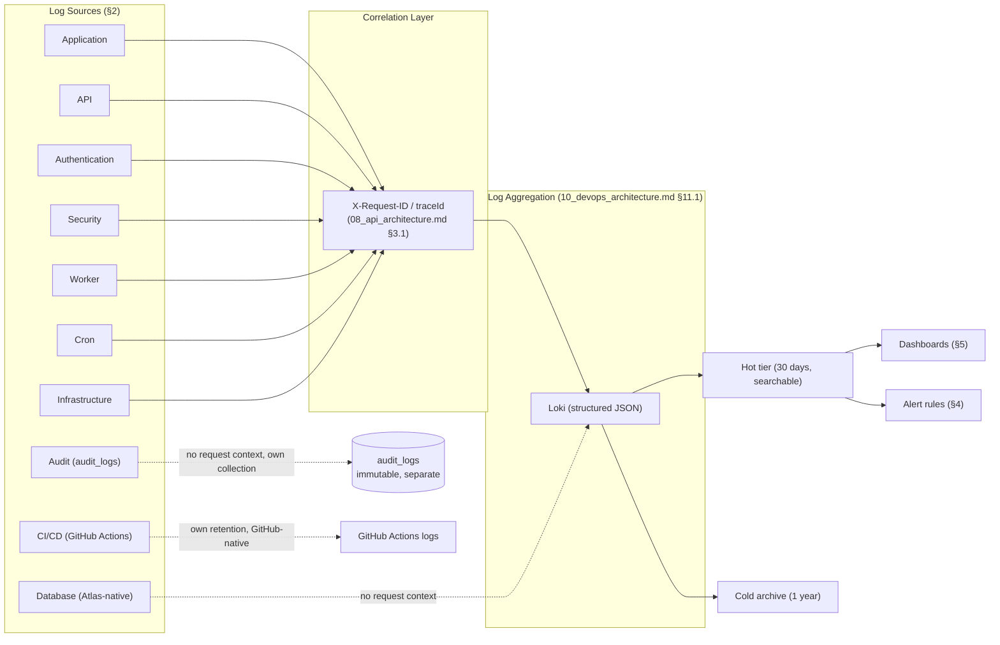
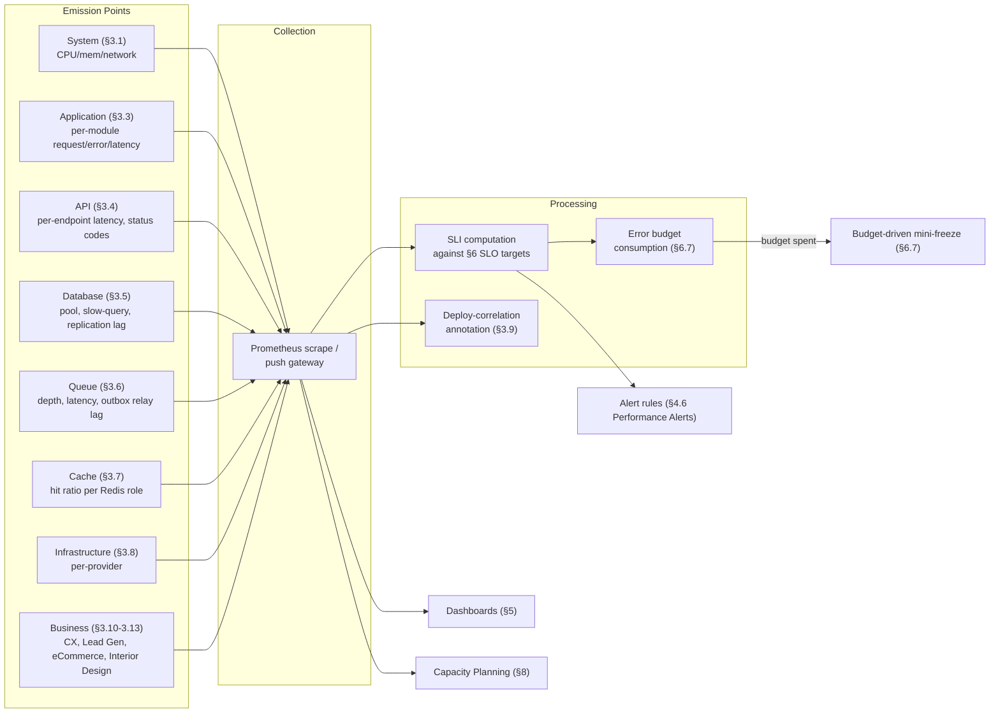
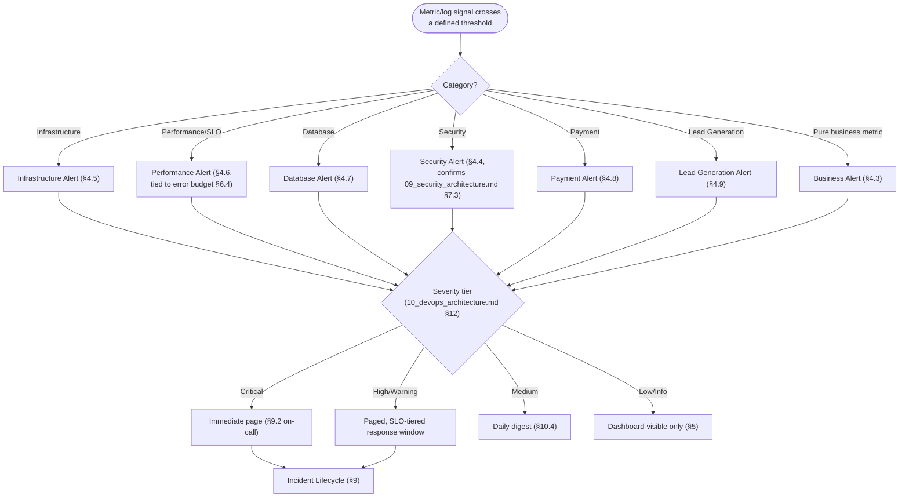
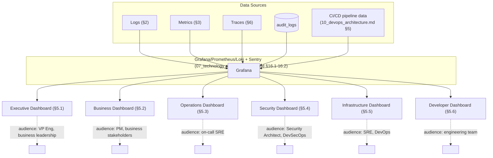
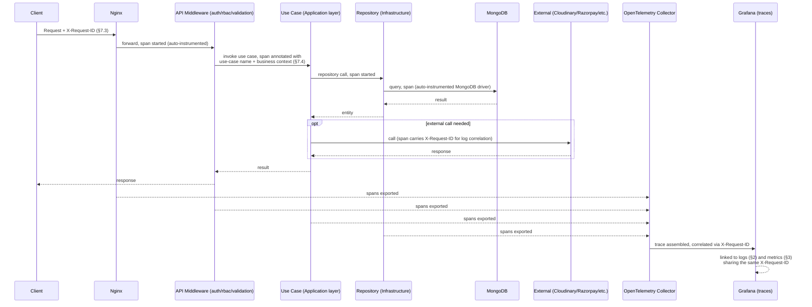
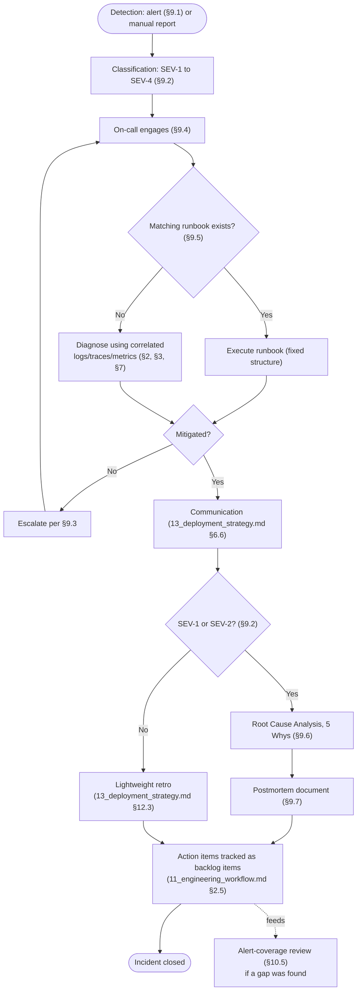

# Monitoring & Observability Architecture

## National Furniture & Interiors Platform

**Prepared by:** Enterprise Observability & Site Reliability Review Board (Principal Site Reliability Engineer, Principal DevOps Architect, Observability Architect, Platform Engineer, Principal Software Architect, Security Architect)
**Date:** 2026-08-07
**Status of `01`–`13`:** APPROVED and LOCKED, source of truth. Never modified.
**Scope:** How the production platform is monitored, measured, diagnosed, and continuously improved. Does not redesign deployment, infrastructure, or DevOps. No implementation code.

---

## Revision History

| Version | Date | Change | Reason |
|---|---|---|---|
| v1.0 | 2026-08-07 | Initial version | — |

---

## 0. Relationship to Locked Documents

Observability has already appeared, at varying depth, in three prior documents: `09_security_architecture.md` §7 designed security logging, the audit trail, incident *detection* rules, alerting delivery, and named SIEM as a deferred future item; `10_devops_architecture.md` §11–§12 designed the logging/tracing/metrics/heartbeat/alerting mechanism and dashboard tiers at the infrastructure level, plus an informal SLO-tier table (§10.1); `13_deployment_strategy.md` §8.5/§12.3 designed incident escalation and a Post-Incident Review depth matrix. This document does not redesign any of that — it does four things none of the three did:

1. **Completes the logging taxonomy.** `10_devops_architecture.md` §11.1 named the mechanism (structured Pino, correlation IDs, tiered retention) but not the full set of log *sources* the brief asks for; `09_security_architecture.md` §7.1 named the security-event taxonomy specifically. Section 2 below is the complete, ten-source taxonomy both partial pictures assemble into.
2. **Completes the metrics catalog**, including business-specific metrics (Lead Generation, eCommerce, Interior Design) that `10_devops_architecture.md` §11.3 gestured at ("business metrics... surfaced alongside infrastructure metrics") without enumerating.
3. **Formalizes SLI/SLO/SLA with error budgets** — `10_devops_architecture.md` §10.1 set informal SLO *tiers* (tightest for checkout, standard for the rest); this document turns that into measured SLIs, numeric SLO targets, and the error-budget mechanism that makes an SLO operationally actionable rather than aspirational.
4. **Designs incident management, capacity planning, and dashboard architecture in full** — `13_deployment_strategy.md` §8.5 confirmed incident *escalation* unchanged from `10`/`09` but never designed on-call rotation, runbook structure, or root-cause-analysis method; no prior document did capacity planning at all.

---

## 1. Analysis

### 1.1 Business-Critical Flows

Confirms `10_devops_architecture.md` §1.8's criticality ranking (checkout/webhook tightest, lead capture second, admin/catalog standard) as the input to this document's SLO tiering (Section 6) and alert severity (Section 4). No re-ranking.

### 1.2 Architecture, Infrastructure, Security, Deployment, Testing, API, Database

Each already-locked document supplies this document with a fixed set of inputs it does not re-derive: the module boundary (`02`/`06`) is the unit dashboards and alerts are organized around (Section 5); the container/provider topology (`10_devops_architecture.md` §9) is what infrastructure metrics (Section 3.1) instrument; `09_security_architecture.md`'s threat model and detection rules (§1.2, §7.3) are what security alerts (Section 4.4) fire on; `13_deployment_strategy.md`'s promotion path (§2.2) is what a deploy-correlated metric annotation (Section 3.9) marks; `12_testing_strategy.md`'s SLO-adjacent load-test thresholds (§4.7) are the values Section 6's SLOs are set against, not invented independently of them; `08_api_architecture.md`'s per-module contract table (§8) is what API metrics (Section 3.4) are scoped per; `03_database_design.md`'s index/collection design (§10, §14) is what database metrics (Section 3.5) and capacity planning (Section 8) are projected against.

### 1.3 Monitoring Architecture Diagram

The single top-level view every other diagram in this document (Sections 2.1, 4.10, 5.7, 7.5, 9.8) is a zoomed-in piece of:

```mermaid
flowchart TB
    subgraph Platform["Platform (02_enterprise_architecture.md §8, 10_devops_architecture.md §9)"]
        Apps["storefront, admin, api, worker"]
        Data[("MongoDB Atlas, Redis")]
        ThirdParty["Cloudinary, Razorpay,<br/>notification providers"]
    end

    subgraph Telemetry["Telemetry Emission"]
        LogsEm["Logs (§2)"]
        MetricsEm["Metrics (§3)"]
        TracesEm["Traces (§7)"]
    end

    subgraph Collection["Collection & Correlation"]
        OTelCol["OpenTelemetry Collector (§7.4)"]
        LokiCol["Loki (log aggregation)"]
        PromCol["Prometheus (metrics)"]
        ReqIDCorr["X-Request-ID correlation (§7.2-7.3)"]
    end

    subgraph Consumption["Consumption Layer"]
        DashLayer["Dashboards (§5)"]
        AlertLayer["Alerting (§4)"]
        IncidentLayer["Incident Management (§9)"]
        CapacityLayer["Capacity Planning (§8)"]
        SLOLayer["SLI/SLO/SLA + Error Budgets (§6)"]
    end

    Apps --> LogsEm
    Apps --> MetricsEm
    Apps --> TracesEm
    Data -.Atlas-native monitoring.-> MetricsEm
    ThirdParty -.provider status/quota.-> MetricsEm

    LogsEm --> ReqIDCorr --> LokiCol
    MetricsEm --> PromCol
    TracesEm --> OTelCol

    LokiCol --> DashLayer
    PromCol --> DashLayer
    OTelCol --> DashLayer

    PromCol --> AlertLayer
    LokiCol --> AlertLayer
    PromCol --> SLOLayer
    SLOLayer --> AlertLayer
    PromCol --> CapacityLayer

    AlertLayer --> IncidentLayer
    DashLayer -.-> IncidentLayer
    OTelCol -.-> IncidentLayer
```

---

## 2. Logging Strategy

Confirms `10_devops_architecture.md` §11.1 (structured JSON via Pino, correlation/request-ID propagation, tiered retention: 30 days hot, 1 year archived) and `09_security_architecture.md` §7.1's security-event taxonomy as the foundation — both unchanged. This section is the complete ten-source taxonomy the brief asks for, assembling what was previously split across those two documents plus five sources neither one specified.

| Log source | What it captures | Where it's generated | Retention (confirms `10_devops_architecture.md` §11.1) |
|---|---|---|---|
| **Application Logs** | General request/response lifecycle, business-logic decisions (`02_enterprise_architecture.md` §16's centralized error middleware output), correlation-ID-tagged | Every module's `presentation/`/`application/` layer, via the shared `core/logger/` factory (`06_project_structure.md` §4.2) | 30 days hot / 1 year archived |
| **API Logs** | Per-request: method, path, status code, latency, `X-Request-ID` (`08_api_architecture.md` §3.1), permission key checked | `08_api_architecture.md` §7.4's Request Lifecycle middleware chain | 30 days hot / 1 year archived |
| **Authentication Logs** | Login attempts (success/failure), MFA challenges, token issuance/refresh/revocation | `auth` module, feeding `09_security_architecture.md` §7.1's `AUTH_FAILURE`/`AUTH_SUCCESS`/`TOKEN_REUSE_DETECTED` taxonomy | 30 days hot / 1 year archived (auth logs are Tier 2-adjacent per `09_security_architecture.md` §1.4, handled per that document's redaction rule) |
| **Security Logs** | `RBAC_DENIAL`, `CAPTCHA_FAILED`, `WEBHOOK_SIGNATURE_INVALID`, `RATE_LIMIT_EXCEEDED`, `MFA_RECOVERY_INITIATED` | Confirms `09_security_architecture.md` §7.1 exactly — not redesigned | Confirms `09_security_architecture.md` §7.1–7.2's audit-trail-adjacent retention |
| **Audit Logs** | Every mutating `STAFF`/`ADMIN` action, `before`/`after` snapshots, redacted per `03_database_design.md` §9.8.2 | `audit_logs` collection, confirms `09_security_architecture.md` §4.8 exactly | Immutable, append-only, retained per `03_database_design.md` §15's still-pending statutory confirmation (inherited open item, not resolved here) |
| **Database Logs** | **New — not previously specified.** MongoDB Atlas's own slow-query log, connection events, replication-lag events | Atlas-native logging, surfaced into this platform's log aggregation per Section 3.5's metrics-plus-logs integration | 30 days hot (matches application-log tier; database logs are diagnostic, not compliance-retained) |
| **Worker Logs** | BullMQ job start/complete/fail/retry events, job-processing duration | `apps/api/src/workers/` (`06_project_structure.md` §4.1), same `core/logger/` factory | 30 days hot / 1 year archived |
| **Cron Logs** | **New.** Scheduled-job fire events, explicitly including the single-fire verification `13_deployment_strategy.md` §4.5 requires (a cron log entry records which `worker` replica actually claimed and executed a given repeatable-job instance, giving Section 4.5's singleton guarantee an audit trail, not just a design assumption) | `apps/api/src/cron/` (`06_project_structure.md` §4.1) | 30 days hot |
| **Infrastructure Logs** | Nginx access/error logs, ECS task lifecycle events, Vercel build/deploy logs | Confirms `10_devops_architecture.md` §9's per-provider infrastructure, log output surfaced into the same aggregation layer | 30 days hot / 1 year archived for deploy-correlated entries (ties to Section 3.9) |
| **CI/CD Logs** *(added — a natural tenth source the brief's nine-item list implies via "Infrastructure Logs" but is worth naming explicitly)* | Pipeline run logs, test results, scan results | GitHub Actions' own log retention (`10_devops_architecture.md` §6.3, confirmed unchanged) | Per GitHub Actions' own policy — not duplicated into this platform's own log store |

**Governing rule, stated once for all ten sources:** every log entry, regardless of source, carries the same `X-Request-ID`/`traceId` correlation identifier wherever the log event has a request context (`08_api_architecture.md` §3.1, `09_security_architecture.md` §4.8) — this is what makes Section 5's cross-source dashboard correlation and Section 7's incident diagnosis actually work, rather than ten independently-keyed log streams a responder has to manually cross-reference by timestamp.

### 2.1 Logging Flow Diagram

---

## 3. Metrics

### 3.1 System Metrics

Confirms `10_devops_architecture.md` §11.3's "golden signals" (latency, traffic, errors, saturation) per `api`/`worker` service, and §9.2/§9.5's ECS/Redis-specific operational metrics — unchanged. CPU, memory, network I/O per container, per the standard SRE golden-signal framework.

### 3.2 Business Metrics

Confirms `10_devops_architecture.md` §11.3's stated intent ("business metrics surfaced alongside infrastructure metrics") — Sections 3.10–3.12 below are the full enumeration that sentence gestured at without listing.

### 3.3 Application Metrics

Request count, error rate, and latency percentiles (p50/p95/p99) per module (`06_project_structure.md` §4.3's 15-module boundary is the metric-scoping unit, consistent with `08_api_architecture.md` §8's per-module contract table and `09_security_architecture.md` §10's per-module security profile) — this is the module-scoped view of Section 3.1's service-scoped golden signals, letting a dashboard (Section 5) answer "which module is degraded" rather than only "is `api` degraded."

### 3.4 API Metrics

Confirms `08_api_architecture.md` §5's performance standards as the thing being measured: per-endpoint latency against the SLO thresholds Section 6 formalizes, status-code distribution (a rising `4xx` rate signals a client-side integration problem; rising `5xx` signals a server-side one — tracked separately, not blended into one "error rate" number), rate-limit-tier utilization (`08_api_architecture.md` §4.4 — how close each tier runs to its ceiling under real traffic, feeding Section 8's capacity planning).

### 3.5 Database Metrics

Confirms `10_devops_architecture.md` §9.4's Atlas-monitoring-integration intent, made concrete: connection-pool saturation (`03_database_design.md` §13's pool-sizing discipline, verified against real utilization), slow-query rate (queries exceeding `08_api_architecture.md` §5.9's 10-second `maxTimeMS`), replication lag (secondary-node staleness, relevant specifically to `03_database_design.md` §11.7/§14.2's `secondaryPreferred` reporting-read pattern — a lagging secondary silently serving stale analytics is a correctness risk, not just a performance one), index-hit ratio (a proxy for whether `03_database_design.md` §10's index strategy is actually being used as designed by real query patterns, not just present in theory).

### 3.6 Queue Metrics

BullMQ queue depth (the direct input to `10_devops_architecture.md` §10.1's `worker` autoscaling trigger, confirmed unchanged), job processing latency, job failure/retry rate, dead-letter count (`10_devops_architecture.md` §10.5's circuit-breaker dead-letter state, `03_database_design.md` §9.8.1's `notifications.status: FAILED`) — and, specific to this platform's outbox pattern (`02_enterprise_architecture.md` §16, `03_database_design.md` §9.8.4), **outbox relay lag**: the time between an event being written to `outbox` and being successfully relayed to BullMQ, a metric with no generic-queue equivalent and one this document adds specifically because `00_architecture_review.md` finding A3's entire remediation depends on the relay actually running promptly, not just existing.

### 3.7 Cache Metrics

Confirms `10_devops_architecture.md` §13.1's cache-hit-ratio tracking intent, made concrete per cache role (Redis's three roles per `10_devops_architecture.md` §9.5: cache-aside hit ratio for catalog/report reads, session/refresh-token-store lookup latency, rate-limit-counter operation latency) — tracked as three distinct metric families because the three roles have different acceptable-degradation profiles (a cache-aside miss costs a slower response; a session-store failure is an availability event, per `09_security_architecture.md` §7's operational-maturity risk framing).

### 3.8 Infrastructure Metrics

Confirms `10_devops_architecture.md` §9's per-provider metrics: ECS task count/health, Vercel deployment/function metrics, Cloudinary quota utilization (`10_devops_architecture.md` §9.3), Razorpay API error rate (`10_devops_architecture.md` §9.6), DNS resolution latency (`10_devops_architecture.md` §9.8). No new design — enumerated here to complete the brief's explicit list.

### 3.9 Deploy-Correlation Metric Annotations

**New.** Every deploy (`13_deployment_strategy.md` §2, any environment promotion) is recorded as an annotation on every Section 5 dashboard's timeline — a visible vertical marker at the exact deploy timestamp, so a metric anomaly appearing shortly after a marker is immediately, visually correlated to "did we just deploy something" without a responder having to separately cross-reference the deploy log against the metrics timeline by hand. This is the single highest-leverage, lowest-cost addition this document makes to incident diagnosis speed (Section 7).

### 3.10 Customer Experience Metrics

**New.** Core Web Vitals (Largest Contentful Paint, Interaction to Next Paint, Cumulative Layout Shift) for `storefront` specifically, collected via Real User Monitoring (RUM) rather than synthetic-only measurement, since `08_api_architecture.md` §5.6's lazy-loading and `02_enterprise_architecture.md` §12's ISR caching decisions are both meant to produce a *felt* performance improvement — RUM is what actually verifies that intent against real customer devices/networks rather than a synthetic lab environment. Checkout-funnel drop-off rate (cart → checkout-initiated → payment-completed, each step's conversion) is tracked as a customer-experience metric distinct from Section 3.11's raw eCommerce business metrics, because a drop-off spike with no corresponding infrastructure-metric anomaly is itself a diagnostic signal (a UX regression, not a backend failure).

### 3.11 Lead Generation Metrics

**New — directly traceable to `01_business_research.md`'s #2 business priority.** Lead submission rate (raw volume, per source per `03_database_design.md` §9.5.1's `source` enum), CAPTCHA pass/fail rate (a sustained shift here is itself a signal, per Section 4.9's Lead Generation Alerts), duplicate-detection rate (how often the dedupe window, `02_enterprise_architecture.md` §10, actually merges a resubmission — high rates may indicate a UX friction point causing accidental resubmission, not just expected behavior), lead-to-qualification time and lead-to-conversion rate (the funnel `01_business_research.md` §3.2 and `03_database_design.md` §11.1's aggregation already identified as a reporting gap — this document is where that reporting becomes a *live, monitored* metric rather than only a periodic report), outbox-relay-to-notification-sent latency (Section 3.6's relay-lag metric, scoped specifically to the lead-confirmation path where `02_enterprise_architecture.md` §10 explicitly designed for it).

### 3.12 E-commerce Metrics

**New — directly traceable to `01_business_research.md`'s #3 business priority.** Cart-to-checkout conversion rate, checkout completion rate (the single most business-critical metric on the platform, per `10_devops_architecture.md` §1.8's ranking — a silent drop here, even with healthy infrastructure metrics, is the highest-priority anomaly this document's alerting (Section 4) is built to catch), average order value, inventory-reservation contention rate (how often `02_enterprise_architecture.md` §11's atomic conditional update returns zero-matched — a proxy for real-world stock contention, feeding both capacity planning, Section 8, and a potential UX signal that popular items need better stock-level visibility pre-checkout), return-request rate and refund-processing latency (`02_enterprise_architecture.md` §20's Return Flow).

### 3.13 Interior Design Metrics

**New — directly traceable to `01_business_research.md`'s #1 business priority.** Stage-transition velocity (average time spent per stage of `02_enterprise_architecture.md` §13's state machine — the concrete, monitored realization of that section's own stated rationale, "required for the funnel analytics called out as a gap in `01_business_research.md` §3.2"), quotation-to-approval rate, milestone-payment on-time rate, designer utilization (active-project count per `DESIGNER`, a capacity-planning-adjacent business metric distinct from Section 8's infrastructure capacity planning), project-value pipeline (the live counterpart to `03_database_design.md` §11.3's periodic Design Project Pipeline Value aggregation).

### 3.14 Metrics Flow Diagram

---

## 4. Alerting

Confirms `10_devops_architecture.md` §11.5/§12's delivery mechanism (Grafana/Sentry) and severity-tiered response model (Critical/High/Medium/Low) exactly, and `09_security_architecture.md` §7.3–7.4's detection-rule-to-alert mapping exactly. This section is the complete, categorized alert catalog the brief's nine-category list asks for, assembled from what those two documents already defined plus the business-specific categories neither one owned.

### 4.1 Critical Alerts

Confirms `10_devops_architecture.md` §12's Critical row (checkout/webhook error-rate threshold breach, full-replica health-check failure, MongoDB Atlas primary unreachable beyond failover window) and `09_security_architecture.md` §7.3's Critical security detections (`TOKEN_REUSE_DETECTED`). No new design.

### 4.2 Warning Alerts

**Renames/confirms** `10_devops_architecture.md` §12's "High" and "Medium" tiers under the brief's "Warning" terminology — not a new severity scheme, the same four-tier model with the brief's own vocabulary mapped onto it for this document's alert-category tables below, so this document's language matches the brief without introducing a fifth, conflicting tier.

### 4.3 Business Alerts

**New category — not previously named as a distinct alert class.** Triggered on Section 3.10–3.13's business metrics crossing an anomaly threshold, independent of any infrastructure-metric signal: checkout completion rate dropping below a rolling baseline (High severity — `10_devops_architecture.md` §12's tiering, applied here for the first time to a pure business-metric trigger, not an infrastructure one), lead submission rate dropping to near-zero during business hours (High — a silent lead-capture failure that infrastructure metrics alone would miss, since the endpoint might be returning `200` while, e.g., the CAPTCHA integration is silently misconfigured and rejecting every legitimate submission), a sustained shift in Interior Design stage-transition velocity (Medium — a slower-moving pipeline, worth investigating but not urgent). These alerts exist specifically because `08_api_architecture.md` §5.6's "the code is healthy but the business outcome isn't" gap (already named conceptually in `13_deployment_strategy.md` §7.5's Business Verification) needs a *standing*, always-on monitoring counterpart, not just a one-time post-deploy check.

### 4.4 Security Alerts

Confirms `09_security_architecture.md` §7.3's full detection-rule table exactly (credential stuffing, account-targeted brute force, refresh-token compromise, privilege-boundary probing, webhook forgery, sustained near-threshold scraping, anomalous admin data access). No new design.

### 4.5 Infrastructure Alerts

Confirms `10_devops_architecture.md` §12's autoscaling-ceiling-approaching and third-party-quota-approaching rows, extended with Section 3.8's per-provider metrics: Cloudinary quota (`10_devops_architecture.md` §9.3), Redis persistence-role-specific alerts (a queue-backing Redis instance losing persistence guarantees is Critical per `10_devops_architecture.md` §9.5's correctness framing; a pure-cache instance losing data is Low), DNS resolution failure (new specific trigger, tied to `10_devops_architecture.md` §9.8's DNS design).

### 4.6 Performance Alerts

SLO-threshold-breach alerts (Section 6's formalized SLOs, superseding the informal thresholds `10_devops_architecture.md` §10.1 set) — a latency SLI crossing its SLO for a sustained window is what actually triggers a Performance Alert, distinct from a raw error-rate breach (Section 4.1); this is the concrete mechanism connecting Section 6's SLO design to Section 4's alert catalog, not two independently-designed systems.

### 4.7 Database Alerts

**New category.** Connection-pool saturation approaching its ceiling (High), replication lag exceeding a threshold that would make `03_database_design.md` §11.7's `secondaryPreferred` reporting reads meaningfully stale (Medium), slow-query rate spike (Medium, feeding Section 8's capacity-planning trigger if sustained), and — the one Critical-tier database alert beyond primary-unreachability (Section 4.1) — **a failed post-migration validation** (`13_deployment_strategy.md` §5.5), which is Critical specifically because it's the trigger for that document's Section 6.2 database-rollback procedure and must page immediately, not wait for a routine dashboard review.

### 4.8 Payment Alerts

**New category — the platform's highest-business-consequence alert class beyond pure availability.** Webhook signature-verification failure rate spike (Critical, doubling as a Security Alert per Section 4.4 — the two categories overlap deliberately here, since a forged-webhook attempt is both a security event and a payment-integrity event, and this document does not force an artificial choice between the two classifications), Razorpay API error-rate spike (High, feeding `10_devops_architecture.md` §10.3's degraded-mode/COD-fallback consideration), refund-processing latency exceeding a threshold (Medium, `02_enterprise_architecture.md` §20's Return Flow), payment-idempotency-conflict rate spike (`08_api_architecture.md` §3.10 — an unusual spike here could indicate either a client-side retry bug or an attempted replay, worth Medium-severity investigation either way).

### 4.9 Lead Generation Alerts

**New category.** CAPTCHA failure-rate spike (High — either a bot campaign, per `09_security_architecture.md` §7.3's sustained-pattern detection, or a legitimate-user-blocking false-positive regression, both requiring urgent investigation for the platform's #2 business priority), lead submission rate dropping to near-zero (Section 4.3's Business Alert, cross-referenced not duplicated), outbox-relay lag exceeding a threshold specifically on lead-confirmation events (High — directly threatens the guarantee `00_architecture_review.md` finding A3's remediation exists to provide).

### 4.10 Alert Pipeline Diagram

---

## 5. Dashboards

Extends `10_devops_architecture.md` §11.6's three-tier model (Executive/Business, Service Health, Dependency) into the brief's explicit six-dashboard structure — a finer partition of the same underlying data, not a redesign.

### 5.1 Executive Dashboard

Highest-altitude view: platform-wide availability against Section 6's SLA, monthly business-KPI trend (revenue, lead volume, design-project pipeline value), incident count/severity trend — audience is VP Engineering and business leadership, refreshed weekly/monthly rather than real-time, consistent with `10_devops_architecture.md` §11.6's original "not an on-call engineer's tool" framing for this tier.

### 5.2 Business Dashboard

Section 3.10–3.13's full business-metric set (customer experience, lead generation, eCommerce, interior design), real-time-refreshed, audience is Product Manager and the relevant business stakeholders (Sales Manager, Design Manager) — the operational counterpart to Section 5.1's strategic view, and the primary tool behind `13_deployment_strategy.md` §7.5's Business Verification step.

### 5.3 Operations Dashboard

Section 3.1/3.3–3.7's golden-signal, application, API, database, queue, and cache metrics per module — the primary on-call tool (confirms `10_devops_architecture.md` §11.6's "Service health dashboard" tier), with Section 3.9's deploy annotations overlaid.

### 5.4 Security Dashboard

Confirms `09_security_architecture.md` §7's security-event taxonomy and detection-rule outcomes, surfaced as a dedicated dashboard for the first time (that document specified the events and rules; this document is where they get a dedicated visual home) — audience is Security Architect and DevSecOps, showing Section 4.4/4.8's Security and Payment alert history alongside raw event-taxonomy counts.

### 5.5 Infrastructure Dashboard

Confirms `10_devops_architecture.md` §11.6's "Dependency dashboard" tier and §9's per-provider metrics (Section 3.8) — Cloudinary/Razorpay/Atlas/Redis/DNS health in one place, the first stop for `10_devops_architecture.md` §10.3's "is this our problem or a third party's" triage question.

### 5.6 Developer Dashboard

**New — not previously named as its own tier.** Build-time trend (`10_devops_architecture.md` §5.4), test-suite health (`12_testing_strategy.md` §9's Flaky Test Policy — a live count of currently-quarantined tests and their age, so Section 9, point 5's escalation trigger is visible rather than requiring someone to remember to check), coverage trend (`11_engineering_workflow.md` §5.7/`12_testing_strategy.md` §6.2), PR review-turnaround-time trend (`11_engineering_workflow.md` §4.1's one-business-day target, measured against reality) — audience is the engineering team itself, closing the loop on whether `11_engineering_workflow.md`'s and `12_testing_strategy.md`'s own process targets are actually being met in practice, not just designed on paper.

### 5.7 Dashboard Architecture Diagram

---

## 6. SLI / SLO / SLA

**Formalizes what `10_devops_architecture.md` §10.1 stated only as informal tiers, and what `08_api_architecture.md` §5.9 stated only as a per-endpoint timeout budget** — neither document needed to reach full SLI/SLO/error-budget precision, since neither was scoped as the observability document. This is genuinely new depth, not a restatement.

### 6.1 Availability

| Tier | SLI (what's measured) | SLO (target) | SLA (external commitment, if any) |
|---|---|---|---|
| Checkout + payment webhook | % of requests completing without a 5xx, measured over a rolling 28-day window | 99.9% | Internal target only — no external SLA is published to customers at this platform's current stage (Section 14's open item notes this as a future consideration once/if a formal customer-facing SLA is ever needed) |
| Lead capture | Same SLI | 99.9% | Internal only |
| General API (catalog, admin, etc.) | Same SLI | 99.5% | Internal only |
| `storefront`/`admin` (frontend availability) | Successful page-load rate via Section 3.10's RUM/heartbeat (`10_devops_architecture.md` §11.4) | 99.9% | Internal only |

### 6.2 Latency

| Flow | SLI | SLO |
|---|---|---|
| Checkout end-to-end | p95 request duration | ≤ 15 seconds (confirms `08_api_architecture.md` §5.9's budget exactly, restated here as a formal SLO rather than only a timeout ceiling) |
| Standard authenticated API request | p95 request duration | ≤ 500ms |
| Public catalog read (cached) | p95 request duration | ≤ 200ms |
| Public catalog read (cache miss) | p95 request duration | ≤ 800ms |

### 6.3 Error Rate

SLI: % of requests returning a `5xx` or a `4xx` that indicates a platform defect rather than legitimate client error (a `403` from correct RBAC enforcement is not counted as an "error" for this SLI's purposes — it's the system working correctly; `08_api_architecture.md` §3.11's status-code table is the reference distinguishing "platform defect" from "correct rejection"). SLO: ≤ 0.1% for checkout/payment/webhook paths, ≤ 0.5% for general API traffic.

### 6.4 Throughput

SLI: requests-per-second sustained without SLO breach (Sections 6.1–6.3). SLO: the platform sustains at minimum the peak-load profile validated in `12_testing_strategy.md` §4.7's spike-load test — throughput SLO is defined relative to that test's validated ceiling, not an independently-invented number, so the two documents' numbers can never silently drift apart.

### 6.5 Recovery

Confirms `10_devops_architecture.md` §10.7's RTO (4 hours) / RPO (15 minutes) targets exactly for full DR — this document adds the **rollback-specific recovery SLO** neither prior document set a number for: **Mean Time to Rollback (MTTR-rollback) target of 15 minutes** from Section 4.1 Critical-alert page to `13_deployment_strategy.md` §6's appropriate rollback mechanism being executed, verified as one of `13_deployment_strategy.md` §10.3's Rollback Checklist items becoming a *measured*, not just *procedural*, target.

### 6.6 Business KPIs

Not classic infrastructure SLIs, but tracked with the same rigor: checkout completion rate (target: no more than a defined percentage-point drop from the trailing-30-day baseline before it's treated as a Section 4.3 Business Alert), lead-to-qualification median time (target set once baseline data exists, Section 14's open item), design-project stage-transition velocity (same). These are **monitored, not contractually committed** — the distinction from Sections 6.1–6.5 is deliberate: infrastructure SLOs are engineering commitments; business KPIs are tracked signals that inform Product/Business decisions, not availability guarantees.

### 6.7 Error Budgets

**New mechanism, the piece that makes Sections 6.1–6.3's SLOs operationally actionable rather than aspirational numbers on a page.** Each availability/latency/error-rate SLO has a corresponding **error budget** — the amount of SLO-violating behavior tolerable within the rolling 28-day measurement window before it's considered "spent" (e.g., a 99.9% availability SLO has a budget of ~43 minutes of downtime-equivalent per 28 days). **Budget policy:** while budget remains, the release cadence (`13_deployment_strategy.md` §1.1) proceeds normally; once a service's error budget is fully spent within a window, that service enters a **budget-driven mini-freeze** — non-essential feature releases to that specific service pause (distinct from and narrower than `13_deployment_strategy.md` §2.5's calendar-based freeze) until either the window rolls forward or the team completes reliability-focused work restoring headroom. This directly operationalizes `13_deployment_strategy.md` §8.1's Release Risk Assessment with a numeric trigger rather than only qualitative judgment.

---

## 7. Tracing

### 7.1 Distributed Tracing

Confirms `02_enterprise_architecture.md` §16's "APM tracing across API → DB/Redis/external-call spans" and `10_devops_architecture.md` §11.2's OpenTelemetry-instrumentation approach, feeding the Grafana stack — unchanged. This section gives that one-sentence design its full elaboration.

### 7.2 Request Correlation

Every trace is anchored to the same `X-Request-ID` used throughout Section 2's logging taxonomy (`08_api_architecture.md` §3.1, `09_security_architecture.md` §4.8) — one correlation identifier threading through logs, metrics-adjacent deploy annotations (Section 3.9), traces, and audit entries for a single request. This is restated from `09_security_architecture.md` §4.8's own framing because it's the load-bearing design decision behind Section 9's incident-diagnosis speed: a responder pivots from "this trace is slow" to "here are every log line and audit entry for that exact request" in one lookup, not a manual timestamp-based correlation across independently-keyed systems.

### 7.3 Correlation IDs

Generated client-side or server-side per `08_api_architecture.md` §3.1's rule (client-supplied if present, server-generated otherwise), propagated through every layer: Nginx → API middleware chain → Application-layer use case → Infrastructure-layer repository/adapter call → any downstream queue job (`worker` continues the same ID for a job triggered by that request's outbox event, Section 3.6) → any outbound third-party call (Cloudinary/Razorpay/notification-provider requests carry the ID in a custom header where the provider's API supports one, purely for this platform's own log correlation on the response side — the ID has no meaning to the third party itself).

### 7.4 OpenTelemetry Strategy

**New depth — `10_devops_architecture.md` §11.2 named OpenTelemetry as the instrumentation approach in one sentence; this section is the strategy.** OpenTelemetry SDK instrumentation is applied at three levels: **automatic instrumentation** (HTTP server/client spans, MongoDB driver spans, Redis client spans — using OpenTelemetry's standard auto-instrumentation packages wherever the underlying library supports it, minimizing custom instrumentation code) for the baseline request → DB/Redis/external-call span tree `02_enterprise_architecture.md` §16 already specified; **manual span annotation** at Application-layer use-case boundaries specifically (a span per use case, e.g., `CreateDesignProjectUseCase`, `AdvanceProjectStageUseCase`, per `02_enterprise_architecture.md` §7.2's use-case-as-the-unit-of-business-logic framing) so a trace shows not just "which HTTP call was slow" but "which business operation was slow," a materially more useful diagnostic unit given this platform's Clean Architecture layering; and **business-context span attributes** (module name, permission key checked, whether an idempotency key was present) attached to spans, giving Section 9's incident diagnosis the ability to filter/group traces by business-relevant dimensions, not just technical ones. OpenTelemetry's vendor-neutral export format (confirmed as the reasoning already given in `10_devops_architecture.md` §16.1's APM comparison table) means this instrumentation layer is portable to a different backend later without re-instrumenting application code — the same reasoning that justified choosing the Grafana stack in the first place, now shown to extend to the tracing layer specifically.

### 7.5 Tracing Flow Diagram

---

## 8. Capacity Planning

**New — no prior document did capacity planning as a standing practice**, though `03_database_design.md` §14 designed the scalability *mechanisms* (sharding candidates, time-series collections, archival) this section plans *when* to actually invoke.

### 8.1 Traffic Growth

Tracked against `10_devops_architecture.md` §10.1's autoscaling ceiling table — a rolling 90-day trend of peak RPS per service is reviewed monthly (aligned to `10_devops_architecture.md` §16.4's existing monthly cadence, not a new meeting) against the current autoscaling `max` setting; the ceiling is revised upward with lead time before real traffic risks approaching it, never reactively after a Section 4.5-adjacent "approaching autoscale ceiling" alert has already fired repeatedly.

### 8.2 Storage Growth

MongoDB Atlas storage utilization tracked against `03_database_design.md` §14.5's archival strategy — the archival job's trigger threshold (e.g., orders/design-projects older than 24 months) is a capacity-planning lever, not just a housekeeping one: if storage growth outpaces the archival schedule's assumptions, the archival window is tightened (more aggressive, more frequent archival) before storage pressure becomes a performance or cost problem, per this section's forward-looking framing.

### 8.3 Database Growth

Document-count growth per collection tracked against `03_database_design.md` §14.3's named sharding candidates (`orders`, `inventory_movements`, `lead_activities`, `audit_logs`, `notifications`) — this document's capacity-planning contribution is the explicit **review trigger**: a collection's growth rate projected against its current replica-set capacity, reviewed quarterly (aligned to `10_devops_architecture.md` §16.4/`11_engineering_workflow.md` §8.4's existing quarterly cadence), is what actually decides *when* to invoke `03_database_design.md` §14.3's pre-planned shard keys — that document deliberately left this decision trigger-based rather than time-based, and this section is where that trigger gets a concrete review mechanism rather than remaining an abstract "when scale justifies it."

### 8.4 Redis Growth

Memory utilization and eviction rate tracked per Redis role (Section 3.7's three-role split) — a rising eviction rate on the cache-aside role is a capacity signal (more memory needed, or TTLs need tightening) distinct from a rising eviction rate on the session/refresh-token role, which would be a **correctness** problem (an evicted refresh-token entry breaks the revocation guarantee `09_security_architecture.md` §2.6 depends on) requiring immediate capacity action, not a performance-tuning discussion — the same role-based differentiated-severity framing Section 4.5 already applies to Redis alerts.

### 8.5 Cloudinary Growth

Storage and transformation/bandwidth quota utilization tracked against `07_technology_decision_record.md` §8.1's named cost-scaling risk — reviewed monthly, with the specific trigger already implied there (approaching a plan tier's limit) now given a concrete review cadence rather than left as an abstract "worth monitoring as the platform scales."

### 8.6 Horizontal Scaling

Confirms `10_devops_architecture.md` §10.1's autoscaling design and `04_architecture_decision.md` §9's module-extraction playbook as the two horizontal-scaling levers already available — this document's addition is that Sections 8.1–8.5's growth-tracking data is the **evidence base** feeding both: sustained traffic growth against Section 8.1 informs whether `10_devops_architecture.md` §10.1's ceilings need revision (a container-scaling decision); sustained, module-concentrated load or team growth informs whether `04_architecture_decision.md` §9.2's ranked extraction candidates (Notification/Worker → Catalog Search → Analytics/Reporting → Designer Partner Network) should actually be triggered (a service-extraction decision) — capacity planning is the observability-driven input to both decisions, not a decision-making authority of its own.

---

## 9. Incident Management

### 9.1 Incident Detection

Confirms Section 4's full alert catalog and `09_security_architecture.md` §7.3's detection rules as the trigger source — incidents are detected via alert (the overwhelming majority) or manual report (a customer/staff-reported issue with no corresponding automated signal, itself a finding worth feeding back into Section 4's alert-coverage review, Section 10.5).

### 9.2 Incident Classification

**Confirms and formalizes the Incident Severity Matrix** (also requested explicitly in Section 12) — one severity scheme threading through this entire document rather than a document-specific one:

| Severity | Definition | Example (cross-referenced to Section 4's categories) |
|---|---|---|
| **SEV-1 (Critical)** | Checkout/payment/webhook unavailable or corrupting data; full-platform outage; active security breach | Section 4.1/4.8 Critical Payment Alert; `TOKEN_REUSE_DETECTED` at scale |
| **SEV-2 (High)** | Significant degradation of a business-critical flow, not full unavailability; a High-severity security detection | Section 4.3 checkout-completion-rate drop; Section 4.9 CAPTCHA failure-rate spike |
| **SEV-3 (Medium)** | Degradation of a non-critical flow, or a Critical/High flow with an effective workaround (e.g., feature-flag kill switch already engaged, `13_deployment_strategy.md` §6.4) | Section 4.7 slow-query-rate spike; Section 4.5 quota-approaching alert |
| **SEV-4 (Low)** | Cosmetic or non-urgent, dashboard-visible only | Section 4's Low/Info tier |

### 9.3 Incident Escalation

Confirms `10_devops_architecture.md` §12 and `13_deployment_strategy.md` §8.5–8.6 exactly (severity-tiered response, role-based emergency-contact policy). No new design.

### 9.4 On-Call Process

**New — the process layer neither `10` nor `13` designed, though both assumed it existed.** A defined on-call rotation (SRE/Platform Engineer primary, with Security Architect as a secondary on-call specifically for Section 4.4/4.8's Security/Payment alert categories, per `09_security_architecture.md` §7.4's existing security-specific alerting channel) with a fixed rotation length (e.g., one week, aligned to the existing sprint cadence for predictability, `11_engineering_workflow.md` §1.3) and a documented handoff (the outgoing on-call briefs the incoming on-call on any open Section 9.2 SEV-2/SEV-3 incidents, any recently-quarantined Section 5.6-tracked flaky tests with production-relevant root causes, and any pending `13_deployment_strategy.md` §14 open item nearing a decision point) — a handoff protocol exists specifically so incident context isn't lost at rotation boundaries, a common and avoidable source of prolonged incident resolution time.

### 9.5 Runbooks

Confirms `10_devops_architecture.md` §16.5's named runbook list (rollback, DR, Razorpay outage, Atlas failover, secrets rotation, hotfix, security incident response) exactly. This document's addition — the **runbook structure standard**, since `10_devops_architecture.md` §16.5 named *what* runbooks must exist without specifying their internal shape: every runbook follows a fixed template (Trigger condition → Verification steps confirming the runbook applies → Execution steps → Verification steps confirming resolution → Communication step, cross-referencing `13_deployment_strategy.md` §6.6's tiered communication plan → Rollback-of-the-runbook-itself, if applicable) so a responder under incident pressure encounters a consistent structure regardless of which runbook they're executing, the same "one template, understand all of them" principle this document series applies repeatedly (`06_project_structure.md` §14, `11_engineering_workflow.md` §9.5).

### 9.6 Root Cause Analysis

**New.** Every SEV-1/SEV-2 incident (Section 9.2) undergoes a structured RCA using the **5 Whys** technique as the default method (chosen for its low overhead relative to more heavyweight RCA frameworks — the same "match the tool to the team's stage" reasoning applied throughout `07_technology_decision_record.md`), producing a written causal chain from the immediate trigger back to the systemic root cause — explicitly required to identify **both** a technical root cause (what broke) and, where applicable, a process root cause (what about `11_engineering_workflow.md`'s or `13_deployment_strategy.md`'s process allowed the technical defect to reach production undetected) — an RCA that stops at "a null pointer was dereferenced" without asking why the test suite (`12_testing_strategy.md`) didn't catch it is an incomplete RCA under this standard.

### 9.7 Postmortem Process

Confirms `09_security_architecture.md` §12.4's blameless-retrospective principle and `13_deployment_strategy.md` §12.3's depth-matrix (which incidents warrant a full postmortem vs. a lightweight retro) exactly. This document's addition — the **postmortem document structure**: Timeline (built directly from Section 2's correlated logs/traces, Section 7.2's request-correlation design making this materially easier than manually reconstructing a timeline from disparate sources) → Impact (which Section 6 SLOs/error budgets were affected, quantified) → Root Cause (Section 9.6's RCA output) → Contributing Factors → Action Items (each with an owner and tracked as an `11_engineering_workflow.md` §2.5 Tech Debt or process-change backlog item, never left as an unowned bullet point in a document nobody revisits) → Lessons Learned. Postmortems are stored in `docs/` per `06_project_structure.md` §8's documentation hierarchy (a natural extension of that structure, not a new location).

### 9.8 Incident Lifecycle Diagram

---

## 10. Observability Standards, Governance, and Ownership

### 10.1 Observability Standards

- Every new module, endpoint, or background job **must** emit the correlation-ID-tagged structured logs (Section 2), golden-signal metrics (Section 3.1/3.3), and OpenTelemetry spans (Section 7.4) this document requires — added as an explicit item to `11_engineering_workflow.md` §4.2's PR review checklist (a cross-document amendment following that document's own Section 8.5 change-management process, not silently assumed here).
- No metric, log field, or alert is added without a stated **purpose and consumer** (which dashboard, which alert rule, which incident-response scenario it serves) — preventing the well-known "observability sprawl" failure mode where telemetry accumulates without anyone using or maintaining it, directly feeding Section 10.3's alert-fatigue prevention.
- Every Section 6 SLO has an assigned owning module/team (per `06_project_structure.md` §4.3/`11_engineering_workflow.md` §9.6–9.7's ownership model) accountable for its error budget (Section 6.7).

### 10.2 Incident Severity Matrix

Confirms Section 9.2 in full — not restated here to avoid duplication; that table **is** the Incident Severity Matrix the brief separately requests.

### 10.3 Alert Fatigue Prevention

**New — a standing governance concern this document is specifically responsible for, since neither `09` nor `10` were scoped to prevent the failure mode of "too many alerts, ignored by default."** Every alert rule (Section 4) is reviewed against three tests before being added: (1) **actionability** — does firing this alert give the recipient a clear next step (per Section 9.5's runbook structure, ideally); an alert with no corresponding action is a dashboard metric, not an alert; (2) **precision** — is the threshold tuned against real historical data (Section 8's capacity-planning trend data) rather than an arbitrary round number, minimizing false positives; (3) **severity accuracy** — is the assigned Section 9.2 tier actually proportionate to real business/technical impact, re-validated whenever an alert's outcome is reviewed post-incident (Section 9.7's postmortem action items explicitly include "was this alert correctly severity-tiered" as a standard postmortem question). An alert that fails its own precision test repeatedly (a high false-positive rate, tracked the same way `12_testing_strategy.md` §9 tracks flaky tests) is retuned or removed, not tolerated indefinitely — alert quality is actively maintained, not a set-once-and-forget configuration.

### 10.4 Dashboard Ownership

Each of Section 5's six dashboards has one owning role, following the same ownership-with-accountability model `11_engineering_workflow.md` §9.6 already established for code: Executive (VP Engineering), Business (Product Manager), Operations (Principal SRE), Security (Security Architect), Infrastructure (Principal DevOps Architect), Developer (Engineering Manager) — the owner is accountable for the dashboard's continued relevance (stale panels removed, new Section 3 metrics added as they're introduced), reviewed at the same quarterly cadence Section 8's capacity-planning review already uses, not a separate meeting.

### 10.5 Monitoring Governance

Extends `11_engineering_workflow.md` §8.4's Risk Review process (already the designated forum for revisiting `09_security_architecture.md` §15's and `10_devops_architecture.md` §19's open items) to also cover: Section 10.3's alert-precision review, Section 5.6's Developer Dashboard-surfaced process-target compliance, and — the item this document adds specifically — an **alert-coverage review**: for every SEV-1/SEV-2 incident in the prior quarter, was it caught by an existing alert (Section 9.1) or only by manual report? A pattern of manually-reported SEV-1/SEV-2 incidents is the concrete trigger for adding new alert rules (Section 4) or new metrics (Section 3) this document doesn't yet cover — observability coverage grows in response to demonstrated gaps, not speculatively.

---

## 11. Checklists

### 11.1 Monitoring Checklist

- [ ] Every log source in Section 2's ten-source taxonomy is actively emitting and correlated via `X-Request-ID` where applicable
- [ ] Every metric category in Section 3 has at least one dashboard panel (Section 5) displaying it
- [ ] Every Section 6 SLO has a corresponding Section 4.6 Performance Alert wired to its error budget (Section 6.7)
- [ ] OpenTelemetry auto-instrumentation confirmed active on HTTP/MongoDB/Redis clients (Section 7.4)
- [ ] Deploy annotations (Section 3.9) appearing correctly on dashboard timelines

### 11.2 Operational Checklist

Extends `10_devops_architecture.md` §16.4's recurring operational checklist with observability-specific items:

- [ ] Weekly: Section 4's alert-firing history reviewed for false-positive patterns (Section 10.3)
- [ ] Weekly: Section 5.6 Developer Dashboard reviewed for process-target drift
- [ ] Monthly: Section 8.1/8.4/8.5 traffic/Redis/Cloudinary growth reviewed against current ceilings
- [ ] Quarterly: Section 8.3 database growth reviewed against `03_database_design.md` §14.3's sharding triggers; Section 10.5's alert-coverage review performed

### 11.3 Incident Checklist

- [ ] Incident classified per Section 9.2's severity matrix, not left unclassified
- [ ] Correct runbook identified and followed, or diagnosis performed via Section 2/3/7's correlated telemetry if no runbook matches
- [ ] Communication issued per `13_deployment_strategy.md` §6.6's tiering
- [ ] RCA performed for SEV-1/SEV-2 (Section 9.6), lightweight retro for SEV-3/SEV-4
- [ ] Postmortem action items tracked as owned backlog items, not left unassigned (Section 9.7)
- [ ] Alert-coverage finding (was this incident caught by an alert or only manually reported) recorded for Section 10.5's review

### 11.4 Production Health Checklist

- [ ] All Section 6 SLOs currently within their error budget (Section 6.7) — none in budget-driven mini-freeze without an active, tracked remediation effort
- [ ] No Section 5.6-tracked flaky test quarantined beyond `12_testing_strategy.md` §9's one-sprint escalation threshold
- [ ] No Section 8 capacity-planning metric within a defined margin of its current ceiling without a scheduled review
- [ ] All six Section 5 dashboards confirmed current (no stale panels) per their Section 10.4 owner's quarterly review

### 11.5 Observability Review Checklist

For a quarterly, holistic review of this document's own effectiveness (mirroring `11_engineering_workflow.md` §10's process-evolution mechanism, applied here):

- [ ] Every alert added since the last review passes Section 10.3's three-test standard
- [ ] Every new module/endpoint/job shipped since the last review satisfies Section 10.1's observability standard (checked retroactively as a sampling audit, complementing the PR-time check)
- [ ] Section 6's SLO targets still reflect actual business priority (`10_devops_architecture.md` §1.8) and real traffic data, not launch-time placeholders that should have been revised by now
- [ ] Section 9.4's on-call rotation and escalation paths still match current team structure (`11_engineering_workflow.md` §9.7's quarterly module-ownership review is the natural place this is cross-checked)

---

## 12. Review

| Dimension | Assessment |
|---|---|
| **Reliability** | Section 6.7's error-budget mechanism is this document's strongest reliability contribution — it converts Sections 6.1–6.3's SLOs from static numbers into a live, self-enforcing release-pacing signal, closing the gap between "we have an SLO" and "the SLO actually influences engineering behavior." |
| **Availability** | Section 4's complete alert catalog, cross-referenced against Section 9.2's severity matrix, means every named availability threat across `09`–`13` (webhook forgery, inventory-race, DR-scale failure) has a corresponding detection-to-response path — no availability risk named elsewhere in the series is left without an observable signal. |
| **Recoverability** | Section 6.5's new MTTR-rollback SLO (15 minutes) gives `13_deployment_strategy.md` §6's four-tier rollback mechanism a measured target, not just a procedural description — and Section 7.2's request-correlation design is what makes Section 9.7's postmortem timeline-reconstruction fast rather than a manual, error-prone forensic exercise. |
| **Performance** | Section 3.4/3.10's API and Customer Experience metrics, tied to Section 6.2's formal latency SLOs, close the loop `08_api_architecture.md` §5's performance standards opened but couldn't verify on their own — a standard is only as good as the measurement confirming it holds in production. |
| **Operational Excellence** | Section 9.4's on-call handoff protocol and Section 9.5's fixed runbook structure are the concrete mechanisms preventing the two most common on-call failure modes (lost context at rotation boundaries, inconsistent execution under pressure) — small, cheap, high-leverage additions consistent with this whole series' "operational discipline over new infrastructure" principle. |
| **Developer Experience** | Section 5.6's Developer Dashboard closes a real, previously-unaddressed gap: every process target this document series sets (`11`'s review turnaround, `12`'s coverage/flaky-test policy, `10`'s build-time trend) now has a visible, live measurement, rather than being trusted to hold by design intent alone. |
| **Production Readiness** | Section 11's five checklists, like every prior document's checklists in this series, are written as independently-verifiable, exercised gates — Section 11.4's Production Health Checklist specifically ties together SLO/error-budget status, test-suite health, and capacity headroom into one holistic "is production actually healthy right now" view, not three separately-consulted documents. |

---

## 13. Consistency Check Against Locked Documents

| Locked decision | Where | How this document complies |
|---|---|---|
| Structured logging (Pino), correlation IDs, tiered retention | `10_devops_architecture.md` §11.1 | Confirmed unchanged; extended into the full ten-source taxonomy (Section 2) |
| Security-event taxonomy, detection rules, alerting delivery | `09_security_architecture.md` §7 | Confirmed unchanged (Section 2, 4.4); given a dedicated dashboard (Section 5.4) |
| Grafana/Prometheus/Loki + Sentry stack, OpenTelemetry approach | `07_technology_decision_record.md` §16.1–16.2, `10_devops_architecture.md` §11.2 | Confirmed unchanged; OpenTelemetry given full strategy depth (Section 7.4) |
| Severity-tiered alerting/response model | `10_devops_architecture.md` §12 | Confirmed unchanged; mapped onto Section 9.2's formal SEV-1–4 matrix using the brief's own vocabulary |
| Informal SLO tiers (checkout tightest, standard for the rest) | `10_devops_architecture.md` §10.1 | Confirmed as the basis for Section 6's formalized SLIs/SLOs — not a re-decision, a precision upgrade |
| Checkout 15-second latency budget | `08_api_architecture.md` §5.9 | Confirmed unchanged, restated as a formal SLO (Section 6.2) |
| DR RTO 4h / RPO 15min | `10_devops_architecture.md` §10.7 | Confirmed unchanged (Section 6.5); MTTR-rollback SLO added as a new, complementary target |
| Incident escalation, role-based emergency contacts | `13_deployment_strategy.md` §8.5–8.6 | Confirmed unchanged (Section 9.3) |
| Post-Incident Review depth matrix | `13_deployment_strategy.md` §12.3 | Confirmed unchanged (Section 9.7); given a full postmortem-document structure |
| Runbook list (rollback, DR, Razorpay outage, Atlas failover, secrets rotation, hotfix, security incident) | `10_devops_architecture.md` §16.5 | Confirmed unchanged (Section 9.5); given a structural template |
| `03_database_design.md` sharding candidates, archival strategy | `03_database_design.md` §14.3, §14.5 | Confirmed unchanged; given a concrete quarterly review trigger (Section 8.3) |
| Outbox pattern, relay-lag as a correctness-critical mechanism | `02_enterprise_architecture.md` §16, `03_database_design.md` §9.8.4 | Confirmed unchanged; given a dedicated metric (Section 3.6) and alert (Section 4.9) |
| Business-priority order (Design → Leads → eCommerce) | `01_business_research.md` | Confirmed as the basis for Section 3.11–3.13's business-metric ordering and Section 1.1's SLO-tier input |

No finding in this document required reopening any decision in `01`–`13`.

---

## 14. Open Items

- **External customer-facing SLA** (Section 6.1) is explicitly not published today — this document tracks internal SLOs only; whether to ever publish a formal external SLA is a business/Product decision, not an observability-architecture one, named here so it isn't silently assumed either way.
- **Numeric business-KPI baselines** (Section 6.6) require real production traffic data that doesn't exist pre-launch — the metrics and monitoring mechanism are fully designed; the specific target numbers are set once a baseline period (recommended: first 90 days post-launch) establishes what "normal" looks like.
- **Error-budget window length and specific percentages** (Section 6.7) use illustrative values (28-day window, 99.9%/99.5% targets) consistent with industry-standard starting points — these should be revisited using the same real-traffic-data trigger as Section 6.6, alongside the same "placeholder appropriate for launch, not load-tested" caveat `10_devops_architecture.md` §19 already applied elsewhere in this series.
- **SIEM adoption** remains deferred per `09_security_architecture.md` §7.5's own stated trigger — this document's Section 2/Section 5.4 security-observability design is already SIEM-ready by construction (structured, correlated events), consistent with that document's original framing; no new trigger or timeline is set here.
