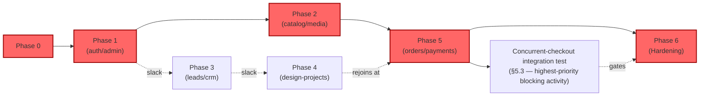
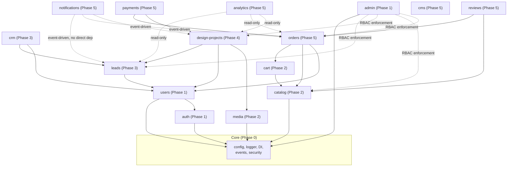
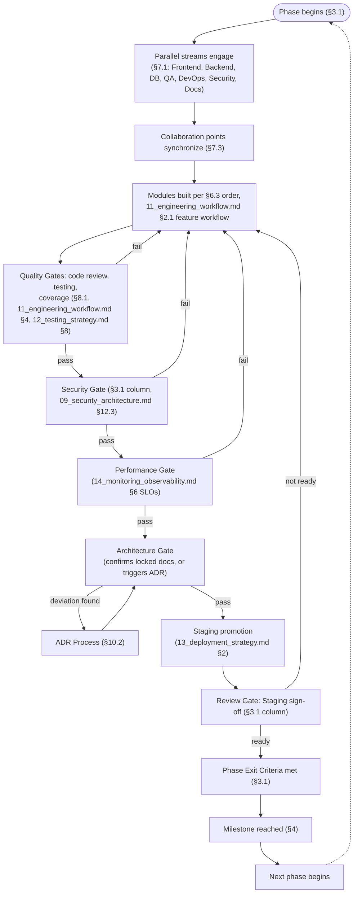
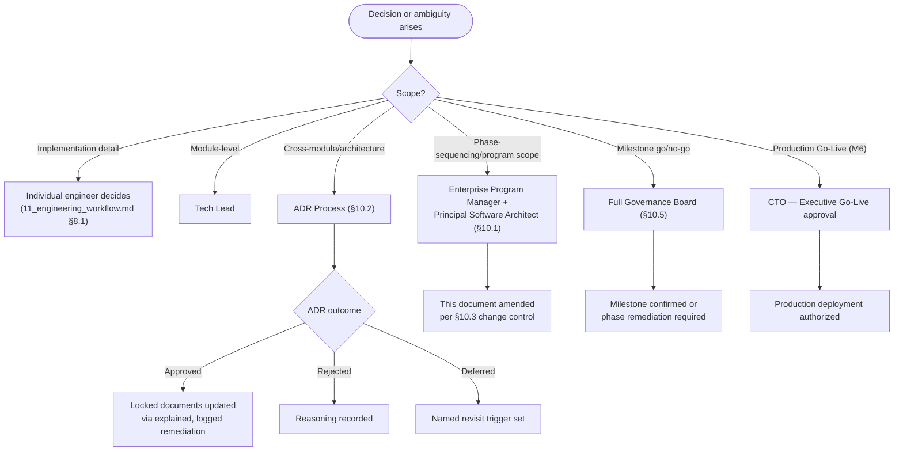
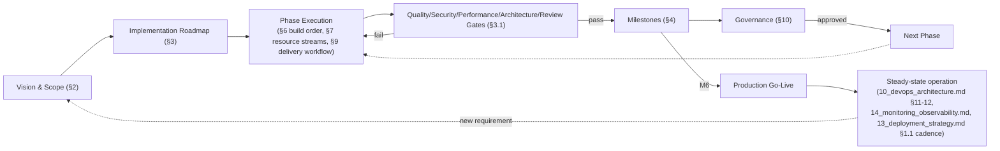

# Enterprise Master Project Plan

## National Furniture & Interiors Platform — Executive Implementation Blueprint

**Prepared by:** Enterprise Program Governance Board (CTO, Enterprise Program Manager, Principal Software Architect, Principal Engineering Manager, Principal DevOps Architect, Principal Security Architect, Principal QA Architect, Product Director)
**Date:** 2026-08-07
**Status of `01`–`14`:** APPROVED and LOCKED, source of truth. Never modified, never duplicated. Referenced throughout by document and section number.
**Scope:** Not an architecture document — the executive implementation blueprint governing the complete software delivery lifecycle. This document consolidates `01`–`14`'s approved decisions into one implementation program. No implementation code.

---

## Revision History

| Version | Date | Change | Reason |
|---|---|---|---|
| v1.0 | 2026-08-07 | Initial version | — |

---

## 0. How to Read This Document

Fourteen documents precede this one. Each is authoritative in its own domain and none of them is re-explained here — this document's discipline is **citation, not restatement**: every claim below that could be verified against `01`–`14` carries that document's section number, and where this document needs to say something none of the fourteen said, that's flagged explicitly as new planning content, not architecture.

### 0.1 One Naming Reconciliation, Stated Up Front

The brief's Module Dependency Graph (Section 6) asks for fifteen named items — Authentication, Users, RBAC, Products, Categories, Inventory, Orders, Payments, Lead Generation, Interior Design, Portfolio, Blog, Notifications, Analytics, Admin — phrased at the *capability* level. `06_project_structure.md` §4.3 already locked a fifteen-module list phrased at the *module-ownership* level: `auth`, `users`, `leads`, `crm`, `design-projects`, `catalog`, `cart`, `orders`, `payments`, `reviews`, `media`, `notifications`, `cms`, `admin`, `analytics`. These are not two different module inventories — they're the same fifteen-module architecture described from two angles (the same tension already resolved once before, for repository layout, in `06_project_structure.md` §0). Section 6.1 below is the explicit mapping table; every module-dependency, build-order, and integration-order statement in this document uses the **locked `06_project_structure.md` names** as the source of truth, with the brief's capability-level names shown alongside for traceability.

### 0.2 What This Document Adds That `01`–`14` Didn't

Fourteen documents collectively cover business rationale, architecture, data, technology, API, security, DevOps, engineering process, testing, deployment, and observability — but none of them is a **phased delivery plan with gates, milestones, a critical path, and resourcing**. That is this document's entire job: Sections 3–9 are genuinely new planning content (phases, milestones, critical path, resource streams), built by sequencing and gating the already-locked decisions, never by re-deciding what those decisions are.

---

## 1. Analysis

Reads `01`–`14` as a set of fixed inputs to this program plan. Each row states what the source document decided and what planning consequence this document draws from it — not a re-explanation.

| Domain | Source | Planning consequence drawn here |
|---|---|---|
| Business Objectives | `01_business_research.md` | Priority order (Interior Design → Lead Generation → Furniture eCommerce) is the **business-value** ordering input to Section 3's phasing — reconciled against technical build order in Section 3.0 |
| Architecture | `02_enterprise_architecture.md` | Modular monolith, 15 modules, Clean Architecture layering — the module list Section 6 sequences |
| Database | `03_database_design.md` | 35 collections across 8 modules, index/migration discipline (`13_deployment_strategy.md` §5) — a per-module data dependency input to Section 6.3 |
| Repository decision | `04_architecture_decision.md` | Modular Monolith + Monorepo, extraction-trigger discipline — bounds this plan to a single-repository delivery program, not a multi-repo coordination problem |
| Repository strategy | `05_repository_strategy.md` | pnpm + Turborepo, package dependency graph — the build-order mechanic Section 6.4 relies on (affected-package detection) |
| Project structure | `06_project_structure.md` | `apps/`, `packages/`, module ownership/CODEOWNERS — Section 7's resource-planning ownership model is drawn directly from this |
| Technology | `07_technology_decision_record.md` | Full stack pin, 19 categories — no technology decision is open at program-planning time; every phase in Section 3 assumes the stack as given |
| API | `08_api_architecture.md` | REST, per-module contracts, versioning/deprecation policy — Section 6's integration-order input (a module's API contract must be locked before dependent modules integrate against it) |
| Security | `09_security_architecture.md` | Threat model, MFA/RBAC, OWASP mapping — Section 3's Security Gates and Section 8's Security review stream |
| DevOps | `10_devops_architecture.md` | 7 environments, CI/CD pipeline, blue-green for `api` — Section 3's environment-promotion entry/exit criteria |
| Engineering Workflow | `11_engineering_workflow.md` | SDLC, sprints, DoR/DoD, code review, ADR process — Section 10's governance is built directly on this, not re-derived |
| Testing | `12_testing_strategy.md` | Pyramid, per-module test scope, coverage floors, flaky-test policy — Section 3's Quality Gates |
| Deployment | `13_deployment_strategy.md` | Release cadence, environment promotion, migration workflow, rollback — Section 9's Release Planning |
| Monitoring | `14_monitoring_observability.md` | SLI/SLO/error budgets, incident management, capacity planning — Section 3's Performance Gates and Section 9's Go-Live readiness |

### 1.1 Dependencies, Critical Path, Milestones, Delivery Risks, Cross-Team Dependencies, Integration Points

Identified once here as a named output of this analysis pass, then elaborated in the sections the brief dedicates to each: **Dependencies** → Section 6 (module dependency graph) and Section 3 (phase dependencies); **Critical Path** → Section 5; **Milestones** → Section 4; **Delivery Risks** → Section 8.5; **Cross-team Dependencies** → Section 7.3; **Integration Points** → Section 6.2.

---

## 2. Project Vision, Scope, and Success Criteria

### 2.1 Project Vision

Deliver a unified platform serving three converging business lines — Interior Design Services, Lead Generation, and Furniture eCommerce — on the single modular-monolith architecture already locked in `02`–`07`, built by one engineering organization following one disciplined delivery process (`11`–`14`), rather than three disconnected product efforts.

### 2.2 Project Scope

In scope: implementation of every module named in `06_project_structure.md` §4.3, against every contract locked in `08_api_architecture.md` §8, secured per `09_security_architecture.md`, deployed per `13_deployment_strategy.md`, observed per `14_monitoring_observability.md` — the full, already-designed system. Not a re-scoping exercise: this document does not add or remove a single module, endpoint, or collection from what `01`–`14` already defined.

### 2.3 Business Goals

Confirms `01_business_research.md`'s three-line-of-business framing and its priority order — restated here only as the input Section 3.0 reconciles against technical sequencing, not re-derived.

### 2.4 Success Criteria

| Criterion | Definition |
|---|---|
| Functional completeness | Every module in Section 6.1's table reaches Definition of Done (`11_engineering_workflow.md` §7.2) for its Phase 3 scope |
| Quality | `12_testing_strategy.md` §6's coverage targets met; zero unresolved Critical/High findings from `09_security_architecture.md` §12.1's pre-launch checklist |
| Operational readiness | `10_devops_architecture.md` §16.3's Production Readiness Checklist and `14_monitoring_observability.md` §11.4's Production Health Checklist both pass |
| Business outcome | Section 2.5's Business KPIs trend in the intended direction post-launch (measured, not assumed, per `14_monitoring_observability.md` §14's baseline-data open item) |

### 2.5 Business KPIs

Drawn directly from `14_monitoring_observability.md` §3.11–3.13's already-designed business-metric catalog — not newly invented here: lead submission rate and lead-to-conversion rate (Lead Generation), checkout completion rate and average order value (eCommerce), stage-transition velocity and quotation-to-approval rate (Interior Design). Numeric targets remain the open item `14_monitoring_observability.md` §14 already named (pending a post-launch baseline period) — this document does not invent target numbers that document deliberately left for real data.

### 2.6 Technical KPIs

Drawn directly from `14_monitoring_observability.md` §6's formalized SLOs: 99.9% availability on checkout/payment/webhook/lead-capture, 99.5% on general API traffic; p95 checkout latency ≤15s (`08_api_architecture.md` §5.9); ≤0.1% error rate on checkout/payment paths; `12_testing_strategy.md` §6.2's 80% coverage floor on Domain/Application layers; `10_devops_architecture.md` §10.7's RTO 4h/RPO 15min DR targets.

### 2.7 Project Constraints

| Constraint | Source |
|---|---|
| Single modular monolith, no premature microservices | `04_architecture_decision.md` §7 |
| Fixed technology stack (no open technology decisions at planning time) | `07_technology_decision_record.md` |
| MVP-stage team size (informs every "match the tool to the team" decision already made) | `07_technology_decision_record.md` §16.1, §19.2; `10_devops_architecture.md` §6.7 |
| India-first regulatory/payment scope (DPDP Act, Razorpay) | `01_business_research.md` §9; `09_security_architecture.md` §8.4, §8.6 |
| Weekly release cadence, no continuous deployment to Production | `13_deployment_strategy.md` §1.1 |

### 2.8 Assumptions

Carried forward, not newly introduced: the four open business-model questions from `02_enterprise_architecture.md` §19 (in-house vs. partner-network design team, owned-inventory vs. marketplace model, physical showrooms, initial geography) remain **assumed resolved in favor of the locked architecture's current scope** (in-house team, owned inventory, single-city/no-showroom, India-only) for the purposes of this plan — if any is resolved differently, Section 8.1's Business Risk row already names the architectural consequence, and this plan's phasing (Section 3) would need revisiting via the ADR process (`11_engineering_workflow.md` §2.6), not silently absorbed.

### 2.9 Out of Scope

Everything named as a Phase 2+/deferred/trigger-based item across `01`–`14` remains out of scope for this plan's phases (Section 3): a dedicated search service (`07_technology_decision_record.md` §12.2), canary deployment (`10_devops_architecture.md` §6.7), chaos testing (`12_testing_strategy.md` §4.15), SIEM integration (`09_security_architecture.md` §7.5), Designer Partner Network / multi-vendor marketplace support (`03_database_design.md` §16), and any capability tied to a not-yet-met trigger named in those documents. This document does not pull any of them forward.

---

## 3. Implementation Roadmap

### 3.0 Reconciling Business Priority Order and Technical Build Order

`01_business_research.md`'s priority order (Interior Design → Lead Generation → Furniture eCommerce) is a **business-value** ordering — it says which capability matters most once live. It is not a **buildable** ordering: `design-projects` depends on `leads` (a design project originates from a converted lead, `03_database_design.md` §6's ER diagram) and both depend on `auth`/`users`/`admin` existing first (every module requires identity and RBAC, `02_enterprise_architecture.md` §9/§14). **This is not a conflict** — it's the same two-axis pattern already resolved for repo-count-vs-tooling in `04`/`05` and for root-layout-vs-technical-folders in `06`: business priority determines *which capability gets the most refinement effort and earliest business-facing polish once its dependencies are ready*; technical dependency determines *the actual build sequence*. Section 3.1's phases are sequenced by technical dependency, with each phase explicitly noting which business-priority capability it unblocks.

### 3.1 Phases

| Phase | Purpose | Business Value | Deliverables | Dependencies | Entry Criteria | Exit Criteria | Acceptance Criteria | Architecture Gate | Quality Gate | Security Gate | Performance Gate | Review Gate |
|---|---|---|---|---|---|---|---|---|---|---|---|---|
| **Phase 0 — Foundation** | Stand up the repository, CI/CD, environments, and core cross-cutting infrastructure before any feature module | Enables every subsequent phase; no direct business value on its own | Monorepo scaffolded per `06_project_structure.md`; `core/` (config, logger, DI, events, security) per `06` §4.2; all 7 environments per `10_devops_architecture.md` §3; CI pipeline per `10` §6.1 | None (first phase) | Repository strategy (`05`) and project structure (`06`) locked | `10_devops_architecture.md` §16.1 DevOps Checklist passes for Local/Shared-Dev/Testing | Local dev bootstrap completes in one command (`10` §14.1) | Principal Software Architect confirms folder structure matches `06` exactly | N/A — no application code yet | Secrets management operational per `09_security_architecture.md` §5.1 | N/A | Architecture Review not required (no deviation from locked docs) |
| **Phase 1 — Identity & Access** | Build `auth`, `users`, `admin` (RBAC/permissions) — every other module's hard dependency | Unblocks all business-facing work; indirectly serves every `01` priority equally | `auth`, `users`, `admin` modules per `06` §4.3's 4-layer template; JWT/MFA/RBAC per `09_security_architecture.md` §2 | Phase 0 complete | `core/` infrastructure operational | `12_testing_strategy.md` §3's `auth`/`users`/`admin` row test scope passes; `09` §12.1 pre-launch MFA/RBAC items pass | A `STAFF` account can register, MFA-enroll, log in, and be permission-checked against a protected route | Confirms `02_enterprise_architecture.md` §9/§14 exactly — Architecture Review only if a deviation is proposed | `11_engineering_workflow.md` §7.2 DoD met; `12` §6.2 coverage floor met | `09_security_architecture.md` §12.1 checklist items for auth/MFA/RBAC pass in Staging | Login/token-verification latency within `08_api_architecture.md` §5's general-API budget | Staging sign-off (`13_deployment_strategy.md` §2.4) |
| **Phase 2 — Catalog & Commerce Core** | Build `catalog` (Products/Categories/Inventory), `cart`, `media` — the eCommerce foundation, and the platform's highest-traffic read path | Serves Furniture eCommerce (`01` priority #3), but built early because `orders`/`payments` and `design-projects`' media needs both depend on it | `catalog`, `cart`, `media` modules; Cloudinary signed-upload path (`02` §15) | Phase 1 (auth/RBAC for admin catalog mutation) | `auth`/`admin` modules pass Phase 1 exit criteria | `12_testing_strategy.md` §3's `catalog`/`cart`/`media` rows pass; public catalog read endpoints match `08_api_architecture.md` §8 exactly | Public catalog browse/search/filter functions end-to-end against seeded data (`12` §5.3) | Confirms `02` §12 Product Flow, `03_database_design.md` §9.2 exactly | DoD met; `12` §6.2 coverage floor met on `catalog` | `09_security_architecture.md` §10 `catalog`/`media` row controls verified (upload signature, ownership re-validation) | `08_api_architecture.md` §5.1 cache-hit-ratio and catalog-read latency SLOs (`14_monitoring_observability.md` §6.2) met under `12` §4.7 load test | Staging sign-off |
| **Phase 3 — Lead Generation & CRM** | Build `leads`, `crm` | Serves Lead Generation (`01` priority #2) — the first business-priority capability to go live, as early as its `auth` dependency allows | `leads`, `crm` modules; CAPTCHA, consent-gating, outbox pattern (`02` §10 v1.1) | Phase 1 (auth for admin lead-triage) | Phase 1 exit criteria met | `12_testing_strategy.md` §3's `leads`/`crm` rows pass, including the outbox at-least-once-delivery test (`00_architecture_review.md` finding A3's scenario) | Public lead submission succeeds, is scored, and triggers a queued notification within the SLO (`14` §6.2) | Confirms `02` §10 exactly | DoD met; coverage floor met | `09` §10 `leads` row (bot-flood, consent-bypass) verified; `09` §12.1 CAPTCHA item passes | `14_monitoring_observability.md` §3.11's Lead Generation metrics instrumented and dashboarded (`14` §5.2) before this phase's sign-off | Staging sign-off; **Business Verification** (`13_deployment_strategy.md` §7.5) by Product Director specifically, given this is the first `01`-priority-ordered capability live |
| **Phase 4 — Interior Design Workflow** | Build `design-projects`, `reviews` (portfolio-adjacent), the state-machine core | Serves Interior Design (`01` priority #1) — the platform's highest business value, built after its `leads`/`media`/`payments` dependencies are ready | `design-projects` module, state machine (`02` §13), quotation/milestone-payment flow | Phase 3 (`leads` conversion source), Phase 2 (`media` for assets, `catalog`-adjacent payment pattern reuse from Phase 5) | Phase 3 exit criteria met; `payments` module (Phase 5) contract locked even if not yet fully built, per `08_api_architecture.md` §8's contract-first principle | `12_testing_strategy.md` §3's `design-projects` row passes, including the `version` optimistic-concurrency and ownership-scoping tests | A lead converts to a design project, advances through at least one full stage transition, and a milestone payment intent can be created | Confirms `02` §13 state machine exactly — any deviation requires Architecture Review (`11_engineering_workflow.md` §2.6) | DoD met; coverage floor met | `09_security_architecture.md` §10 `design-projects` row (DESIGNER ownership scoping, quotation tampering) verified | `14_monitoring_observability.md` §3.13's Interior Design metrics instrumented before sign-off | Staging sign-off; Business Verification by Product Director |
| **Phase 5 — Orders, Payments, Notifications, CMS, Analytics** | Build the remaining modules: `orders`, `payments`, `notifications`, `cms`, `analytics` | Completes Furniture eCommerce (`01` priority #3) and closes the platform's cross-cutting notification/reporting layer every prior phase already assumed | `orders`, `payments` (Razorpay webhook, `02` §11), `notifications` (outbox relay consumer), `cms`, `analytics` | Phase 2 (`cart`/`catalog`), Phase 4 (payment-pattern reuse, `02` §13) | Phase 2 and Phase 4 exit criteria met | `12_testing_strategy.md` §3's `orders`/`payments` rows pass, **specifically including the concurrent-checkout inventory-reservation test** (Section 5's highest-priority integration test per `12` §4.2) | A full checkout completes, webhook-confirms, and correctly commits inventory under concurrent-load simulation with zero overselling | Confirms `02` §11 exactly — this phase's checkout flow is the platform's single highest-stakes architecture confirmation | DoD met; coverage floor met; `12` §11.3 Release Testing Checklist passes in full | `09_security_architecture.md` §12.1 full pre-launch checklist passes (webhook signature, PCI-scope confirmation `09` §8.5) | `14_monitoring_observability.md` §6.1–6.4 full SLO set met under `12` §4.7 spike-load test; `13_deployment_strategy.md` §4.5 cron-singleton verified for `notifications`/`worker` | Staging sign-off; **Go-Live Readiness Review** (Section 12.5) — this phase completes the MVP scope |
| **Phase 6 — Hardening & Launch** | Production-readiness closure: DR exercise, load test at real scale, final security review, documentation completion | Protects every prior phase's business value by ensuring it survives real production conditions | `10_devops_architecture.md` §16.3 Production Readiness Checklist executed (not just documented); `13_deployment_strategy.md` §10.2 Go-Live Checklist executed; first DR exercise (`10` §10.7) | All of Phase 1–5 | All modules at Definition of Done | `09_security_architecture.md` §12.1, `10_devops_architecture.md` §16.3, `14_monitoring_observability.md` §11.4 checklists all pass | Production Sign-off (`13_deployment_strategy.md` §7.6) granted | Full Architecture Review of the delivered system against `00_architecture_review.md`'s original 10-dimension scorecard, confirming no drift | Full regression suite (`12` §4.10) green; zero unresolved Critical/High findings anywhere | Full `09` §12.1 checklist, formal PCI-DSS SAQ engagement scheduled (`09` §8.5's still-open item) | DR exercise completed with measured RTO/RPO against `10` §10.7 targets | **Executive Go-Live approval** (Section 10.5's escalation matrix apex) |

### 3.2 Phase Dependency Diagram

```mermaid
flowchart LR
    P0["Phase 0 — Foundation"] --> P1["Phase 1 — Identity & Access<br/>(auth, users, admin)"]
    P1 --> P2["Phase 2 — Catalog & Commerce Core<br/>(catalog, cart, media)"]
    P1 --> P3["Phase 3 — Lead Generation & CRM<br/>(leads, crm)"]
    P3 --> P4["Phase 4 — Interior Design<br/>(design-projects, reviews)"]
    P2 -.media, payment-pattern.-> P4
    P2 --> P5["Phase 5 — Orders/Payments/Notifications/CMS/Analytics<br/>(orders, payments, notifications, cms, analytics)"]
    P4 -.payment-pattern reuse.-> P5
    P5 --> P6["Phase 6 — Hardening & Launch"]

    P3 -.serves 01_business_research.md priority #2.-> Biz["Business Priority Order<br/>(reconciled, §3.0)"]
    P4 -.serves priority #1.-> Biz
    P5 -.serves priority #3.-> Biz
```

---

## 4. Milestone Planning

| Milestone | Objectives | Deliverables | Approval Required | Dependencies | Completion Criteria |
|---|---|---|---|---|---|
| **M0 — Foundation Ready** | Repository, CI/CD, environments operational | Phase 0 deliverables | Principal DevOps Architect | None | `10_devops_architecture.md` §16.1 checklist passes |
| **M1 — Identity Platform Live** | Auth/RBAC usable by every subsequent module | Phase 1 deliverables | Principal Security Architect + Principal Software Architect | M0 | Phase 1 exit criteria (Section 3.1) |
| **M2 — Catalog Live (Internal)** | Full product browse/search functional in Shared Dev/Staging | Phase 2 deliverables | Principal Software Architect | M1 | Phase 2 exit criteria |
| **M3 — First Business-Priority Capability Live: Lead Generation** | `01_business_research.md` priority #2 reaches Staging with Business Verification | Phase 3 deliverables | Product Director + Principal QA Architect | M1 | Phase 3 exit + acceptance criteria |
| **M4 — Highest Business-Priority Capability Live: Interior Design** | `01_business_research.md` priority #1 reaches Staging with Business Verification | Phase 4 deliverables | Product Director + Principal Software Architect | M3, M2 (media) | Phase 4 exit + acceptance criteria |
| **M5 — MVP Feature-Complete** | Every locked module reaches Definition of Done | Phase 5 deliverables | Full Governance Board (Section 10) | M2, M4 | Phase 5 exit criteria, including the concurrent-checkout integration test passing |
| **M6 — Production Go-Live** | Platform live in Production | Phase 6 deliverables | CTO (Executive Go-Live approval, Section 10.5) | M5 | Section 12.5 Go-Live Readiness Checklist passes in full |

### 4.1 Milestone Timeline

```mermaid
gantt
    title National Furniture & Interiors — Milestone Timeline (relative sequencing, not calendar-committed)
    dateFormat X
    axisFormat %s

    section Foundation
    M0 Foundation Ready :m0, 0, 1

    section Identity
    M1 Identity Platform Live :m1, after m0, 1

    section Commerce Core
    M2 Catalog Live (Internal) :m2, after m1, 1

    section Business Priorities
    M3 Lead Generation Live :m3, after m1, 1
    M4 Interior Design Live :m4, after m3, 1

    section Completion
    M5 MVP Feature-Complete :m5, after m2, 1
    M6 Production Go-Live :milestone, after m5, 0
```



**Note on timeline representation:** this Gantt chart is deliberately relative-sequenced, not calendar-dated — consistent with `13_deployment_strategy.md` §14's open item that release cadence itself is a placeholder pending real velocity data, assigning calendar dates here would manufacture false precision this program doesn't yet have the data to support. Milestone *order* and *dependency* are the load-bearing information; actual dates are set once Phase 0's velocity is observed (Section 8.5).

---

## 5. Critical Path Analysis

### 5.1 Critical Activities

The single unbroken dependency chain determining the earliest possible Production Go-Live: **Phase 0 → Phase 1 (`auth`/`admin`) → Phase 2 (`catalog`/`media`) → Phase 5 (`orders`/`payments`) → Phase 6 (Hardening).** This is the critical path because every other chain (Phase 3 → Phase 4) has slack relative to it, per Section 5.2.

### 5.2 Parallel Activities

Phase 3 (`leads`/`crm`) and Phase 4 (`design-projects`) can proceed **in parallel with Phase 2's later portion** once Phase 1 completes — `leads` depends only on Phase 1, not Phase 2, so a second development stream (Section 7.1) can begin Phase 3 while the first stream continues Phase 2. Phase 4 has one real dependency on Phase 2 (`media` for design-project assets), so it trails Phase 2 by that specific integration point but does not require Phase 2's *full* completion, only its `media` module's contract being stable (`08_api_architecture.md` §6.1's contract-first principle, `11_engineering_workflow.md` §2.3's shift-left mechanism).

### 5.3 Blocking Activities

Any activity on the critical path (Section 5.1) that is not yet complete blocks Phase 6 by construction. The single highest-consequence blocking activity in the entire program: **Phase 5's concurrent-checkout inventory-reservation integration test** (`12_testing_strategy.md` §4.2) — per that document's own framing, this is "the platform's single highest-priority integration test," and Phase 6's Go-Live gate (Section 3.1) cannot be entered without it passing, full stop.

### 5.4 Risk Activities

Activities carrying elevated schedule risk, cross-referencing already-named risks rather than inventing new ones: the Razorpay webhook integration (Phase 5) — `09_security_architecture.md` §10's `payments` row already names webhook forgery/replay as its highest-priority threat, and `13_deployment_strategy.md` §6's payment-alert design implies this integration's correctness is genuinely hard to get right on the first attempt; the DR exercise (Phase 6) — `10_devops_architecture.md` §19's own open item already flags RTO/RPO as "targets to validate," meaning the first exercise carries real schedule risk if targets aren't met on the first attempt.

### 5.5 Long-Lead Activities

Activities worth starting early precisely because they have long feedback loops, not because they're on the critical path per se: `09_security_architecture.md` §8.5's formal PCI-DSS SAQ engagement (external, vendor-dependent, worth initiating during Phase 5 rather than waiting for Phase 6); the first `10_devops_architecture.md` §10.7 DR exercise (Section 5.4 already flags its risk; scheduling it as early as Phase 5's infrastructure allows, rather than deferring it entirely to Phase 6, reduces the chance of a Phase-6-blocking surprise).

### 5.6 Critical Path Diagram



---

## 6. Module Dependency Graph

### 6.1 Brief-to-Locked-Module Mapping

| Brief's capability name | Locked module (`06_project_structure.md` §4.3) | Notes |
|---|---|---|
| Authentication | `auth` | |
| Users | `users` | |
| RBAC | `auth` (enforcement mechanism) + `admin` (role/permission management) | Not a standalone module — confirms `02_enterprise_architecture.md` §14's permission-key model, split across the two modules that own it |
| Products, Categories, Inventory | `catalog` | Three brief-level items, one locked module — `03_database_design.md` §4's Catalog collection group |
| Orders | `orders` | |
| Payments | `payments` | |
| Lead Generation | `leads` (+ `crm` for post-conversion) | |
| Interior Design | `design-projects` | |
| Portfolio | `design-projects` (published case studies, `03_database_design.md` §9.4.3's `portfolios` collection) + `media` (assets) | Not a standalone module |
| Blog | `cms` | `03_database_design.md` §9.6.1's `blogs` collection lives in `cms` |
| Notifications | `notifications` | |
| Analytics | `analytics` | |
| Admin | `admin` | |
| *(not named in the brief, but load-bearing)* | `cart`, `reviews` | Included here for completeness — `cart` is `orders`' direct dependency; `reviews` depends on `orders` for purchase verification (`08_api_architecture.md` §8) |

### 6.2 Module Dependency Diagram

Confirms `02_enterprise_architecture.md` §6's module diagram exactly — not redrawn, only re-expressed with build/integration/testing/deployment order annotations (Section 6.3–6.4) this document adds for the first time.



### 6.3 Build Order

Confirms Section 3.1's phase sequencing exactly: Core → `auth`/`users`/`admin` → `catalog`/`cart`/`media` → `leads`/`crm` → `design-projects` → `orders`/`payments`/`notifications`/`cms`/`analytics`/`reviews`. Within Phase 5, `orders` is built before `payments` (a payment intent requires an order to attach to, `02_enterprise_architecture.md` §11), and `notifications` is built in parallel with both (it depends on the outbox pattern from `02` §16, already established in Phase 3, not on `orders`/`payments` themselves — it consumes their events once they emit them, per the module dependency diagram's event-driven, no-direct-dependency edges).

### 6.4 Integration Order

Confirms `08_api_architecture.md` §6.1's contract-first principle as the mechanism: a module's API contract (its `08` §8 table row) is locked and published **before** any dependent module's development begins consuming it — this is what allows Section 5.2's parallel Phase 3/Phase 4 streams to proceed without waiting for the producing module's full implementation, only its contract. Concretely: `leads`' contract must be stable before `design-projects`' conversion-source integration is built; `catalog`/`media`'s contracts must be stable before `design-projects`' asset-attachment integration is built.

### 6.5 Testing Order

Confirms `12_testing_strategy.md` §2.1's pyramid and Section 8 (CI Test Pipeline) exactly: unit → integration → contract → E2E, applied **per module** as it's built (Section 6.3's order), with the platform's one mandatory cross-module integration test (the concurrent-checkout inventory reservation, `12` §4.2) executed at the Phase 5 boundary since it's the first point both `orders` and `catalog`'s inventory logic exist together.

### 6.6 Deployment Order

Confirms `13_deployment_strategy.md` §2.2's environment-promotion path exactly, applied per phase: each phase's modules promote through Local → Shared Development → Testing → Staging → (only at Phase 6) Production — no module reaches Production individually ahead of its phase; Production deployment is a Phase 6 event for the whole accumulated system, not a per-module rolling launch, consistent with this being an MVP delivery program rather than a continuously-shipping mature product (`13_deployment_strategy.md` §1.1's weekly-cadence-post-launch model begins *after* M6, not during Phases 1–5).

---

## 7. Resource Planning

### 7.1 Development Streams

| Stream | Scope | Primary Phases | Ownership Model |
|---|---|---|---|
| Frontend | `apps/storefront`, `apps/admin` (`06_project_structure.md` §3) | All phases, trailing each backend module by one integration cycle (frontend consumes a module's contract once published, per Section 6.4) | Senior Frontend Architect-designated owners per `06` §3's app structure |
| Backend | `apps/api`'s 15 modules (`06` §4.3) | All phases, per Section 6.3's build order | CODEOWNERS per module (`06` §2.2, `11_engineering_workflow.md` §4.3) |
| Database | `03_database_design.md` schema, `13_deployment_strategy.md` §5 migration workflow | Phase 0 (schema foundation) through Phase 6 (production migration execution) | Database Architect, cross-cutting across all phases |
| QA | `12_testing_strategy.md`'s full pyramid | All phases, embedded per Section 6.5's testing order | QA Lead, with per-module test-scope ownership mirroring backend module ownership |
| DevOps | `10_devops_architecture.md`/`13_deployment_strategy.md`'s environment and pipeline operation | Phase 0 (heaviest), continuous thereafter | Principal DevOps Architect |
| Security | `09_security_architecture.md`'s control implementation and review | Phase 1 (heaviest — identity/RBAC), continuous review thereafter (Section 8's Security Review stream) | Principal Security Architect |
| Documentation | `docs/` hierarchy (`06_project_structure.md` §8), including this document's own maintenance | Continuous — every phase's exit criteria includes its documentation obligations per `11_engineering_workflow.md` §6.1 | Documentation owner per sub-folder, per `06` §8's CODEOWNERS-per-sub-folder model |

### 7.2 Estimation

**Not numerically estimated in this document** — consistent with `13_deployment_strategy.md` §14's already-stated position that release cadence and velocity are placeholders pending real data, this document does not manufacture person-week estimates with no historical velocity to base them on. Instead: Section 3.1's phases are the estimation *unit* (a phase is sized to be roughly comparable in scope to its peers, per its module count and dependency depth), and Section 8.5 names "estimation accuracy, once real velocity exists" as the concrete mechanism by which numeric estimates get added to this plan later, via the same document-evolution discipline `11_engineering_workflow.md` §10 already established.

### 7.3 Collaboration Points (Cross-Team Dependencies)

The concrete points where two streams (Section 7.1) must synchronize, not just where one depends on the other's output asynchronously:

- **Backend ↔ Frontend**, at every Section 6.4 contract-lock moment — `08_api_architecture.md` §6.1's OpenAPI generation is the artifact both streams synchronize against.
- **Backend ↔ Database**, at every `13_deployment_strategy.md` §5.1 migration — a schema change and its consuming application code are sequenced together (`13` §5.2's backward-compatibility rule), requiring the two streams to coordinate timing, not just hand off a finished migration script.
- **Backend ↔ Security**, at every `09_security_architecture.md` §12.3-triggered PR (auth/PII/payment/external-integration code) — a required, not optional, collaboration point per that document's own review trigger.
- **QA ↔ every stream**, continuously, per `12_testing_strategy.md` §2.3's shift-left principle — QA is not a downstream gate only, it's embedded per Section 7.1's model.
- **All streams ↔ DevOps**, at every Section 3.1 phase's environment-promotion gate (`13_deployment_strategy.md` §2.4's Approval Gates) — the point where every stream's independent work becomes one deployable artifact.

---

## 8. Quality Management, Release Planning, and Risk Management

### 8.1 Quality Management

Confirms, does not redesign: **Architecture Reviews** — `11_engineering_workflow.md` §8.3's process, triggered per Section 3.1's Architecture Gate column. **Code Reviews** — `11_engineering_workflow.md` §4's full review process, applied to every PR across every phase. **Security Reviews** — `09_security_architecture.md` §12.3's per-PR trigger, `11_engineering_workflow.md` §4.7's routing mechanic. **Testing Gates** — `12_testing_strategy.md` §8's CI test pipeline, applied per phase per Section 6.5's testing order. **Performance Validation** — `12_testing_strategy.md` §4.7's load testing, gated per Section 3.1's Performance Gate column, formally measured against `14_monitoring_observability.md` §6's SLOs. **Production Readiness Review** — `10_devops_architecture.md` §16.3 and `13_deployment_strategy.md` §7's Go-Live discipline, the substance of this plan's Phase 6 and Section 12.5's checklist.

### 8.2 Release Planning

Confirms `13_deployment_strategy.md` §1 and §2 in full: **Internal Releases** — every phase's Shared Development auto-deploy (`10_devops_architecture.md` §3.2). **Feature Releases** — `13` §1.5's standard release process, applying to post-M6 iteration, not the initial Phase 1–5 build-out (Section 6.6's note that Production deployment is a single Phase 6 event for the MVP). **Staging Validation** — `13` §2.4's Staging sign-off gate, required at every phase's exit criteria (Section 3.1). **Production Releases** — `13` §7's full end-to-end process, executed once for M6, then per the normal weekly cadence thereafter. **Hotfix Strategy** — `13` §1.6/`11_engineering_workflow.md` §2.3, unchanged, applicable from M6 onward. **Rollback Readiness** — `13_deployment_strategy.md` §6's four-tier mechanism, confirmed as a Phase 6 exit-criteria verification item (Section 3.1's Go-Live Readiness Review).

### 8.3 Release Planning Note on Pre-M6 Deployment

Between M0 and M6, each phase's modules deploy through Shared Development and Staging (Section 6.6) but **not** Production — meaning `13_deployment_strategy.md`'s Production-specific mechanics (blue-green, rollback, DR) are exercised and verified in Staging repeatedly across Phases 1–5, so that by Phase 6 they are already proven processes being applied to Production for the first time, not designs being tested live for the first time under real launch pressure.

### 8.4 Risk Management

Per the brief's explicit instruction, summarized with citation only — no risk is re-analyzed here.

| Risk category | Summary | Owning document |
|---|---|---|
| Business Risks | WhatsApp/SMS provider dependency, DPDP Act compliance, high-value design-project fraud exposure | `01_business_research.md` §9; `09_security_architecture.md` §1.1 |
| Technical Risks | Inventory-race overselling, dual-cache staleness, event-delivery loss without the outbox pattern | `00_architecture_review.md` findings D1/P1/A3, resolved in `02`/`03`'s v1.1 |
| Security Risks | Full threat model, attack surface, per-module residual risk | `09_security_architecture.md` §1.2–1.3, §10 |
| Operational Risks | MongoDB Atlas/Redis unavailability, deploy-time human error, third-party outage propagation | `10_devops_architecture.md` §1.9 |
| Delivery Risks | Schedule risk on the Razorpay integration and first DR exercise | Section 5.4 of this document (new, program-level framing) |
| Dependency Risks | Cross-module contract instability, shared-package blast radius | `11_engineering_workflow.md` §1.8 |

### 8.5 Delivery Risks Specific to This Program Plan

**New — genuinely program-level, not previously named anywhere in `01`–`14`, since no prior document was scoped to phased delivery.** (1) Estimation risk: Section 7.2's deliberate non-estimation means schedule confidence is low until Phase 0–1 velocity is observed — mitigated by treating Section 4.1's timeline as ordinal, not calendar-committed, until then. (2) Parallel-stream coordination risk (Section 5.2's Phase 3/Phase 4 parallelism): contract drift between streams if Section 6.4's contract-first discipline isn't actually honored — mitigated by `08_api_architecture.md` §11's PR-level checklist already enforcing this. (3) Scope-creep risk: given this program's fourteen-document foundation is unusually thorough, the risk is a team over-engineering beyond what's locked rather than under-delivering — mitigated by `11_engineering_workflow.md` §9.3's KISS standard and this document's own Section 2.9 Out-of-Scope list being actively enforced at Section 3.1's Review Gates.

---

## 9. Delivery Workflow Diagram



---

## 10. Governance

Confirms `11_engineering_workflow.md` §8 exactly as the operative engineering governance model — this document does not redesign it. This section adds only the **program-level** governance layer that sits above individual engineering decisions.

### 10.1 Decision Making

Confirms `11_engineering_workflow.md` §8.1's three-tier decision model exactly (implementation detail → module-level → cross-module/architecture). This document adds a fourth, program-level tier: **phase-sequencing or scope decisions** (should Phase 3 and Phase 4 actually run in parallel, should a phase's scope be split) are made by the Enterprise Program Manager in consultation with the Principal Software Architect, using Section 5's critical-path analysis as the evaluation basis — a decision *about the plan*, distinct from a decision *within* an already-planned phase.

### 10.2 ADR Process

Confirms `11_engineering_workflow.md` §2.6/§8.3 exactly. No new design — every Architecture Gate in Section 3.1 that finds a deviation routes here, unchanged.

### 10.3 Change Control

Confirms `13_deployment_strategy.md` §12.2's Production Change Policy exactly for anything Production-bound (post-M6). For pre-M6 plan changes specifically (a genuinely new concern this document owns): a change to Section 3.1's phase scope, dependencies, or gates is itself an amendment to this document, following `11_engineering_workflow.md` §8.5's change-management process — this plan is "locked but not frozen" in exactly the same sense every document from `02` onward has been, changeable only through a recorded, reasoned update, never informally.

### 10.4 Architecture Ownership, Code Ownership, Module Ownership

Confirms `06_project_structure.md` §2.2, `11_engineering_workflow.md` §9.6–9.7 exactly — the same CODEOWNERS-per-module model Section 7.1's resource-planning table already applies. No new design.

### 10.5 Release Approval and Escalation Matrix

Confirms `13_deployment_strategy.md` §2.4's Approval Gates exactly for the mechanics of each promotion. This document adds the **program-level escalation matrix**, extending `11_engineering_workflow.md` §8.2's engineer-to-VP ladder upward to its apex for this program specifically:

| Escalation level | Scope | Escalates to |
|---|---|---|
| Module-level ambiguity | `11_engineering_workflow.md` §8.2, unchanged | Tech Lead |
| Cross-team/prioritization ambiguity | `11_engineering_workflow.md` §8.2, unchanged | Engineering Manager |
| Architecture-scope ambiguity | `11_engineering_workflow.md` §8.2, unchanged | Principal Software Architect |
| Phase-sequencing or program-scope ambiguity | New — Section 10.1's fourth tier | Enterprise Program Manager |
| Go/no-go on a Milestone (Section 4) | New | Full Governance Board (this document's participant list) |
| **Executive Go-Live approval (M6)** | New — the program's single highest decision point | **CTO** |

### 10.6 Governance Workflow Diagram



---

## 11. Project Lifecycle Diagram

The top-level view every diagram in this document (Sections 3.2, 5.6, 9, 10.6) is a component of:



---

## 12. Checklists

### 12.1 Executive Checklist

- [ ] Every Section 2.4 Success Criterion has a measurement mechanism defined (not just stated)
- [ ] Section 4's milestone approvals are staffed with named roles, not vacant
- [ ] Section 5's critical path is understood by every stream lead, not just documented
- [ ] Section 8.4's risk summary has been reviewed with each risk's owning document actually read, not assumed
- [ ] Section 10.5's escalation matrix is known to the full Governance Board before Phase 1 begins

### 12.2 Architecture Gate Checklist

Applied at every Section 3.1 Architecture Gate:

- [ ] Implementation matches the cited locked-document section exactly
- [ ] No undocumented deviation exists — if one is found, it routes to Section 10.2's ADR process before the gate passes
- [ ] Module boundary and dependency direction confirmed against Section 6.2's diagram
- [ ] Cross-module contract (`08_api_architecture.md` §8) unchanged from what dependent modules were built against (Section 6.4)

### 12.3 Implementation Readiness Checklist

Applied before Phase 1 begins (post-Phase 0):

- [ ] `10_devops_architecture.md` §16.1 DevOps Checklist passes
- [ ] `06_project_structure.md`'s full folder tree exists and matches exactly
- [ ] CI pipeline (`10` §6.1) green on a trivial test PR
- [ ] Section 7.1's stream ownership assigned to named roles
- [ ] Section 7.3's collaboration points understood by all streams

### 12.4 Milestone Review Checklist

Applied at every Section 4 milestone:

- [ ] Deliverables match the milestone's stated scope exactly
- [ ] Completion criteria met, verified not assumed
- [ ] Required approver(s) (Section 4's table) have explicitly signed off
- [ ] Dependencies for the *next* milestone are confirmed ready, not discovered missing after this milestone closes
- [ ] Any risk from Section 8.4/8.5 that materialized during this milestone is logged and, if it reveals a planning gap, routed to Section 10.3's change control

### 12.5 Go-Live Readiness Checklist

The Phase 6 exit gate — the single most consequential checklist in this document:

- [ ] `09_security_architecture.md` §12.1 full pre-launch Security Checklist passes
- [ ] `10_devops_architecture.md` §16.3 full Production Readiness Checklist passes
- [ ] `13_deployment_strategy.md` §10.2 full Go-Live Checklist passes
- [ ] `14_monitoring_observability.md` §11.4 full Production Health Checklist passes
- [ ] `12_testing_strategy.md`'s full regression suite green, including the concurrent-checkout test (Section 5.3)
- [ ] First DR exercise completed with measured RTO/RPO against `10_devops_architecture.md` §10.7 targets (Section 5.5)
- [ ] Formal PCI-DSS SAQ engagement scheduled or completed (`09_security_architecture.md` §8.5)
- [ ] Section 14's Final Consistency Review completed with zero unresolved Critical items
- [ ] CTO Executive Go-Live approval granted (Section 10.5)

### 12.6 Project Closure Checklist

Applied once the MVP program (Phases 0–6) is formally complete:

- [ ] Every Section 2.4 Success Criterion assessed against real post-launch data (not just pre-launch verification)
- [ ] Section 8.5's program-level delivery risks reviewed retrospectively — which materialized, which didn't, and why (feeding future program planning)
- [ ] Documentation (`06_project_structure.md` §8's full hierarchy, including this document) confirmed current, not drifted from what was actually built
- [ ] Post-launch operating model (weekly release cadence, `13_deployment_strategy.md` §1.1) formally begins, superseding this document's Phase-based cadence
- [ ] `11_engineering_workflow.md` §10.1's retrospective-driven process evolution formally takes over as the ongoing planning mechanism — this document's job (getting the MVP to M6) is complete, not perpetually re-run

---

## 13. Final Consistency Review

Per the brief's explicit requirement — performed as a verification pass, not a redesign.

### 13.1 Every Business Requirement Maps to One or More Implementation Phases

Verified: `01_business_research.md`'s three business lines each map to a named phase (Lead Generation → Phase 3, Interior Design → Phase 4, Furniture eCommerce → Phase 2 + Phase 5) per Section 3.1's table. `01`'s four still-open business-model questions (`02_enterprise_architecture.md` §19) are explicitly carried as Section 2.8 assumptions, not silently dropped.

### 13.2 Every Architecture Decision Has an Implementation Owner

Verified via Section 7.1's stream-ownership table and Section 10.4's confirmed-unchanged CODEOWNERS model: every one of the 15 modules (Section 6.1) has a named owning role; every cross-cutting concern (`06_project_structure.md` §4.2's `core/`) is owned per that document's existing table, confirmed not re-assigned here.

### 13.3 Every Module Has Defined Dependencies

Verified via Section 6.2's dependency diagram — every one of the 15 modules (plus `cart`, explicitly included in Section 6.1's completeness note) has at least one stated dependency edge or is explicitly marked as a Phase 0/1 foundation module with no upstream module dependency.

### 13.4 Every Critical Business Flow Has Testing, Deployment, and Monitoring Coverage

Verified: checkout/payment (`02_enterprise_architecture.md` §11) has `12_testing_strategy.md` §4.2's concurrency-simulation integration test, `13_deployment_strategy.md`'s standard deployment path, and `14_monitoring_observability.md` §4.8's dedicated Payment Alert category. Lead generation (`02` §10) has `12` §3's `leads` row, standard deployment, and `14` §4.9's dedicated Lead Generation Alert category. Interior Design workflow (`02` §13) has `12` §3's `design-projects` row, standard deployment, and `14` §3.13's dedicated business-metric set. No critical flow named across `01`–`14` was found without coverage across all three dimensions.

### 13.5 Every Milestone Has Measurable Acceptance Criteria

Verified via Section 4's table — every milestone's Completion Criteria cites a specific, checkable prior-document requirement (a checklist passing, a specific test scenario passing) rather than a subjective judgment call.

### 13.6 No Conflicts Exist With Documents 01–14

Verified via this document's own citation discipline (Section 0) — every claim in Sections 1–12 traces to a specific `01`–`14` section number; no section of this document asserts a fact contradicting its cited source. The one deliberate **reconciliation** (not conflict) is Section 0.1/Section 6.1's naming mapping, which is explicitly a translation between two vocabularies describing the same locked architecture, following the identical pattern `06_project_structure.md` §0 already used and validated for its own naming tensions.

### 13.7 Unresolved Items

Listed here, per the brief's explicit instruction, rather than silently absorbed:

- **Numeric schedule estimates** (Section 7.2) are deliberately not provided — this plan is ordinally, not calendarically, sequenced until Phase 0–1 real velocity data exists.
- **Section 2.5's Business KPI numeric targets** remain open pending the post-launch baseline period `14_monitoring_observability.md` §14 already named — this document does not manufacture target numbers that document deliberately deferred.
- **Section 2.8's four business-model assumptions** (in-house vs. partner design team, owned-inventory vs. marketplace, physical showrooms, initial geography) remain the same open items `02_enterprise_architecture.md` §19 originally carried forward — still unresolved as of this document, explicitly not decided here since doing so would be a business decision this Governance Board's engineering/architecture composition is not positioned to make unilaterally.
- **Section 9's DR-exercise and PCI-SAQ long-lead activities** (Section 5.5) have no committed start date yet — flagged as Phase 5 candidates, not yet scheduled, pending Phase 0–4 velocity informing when Phase 5 realistically begins.
- **`13_deployment_strategy.md` §14's `schema_migrations` collection formal addition to `03_database_design.md`'s Collection Inventory** remains open exactly as that document already flagged it — carried forward here, not resolved, since it requires the ADR process (Section 10.2), not a program-planning decision.

No new unresolved item was discovered in this consistency pass beyond what `01`–`14` already named as open — the fourteen-document foundation this plan builds on is, on this review, internally consistent.

---

## 14. Consistency Check Against Locked Documents

| Locked decision | Where | How this document complies |
|---|---|---|
| Business priority order | `01_business_research.md` | Confirmed as Section 3.0's business-value input, reconciled against technical build order, not overridden |
| Modular monolith, 15-module architecture | `02`, `04`, `06` | Confirmed as Section 6's dependency graph and Section 3's build order exactly |
| Full technology stack | `07_technology_decision_record.md` | Confirmed as a fixed input to every phase — no open technology decision anywhere in this plan |
| API contract-first, per-module contracts | `08_api_architecture.md` §6.1, §8 | Confirmed as Section 6.4's integration-order mechanism |
| Security controls, threat model, per-module risk | `09_security_architecture.md` | Confirmed as Section 3.1's Security Gate column and Section 8.4's risk summary |
| CI/CD, environments, deployment mechanics | `10_devops_architecture.md` | Confirmed as Section 3.1's entry/exit criteria and Section 6.6's deployment order |
| SDLC, sprints, DoR/DoD, governance | `11_engineering_workflow.md` | Confirmed as Section 10's governance foundation, extended only at the program level (Section 10.1, 10.5) |
| Testing pyramid, coverage floors | `12_testing_strategy.md` | Confirmed as Section 3.1's Quality Gate column and Section 6.5's testing order |
| Release/deployment/rollback strategy | `13_deployment_strategy.md` | Confirmed as Section 8.2–8.3's Release Planning |
| SLI/SLO/error budgets, incident management | `14_monitoring_observability.md` | Confirmed as Section 3.1's Performance Gate column and Section 2.5–2.6's KPIs |

No finding in this document required reopening any decision in `01`–`14`. This document is complete as the program's authoritative execution blueprint, pending only the unresolved items named in Section 13.7 — all of which were already open before this document was written, not newly discovered gaps.
