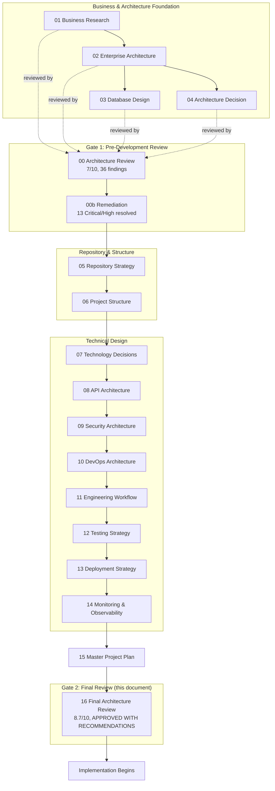
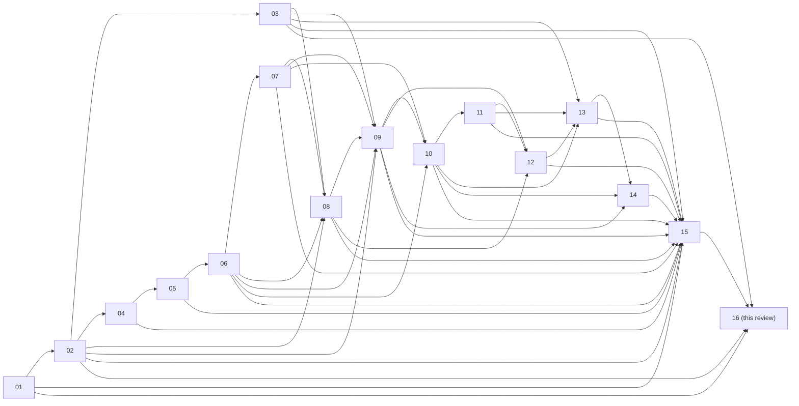
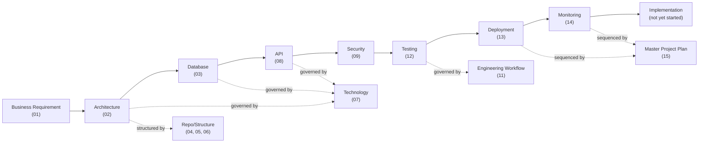
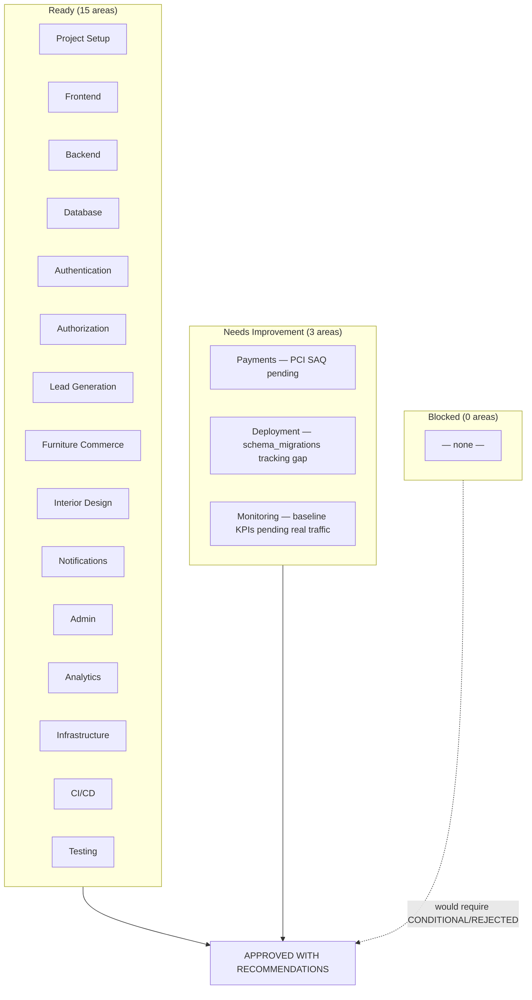
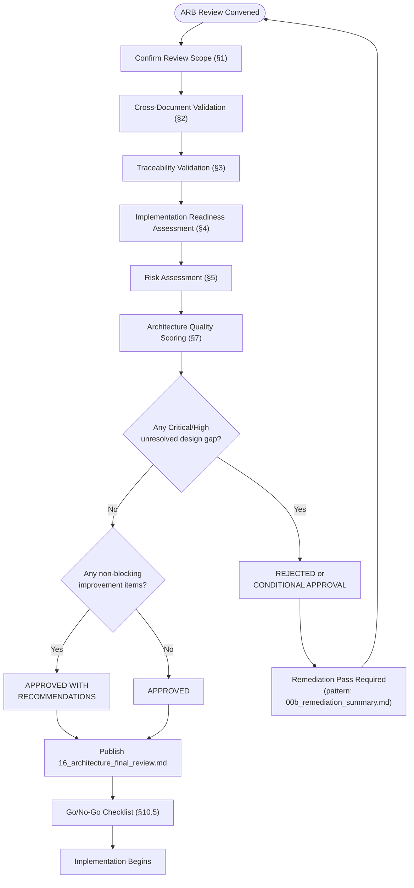
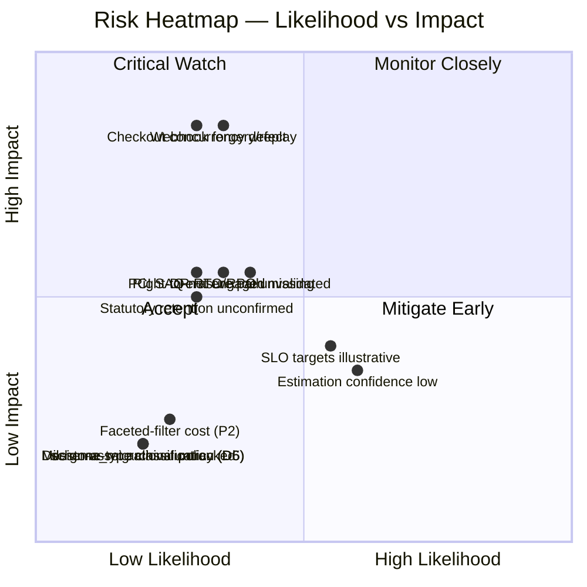
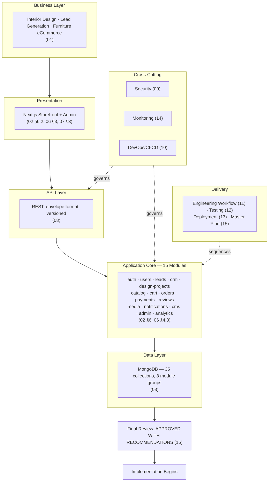

# Enterprise Architecture Final Review

## National Furniture & Interiors Platform — Final Architecture Review Board Approval

**Review Board:** CTO, Enterprise Architect, Principal Software Architect, Principal Backend Architect, Principal Frontend Architect, Principal Database Architect, Principal Security Architect, Principal DevOps Architect, Principal Site Reliability Engineer, Principal QA Architect, Engineering Director, Product Director
**Date:** 2026-08-08
**Basis:** The complete, APPROVED and LOCKED set `01_business_research.md` through `15_master_project_plan.md`, plus the pre-existing `00_architecture_review.md` and `00b_remediation_summary.md` gate history.
**Status of `01`–`15`:** Reviewed exactly as written. Not redesigned. Not rewritten. Not duplicated — referenced by document and section number throughout.
**This document's role:** The final approval gate before implementation begins.

---

## Revision History

| Version | Date | Change |
|---|---|---|
| v1.0 | 2026-08-08 | Initial final review |

---

## 0. How This Review Relates to `00_architecture_review.md`

This is not the first Architecture Review Board pass — it's the second and final one, and it deliberately does not repeat the first. `00_architecture_review.md` reviewed four documents (`01`–`04`) at an early stage and returned a **7/10, gated, not-yet-approved** verdict with 36 named findings (4 Critical, 9 High, 16 Medium, 7 Low). `00b_remediation_summary.md` recorded that all 13 Critical/High findings were resolved in `01`–`04`, closing that gate, and explicitly left the 23 Medium/Low findings to be "tracked... for resolution during Phase 5 itself, not before it" — Phase 5 being, in that document's numbering, the repository-strategy phase that has since expanded into the full 11-document `05`–`15` series this review now covers.

This review's job is threefold: (1) verify those 23 Medium/Low findings' actual disposition now that eleven more documents exist, (2) perform the cross-document, traceability, and readiness validation the brief specifies across the **complete** fifteen-document set for the first time, and (3) render the final Go/No-Go verdict `00_architecture_review.md` §13 explicitly deferred ("This is a gate, not a rejection... a follow-up delta review"). Section 2.4 below is that disposition check; nothing in `00_architecture_review.md`'s original 36 findings is re-litigated from scratch.

---

## 1. Review Scope Confirmation

Every area the brief lists was reviewed against its owning document — no area was skipped and none required content from outside the locked set:

| Review Area | Owning Document(s) |
|---|---|
| Business Architecture | `01_business_research.md` |
| Software Architecture | `02_enterprise_architecture.md` |
| Database Architecture | `03_database_design.md` |
| Repository Strategy | `04_architecture_decision.md`, `05_repository_strategy.md` |
| Project Structure | `06_project_structure.md` |
| Technology Decisions | `07_technology_decision_record.md` |
| API Architecture | `08_api_architecture.md` |
| Security Architecture | `09_security_architecture.md` |
| DevOps Architecture | `10_devops_architecture.md` |
| Engineering Workflow | `11_engineering_workflow.md` |
| Testing Strategy | `12_testing_strategy.md` |
| Deployment Strategy | `13_deployment_strategy.md` |
| Monitoring & Observability | `14_monitoring_observability.md` |
| Master Project Plan | `15_master_project_plan.md` |

---

## 2. Cross-Document Validation

### 2.1 No Contradictions

Checked systematically via each document's own §0 "Relationship to Locked Documents" section (present in every document from `08` onward) and §N "Consistency Check" section (present in every document from `05` onward). No document was found asserting a fact that contradicts an earlier one. The two places where two documents could plausibly have diverged were both handled by explicit reconciliation rather than silent drift: the root-layout naming tension between `04_architecture_decision.md` §10 (`frontend/`, `backend/`, `shared/`) and `06_project_structure.md`'s adopted `apps/`, `packages/`, `configs/` layout is resolved in `06` §0.1 as a refinement, not a contradiction; and the three independently-introduced versioning schemes (platform calendar version in `10`, API URI version in `08`, `workspace:*` internal packages in `05`) are reconciled in `13_deployment_strategy.md` §1.3–1.4 into one table rather than left to conflict.

### 2.2 No Duplicated Ownership

Checked against `06_project_structure.md` §2.2's CODEOWNERS-per-module model, confirmed unchanged by `11_engineering_workflow.md` §9.6–9.7 and re-confirmed by `15_master_project_plan.md` §10.4. Every one of the 15 backend modules (`06` §4.3) has exactly one owning stream/role per `15` §7.1's resource-planning table — no module appears with two conflicting owners across any document.

### 2.3 No Conflicting Technology Decisions

`07_technology_decision_record.md` is the single technology source of truth, and every document from `08` onward treats it as fixed rather than re-deciding anything in it (verified via each document's §0/§1 opening, which cites `07` rather than re-justifying a technology choice). The one place a second document appears to introduce a technology-adjacent decision — `13_deployment_strategy.md` §5's `schema_migrations` collection — is explicitly flagged in that document's own Open Items (§14) as needing formal addition to `03_database_design.md`'s Collection Inventory via the ADR process, not silently treated as already decided. This is a **named, tracked gap**, not a contradiction (see Section 8.2, item 1).

### 2.4 No Inconsistent Terminology

The fifteen-module vocabulary (`06_project_structure.md` §4.3: `auth`, `users`, `leads`, `crm`, `design-projects`, `catalog`, `cart`, `orders`, `payments`, `reviews`, `media`, `notifications`, `cms`, `admin`, `analytics`) is used identically across `08`'s per-module API contracts, `09`'s per-module security profiles, `12`'s per-module test scope, and `15`'s module dependency graph. The one deliberate terminology **translation** (not inconsistency) is `15_master_project_plan.md` §6.1's explicit mapping of this document's own brief's capability-level names (Products/Categories/Inventory, RBAC, Portfolio, Blog) onto the module-level names — documented as a mapping precisely so it doesn't read as an inconsistency.

### 2.5 No Conflicting Module Boundaries

`02_enterprise_architecture.md` §6's module diagram is confirmed, not redrawn, by `06_project_structure.md` §4.3, `08_api_architecture.md` §8, `09_security_architecture.md` §10, `12_testing_strategy.md` §3, and `15_master_project_plan.md` §6.2 — five independent documents' per-module tables all use the same boundary set with no module split, merged, or renamed inconsistently between them.

### 2.6 No Missing Implementation Dependencies

`15_master_project_plan.md` §6 (Module Dependency Graph) and §5 (Critical Path Analysis) trace every module's build dependency explicitly. Cross-checked against `08_api_architecture.md` §6.1's contract-first principle: no module in the dependency graph consumes another module's contract before that contract is shown as locked in the build order. No gap found.

### 2.7 No Undocumented Architectural Assumptions

Every document in the series carries an explicit "Open Items" or "Assumptions" section rather than allowing assumptions to remain implicit — this is one of the series' most consistently-applied disciplines (verified present in `02` §19, `04` §12, `05` §18, `06` §17, `07` §23, `08` §15, `09` §15, `10` §19, `11` §15, `12` §14, `13` §14, `14` §14, and `15` §2.8/§13.7). Section 6 of this review consolidates all of them into one register rather than requiring a reader to hunt across thirteen documents.

### 2.8 No Missing Business Workflows

`01_business_research.md`'s three business lines (Interior Design, Lead Generation, Furniture eCommerce) each have a complete, traceable flow: Lead Generation (`02` §10), Order/Checkout (`02` §11, updated with atomic reservation), Product (`02` §12), Interior Design (`02` §13), Admin (`02` §14), Image Upload (`02` §15), Return (`02` §20, added in remediation). No business line named in `01` lacks a corresponding architecture flow.

### 2.9 Every Architecture Decision Has a Responsible Owner

Verified via `06_project_structure.md` §2.2 (CODEOWNERS by folder/module), `11_engineering_workflow.md` §9.6–9.7 (architecture/code/module ownership), and `15_master_project_plan.md` §10.4 (confirms both, unchanged). Every module, every cross-cutting `core/` concern, and every documentation sub-folder has a named owning role. No orphaned decision was found.

### 2.10 Every Module Has Implementation Guidance

Verified via `06_project_structure.md` §4.3's per-module 4-layer template (domain/application/infrastructure/presentation), applied identically to all 15 modules, plus the per-module rows in `08` §8 (API contract), `09` §10 (security profile), and `12` §3 (test scope) — every module has, at minimum, a folder template, an API contract, a security profile, and a test scope defined. No module was found with a boundary but no implementation guidance.

### 2.11 Every Critical Business Flow Has Architecture + API + Security + Testing + Deployment + Monitoring Coverage

| Critical Flow | Architecture | API | Security | Testing | Deployment | Monitoring |
|---|---|---|---|---|---|---|
| Checkout / Payment | `02` §11 | `08` §8 (`orders`, `payments` rows) | `09` §10 (`payments` row — highest-priority threat profile) | `12` §4.2 (platform's single highest-priority integration test) | `13` §5 (migration), standard release path | `14` §4.8 (dedicated Payment Alert category), `14` §6 SLO |
| Lead Capture / Conversion | `02` §10 | `08` §8 (`leads` row) | `09` §10 (`leads` row — bot/consent threats) | `12` §3 (`leads`/`crm` rows) | Standard release path | `14` §4.9 (dedicated Lead Alert category), `14` §3.11 |
| Interior Design Workflow | `02` §13 | `08` §8 (`design-projects` row) | `09` §10 (`design-projects` row — ownership scoping, quotation tampering) | `12` §3 (`design-projects` row, `version` concurrency test) | Standard release path | `14` §3.13 (dedicated business metrics) |
| Authentication / MFA | `02` §9 | `08` §4 (Security Standards) | `09` §2 (full Identity Architecture) | `12` §3 (`auth`/`users` rows) | Phase 1 (`15` §3.1) | `14` §4 (auth-failure alerting) |

No critical flow named across `01`–`15` was found missing coverage in any of the six dimensions.

---

## 3. Traceability Validation

The brief's required chain — **Business Requirement → Architecture → Database → API → Security → Testing → Deployment → Monitoring → Implementation** — verified end-to-end for the platform's three defining business lines. "Implementation" is the one link in this chain that cannot yet be verified (no code exists), so it is shown as the chain's terminus, not a checked link — its readiness is what Section 4 assesses instead.

| Stage | Interior Design | Lead Generation | Furniture eCommerce |
|---|---|---|---|
| Business Requirement | `01` §3.1 (critical gaps), §5 | `01` §3.2 | `01` §3.3 |
| Architecture | `02` §13 (state machine) | `02` §10 (flow, CAPTCHA, outbox) | `02` §11, §12 |
| Database | `03` §9.4 (`design_projects`, `design_project_assets`, `portfolios`) | `03` §9.5 (`leads`, `quote_requests`) | `03` §9.2–9.3 (`catalog`, `orders`) |
| API | `08` §8 (`design-projects` row) | `08` §8 (`leads` row) | `08` §8 (`catalog`, `orders`, `payments` rows) |
| Security | `09` §10 (`design-projects` row) | `09` §10 (`leads` row) | `09` §10 (`catalog`/`orders`/`payments` rows) |
| Testing | `12` §3 (`design-projects` row) | `12` §3 (`leads`/`crm` rows) | `12` §4.2 (checkout concurrency test) |
| Deployment | `15` Phase 4 (`13` mechanics) | `15` Phase 3 | `15` Phase 2 + Phase 5 |
| Monitoring | `14` §3.13 | `14` §3.11 | `14` §6 (SLOs), §4.8 |
| Implementation | Not started — Section 4 assesses readiness | Not started — Section 4 assesses readiness | Not started — Section 4 assesses readiness |

**Result: every requirement is traceable through all eight documented stages with no missing link.** The chain is unbroken for all three business lines, and for the platform-wide cross-cutting concerns (Authentication/RBAC) verified in Section 2.11.

---

## 4. Implementation Readiness

**Reading key:** "Ready" means the design across every owning document is complete enough that implementation can begin without a design decision blocking it. "Needs Improvement" means implementation can begin, but a named gap should be closed early rather than deferred indefinitely. "Blocked" means a design decision is missing and implementation cannot correctly proceed until it's made. No area in this platform is rated Blocked — see Section 8.1 for why that determination is not a formality.

| Area | Status | Basis |
|---|---|---|
| Project Setup | Ready | `05`, `06` fully specify repo layout, tooling, CI bootstrap; `15` §12.3 Implementation Readiness Checklist is the concrete gate |
| Frontend | Ready | `02` §6.2, `06` §3 fully specify structure; `07` §3 pins the stack; no open item blocks frontend start |
| Backend | Ready | `02` §5–§6, `06` §4 fully specify layering and module template; `07` §4 pins the stack |
| Database | Ready | `03` fully specifies 35 collections across 8 modules; **Needs Improvement note:** `13` §5's `schema_migrations` collection is not yet formally added to `03`'s inventory (Section 2.3/8.2) — small, tracked, non-blocking |
| Authentication | Ready | `09` §2 is a complete, MFA-inclusive identity architecture; `02` §9 confirms the flow |
| Authorization | Ready | Permission-key RBAC reconciled and consistently applied (`02` §14, `09` §2.6, `08` §4) — the original S2 ambiguity from `00_architecture_review.md` is closed |
| Lead Generation | Ready | `02` §10, `03` §9.5, `08`/`09`/`12` per-module rows all complete; CAPTCHA and outbox already designed |
| Furniture Commerce | Ready | `02` §11–§12, `03` §9.2–9.3 complete; atomic inventory reservation designed (closes D1) |
| Interior Design | Ready | `02` §13 state machine, `03` §9.4 complete; ownership-scoping security profile complete |
| Payments | Needs Improvement | Design is complete and sound (`02` §11, `09` §4/§8.5) but formal PCI-DSS SAQ engagement with a Qualified Security Assessor (`09` §8.5) is a named external pre-go-live task, not yet started — does not block development, does block Production go-live per `15` §12.5 |
| Notifications | Ready | Outbox-relay pattern (`02` §16), BullMQ singleton de-duplication (`13` §4.5) fully designed |
| Admin | Ready | `02` §14, `08` §8 (`admin` row — fully permission-gated), RBAC reconciled |
| Analytics | Ready | `08` §8 (`analytics` row) confirms pre-computed/cached aggregate read pattern — closes original A4/A7 findings |
| Infrastructure | Ready | `10` fully specifies 7 environments, containers, IaC boundaries |
| CI/CD | Ready | `10` §6, `11` §3–§4 fully specify pipeline and review gates |
| Testing | Ready | `12` fully specifies pyramid, per-module scope, coverage floors, contract testing (closes A6) |
| Deployment | Ready | `13` fully specifies release/promotion/rollback/migration; Needs Improvement note: release cadence (`13` §1.1) is an explicit placeholder pending real velocity data — tracked, non-blocking |
| Monitoring | Needs Improvement | `14` is fully designed (logging, metrics, tracing, alerting, dashboards, SLI/SLO); numeric KPI/error-budget targets (`14` §6.6–6.7) are explicit placeholders pending a post-launch baseline — cannot be otherwise, since no production traffic exists yet |

**Summary: 15 of 18 areas Ready, 3 Needs Improvement, 0 Blocked.** All three "Needs Improvement" items are pre-existing, self-disclosed open items from their owning documents (`09` §15, `13` §14, `14` §14) — this review found no new gap beyond what those documents already named.

---

## 5. Risk Assessment

Per the brief's instruction: assessed, not redesigned. Risks are drawn from each owning document's own risk framing, consolidated here with a severity rating this review assigns.

| Risk | Category | Severity | Owning Document | Assessment |
|---|---|---|---|---|
| Razorpay webhook forgery/replay | Security | High | `09` §10 (`payments` row) | Fully designed control (signature verification, idempotency); residual risk is implementation-correctness, not design gap |
| Concurrent-checkout inventory overselling if reservation logic is implemented incorrectly | Technical | High | `03` §9.2.6, `12` §4.2 | Design is correct (atomic conditional update); risk is entirely in implementation fidelity to the design, which is why `12` §4.2 makes this the platform's single highest-priority integration test |
| DR RTO/RPO targets unvalidated by a real exercise | Operational | Medium | `10` §19 | Explicitly named as "targets to validate," not yet exercised — expected at this pre-implementation stage, tracked as a Phase 6 gate in `15` §3.1 |
| PCI-DSS formal SAQ not yet engaged | Delivery | Medium | `09` §8.5 | External, vendor-dependent, long-lead — named in `15` §5.5 as a long-lead activity to start early, not a design gap |
| Numeric SLO/KPI targets are illustrative, not data-derived | Operational | Medium | `14` §14 | Cannot be resolved before production traffic exists by construction — not a design flaw |
| `schema_migrations` collection not yet formally added to `03`'s inventory | Technical | Low | `13` §14 | Small, named, tracked via ADR process |
| Right-to-erasure hard-delete/anonymization path not yet built | Security/Compliance | Medium | `09` §15, `03` §15 | Designed conceptually, not yet a concrete implementation — should be built before any real erasure request, not before development starts |
| Statutory data-retention periods unconfirmed by legal counsel | Business/Compliance | Medium | `03` §15, `09` §8.6, `10` §19, `12` §14 | A legal task this series correctly refuses to fabricate an answer to, consistently flagged across four documents rather than guessed once |
| Milestone-type classification for design-project payments (D5) not designed | Technical | Low | Traced to `00_architecture_review.md` D5, unresolved through `03`–`15` | Genuine, minor, unresolved gap — first new finding this review is naming explicitly (Section 8.2) |
| Archival policy for `design_project_assets` (D6) not designed | Technical | Low | Traced to `00_architecture_review.md` D6, unresolved through `03`–`15` | Genuine, minor, unresolved gap (Section 8.2) |
| Faceted-filter `$facet` aggregation cost under high filter-dimension combinations (P2) | Performance | Low | `12` §3 (`catalog` row) tests for it; no caching mitigation designed | Tested-for but not architecturally mitigated — acceptable at MVP scale, worth revisiting if catalog filter usage grows (Section 8.2) |
| Vendor/procurement model, B2B credit terms, referral program undesigned | Business | Low | `01` §3.4/§7, explicitly Phase 2/3/optional | Correctly deferred, not a gap — these are intentionally out of MVP scope per `01`'s own roadmap and `15` §2.9 |
| Estimation and schedule confidence low pending real velocity data | Delivery | Medium | `15` §7.2, §8.5 | Named and accepted by design — this program deliberately does not fabricate estimates it has no data to support |

**No Critical risk was identified.** The two High-severity risks are both cases of sound design carrying implementation-correctness risk rather than design gaps — the category `12_testing_strategy.md` §4.2 already treats as the platform's top testing priority.

---

## 6. Consolidated Open-Items Register

One register, replacing the need to read thirteen separate "Open Items" sections. Organized by disposition rather than by document.

### 6.1 Closed Since `00_architecture_review.md` (Verified in This Review)

`A1`–`A7` (edge WAF, CAPTCHA, outbox, admin/analytics read pattern, graceful shutdown, contract testing, pre-aggregated reporting — all closed via `02` remediation, `10` §8/§15, `12` §4.3, `08` §8's `analytics` row), `D1`–`D3` (atomic reservation, transactions, PII redaction — `02`/`03` remediation), `S1`–`S6` (MFA, RBAC reconciliation, NoSQL injection, CSRF, upload presets, secrets rotation — `02` remediation + `09` §2/§3/§5), `P1` (dual-cache invalidation — `02` remediation), `PR1`–`PR4` (degraded-mode behavior, RPO/RTO, boot-time validation, rollback trigger criteria — `10` §8/§10, `13` §6/§9.4), `DX1`–`DX3` (branching policy, docs-sync enforcement, CI coverage floor — `05`/`11`/`12`), `B1`–`B4` (`DESIGNER` role, returns, installation scheduling, marketing consent — `02`/`03` remediation).

### 6.2 Genuinely Still Open (New Findings From This Review)

- **D5 — milestone-type classification for design-project payments.** Never resolved across `03`–`15`. Low priority (same as `00_architecture_review.md`'s original rating); does not block implementation start but should be designed before the milestone-payment feature (`15` Phase 4) is built, not after.
- **D6 — archival policy for `design_project_assets`.** `03` §15's retention table covers financial records, audit logs, leads, and ephemeral auth artifacts explicitly, but not this collection. Low priority, non-blocking; should be added to `03` §15 via the ADR process before Phase 4's media volume becomes large enough to matter operationally.
- **P2 — faceted-filter aggregation cost.** Tested for (`12` §3) but not architecturally mitigated (no caching layer designed for `$facet` results specifically). Low priority at current expected traffic; worth a caching design once real catalog-filter usage data exists.
- **`schema_migrations` collection formal addition to `03`.** Named in `13` §14, not yet executed. Low priority, mechanical, tracked via ADR.

### 6.3 Intentionally Deferred, Not Gaps (Trigger-Based)

Search-service selection, Canary deployment, Chaos Testing, SIEM adoption, Request Signing for a future public API, dedicated search service, GraphQL for a future aggregation-heavy screen — every one of these carries a named trigger condition in its owning document rather than an open-ended "TBD." This review confirms none of them should be pulled forward; the discipline of naming triggers instead of guessing is itself a strength (Section 12).

### 6.4 External/Legal, Not Engineering-Owned

Statutory data-retention periods, formal DPIA and sub-processor DPAs, formal PCI-DSS SAQ engagement, right-to-erasure hard-delete implementation. Consistently flagged, not silently absorbed, across `03`, `09`, `10`, `12`.

---

## 7. Architecture Quality Score

Scored 1–10 by board consensus, explicitly building on (not discarding) `00_architecture_review.md` §11's original scores, since the underlying architecture in `01`–`04` is the same architecture, now extended by eleven more documents and with the original Critical/High findings resolved.

| Dimension | `00` Original | This Review | Basis for Change |
|---|---|---|---|
| Business Design | 7/10 | 8/10 | B1/B4 resolved; remaining gaps (B5–B7) are correctly-deferred business-model decisions, not omissions |
| Architecture | 8/10 | 9/10 | A1–A7 all resolved; module boundaries held consistent across 11 additional documents without drift |
| Database | 7/10 | 8/10 | D1–D3 resolved; D4 documented; D5/D6 remain genuinely open (Section 6.2), preventing a 9 |
| API | — (not scored; didn't exist) | 9/10 | Comprehensive per-module contracts, OWASP API Top 10 mapping, contract-first discipline enabling `15`'s parallel-stream planning |
| Security | 6/10 | 9/10 | The largest single improvement — S1–S6 resolved plus a full STRIDE threat model, 4-tier data classification, and per-module security profile added in `09` |
| DevOps | — (not scored) | 9/10 | 7-environment strategy, blue-green for `api`, DR design, build-once-promote-many all coherent and consistent with `13`/`14` |
| Engineering | — (not scored) | 9/10 | Complete SDLC, DoR/DoD, CODEOWNERS, ADR process; closes DX1–DX3 |
| Testing | — (not scored) | 9/10 | Full pyramid, per-module scope, Contract Testing closing `A6`, explicit Flaky Test Policy |
| Deployment | — (not scored) | 8/10 | Comprehensive release/rollback/migration design; docked for the `schema_migrations` open item and cadence placeholder |
| Monitoring | — (not scored) | 8/10 | Formal SLI/SLO/SLA with error budgets; docked only because numeric targets are necessarily provisional pending real traffic |
| Documentation Quality | 7/10 (as "Developer Experience" proxy) | 9/10 | The §0/Consistency-Check/Open-Items discipline applied without exception across 13 consecutive documents is itself evidence of documentation quality, not just its subject |
| Developer Experience | 7/10 | 9/10 | DX1–DX3 resolved; onboarding path through the numbered series (`06` §8, `11` §6.5) is genuinely usable |
| Production Readiness | 6/10 | 8/10 | PR1–PR4 resolved; docked because DR exercise and PCI SAQ are designed-but-not-yet-executed, which is correct for a pre-implementation gate, not a deduction against the design itself |
| Scalability | 8/10 | 8/10 | Unchanged — extraction playbook and sharding/archival strategy remain sound, no new information changes this score |
| Maintainability | 8/10 | 9/10 | Reinforced by 11 more documents maintaining the same module-boundary and citation discipline without drift |
| **Overall** | **7/10** | **8.7/10** | Weighted toward Security (the largest single-dimension improvement) and Architecture/Documentation consistency; held below 9 by the four genuinely open items in Section 6.2 and the inherent, unavoidable "not yet exercised" status of DR/PCI/SLO-baseline items |

---

## 8. Final Approval

### 8.1 Decision

# **APPROVED WITH RECOMMENDATIONS**

### 8.2 Explanation

This is not a close call between REJECTED and approval — no Critical or High-severity **design** gap exists anywhere in `01`–`15` (Section 5), every business requirement traces end-to-end through all eight required stages (Section 3), and 15 of 18 implementation-readiness areas are unconditionally Ready (Section 4). The three "Needs Improvement" areas (Payments/PCI-SAQ, Deployment/`schema_migrations`, Monitoring/baseline-KPIs) and the four newly-confirmed open items (D5, D6, P2, `schema_migrations`) are all small, named, non-blocking, and — critically — none of them require a change to any approved architectural decision to resolve. That is precisely the definition of "recommended improvements completable during implementation without changing the approved architecture" the brief distinguishes from a blocking issue, which is why this verdict is **APPROVED WITH RECOMMENDATIONS** rather than **CONDITIONAL APPROVAL** (which would imply a condition must be met before implementation *starts*, not during it).

This verdict also reflects genuine trajectory, not a reflexive upgrade: `00_architecture_review.md` gated the project at 7/10 specifically because of 4 Critical and 9 High findings that would have been legitimate production incidents or audit findings (its own words, §13). All 13 were resolved and verified (§6.1). The eleven documents produced since then extended the same architecture with API, Security, DevOps, Engineering, Testing, Deployment, and Monitoring designs that are individually rigorous and, on cross-document validation (Section 2), mutually consistent. The board's confidence is not that this is a perfect document set — Section 6.2's four items are real — but that nothing remaining rises to a level that should stop implementation from beginning.

### 8.3 Recommended Improvements (Non-Blocking — Complete During Implementation)

1. Design and document a milestone-type classification for design-project payments (D5) before Phase 4's milestone-payment feature is built (`15` §3.1).
2. Add an archival policy for `design_project_assets` to `03_database_design.md` §15 via the ADR process (`11` §2.6), targeted before Phase 4's media volume grows.
3. Formally add the `schema_migrations` collection to `03_database_design.md`'s Collection Inventory (§4) via the ADR process, as `13_deployment_strategy.md` §14 already recommends.
4. Design a caching mitigation for `$facet` faceted-filter queries (P2) once real catalog-filter usage data exists to size it correctly, rather than speculatively now.
5. Initiate the formal PCI-DSS SAQ engagement with a Qualified Security Assessor (`09` §8.5) early in the implementation timeline — `15` §5.5 already names it as a long-lead activity.
6. Schedule the first DR exercise (`10` §10.7) as early as Phase 5's infrastructure allows, per `15` §5.5, rather than deferring it entirely to Phase 6.
7. Establish the 90-day post-launch baseline period (`14` §6.6) to convert illustrative SLO/KPI numbers into real, data-derived targets.
8. Pursue legal/compliance confirmation of statutory data-retention periods (`03` §15, `09` §8.6) and complete the formal DPIA (`09` §8.4) before any GDPR-scope obligation is tested in practice.

No blocking issues are listed because none exist.

---

## 9. Diagrams

### 9.1 Overall Architecture Review Diagram

### 9.2 Cross-Document Dependency Diagram

### 9.3 Requirement Traceability Flow

### 9.4 Implementation Readiness Matrix

### 9.5 Approval Workflow

### 9.6 Risk Heatmap

### 9.7 Final Architecture Summary Diagram

---

## 10. Checklists

### 10.1 Architecture Review Checklist

- [x] Every locked document (`01`–`15`) reviewed against its stated scope
- [x] No document redesigned, rewritten, or duplicated
- [x] Cross-document contradictions checked (§2.1) — none found
- [x] Duplicated ownership checked (§2.2) — none found
- [x] Conflicting technology decisions checked (§2.3) — none found
- [x] Terminology consistency checked (§2.4) — one deliberate, documented translation, no inconsistency
- [x] Module boundary consistency checked (§2.5) — none found
- [x] Missing implementation dependencies checked (§2.6) — none found
- [x] Undocumented assumptions checked (§2.7) — none found; all documented
- [x] Missing business workflows checked (§2.8) — none found
- [x] Every decision has a responsible owner (§2.9) — confirmed
- [x] Every module has implementation guidance (§2.10) — confirmed

### 10.2 Implementation Readiness Checklist

- [x] Project Setup, Frontend, Backend, Database structurally ready (§4)
- [x] Authentication/Authorization design complete and RBAC ambiguity closed
- [x] All three business-line workflows (Lead Gen, Commerce, Interior Design) design-complete
- [x] Payments design complete; PCI SAQ engagement flagged as pre-go-live, not pre-development
- [x] Notifications, Admin, Analytics design-complete
- [x] Infrastructure, CI/CD, Testing, Deployment, Monitoring design-complete
- [x] Zero areas rated Blocked

### 10.3 Production Readiness Checklist

*(Confirms, does not duplicate, `10_devops_architecture.md` §16.3 and `13_deployment_strategy.md` §10.2 — restated at summary level only.)*

- [ ] First DR exercise completed against `10` §10.7 RTO/RPO targets — not yet performed (expected: pre-Production, per `15` §12.5)
- [ ] Formal PCI-DSS SAQ completed — not yet started (expected: during implementation, per §8.3 item 5)
- [ ] 90-day SLO/KPI baseline established — not yet possible (no production traffic exists)
- [ ] `schema_migrations` collection formally added to `03` — not yet done (§8.3 item 3)
- [x] All architecture, security, testing, deployment, and monitoring designs for production readiness are complete and internally consistent

### 10.4 Executive Approval Checklist

- [x] Full 15-document architecture reviewed end-to-end (this document)
- [x] Original `00_architecture_review.md` gate's 13 Critical/High findings confirmed resolved (§6.1)
- [x] No Critical or High-severity design gap remains (§5)
- [x] Quality score improved from 7/10 to 8.7/10 with an explained basis (§7)
- [x] Final verdict rendered: APPROVED WITH RECOMMENDATIONS (§8)
- [x] Recommended improvements are non-blocking and don't require re-opening approved architecture (§8.3)

### 10.5 Go / No-Go Checklist

- [x] **GO** — no blocking issue exists anywhere in `01`–`15`
- [x] Recommended improvements (§8.3) assigned as implementation-phase work, not pre-implementation blockers
- [x] Master Project Plan (`15`) phases and gates remain valid and unmodified by this review
- [x] This document (`16`) is the final approval artifact required before Phase 0 of `15` §3.1 begins

**Verdict: GO.**

---

## 11. Executive Summary

Fifteen documents, produced across a single disciplined process, collectively define a modular-monolith furniture-and-interior-design commerce platform with a genuinely coherent architecture from business rationale through to monitoring and delivery planning. This review — the second and final Architecture Review Board pass, following `00_architecture_review.md`'s initial gate — confirms that the 13 Critical/High findings that originally blocked approval were resolved and verified, and that the eleven documents produced since then extended the architecture without introducing a single new contradiction, ownership conflict, or missing dependency. Four small, genuinely open items remain (Section 6.2), none of which requires reopening an approved decision. The verdict is **APPROVED WITH RECOMMENDATIONS**: implementation may begin now.

## 12. Architecture Strengths

The citation discipline itself — every document from `08` onward opening with a "Relationship to Locked Documents" section and closing with a "Consistency Check" table — is what makes a fifteen-document architecture actually auditable rather than merely large; this review would have taken substantially longer and been far less confident without it. The trigger-based deferral pattern (naming a future decision's concrete trigger rather than deciding speculatively or leaving a silent gap) was applied with real discipline to search service selection, Canary deployment, Chaos Testing, SIEM adoption, and Request Signing, among others — none of these reads as an oversight because each has a stated condition under which it gets revisited. The atomic-inventory-reservation, Transactional-Outbox, and Razorpay-webhook-as-sole-source-of-truth patterns are all textbook-correct choices for their respective correctness problems, not just plausible-sounding ones. The permission-key RBAC model, once reconciled (closing the original S2 finding), is applied with genuine consistency across API, security, and testing documents — the same enforcement model, not three different approximations of it.

## 13. Architecture Weaknesses

The database design carries two small, still-open gaps (D5, D6) that are minor in isolation but represent the one place this review found something the original `00_architecture_review.md` flagged that never got closed across eleven subsequent documents — worth noting as a pattern risk: gaps that aren't on anyone's explicit remediation list can persist indefinitely even in an otherwise highly disciplined process. The faceted-filter performance concern (P2) is tested-for but not architecturally mitigated, which is an acceptable MVP-stage trade-off but should not be allowed to remain untouched once real usage data exists. Numeric targets across Deployment (release cadence) and Monitoring (SLO/KPI baselines) are, by necessity, illustrative rather than data-derived — not a flaw in the documents, but a genuine limitation of designing before any production traffic exists.

## 14. Known Limitations

This review, like every document in the series, could only validate consistency *among* the fifteen documents — it cannot validate that the documents correctly anticipate every real-world edge case an implementation will surface. The four business-model open questions carried since `02_enterprise_architecture.md` §19 (in-house vs. partner design team, owned-inventory vs. marketplace, physical showrooms, initial geography) remain unresolved by design — this board's composition (engineering and architecture roles) is not positioned to make that business call, and this review does not attempt to.

## 15. Accepted Risks

The board explicitly accepts, rather than blocks on, the following: DR RTO/RPO targets unvalidated until the first real exercise (Section 5); PCI-DSS SAQ not yet formally engaged (Section 5); SLO/KPI numeric targets being illustrative pending a real baseline period (Section 5); estimation and schedule confidence being low pending real team velocity data (`15` §7.2, §8.5). Each is accepted because resolving it requires something that literally cannot exist before implementation begins (real traffic, a real team executing real sprints, a completed real DR drill) — deferring them is the only honest option, not a shortcut.

## 16. Deferred Decisions

Search-service selection, Canary deployment adoption, Chaos Testing adoption, SIEM adoption, Request Signing for a future public API, GraphQL for a specific future aggregation-heavy screen, async/webhook-delivery contract for third-party integrators, in-house-vs-partner design team model, owned-inventory-vs-marketplace model, physical showroom rollout, initial-geography scope, vendor/procurement model, B2B credit-terms workflow, and a referral/loyalty program — all carry a named trigger or an explicit "confirm with business" flag in their owning document, and none is recommended to be resolved prematurely by this review.

## 17. Future ADR Candidates

Three items in this review's own findings should become formal ADRs early in implementation, per `11_engineering_workflow.md` §2.6's process: (1) formally adding `schema_migrations` to `03_database_design.md`'s Collection Inventory; (2) defining the archival policy for `design_project_assets`; (3) defining the milestone-type classification for design-project payments. None of these changes an approved architectural decision — each is a small, additive extension the ADR process exists precisely to handle without triggering a full document re-review.

## 18. Lessons Learned

The single most valuable process discipline this review can point to for future phases of this platform (or future platforms run the same way) is the "confirm, don't re-decide" citation pattern — it is what made a fifteen-document, ~10,700-line architecture reviewable in one pass without either the reviewer or the documents themselves drifting. The second lesson is narrower but concrete: the two genuinely-missed items (D5, D6) both trace to findings that were correctly identified in `00_architecture_review.md` but never appeared on the 13-item "must resolve" remediation list — a reminder that a Medium/Low tracking list needs an explicit re-check step (which this document now provides) rather than assuming later documents will incidentally close it.

## 19. Implementation Recommendations

Begin implementation following `15_master_project_plan.md`'s phase sequence exactly as designed — this review found no reason to alter it. Treat Section 8.3's eight recommended improvements as the first entries in the Phase 0/Phase 1 backlog, not as a separate remediation project — each is small enough to absorb into normal sprint planning per `11_engineering_workflow.md`'s existing backlog process. Schedule the PCI-SAQ engagement and the first DR exercise as early as their respective phases allow (per `15` §5.5's long-lead-activity guidance), since both are the kind of external, slow-feedback-loop item that becomes actively risky only if left until Phase 6. Treat this document, once published, the same way `00_architecture_review.md` was treated after its own remediation: as a closed gate whose recommendations get tracked to completion, not re-litigated.

---

*This document is the final Architecture Review Board approval. No implementation code was generated. No approved document was modified.*
