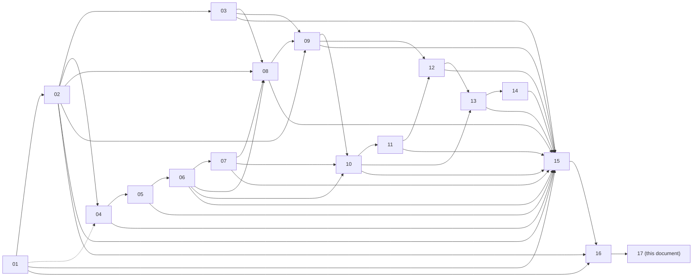
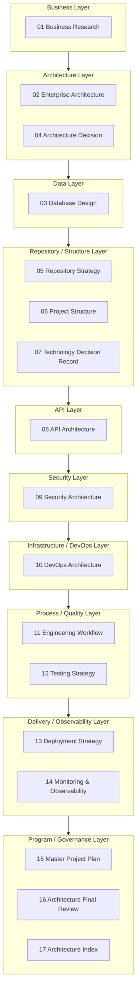
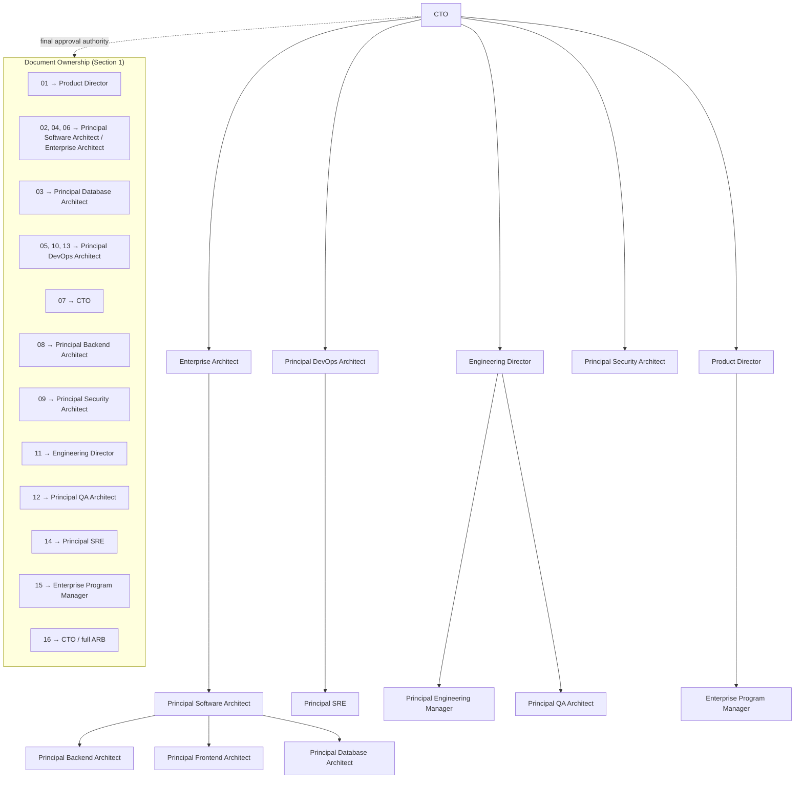
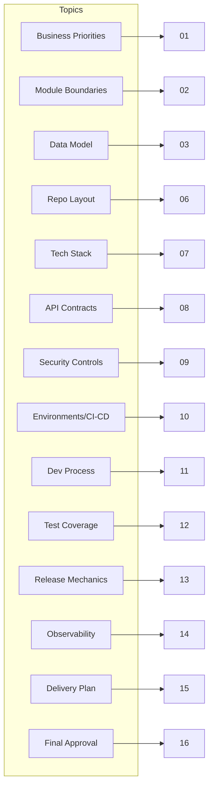
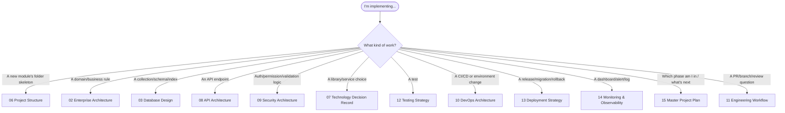
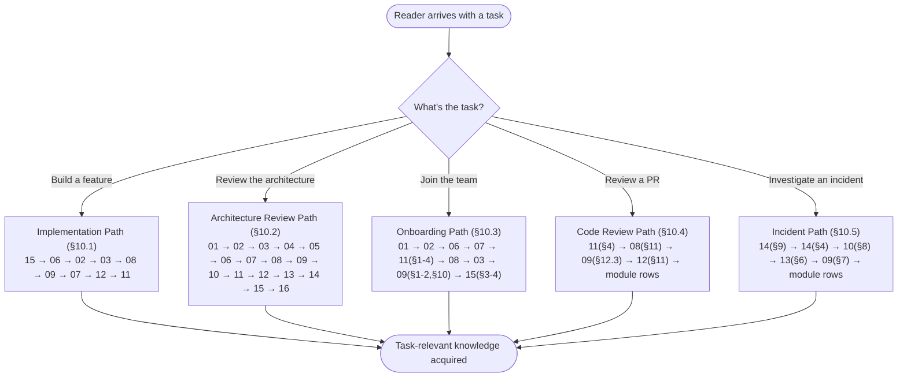

# Enterprise Architecture Index

## National Furniture & Interiors Platform — Master Navigation Guide

**Prepared by:** Enterprise Documentation Governance Board (CTO, Enterprise Architect, Principal Software Architect, Principal Engineering Manager, Technical Writer, Knowledge Management Lead)
**Date:** 2026-08-08
**Status of `01`–`16`:** APPROVED, LOCKED, ARCHITECTURE-BASELINE. Never modified. Never duplicated. This document indexes and cross-references them; it introduces no new architecture, business, or technical decision of its own.
**Role of this document:** The primary entry point for the complete architecture repository — where any developer, architect, QA engineer, DevOps engineer, product manager, or AI assistant starts to find where a given decision lives.

---

## Revision History

| Version | Date | Change |
|---|---|---|
| v1.0 | 2026-08-08 | Initial version |

---

## 0. How to Read This Index

This document does not explain *what* any architectural decision is — every one of `01`–`16` already does that, and re-explaining any of them here would violate the same "confirm, don't duplicate" discipline those sixteen documents have applied to each other throughout this series. This document answers a narrower, different question: **where** is a given decision documented, **who** owns it, and **in what order** should a given reader approach the repository. Section 1 is the master registry (one row per document). Sections 2–7 are diagrams answering "how do the documents relate." Section 8 is the ownership matrix answering "which document owns which decision domain." Sections 9–10 are reading paths answering "what order should *I* read these in, given my role or task." Section 11 is checklists. Section 12 is this board's own honest review of the repository's gaps — the one place this document goes beyond pure indexing, because a navigation guide that doesn't admit where navigation is currently hard would be incomplete.

### 0.1 A Note on Documents `00` and `00b`

The locked baseline this index covers is `01`–`16`, per this document's own scope. Two additional files exist in `docs/`: `00_architecture_review.md` and `00b_remediation_summary.md` — the original pre-development gate review and its remediation record. They are historical gate artifacts, not part of the ongoing architecture baseline (their findings were absorbed into `01`–`04`'s v1.1 revisions and closed out; `16_architecture_final_review.md` §0 already explains this relationship in full). They are included in Section 1's registry as two clearly-marked historical rows so this index remains a complete map of the actual `docs/` folder, but every reading path in Sections 9–10 treats `01`–`16` as the operative set.

---

## 1. Document Registry

The master table. Every field the brief specifies, for every document.

| # | Document | Purpose | Primary Owner | Secondary Stakeholders | Architecture Layer | Dependencies | Referenced By | Related ADRs | Status | Version | Approval State | Implementation Impact |
|---|---|---|---|---|---|---|---|---|---|---|---|---|
| 00 | Architecture Review *(historical gate)* | Pre-development review of `01`–`04`; 36 findings, 7/10 gated verdict | CTO / full ARB | All principals | Governance | `01`–`04` (v1.0) | `00b`, `16` §0 | — (produced ADR-shaping findings, not ADRs itself) | Closed/Historical | v1.0 | Superseded by remediation | None directly — findings absorbed into `01`–`04` v1.1 |
| 00b | Remediation Summary *(historical gate)* | Records resolution of `00`'s 13 Critical/High findings | CTO / Enterprise Architect | Principal Software Architect | Governance | `00`, `01`–`04` (v1.1) | `16` §0 | — | Closed/Historical | v1.0 | Superseded — resolution verified in `16` | None directly |
| 01 | Business Research & Competitive Analysis | Business rationale, competitive gap analysis, MVP roadmap, business risks | Product Director | CTO, Enterprise Architect | Business | None (foundational) | `02`, `04` §5.3, `07` §16.1, `09` §1.1/§8.4/§8.6, `15` §2/§3.0, `16` §2.11 | Feeds ADR: Service topology rationale (`04`) | Locked | v1.1 | Approved | High — defines priority order every phase (`15` §3) reconciles against |
| 02 | Enterprise Architecture | Clean Architecture, SOLID, module boundaries, 7 business flows, deployment diagram | Principal Software Architect | Enterprise Architect, Principal Backend/Frontend Architect | Architecture | `01` | `03`, `04`, `06`, `08`, `09`, `12`, `15` §6, `16` | 10 ADRs summarized in `02` §18 (service topology, DI approach, payment source-of-truth, upload path, token storage, state machine, frontend split, outbox pattern, inventory reservation, RBAC granularity) | Locked | v1.1 | Approved | Critical — every module, flow, and layer boundary traces here |
| 03 | Database Design | 35 MongoDB collections across 8 modules, indexing, embed-vs-reference rules | Principal Database Architect | Principal Backend Architect | Data | `02` | `08`, `09`, `12`, `13` §5, `15` §6 | Embed-vs-reference rationale (§8), transaction-scope ADR (§13.1) | Locked | v1.1 | Approved | Critical — every module's persistence model |
| 04 | Architecture Decision Record | Modular Monolith + Monorepo runtime/repo topology decision, extraction playbook | Enterprise Architect | Principal Software Architect | Architecture | `01`, `02` | `05`, `15` §6 | This document **is** the primary ADR for repository/runtime topology | Locked | v1.1 | Approved | Critical — governs repo-count and extraction-trigger discipline used throughout |
| 05 | Repository Strategy | pnpm + Turborepo tooling decision, workspace layout, dependency management | Principal DevOps Architect | Principal Software Architect | Repository | `04` | `06`, `15` §6 | Tooling-axis ADR (§4–5) | Locked | v1.0 | Approved | High — governs build/CI mechanics every later doc assumes |
| 06 | Project Structure | Complete `apps/`, `packages/`, `configs/` folder tree; module template | Principal Software Architect | Principal DevOps Architect | Repository / Structure | `04`, `05` | `07`, `08`, `09`, `10`, `15` §6 | Root-layout reconciliation ADR (§0.1) | Locked | v1.0 | Approved | Critical — literal folder structure every module is implemented into |
| 07 | Technology Decision Record | Full stack pin — 19 categories, ~35 technologies, alternatives compared | CTO | Principal Software/Backend/Frontend/Database Architect | Technology | `01`–`06` | `08`, `09`, `10`, `13`, `15` §1 | Per-technology decision tables (§3–21) | Locked | v1.0 | Approved | Critical — every implementation choice of library/service traces here |
| 08 | API Architecture | REST confirmation, API standards, per-module contracts, OWASP API mapping | Principal Backend Architect | Principal Frontend Architect, Principal Security Architect | API | `02`, `03`, `06`, `07` | `09`, `12`, `15` §6.4 | API-style-selection ADR (§2) | Locked | v1.0 | Approved | Critical — the contract every frontend/backend integration point implements |
| 09 | Security Architecture | STRIDE threat model, identity/app/API/infra/cloud security, compliance | Principal Security Architect | CTO, Principal Backend Architect | Security | `01`–`08` | `10`, `12`, `13`, `14`, `15` §3.1 | Identity-architecture ADRs (§2), RBAC-granularity ADR (shared with `02` §18) | Locked | v1.0 | Approved | Critical — every module's security profile (§10) |
| 10 | DevOps Architecture | 7 environments, container/build/CI-CD strategy, reliability, DR | Principal DevOps Architect | Principal SRE | DevOps / Infrastructure | `05`–`09` | `11`, `13`, `14`, `15` §3.1 | Deployment-mechanic ADRs (§6–8) | Locked | v1.0 | Approved | Critical — every environment and pipeline mechanic |
| 11 | Engineering Workflow | SDLC, sprints, Git/code-review workflow, DoR/DoD, ADR process itself, governance | Engineering Director | Principal Engineering Manager | Process / Engineering | `01`–`10` | `12`, `13`, `15` §7/§10 | Defines the ADR process (§2.6) all other documents' ADRs follow | Locked | v1.0 | Approved | Critical — the process every subsequent implementation activity runs through |
| 12 | Testing Strategy | Testing pyramid, per-module test scope, coverage targets, Contract Testing | Principal QA Architect | Principal Backend Architect | Quality / Testing | `01`–`11` | `13`, `15` §6.5 | Contract-testing ADR (§4.3, resolves `00` finding A6) | Locked | v1.0 | Approved | Critical — the quality gate every module must pass |
| 13 | Deployment Strategy | Release cadence, environment promotion, DB migration workflow, rollback | Principal DevOps Architect | Principal SRE | Delivery / Deployment | `01`–`12` | `14`, `15` §8.2/§6.6 | Migration-workflow ADR (§5), rollback-mechanic ADRs (§6) | Locked | v1.0 | Approved | Critical — how every phase's build reaches Production |
| 14 | Monitoring & Observability | Logging, metrics, tracing, alerting, dashboards, formal SLI/SLO/SLA | Principal SRE | Principal Security Architect | Observability | `01`–`13` | `15` §2.5/§2.6/§3.1 | SLO/error-budget ADR (§6) | Locked | v1.0 | Approved | Critical — how every module's health is measured post-launch |
| 15 | Master Project Plan | Phased implementation roadmap, milestones, critical path, resourcing, governance | Enterprise Program Manager | CTO, Product Director | Program / Delivery | `01`–`14` | `16` | Phase-sequencing decision (§10.1, new tier) | Locked | v1.0 | Approved | Critical — the actual execution order every team follows |
| 16 | Architecture Final Review | Final ARB gate: cross-document validation, traceability, readiness, risk, quality score, verdict | CTO / full ARB | All principals | Governance | `01`–`15` | `17` (this index) | Consolidates all ADRs referenced across `02`, `04`, `08`, `09`, `12`, `13`, `14` | Locked | v1.0 | Approved — **APPROVED WITH RECOMMENDATIONS** | Critical — the Go/No-Go gate implementation formally begins from |

---

## 2. Architecture Navigation Tree

```mermaid
flowchart TD
    Root["docs/ — Architecture Repository"] --> Gate0["Historical Gate<br/>00, 00b"]
    Root --> Foundation["Foundation Layer"]
    Root --> Structure["Structure Layer"]
    Root --> Technical["Technical Design Layer"]
    Root --> Delivery["Delivery Layer"]
    Root --> Program["Program Layer"]

    Foundation --> D01["01 Business Research"]
    Foundation --> D02["02 Enterprise Architecture"]
    Foundation --> D03["03 Database Design"]
    Foundation --> D04["04 Architecture Decision"]

    Structure --> D05["05 Repository Strategy"]
    Structure --> D06["06 Project Structure"]
    Structure --> D07["07 Technology Decision Record"]

    Technical --> D08["08 API Architecture"]
    Technical --> D09["09 Security Architecture"]
    Technical --> D10["10 DevOps Architecture"]

    Delivery --> D11["11 Engineering Workflow"]
    Delivery --> D12["12 Testing Strategy"]
    Delivery --> D13["13 Deployment Strategy"]
    Delivery --> D14["14 Monitoring & Observability"]

    Program --> D15["15 Master Project Plan"]
    Program --> D16["16 Architecture Final Review"]
    Program --> D17["17 Architecture Index (this document)"]
```

---

## 3. Document Dependency Graph

---

## 4. Architecture Layer Map

---

## 5. Governance Hierarchy

---

## 6. Knowledge Map

A topic-to-document graph — the fastest way to answer "where is X decided."

---

## 7. Implementation Reference Map

Which document to open, by implementation activity.

---

## 7.1 Architecture Repository Map

A different cut than Section 2's Navigation Tree — this one maps the physical `docs/` folder contents alongside the layer they belong to, the way a file browser plus this index's own layer labels would render it together.

```mermaid
flowchart LR
    subgraph Repo["docs/ (physical folder)"]
        direction TB
        F0["00_architecture_review.md<br/>00b_remediation_summary.md"]
        F1["01_business_research.md"]
        F2["02_enterprise_architecture.md"]
        F3["03_database_design.md"]
        F4["04_architecture_decision.md"]
        F5["05_repository_strategy.md"]
        F6["06_project_structure.md"]
        F7["07_technology_decision_record.md"]
        F8["08_api_architecture.md"]
        F9["09_security_architecture.md"]
        F10["10_devops_architecture.md"]
        F11["11_engineering_workflow.md"]
        F12["12_testing_strategy.md"]
        F13["13_deployment_strategy.md"]
        F14["14_monitoring_observability.md"]
        F15["15_master_project_plan.md"]
        F16["16_architecture_final_review.md"]
        F17["17_architecture_index.md"]
    end

    Repo --> Labels["Layer Labels (Section 4)"]
    Labels --> LB["Business: 01 · Architecture: 02,04 · Data: 03<br/>Structure: 05,06,07 · API: 08 · Security: 09<br/>DevOps: 10 · Process/Quality: 11,12<br/>Delivery/Obs: 13,14 · Program: 15,16,17<br/>Historical: 00,00b"]
```

---

## 7.2 Reading Flow Diagram

Visualizes Section 10's five reading orders as parallel paths through the same document set, entered at different points depending on task.

---

## 8. Decision Ownership Matrix

| Decision Domain | Owning Document | Owning Role |
|---|---|---|
| Business | `01_business_research.md` | Product Director |
| Architecture | `02_enterprise_architecture.md`, `04_architecture_decision.md` | Principal Software Architect, Enterprise Architect |
| Database | `03_database_design.md` | Principal Database Architect |
| Repository | `05_repository_strategy.md` | Principal DevOps Architect |
| Project Structure | `06_project_structure.md` | Principal Software Architect |
| Technology | `07_technology_decision_record.md` | CTO |
| API | `08_api_architecture.md` | Principal Backend Architect |
| Security | `09_security_architecture.md` | Principal Security Architect |
| DevOps | `10_devops_architecture.md` | Principal DevOps Architect |
| Engineering | `11_engineering_workflow.md` | Engineering Director |
| Testing | `12_testing_strategy.md` | Principal QA Architect |
| Deployment | `13_deployment_strategy.md` | Principal DevOps Architect / Principal SRE |
| Monitoring | `14_monitoring_observability.md` | Principal SRE |
| Implementation (sequencing, resourcing) | `15_master_project_plan.md` | Enterprise Program Manager |
| Governance (final approval, escalation) | `16_architecture_final_review.md`, `11_engineering_workflow.md` §8 | CTO / full ARB, Engineering Director |

No decision domain in this table is owned by more than one document with conflicting authority — where two documents both touch a domain (e.g., Deployment touches both `10` and `13`), Section 1's Dependencies column and each document's own §0 "Relationship to Locked Documents" section already establish which one is authoritative for which sub-question, and neither this index nor any of the sixteen documents overrides that.

---

## 9. Role-Based Reading Guides

| Role | Required Reading Order | Optional Reading | Reference Documents (consult as needed) |
|---|---|---|---|
| **Frontend Developer** | `06` → `08` → `07` (§3 Frontend Stack) → `09` (§4 API Security) | `02` (§6.2, §9–15 flows) | `11` (Git/PR workflow), `12` (§4 frontend test types), `15` (§7.1 stream ownership) |
| **Backend Developer** | `02` → `06` → `03` → `08` → `09` | `07` (§4 Backend Stack) | `10` (deployment context), `12` (§3 per-module test scope), `13` (migration workflow) |
| **Database Engineer** | `03` → `02` (§5–13 flows for context) → `13` (§5 DB deployment) | `09` (§10 per-module security, data classification) | `14` (§8 capacity planning), `15` (§6.3 build order) |
| **QA Engineer** | `12` → `08` (§8 per-module contracts) → `09` (§10 security profiles) | `02` (flows, for scenario design) | `11` (§5 testing workflow), `13` (§10 release checklists) |
| **DevOps Engineer** | `10` → `05` → `06` → `13` | `07` (stack), `09` (§5–6 infra/cloud security) | `14` (observability), `11` (§3 Git/branch strategy) |
| **Security Engineer** | `09` → `08` (§4 security standards) → `03` (§3, §15 data classification/retention) | `10` (§5–6 infra/cloud security) | `12` (§4.8 DAST/security testing), `14` (§4 alerting) |
| **Product Manager** | `01` → `15` (§2–4 vision/roadmap/milestones) → `16` (§11 executive summary) | `02` (§0 alignment with business priorities) | `15` (§4 milestone planning), `16` (§8 final approval) |
| **Project Manager** | `15` → `11` (§1 SDLC/sprints) → `16` (§4 implementation readiness) | `13` (§1 release strategy) | `15` (§7 resource planning, §8 risk), `11` (§8 governance) |
| **Technical Lead** | `02` → `04` → `06` → `08` → `09` → `11` → `15` | `07`, `10`, `12`, `13` | `16` (full document — the final gate every Tech Lead should understand) |
| **New Team Member** | `01` → `02` → `06` → `07` → `11` (§1–4) | `03`, `08`, `09` (as their track requires) | Section 10.3 (this document's own Onboarding Reading Order) — a fuller path than this row alone |
| **AI Assistant** | `17` (this document, first, always) → `02` → `06` → the specific document(s) the task's domain maps to per Section 8 | All others, as the task requires | Section 1's full registry — an AI assistant should resolve "which document owns X" via Section 8 before answering, not guess |

---

## 10. Reading Orders by Task

### 10.1 Implementation Reading Order

`15` (know the current phase) → `06` (know where the code goes) → `02` (know the module's design) → `03` (know the data model) → `08` (know the contract) → `09` (know the security requirements) → `07` (know the exact library/version) → `12` (know the test scope) → `11` (know the PR/review process). This order mirrors the actual sequence a developer touches these concerns in while building a single feature, not the documents' numeric order.

### 10.2 Architecture Review Reading Order

`01` → `02` → `03` → `04` (foundation) → `05` → `06` → `07` (structure/tech) → `08` → `09` → `10` (technical design) → `11` → `12` → `13` → `14` (delivery/quality) → `15` → `16` (program/governance). This is the numeric order — the correct one specifically for a reviewer verifying cross-document consistency, since each document's own §0 section assumes everything before it has already been read.

### 10.3 Onboarding Reading Order

`01` (why this platform exists) → `02` (how it's architected) → `06` (where the code lives) → `07` (what technology you'll actually touch) → `11` §1–4 (how the team works day to day) → `08` (the contracts you'll build against) → `03` (the data you'll model) → `09` §1–2, §10 (the security model, at least your module's row) → `15` §3–4 (where the project currently stands). Deliberately shorter and reordered from Section 10.2's review order — a new engineer needs "how do I contribute" before "how does every subsystem interlock."

### 10.4 Code Review Reading Order

`11` §4 (the review process and checklist itself) → `08` §11 (API review checklist, if the PR touches an endpoint) → `09` §12.3 (security review triggers, if the PR touches auth/PII/payment/external-integration code) → `12` §11 (testing checklists) → the specific module's rows in `08` §8 / `09` §10 / `12` §3, for the module the PR actually touches. A reviewer should not need to read all sixteen documents per PR — this order is deliberately the minimum-necessary path.

### 10.5 Incident Investigation Reading Order

`14` §9 (Incident Management — severity matrix, on-call, RCA process) → `14` §4 (Alerting — what fired and why) → `10` §8 (deployment/rollback mechanics, if a recent release is implicated) → `13` §6 (rollback & recovery, if a rollback is being considered) → `09` §7 (security monitoring, if the incident has a security dimension) → the specific module's row in `09` §10 (security profile) and `08` §8 (API contract), to understand the affected module's designed behavior versus its observed behavior.

---

## 11. Checklists

### 11.1 Repository Navigation Checklist

- [ ] Can locate which document owns any of the 15 decision domains in Section 8 within 30 seconds
- [ ] Understands the difference between `01`–`04` (Foundation), `05`–`07` (Structure), `08`–`10` (Technical Design), `11`–`14` (Delivery), `15`–`16` (Program) layers (Section 4)
- [ ] Knows this document (`17`) is the entry point, not `01` or `02`
- [ ] Knows `00`/`00b` are historical, not part of the active baseline (Section 0.1)

### 11.2 New Developer Checklist

- [ ] Completed Section 10.3's Onboarding Reading Order
- [ ] Identified their role's Required Reading in Section 9
- [ ] Knows their assigned module(s) per `06` §4.3 and `15` §7.1
- [ ] Has read their module's rows in `08` §8, `09` §10, `12` §3
- [ ] Understands the PR/review process (`11` §3–§4) before opening a first PR

### 11.3 Architecture Review Checklist

*(For any future architecture review beyond `16` — confirms, does not duplicate, `16`'s own Section 10.1 checklist.)*

- [ ] Followed Section 10.2's Architecture Review Reading Order
- [ ] Checked the specific document's §0 "Relationship to Locked Documents" section for what it confirms vs. adds
- [ ] Checked the specific document's "Consistency Check" section against the documents it claims to be consistent with
- [ ] Checked the specific document's "Open Items" section for already-known, already-tracked gaps before flagging something as new

### 11.4 Knowledge Maintenance Checklist

- [ ] Any new document added to `docs/` after `17` is added to Section 1's registry (Purpose, Owner, Dependencies, Referenced By, Status, Version)
- [ ] Any new document's dependencies are reflected in Section 3's Dependency Graph
- [ ] Any new decision domain is added to Section 8's Ownership Matrix with no ownership conflict
- [ ] This document's own Revision History is updated whenever Section 1's registry changes
- [ ] `16_architecture_final_review.md` §17's Future ADR Candidates are checked against Section 1 once resolved, so their resolution is reflected in the relevant document's Related ADRs column

### 11.5 Documentation Governance Checklist

- [ ] No architecture document was modified to produce this index (verified: this document contains no edits to `01`–`16`)
- [ ] No architecture document's content was duplicated into this index beyond what's needed for navigation (Purpose/Owner/Dependencies summaries, not full content)
- [ ] Every cross-reference in this document cites a real section number in the target document (spot-checked against Section 1's registry during drafting)
- [ ] This document's own approval follows the same governance model it documents (`11` §8, `16` §10.5's escalation matrix)

---

## 12. Documentation Repository Review

Per the brief's explicit instruction: identified, not fixed. No architecture document was modified to produce these findings.

### 12.1 Documentation Gaps

The three items `16_architecture_final_review.md` §8.3 already named as recommended improvements (milestone-type classification for design-project payments, archival policy for `design_project_assets`, formal addition of `schema_migrations` to `03`'s Collection Inventory) remain gaps in the underlying architecture documents themselves — this index doesn't re-name them as new findings, only notes that Section 1's registry will need updating once they're resolved via the ADR process. Beyond those: no document in `01`–`16` provides a single-page **glossary** of platform-specific terms (`STAFF` vs `ADMIN` vs `SUPER_ADMIN`, `DESIGNER`, permission-key naming conventions, the fifteen-module vocabulary) — each document defines its own terms in context, correctly, but a newcomer cross-referencing multiple documents currently has to infer consistency rather than check it against one authoritative glossary. This is a genuine navigation gap this index cannot itself fill without either duplicating content (against this series' core discipline) or overstepping its own scope as a pure index.

### 12.2 Duplicate Topics

No genuine content duplication was found — the "confirm, don't duplicate" discipline (each document's §0 section) was checked as part of assembling Section 1 and held throughout. The closest thing to a duplicate is deliberate and already self-declared: `13_deployment_strategy.md` §0 names its own overlap risk with `10_devops_architecture.md` and `11_engineering_workflow.md` up front and resolves it by citation rather than restatement — this is the discipline working as intended, not a gap.

### 12.3 Ownership Conflicts

None found. Section 8's Decision Ownership Matrix maps cleanly to Section 1's Primary Owner column with no domain claimed by two documents' primary owners simultaneously. The one place ownership could appear ambiguous at a glance — Deployment spanning both `10` (Principal DevOps Architect) and `13` (Principal DevOps Architect / Principal SRE) — resolves to the same accountable role family, not a conflict.

### 12.4 Navigation Improvements

Two concrete improvements worth making once this index is in active use, neither requiring modification of `01`–`16`: (1) a machine-readable version of Section 1's registry (e.g., a `docs/index.json` mirroring this table) would let tooling — including AI assistants — resolve "which document owns X" programmatically rather than parsing this Markdown table, worth doing once the team has a concrete tool that would consume it; (2) per-document "breadcrumb" headers (a one-line "Part of the Architecture Index — see `17_architecture_index.md`" note at the top of each of `01`–`16`) would help a reader who lands on a single document via search/link find their way back to this index — deliberately not done here since it would require touching the locked documents, which is explicitly out of this document's authority.

### 12.5 Future Documentation Candidates

A glossary document (Section 12.1) is the clearest candidate. Beyond that, consistent with the trigger-based deferral pattern this entire series has used: an `18_operations_runbook.md` becomes a candidate once Phase 6 (`15` §3.1) is reached and real operational incidents start accumulating patterns worth codifying beyond what `14`'s Incident Management section already covers generically; a `19_post_launch_review.md` becomes a candidate once the 90-day SLO/KPI baseline period (`14` §6.6, `16` §8.3 item 7) completes and real data exists to review against the illustrative targets set now. Neither is recommended to be created before its trigger condition is met — the same discipline `07`, `08`, `09`, `10`, and `12` have already applied to their own deferred decisions.

---

*This document is a navigation index. It modifies no architecture document. It duplicates no architecture document's content beyond what is necessary for cross-referencing. No implementation code was generated.*
