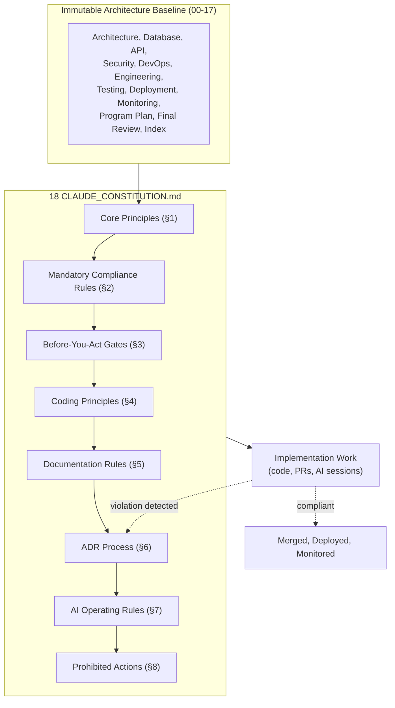
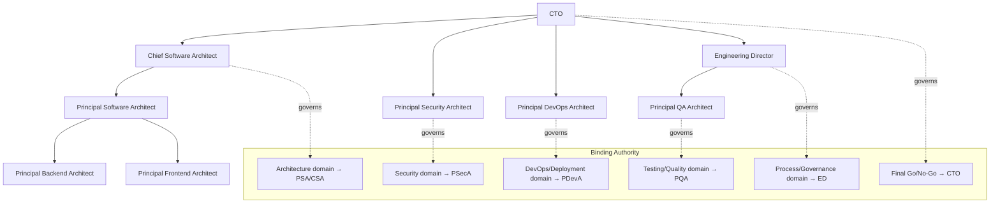
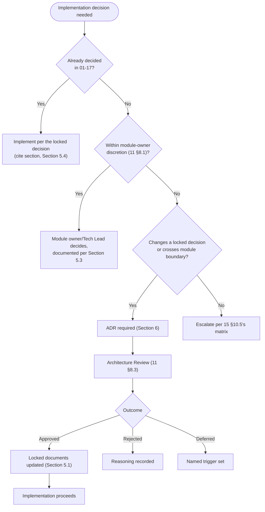
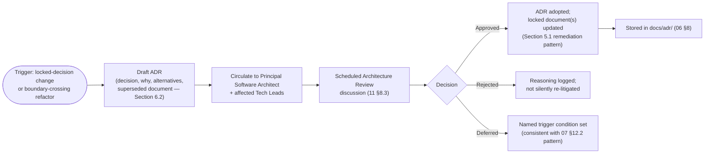
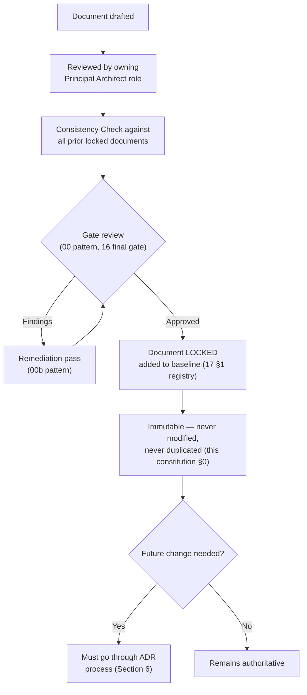
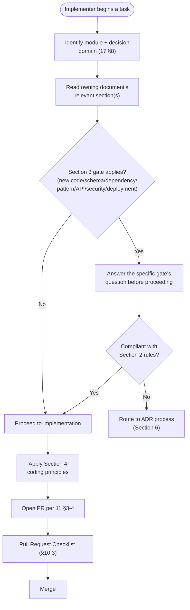
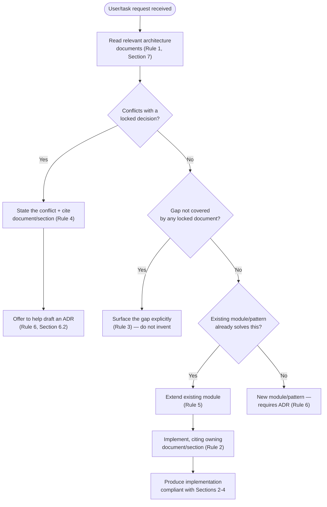

# CLAUDE_CONSTITUTION.md

## National Furniture & Interiors Platform — Engineering Governance Constitution

**Ratified by:** Enterprise Engineering Governance Board (CTO, Chief Software Architect, Principal Software Architect, Principal Backend Architect, Principal Frontend Architect, Principal Security Architect, Principal DevOps Architect, Principal QA Architect, Engineering Director)
**Date:** 2026-08-08
**Status of `00`–`17`:** APPROVED, LOCKED, ARCHITECTURE BASELINE. Immutable. Never modified, never duplicated by this or any document.
**What this document is:** A permanent governance policy — the mandatory rules every future AI-assisted (or human) implementation session on this platform must follow.
**What this document is not:** Not an architecture document (it decides nothing `01`–`17` hasn't already decided). Not a coding tutorial (it does not teach how to write TypeScript or use Express). It is a constitution — a set of binding rules about *how decisions get made and enforced*, not what the decisions are.

---

## Revision History

| Version | Date | Change |
|---|---|---|
| v1.0 | 2026-08-08 | Initial ratification |

---

## 0. A Note on the Locked-Document List

This constitution's mandate names nineteen documents as the immutable baseline. Eighteen of them exist in `docs/` under the exact names given. One — referred to in the mandate as `00b_architecture_review_remediation.md` — exists in the repository as `00b_remediation_summary.md`; this constitution treats them as the same document (a filename, not a content, discrepancy) and cites it throughout by its actual on-disk name, consistent with this series' established practice of resolving naming mismatches explicitly rather than silently (`06_project_structure.md` §0, `15_master_project_plan.md` §0.1). Nothing in `00b_remediation_summary.md`'s content is affected.

This constitution is authored as `docs/18_CLAUDE_CONSTITUTION.md` — document 18 in the series, immediately following `17_architecture_index.md`, which remains the correct entry point for navigating *what* the architecture is. This document governs *how implementation work touching that architecture is conducted*.

---

## 1. Core Principles

### 1.1 Core Engineering Principles

The architecture in `02`–`17` is the single source of truth for this platform. It was produced through a disciplined, two-gate review process (`00_architecture_review.md` → remediation → `16_architecture_final_review.md`'s final approval) specifically so that implementation would not need to re-litigate decisions already made correctly. Every engineering action on this platform — human or AI-assisted — either **implements** an already-locked decision or **proposes a change** to one through the ADR process (Section 6). There is no third path where an implementer simply decides differently in the moment.

### 1.2 Architecture Principles

Clean Architecture layering (`02_enterprise_architecture.md` §5), feature-based module boundaries (`02` §6, `06_project_structure.md` §4.3), and the modular-monolith-plus-monorepo topology (`04_architecture_decision.md`) are structural facts about this codebase, not stylistic preferences an implementer may deviate from for convenience.

### 1.3 Development Principles

Development proceeds through the SDLC, sprint, and backlog process `11_engineering_workflow.md` §1–§2 defines — no implementation work exists outside that process, including AI-assisted work generated in response to an ad hoc request. Every code change entering the repository does so through the PR/review process `11` §3–§4 defines, with no exception for AI-generated code.

### 1.4 Governance Principles

Authority over architectural decisions is distributed by domain, exactly as `17_architecture_index.md` §8's Decision Ownership Matrix records it — no single engineer, AI session, or ad hoc request overrides a domain owner's authority by virtue of the request being urgent, reasonable-sounding, or explicitly asked for by a stakeholder outside the governance chain (Section 7 below formalizes this as Decision Authority Flow).

### 1.5 Documentation Principles

Every one of `01`–`17` demonstrated a specific documentation discipline — a §0 "Relationship to Locked Documents" section, a Consistency Check section, an Open Items section, a Revision History table — and treated documentation drift as a defect, not a formality (`00_architecture_review.md` finding DX2, closed in `11` §6.1). This constitution requires that discipline continue into implementation.

### 1.6 Quality Principles

Quality is gated, not aspirational: `12_testing_strategy.md`'s coverage floors, `11_engineering_workflow.md` §7's Quality Gates, and `09_security_architecture.md` §12's checklists are enforced pass/fail conditions on every PR, not guidance an implementer may weigh against schedule pressure.

### 1.7 Security Principles

Security is a default posture, not a feature: every one of `09_security_architecture.md`'s controls applies to new code the moment that code touches the surface the control governs, with no "we'll add security later" phase (Section 4's coding principles formalize this as "Security by default").

### 1.8 Operational Principles

Code is not "done" when it passes tests — it is done when it is observable (`14_monitoring_observability.md`), deployable through the locked pipeline (`13_deployment_strategy.md`), and its operational behavior under failure is understood (`10_devops_architecture.md` §10's reliability patterns). Operational readiness is part of the definition of done (`11` §7.2), not a separate, later concern.

---

## 2. Mandatory Compliance Rules

Twelve domains. Each rule below is binding, not advisory, and cites the owning document a violation would contradict.

### 2.1 Architecture Compliance

- Every module MUST conform to the Clean Architecture layering (domain/application/infrastructure/presentation) defined in `02_enterprise_architecture.md` §5 and templated in `06_project_structure.md` §4.3.
- Every module boundary MUST match `02` §6's module diagram exactly, as confirmed unchanged by `06` §4.3, `08_api_architecture.md` §8, `09` §10, `12_testing_strategy.md` §3, and `15_master_project_plan.md` §6.
- No implementation MAY introduce a module, service, or boundary not present in the locked module list without an ADR (Section 6).

### 2.2 Repository Compliance

- The repository MUST remain a single Monorepo per `04_architecture_decision.md`'s decision, managed via pnpm Workspaces + Turborepo per `05_repository_strategy.md` §4–5.
- No implementation MAY extract a module into a separate repository or service except by following `04` §9's Extraction Readiness Checklist and ranked extraction candidates, and only once a named trigger condition (`04` §9.2) is actually met.

### 2.3 Project Structure Compliance

- Every new file MUST be placed according to `06_project_structure.md`'s folder tree (§2–§7) and per-module template (§4.3). No ad hoc top-level folder, no module-internal structure deviating from the four-layer template, without an ADR.
- `apps/api/src/core/` changes require two PR approvals per `11_engineering_workflow.md` §4.2, reflecting its cross-cutting blast radius.

### 2.4 Technology Compliance

- Every technology, library, framework, or external service used MUST already be named in `07_technology_decision_record.md`. No new technology may be introduced without an ADR that includes the same alternatives-comparison rigor `07` applied to every locked choice (Section 6.2 below).
- Where `07` names a deferred decision with a trigger (search service, Canary deployment, SIEM, etc.), that decision remains undecided until the named trigger is actually met — an implementer encountering a plausible-seeming reason to adopt it early MUST treat that as a signal to raise an ADR proposal, not as license to proceed.

### 2.5 API Compliance

- Every endpoint MUST conform to `08_api_architecture.md`'s API Standards (§3), Security Standards (§4), and the specific module's contract row (§8).
- No endpoint may be introduced, removed, or have its contract altered without updating `08`'s per-module contract table via the documentation rules in Section 5, and without triggering an ADR if the change breaks a locked contract (`08` §13's Breaking Change Policy).
- REST is the confirmed API style (`08` §2). GraphQL, gRPC, or any other style MUST NOT be introduced without an ADR re-opening `08` §2's evaluation with a genuine new trigger.

### 2.6 Database Compliance

- Every collection, field, and index MUST conform to `03_database_design.md`'s schema, naming conventions (§2), and embed-vs-reference rules (§8).
- No schema change (new collection, new field, new index) proceeds without updating `03`'s Collection Inventory (§4) — including the already-identified `schema_migrations` gap (`13_deployment_strategy.md` §14, `16_architecture_final_review.md` §8.3 item 3), which MUST be formally closed via ADR before or during its first use, not silently implemented.
- Multi-document transactions are used ONLY for the narrow, named operations `03` §13.1 specifies (order+reservation, lead conversion) — no implementer may add a new transactional scope without an ADR, per the deliberate narrowness of that decision.

### 2.7 Security Compliance

- Every control in `09_security_architecture.md` §2–§8 applies unconditionally to code touching the surface it governs. This includes, without exception: MFA for `STAFF`/`ADMIN` accounts (§2), permission-key RBAC enforcement (§2.6), NoSQL-injection-safe query construction (§3.6), CSRF controls for any cookie-based auth (§3.4), the twelve Secure Coding Rules (§11), and the SSRF/upload/malware-scanning controls (§3.7, §3.12) the moment their triggering feature exists.
- No PR touching auth, PII, payment, or an external integration MAY merge without the security review `09` §12.3 and `11_engineering_workflow.md` §4.7 require.

### 2.8 Testing Compliance

- Every module MUST meet the coverage floor and test-scope defined in `12_testing_strategy.md` §3 and §6 before merge.
- The concurrent-checkout inventory-reservation integration test (`12` §4.2) — the platform's single highest-priority test — MUST pass before any change touching `catalog`, `cart`, or `orders` inventory logic merges.
- Contract tests (`12` §4.3) MUST pass for any change to a module's published API contract.

### 2.9 Deployment Compliance

- Every release follows the environment-promotion path (`13_deployment_strategy.md` §2) and the rollback/recovery procedures (`13` §6) exactly. No implementer may deploy directly to Production outside the pipeline `10_devops_architecture.md` §6–§8 defines.
- Every database migration follows the expand/contract backward-compatibility pattern (`13` §5.2) with a post-migration validation step (`13` §5.2) — a migration without one is incomplete, not merely undocumented.

### 2.10 Monitoring Compliance

- Every new module or endpoint MUST be instrumented per `14_monitoring_observability.md`'s logging (§2), metrics (§3), and tracing (§7) standards before it is considered production-ready (`14` §11's checklists).
- No code path handling a Critical or High business flow (Section 2.11 of `16_architecture_final_review.md`'s traceability table) may ship without corresponding alerting coverage (`14` §4).

### 2.11 Documentation Compliance

- Every PR that changes an API contract, module boundary, ADR-governed decision, or a process this constitution or `11_engineering_workflow.md` describes MUST update the relevant documentation, per `11` §6.1's enforced (not optional) review criterion.
- No architecture document (`01`–`17`) may be edited by an implementation PR under any circumstance. A perceived need to edit one is, by definition, an ADR proposal (Section 6), not a documentation fix.

### 2.12 ADR Compliance

- Any change altering a decision already recorded in `02` §18's ADR Summary, `04_architecture_decision.md`, or any locked document's decision tables MUST go through a new, numbered ADR per `11_engineering_workflow.md` §2.6's process, stored in `docs/adr/` per `06_project_structure.md` §8.
- An ADR requires Architecture Review (`11` §8.3) before being considered adopted. No architecture decision changes via a single PR's approval alone, regardless of the reviewer's seniority.

---

## 3. Implementation Rules — Before You Act

Nine gates. Each is a question an implementer (human or AI) MUST answer before proceeding, not after.

| Before you... | You MUST first... |
|---|---|
| **Write code** | Identify which module (`06` §4.3) the work belongs to, read that module's rows in `08` §8 (contract), `09` §10 (security profile), and `12` §3 (test scope), and confirm the work implements an already-locked decision rather than inventing one |
| **Modify existing code** | Confirm the change is behavior-preserving within an already-locked contract, or is itself a bug fix with a regression test (`11` §2.2) — not a redesign wearing a bug-fix's clothing |
| **Change architecture** | Stop. This requires an ADR (Section 2.12/Section 6), not a code change. Draft the ADR, including alternatives considered, before writing any implementation code that depends on the change |
| **Change the database schema** | Confirm the change is additive/backward-compatible per `13` §5.2's expand/contract pattern, update `03`'s Collection Inventory, and confirm no existing index/query assumption (`03` §10) is broken |
| **Add a dependency** | Confirm it is already named in `07_technology_decision_record.md`. If not, this is an ADR (Section 2.4), not a `package.json` edit — and even once approved, it still requires the PR-level dependency review `09` §11 rule 12 mandates |
| **Introduce a new pattern** | Confirm an existing pattern in `02`'s architecture or `06`'s structure doesn't already solve the problem (Section 4.4's "prefer extending" rule) — a new pattern for a problem the architecture already has an answer to is scope creep, not innovation |
| **Change an API** | Confirm whether the change is backward-compatible (`08` §3.18) or breaking (`08` §13). A breaking change requires the deprecation process `08` §3.19 defines, never a silent contract change |
| **Modify security controls** | Route through the mandatory security review (`09` §12.3, `11` §4.7) — no security-relevant change (auth, RBAC, validation, encryption, secrets handling) merges on a standard single-approval PR |
| **Change deployment configuration** | Confirm the change goes through the standard PR review process per `10_devops_architecture.md` §2.2's "configuration is data" principle — no direct environment/pipeline edit outside version control, ever |

---

## 4. Coding Principles

These principles are binding defaults for all implementation work on this platform, each traceable to an already-locked decision rather than introduced fresh here.

1. **Clean Architecture** — domain/application/infrastructure/presentation layering, dependencies pointing inward only (`02` §5).
2. **SOLID** — applied exactly as `02` §3 specifies per letter (Single Responsibility per use-case-scoped service, Open/Closed via adapter interfaces, Liskov via interchangeable `IRepository<T>` implementations, Interface Segregation via narrow per-entity repository interfaces, Dependency Inversion via the composition root).
3. **DRY** — business logic lives in exactly one Application-layer service per concern; a second implementation of the same rule anywhere (a duplicate price calculation, a duplicate permission check) is a defect, not a convenience.
4. **KISS** — confirmed as this platform's standing preference (`07_technology_decision_record.md` §1's "match the tool to the team's stage" principle, applied repeatedly to choose simpler options over more powerful ones); an implementer choosing a more complex solution than the architecture specifies bears the burden of an ADR justifying it.
5. **YAGNI** — the extraction playbook (`04` §9), Canary deployment (`10` §6.7), Chaos Testing (`12` §4.15), and every other trigger-based-deferral item in this series exist precisely so implementers do not build for a scale or capability the platform hasn't reached — building ahead of a named trigger is a constitution violation, not diligence.
6. **Feature-first organization** — every module's internal structure follows `06` §4.3's per-module template; code is organized by business capability, never by technical layer at the top level (no repository-wide `controllers/`, `services/` split above the module boundary).
7. **Dependency inversion** — Application/Domain layers depend on interfaces (`IProductRepository`, `IPaymentGateway`); Infrastructure implements them; wiring happens at the composition root (`02` §7.3), never via a service directly `import`-ing a concrete Infrastructure class.
8. **Composition over inheritance** — consistent with `02` §7.3's manual-composition-root approach over a DI framework; shared behavior is composed via small, focused interfaces and adapters, not class inheritance hierarchies.
9. **Type safety** — TypeScript strict mode end-to-end (`07` §4, §20), Zod-validated boundaries (`07` §10, `08` §3.11) — no `any`, no untyped request/response boundary.
10. **Explicit validation** — every external input validated at the Zod layer before reaching a service, and at the `$jsonSchema` layer at the database boundary (defense-in-depth, `09` §3.6 rule 2's application) — validation is never implicit or assumed from a caller's good behavior.
11. **Error handling** — every error follows `08` §3.4's envelope format and `08` §3.12's HTTP status code mapping; no swallowed exception, no generic 500 masking a classifiable failure.
12. **Observability by default** — every new code path emits structured logs (`14` §2), relevant metrics (`14` §3), and trace spans (`14` §7) at the point it's written, not retrofitted after an incident reveals the gap.
13. **Security by default** — every control in Section 2.7 applies the moment its triggering surface exists; security is not a hardening pass scheduled after functional completion.
14. **Performance by default** — every endpoint respects `08` §5's performance standards and `14` §6's SLOs from first implementation; performance is not deferred to a later optimization pass for any path already covered by a defined SLO.

---

## 5. Documentation Rules

### 5.1 When Architecture Changes

Architecture changes ONLY through the ADR process (Section 6). The moment an ADR is Approved (Section 6.3), the affected locked document(s) are updated following the exact "explained, logged remediation" pattern `00b_remediation_summary.md` already modeled for `01`–`04`'s v1.1 revision: a new Revision History row stating what changed and why, changes made in place (not as an appendix), and the change traceable back to the ADR that authorized it.

### 5.2 When ADRs Are Required

Per Section 2.12: any change to a decision recorded in `02` §18, `04_architecture_decision.md`, or any locked document's own decision table. Per `11_engineering_workflow.md` §2.6: also required for any refactor whose blast radius crosses a module boundary or touches a shared package (`06` §5–§6), not only for changes explicitly labeled "architectural."

### 5.3 When Documentation Must Be Updated

Per `11` §6.1 (confirmed here as binding, not merely "good practice"): any PR that changes an API contract, changes a module's ownership or boundary, implements or amends an ADR, or changes a process a locked document describes. A PR matching one of these categories with its documentation checkbox unchecked is an invalid PR, not a PR with a minor omission.

### 5.4 How Implementation Documents Reference Architecture

Any documentation an implementation team produces below this constitution (runbooks, module READMEs, onboarding notes) MUST cite the owning architecture document and section number for any claim about *why* something is built a certain way, following the citation discipline `01`–`17` established throughout (e.g., `02` §11, not "per the checkout design"). Implementation documentation MAY explain *how* code works; it MUST NOT restate *why* an architectural decision was made — that restatement is exactly the duplication `06_project_structure.md` §0 and every subsequent document's §0 section have consistently avoided, and implementation docs inherit that same discipline.

### 5.5 Versioning Policy

Every locked document's Revision History table (`v1.0`, `v1.1`, ...) is the authoritative version record for that document — this constitution does not introduce a parallel versioning scheme. This constitution's own version increments only when the Enterprise Engineering Governance Board (or its successor process, per Section 6) amends a rule in this document — a rule amendment is itself ADR-worthy if it would change what a locked architecture document requires (Section 2.12), and is a direct constitution edit (with a Revision History entry) if it only changes this document's own governance process, mirroring the distinction `11_engineering_workflow.md` §10.1 draws for itself.

---

## 6. ADR Process (Confirmed, Not Redesigned)

This constitution does not invent a new ADR process — it confirms `11_engineering_workflow.md` §2.6 as binding and restates its mechanics here only because this constitution's audience (every future implementation session) needs the process available at the point of enforcement, not only in `11`.

### 6.1 When Triggered

Any change altering a locked decision (Section 2.12), or any module-boundary/shared-package-crossing refactor (`11` §2.6).

### 6.2 What an ADR Must Contain

The decision being changed; why; the alternatives considered (with the same rigor `07_technology_decision_record.md` applied to every technology choice); which locked document(s) it supersedes or amends.

### 6.3 Approval Path

Proposing engineer/Tech Lead drafts the ADR → circulated to the Principal Software Architect and any Tech Leads whose modules are affected → scheduled Architecture Review discussion (`11` §8.3) → outcome recorded as **Approved** (locked documents updated per Section 5.1), **Rejected** (reasoning recorded so the proposal isn't silently re-litigated), or **Deferred** (a legitimate outcome for a directionally-reasonable proposal without a met trigger, consistent with this series' trigger-based-deferral pattern).

### 6.4 No Silent Adoption

An ADR is never "adopted" by virtue of code merging that assumes it — the ADR must be Approved *before* dependent implementation code is written (Section 3's "Before you change architecture" gate), not retroactively justified by code that already exists.

---

## 7. AI Operating Rules

Every AI-assisted implementation session on this platform — without exception — MUST:

1. **Read the relevant architecture documents before coding.** Identify the module and decision domain (`17_architecture_index.md` §8) the request touches, and read that domain's owning document before generating any implementation.
2. **Reference the owning document for every decision made.** Any implementation choice an AI session makes MUST be traceable to a specific section of a locked document, or flagged as requiring an ADR (Section 6) — never presented as the AI's own independent judgment about "the right way to do it."
3. **Never invent new architecture.** An AI session encountering a gap the locked documents don't cover MUST surface that gap explicitly (consistent with `01`–`17`'s own Open Items discipline) rather than silently deciding on the team's behalf.
4. **Never contradict approved decisions.** If a user's request conflicts with a locked decision, the AI session states the conflict and cites the specific document/section it conflicts with — it does not quietly comply and produce code that violates the architecture, and does not quietly ignore the request.
5. **Prefer extending existing modules over creating new ones.** Per Section 4.6/Section 3's "introduce a new pattern" gate — a request that seems to need a new module or pattern is first checked against whether an existing module (`06` §4.3) or pattern (`02`'s architecture) already solves it.
6. **Ask for an ADR if a requested change conflicts with the architecture baseline.** Rather than refuse outright or comply silently, the correct AI response to an architecture-conflicting request is to explain that it requires an ADR (Section 6), describe what the ADR would need to contain (Section 6.2), and offer to help draft it — never to implement the conflicting change directly.

These six rules are not guidance for AI sessions to weigh against user convenience — they are the operating contract this constitution exists to state explicitly, precisely because an AI session has no standing memory of `00`–`17` between sessions the way a human team member accumulates over time, and must re-establish compliance from this document every time.

---

## 8. Prohibited Actions

The following are constitution violations. This list is illustrative, not exhaustive — the underlying test is always Section 1–7 above, not the presence of an action on this specific list.

- Do not redesign approved architecture (`02`, `04`, `06` — any structural change without an ADR).
- Do not introduce technologies not approved in the Technology Decision Record (`07`) without an ADR.
- Do not bypass validation (Zod and `$jsonSchema` layers, `09` §3.6, `08` §3.11).
- Do not bypass RBAC (permission-key enforcement, `02` §14, `09` §2.6).
- Do not duplicate business logic (DRY, Section 4.3) — a second implementation of an existing Application-layer rule is a defect.
- Do not create circular dependencies (`06` §6's package dependency graph; `04`'s module-boundary discipline).
- Do not violate feature boundaries (`02` §6, `06` §4.3 — no module directly reading another module's collection; cross-module reads go through exported interfaces per `06` §1.6).
- Do not hardcode secrets (`09` §5.1, `06` §4.2's `core/config` boot-time validation, Secure Coding Rule 8).
- Do not ignore logging requirements (`14` §2, Coding Principle 12).
- Do not create undocumented APIs (`08` §6's Documentation Standards — every endpoint MUST appear in the OpenAPI spec generated from its Zod validators).
- Do not modify locked decisions without a new ADR (Section 6, Section 2.12).
- Do not modify, rewrite, or duplicate any of `00`–`17`'s content directly — the only sanctioned mechanism for changing what they say is the ADR-driven update described in Section 5.1.
- Do not skip the two-approval requirement for `core/`, shared-package, or ADR-implementing PRs (`11` §4.2).
- Do not deploy directly to Production outside the locked pipeline (`10` §6–§8, `13` §2).
- Do not add a multi-document transaction scope beyond the two narrow, named cases (`03` §13.1) without an ADR.
- Do not silently absorb an ambiguous requirement — surface it as an Open Item or an ADR question, per this series' own standing discipline, rather than guessing.

---

## 9. Diagrams

### 9.1 Engineering Constitution Diagram

### 9.2 Governance Hierarchy

### 9.3 Decision Authority Flow

### 9.4 ADR Workflow

### 9.5 Architecture Lock Process

### 9.6 Implementation Decision Flow

### 9.7 AI Decision Process

---

## 10. Checklists

### 10.1 Implementation Checklist

- [ ] Module and decision domain identified (`17` §8) before writing code
- [ ] Relevant sections of the owning document(s) read (Section 3)
- [ ] No new technology used beyond `07_technology_decision_record.md` without an ADR
- [ ] Clean Architecture layering respected (`02` §5, `06` §4.3)
- [ ] Validation applied at both Zod and `$jsonSchema` layers where applicable
- [ ] Logging, metrics, and tracing instrumented per `14` (Coding Principle 12)
- [ ] Security controls applied per `09` §2–§8 for any touched surface
- [ ] Test scope met per `12` §3, coverage floor per `12` §6

### 10.2 Architecture Compliance Checklist

- [ ] Change does not alter a decision recorded in `02` §18 or `04_architecture_decision.md` without an ADR
- [ ] Module boundaries unchanged, or an ADR is in progress (Section 2.1)
- [ ] No circular dependency introduced (`06` §6)
- [ ] No feature-boundary violation (`06` §1.6 — cross-module access only via exported interfaces)
- [ ] Database schema change is additive/backward-compatible (`13` §5.2) and reflected in `03`'s Collection Inventory

### 10.3 Pull Request Checklist

- [ ] Correct number of approvals obtained (one standard, two for `core/`/shared-package/ADR PRs — `11` §4.2)
- [ ] Documentation updated if the PR changes an API contract, module boundary, or ADR-governed decision (`11` §6.1)
- [ ] Security review completed if the PR touches auth/PII/payment/external integration (`09` §12.3)
- [ ] Regression test included if this is a bug fix (`11` §2.2)
- [ ] No hardcoded secret, no bypassed validation, no bypassed RBAC (Section 8)
- [ ] Conventional-Commits-formatted PR title, specific enough to produce a useful release note (`11` §6.4)

### 10.4 AI Session Checklist

- [ ] Relevant architecture documents read before generating code (Rule 1)
- [ ] Every implementation decision traceable to a cited document/section (Rule 2)
- [ ] No new architecture invented to fill a gap — gap surfaced instead (Rule 3)
- [ ] No silent compliance with a request that contradicts a locked decision (Rule 4)
- [ ] Existing modules/patterns checked for reuse before proposing new ones (Rule 5)
- [ ] ADR offered, not bypassed, when a request requires one (Rule 6)
- [ ] No implementation code presented as "the architecture" — architecture stays in `01`–`17`, code stays in the codebase

### 10.5 ADR Checklist

- [ ] Genuinely ADR-worthy — changes a locked decision or crosses a module/shared-package boundary (Section 6.1), not within existing module-owner discretion
- [ ] Decision being changed stated explicitly
- [ ] Reasoning ("why") stated
- [ ] Alternatives considered, with the same comparison rigor as `07_technology_decision_record.md`
- [ ] Superseded/amended document(s) named
- [ ] Circulated to Principal Software Architect and affected Tech Leads before the scheduled review
- [ ] Outcome recorded as Approved/Rejected/Deferred — never left silent

### 10.6 Project Governance Checklist

- [ ] Decision Ownership Matrix (`17` §8) consulted before assuming who has authority over a domain
- [ ] Escalation followed `15_master_project_plan.md` §10.5's matrix when ambiguity exceeds module-owner discretion
- [ ] This constitution's own Section 5.5 versioning policy followed for any amendment to this document
- [ ] No locked document (`00`–`17`) modified, rewritten, or duplicated by any governance action

---

## 11. Developer Oath

*Read before the first commit. Recited in spirit, not ceremony, at the start of every implementation session — human or AI.*

> I build on the architecture that `01` through `17` already decided — I do not re-decide it in the moment because a deadline is close or a shortcut looks tempting.
> I read before I write. I cite before I claim. I extend before I invent.
> I validate every input, enforce every permission, and log every consequential action — not because a checklist demands it, but because the users of this platform trust it with their money, their homes, and their designs.
> When the architecture doesn't cover what I'm facing, I say so plainly and raise it through the ADR process — I do not paper over the gap with a guess.
> When a request conflicts with what's already been decided, I say so plainly too — I do not silently comply, and I do not silently refuse.
> I leave the documentation as trustworthy as I found it, updated where the code changed, untouched where it didn't need to.
> I treat `00` through `17` as immutable not out of obedience, but because I understand why they earned that status — and I extend that same rigor to anything I propose changing them into next.

---

## 12. Consistency Review Against Documents 00–17

Performed as a final check before ratification — no locked document was found to conflict with any rule in this constitution, and no rule in this constitution introduces a requirement absent from its cited source.

| Constitution Section | Verified Against | Result |
|---|---|---|
| §1 Core Principles | `02` §1/§3, `11` §1, `16` §11 | Consistent — restates existing principles at the governance level, adds no new architectural content |
| §2 Compliance Rules (12 domains) | `02`–`14` per-domain, `17` §8 Ownership Matrix | Consistent — each rule traces to a specific cited section; no domain's rule contradicts its owning document |
| §3 Before-You-Act Gates | `11` §2.6, §4.2, `13` §5.2, `08` §13, `09` §12.3 | Consistent — operationalizes existing review triggers, invents no new gate |
| §4 Coding Principles | `02` §3/§7, `07` §1, `09` §3/§11, `14` §2/§3/§7 | Consistent — every principle cites its architectural origin |
| §5 Documentation Rules | `11` §6.1/§6.2, `00b_remediation_summary.md`'s remediation pattern | Consistent — confirms, does not redesign, the documentation workflow |
| §6 ADR Process | `11` §2.6, §8.3 | Consistent — restated verbatim in substance, not re-designed |
| §7 AI Operating Rules | New — synthesizes this series' own demonstrated discipline (citation-first, gap-surfacing, trigger-based deferral) into explicit rules for a class of implementer (AI sessions) none of `01`–`17` addressed directly | No conflict — a genuinely new but non-architectural addition, appropriate to this document's mandate |
| §8 Prohibited Actions | `09` §11 Secure Coding Rules, `06` §1.6, `04` module-boundary discipline, `11` §4.2 | Consistent — every prohibition maps to an existing rule; none is newly invented |
| §9 Diagrams | Structural summaries of `11` §2.6/§8.3 processes and `17` §5/§8 governance content | Consistent — no diagram asserts a fact not already established |
| §10 Checklists | Derived from the compliance rules and gates above | Consistent — no new obligation introduced beyond what §2–§8 already state |

**No contradiction was found between this constitution and any of `00`–`17`. No rule in this constitution requires anything `01`–`17` does not already, in substance, require — this document's contribution is making those requirements explicit, binding, and addressed directly to every future implementation session, not adding to what was already decided.**

---

*This document is a governance constitution. It contains no implementation code. It redesigns no architecture. It modifies no locked document.*
